# 从一个问题的旅程看 AI 全貌

> 当你在 ChatGPT 中输入"为什么天空是蓝色的？"并按下回车，背后发生了什么？
> 本文从这个简单的动作出发，逐步串联深度学习、Transformer、预训练、对齐、推理优化等核心知识点，帮助你建立完整的技术图景。

---

## 全景地图

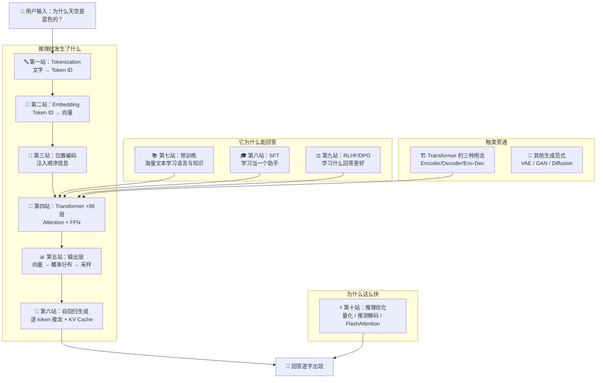

---

## 前传：从感知机到 Transformer 的演化之路

> 📖 关联笔记：basic/01、basic/02
>
> 在深入 ChatGPT 的处理流程之前，我们需要理解一个背景问题：**Transformer 是怎么来的？它解决了前辈架构的什么痛点？**

### 神经网络：学习的本质是找函数

机器学习的核心问题是**自动寻找一个函数**，将输入映射到想要的输出：


**三步走**：
1. **设定范围**——选择模型架构（线性？神经网络？Transformer？）
2. **设定目标**——定义损失函数量化"模型有多差"
3. **达成目标**——用梯度下降等优化算法调参，最小化 Loss

神经网络的基本计算单元——**神经元**——做三件事：


1. 加权求和：$z = \sum w_i x_i + b$
2. 激活函数：引入非线性（否则再多层也只是线性变换）
3. 输出

多个神经元排列成层，多层堆叠形成**深度神经网络**——这就是"深度学习"的命名由来。

### 激活函数：让网络能学非线性


| 函数 | 公式 | 优点 | 缺点 | 用在哪 |
|------|------|------|------|--------|
| **Sigmoid** | $\frac{1}{1+e^{-z}}$ | 输出在(0,1)，适合概率 | 梯度消失，深层网络难训练 | 早期网络、门控机制 |
| **ReLU** | $\max(0, z)$ | 计算简单，梯度不消失 | 死亡 ReLU（负区间梯度为零） | CNN、一般网络 |
| **GELU** | $x \cdot \Phi(x)$ | 比 ReLU 更平滑 | 计算稍复杂 | **Transformer（主流）** |
| **Softmax** | $\frac{e^{z_i}}{\sum_j e^{z_j}}$ | 输出概率分布（和为1） | 作用于整个向量 | 多分类输出层、Attention |

**关键区别**：Sigmoid 作用于单个值，Softmax 作用于整个向量，使输出形成竞争关系。

### 训练：反向传播与优化器


训练的核心循环：
1. **前向传播**：数据流过网络得到预测
2. **计算损失**：预测与真实值的差距
3. **反向传播**：用**链式法则**从后往前算每个参数的梯度
4. **更新参数**：沿梯度反方向调整权重

$$w_{t+1} = w_t - \eta \cdot \frac{\partial L}{\partial w}$$

优化器的演进最终汇聚到了 **Adam**——融合动量（惯性方向）和自适应学习率（根据梯度大小调步长）：


### CNN：空间特征的提取者

> 📖 关联笔记：basic/02（CNN 章节）

当输入是图像时，全连接网络面临的问题：一张 100×100 的彩色图有 30,000 个数值，展平后每个神经元需要 30,000 个权重——参数太多，容易过拟合。

**CNN 的核心创新：感受野 + 参数共享**


- **感受野**：每个神经元只关注图像的一个局部区域（像交警只管自己的路口）
- **参数共享**：不同位置的神经元共用同一组权重（同一个特征检测器扫过整张图）


**卷积操作**：滤波器（filter）在图像上滑动，逐元素相乘求和，输出一张**特征映射（feature map）**：


**池化（Pooling）**：缩小图像尺寸（通道数不变），没有参数，不需要学习——只是取最大值或平均值。

**CNN 擅长捕捉空间局部特征**，但它天然不擅长处理序列数据中的长距离依赖。

### RNN：时序记忆的尝试者

> 📖 关联笔记：basic/02（RNN 章节）

当输入是序列（文本、语音）时，需要的是能"记住前文"的架构。

**RNN 的核心思想**：在每个时间步，将前一时刻的隐藏状态 $h_{t-1}$ 与当前输入 $x_t$ 合并：

$$h_t = f(h_{t-1}, x_t)$$

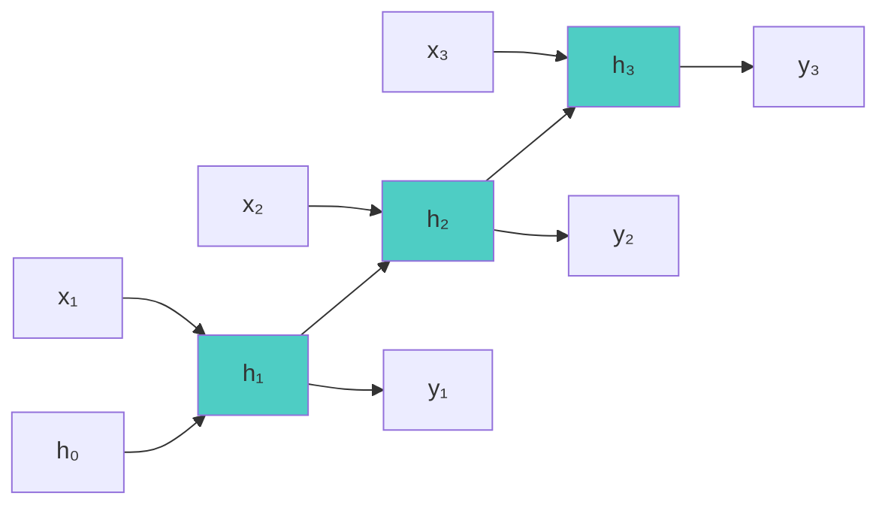


**RNN 的致命问题**：


1. **串行计算，无法并行**——每步依赖上步，GPU 算力白白浪费
2. **梯度消失**——信息经过多步传递逐步衰减，长距离依赖学不好

### LSTM：门控机制缓解梯度消失


LSTM 用**三个门**控制信息的流动：

| 门 | 作用 |
|----|------|
| **遗忘门** | 决定哪些旧信息该丢弃（打开=记得，关闭=遗忘） |
| **输入门** | 决定当前有哪些新信息值得存储 |
| **输出门** | 决定输出哪些信息给下一步 |


LSTM 缓解了梯度消失，但**串行瓶颈**始终存在——这正是 Transformer 要解决的核心问题。

### 架构演进总结

| 架构 | 擅长 | 核心限制 | 后续发展 |
|------|------|----------|----------|
| **全连接网络** | 通用近似 | 参数爆炸，无结构先验 | → CNN / RNN |
| **CNN** | 空间特征（图像） | 不擅长序列长距离依赖 | → ResNet, EfficientNet |
| **RNN/LSTM** | 时序记忆 | 串行计算，无法并行 | → **Attention → Transformer** |
| **Transformer** | 全局依赖 + 并行 | $O(n^2)$ 复杂度 | 当前主流 |

> **Transformer 的核心突破**：用 Self-Attention 让每个位置**直接关注**序列中所有其他位置，一步到位，不需要逐步传递。同时，矩阵乘法天然可并行，充分利用 GPU。

---

## 第一站：Tokenization —— 文字变碎片

> 📖 关联笔记：basic/03（Tokenization 小节）、ai-eng/ch02

### 你输入了什么

你在输入框打了：`为什么天空是蓝色的？`

但模型不认识中文字，也不认识英文单词。它的最小处理单位是 **Token**——介于字符和单词之间的"碎片"。

### 为什么不按字符或单词切？

| 方案 | 问题 |
|------|------|
| 按**字符**切（w, h, y, ...） | 序列太长，Self-Attention 的 $O(n^2)$ 复杂度会爆炸 |
| 按**完整单词**切（why, is, the, ...） | 词表太大（英语几十万词），且遇到没见过的词（OOV）就抓瞎 |
| **子词 Subword**（主流方案） | 在序列长度和词表大小之间取得平衡 |

### BPE 算法：如何切

主流的切分算法叫 **BPE（Byte Pair Encoding）**：

1. 从最小单位（字节或字符）开始
2. 统计相邻 pair 出现的频率
3. 把最高频的 pair 合并成一个新 token
4. 重复，直到词表达到预设大小

比如 `"lower"` 可能被切成 `["low", "er"]`，而常见词 `"the"` 保持完整。

GPT-3 的词表包含 **50,257 个 token**。

### 词表大小的影响

这不是一个无关紧要的设计决策——它影响整个模型的效率和能力：

| 模型 | 词表大小 | 效果 |
|------|----------|------|
| Llama 2 | 32K | 基线 |
| Llama 3 | 128K | 同样文本的 token 数减少约 **15%**，计算量节省约 **28%** |

词表越大 → 单个 token 能表达的信息越多 → 序列越短 → Attention 的 $O(n^2)$ 开销随之降低。但词表太大又会增加 Embedding 层的参数量。这是一个工程权衡。

**多语言的挑战**：训练数据中英语占 45.88%，中文仅 4.87%——低资源语言的 token 化效率差（缅甸语需要英语 10 倍的 token 数），导致模型在这些语言上表现更差、成本更高。

### 此刻发生了什么

```
"为什么天空是蓝色的？"
        ↓  BPE/SentencePiece
[token_382, token_1547, token_9821, token_44, ...]
```

你的问题变成了一串 **Token ID**（整数），准备进入下一站。

---

## 第二站：Embedding —— 数字变向量

> 📖 关联笔记：basic/03（Embedding 小节）、basic/01（神经网络基础）

### 为什么需要 Embedding

Token ID 只是一个编号（比如 382），它不携带任何语义信息。模型需要的是**向量**——一个高维空间中的点，能够表达语义关系。

### 嵌入矩阵

模型内部有一个巨大的 **嵌入矩阵** $W_E \in \mathbb{R}^{d_{\text{model}} \times |V|}$。

以 GPT-3 为例：
- $d_{\text{model}} = 12,288$（每个 token 的向量维度）
- $|V| = 50,257$（词表大小）
- 参数量：$12,288 \times 50,257 \approx$ **6.17 亿**

查找过程很简单：用 Token ID 作为索引，从矩阵中取出对应的列向量。

```
token_382 → W_E[:, 382] → 一个 12,288 维的向量
```

### 向量空间中的语义结构

这些向量不是随机的。经过训练后，嵌入空间会自发形成丰富的语义结构：

- **含义相近的词在空间中靠近**：如 "happy" 和 "joyful"
- **方向承载语义关系**：经典例子 `king - man + woman ≈ queen`
- **点积衡量对齐程度**：方向相似 → 正值，垂直 → 零，相反 → 负值

一个有趣的实验：取"复数方向向量" `cats - cat`，将它与各词做点积，会发现 one/two/three 的投影值递增——说明嵌入空间中确实编码了数量概念。

### 上下文演化

token 的初始嵌入只携带通用含义。经过多层 Attention + FFN 后，向量逐步融合完整上下文信息，最终表示与原始嵌入可能完全不同。比如"苹果"在"吃苹果"和"苹果公司"中，经过 Transformer 处理后会变成两个完全不同的向量。

### 此时的数据形态

```
[token_382, token_1547, ...]
        ↓  查表
[向量_382(12288维), 向量_1547(12288维), ...]

数据形状：序列长度 × 嵌入维度（如 15 × 12,288）
```

但这些向量还缺一个关键信息——**位置**。

---

## 第三站：位置编码 —— 告诉模型顺序

> 📖 关联笔记：basic/03（位置编码章节）

### 为什么需要位置编码

Self-Attention 本身是**置换不变**的（Permutation Invariant）——打乱输入顺序，输出不会变。但语言强烈依赖顺序："猫追狗"和"狗追猫"含义完全不同。

因此需要**位置编码（Positional Encoding）** 来注入顺序信息：

$$\tilde{x}_i = x_i + p_i$$

词向量 + 位置向量 = 最终输入。


### 三种位置编码方式

**1. 正余弦位置编码（原始 Transformer）**

$$PE_{(pos, 2i)} = \sin\left(\frac{pos}{10000^{2i/d}}\right), \quad PE_{(pos, 2i+1)} = \cos\left(\frac{pos}{10000^{2i/d}}\right)$$

不同维度使用不同频率的正余弦函数，不需要学习参数，任意两个位置的编码差异可通过线性变换表示。


**2. 可学习的位置编码（BERT）**

直接把位置编码作为可训练参数，让模型自己学习。简单但受限于最大长度（BERT 最多 512 个位置）。

**3. RoPE（旋转位置编码，现代主流）**

ChatGPT（GPT-4）和 Llama 等现代模型使用的方案。核心思想：对 Q 和 K 向量施加**旋转矩阵**，使得注意力分数只取决于**相对距离**：


$$(R_m q)^T (R_n k) = q^T R_{n-m} k$$

结果只依赖 $n - m$（两个位置的距离），而非绝对位置。

RoPE 天然具有**远程衰减**——距离越远的两个位置，注意力倾向于越小，符合自然语言的局部性：


### 此刻的数据

```
[向量_382 + 位置_1, 向量_1547 + 位置_2, ...]

每个向量现在同时携带了"我是什么词"和"我在第几个位置"的信息
```

准备进入 Transformer 的核心处理环节。

---

## 第四站：Transformer 层层处理

> 📖 关联笔记：basic/03（Transformer 架构）、basic/01（激活函数、残差连接）、basic/02（为什么需要 Attention）

这是整个旅程最核心的部分。先看 Transformer 的完整架构图：


左半部分是 **Encoder**（BERT 使用），右半部分是 **Decoder**（ChatGPT 使用）。ChatGPT 只用了右边的 Decoder 部分，但去掉了中间的 Cross-Attention（因为没有 Encoder 提供 K/V）。

GPT-3 有 **96 层** Transformer Block，每一层都包含相同的结构：


```
输入
  ↓
Multi-Head Self-Attention  ← "理解上下文关系"
  ↓ + 残差连接
Layer Normalization
  ↓
Feed-Forward Network (FFN) ← "提炼知识与推理"
  ↓ + 残差连接
Layer Normalization
  ↓
输出（传给下一层）
```

让我们逐个拆解。

### 4.1 Self-Attention：每个词都在"看"其他词


#### Q、K、V 三要素

Self-Attention 借鉴了信息检索的思想：

| 要素 | 含义 | 类比 |
|------|------|------|
| **Query (Q)** | "我在找什么" | 搜索关键词 |
| **Key (K)** | "我有什么可以匹配的" | 网页标题 |
| **Value (V)** | "匹配上后返回什么" | 网页内容 |

每个输入向量 $a_i$ 通过三个权重矩阵生成对应的 Q、K、V：

$$q_i = W^Q \cdot a_i, \quad k_i = W^K \cdot a_i, \quad v_i = W^V \cdot a_i$$


#### 计算过程

以"为什么天空是蓝色的"中"蓝色"这个词为例：

**Step 1：计算相关性**——"蓝色"的 Query 与所有词的 Key 做点积：

$$\alpha_{\text{蓝色},j} = q_{\text{蓝色}} \cdot k_j$$

- 与"天空"的相关性可能很高（天空是蓝色的）
- 与"为什么"的相关性中等（它在问原因）
- 与"是"的相关性较低（功能词）


**Step 2：缩放 + Softmax 归一化**：

$$\alpha'_{\text{蓝色},j} = \text{softmax}\left(\frac{\alpha_{\text{蓝色},j}}{\sqrt{d_k}}\right)$$

除以 $\sqrt{d_k}$ 是为了防止维度过大时点积值过大，导致 Softmax 输出趋向 one-hot（梯度消失）。

**Step 3：加权求和得到输出**：

$$b_{\text{蓝色}} = \sum_j \alpha'_{\text{蓝色},j} \cdot v_j$$


输出向量 $b_{\text{蓝色}}$ 融合了整个序列的信息，权重由相关性决定。

#### 矩阵形式（并行的关键）

将所有向量堆叠为矩阵后，整个 Self-Attention 变成三次矩阵乘法：

$$\text{Attention}(Q, K, V) = \text{softmax}\left(\frac{QK^T}{\sqrt{d_k}}\right) V$$


这就是为什么 Transformer 能充分利用 GPU 的并行能力——矩阵乘法是 GPU 最擅长的操作。**唯一需要学习的参数**：$W^Q$、$W^K$、$W^V$ 三个权重矩阵。

#### Masked Self-Attention（ChatGPT 用的版本）

ChatGPT 是基于 **Decoder** 的模型。在生成第 $t$ 个 token 时，不能看到位置 $t$ 之后的内容（因为那些还没生成）。

实现方式：在注意力分数矩阵上加一个**上三角 Mask**，将未来位置的分数设为 $-\infty$：

$$\text{score}_{masked} = \text{score} + \text{mask}$$


经过 Softmax 后，$-\infty$ 变为 0，未来位置的信息就被完全屏蔽了。

### 4.2 Multi-Head Attention：多角度理解

单个 Attention 只从一个"角度"看输入。但语言中存在多种关系——语法依赖、语义相似性、指代关系等——需要不同的关注模式。


**做法**：将 Q、K、V 沿 hidden 维度切分为多个"头"，每个头独立计算 Attention，最后拼接：

$$\text{MultiHead}(Q, K, V) = \text{Concat}(\text{head}_1, ..., \text{head}_h) \cdot W^O$$

比如 GPT-3 有 96 个头，每个头的维度是 $12288 / 96 = 128$。

不同的头可能学到不同的模式：
- 第 3 头可能关注**语法结构**（主谓搭配）
- 第 17 头可能关注**指代关系**（"它"指代什么）
- 第 42 头可能关注**语义相似性**（同义词）

#### 效率优化变体

Multi-Head 的一个问题是推理时 **KV Cache** 的内存开销很大。为此有几种变体：


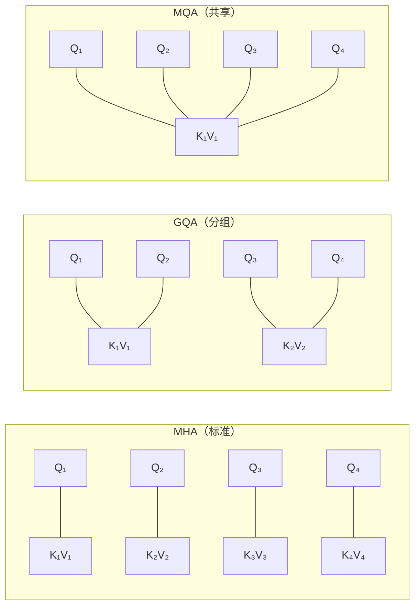

| 方法 | Q 头数 | K/V 头数 | 内存消耗 | 使用者 |
|------|--------|----------|----------|--------|
| **MHA**（标准） | h | h | 高 | 原始 Transformer |
| **GQA**（分组） | h | g | 中 | **Llama 2/3**（主流） |
| **MQA**（共享） | h | 1 | 低 | PaLM |

### 4.3 FFN（前馈网络）：知识的储藏室

Attention 负责"理解上下文关系"，FFN 则负责"提炼知识和推理"。


$$\text{FFN}(x) = W_2 \cdot \text{GELU}(W_1 \cdot x + b_1) + b_2$$

维度变化：$d_{\text{model}} \to 4d_{\text{model}} \to d_{\text{model}}$（先升维再降维）。

**为什么先升维？** 中间的高维空间让模型有更大的表达能力，可以学习更复杂的特征组合。

**关键区别**：
| 模块 | 处理方式 | 功能 |
|------|---------|------|
| **Attention** | 向量间**交互**——每个 token 与其他 token 沟通 | 理解上下文关联 |
| **FFN** | 向量**独立处理**——每个 token 各自变换 | 提炼知识、推理 |

研究表明，FFN 层存储了大量的**事实知识**。当模型回答"天空为什么是蓝色的"时，关于瑞利散射的知识就编码在 FFN 的权重中。

### 4.4 残差连接 + Layer Normalization：保持深网络可训练

**残差连接**：
$$\text{output} = x + F(x)$$

即使子层 $F(x)$ 学到的变换很小，信息也能通过恒等映射 $x$ 无损传递。这使得 96 层的深度网络依然可以训练——没有它，梯度早就消失了。

**Layer Normalization**：

$$\hat{x}_i = \frac{x_i - \mu}{\sqrt{\sigma^2 + \epsilon}}, \quad y_i = \gamma \hat{x}_i + \beta$$

两种放置方式：


| 方式 | 做法 | 特点 |
|------|------|------|
| **Post-LN**（原始 Transformer） | 先子层计算，再归一化 | 训练不太稳定，需要 warm-up |
| **Pre-LN**（现代常用） | 先归一化，再子层计算 | 训练更稳定 |

### 4.5 数据在 96 层中的演化

经过 96 层处理后，每个 token 的向量已经完全不同于最初的 Embedding：

- **底层**（第 1~30 层）：捕捉词法特征（词性、词形）
- **中层**（第 31~65 层）：捕捉句法结构（主谓宾、修饰关系）
- **高层**（第 66~96 层）：捕捉语义和推理关系

同一个"蓝色"，在第 1 层可能只知道"这是一个颜色词"，到第 96 层已经理解了"用户在问天空呈蓝色的科学原因"。

### 4.6 参数规模感知

GPT-3 的 175B 参数中，这些 Transformer 层占了绝大部分：

| 组件 | 关键矩阵 | 单层参数量（估算） |
|------|---------|-----------------|
| Self-Attention | $W^Q, W^K, W^V, W^O$ | $4 \times d^2 = 4 \times 12288^2 \approx 6$ 亿 |
| FFN | $W_1, W_2$ | $2 \times 4d \times d = 8 \times 12288^2 \approx 12$ 亿 |
| **单层合计** | | **约 18 亿** |
| **96 层合计** | | **约 1,730 亿**（加上 Embedding 约 1,750 亿） |

所有计算几乎都是**矩阵乘法**——这就是为什么 GPU（擅长大量并行矩阵运算）成为 AI 的核心硬件。

---

## 第五站：输出层 —— 从向量变回文字

> 📖 关联笔记：basic/03（输出层）、basic/04（采样机制）


### 5.1 Unembedding：向量 → 词表概率

经过 96 层 Transformer 处理后，最后一个位置的输出向量 $h_{\text{last}}$（12,288 维）需要变回一个词。

**反嵌入矩阵** $W_U \in \mathbb{R}^{|V| \times d_{\text{model}}}$：

$$\text{logits} = W_U \cdot h_{\text{last}}$$

输出是一个 50,257 维的向量（**logits**），每个维度对应词表中一个 token 的"原始分数"。

几个关键细节：
- **Logits** 是原始未归一化分数，可正可负可为零
- **训练时**：每个位置都预测下一个 token（同时计算所有位置的 logits），大幅提高数据利用效率
- **推理时**：只需要取**最后一个位置**的输出来预测下一个 token

### 5.2 Softmax + Temperature：分数 → 概率

$$P(w_i) = \frac{e^{z_i / T}}{\sum_j e^{z_j / T}}$$

其中 $T$ 是**温度参数**（Temperature），控制输出分布的"尖锐程度"：

| 温度 $T$ | 效果 | 适用场景 |
|---------|------|---------|
| $T \to 0$（贪婪） | 几乎确定选概率最高的 token | 事实问答、代码生成 |
| $T = 1$ | 原始分布 | 通用场景 |
| $T > 1$ | 分布更平坦，更随机 | 创意写作、头脑风暴 |

OpenAI API 限制温度在 $[0, 2]$ 范围内——这是工程限制，不是数学限制。

### 5.3 采样策略：不只是选最大的

直接选概率最高的 token（**Greedy Decoding**）会导致输出重复无聊。实际使用的策略更精细：

| 策略 | 原理 | 特点 |
|------|------|------|
| **Greedy** | 每步选最高概率 | 简单但重复无聊 |
| **Beam Search** | 维护 k 条最优候选 | 比 Greedy 好，但仍偏保守 |
| **Top-k** | 只从概率前 k 个中采样 | 简单，但 k 固定不够灵活 |
| **Top-p** | 只从累积概率 ≥ p 的最小集合中采样 | **自适应**——确定时保留少数，不确定时保留多个 |
| **Min-p** | 只保留概率 ≥ $p_{\max} \times \text{min\_p}$ 的 token | 结合 Top-k 的简洁和 Top-p 的自适应 |

**实践中的参数组合**：
- 事实问答：$T=0$ 或 $T=0.3, \text{top\_p}=0.9$
- 对话：$T=0.7, \text{top\_p}=0.9$
- 创意写作：$T=1.0, \text{top\_p}=0.95$

### 此刻发生了什么

```
h_last (12,288维)
    ↓ × W_U
logits (50,257维) = [2.1, -0.3, 5.7, ..., 1.2]
    ↓ Softmax (T=0.7)
概率分布 = [0.002, 0.001, 0.15, ..., 0.003]
    ↓ Top-p 采样 (p=0.9)
选中 token_9821 → "因"
```

模型生成了第一个字："因"。

---

## 第六站：自回归生成 —— 一个字一个字地"接龙"

> 📖 关联笔记：basic/03（自回归 Decoder）、basic/04（生成策略）

### 6.1 自回归过程


ChatGPT 不是一次性输出整个回答，而是**逐 token 生成**（自回归）：

| 步骤 | 输入 | 可见范围（Masked） | 生成 |
|------|------|-------------------|------|
| 1 | "为什么天空是蓝色的？" | 全部输入 | → "因" |
| 2 | "...蓝色的？因" | 输入 + "因" | → "为" |
| 3 | "...蓝色的？因为" | 输入 + "因为" | → "太" |
| ... | ... | ... | ... |
| N | "...因为太阳光...散射" | 全部已生成 | → `<EOS>` |

每一步，模型都要对之前所有 token 做 Attention，然后预测下一个 token。

**这就是你看到 ChatGPT 的回答一个字一个字出现的原因。**

**Error Propagation 问题**：一步错则步步错。早期的错误会传播到后续所有生成步骤。训练时通过 **Teacher Forcing** 缓解——直接给正确答案作为下一步输入，让模型专注于学习当前步骤。

### 6.2 KV Cache：避免重复计算

每一步都重新计算所有 token 的 K 和 V 太浪费了。**KV Cache** 把已经算过的 K 和 V 缓存下来：


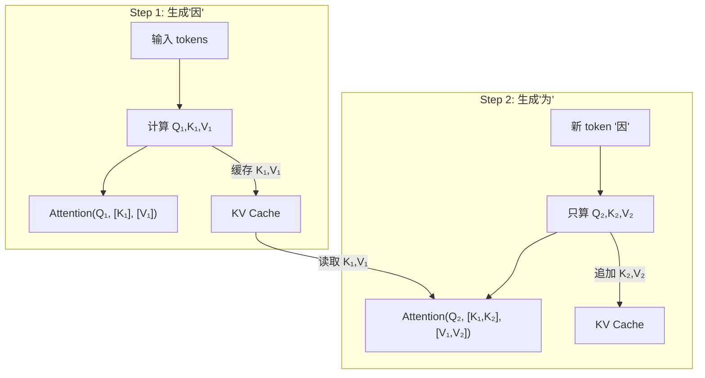

每一步只需要计算**新 token** 的 Q/K/V，然后和缓存中的 K/V 做 Attention。

**重要细节**：KV Cache 需要**逐层存储**（每层的 Attention 都会塑造 token 的表示），内存公式为：

$$\text{Memory} = 2 \times \text{precision} \times n_{\text{layers}} \times d_{\text{model}} \times \text{seqlen} \times \text{batch}$$

以 Llama 2 13B 为例：batch 32、序列 2,048、FP16 → KV Cache 需要 **54 GB**，甚至超过模型权重本身。这也是为什么 GQA、MQA 等注意力变体如此重要。

### 6.3 两阶段特性

整个推理过程实际上分为两个不同性质的阶段：

| 阶段 | Prefill（预填充） | Decode（解码） |
|------|-------------------|---------------|
| 做什么 | 并行处理用户输入的所有 token | 逐个生成输出 token |
| 瓶颈 | **Compute-bound**（计算受限） | **Memory bandwidth-bound**（带宽受限） |
| 对应指标 | **TTFT**（首 token 延迟） | **TPOT**（每 token 延迟） |

这就是你感受到的：**按下回车后有短暂等待（Prefill），然后文字开始流式出现（Decode）**。

---

## 触类旁通：Transformer 的三种用法

> 📖 关联笔记：basic/03（Encoder/Decoder 架构）、basic/04（BERT vs GPT）

ChatGPT 用的是 **Decoder-only** 架构，但 Transformer 的原始论文（"Attention Is All You Need"，2017）提出的是 **Encoder-Decoder** 结构。理解这三种用法，能帮你把 BERT、GPT、T5 等模型串联起来。

### 全景对比

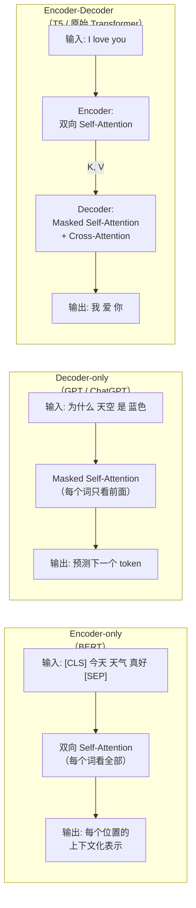

| 架构 | 代表模型 | Attention 方向 | 擅长任务 | 使用方式 |
|------|---------|---------------|---------|---------|
| **Encoder-only** | BERT | 双向（看全部） | 理解（分类、QA、NER） | Fine-tune（专才） |
| **Decoder-only** | GPT, ChatGPT | 单向（只看前面） | 生成（对话、写作） | Prompt（通才） |
| **Encoder-Decoder** | T5, 原始 Transformer | Enc 双向 + Dec 单向 | 翻译、摘要 | 两者皆可 |

### BERT：Encoder-only 的理解之王

> 📖 关联笔记：basic/04（BERT 章节）


BERT 使用 Transformer 的 **Encoder** 部分——Self-Attention **没有 Mask**，每个位置都能看到全部输入（双向）。

#### BERT 的 Embedding 层

BERT 的输入由三部分 Embedding 相加组成：

$$\text{Input} = \text{Token Embeddings} + \text{Segment Embeddings} + \text{Position Embeddings}$$

| 组件 | 作用 |
|------|------|
| Token Embeddings | 词向量（与 GPT 相同） |
| Segment Embeddings | 标记 token 属于句子 A 还是 B（用于句对任务） |
| Position Embeddings | 可学习的位置编码（最多 512 个位置） |

特殊 token：
- `[CLS]`：放在最前面，其输出用于**整个序列**的分类
- `[SEP]`：分隔两个句子

#### BERT 的预训练任务

BERT 使用**自监督学习**——数据本身提供标签：

**任务一：MLM（掩码语言模型）——"完形填空"**

随机遮住 15% 的 token，让模型预测被遮住的词：

- 80% 替换为 `[MASK]`
- 10% 替换为随机词
- 10% 保持不变

$$\mathcal{L}_{\text{MLM}} = -\sum_{i \in \text{masked}} \log P(x_i | x_{\backslash i})$$

**任务二：NSP（下一句预测）**

判断两个句子是否在原文中相邻。后续研究表明帮助有限。

#### BERT 的下游任务

BERT 的强大之处在于**一个模型适配多种任务**——只需要换"头部"：

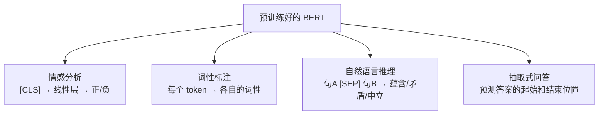

#### BERT vs GPT 核心对比

| 维度 | BERT | GPT / ChatGPT |
|------|------|----------------|
| 架构 | Transformer **Encoder** | Transformer **Decoder** |
| Attention 方向 | **双向**（看全部） | **单向**（只看前面） |
| 预训练任务 | 填空（MLM） | 接龙（Next Token Prediction） |
| 擅长 | 理解类任务（分类、QA） | 生成类任务（对话、写作） |
| 使用方式 | 专才（Fine-tune + 任务头） | 通才（Prompt / In-context Learning） |

**BERT 的直觉**：它是 CBOW（上下文预测中心词）的深度版本，通过多层 Transformer 捕捉深层语义关系，生成**上下文化词向量**——同一个字在不同上下文中会有不同的向量表示。

### Encoder-Decoder 与 Cross-Attention：翻译是怎么做的

> 📖 关联笔记：basic/03（Cross-Attention 章节）

原始 Transformer 是为机器翻译设计的 Encoder-Decoder 结构。关键在于 **Cross-Attention**——Decoder 如何"回看" Encoder 的输出：


| 来源 | 在 Cross-Attention 中的角色 |
|------|---------------------------|
| **Decoder** 当前层 | 提供 **Q**（"我在找什么"） |
| **Encoder** 最终输出 | 提供 **K 和 V**（"输入中有什么可以参考的"） |

这使得 Decoder 在生成每个 token 时，都能"回顾"完整的输入序列。

#### 翻译示例："I love you" → "Ich liebe dich"

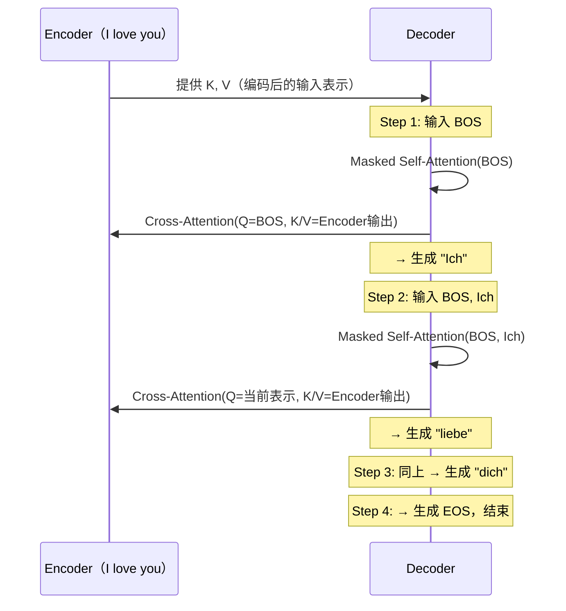

**ChatGPT 为什么不需要 Cross-Attention？**

因为 ChatGPT 是 Decoder-only——用户输入和模型输出在**同一个序列**中处理。用户的问题作为"前缀"，模型在此基础上续写。不需要单独的 Encoder，也不需要 Cross-Attention 桥梁。

### Copy Mechanism：有时候直接抄更好


有些输出可以直接从输入中复制（人名、专有名词、代码变量等）。Pointer Network 让模型可以选择"从词表生成"或"从输入复制"——这在摘要、代码编辑等任务中非常有用。

---

## 第七站：它为什么能回答？—— 训练的三个阶段

> 📖 关联笔记：basic/04（自监督学习、ChatGPT 三阶段、Post-Training）、basic/05（强化学习、RLHF）、ai-eng/ch02、ch07

到这里，你已经知道了推理时发生的一切。但更根本的问题是：**模型的参数是怎么学到的？为什么它知道瑞利散射？为什么它会用人类喜欢的方式回答？**

### 7.1 阶段一：预训练 —— 在互联网上"读书"


**目标**：学习语言的统计规律和世界知识。

**方法**：给模型看海量文本，让它预测下一个 token：

$$P(x_t | x_1, x_2, \ldots, x_{t-1})$$

这就是**自监督学习**——数据本身就提供了标签，不需要人工标注。

**规模感知**：
- GPT-3：在 **300B tokens** 上训练
- Llama 3 70B：**15T tokens**，远超 Chinchilla Scaling Law 建议的最优点
- 训练数据来源：Common Crawl（互联网爬取）、书籍、Wikipedia、GitHub 代码等

**训练数据的质量至关重要**：
- 数据不是简单的"燃料"，而是**能力设计**
- 只喂 Wikipedia 得到百科全书型模型，只喂 GitHub 得到代码机器人
- 代码占比从 5%→20% 会显著增强逻辑推理但削弱日常对话
- 去重是最关键的数据处理步骤——避免 Benchmark 数据泄漏

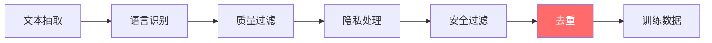

**Scaling Law**（Chinchilla，2022）：训练 token 数应约为参数量的 **20 倍**。但工业界常"过训练"（如 Llama 3 用 15T tokens 训练 70B 模型），因为训练是一次性成本，推理是持续成本。

**知识压缩**：预训练过程中，Embedding 空间自发形成语义结构（如 king - man + woman ≈ queen）。多层结构中，底层捕捉词法特征，高层捕捉语义和推理关系。

**这个阶段消耗了整个训练过程约 98% 的计算资源。**

### 7.2 阶段二：SFT（监督微调）—— 学当助手

**问题**：预训练完的模型只是一个"文字接龙机器"。你输入"为什么天空是蓝色的？"，它可能接着输出"这是一道考试题"而非回答你。

**解决**：用高质量的「指令-回答」对进行微调：

```
指令："为什么天空是蓝色的？"
回答："天空呈蓝色是因为瑞利散射......"
```

**关键发现**（LIMA, 2023）：约 **1,000 条精选高质量数据** 就能显著改变模型行为——数据质量远比数量重要。

**训练细节**：
- 只对 **output 部分** 计算 loss，input 不参与梯度计算
- 学习率比预训练低 1-2 个数量级（避免灾难性遗忘）
- 通常只需 1-3 个 epoch
- InstructGPT 后训练仅用 **2%** 计算量，98% 在预训练

**SFT 数据分布**（InstructGPT）：

| 任务类型 | 占比 |
|----------|------|
| Generation（生成） | 45.6% |
| Open QA（开放问答） | 12.4% |
| Brainstorming（头脑风暴） | 11.2% |
| Chat（聊天） | 8.4% |
| 其他 | 22.4% |

**SFT 的局限**：上限受限于标注者水平，且只学正例不学反例。

### 7.3 阶段三：RLHF / DPO —— 学什么更好

**核心动机**：SFT 教"怎么回复"，偏好微调教"哪种回复更好"。

关键洞察：**判断比生成更容易**。你不一定能写出完美回答，但你能判断哪个回答更好。这可能让模型超越标注者水平。

#### RLHF 流程

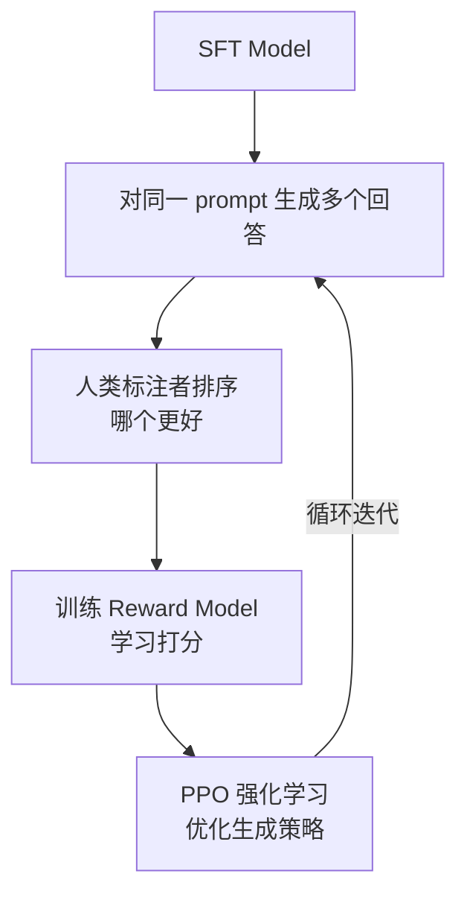

这里用到了**强化学习**的核心思想：


- **Agent**（模型）在**环境**（对话场景）中采取**动作**（生成 token），获得**奖励**（Reward Model 的打分）
- 目标：最大化奖励的期望值

为防止模型偏离太远，加入 **KL 散度惩罚项**：
$$\text{reward} = r(x, y) - \beta \cdot D_{KL}[\pi_\theta(y|x) \| \pi_{SFT}(y|x)]$$

#### RLHF vs DPO

| 维度 | RLHF | DPO |
|------|------|-----|
| 是否需要 Reward Model | 是 | **否**（直接从偏好数据优化） |
| 训练方式 | 在线（Online） | 离线（Offline） |
| 训练稳定性 | 低（4 个模型协同） | 高 |
| 计算成本 | 高 | 低 |
| 探索能力 | 有（可能发现更好回答） | 无 |
| 适用场景 | 大规模前沿模型 | 资源有限、快速迭代 |

#### DeepSeek-R1 的四阶段训练

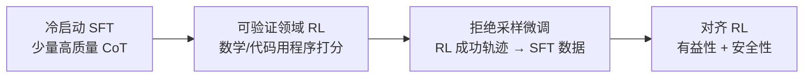

### 7.4 PEFT 与 LoRA —— 高效微调

全参微调一个 7B 模型需要约 **56 GB** 内存（权重 14GB + 梯度 14GB + 优化器状态 28GB）。LoRA 提供了高效替代：

**核心思想**：微调时权重更新 $\Delta W$ 具有很低的秩，用两个小矩阵的乘积近似：

$$W' = W + \frac{\alpha}{r} \times A \times B$$

其中 $A \in \mathbb{R}^{d \times r}$，$B \in \mathbb{R}^{r \times d}$，$r \ll d$（通常 4~64）。

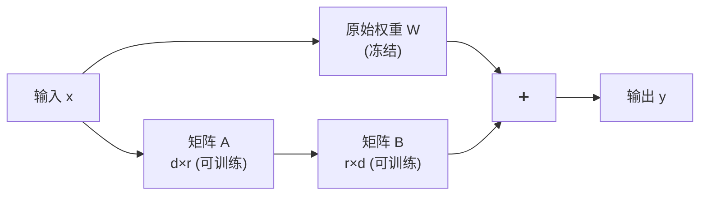

| 指标 | 全参微调 | LoRA |
|------|---------|------|
| GPT-3 175B 可训练参数 | 175B (100%) | **4.7M (0.0027%)** |
| 效果 | 基线 | 相当甚至更好 |
| 推理额外开销 | 无 | **零**（训练后合并） |
| 多任务部署 | 100 个任务 = 100 份完整权重 | 1 份 W + 100 个轻量 adapter |

**QLoRA** 更进一步：用 4-bit NF4 格式存储权重，使 **65B 参数模型可在单块 48GB GPU 上微调**。

### 7.5 幻觉问题 —— 模型也会"编造"

模型为什么会生成看似正确但实际错误的内容？

| 类型 | 说明 | 示例 |
|------|------|------|
| **事实性幻觉** | 与客观事实不符 | 编造不存在的论文 |
| **忠实性幻觉** | 与输入上下文不符 | 摘要中包含原文没有的信息 |

**根因**：
- 训练数据包含错误信息
- 知识截止于训练日期
- 模型优化的是"看起来像"而非"事实正确"
- **Snowballing**：模型无法区分用户输入和自己的生成，将自己编造的内容当作事实继续展开
- SFT 标注者使用了模型不具备的知识来写回复，等于教模型"编造"

**缓解策略**：
- **RAG（检索增强生成）**：从外部知识库检索相关文档作为依据
- **引用归因**：要求模型为事实陈述提供来源
- **Self-Consistency**：多次采样检查答案一致性
- **Post-hoc 验证**：用另一个模型或工具验证生成内容

### 7.6 Test-Time Compute：推理时也能变强

> 📖 关联笔记：basic/04（Test-Time Compute 章节）

**核心洞察**：在推理时投入更多计算，同样可显著提升质量。**小模型 + 多次推理**有时可超越**大模型 + 单次推理**。

| 策略 | 原理 | 效果 |
|------|------|------|
| **Chain of Thought (CoT)** | 要求模型逐步推理（"Let's think step by step"） | 中 |
| **Self-Consistency** | 多次采样，对最终答案多数投票 | 中-高 |
| **Best-of-N** | 生成 N 个候选，用 Reward Model 选最好的 | 高 |
| **Verifier** | 训练验证器筛选候选（小模型+验证器可媲美 30 倍大模型） | 高 |
| **Tree of Thought** | 推理过程组织为树结构，搜索最优路径 | 高 |

---

## 触类旁通：其他生成范式

> 📖 关联笔记：basic/05（图像生成模型、GAN）

ChatGPT 使用**自回归**方式逐 token 生成文本。但 AI 的生成能力远不止这一种范式。

### 图像生成：一次到位 vs 逐步去噪

文字逐 token 生成可行，但图像有成千上万像素——逐像素太慢。图像生成采用不同的范式：


| 模型 | 核心思路 | 生成步数 | 特点 |
|------|---------|---------|------|
| **VAE** | 压缩到正态分布空间 → 解码还原 | 1 步 | 快但模糊 |
| **Flow** | 可逆编码，精确的概率建模 | 1 步 | 训练稳定 |
| **GAN** | Generator 与 Discriminator 对抗博弈 | 1 步 | 图像锐利，训练不稳定 |
| **Diffusion** | 从纯噪声逐步去噪 | N 步 | **质量最高**，DALL-E/Stable Diffusion |

### GAN：警察与小偷的博弈


- **Generator（小偷）**：造假币，目标是骗过判别器
- **Discriminator（警察）**：鉴别真假，目标是分辨真实数据和生成数据
- 两者互相博弈，螺旋上升

**核心挑战**：原始 GAN 使用 JS Divergence 衡量分布差异，当两个分布不重叠时（高维空间中几乎总是如此），梯度信号为零——Generator 无法学习。


**WGAN 的解决方案**——Wasserstein Distance（推土机距离）：即使两个分布完全不重叠，也能反映它们的远近：


### Diffusion Model：现代图像生成的主流


- **训练**：对真实图像逐步加噪声直到变成纯噪声，训练模型学会"去噪"
- **生成**：从纯噪声出发，逐步去噪还原出清晰图像

这正是 DALL-E、Stable Diffusion、Midjourney 背后的核心技术。

> **有趣的联系**：非自回归文本生成（一次性生成所有 token 并迭代精化）在精神上与 Diffusion Model 相似——都是"多次逐步优化"。

### 生成范式的统一视角

| 范式 | 代表 | 特点 | 与 ChatGPT 的关系 |
|------|------|------|------------------|
| **自回归** | GPT / ChatGPT | 逐步生成，质量高 | **ChatGPT 使用的方式** |
| **对抗训练** | GAN | 两个网络博弈 | RLHF 中有类似对抗思想 |
| **扩散模型** | DALL-E | 逐步去噪 | 非自回归文本生成的灵感来源 |
| **编码-解码** | VAE | 压缩再还原 | Encoder-Decoder Transformer |

---

## 第八站：为什么这么快？—— 推理优化

> 📖 关联笔记：basic/05（推理优化、Reformer）、ai-eng/ch09

GPT-4 有数千亿参数，每次推理都要做大量矩阵乘法。你的问题能在几秒内得到回答，背后有一整套优化技术栈。

### 三层优化框架

| 层级 | 类比 | 典型方法 | 是否改变模型 |
|------|------|----------|------------|
| **模型级** | 制作更好的箭 | 量化、蒸馏、剪枝 | 是（可能影响质量） |
| **硬件级** | 更强的弓箭手 | GPU/TPU 升级 | 否 |
| **服务级** | 优化射击过程 | 批处理、Prompt Caching、推测解码 | **否（不应改变质量）** |

### 模型级：量化

将模型参数从高精度转为低精度：FP32 → FP16 → INT8 → INT4

每降一级精度，模型体积约缩小一半，推理速度显著提升，精度损失在大多数任务上可以接受。

**QLoRA** 更进一步：用 4-bit NF4 格式存储权重，使 **65B 参数模型可在单块 48GB GPU 上微调**。

### 模型级：蒸馏与剪枝

**蒸馏**：用小模型（学生）学习大模型（教师）的输出概率分布（soft labels），继承大模型的"知识"。

**剪枝**：移除模型中不重要的部分（整个注意力头、层、或单个参数）。实践中不如量化和蒸馏常用。

### 服务级：推测解码

这是最巧妙的优化之一，**不改变输出质量**：

1. 用一个**小而快的草稿模型**（如 4B）先快速生成 K 个候选 token
2. 用**大目标模型**（如 70B）**并行验证**这 K 个 token
3. 接受正确的部分，从第一个错误处重新生成

**为什么有效**：
- 验证可以并行（类似 Prefill），比逐个生成快得多
- 自然语言中大量 token 高度可预测（常见词、语法结构词），小模型也能猜对
- Decode 阶段 GPU 计算单元大量闲置（带宽受限），正好用来做验证

DeepMind 实验：4B 草稿模型 + 70B 目标模型，**延迟降低超过 50%**，输出质量完全不变。

### 服务级：FlashAttention

GPU 内存分层：SRAM（20MB, 10TB/s）→ HBM（80GB, 1.5TB/s）。标准 Attention 需要多次在 HBM 和 SRAM 之间搬运数据。

FlashAttention 将多个操作（Matmul → Mask → Softmax → Dropout → Matmul）**融合为单个 GPU 内核**，从多次读写减少到一次。

### 服务级：Prompt Caching

同一应用的大量请求共享相同文本段（尤其是 System Prompt）。缓存重复内容的处理结果，后续请求直接复用。

| 场景 | 无缓存 TTFT | 有缓存 TTFT | 成本节省 |
|------|-----------|----------|---------|
| 100K token 读书对话 | 11.5s | 2.4s（−79%） | **−90%** |
| 10K token Many-shot | 1.6s | 1.1s（−31%） | **−86%** |
| 10 轮多轮对话 | ~10s | ~2.5s（−75%） | **−53%** |

### 服务级：Continuous Batching

传统批处理中，一批请求要等最慢的那个完成才能全部返回。**Continuous Batching** 让完成的请求立即返回，空位立即填入新请求——最优效率。

### 服务级：Prefill/Decode 解耦

Prefill 是 compute-bound，Decode 是 bandwidth-bound——同机器运行会资源竞争。将它们分配到不同 GPU 实例：

| 场景 | Prefill : Decode 比例 |
|------|----------------------|
| 输入长、优先降低 TTFT | 2:1 到 4:1 |
| 输入短、优先降低 TPOT | 1:2 到 1:1 |

### Reformer：长序列的特殊优化

> 📖 关联笔记：basic/05（Reformer 章节）

标准 Attention 复杂度 $O(n^2)$，序列长度翻倍，计算量变为 4 倍。Reformer 的两个创新：


**LSH Attention**：用哈希将 Q/K 分桶，每个 query 只与同桶的 key 计算注意力——复杂度从 $O(n^2)$ 降到接近 $O(n)$。


**可逆残差层**：给定输出可反向计算出输入，不需要保存每层的中间激活值——内存从与层数成正比降到几乎无关。

### 优化效果叠加

以 Llama-7B 为例，多种优化组合的效果：

```
原始                → 25.5 tok/s/user
+ torch.compile    → 107.0 tok/s（4.2×）
+ INT8 量化        → 157.4 tok/s（1.5×）
+ INT4 量化        → 202.1 tok/s（1.3×）
+ 推测解码         → 244.7 tok/s（1.2×）
──────────────────────
总计提升接近 10 倍
```

---

## 回顾：一个问题的完整旅程

```
你输入："为什么天空是蓝色的？"
    │
    ├── [Tokenization] 文字 → Token ID 序列
    │     └─ BPE 子词算法，词表 ~50K
    │
    ├── [Embedding] Token ID → 12,288 维向量
    │     └─ 嵌入矩阵查表，向量携带语义
    │
    ├── [位置编码] 向量 + 位置信息
    │     └─ RoPE 旋转编码，编码相对距离
    │
    ├── [Transformer ×96层]
    │     ├─ Masked Self-Attention: 每个词关注前面所有词
    │     ├─ Multi-Head (96头): 从不同角度理解
    │     ├─ FFN: 从权重中提取知识（瑞利散射等）
    │     └─ 残差连接 + LayerNorm: 保持梯度流通
    │
    ├── [输出层] 最后一个位置的向量 → 概率分布
    │     └─ Unembedding → Logits → Softmax(T=0.7)
    │
    ├── [采样] Top-p=0.9 采样 → "因"
    │
    ├── [自回归] 重复上述过程，逐字生成
    │     └─ KV Cache 避免重复计算
    │
    └── [停止] 生成 <EOS> 或达到最大长度

你看到回答："因为太阳光经过大气层时，波长较短的蓝光
被空气分子散射的程度远大于波长较长的红光......"
```

**而这一切之所以可能，是因为：**

```
训练阶段：
  ├── 预训练（98% 算力）: 在 15T tokens 上学习语言和知识
  ├── SFT（~1% 算力）: 用 ~1000 条高质量数据学当助手
  └── RLHF/DPO（~1% 算力）: 从人类偏好中学什么回答更好

部署阶段：
  ├── 量化: FP16 → INT8/INT4，模型体积减半
  ├── KV Cache + GQA: 减少内存开销
  ├── 推测解码: 延迟降低 50%
  ├── FlashAttention: GPU 内存读写优化
  └── Continuous Batching + Prompt Caching: 服务效率最大化

触类旁通：
  ├── BERT: 同样的 Transformer，但双向 Encoder，擅长理解
  ├── T5: Encoder-Decoder + Cross-Attention，擅长翻译/摘要
  ├── GAN/Diffusion: 图像生成的对抗与去噪范式
  └── LoRA: 0.0027% 参数高效微调
```

---

## 知识点索引

> 以下列出本文涉及的所有知识点及其在原始笔记中的位置，方便你深入阅读。

### 深度学习基础（basic/01）
- 机器学习三步走（设定范围/目标/优化）
- 训练四大问题：Model Bias、Optimization Issue、Overfitting、Mismatch
- 神经元、多层网络、深度学习命名由来
- 激活函数：Sigmoid / tanh / ReLU / GELU / Softmax
- 损失函数：MSE、MAE、交叉熵（为什么分类不用 MSE）
- 反向传播与链式法则
- 梯度下降：BGD / SGD / Mini-batch GD
- 优化技巧：Momentum、AdaGrad、RMSProp、**Adam**
- Critical Point、鞍点、Hessian 矩阵判断
- Batch Size 对泛化的影响（小 batch → 平坦最小值 → 泛化更好）
- Batch Normalization / Layer Normalization
- 学习率 Warm Up、学习率调度
- Scaling Law（Chinchilla）、过训练策略、数据工程

### CNN 与 RNN（basic/02）
- **CNN**：感受野、参数共享、卷积操作（Filter 视角）、特征映射、池化
- **RNN**：隐藏状态、参数共享（时间步共用权重）、BPTT
- 梯度消失/梯度爆炸的根因与解决方案
- **LSTM**：遗忘门 / 输入门 / 输出门 + 细胞状态
- **GRU**：重置门 / 更新门（LSTM 的精简版）
- RNN 应用模式：一对多、多对一、多对多（Seq2Seq）
- CNN vs RNN 对比总结

### 注意力机制与 Transformer（basic/03）
- Attention 动机与 Q/K/V 三要素
- 相关性计算方式（点积 / 缩放点积 / 余弦 / 神经网络）
- Self-Attention 的矩阵形式与并行计算
- Multi-Head Attention 与变体（**MHA / GQA / MQA**）
- **KV Cache** 原理、逐层存储、内存计算公式
- 位置编码：正余弦 / 可学习 / **RoPE**（旋转位置编码）
- Transformer 完整架构：Encoder / Decoder / Encoder-Decoder
- 残差连接、Pre-LN vs Post-LN
- **Masked Self-Attention**（Decoder 的因果遮罩）
- **Cross-Attention**（Encoder-Decoder 的桥梁）
- FFN 结构（升维→激活→降维）
- Tokenization（BPE）、Embedding / Unembedding
- 上下文窗口（Context Window）
- 温度采样、Teacher Forcing、Copy Mechanism
- Transformer 替代架构：RWKV、Mamba、Jamba

### 预训练与生成式 AI（basic/04）
- 自监督学习（MLM / Next Token Prediction）
- **BERT**：Embedding 层（Token + Segment + Position）、MLM + NSP、五种下游任务
- **GPT / ChatGPT**：三阶段训练（Pre-train → SFT → RLHF）
- Post-Training：SFT 数据质量 > 数量（LIMA 1000 条）、偏好微调
- **RLHF** vs **DPO**：Reward Model、Bradley-Terry、KL 惩罚
- **DeepSeek-R1**：四阶段训练（冷启动 SFT → 可验证 RL → 拒绝采样 → 对齐 RL）
- **PEFT 与 LoRA**：低秩近似、QLoRA、Multi-LoRA 部署、DoRA/LoRA+/MoRA 变体
- 采样机制：Greedy / Beam Search / Top-k / **Top-p** / Min-p
- 结构化输出：Constrained Decoding、JSON Mode、Function Calling
- Test-Time Compute：CoT / Self-Consistency / Best-of-N / Verifier / Tree of Thought
- Eval/Grader/Reward 体系、ORM vs PRM
- **幻觉问题**：事实性/忠实性、Snowballing、缓解策略（RAG/引用/一致性检查）

### 生成模型与强化学习（basic/05）
- 图像生成四大模型：**VAE / Flow / Diffusion / GAN**
- GAN：Generator vs Discriminator、JS Divergence 问题、**Wasserstein Distance**
- 强化学习五要素（Agent/Environment/Observation/Action/Reward）
- Policy Network、梯度上升、探索与利用
- **Actor-Critic**：蒙特卡洛 vs 时序差分（TD）
- **Reformer**：LSH Attention（$O(n^2) \to O(n)$）、可逆残差层
- 推理优化三层框架：模型级（量化/蒸馏/剪枝）、硬件级、服务级
- **推测解码**：草稿模型 + 目标模型并行验证
- Agent 训练：Harness 概念、Meta-Harness、实时 RL

### AI 工程实践（ai-engineering）
- 基础模型与训练数据（ch02）：数据质量、多语言不均、领域专用模型
- Prompt 工程最佳实践（ch05）：清晰指令、充分上下文、任务分解、CoT、迭代优化
- 微调概述（ch07）：迁移学习、四种微调类型（自监督/SFT/偏好/长上下文）
- 推理优化概述（ch09.0）：Compute-bound vs Bandwidth-bound、Prefill vs Decode、TTFT/TPOT/Goodput/MFU
- 推理优化技术（ch09.1）：**FlashAttention**、**PagedAttention**（vLLM）、Continuous Batching、Prompt Caching、Prefill/Decode 解耦、并行策略（Replica/Tensor/Pipeline）
