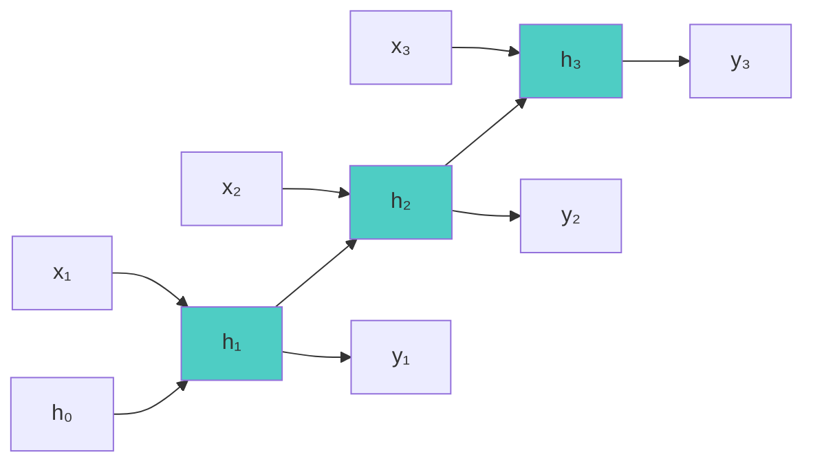
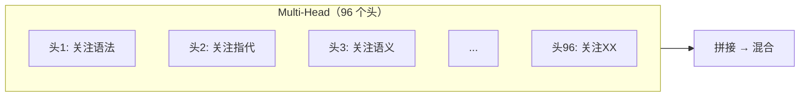
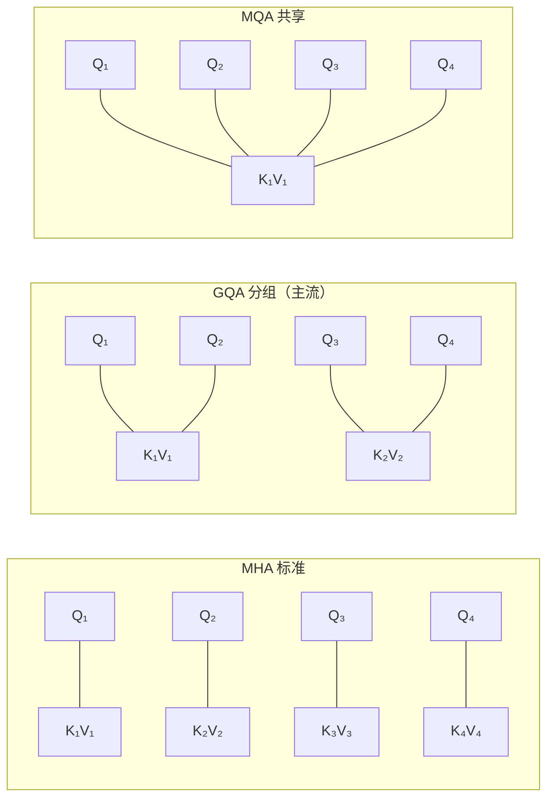
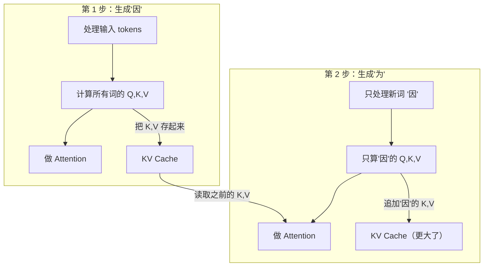
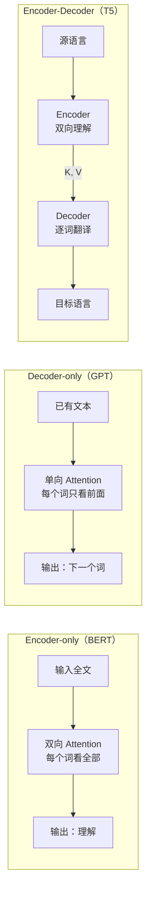
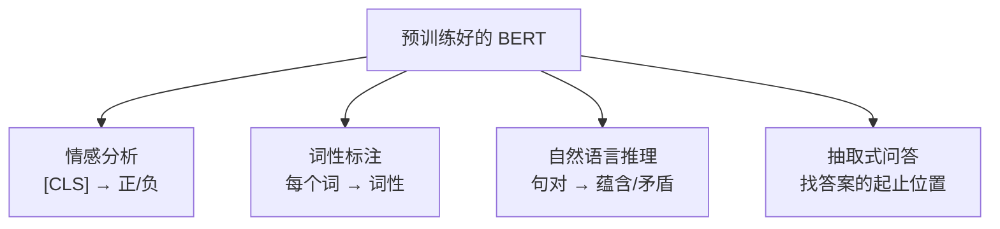
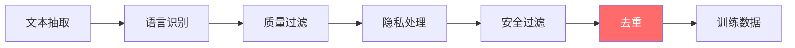
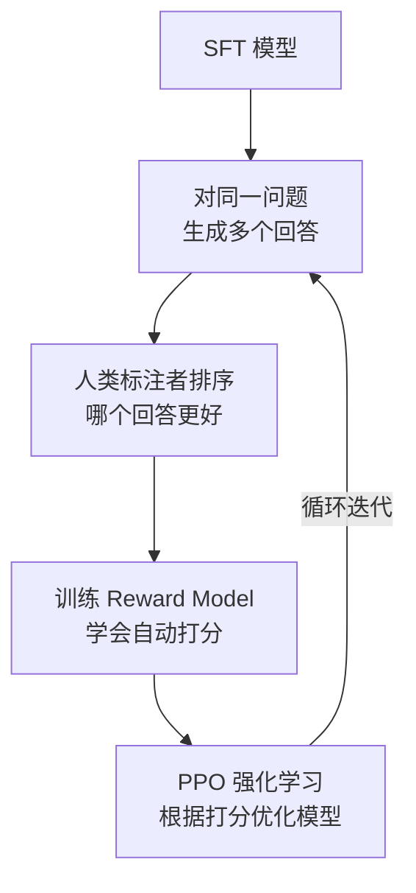
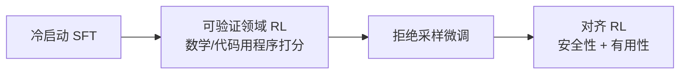

# 从一个问题的旅程看 AI 全貌

> 当你在 ChatGPT 中输入"为什么天空是蓝色的？"并按下回车，背后发生了什么？
> 本文从这个简单的动作出发，把整条链路拆成 8 个站点，用通俗的语言串联所有核心知识点。

---

## 全景地图

```
你输入："为什么天空是蓝色的？"
    │
    │  ─── 推理：数据经历了什么 ───
    │
    ├── 第一站  Tokenization    把文字切成碎片
    ├── 第二站  Embedding       把碎片变成有意义的向量
    ├── 第三站  位置编码        告诉模型谁在前谁在后
    ├── 第四站  Transformer     96 层反复"读"和"想"
    ├── 第五站  输出层          从向量变回文字
    ├── 第六站  自回归生成      一个字一个字地"接龙"
    │
    │  ─── 为什么能回答 ───
    │
    ├── 第七站  训练三阶段      预训练 → SFT → RLHF
    │
    │  ─── 为什么这么快 ───
    │
    └── 第八站  推理优化        量化 / 推测解码 / FlashAttention
```

---

## 前传：从感知机到 Transformer

> 📖 关联笔记：basic/01、basic/02
>
> 在深入 ChatGPT 之前，先花几分钟看看它的"祖先们"——这样你就能理解 Transformer 解决了什么问题。

### 神经网络：用函数来学习

机器学习的本质就是一件事：**自动找一个函数**，把输入映射到想要的输出。


三步走：
1. **设定范围**——选用什么模型（线性模型？神经网络？Transformer？）
2. **设定目标**——定义"预测有多差"的衡量标准（损失函数）
3. **达成目标**——不断微调参数，让损失越来越小

神经网络的基本单元是**神经元**——它做的事很简单：把输入加权求和，过一个"激活函数"引入非线性（否则再多层堆起来效果和一层一样），然后输出。多个神经元排成一层，多层叠起来，就是"深度学习"名字的由来。

### 激活函数：让网络能学"弯弯绕"

几个关键的激活函数，后面会反复遇到：

| 函数 | 一句话 | 用在哪 |
|------|--------|--------|
| **Sigmoid** | 把任意数压到 0~1 之间，适合表示概率 | 早期网络、门控机制（LSTM） |
| **ReLU** | 正数原样输出，负数变成零。简单粗暴但好用 | CNN、一般网络 |
| **GELU** | 像"柔化版的 ReLU"——小负数不完全截断 | **Transformer**（主流） |
| **Softmax** | 把一组数变成"概率分布"（加起来等于1） | 分类输出、Attention 权重 |

### 训练：反向传播


训练就是不断重复四步：
1. **前向**：数据流过网络，得到预测结果
2. **算损失**：预测和答案差多远
3. **反向**：从后往前算"每个参数对损失的影响有多大"（梯度）
4. **调参**：沿着"让损失变小"的方向微调每个参数

> 类比：你闭着眼睛在山上，想走到最低的山谷。每一步，你先用脚感受一下哪个方向是下坡的（算梯度），然后朝那个方向迈一步（更新参数），步幅由"学习率"控制。

优化器最终演化到了 **Adam**——它像一个聪明的登山者，既记住了"最近一直在往哪走"（动量），又根据地形的陡缓自动调整步幅（自适应学习率）。

### CNN：看图的专家

> 📖 关联笔记：basic/02

当输入是图像时，用全连接网络太浪费——一张 100×100 的彩色图有 3 万个像素值，每个神经元都要连 3 万个权重，参数爆炸。

**CNN 的核心想法**：
- **感受野**：每个神经元只看图像的一小块区域（像交警只管自己路口）
- **参数共享**：用同一个"滤波器"扫过整张图，不管特征出现在哪个位置都能被检测到

> 类比：你用一个 3×3 的放大镜在照片上滑动。每到一个位置，放大镜就输出一个"这里有没有横线/竖线/边缘"的分数。扫完整张图，就得到一张"特征图"。

CNN 擅长捕捉**空间局部特征**，但对序列中的长距离依赖无能为力。

### RNN：有记忆的网络

> 📖 关联笔记：basic/02

处理文本或语音这样的序列数据时，需要"记住前文"。RNN 的做法是：每读一个词，就把"到目前为止的记忆"和"当前新词"揉在一起，产生新的记忆。




**RNN 的致命缺点**：
1. **串行处理**——必须一个词一个词来，没法并行，GPU 算力白白浪费
2. **健忘**——信息经过很多步传递后逐渐衰减（梯度消失），记不住远处的内容

**LSTM** 用"门控机制"缓解了健忘问题：


> 类比：想象你在看一本很长的小说。普通 RNN 就像只靠脑子记——越看越忘前面的情节。LSTM 加了一个笔记本（细胞状态），还有三支笔：
> - **遗忘门**：这段情节不重要了，从笔记本上擦掉
> - **输入门**：这个新信息很关键，记到笔记本上
> - **输出门**：现在需要回忆哪些内容

LSTM 记忆力好了很多，但**串行问题**始终没解决——这正是 Transformer 要突破的。

### 架构演进总结

| 架构 | 擅长 | 核心限制 | 后续 |
|------|------|----------|------|
| **全连接网络** | 通用 | 参数爆炸 | → CNN / RNN |
| **CNN** | 图像 | 不擅长远距离依赖 | → ResNet |
| **RNN/LSTM** | 序列 | 串行，无法并行 | → **Transformer** |
| **Transformer** | 全局依赖 + 并行 | 计算量随序列长度平方增长 | 当前主流 |

> **Transformer 的核心突破**：让每个词**直接看到**所有其他词，一步到位，不用排队传话。同时全靠矩阵乘法，GPU 可以全速并行。

了解了这些背景，我们来看那个问题按下回车之后，数据经历了怎样的旅程。

---

## 第一站：Tokenization —— 文字变碎片

> 📖 关联笔记：basic/03、ai-eng/ch02

你输入了：`为什么天空是蓝色的？`

但模型只认数字，不认文字。第一步必须把文字**切碎并编号**。

### 怎么切？

| 方案 | 问题 |
|------|------|
| 按字符切（每个字母一个） | 序列太长，后面计算量爆炸 |
| 按整词切（每个单词一个） | 词表太大，遇到没见过的词就抓瞎 |
| **按子词切**（主流） | 折中——常见的词保持完整，罕见的词拆成更小的片段 |

主流的切分算法叫 **BPE（Byte Pair Encoding）**：

> 类比：想象你在学一门外语。一开始你只认识单个字母。然后你注意到 "th" 经常一起出现，就把它当成一个整体来记。接着 "the" 出现得更多，也合并成一个整体……BPE 就是不断合并最频繁的字符组合，直到词表达到预设大小（GPT-3 约 5 万个 token）。

### 词表大小的影响

这个设计决策直接影响效率：Llama 2 的词表有 32K 个 token，Llama 3 扩大到 128K 后，同样的文本切出来的 token 数减少了约 15%，计算量节省约 28%。

词表越大 → 每个 token 承载的信息越多 → 序列越短 → 后面的计算越省。但太大的词表又会让模型参数膨胀，所以要找平衡。

### 此刻发生了什么

```
"为什么天空是蓝色的？"
        ↓ 切分
["为什么", "天空", "是", "蓝色", "的", "？"]
        ↓ 查词表编号
[382, 1547, 92, 9821, 44, 8]
```

问题变成了一串**整数编号**。这些编号本身没有含义，只是词表里的索引。

---

## 第二站：Embedding —— 数字变向量

> 📖 关联笔记：basic/03、basic/01

### 为什么不能直接用编号

编号 382 和 383 在数值上相邻，但对应的词可能完全无关。如果直接用编号做计算，模型就会被数值上的假关系误导。

我们需要的是**向量**——一个多维空间里的坐标点。在这个空间里，含义相近的词应该离得近，含义无关的词离得远。

### 怎么把编号变成向量

模型内部有一个**嵌入矩阵**——你可以把它想象成一本巨大的字典：

> 类比：想象一本有 5 万页的大辞典（词表大小）。每一页对应一个 token，页面内容不是文字解释，而是一串 12,288 个数字（GPT-3 的向量维度）。这串数字就是模型眼中这个词的"身份证"。
>
> 拿到 Token ID = 382，就翻到第 382 页，取出那串数字——这就是 Embedding。

光嵌入矩阵本身就有约 **6 亿**个参数（5 万 × 12,288）。

### 向量空间的神奇结构

经过训练后，这个空间会自发形成语义结构：

- **近义词靠近**："happy" 和 "joyful" 在空间中距离很近
- **方向承载关系**：经典发现 `king - man + woman ≈ queen`——"性别"成了空间中的一个方向

### 重要提醒：初始 Embedding 是"静态"的

同一个"苹果"，不管在"吃苹果"还是"苹果公司"中，Token ID 一样，查出来的初始向量也**一模一样**。

那模型怎么区分含义？——靠后面的 Transformer 层。Self-Attention 会让"苹果"看到周围是"吃"还是"公司"，然后把上下文信息揉进自己的向量里。经过 96 层处理后，两个"苹果"会变成完全不同的向量。

### 此刻的数据

```
[382, 1547, 92, 9821, 44, 8]
        ↓ 查嵌入矩阵
6 个 12,288 维的向量

每个向量携带了"我是什么词"的信息，但还不知道"我在句子的第几个位置"
```

---

## 第三站：位置编码 —— 告诉模型顺序

> 📖 关联笔记：basic/03

### 为什么需要位置信息

"猫追狗"和"狗追猫"完全不同，但如果只看词的集合，两者一样。Self-Attention 天生不区分顺序——打乱输入顺序，输出不会变。

所以我们要**额外告诉模型每个词在第几个位置**。做法很简单：给每个位置生成一个"位置向量"，和词向量**加在一起**。

> 最终输入 = 词向量 + 位置向量。

### 三种位置编码方式

**1. 正余弦编码（原始 Transformer）**

> 类比：给每个位置发一张"指纹"。这个指纹由很多不同频率的正弦波叠加而成——就像钟表上秒针、分针、时针以不同速度旋转，任意时刻的指针组合都是唯一的。这样每个位置都有独一无二的编码，而且不需要训练。

**2. 可学习编码（BERT）**

直接把位置编码当作可训练的参数，让模型自己学。简单，但受限于训练时设定的最大长度（BERT 最多 512 个位置）。

**3. RoPE 旋转编码（现代主流）**

ChatGPT、Llama 等现代模型使用。

> 类比：把向量想象成时钟的指针。位置 1 的指针转 10 度，位置 2 的转 20 度，位置 3 的转 30 度……当模型计算两个词的关联时（做点积），旋转角度之差恰好只取决于**两者相隔多远**，而不取决于各自在第几个位置。
>
> 好处是："相邻两个词"的关系，不管出现在句首还是句尾，算出来的注意力是一样的。而且距离越远的词，注意力天然越低——符合自然语言"近处词关系更紧密"的特点。


### 此刻的数据

```
每个向量现在同时知道"我是什么词"和"我在第几个位置"
准备进入 Transformer 的核心处理环节
```

---

## 第四站：Transformer 层层处理

> 📖 关联笔记：basic/03、basic/01、basic/02

这是整个旅程**最核心**的部分。GPT-3 有 96 层 Transformer Block，每一层做的事情可以概括为两步：**先沟通，再思考**。

```
输入
  ↓
[沟通] Multi-Head Self-Attention ← 每个词看看其他词，理解上下文
  ↓ + 残差连接 + 归一化
[思考] Feed-Forward Network      ← 每个词独立"思考"，调取知识
  ↓ + 残差连接 + 归一化
输出（传给下一层）
```

### 4.1 Self-Attention：每个词都在"看"其他词


#### Q、K、V——搜索引擎的比喻

Self-Attention 的设计灵感来自信息检索：

| 要素 | 含义 | 比喻 |
|------|------|------|
| **Query (Q)** | "我想找什么信息" | 你在搜索框输入的关键词 |
| **Key (K)** | "我能提供什么信息" | 每个网页的标题 |
| **Value (V)** | "匹配上之后返回什么" | 网页的正文内容 |

每个词都会生成自己的 Q、K、V 三个"分身"（通过乘以三个不同的权重矩阵）。

#### 计算过程——用"蓝色"举例

以"为什么天空是蓝色的"中"蓝色"为例，来看它怎么通过 Self-Attention 理解自己的上下文：

**第一步：问"谁跟我最相关"**

"蓝色"的 Query（搜索词）和每个词的 Key（标题）做**点积**——两个向量越是"指向同一方向"，点积越大，说明越相关。

```
蓝色 × 天空 → 相关性高（天空是蓝色的）
蓝色 × 为什么 → 相关性中等（在问原因）
蓝色 × 是 → 相关性低（功能词）
```

**第二步：变成百分比**

把相关性分数**缩小**（除以一个数，防止太大），然后用 Softmax 转成百分比：

```
天空: 60%   为什么: 25%   是: 10%   的: 5%
```

> 为什么要缩小？如果向量维度很大，点积值会很大，Softmax 后几乎所有注意力都集中在一个词上，其他词的梯度趋近于零，训练不动了。

**第三步：按百分比混合内容**

按这些百分比，把所有词的 Value（内容）加权混合：

```
蓝色的新向量 = 天空的V × 60% + 为什么的V × 25% + 是的V × 10% + 的的V × 5%
```

现在"蓝色"不再只是一个颜色词——它变成了"在天空语境下、用户想知道原因的那个蓝色"。

> **整个过程本质就是：每个词问了一遍"其他词里谁和我相关？"，然后按相关程度吸收它们的信息。**

#### 并行计算的关键

把上面三步写成矩阵形式，全部变成了矩阵乘法——所有词可以**同时**算，不用一个一个来。这就是 Transformer 碾压 RNN 的根本原因：矩阵乘法是 GPU 最擅长的操作。

> 如果你好奇完整的公式：
> $$\text{Attention}(Q, K, V) = \text{softmax}\left(\frac{QK^T}{\sqrt{d_k}}\right) V$$
> 就是把"算相关性 → 缩放 → 变百分比 → 加权混合"写成了一行。

#### Masked Attention：不能偷看未来

ChatGPT 在生成回答时，第 3 个字不能看到第 4 个字（因为第 4 个字还没生成）。

实现方式：在注意力分数表上**盖一块遮罩**——凡是"未来的词"对应的格子，都设成极小的值。经过 Softmax 后变成 0%，模型就完全看不到未来了。

### 4.2 Multi-Head Attention：多角度理解

语言中有很多种关系——语法依赖、指代关系、语义相似性……一个 Attention 头只能从一个角度看。

**解决方案**：把 Q、K、V 切成多份（比如 96 份），每份独立做 Attention，最后拼在一起。



GPT-3 有 96 个头，每个头的维度是 12,288 ÷ 96 = 128。不同的头可能自发学到了不同的"看法"。

#### 效率变体

多头意味着每个头都有自己的 K/V，推理时要全部缓存（后面第六站会讲），内存开销很大。为此有几种省内存的变体：



- **MHA**：每个 Q 头配自己的 K/V → 效果最好，内存最大
- **GQA**（Llama 2/3 用的）：几个 Q 头**共用**一组 K/V → 折中方案，主流选择
- **MQA**：所有 Q 头共用同一组 K/V → 最省内存，但效果略差

### 4.3 FFN：知识的储藏室

Attention 负责"沟通"（词与词之间交流信息），FFN 负责"思考"（每个词独立处理，从权重中调取知识）。

> 类比：Attention 像是开会——每个人互相交流想法。FFN 像是会后各自在脑中消化——查阅自己的知识库，整理思路。

结构很简单：**先把向量"展开"到 4 倍宽** → 过一个激活函数 → **再"压缩"回原来的宽度**。像先展开思考、再提炼总结。

**关键发现**：研究表明 FFN 层存储了大量的**事实知识**。当模型回答"天空为什么是蓝色的"时，关于瑞利散射的知识就编码在 FFN 的权重中。

### 4.4 残差连接 + 归一化：保持 96 层能正常运转

**残差连接**：

> 类比：高速公路上的应急车道。即使某一层"学不动"（主车道堵了），信息也能通过应急车道原封不动地传到下一层。这使得 96 层的超深网络依然可以训练——没有它，信号早就衰减到零了。

做法：**输出 = 原始输入 + 这一层学到的新东西**。

**Layer Normalization**：

> 类比：考试阅卷时先把所有班的分数标准化（减去平均值、除以标准差），这样才能公平比较。LayerNorm 就是对每个向量做类似的"标准化"，让数值保持在稳定的范围内，防止越来越大或越来越小。

### 4.5 数据在 96 层中的演化

经过 96 层处理，每个词的向量已经和最初的 Embedding 截然不同：

- **底层**（约前 1/3）：识别词法特征——"蓝色"是一个形容词
- **中层**（约中间 1/3）：理解句法结构——"蓝色"修饰的是"天空"
- **高层**（约后 1/3）：捕捉语义和推理——"用户在问天空呈蓝色的科学原因"

### 4.6 参数规模

GPT-3 的 1,750 亿参数是怎么来的？

- 每层 Attention 有 4 个权重矩阵（Q/K/V/O），约 6 亿参数
- 每层 FFN 有 2 个权重矩阵（先升维再降维），约 12 亿参数
- 单层合计约 18 亿 → 96 层约 1,730 亿
- 加上 Embedding 层约 6 亿 → 总计约 1,750 亿

所有计算几乎都是**矩阵乘法**——这就是为什么 GPU（擅长并行矩阵运算）成为 AI 的核心硬件。

---

## 第五站：输出层 —— 从向量变回文字

> 📖 关联笔记：basic/03、basic/04

### 5.1 从向量到候选词的打分

经过 96 层处理后，序列最后一个位置输出了一个 12,288 维的向量。这个向量需要变回一个词。

> 类比：想象有 5 万个候选词排成一排，模型拿着最后输出的向量去和每个候选词"比对"——用一个"反嵌入矩阵"把向量投影到 5 万维的打分列表上。每个维度对应一个候选词的"原始分数"（logits）。

### 5.2 温度控制：确定性 vs 创造性

分数出来后，用 Softmax 转成概率。这里有一个关键参数——**温度（Temperature）**：

> 类比：温度就像一个"创造力旋钮"。
> - **旋到最低**（T→0）：几乎确定选分数最高的词。回答精准但死板。适合回答"1+1等于几"。
> - **中间位置**（T=0.7）：高分词更可能被选中，但也给低分词一些机会。日常对话的默认设置。
> - **旋到高处**（T>1）：各个词的机会更均等，输出更随机、更有创意。适合写诗、头脑风暴。

### 5.3 采样策略：不只是选最大的

直接选概率最高的词（贪心策略）会导致输出像复读机一样重复无聊。实际用的策略更聪明：

| 策略 | 一句话解释 |
|------|----------|
| **Greedy** | 总选最高概率。简单但无聊 |
| **Beam Search** | 同时维护几条"候选路径"，最后选整体分数最高的。比 Greedy 好，但仍偏保守 |
| **Top-k** | 只从前 k 个最高概率的词里随机选。简单，但 k 固定不够灵活 |
| **Top-p** | 只保留累积概率加起来刚好超过 p 的那几个词，在其中随机选。**自适应**——确定时只保留 1-2 个，不确定时保留一大堆 |

> Top-p 的自适应性是它成为主流的原因：当模型很确定下一个词是什么（比如"天空是蓝"后面肯定是"色"），Top-p=0.9 可能只保留一个词；当模型拿不准时，会保留更多候选。

**实践中的常用组合**：
- 回答事实问题：温度低（0~0.3），Top-p=0.9
- 日常对话：温度 0.7，Top-p=0.9
- 创意写作：温度 1.0，Top-p=0.95

### 此刻发生了什么

```
96 层处理后的向量
    ↓ 反嵌入矩阵 → 5万维打分列表
    ↓ Softmax（温度=0.7）→ 概率分布
    ↓ Top-p 采样 → 选中一个 token
        → "因"
```

模型生成了第一个字："因"。

---

## 第六站：自回归生成 —— 一个字一个字地"接龙"

> 📖 关联笔记：basic/03、basic/04

### 6.1 自回归过程

ChatGPT 不是一次输出完整答案，而是**逐字"接龙"**：

| 步骤 | 模型能看到的内容 | 生成 |
|------|----------------|------|
| 1 | "为什么天空是蓝色的？" | → **因** |
| 2 | "为什么天空是蓝色的？因" | → **为** |
| 3 | "为什么天空是蓝色的？因为" | → **太** |
| ... | ... | ... |
| N | 全部已生成内容 | → **\<结束\>** |

每一步都要经过整个 Transformer 处理（Embedding → 位置编码 → 96 层 → 输出层 → 采样），只是每次只产出一个 token。

**这就是你看到 ChatGPT 回答一个字一个字蹦出来的原因。**

### 6.2 KV Cache：别每次都从头算

如果每生成一个字都把前面所有字重新算一遍，那太浪费了。**KV Cache** 就是把已经算过的 K 和 V 存下来：

> 类比：你在做一道很长的填空题。每次填一个空的时候，不需要把整篇文章从头重读——你只需要读新加的那个字，但保留着对前面内容的"笔记"（缓存的 K/V），直接查阅即可。



**KV Cache 的内存开销**可能很大——每一层都要存、每个 token 都要存、K 和 V 各一份。以 Llama 2 13B 为例，32 个请求同时处理、每个 2048 个 token 长的情况下，KV Cache 需要约 **54 GB**，甚至超过模型权重本身！这也是为什么前面提到的 GQA（多个头共用 K/V）这么重要。

### 6.3 两阶段特性

推理过程分成两个阶段，**瓶颈完全不同**：

| 阶段 | 做什么 | 瓶颈在哪 | 你的感受 |
|------|-------|---------|---------|
| **Prefill（预填充）** | 并行处理你输入的所有 token | GPU **算力**不够用（要一次算很多 token） | 按回车后的短暂等待 |
| **Decode（解码）** | 逐个生成回答的每个 token | GPU **带宽**不够用（每步只算 1 个 token，但要搬运大量缓存数据） | 文字一个个蹦出来 |

这就是你感受到的：**先等一下，然后文字开始流式出现**。

---

## 触类旁通：Transformer 的三种用法

> 📖 关联笔记：basic/03、basic/04

在进入训练阶段之前，值得停下来看看更大的图景：ChatGPT 用的只是 Transformer 的一种用法。



| 架构 | 代表 | 关键区别 | 擅长 |
|------|------|---------|------|
| **Encoder-only** | BERT | 双向——每个词能看全部上下文 | **理解**（分类、问答、命名实体识别） |
| **Decoder-only** | GPT、ChatGPT | 单向——每个词只能看前面的 | **生成**（对话、写作、代码） |
| **Encoder-Decoder** | T5、原始 Transformer | Encoder 双向理解输入，Decoder 逐词生成输出 | **转换**（翻译、摘要） |

### BERT：完形填空高手

如果 GPT 是"接龙高手"（给前文，猜下一个词），BERT 就是"完形填空高手"（挖掉一个词，根据上下文猜出来）。

BERT 的预训练方式：
- 随机遮住 15% 的词，让模型猜被遮住的词是什么（**MLM，掩码语言模型**）
- 因为需要看左右两边的上下文来猜，所以 Attention 不加 Mask，是**双向**的



BERT 的强大在于：**一个预训练模型 + 不同的轻量"头部" = 适配多种理解任务**。

### Encoder-Decoder 与 Cross-Attention

原始 Transformer 是为翻译设计的。关键机制是 **Cross-Attention**：

> 类比：同声传译。译员（Decoder）在翻译每个词时，都要回头看看原文（Encoder 的输出）里对应的内容。Cross-Attention 就是这个"回头看"的机制——Decoder 提供 Q（"我在找什么"），Encoder 提供 K/V（"原文里有什么可以参考的"）。

ChatGPT 不需要 Cross-Attention，因为用户输入和模型输出在**同一个序列**里处理——问题是"前缀"，回答是"续写"。

---

## 触类旁通：其他生成范式

> 📖 关联笔记：basic/05

ChatGPT 逐 token 生成文本（自回归）。但这不是唯一的生成方式——图像生成就发展出了完全不同的范式。

### 图像生成：为什么不能逐像素

文字逐 token 生成还行（几十到几百个 token），但图像有几十万个像素——逐像素太慢了。图像生成发展出了不同策略：

| 模型 | 一句话 | 特点 |
|------|--------|------|
| **VAE** | 把图像压缩成小向量，再从小向量还原 | 快但模糊 |
| **GAN** | 两个网络对抗——造假者 vs 鉴定师 | 图像锐利，但训练不稳定 |
| **Diffusion** | 从纯噪声出发，一步步"去噪"变清晰 | **质量最高**，DALL-E/Stable Diffusion 用的 |

### GAN：警察与小偷的博弈

- **Generator（小偷）**：从随机噪声生成图片，目标是骗过警察
- **Discriminator（警察）**：看一张图，判断是真是假

两者轮流训练，螺旋式进化。一开始小偷画的像鬼画符，警察一眼就能识破。但随着训练推进，小偷越画越像，警察越看越严……最终小偷画的图以假乱真。

> 一个关键问题：原始 GAN 衡量"假图和真图分布差多远"的方法（JS 散度）有个致命缺陷——当两个分布完全不重叠时（高维空间中几乎总是如此），得到的距离是一个**常数**，不管真实差距有多大。这意味着小偷收不到任何有用的反馈。
>
> **WGAN** 的解决方案——Wasserstein 距离（推土机距离）：把一堆土（假分布）搬成另一堆土（真分布）需要的最小"搬运量"。即使两堆土完全分开，这个距离也能平滑地反映远近。

### Diffusion：现代图像生成的主流

- **训练**：对真实图像一步步加噪声，直到变成纯噪声。然后训练一个神经网络学会"看到噪声图像，预测其中加了多少噪声"
- **生成**：从纯噪声出发，让网络一步步去除噪声，逐渐变清晰

这就是 DALL-E、Stable Diffusion、Midjourney 背后的技术。

---

## 第七站：它为什么能回答？—— 训练的三个阶段

> 📖 关联笔记：basic/04、basic/05、ai-eng/ch02、ch07

到这里，你已经知道推理时数据经历了什么。更根本的问题是：**模型的参数是怎么学到的？为什么它知道瑞利散射？为什么它用人类喜欢的方式回答？**

答案是三个阶段的训练。

### 7.1 预训练 —— 在互联网上"读书"（98% 的算力花在这里）


**做什么**：给模型看海量文本（互联网网页、书籍、代码），让它**预测下一个词**。

> 类比：一个孩子从小到大读了图书馆里所有的书。没有老师告诉他"这是什么意思"，他只是不断地做"猜下一个词"的游戏。读到"天空是蓝"，猜下一个字是"色"；读到"1+1="，猜下一个字是"2"。猜对了就强化，猜错了就修正。读了几万亿个词之后，他不仅学会了语法，还潜移默化地学到了大量世界知识。
>
> 这就是**自监督学习**——不需要人工标注，数据本身就提供了答案。

**规模感知**：
- GPT-3：1,750 亿参数，在 3,000 亿个 token 上训练
- Llama 3：700 亿参数，在 15 万亿个 token 上训练

**训练数据质量至关重要**——数据不是简单的"燃料"，而是**能力设计**。只喂代码会变成编程机器人，只喂百科全书会变成知识库。代码占比从 5% 提到 20% 会显著增强逻辑推理能力。



> **Scaling Law**（Chinchilla，2022）：在固定计算预算下，参数量和数据量应该均衡增长——训练 token 数约为参数量的 20 倍。但工业界常故意"过训练"（Llama 3 用 15T tokens 训练 70B 模型），因为训练是一次性成本，推理是持续成本——小模型推理更便宜，多喂数据来弥补划算。

### 7.2 SFT（监督微调）—— 学当助手

**问题**：预训练完的模型就是个"文字接龙机器"。你问"天空为什么是蓝色的？"，它可能接着输出"这是一道物理考试题"——它在接龙，但不是在回答你。

**解决**：用人工标注的"指令-回答"对来微调：

```
指令："为什么天空是蓝色的？"
标准回答："天空呈蓝色是因为瑞利散射......"
```

> 类比：那个读遍图书馆的孩子，现在要上岗当客服了。但他只会接龙不会对话。所以给他看了几千个"用户问题→标准回答"的范例，让他学会"收到问题后应该回答，而不是继续编故事"。

**惊人的发现**（LIMA, 2023）：只需约 **1,000 条精选的高质量数据**，就能让模型从"接龙机器"变成"有模有样的助手"。数据质量远比数量重要。

**训练细节**：
- 只对**回答部分**计算损失，问题部分不参与——只教模型怎么回答，不教它模仿提问
- 学习率很低（比预训练低 10-100 倍）——微调只是在预训练基础上"精修"，不能破坏已学到的知识
- 整个阶段仅消耗约 **2%** 的计算量

**局限**：模型的回答上限取决于标注者的水平。标注者写不出比自己强的回答。

### 7.3 RLHF / DPO —— 学什么回答更好

**核心洞察**：虽然让人写出完美答案很难，但**判断哪个答案更好**容易得多。

> 类比：你不一定能写出一篇满分作文，但让你看两篇作文判断哪篇更好，你大概率能判对。RLHF 就是利用这一点——让人类不是给答案，而是**给排名**。

#### RLHF 流程



这里用到了**强化学习**的核心思想：

> 类比：训练一只小狗。小狗（模型）做出一个动作（生成回答），主人（Reward Model）给出奖励或惩罚（打分）。小狗逐渐学会做能获得更多奖励的动作。
>
> 不同的是，这里的"主人"也是一个模型——Reward Model，它从人类标注者的排名中学会了打分。

**防止走极端的机制**：为了防止模型为了讨好打分器而走极端（比如疯狂拍马屁），会加一个惩罚项：如果当前模型的"说话风格"和 SFT 阶段的模型差太远，就要扣分。这样模型既要追求高分，又不能偏离太远。

#### DPO：更简单的替代方案

RLHF 需要训练一个单独的 Reward Model + 用强化学习优化，过程复杂、训练不稳定。**DPO** 绕过了 Reward Model，直接用偏好数据训练——"这两个回答，人类更喜欢第一个"→ 直接增大第一个的概率、减小第二个的概率。

| 对比 | RLHF | DPO |
|------|------|-----|
| 需要 Reward Model？ | 是 | 否 |
| 训练稳定性 | 低 | 高 |
| 计算成本 | 高 | 低 |
| 能发现更好回答？ | 能（有探索能力） | 不能（只学已有数据） |

**2025-2026 最重要的趋势——可验证奖励（RLVR）**：

对于数学和代码这种有**客观对错**的任务，根本不需要人类排名——直接跑程序验证（数学题对不对？代码能不能通过测试？）作为奖励信号。成本远低于传统 RLHF。DeepSeek-R1 就用了这一思路：



### 7.4 LoRA —— 平民化微调

上面三个阶段描述了前沿模型的训练。如果**你**想把一个大模型适配到自己的任务呢？

全参微调一个 70 亿参数的模型需要约 56 GB 显存（权重 14GB + 梯度 14GB + 优化器 28GB），普通人根本负担不起。

**LoRA 的巧思**：微调时，权重的变化其实很"低秩"——可以用两个很小的矩阵来近似。

> 类比：你有一本 1000 页的教科书（原始权重），现在要针对特定考试做调整。你不需要重写整本书——只需要贴几页便签纸（LoRA 的小矩阵），标注"这里要稍微改一下"。考试时把便签纸和教科书合在一起看就行了。
>
> 便签纸（LoRA 参数）只占教科书（原始参数）的 **0.003%**，但效果和重写整本书差不多。

**实际效果**（GPT-3 175B 上）：
- 全参微调：1,750 亿个参数都要更新
- LoRA：只更新 **470 万**个参数（0.003%），效果持平
- 训练完后把"便签纸"贴回"教科书"→ 推理时**零额外开销**

**QLoRA** 更进一步：把教科书本身也"压缩"（4-bit 量化）→ 650 亿参数的模型可以在单张 48GB 显卡上微调。

### 7.5 幻觉问题 —— 模型也会编造

即便经过精心训练，模型有时仍会**一本正经地胡说八道**——这叫"幻觉"。

| 类型 | 说明 | 例子 |
|------|------|------|
| **事实性幻觉** | 说的和客观事实不符 | 编造一篇不存在的论文 |
| **忠实性幻觉** | 说的和输入内容不符 | 摘要里写了原文没提到的东西 |

**为什么会这样？**

1. 训练数据本身有错（互联网上充满错误信息）
2. 模型的知识有截止日期（不知道最近发生的事）
3. 模型优化的目标是"下一个词看起来合理"，不是"事实正确"
4. **雪球效应**：模型编了一个假信息后，又把这个假信息当作事实继续展开
5. SFT 的标注者写了模型本身不具备的知识 → 等于教模型"编造"

**怎么缓解？**
- **RAG（检索增强生成）**：回答之前先从外部知识库搜索相关文档，用搜到的内容作为依据
- **引用归因**：要求模型标注信息来源
- **Self-Consistency**：同一问题问多次，如果答案不一致说明不靠谱

### 7.6 Test-Time Compute：推理时也能变强

一个有趣的发现：**推理时多花计算，也能提升质量**。

| 策略 | 做法 | 效果 |
|------|------|------|
| **Chain of Thought** | 要求模型一步步推理，不要直接给答案 | 中等提升 |
| **Self-Consistency** | 同一问题问多次，取多数投票的答案 | 中-高提升 |
| **Best-of-N** | 生成 N 个候选回答，用打分模型挑最好的 | 高提升 |
| **Verifier** | 训练一个专门的验证器来筛选候选 | 高提升 |

> 一个惊人的结论：**小模型 + 验证器** 有时可以媲美 **30 倍大模型** 的单次生成。

---

## 第八站：为什么这么快？—— 推理优化

> 📖 关联笔记：basic/05、ai-eng/ch09

模型有数千亿参数，每次推理要做海量矩阵乘法。你的问题能在几秒内得到回答，背后是一整套优化技术。

### 三层优化

| 层级 | 类比 | 方法 | 是否影响质量 |
|------|------|------|------------|
| **模型级** | 做更轻的箭 | 量化、蒸馏、剪枝 | 可能略有影响 |
| **硬件级** | 换更强的弓 | GPU/TPU 升级 | 不影响 |
| **服务级** | 优化射箭姿势 | 批处理、缓存、推测解码 | **不影响** |

### 量化：把精度换速度

> 类比：一张照片原本每个像素用 32 位颜色（40 亿种颜色），降到 8 位（256 种颜色）后体积缩小到 1/4，但你肉眼看几乎没差别。量化就是类似的事——把模型参数从高精度浮点数降到低精度（FP32 → FP16 → INT8 → INT4）。每降一级，体积减半，速度翻倍，精度损失通常可以接受。

### 推测解码：小模型"打草稿"，大模型"批改"

这是最巧妙的优化之一——**完全不影响输出质量**：

> 类比：作文考试时，你先用铅笔快速打一份草稿（小模型快速生成），然后让老师过目批改（大模型并行验证）。老师只需要对每句话说"对"或"错"，比从头写快得多。对的部分保留，错的地方重写。
>
> 因为自然语言中大量词高度可预测（"thank" 后面大概率是 "you"），小模型的草稿大部分都能通过验证。

实验效果：4B 草稿模型 + 70B 目标模型 → **延迟降低超过 50%**，输出和单独用 70B 完全一样。

### FlashAttention：让 GPU 不"等数据"

> 类比：GPU 内部有两种存储——"桌面"（SRAM，20MB，极快）和"书架"（HBM，80GB，较慢）。标准 Attention 计算需要反复在桌面和书架之间搬运中间结果。FlashAttention 把多个操作打包成一步完成，只搬运一次——从"跑了 5 趟书架"变成"跑 1 趟拿全"。

### Prompt Caching：重复内容只算一次

同一应用的请求往往共享大段相同文本（System Prompt）。把第一次处理的结果缓存起来，后续请求直接复用。

效果：100K token 的场景下，首 token 延迟从 11.5 秒降到 2.4 秒，成本节省 90%。

### Continuous Batching：不让快的等慢的

传统批处理像坐大巴——必须等最后一个人上车才出发。Continuous Batching 像出租车调度——有人到站就下车，空位立即接新乘客。

### 优化效果叠加

以 Llama-7B 为例：

```
原始                → 25.5 tok/s
+ 编译优化          → 107.0 tok/s（4.2×）
+ INT8 量化        → 157.4 tok/s（1.5×）
+ INT4 量化        → 202.1 tok/s（1.3×）
+ 推测解码         → 244.7 tok/s（1.2×）
──────────────────────
总计：接近 10 倍提升
```

> 一个关键认知：**优化与非优化之间的差距，比换一代 GPU 带来的差距还大。**

---

## 回顾：一个问题的完整旅程

```
你输入："为什么天空是蓝色的？"
    │
    ├── [Tokenization] 文字 → Token ID（整数编号）
    │     └─ BPE 子词算法，词表约 5 万个 token
    │
    ├── [Embedding] Token ID → 12,288 维向量
    │     └─ 查嵌入矩阵，每个编号对应一串数字
    │
    ├── [位置编码] 向量 + 位置信息
    │     └─ RoPE 旋转编码，让模型知道词的先后顺序
    │
    ├── [Transformer ×96层]
    │     ├─ Self-Attention: 每个词看前面所有词，理解上下文
    │     ├─ Multi-Head (96头): 从不同角度理解
    │     ├─ FFN: 从权重中调取知识（比如瑞利散射）
    │     └─ 残差连接 + 归一化: 保持信息畅通
    │
    ├── [输出层] 向量 → 5 万个候选词的概率分布
    │     └─ 温度控制确定性 vs 创造性
    │
    ├── [采样] 从高概率词中随机选一个 → "因"
    │
    ├── [自回归] 把"因"拼到输入后面，重复上述过程
    │     └─ KV Cache 避免重复计算
    │
    └── [停止] 生成结束标记，回答完成

你看到："因为太阳光经过大气层时，波长较短的蓝光
被空气分子散射的程度远大于波长较长的红光......"
```

**这一切之所以可能，是因为：**

```
训练（模型怎么变聪明的）：
  ├── 预训练（98% 算力）: 读 15 万亿词，学语言和知识
  ├── SFT（~1% 算力）: 看 ~1000 条高质量范例，学当助手
  └── RLHF/DPO（~1% 算力）: 从人类偏好中学什么回答更好

部署（怎么快速服务的）：
  ├── 量化: 精度换速度，模型体积减半
  ├── KV Cache + GQA: 减少内存开销
  ├── 推测解码: 小模型打草稿大模型批改，延迟减半
  ├── FlashAttention: GPU 内存搬运优化
  └── Continuous Batching + Prompt Caching: 服务效率最大化
```

---

## 知识点索引

> 以下列出本文涉及的所有知识点及其在原始笔记中的位置，方便深入阅读。

### 深度学习基础（basic/01）
- 机器学习三步走、损失函数、激活函数（Sigmoid/ReLU/GELU/Softmax）
- 反向传播与链式法则、梯度下降、优化器（Adam）
- Batch Normalization / Layer Normalization
- 学习率 Warm Up、Scaling Law（Chinchilla）

### CNN 与 RNN（basic/02）
- CNN：感受野、参数共享、卷积操作、池化
- RNN：隐藏状态、梯度消失/爆炸
- LSTM：三个门（遗忘/输入/输出）+ 细胞状态
- GRU：两个门（重置/更新），LSTM 的精简版

### 注意力机制与 Transformer（basic/03）
- Q/K/V 三要素、Self-Attention 与并行计算
- Multi-Head Attention 与变体（MHA/GQA/MQA）
- KV Cache 原理与内存计算
- 位置编码：正余弦 / 可学习 / RoPE
- Transformer 完整架构：Encoder / Decoder / Encoder-Decoder
- Masked Attention、Cross-Attention、FFN、残差连接
- Tokenization（BPE）、Embedding / Unembedding

### 预训练与生成式 AI（basic/04）
- 自监督学习、BERT（MLM）vs GPT（Next Token Prediction）
- ChatGPT 三阶段：Pre-train → SFT → RLHF
- RLHF vs DPO、Reward Model、DeepSeek-R1 四阶段
- PEFT 与 LoRA（原理、QLoRA）
- 采样机制：Greedy / Beam Search / Top-k / Top-p
- Test-Time Compute：CoT、Self-Consistency、Best-of-N
- 幻觉问题与缓解策略

### 生成模型与强化学习（basic/05）
- 图像生成：VAE / Flow / Diffusion / GAN
- GAN：JS Divergence → Wasserstein Distance
- 强化学习核心概念、RLHF 应用
- Reformer：LSH Attention、可逆残差层
- 推理优化：量化、蒸馏、推测解码

### AI 工程实践（ai-engineering）
- 基础模型与训练数据（ch02）
- Prompt 工程最佳实践（ch05）
- 微调概述（ch07）
- 推理优化（ch09）：FlashAttention、Continuous Batching、Prompt Caching
