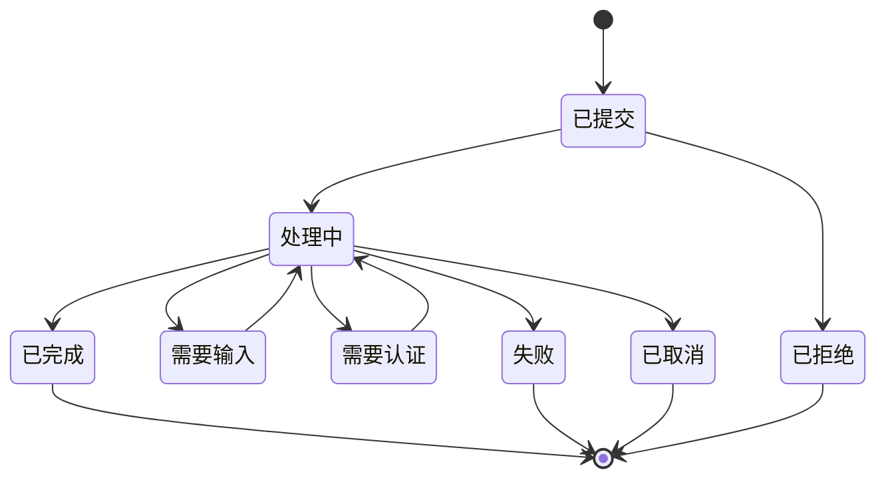
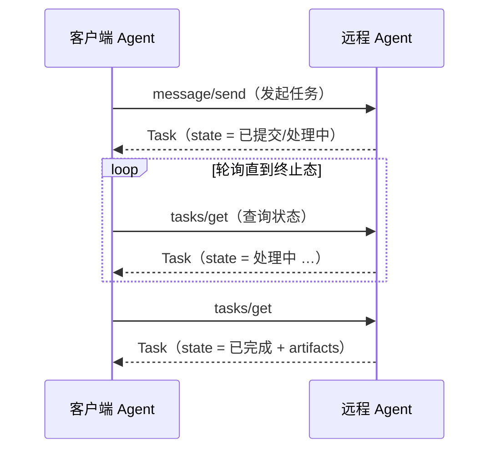
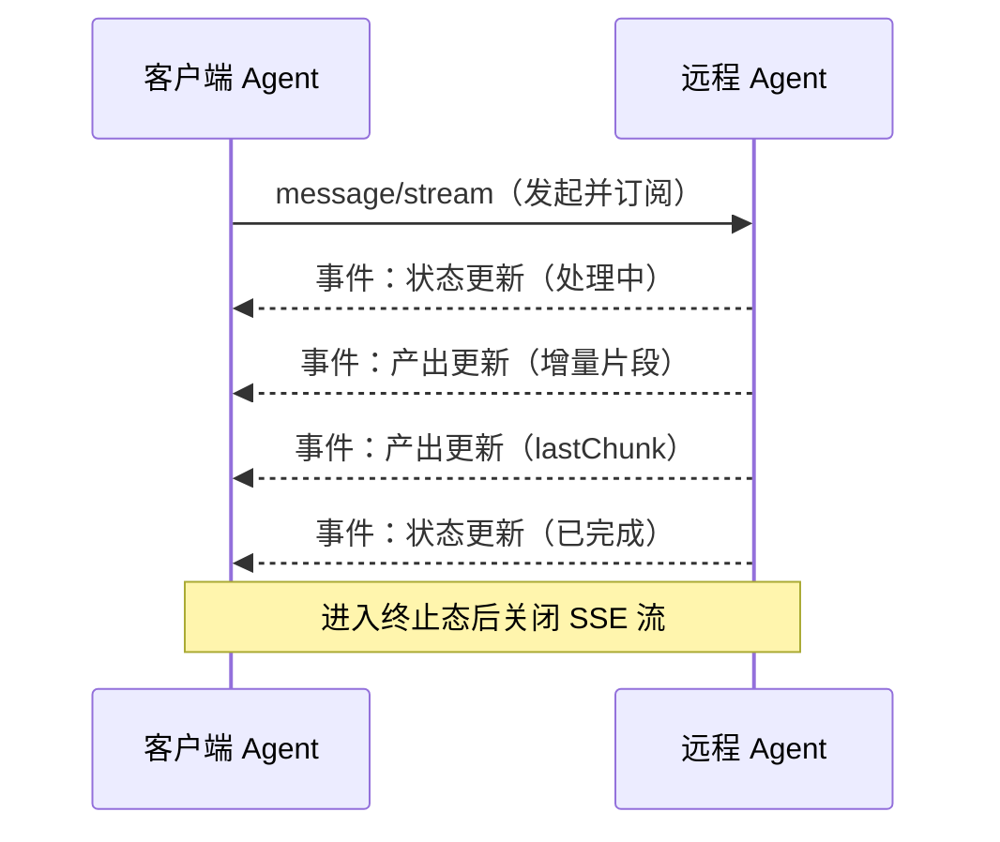
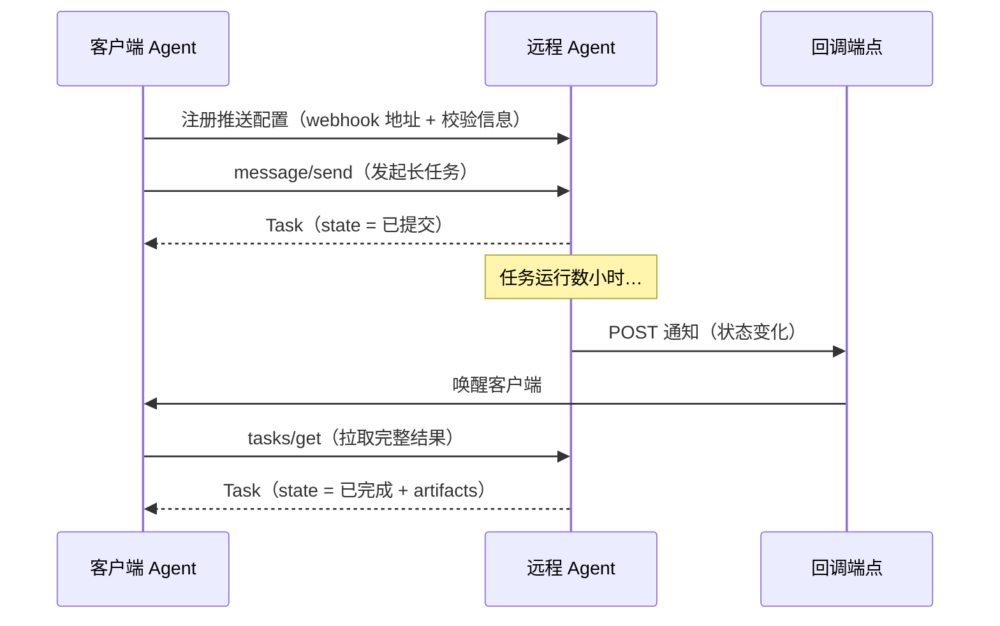
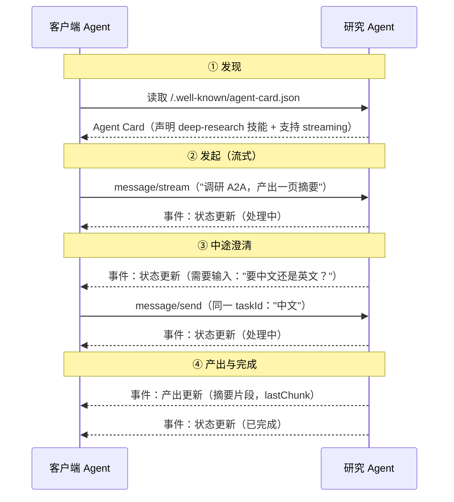

# A2A (Agent2Agent) 学习笔记

> A2A 是一个**开放协议**，用于标准化 **AI agent 之间**的通信与协作。
> 一句话定位：**MCP 解决"一个 agent 如何接入工具与数据"，A2A 解决"多个独立 agent 如何互相委派任务"。** 两者正交、互补。
> 由 Google 于 2025 年发起，2025-06-23 捐赠给 Linux Foundation，进入中立治理。
>
> 官方文档：[https://a2a-protocol.org](https://a2a-protocol.org)
>
> ⚠️ **本笔记基于 A2A v1.0.0（2026 年初发布）。** v1.0 对线格式（wire format）做了重大、不向后兼容的改动，与网上大量基于 v0.2/v0.3 的资料**不一致**（枚举大小写、`kind` 判别字段、Agent Card 结构都变了）。差异集中在第 11 节。

---

## 1. 为什么需要 A2A？

**核心前提：agent 是"不透明（opaque）"的自治系统，不能被简化成一次工具调用。**

一个工具（MCP Tool）有确定的输入输出，调用即返回。但一个 agent 会自己推理、规划、调用多个工具、维护状态、可能耗时数分钟到数小时。把对方 agent 当成"函数"来调用，从根本上就建模错了。

由此推出两条约束，它们决定了 A2A 的整个形态：

- **不能共享内部状态**：对方的记忆、工具、提示词、推理过程既不可见，也**不应**暴露（保护知识产权 + 安全）。所以协作只能通过"消息 + 任务 + 产出"这种黑盒边界进行，而非共享内存或直接函数调用。
- **必须支持长任务**：agent 委派的工作往往是"调研 X 后产出报告""完成一次代码 review"这类数分钟到数小时的任务。如果协议假设"调用必须几秒内返回"，整个协作模式就不成立。

在没有统一协议时，不同框架/厂商的 agent（LangGraph、CrewAI、Semantic Kernel、自研、各家云厂商）各说各话，两两对接形成 N×N 的集成爆炸：

```
没有 A2A：每对异构 agent 都要定制对接

┌────────────┐      定制集成      ┌────────────┐
│  Agent A    │───────────────────│  Agent B    │
│ (LangGraph) │                   │  (CrewAI)   │
└─────┬───────┘                   └──────┬──────┘
      │ 定制集成                          │ 定制集成
      ▼                                  ▼
┌────────────┐                    ┌────────────┐
│  Agent C    │                    │  Agent D    │
│  (自研)     │                    │  (厂商 X)   │
└────────────┘                    └────────────┘

N 个 agent 两两对接 → 约 N×(N-1) 种集成
```

A2A 提供一层统一协议，任意 A2A client 都能调用任意 A2A server：

```
有 A2A：统一协议，任意 client ↔ 任意 server

Agent A ──┐                      ┌── Agent B
          ├──── A2A 协议 ────────┤
Agent C ──┘                      └── Agent D

每个 agent 只实现一次 A2A → N 种实现
```

这与 MCP 把 M×N 化简为 M+N 是同一种思路，只是边界从"agent↔工具"换成了"agent↔agent"。

---

## 2. A2A 与 MCP 的关系

**结论先行：两者解决正交的问题，是互补而非竞争。** 一个成熟的 agent 通常**同时**是两者的参与者——对外用 A2A 与别的 agent 协作，对内用 MCP 调用自己的工具。

| 维度 | MCP | A2A |
| --- | --- | --- |
| 边界 | agent ↔ 工具 / 数据 | agent ↔ agent |
| 对方是什么 | 原语（Tool/Resource/Prompt），输入输出确定 | 自治系统，会推理、规划、维护状态 |
| 交互方式 | 调用能力（using capabilities） | 委派与协作（partnering on tasks） |
| 方向 | 纵向整合（把工具接入一个 agent） | 横向协作（让独立 agent 互通） |
| 时长假设 | 调用通常短、可同步返回 | 长任务是一等公民 |
| 透明度 | 工具内部无所谓透明 | 对方刻意保持不透明 |

官方用**汽车维修店**类比阐释二者如何在同一系统中分工：

```
            ┌──── A2A（横向：agent 之间委派任务）────┐
            ▼                                       ▼
     ┌─────────────┐    委派维修任务      ┌─────────────┐
     │  店长 Agent  │───────────────────→│  技工 Agent  │
     └─────────────┘                     └──────┬──────┘
            ▲                                    │
            │ A2A（向配件商询价）        MCP（纵向：调用工具/资源）
            │                          ┌─────────┴─────────┐
     ┌─────────────┐                   ▼                   ▼
     │ 配件商 Agent │              诊断扫描仪            维修手册
     └─────────────┘               （Tool）           （Resource）
```

- 客户 ↔ 店长、店长 ↔ 技工、技工 ↔ 配件商：都是 agent 间协作，走 **A2A**。
- 技工读取维修手册、操作诊断仪：是 agent 使用工具，走 **MCP**。

一句话记忆：**A2A 是 agent 之间"搭伙做事"，MCP 是 agent "使用能力"。**

---

## 3. 架构与角色

**因为 agent 不透明，协议只需定义"边界上的交互"，完全不规定 agent 内部如何实现。** 这让任意框架写的 agent 都能接入。

| 角色 | 职责 | 说明 |
| --- | --- | --- |
| **A2A Client**（Client Agent） | 代表用户或系统**发起**请求的一方 | 主动委派任务 |
| **A2A Server**（Remote Agent） | 暴露 A2A 端点、**处理** Task 并返回结果的一方 | 对 client 而言是不透明黑盒 |
| **User** | 发起需求的人或自动化系统 | 不是协议端点，是需求源头 |

关键点：**Client / Server 是角色而非固定身份。** 同一个 agent 可以同时扮演两者——A 委托 B，B 在执行中又作为 client 去委托 C。协作可以链式、网状展开。

协议建立在既有 Web 标准之上（降低落地门槛）：

```
┌──────────────┐   A2A over HTTPS    ┌──────────────────────┐
│ 客户端 Agent  │────────────────────→│   远程 Agent（opaque） │
│  (Client)    │←────────────────────│      (Server)        │
└──────────────┘   Task / Message    └──────────────────────┘
                   / Artifact

传输：HTTP(S)；编码：JSON-RPC 2.0 / gRPC / HTTP+JSON(REST)；流式：SSE
```

---

## 4. Agent Card 与发现机制

**协作的第一步是"发现对方能做什么"——没有发现就没有委派。** Agent Card 就是一个 agent 的"名片 + API 说明书"：一份 JSON 元数据，声明身份、能力、技能、端点和认证要求。

### 4.1 位置与发现方式

Agent Card 默认发布在遵循 [RFC 8615](https://datatracker.ietf.org/doc/html/rfc8615) 的 well-known 路径：

```
GET https://{agent-server-domain}/.well-known/agent-card.json
```

三种发现机制（按使用场景并列）：

| 机制 | 做法 | 适用场景 |
| --- | --- | --- |
| **Well-Known URI** | 公开 agent 在标准路径托管 Card，供自动发现 | 开放、可被任意方接入 |
| **Curated Registry**（注册中心） | 中心化目录收录 Card，按 skill / tag 查询 | 企业内部、可信集合 |
| **Direct Configuration**（直接配置） | client 通过配置文件 / 环境变量 / 私有 API 硬编码对方信息 | 固定合作、内网 |

### 4.2 Agent Card 的关键字段

| 字段 | 含义 |
| --- | --- |
| `name` / `description` / `provider` | 身份与提供方信息 |
| `version` | agent 自身版本 |
| `capabilities` | 支持的能力开关：`streaming`、`pushNotifications`、`extendedAgentCard` |
| `skills` | 技能列表，每个 `AgentSkill` 含 `id`、`name`、`description`、`tags`、`examples`、`inputModes`、`outputModes` |
| `securitySchemes` / `security` | 声明可用的认证方案与各操作的要求（见第 10 节） |
| `defaultInputModes` / `defaultOutputModes` | 默认支持的内容模态（MIME 类型） |
| `interfaces` | **（v1.0）** 多个接口入口，每个声明 `url` + 传输绑定 + 协议版本（见第 9 节） |

结构示意（字段以规范为准）：

```json
{
  "name": "Research Agent",
  "description": "给定主题，检索多源并产出结构化报告",
  "provider": { "organization": "Example Inc.", "url": "https://example.com" },
  "version": "2.1.0",
  "capabilities": { "streaming": true, "pushNotifications": true, "extendedAgentCard": true },
  "defaultInputModes": ["text/plain"],
  "defaultOutputModes": ["text/plain", "application/pdf"],
  "skills": [
    {
      "id": "deep-research",
      "name": "深度调研",
      "description": "检索多个来源并生成结构化报告",
      "tags": ["research", "report"],
      "examples": ["调研 A2A 协议的最新进展"],
      "inputModes": ["text/plain"],
      "outputModes": ["application/pdf"]
    }
  ],
  "securitySchemes": { "oauth": { "type": "oauth2" } },
  "security": [ { "oauth": [] } ],
  "interfaces": [
    { "url": "https://example.com/a2a/jsonrpc", "protocolBinding": "JSONRPC", "protocolVersion": "1.0" },
    { "url": "https://example.com/a2a/grpc",    "protocolBinding": "GRPC",    "protocolVersion": "1.0" }
  ]
}
```

> 上面的 `interfaces` 字段名以规范为准——v1.0 把传输/端点信息从顶层收进了"按接口"的数组，使一个 agent 能同时暴露多种绑定。

### 4.3 Signed Agent Card（v1.0 新增）

**问题：Card 公开可取，如何确认它真由该域名所有者签发，而非被伪造？** v1.0 允许在 Card 中附加密码学签名：

- 使用 **JWS**（[RFC 7515](https://datatracker.ietf.org/doc/html/rfc7515)）对 Card 签名；
- 用 **JSON Canonicalization**（[RFC 8785](https://datatracker.ietf.org/doc/html/rfc8785)）确保规范化后签名稳定；
- 接收方据此验证 Card 的来源与完整性，建立信任链。

---

## 5. 核心数据对象

**黑盒交互需要一套"通用货币"承载内容**——不论 agent 内部如何实现，对外都用四个对象表达。它们层层包含：

```
Task（有状态的工作单元）
 ├── status        当前状态（state + 可选 message + timestamp）
 ├── history[]     交互历史，元素是 Message
 └── artifacts[]   产出成果，元素是 Artifact

Message（一次"发言"）   ──┐
Artifact（一份产出）     ──┴── 都由 Part[] 组成

Part（内容最小单元）：text | file | data —— 模态无关
```

### 5.1 Message（消息）

一次通信"发言"。

| 字段 | 类型 | 必填 | 说明 |
| --- | --- | --- | --- |
| `messageId` | string | 是 | 发送方生成的 UUID |
| `role` | enum | 是 | `ROLE_USER` 或 `ROLE_AGENT` |
| `parts` | Part[] | 是 | 消息内容容器 |
| `contextId` | string | 否 | 关联到某个上下文 |
| `taskId` | string | 否 | 关联到某个 Task |
| `referenceTaskIds` | string[] | 否 | 作为上下文引用的其他 Task |
| `metadata` / `extensions` | object / string[] | 否 | 元数据 / 启用的扩展 |

### 5.2 Part（内容单元）

**Part 是"模态无关"的关键**：文本、文件、结构化数据用同一种容器表达，使协议天然支持多模态。每个 Part 恰好携带以下之一：

| 成员 | 含义 |
| --- | --- |
| `text` | 纯文本 |
| `raw` | 内联二进制（JSON 中为 base64） |
| `url` | 指向文件内容的外部链接 |
| `data` | 任意结构化 JSON |

附加字段：`mediaType`（MIME 类型）、`filename`、`metadata`。

```json
{ "text": "调研结论：……" }
{ "url": "https://example.com/report.pdf", "mediaType": "application/pdf", "filename": "report.pdf" }
{ "data": { "score": 0.92, "passed": true } }
```

> **v1.0 重点**：Part **没有** `kind` 判别字段，靠"哪个成员被填充"来区分（如 `"text" in part`）。这与 v0.x 的 `{"kind":"text", ...}` 不同，详见第 11 节。

### 5.3 Task（任务）与 Artifact（产出）

- **Task**：一个有唯一 `id`、有生命周期状态机的工作单元，用于跟踪长任务与多轮交互。字段含 `id`、`contextId`、`status`、`artifacts[]`、`history[]`、`metadata`。
- **Artifact**：Task 执行过程中产出的成果（报告、图片、结构化数据），有 `artifactId`、`name`，内容同样由 `Part[]` 组成。

### 5.4 contextId 与 taskId 的区别

| 标识 | 粒度 | 作用 |
| --- | --- | --- |
| `taskId` | 单个任务 | 唯一标识一个 Task，用于查询、取消、续传 |
| `contextId` | 一组任务 | 由 server 生成，把多个相关 Task / Message 串成一段会话或上下文 |

类比：`taskId` 是"一张工单"，`contextId` 是"同一个客户的整个服务档案"。

---

## 6. Task 生命周期与状态机

**为什么 Task 必须有显式状态机？** 因为 agent 的工作往往是长流程，且可能中途需要人介入。单纯的 request/response 无法表达"进行中""等用户补充输入""被拒绝"这些中间态。所以 A2A 把任务建模成一个状态机。



状态与 v1.0 枚举值的对应（线格式为 `SCREAMING_SNAKE_CASE`）：

| 中文 | TaskState 枚举（v1.0） | 类别 | 含义 |
| --- | --- | --- | --- |
| 已提交 | `TASK_STATE_SUBMITTED` | 进行中 | 已受理，尚未开始处理 |
| 处理中 | `TASK_STATE_WORKING` | 进行中 | 正在执行 |
| 需要输入 | `TASK_STATE_INPUT_REQUIRED` | 中断（可恢复） | 需要用户补充信息才能继续 |
| 需要认证 | `TASK_STATE_AUTH_REQUIRED` | 中断（可恢复） | 需要认证才能继续 |
| 已完成 | `TASK_STATE_COMPLETED` | 终止 | 成功结束 |
| 失败 | `TASK_STATE_FAILED` | 终止 | 出错结束 |
| 已取消 | `TASK_STATE_CANCELED` | 终止 | 被取消 |
| 已拒绝 | `TASK_STATE_REJECTED` | 终止 | agent 拒绝执行 |

> 另有 `TASK_STATE_UNSPECIFIED` 表示未指定/未知。

**`需要输入` 是多轮协作的关键**：agent 可以暂停任务、向 client 索要补充信息，client 携带**同一个 `taskId`** 发新消息把任务推进下去。这就是"委派一个需要来回澄清的任务"得以成立的机制。

---

## 7. 三种交互模式

**核心原理：任务时长决定交互模式。** 秒级用同步轮询，分钟级用流式，小时/天级用推送。"长任务一等公民"正是 A2A 区别于普通"远程函数调用"的根本所在。

| 模式 | 连接特征 | 适用时长 | 对客户端的要求 |
| --- | --- | --- | --- |
| Request/Response + 轮询 | 短连接，主动轮询 | 秒级 | 简单 |
| Streaming（SSE） | 一条长连接持续推送 | 秒~分钟 | 能保持长连接 |
| Push Notification（webhook） | 无需保持连接，回调通知 | 分钟~天 | 需有可被回调的 endpoint |

### 7.1 Request/Response + 轮询

最简单的模式：发起任务拿到 `taskId`，之后定期查询状态。适合短任务或对方暂不支持流式时。



### 7.2 Streaming（SSE）

**原理**：client 发起 `message/stream`，server 返回 `Content-Type: text/event-stream` 并保持连接，把任务进展作为一连串事件推回，直到任务进入终止态后关闭流。

两类事件：

- **TaskStatusUpdateEvent**：状态变化（如 处理中 → 已完成）及中间消息。
- **TaskArtifactUpdateEvent**：产出的新增/更新；大产出可分块，靠 `append`、`lastChunk` 字段在客户端拼接。

适合：需要实时进度、增量返回大结果、交互式来回。



> 若 SSE 连接中途断开而任务仍在进行，client 可用 `tasks/resubscribe` 重新订阅同一任务的事件流。

### 7.3 Push Notification（webhook）

**原理**：对于数小时到数天、或客户端无法保持长连接的场景（移动端、serverless），client 预先注册一个 webhook；server 在状态变化时主动 POST 通知；client 收到后再用 `tasks/get` 拉取完整结果。



推送配置 `PushNotificationConfig` 含：`url`（HTTPS 回调地址）、`token`（client 侧校验值）、`authentication`（server 自证身份的凭证）。

**安全要点**（跨组织回调风险高）：

- server 必须校验 webhook URL，防 SSRF / DDoS；
- client 必须验证通知确来自该 server（JWT/JWKS、HMAC 或 mTLS）；
- 用 nonce + 时间戳防重放，并定期轮换密钥。

---

## 8. 核心操作与方法映射

**v1.0 把协议组织成"抽象操作 + 多种绑定"**：同一个语义操作（如"发送消息"）在 JSON-RPC、gRPC、REST 三种绑定下有不同的具体名字。**理解抽象操作比记住某个方法名更重要。**

### 8.1 关键操作的签名

> 约定：列出 **功能 / 入参 / 出参**。

**发送消息（Send Message）**
- 功能：发送一条 Message，发起新 Task 或推进已有 Task。
- 入参：`message`（必填，含 `role` / `parts` / `messageId`，可选 `taskId` / `contextId`）；可选 `configuration`。
- 出参：`Task`（被作为有状态任务处理时）**或** `Message`（agent 直接给出即时答复时）。

**流式发送消息（Send Streaming Message）**
- 功能：发送消息并通过 SSE 实时订阅该任务的更新。
- 入参：同"发送消息"。
- 出参：事件流（Task / Message + TaskStatusUpdateEvent + TaskArtifactUpdateEvent）。

**获取任务（Get Task）**
- 功能：查询某个已发起任务的当前状态。
- 入参：`id`（taskId）；可选 `historyLength` 等。
- 出参：`Task`（含 status、artifacts、可选 history）。

**列出任务（List Tasks）**——**v1.0 新增**
- 功能：分页列出任务，支持过滤。
- 入参：过滤条件 + 游标分页参数。
- 出参：`Task[]` + 分页游标。

**取消任务（Cancel Task）**
- 功能：请求取消进行中的任务。
- 入参：`id`（taskId）。
- 出参：更新后的 `Task`（取消态）。

**重新订阅（Subscribe to Task）**
- 功能：SSE 断开后，对已存在任务恢复事件流订阅。
- 入参：`id`（taskId）。
- 出参：事件流（TaskStatusUpdateEvent + TaskArtifactUpdateEvent）。

**推送配置增删查（Push Notification Config: Create / Get / List / Delete）**
- 功能：为某任务管理 webhook 推送配置。
- 入参：`taskId` +（创建时）`PushNotificationConfig`，或配置 `id`。
- 出参：配置对象 / 配置列表 / 删除确认。

**获取扩展 Agent Card（Get Extended Agent Card）**
- 功能：认证后获取更详细的 Agent Card（可能含公开 Card 之外的能力）。
- 入参：无（需通过认证）。
- 出参：`AgentCard`。

### 8.2 三种绑定下的方法映射

| 抽象操作 | JSON-RPC `method` | gRPC `rpc` | REST |
| --- | --- | --- | --- |
| 发送消息 | `message/send` | `SendMessage` | `POST /message:send` |
| 流式发送 | `message/stream` | `SendStreamingMessage` | `POST /message:stream` |
| 获取任务 | `tasks/get` | `GetTask` | `GET /tasks/{id}` |
| 列出任务 | `tasks/list` | `ListTasks` | `GET /tasks` |
| 取消任务 | `tasks/cancel` | `CancelTask` | `POST /tasks/{id}:cancel` |
| 重新订阅 | `tasks/resubscribe` | `SubscribeToTask` | `GET /tasks/{id}:subscribe` |
| 创建推送配置 | `tasks/pushNotificationConfig/set` | `CreateTaskPushNotificationConfig` | `POST /tasks/{id}/pushNotificationConfigs` |
| 获取推送配置 | `tasks/pushNotificationConfig/get` | `GetTaskPushNotificationConfig` | `GET /tasks/{id}/pushNotificationConfigs/{cfgId}` |
| 列出推送配置 | `tasks/pushNotificationConfig/list` | `ListTaskPushNotificationConfigs` | `GET /tasks/{id}/pushNotificationConfigs` |
| 删除推送配置 | `tasks/pushNotificationConfig/delete` | `DeleteTaskPushNotificationConfig` | `DELETE /tasks/{id}/pushNotificationConfigs/{cfgId}` |
| 扩展 Agent Card | `agent/getAuthenticatedExtendedCard` | `GetExtendedAgentCard` | `GET /extendedAgentCard` |

> gRPC 方法名与 REST 路径来自规范的 `a2a.proto`；JSON-RPC 的斜杠式 `method` 名沿用既有绑定约定。多租户场景下 REST 路径前可带 `/{tenant}` 前缀。

---

## 9. 三种传输绑定

**原理与 MCP 的"数据层/传输层"分层同理：协议语义与传输解耦——同一套对象，三种线上表示。** v1.0 还支持**多协议绑定**：一个 agent 可同时暴露多种绑定，client 按 Agent Card 里的 `interfaces` 选择。

| 绑定 | 编码 / 传输 | 流式机制 | 特点 |
| --- | --- | --- | --- |
| **JSON-RPC 2.0** | JSON over HTTP | SSE | 最通用，`method` 字段定位操作 |
| **gRPC** | Protocol Buffers over HTTP/2 | HTTP/2 原生流 | 强类型、高性能 |
| **HTTP+JSON / REST** | JSON over HTTP，路径 + 动词 | SSE / 分块响应 | 对 Web 生态最友好 |

> 规范还允许自定义绑定（Custom Protocol Binding）。

JSON-RPC 绑定下一次 `message/send` 的请求与响应（**v1.0 格式**）：

```json
// 请求（有 id，等回复）
{
  "jsonrpc": "2.0",
  "id": 1,
  "method": "message/send",
  "params": {
    "message": {
      "role": "ROLE_USER",
      "parts": [ { "text": "调研 A2A 与 MCP 的差异，产出一页摘要" } ],
      "messageId": "9b7e2c1a-uuid"
    }
  }
}

// 响应（id=1 配对，返回一个 Task）
{
  "jsonrpc": "2.0",
  "id": 1,
  "result": {
    "id": "task-7f3a-uuid",
    "contextId": "ctx-22b-uuid",
    "status": { "state": "TASK_STATE_WORKING", "timestamp": "2026-06-05T08:00:00Z" },
    "history": [],
    "artifacts": []
  }
}
```

---

## 10. 认证与安全

**原理：A2A 面向跨组织、企业级协作，所以"安全默认开启"，且凭证不进入 A2A 消息体。**

### 10.1 在 Agent Card 中声明（类比 OpenAPI 的安全方案）

`securitySchemes` 列出可用方案，`security` 数组声明各操作需要哪些方案：

| 方案 | 说明 |
| --- | --- |
| `APIKeySecurityScheme` | API Key |
| `HTTPAuthSecurityScheme` | HTTP Basic / Bearer |
| `OAuth2SecurityScheme` | OAuth 2.0（v1.0 新增 Device Code 流 + PKCE，移除 implicit / password） |
| `OpenIdConnectSecurityScheme` | OIDC |
| `MutualTlsSecurityScheme` | mTLS |

### 10.2 凭证走 out-of-band

实际凭证通过**传输层**携带（HTTP header、gRPC metadata），**不放进 A2A 的请求/响应消息体**。这样既复用了成熟的 Web 认证基建，也避免凭证混入业务数据。

### 10.3 信任与防护要点

- **Opaque + Signed Card**：对方内部不可见保护 IP；Signed Card 验证 Card 来源（第 4.3 节）。
- **Webhook 安全**：校验回调 URL 防 SSRF；client 验证 server 身份；nonce + 时间戳防重放（第 7.3 节）。
- **版本协商**：client 发 `A2A-Version` 头，server 不支持则返回 `VersionNotSupportedError`。

---

## 11. 版本演进：v0.x → v1.0

**这一节是本笔记区别于网上大量资料的关键。** 多数 A2A 文章、SDK 示例基于 v0.2 / v0.3，其线格式与 v1.0 **不兼容**。版本历史：`0.1.0 → 0.2.x → 0.3.0 → 1.0.0`，采用 `Major.Minor` 兼容策略（patch 不影响兼容性）。

### 11.1 线格式的破坏性变更

| 维度 | v0.x | v1.0 |
| --- | --- | --- |
| TaskState 取值 | 小写连字符：`"working"`、`"input-required"` | `SCREAMING_SNAKE_CASE`：`"TASK_STATE_WORKING"`、`"TASK_STATE_INPUT_REQUIRED"` |
| Message role | `"user"` / `"agent"` | `"ROLE_USER"` / `"ROLE_AGENT"` |
| Part 类型 | `TextPart`/`FilePart`/`DataPart` + `kind` 判别字段 | 统一 `Part`，按成员存在判别（`"text" in part`）；新增 `url`（取代 `file.uri`）、`raw`（base64）、`mediaType`（取代 `mimeType`） |
| 流式事件 | 带 `kind` 判别 + `final` 布尔 | 去 `kind`，改为按类型包裹（如 `{"taskStatusUpdate": {…}}`）；移除 `final` |
| Agent Card | 顶层 `url` / `preferredTransport` / `protocolVersion` | 移除顶层这些字段，收进按接口的 `interfaces` 数组；`supportsAuthenticatedExtendedCard` → `capabilities.extendedAgentCard` |

> 迁移判别要点：把 `if (part.kind === "text")` 改成 `if ("text" in part)`；把状态字符串比较从 `"completed"` 改成 `"TASK_STATE_COMPLETED"`。

### 11.2 v1.0 新增能力

- **Signed Agent Cards**：JWS + JSON Canonicalization，验证 Card 来源（第 4.3 节）。
- **多租户（Multi-Tenancy）**：请求与接口声明中带 `tenant`，单端点托管多个 agent；REST 路径可带 `/{tenant}` 前缀。
- **多协议绑定（Multi-Protocol Bindings）**：一张 Agent Card 同时声明 JSON-RPC / gRPC / HTTP+JSON 多个接口。
- **List Tasks**：新增任务列举操作，支持游标分页。
- **OAuth 现代化**：新增 Device Code 流（RFC 8628）与 PKCE，移除 implicit / password 流。

### 11.3 well-known 路径

`/.well-known/agent-card.json`——自 v0.3.0 起不变（更早的 v0.1 曾用 `agent.json`）。

### 11.4 迁移建议（三阶段）

1. **兼容层**：解析新旧两种判别模式；
2. **双写**：输出 v1.0 格式，同时保留向后兼容的读取；
3. **仅 v1.0**：移除旧代码。优先处理 Part / 流式事件的解析与 Agent Card 结构。

---

## 12. 端到端协作示例

把上述概念串成一个真实的委派流程——"店长 agent 委托研究 agent 做一份调研，长任务 + 中途澄清"：



要点回顾：

- **发现**先于委派（Agent Card）；
- 任务以 **Task** 为载体，有显式状态机；
- `需要输入` + 同一 `taskId` 支撑**多轮澄清**；
- 结果以 **Artifact** 取回；
- 全程对方 agent 保持**不透明**——client 不知道也不需要知道它内部如何完成。

---

## 13. 相关生态与资源

| 项目 | 说明 |
| --- | --- |
| [A2A 官网](https://a2a-protocol.org) | 协议主页 |
| [A2A 规范](https://a2a-protocol.org/latest/specification/) | 完整协议规范（v1.0） |
| [What's New in v1.0](https://a2a-protocol.org/latest/whats-new-v1/) | v0.x → v1.0 变更与迁移 |
| [GitHub: a2aproject/A2A](https://github.com/a2aproject/A2A) | 规范源码（含 `a2a.proto`） |
| [Linux Foundation A2A 项目](https://www.linuxfoundation.org/press/linux-foundation-launches-the-agent2agent-protocol-project-to-enable-secure-intelligent-communication-between-ai-agents) | 治理与公告 |

**采用现状**：A2A 已获 150+ 组织支持，并在 Microsoft、AWS、Salesforce、SAP、ServiceNow 等出现生产部署；支付场景以 **AP2（Agent Payments Protocol）** 作为正式扩展。

---

> **三句话总结**
> 1. A2A 让**不透明的自治 agent** 跨框架/厂商互通：发现（Agent Card）→ 委派（Task）→ 协作（Message/Artifact），长任务是一等公民。
> 2. 与 MCP 正交互补：**MCP 接工具，A2A 接 agent**；一个 agent 常同时用两者。
> 3. **v1.0 是分水岭**：枚举改 `SCREAMING_SNAKE_CASE`、去掉 `kind` 判别、Agent Card 多绑定化——读旧资料务必先确认版本。
