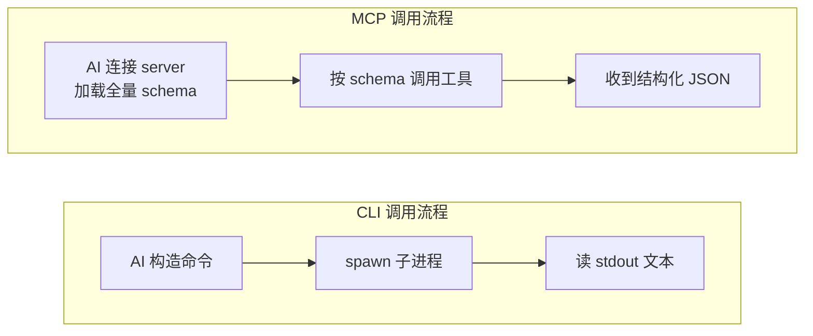

# MCP vs CLI：从飞书看 AI 工具接口选型

> 相关：[[MCP_学习笔记]]、[[MCP-vs-CLI-为AI原生开发选对接口]]

---

## 1. MCP 和 CLI 是什么

AI 助手要操作外部系统（飞书、GitHub、CI/CD……），需要一个接口。当前主流的两种接口方式是 CLI 和 MCP。

### CLI：派生子进程，读文本输出

CLI（Command-Line Interface）就是命令行工具。AI 助手用它的方式和人一样：

1. **派生（spawn）一个子进程**，把命令和参数传进去
2. 子进程执行完毕，AI **读取标准输出（stdout）的文本**
3. 进程退出，**没有持久连接**

整个过程没有握手、没有协议协商。对 AI 而言就是"跑了条命令，拿回一段文字"。

### MCP：连接服务器，通过协议调用工具

MCP（Model Context Protocol）是 Anthropic 于 2024 年 11 月发布的开放协议，专门为"AI 助手调用外部工具"设计：

1. AI 助手**连接 MCP server**，建立持久会话
2. Server 把**全部工具的 schema（名称、参数、返回格式）灌进 AI 的上下文窗口**
3. AI 通过协议调用工具，拿回**结构化的 JSON 响应**
4. **鉴权在 server 层处理**，对 AI 透明

### 机制对比

| 维度           | CLI                              | MCP                           |
| ------------ | -------------------------------- | ----------------------------- |
| 连接方式         | 无连接，每次 spawn 独立子进程               | 持久连接（JSON-RPC over stdio/SSE） |
| AI 怎么知道有哪些操作 | 靠训练数据中的记忆，或额外的 Skill 文件          | 协议内建：连接时 server 暴露全量 schema   |
| 输出格式         | 默认纯文本（部分 CLI 支持 `--format json`） | 协议规定：结构化 JSON                 |
| 鉴权           | 由每个 CLI 工具各自处理（环境变量、配置文件……）      | 在 MCP server 层统一封装            |
| 上下文开销        | 接近零                              | 连接即加载全量 schema，占用 token 预算    |

---

## 2. 各自的优势和劣势

### CLI 的优势

1. **Token 效率高。** 不加载 schema，不占上下文窗口。[ScaleKit 基准测试](https://scalekit.com/blog/mcp-vs-cli-benchmarks)（GitHub `gh` CLI vs GitHub MCP server，Claude Sonnet 4）给出了具体数字：查仓库语言 CLI 用 1,365 token，MCP 用 44,026 token（**32 倍差距**）；按月 10,000 次操作算，CLI 成本约 $3.2，MCP 约 $55.2。在高频迭代场景中这个差距直接决定了能否跑完一个完整工作流。
2. **模型天然熟悉。** LLM 的训练数据里有数十亿行 shell 命令和脚本，CLI 是 LLM 的"母语"。`pytest`、`git`、`eslint` 这些工具怎么用，模型不需要任何额外描述就会调。而 MCP 是 2024 年底才发布的新协议，模型对它的理解完全依赖连接时注入的 schema，没有训练时期的积累。
3. **可组合。** 标准 Unix 管道天然支持工具串联：`pytest --tb=short 2>&1 | head -50`，一行搞定多步处理。

### CLI 的劣势

1. **没有内建的可发现性。** 传统 CLI 不会主动告诉 AI 自己有哪些子命令、参数怎么传、输出长什么样。AI 只能靠训练数据里的记忆去猜，面对陌生工具就会调不通。**不过这个劣势可以被弥补**：AI-native CLI（如 lark-cli）通过 **Skill 文件**解决了这个问题——每个 Skill 是一份结构化的 Markdown 文档，描述该域有哪些命令、参数含义、输出格式、典型用法，加载到 AI 的 system prompt 中。效果上等价于 MCP 的 schema 暴露，只是交付方式不同：MCP 通过协议自动推送，Skill 文件通过 prompt 注入（详见第 4 节对比）。
2. **输出默认是纯文本。** AI 需要自己"读懂"文本输出，可能读对也可能读错。AI-native CLI 的解决方式是**让 CLI 程序自己把输出格式化成 JSON 再写到 stdout**。stdout 永远是文本，但文本的内容可以是 JSON 格式的字符串——CLI 程序完全控制往 stdout 写什么。lark-cli 的做法是：内部调飞书 REST API 拿到 JSON 响应后，默认直接把 JSON 写到 stdout（`--format json` 是默认值）；需要人类阅读时再切 `--format table` 或 `pretty`。还内建了 `--jq` 参数，AI 可以在命令行层面直接过滤 JSON 字段。
3. **鉴权分散。** 每个 CLI 工具有自己的鉴权机制，AI 或开发者需要逐个配置。

> 以上三个劣势是**传统 CLI 的固有问题**。但当一个 CLI 专门为 AI agent 设计时（加入 Skill 文件、JSON 默认输出、OAuth 封装），这三个劣势都可以被消除。第 4 节以飞书 lark-cli 为例展示了这一点。

### MCP 的优势

1. **内建可发现性。** AI 一连上 MCP server 就自动知道有哪些工具可用、参数怎么传、返回什么格式。面对从未见过的系统也能直接上手操作。
2. **结构化响应。** 协议层保证返回 JSON，AI 无需猜测输出格式，直接提取字段用于下一步操作。
3. **鉴权封装。** 开发者向 MCP server 认证一次，server 负责向底层 API 传递凭证、管理 token 刷新。AI 不接触鉴权细节。
4. **跨平台标准化。** 不管背后是飞书、GitHub 还是 Jira，AI 只需要会说 MCP 协议，就能操作任何 MCP server。

### MCP 的劣势

1. **吃 token。** 连接即加载全量 schema，中等复杂度的 server 在 AI 干正事之前就占掉数百甚至数万 token。GitHub MCP server 有 43 个工具定义，单个工具描述（如 `list_stars_language_is_known`）就消耗 4,026 token。Perplexity CTO Denis Yarats 称其内部正在远离 MCP，原因是 72% 的上下文窗口被 MCP schema 占掉了。
2. **多一层就多一个故障点。** CLI 和 MCP 最终都调同一个底层 API，但调用链路不同：CLI 是 `AI → spawn 子进程 → HTTP 请求 → API`；MCP 是 `AI → MCP 协议 → MCP server 进程 → HTTP 请求 → API`。MCP 多了 MCP server 这个中间层——它可能 hang 住、超时、或者内部 HTTP 连接断了没有重试。ScaleKit 基准测试中，CLI 25/25 次全部成功（100%），MCP 只有 18/25 成功（28% 失败率），7 次失败全是 TCP 超时。此外，MCP 依赖持久连接，连接一旦出问题整个会话都挂；CLI 每次调用都是独立子进程，一次失败不影响下一次。
3. **实现质量参差不齐。** 很多 MCP server 只包装了底层 API 的一小部分，AI 撞上未实现的操作时工作流就断了——而且这种失败可能是静默的（server 没实现某个工具，但 AI 以为它存在）。
4. **搭建门槛高于 CLI。** 需要部署或启动 MCP server 进程，配置连接参数。

---

## 3. AI 助手操作外部系统，到底需要什么

上面的优劣势可以归结为一个更本质的问题：**AI 助手要通过接口操作外部系统，需要这个接口具备哪些属性？**

三个核心属性：

| 属性        | 含义                      | 缺了会怎样                              |
| --------- | ----------------------- | ---------------------------------- |
| **可发现性**  | AI 能自动知道有哪些操作、参数格式、返回结构 | AI 只能靠训练记忆去猜，猜错就调不通                |
| **结构化响应** | 返回 JSON 等 AI 能可靠解析的格式   | AI 需要"读懂"纯文本，有出错风险                 |
| **鉴权封装**  | 鉴权对 AI 透明，连上就能用         | AI 需要自己管 token、处理刷新，浪费 token 又容易出错 |

**MCP 协议的设计初衷就是通过一套标准同时提供这三个属性。但这三个属性不是 MCP 的专利——一个设计良好的 CLI 同样能自行实现。**

---

## 4. 飞书案例：三个属性在 CLI 上的具体实现

飞书（Feishu/Lark）官方同时提供了 [lark-cli](https://github.com/larksuite/cli)（CLI）和[飞书远程 MCP](https://open.feishu.cn/document/mcp_open_tools/supported-tools)（MCP）两条路。这个案例的价值不在于比谁功能多（飞书 MCP 目前只覆盖云文档，CLI 覆盖 18 域——这是**实现投入的差异**，不是协议的优劣），而在于展示：**一个 AI-native 的 CLI 如何自行实现 MCP 协议本应提供的三个属性。**

### 三个属性的实现对比

| 属性        | MCP 协议怎么做                     | lark-cli 怎么做                                                                        |
| --------- | ----------------------------- | ----------------------------------------------------------------------------------- |
| **可发现性**  | 协议内建：连接时 server 暴露全量工具 schema | 26 个**域级 Skill 文件**：每个是一份结构化能力描述，加载到 AI 的 system prompt 中，效果等价于 MCP schema          |
| **结构化响应** | 协议规定：工具调用返回结构化 JSON           | 命令**默认输出 JSON**（`--format json` 是默认值），还支持 table/csv/ndjson/pretty 格式切换，内建 `--jq` 过滤 |
| **鉴权封装**  | 在 MCP server 层处理，AI 只需连接      | OAuth 登录一次后 token 自动管理，`--as user/bot` 切换身份，鉴权对 AI 透明                               |

**lark-cli 用 CLI 的调用方式（子进程 + stdout），实现了 MCP 本应通过协议提供的全部三个属性。** 这之所以可能，是因为 lark-cli 从第一天起就是为 AI agent 设计的——它不是一个传统 CLI 被动适配了 AI 场景。

### 这个案例说明了什么

1. **三个属性可以由不同方式实现。** MCP 通过协议提供，lark-cli 通过 Skill 文件 + 默认 JSON 输出 + OAuth 封装提供，终点相同。
2. **MCP 的价值不在于协议本身，而在于它提供的属性。** 当一个 CLI 把这些属性都自行实现了，MCP 协议的附加价值就只剩"跨平台标准化"一条。
3. **功能覆盖差距是实现投入的结果，不是协议的优劣。** 飞书 MCP 目前只覆盖云文档，是因为团队把更多资源投在了 CLI 上。MCP 协议本身完全有能力支撑全部 18 个域——前提是有人去实现。

---

## 5. 飞书为什么重投 CLI 而非 MCP

第 4 节展示了 lark-cli 如何自行实现三个属性，但没有回答一个更深的问题：**飞书团队为什么愿意花大量工程资源自建 AI-native CLI，而不是投入同等资源去完善 MCP server？** 原因不是"CLI 好 MCP 差"的简单偏好，而是在飞书的规模和场景下，MCP 的架构缺陷会被放大到不可接受。

### 原因一：Token 成本在飞书的规模下会爆炸

第 2 节的 ScaleKit 数据是基于 GitHub MCP（43 个工具定义）的测试。飞书有 **2500+ API、18 个业务域**——如果走 MCP 全量暴露 schema，工具描述的 token 量会是 GitHub 的数十倍，直接把上下文窗口塞满，AI 还没干活就没空间了。

lark-cli 的三层架构 + Skill 文件按需加载天然解决了这个问题：AI 操作日历时只加载日历 Skill（数百 token），不需要同时看到邮件、文档、审批的全部 schema。MCP 协议目前没有标准化的"按需加载"机制（动态工具加载仍处于实验阶段），只能全量灌入。

### 原因二：可靠性要求不同

企业办公场景（发消息、建日程、审批流转）对可靠性要求很高，28% 的失败率在生产环境不可接受。如第 2 节分析，MCP 的中间层架构天然多一个故障点，而当前多数 MCP server 的超时重试机制远不如成熟 CLI 完善。CLI 每次调用独立、失败隔离，更适合需要高可靠性的企业工作流。

### 原因三：CLI 的分层设计支持渐进式接入

lark-cli 的三层粒度（Shortcut → API 命令 → Raw API）让不同能力的 AI 助手都能接入：简单助手用 Shortcut 一步完成高频操作；高级 agent 用 API 命令精确控制；极端情况下 Raw API 可以打到飞书 2500+ 任意接口。MCP server 做不到这种粒度分层——所有操作在 schema 里是平铺的，AI 要从几十上百个工具里挑合适的。

### 原因四：投入产出比

建设一个 AI-native CLI 的工程投入是一次性的：设计好命令结构、写好 Skill 文件、做好 JSON 输出，所有支持终端的 AI 工具（Claude Code、Cursor、Codex……）都能直接用。而 MCP server 虽然也是一次性建设，但它的价值只覆盖支持 MCP 协议的 AI 工具——目前还不是所有 AI 工具都支持 MCP。CLI 的分发面更广。

> **不过这不意味着飞书完全抛弃了 MCP。** 在不支持终端的环境里（如 Claude 桌面端、部分 IDE 插件），MCP 仍然是唯一的接入方式。飞书的策略是**CLI 为主、MCP 为辅**，而不是二选一。

---

## 6. 那 MCP 真正赢在哪

飞书案例不代表 MCP 没用。lark-cli 之所以能替代 MCP，是因为飞书团队**专门投入资源**设计了 AI-native 的 CLI。绝大多数系统没有这种待遇——它们的 CLI 就是给人用的传统工具，没有 Skill 文件、没有结构化输出、鉴权要手动配。

MCP 的两个不可替代场景：

1. **没有 AI-native CLI 的系统。** MCP server 在传统 API 外面包一层标准接口，一次性补上三个属性，不需要原系统做任何改造。这是 MCP 最大的价值——**补位**。
2. **跨平台标准化。** AI 同时操作飞书、GitHub、Jira、Salesforce 四个系统，如果每个都有自己的 CLI + Skill 规范，AI 要学四套。MCP 提供一套协议统一所有系统。前提是：**这些 MCP server 的实现质量要够好。**

---

## 7. 选型决策

只需回答一个问题：**对于要操作的这个系统，哪个实现把三个属性做得更完整？** 选它。

按优先级排：

| 优先级 | 方案                     | 条件                                 | 举例          |
| --- | ---------------------- | ---------------------------------- | ----------- |
| 1   | **AI-native CLI**      | Skill/schema + 结构化输出 + 鉴权封装 + 功能完整 | lark-cli    |
| 2   | **成熟 MCP server**      | 三个属性齐全 + 功能覆盖完整 + 非 beta           | Grafana MCP |
| 3   | **传统 CLI + prompt 引导** | 只有给人用的 CLI，缺结构化输出和可发现性             | 大多数系统的现状    |
| 4   | **等或自建**               | 以上都没有                              | —           |

优先级 1 > 2 的原因：AI-native CLI 在功能覆盖和 token 效率上通常更优——Skill 文件按需加载，不像 MCP 连接即灌全量 schema。但如果 CLI 不是 AI-native 的（没有结构化输出、没有 Skill），成熟的 MCP server 直接跳到第一位。

---

## 8. 总结

| 面试问题               | 回答要点                                                                                                                                     |
| ------------------ | ---------------------------------------------------------------------------------------------------------------------------------------- |
| **MCP 和 CLI 的区别？** | CLI 是 spawn 子进程 + 读文本输出，无连接无协议；MCP 是通过标准协议连接 server、自动发现工具 schema、调用后拿结构化 JSON                                                           |
| **各自优劣？**          | CLI 胜在 token 效率、模型熟悉度、可组合性；MCP 胜在可发现性、结构化响应、鉴权封装、跨平台标准化。CLI 的劣势是缺内建的可发现性和结构化输出；MCP 的劣势是吃 token 和实现质量参差不齐                                 |
| **如何选型？**          | 看三个属性（可发现性 + 结构化响应 + 鉴权封装）谁做得更完整。有 AI-native CLI 优先用 CLI（如 lark-cli）；没有则用成熟 MCP server；都没有就用传统 CLI + prompt 引导兜底。核心原则：**看属性和实现成熟度，不看标签** |

