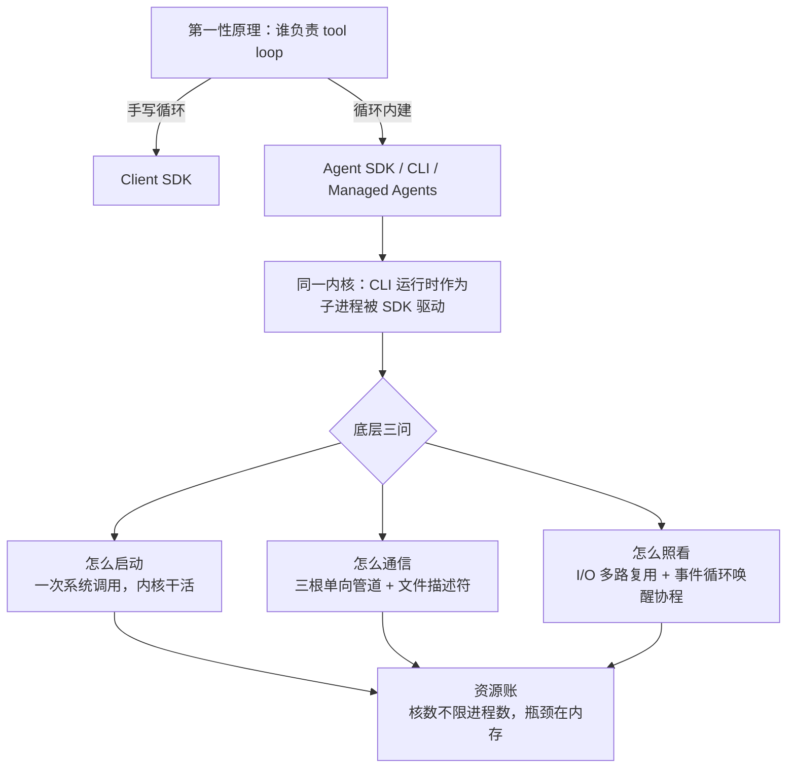

# Claude Agent SDK：架构定位与子进程底层原理

> 一句话本质：Agent SDK 是 Claude Code 运行时的编程接口。SDK 把 CLI 作为子进程拉起，靠一个事件循环、零额外线程，就能同时照看任意多个 agent 子进程。

## 全局记忆图




## 1. 为什么会有 Agent SDK

用 Anthropic 的 **Client SDK**（`anthropic` 包），拿到的是"直接访问模型 API"的能力，工具循环得自己写：

```python
# Client SDK：tool loop 手写
response = client.messages.create(...)
while response.stop_reason == "tool_use":
    result = tool_executor(response.tool_use)   # 应用侧执行工具
    response = client.messages.create(tool_result=result, ...)  # 回传结果、再请求
```

当任务变成"读代码库、改文件、跑命令、连续多步"时，这一层手写代价很高：要自己管工具执行、结果回传、轮次控制、上下文累积、权限、错误恢复。

**Agent SDK** 把 Claude Code 背后那套 agent loop + 内建工具 + 上下文管理直接封装成库：

```python
# Agent SDK：循环内建，Claude 自己决定何时读文件、何时调工具、何时收尾
async for message in query(prompt="Find and fix the bug in auth.py"):
    print(message)
```

分界线不在"调用长得像不像"，而在**谁负责 tool loop**——这是理解整个 SDK 的第一性原理。

## 2. 四个容易混的东西，先划清边界


| 名字                                 | 是什么                                                   | 谁执行 agent 循环 | 典型场景                              |
| ---------------------------------- | ----------------------------------------------------- | ------------ | --------------------------------- |
| **Client SDK** (`anthropic`)       | 直接 API 访问                                             | 应用手写         | 一次性文本/结构化输出，已有成熟工具编排              |
| **Agent SDK** (`claude-agent-sdk`) | 带内建工具执行的 Claude，跑在**应用自己的进程**里                        | SDK 内建       | CI/CD、自定义应用、生产自动化、本地文件系统 agent    |
| **Claude Code CLI**                | 面向人的命令行                                               | SDK 内建       | 交互式开发、一次性验证、调提示词                  |
| **Managed Agents**                 | Anthropic 托管的 REST API，agent 和 sandbox 都在 Anthropic 侧 | Anthropic 托管 | 不想自己运维 sandbox/会话的生产 agent、长时异步任务 |


记忆锚点：**CLI 面向人，SDK 面向程序**；**Agent SDK 跑在应用自己的进程 + 本地文件系统上，Managed Agents 跑在托管沙箱里**。常见路径是本地用 Agent SDK 原型，生产再看要不要迁 Managed Agents。

两处容易忽略的差异：**会话状态**——Agent SDK 的 transcript 是你文件系统上的 JSONL 文件，Managed Agents 是 Anthropic 托管的事件日志；**自定义工具**——Agent SDK 在你的进程内直接执行 Python/TS 函数，Managed Agents 是 Claude 触发工具、由你的服务执行后把结果回传。

### 2.1 Claude Code 与 Agent SDK：同一内核，两种外壳

表格里 Claude Code CLI 和 Agent SDK 的"谁执行 agent 循环"都写着 SDK 内建，这不是巧合：**两者共用同一个 agent 运行时**。Agent SDK 的安装包（Python wheel 的 `_bundled/` 目录、npm 包同理）自带 Claude Code 的 CLI 二进制。运行时 SDK 把这个二进制作为子进程启动，通过 stdio 收发消息。tool 执行、context 管理、agent loop 全部发生在 CLI 子进程里；SDK 本身只是接口层，负责把 `query()` / `ClaudeSDKClient` 的调用翻译成子进程通信。

```text
应用代码
  │  query() / ClaudeSDKClient
  ▼
Agent SDK（Python/TS 接口层，开源）
  │  子进程 + stdio
  ▼
Claude Code CLI 二进制（agent 运行时，闭源）
  │  HTTPS
  ▼
Claude API / 模型
```

Agent SDK 前身叫 Claude Code SDK，2025 年更名——改名本身就说明了定位：不是给 Claude Code 做外挂，而是把 Claude Code 的运行时开放成通用 agent 框架。

开源情况按这个分层看就清楚了：

- **Claude Code：闭源**。[anthropics/claude-code](https://github.com/anthropics/claude-code) 仓库只有 issue 跟踪和文档，LICENSE 写的是 "© Anthropic PBC, All rights reserved"，不属于任何开源协议。
- **Agent SDK：接口层开源**。[Python 版](https://github.com/anthropics/claude-agent-sdk-python)采用 MIT 协议，[TypeScript 版](https://github.com/anthropics/claude-agent-sdk-typescript)源码公开但受 Anthropic 商业条款约束。能读到的只是这层薄封装——包里捆绑的、真正干活的 CLI 运行时仍是闭源二进制。

所以"Agent SDK 开源、Claude Code 闭源"只对了一半：开源的是编程接口，agent 运行时内核从头到尾没有开源。

随之而来两条对外产品的合规约束：

- **使用条款**：Agent SDK 的**使用**（包括用它驱动面向自己客户的产品）受 Anthropic Commercial Terms of Service 约束——Python 仓库的 MIT 只是接口层代码的许可证，不改变这一点。
- **品牌规范**：对外产品可以叫 "Claude Agent"、"Claude" 或 "{产品名} Powered by Claude"；**不允许**用 "Claude Code" / "Claude Code Agent" 命名，也不允许模仿 Claude Code 的 ASCII 艺术等视觉元素——产品须保持自有品牌。

## 3. 底层原理：一个线程如何照看 N 个子进程

SDK 每建立一次会话就 spawn 一个 `claude` 子进程。这一节回答三个底层问题：子进程怎么被启动、父子进程怎么通信、Python 侧凭什么不多开一个线程就能同时照看 N 个子进程。

### 3.1 三个并发单位，先分清


| 并发单位   | 是什么                                   | 由谁调度      | 隔离程度      |
| ------ | ------------------------------------- | --------- | --------- |
| **进程** | 独立的运行中程序，有自己的 PID 和内存空间               | OS 内核     | 完全隔离，互不可见 |
| **线程** | 同一进程内的并发执行流，共享进程内存                    | OS 内核     | 共享内存，无隔离  |
| **协程** | `async def` 函数被调用后产生的"可暂停执行体"，跑在某个线程上 | 事件循环（用户态） | 同线程内轮流执行  |


由此得出第一个结论：**启动子进程不需要线程**。子进程是 OS fork/exec 出来的独立进程，和线程是两种互不依赖的东西。Claude Code CLI 是 Node.js 程序，不可能跑在 Python 线程里，只能作为独立进程存在。

> [!note] 协程的精确定义
> `async def` 定义的是**协程函数**；调用它并不执行，而是返回一个**协程对象**——事件循环调度的就是这些对象。函数体里的每个 `await` 是可暂停点：执行到此若需等待，协程挂起、把线程让给别的协程。


### 3.2 核心原理：等待不需要消耗人力

所有复杂性都源于一个朴素事实：**"等数据到来"这件事，不需要有人盯着**。内核可以替应用盯，数据到了会主动通知。

类比：网购 10 个包裹。笨办法是雇 10 个人，每人守在门口等一个快递（= 每个子进程配一个线程做阻塞式读取）；聪明办法是装一个门铃，铃响再去开门（= 内核的 I/O 多路复用 + 事件循环）。

由这条原理推出三个角色的分工，各管各的事、互不占用对方资源：


| 角色           | 职责                              | 消耗              |
| ------------ | ------------------------------- | --------------- |
| `claude` 子进程 | 真正干活：跑 agent loop、调 API、执行 tool | 自己的进程资源，OS 独立调度 |
| OS 内核        | 盯梢：管道有数据、子进程退出，都由它通知            | 内核态，应用无感        |
| Python 事件循环  | 收到通知才动手：读一行 JSON、解析、唤醒协程        | 仅主线程的零星 CPU 时间  |


Python 侧之所以轻松，是因为干活外包给了子进程、盯梢外包给了内核，主线程只做最轻的搬运。

### 3.3 启动：一次系统调用，内核干活

启动子进程不是一项持续性工作，没有谁需要"守着它启动"——它是一次系统调用，毫秒级返回。SDK 侧通过 anyio 的子进程接口（`anyio.open_process`，asyncio 后端下即 `create_subprocess_exec`）发起，往下穿透：

```text
SDK 调用子进程接口
 → Python 标准库封装（posix_spawn / fork+exec）
  → 系统调用，陷入内核态        ← 分界线：以下全是内核的事
   → 内核创建进程
```

内核拿到订单后做四件事：

1. **建档**：分配 PID，建立进程的内核数据结构；
2. **接管道**：把事先建好的管道对接到新进程的 stdin/stdout/stderr 上；
3. **装载程序**：读取可执行文件，把代码和数据加载进新进程的内存空间；
4. **入队调度**：新进程进入调度队列，之后何时上核、跑多久，全是调度器的事，父进程不再插手。

> [!note] `claude` 不是编译型二进制
> `claude` 实际是打包后的 Node.js 脚本，文件头带 shebang（`#!/usr/bin/env node`）。内核装载时识别出这不是机器码，改为装载 `node` 二进制、把脚本路径作为参数传入。所以每个子进程都背着一个完整 Node 运行时——这是它内存占用可观的根源。对 Python 侧完全透明：脚本还是编译产物，启动方式一模一样。


### 3.4 通信：单向管道 + 文件描述符

**管道（pipe）是内核里的一小块缓冲区，天生单向**——一头只能写，另一头只能读。双向通信不靠一根管道来回用，而是铺多根：


| 管道     | 方向           | 用途                                                 |
| ------ | ------------ | -------------------------------------------------- |
| stdin  | Python → 子进程 | 发消息给 agent、`interrupt()`                           |
| stdout | 子进程 → Python | agent 输出（newline-delimited JSON，每条消息一行）            |
| stderr | 子进程 → Python | 错误与日志，与正常输出分开走（SDK 中按需接，设置了 stderr 回调或 debug 模式才接） |


这是所有命令行程序的通用约定。SDK 选管道做 IPC 纯粹因为最省事：CLI 天生从 stdin 读、往 stdout 写，接上管道即可通信，不需要端口和协议握手。OS 的进程间通信机制还有 socket、共享内存、信号、文件等，管道只是其中最简单的一种。

管道在进程里表现为**文件描述符（fd）**：进程每打开一个"可读写的东西"（文件、管道、socket），内核就发一个编号，之后都用编号指代它。几个关键性质：

- **fd 是每个进程私有的**。stdin/stdout/stderr 只是编号 0/1/2 的三个"默认插座"；每接一根新管道，内核再发新编号（3、4、5……）。不存在全局共享的 stdin。
- **同一根管道，两端编号各自独立**。子进程的 stdout 在它自己那边是 fd 1，接到管道后在 Python 这边可能是 fd 3——两个进程各用各的编号指代自己那一端。
- **一个进程可以同时持有成百上千个 fd**（上限由 `ulimit -n` 配置）。100 个子进程就是几百个 fd，全部握在同一个 Python 进程手里，互不串线。

> [!warning] 易错点：`stdin=PIPE` 里的 -1 不是文件描述符
> `subprocess.PIPE` 的值是 `-1`，但它不是 fd——真实 fd 永远是非负整数，负数是故意选的**选项代号**，语义是"请替我新建一根管道"。每次创建子进程都会执行一次 `os.pipe()`，内核分配全新编号，因此多个子进程之间不存在"都用 -1 会冲突"的问题。类比：`-1` 是点餐单上"新做一份"的勾选框，不是某个餐盘的编号。


### 3.5 驱动：I/O 多路复用 + 事件循环

两个 OS 机制拼出"一个线程照看 N 根管道"：

1. **非阻塞 + I/O 多路复用**：默认读一根空管道会让线程原地卡死（阻塞）；把 fd 设为非阻塞后，读不到就立刻返回。再把一批 fd 注册给内核的多路复用器（macOS kqueue / Linux epoll）——它就是"门铃系统"：一次性监视全部 fd，谁有数据就报谁的编号。
2. **退出监听**：子进程退出时内核同样发通知，Python 借此回收退出码、避免僵尸进程。

事件循环把这套机制接到协程上：协程执行到 `await` 读管道时，等于声明"数据没到，先挂起，到了叫我"；事件循环转头驱动别的协程；门铃一响，按 fd 编号找到对应协程恢复执行。对事件循环而言，监视一根管道和监视一个 TCP socket 没有本质区别。

一次会话的完整流程：

```text
1. 应用调用 query()
2. Python 发起系统调用，内核创建 claude 子进程，中间插好管道
3. 管道 fd 注册进多路复用器，读消息的协程挂起
4. 子进程独立运行：调 Claude API、执行 tool，每产出一条消息写一行 JSON 到 stdout
5. 数据进入管道 → 内核通知 → 事件循环唤醒协程
6. 协程读出该行 JSON，解析成 AssistantMessage 等对象，async for 吐出一条消息
7. 回到第 3 步，直到子进程退出（内核通知，Python 回收退出码）
```

`async for message` 的每次 `await` 都把控制权还给事件循环，所以子进程跑几分钟也不会卡住同进程里的其他协程。真正的重活（LLM 推理）在 Anthropic 服务端，CLI 子进程大部分时间在等网络，Python 侧只做 JSON 搬运。

### 3.6 资源账：核数不限进程数，瓶颈在内存

放进一个 FastAPI 服务（uvicorn worker）里看：worker 是一个 Python 进程，跑一个事件循环；并发 N 个 agent 请求就是 N 个 `claude` 子进程，全部由同一个事件循环管理：

```text
uvicorn worker（1 个 Python 进程，1 个事件循环，1 个主线程）
 ├─ 协程 A（请求 /task1）──管道──▶ claude 子进程 #1 ──HTTPS──▶ Claude API
 ├─ 协程 B（请求 /task2）──管道──▶ claude 子进程 #2 ──HTTPS──▶ Claude API
 └─ 协程 C（普通请求，不涉及 agent）
```

这张图涉及的资源关系，按原理捋一遍：

- **进程数与核数无关**。核是硬件资源，同一瞬间一个核只执行一个线程；进程是软件概念，8 核机器可以存在几万个进程，靠 OS 时间片轮转轮流上核。核数限制的是"同一瞬间真正在执行的线程数"，不是"能存在多少进程"。
- **线程不绑核**。任一时刻一个线程最多占一个核，但 OS 会把它在各核间调度迁移。
- `claude` **子进程的负载特征是"等待型"**：绝大部分时间在等 API 网络返回，等待时进程休眠、不上核、不占 CPU。100 个子进程里同一瞬间可能只有两三个真的需要 CPU。
- **真正的瓶颈是内存**：每个子进程是完整 Node 运行时，几十上百 MB，100 个就是数 GB。进程数量的实际上限依次撞到：内存 → OS 进程数配置（`pid_max` / `ulimit -u`）→ 调度开销，唯独不是核数。

> [!warning] 生产注意点
>
> - 高并发场景用信号量限制同时存活的 agent 子进程数量——限的是内存，不是 CPU。
> - 请求被客户端取消时要确保连接正常关闭（`async with ClaudeSDKClient` 会自动处理），否则会留下孤儿进程。

