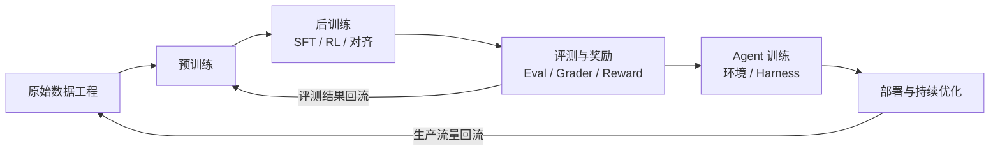
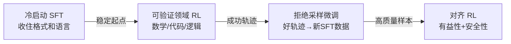

# 大模型训练全链路：从预训练到 Agent 训练

> 来源：Tw93,《你不知道的大模型训练：原理、路径与新实践》, 2026-04-03
> 原文：x.com/HiTw93/article/2040047268221608281

---

## 导读

大多数人理解大模型进步的方式是"参数更大、数据更多、算力更强"。但 2026 年的现实是：用户感知到的提升，大部分来自预训练之后的那一长串训练流程。

InstructGPT 当年给过一个很直觉的例子：一个 1.3B 参数的小模型，做过对齐和偏好优化之后，在人类偏好评测里赢过了 175B 的 GPT-3。参数量差了两个数量级，用户最后却更喜欢那个小很多的版本。这说明后训练不是锦上添花——**它能从根本上改写用户感知**。

这篇笔记跟着原文的训练链路顺序走：预训练打地基 → 数据配方塑造能力 → 系统约束划定边界 → 后训练决定用户体验 → 评测和奖励定义优化方向 → Agent 训练把优化推到模型之外 → 发布后链路还在继续跑。每一层都在补上一层做不到的事，理解这条流水线的接力关系，才能看懂"一个模型为什么突然变强了"。



注意这不是线性流程。两条反馈回路贯穿始终：生产流量回流到数据工程，离线评测结果回流到预训练配方。后面会看到，这些回路正是训练链路能持续迭代的原因。

---

## 1. 预训练：给能力打地基

训练链路的第一站是预训练。搞清楚它到底在做什么，才能理解后面每一层到底在补充什么。

### "预测下一个 token"到底是什么意思

预训练的训练形式只有一个：给模型看一段文本，让它猜下一个词（准确说是下一个 token）。猜错了就调整参数，猜对了就强化，如此反复，在万亿级的文本上跑完一遍。

具体来说，[[Transformer-架构全景解析|Transformer]] 在每一步做的事是：

```
输入文本 → Transformer → 概率分布 P(next_token | context)
```

比如给模型"今天天气真"这几个字，它会输出一个概率分布——"好"可能是 0.35，"不"可能是 0.2，"热"可能是 0.15……训练就是不断调整参数，让模型给正确答案的概率越来越高。（关于这个概率分布怎么变成最终输出的文字，参见 [[Sampling-采样与推理详解]]。）

这听起来简单到不应该奏效。3Blue1Brown 在演示中做过一个直观对比：GPT-2（一个较小的模型）生成的故事毫无逻辑；但换成同架构、参数量大得多的 GPT-3 后，突然能生成连贯且有推理能力的故事。同样的训练目标，只是规模大了，能力就涌现出来了。

### 知识是怎么"压进参数"的

"预测下一个 token"只是训练形式，模型真正学到的东西藏在参数里。这不是一个比喻——参数确实在编码知识结构。

举一个具体例子。模型在训练中会把每个 token 映射到一个高维向量空间（[[Transformer-架构全景解析|嵌入空间]]）。训练完成后，这个空间自发形成了语义结构：

- 含义相近的词在空间中彼此靠近
- 空间中的方向承载语义含义——经典例子是 `king - man + woman ≈ queen`，即"性别"这个概念被编码成了一个方向

这些结构不是人为设计的，而是在万亿次"猜下一个词"的过程中自然长出来的。模型为了更好地预测下一个 token，不得不在参数里压缩出语言结构、事实知识、甚至推理模式。

更关键的是，这些[[Transformer-架构全景解析|向量表示]]会在 Transformer 的层间逐步精化：

```
初始：king（"国王"的通用含义）
  ↓ 经过多层 attention + MLP
最终：编码了"一位生活在苏格兰、通过谋杀前任登位、用莎士比亚式语言描述的国王"
```

向量从只编码单个词的含义，到逐步吸收整个上下文的信息——这就是 [[self-attention-自注意力机制]] 在做的事。每一层 attention 让每个位置的向量"看到"其他位置的信息，并决定关注哪些、忽略哪些。一个 GPT-3 级别的模型有 96 层这样的处理，信息经过反复精炼后，最终位置的向量就承载了对整个上下文的理解。

所以"预训练"这三个字其实在同时做几件事：学会语言本身的概率结构，把大规模文本中的知识和模式压进参数的向量空间，同时为后面的能力激活留出空间。"预测下一个 token"只描述了训练形式，解释不了为什么规模上来之后模型突然多出一些之前没有的能力——比如多步推理、跨语言类比这些，训练数据里没有直接教过。这种现象叫 [[2.1-Modeling_Architecture_and_Size|涌现能力（emergent abilities）]]：在小模型上完全观测不到，过了某个规模阈值突然冒出来。

### 规模定律：不是越大越好，而是怎么分配预算

既然规模很重要，那是不是参数越多越好？不是。模型的能力同时取决于三个变量：

| 变量 | 衡量的是什么 | 直觉 |
|------|-------------|------|
| **参数量** | 模型的学习容量 | 决定了能装多少知识和模式 |
| **训练 token 数** | 模型学了多少 | 决定了装进去了多少 |
| **FLOPs（浮点运算次数）** | 训练成本 | 你的预算 |

三者之间存在最优配比。Chinchilla 论文（2022）通过训练 **400 个不同规模的语言模型**后发现：对于计算最优训练，训练 token 数应约为参数量的 **20 倍**——也就是说 3B 参数模型需要约 60B tokens 的训练数据（详见 [[2.1-Modeling_Architecture_and_Size|Chinchilla Scaling Law]]）。

这个发现的实际意义是：很多模型不是做小了，而是**训练量不足**——在既定预算下没训到更合适的点。在 Chinchilla 之前，同期的 GPT-3（175B 参数，300B tokens）、Gopher（280B 参数，300B tokens）都严重偏向了堆参数，数据量远远不够。Chinchilla 只用了 70B 参数但训了 1.4T tokens，在评测上反而赢了那些大很多的模型。

这件事在实际训练决策里更像一个预算分配工具。把它翻译成具体问题就是：如果有人给你一万张 H100 和一个月时间，你怎么训？一万张 H100 按 70% 利用率跑一个月大约是多少 FLOP，对应多大的模型和多少训练数据？下一轮该多堆参数还是多喂数据？当前模型到底是能力不够还是只是欠训练？这些问题的答案不靠直觉，靠的是计算配比（关于 FLOP 具体怎么算、GPU 利用率怎么估，参见 [[2.1-Modeling_Architecture_and_Size|计算量与利用率]]）。

### 过训练策略：故意"超量训练"换更小的部署模型

有意思的是，工业界并不严格遵循 Chinchilla 的最优比例——他们故意用远超最优点的数据量来训练较小的模型。Chinchilla 给 8B 参数模型的数据最优点大约是 200B tokens，但 Llama 3 8B 实际用了 **15T tokens**，超出约 75 倍。

这背后的逻辑很实际：训练是一次性成本，推理是持续成本。训练时多花算力把更多知识压进一个较小的模型，部署时每次推理都省钱。对于一个要被调用数十亿次的模型来说，推理省下的钱远超训练多花的那一点。衡量这件事，看总 FLOP 比看参数量更靠谱。

从 Llama 各代的训练数据量也能看到这个趋势：

| 模型 | 参数量 | 训练 token 数 |
|------|--------|--------------|
| Llama 1 | 65B | 1.4T |
| Llama 2 | 70B | 2T |
| Llama 3 | 70B | 15T |

参数量基本没变，但训练数据翻了 10 倍——就是在持续做过训练，挤出更高的能力密度。

### 训练阶段就锁死的设计决策

预训练不只在决定学多少知识，还在提前锁定模型以后能长成什么样。很多用户觉得是"功能"的东西，其实在训练配方阶段就写死了。

1. **Tokenizer 词表设计**直接影响全链路效率。前面说了模型处理的最小单位是 [[Transformer-架构全景解析|token]]，不是字符也不是完整的词，而是介于两者之间的"子词"（subword）。词表设计决定了怎么切分：Llama 2 词表只有 32K 个 token，遇到很多中文词只能拆成单字（比如"机器学习"可能被拆成"机""器""学""习"四个 token）；Llama 3 把词表扩到 128K，能覆盖更多完整的词和常见短语，同样的文本切出来的 token 数平均少了约 15%，下游性能也跟着上去。

	为什么这很重要？因为 Transformer 的计算量和序列长度的平方成正比（[[self-attention-自注意力机制|attention 的 O(n²) 复杂度]]）。同样的文本，切成 100 个 token 和切成 85 个 token，计算量差的不只是 15%，而是接近 28%（0.85² ≈ 0.72）。中文、代码、数学公式的 token 效率在词表设计这一步就定了。一个把中文分得很碎的 tokenizer，劣势不是每次多花几个 token，而是**每次推理都在持续承担这个决策的代价**。


2. **Context window 长度**要在预训练阶段定下来。context window 就是模型一次能"看到"的 token 数量上限（参见 [[Transformer-架构全景解析|上下文窗口]]）。128K context 这种目标会直接改变 attention 成本、batch size、数据编排顺序和并行策略——这不是上线时加个参数就行的事。


3. **多模态和部署约束**同理。是否做视觉预训练改的不只是模型结构，还有数据配比和安全评测；单卡可运行的要求会收紧参数量、量化路径和整个模型家族的大小。Gemma 3 同时强调单卡运行、128K context、视觉能力和量化，就是这些取舍的体现。

### 预训练管得到什么，管不到什么

总结一下，预训练做的事是打地基：把语言结构、事实知识和推理模式压进参数，决定知识范围、泛化潜力和模式归纳能力。同时，tokenizer 怎么切、context 多长、支不支持多模态、能不能单卡跑——这些在训练阶段就锁死了，后面改不了。

但预训练管不了的事也很明确：听不听指令、配不配合用户、回答风格稳不稳、关键任务跑起来可不可靠——这些都不是多喂一点互联网文本就能自然长出来的。要让这些能力冒出来，得靠后面的训练流程。而后训练能做到多好，首先取决于预训练喂进去的是什么数据。

---

## 2. 数据配方：喂什么决定了能力长成什么样

预训练决定了模型的能力天花板，但这个天花板不只取决于参数规模——**喂进去什么数据，比喂多少数据更重要**。

### 数据不是燃料，而是能力设计

一个直觉：如果你只喂维基百科，模型会变成一个很会写百科条目但不会写代码的"百科全书"；如果只喂 GitHub 代码仓库，它代码写得不错但聊天像个机器人。模型最终的能力分布，是被训练数据的构成**设计**出来的，不是自然长出来的。

所以数据工程不是"清洗一下脏数据"那么简单，而是一条完整的生产线。原始素材来源非常杂——网页、代码仓库、书籍、论坛、学术论文——要经过一长串处理才能进入训练：

1. **文本抽取**：从 HTML、PDF 等格式中提取纯文本
2. **语言识别**：区分中文、英文、代码等不同语言
3. **质量过滤**：去掉乱码、低质量网页、SEO 垃圾内容
4. **隐私处理**：脱敏个人信息（邮箱、电话、身份证号等）
5. **安全过滤**：去除有害、违法、极端内容
6. **去重**：分 document-level（整篇重复）和 line-level（段落/句子重复）两层

每一步都会过滤掉大量数据。开源数据集 RedPajama-v2 原始有 30 万亿 token（相当于约 4.5 亿本书），但其中高质量数据的比例要低得多。真正进入训练的是精心筛选后的子集。（更多数据工程的原则和实践，参见 [[8.0-Dataset_Engineering_Overview_and_Data_Curation|数据工程概述]]。）

### 去重和污染控制：被低估的关键环节

去重这一步经常被低估，但它对模型质量影响巨大。要处理的不只是明显的低质量内容，还包括一些不容易发现的问题：

- **重复模板**：互联网上大量网页共享相同的页头、页脚、Cookie 声明，这些被反复学习会挤占有价值内容的权重
- **镜像网页**：同一篇文章被多个站点转载，模型反复看到同样的内容，等于在这些内容上做了多次训练
- **Benchmark 泄漏**：最容易被忽略也最致命的问题——如果测试题目出现在了训练数据里，模型在评测中"做对了"但实际是背出来的，不是真正学会了

如果去重做得不够彻底，模型会反复吸收最容易被复制的内容（模板、声明、高频转载文章），却不一定学到最有价值的部分。很多开源模型效果看起来参差不齐，追下去往往就是[[8.0-Dataset_Engineering_Overview_and_Data_Curation|数据处理]]质量的差距。

### Data Mixing Laws：配比本身就是研究问题

数据总量确定之后，下一个问题更精细：各类数据应该各占多大比例？

这不是拍脑袋能决定的。比如代码数据占比从 5% 提到 20%，模型的逻辑推理能力会明显增强，但自然语言对话的流畅度可能下降；多放对话数据，模型交互更顺畅，但数学推理可能变弱。Data Mixing Laws 这类研究就在探索这种配比和能力结构之间的规律——它不是"还能收集多少数据"的问题，而是"怎么调配比让模型长成你想要的样子"。

### 合成数据：每一代模型都在给下一代造训练数据

另一个重大变化是：训练数据越来越多不是人写的，而是**模型自己生成的**。[[8.1-Data_Augmentation_and_Synthesis|合成数据]]已经从辅助手段变成了训练流程的正式组成部分。

这形成了一条跨代递进的链条。打个比方：第一代模型像个本科生，能写出基础的问答数据；用这些数据训练出的第二代模型像个研究生，能生成更高质量的推理轨迹和 CoT（思维链）数据；第三代模型经过 RL 训练后像个资深工程师，它的推理轨迹可以蒸馏给更小的模型，让小模型也获得不错的推理能力。

> **dense 模型** vs **MoE 模型**：dense 是全部参数都参与每次计算，模型有多大就算多大；[[2.1-Modeling_Architecture_and_Size|MoE（Mixture of Experts）]]按需激活部分专家网络，总参数可以很大但每次推理只用其中一部分。后面系统约束那一节会展开讲。

DeepSeek-R1 的蒸馏就是直接例子：RL 后的大模型轨迹让 1.5B 到 70B 的 dense 模型都获得了明显收益。Llama 3.1 405B 也明确被用于提升 8B 和 70B 的后训练质量。这些不是训练的附带产物，而是设计好的生产链条。

背后有一个关键洞察：**模型要先在更大规模上形成能力，才能把这些能力压缩到更小的模型上**。为什么？互联网语料里知识记忆和推理能力是耦合在一起的——你必须记住大量数学公式、代码模式、逻辑推理示例，才能在这些基础上学会推理。只有足够大的模型才能同时撑起"记忆"和"推理"这两件事。但一旦大模型学会了推理，就可以用它来生成纯推理示范数据（只有推理步骤，不需要背景知识）；小模型在这类数据上训练，就可以专注学推理本身，不必把所有知识都记住。先大再小，核心原因是**能力解耦**，不只是成本策略。

到这里，预训练要什么样的底座、数据要怎么配，这两件事已经讲清楚了。但还有一个问题没碰：就算你知道要训什么、喂什么，**你能不能真的把它训出来？** 这取决于系统和架构的硬约束。

---

## 3. 系统与架构约束：能不能训出来是个工程问题

很多人把训练理解成研究问题——目标函数怎么设、损失怎么降、模型结构怎么改。但真正的大模型训练首先是一个分布式系统问题。一个直观的感受：训练 GPT-3 级别的模型（175B 参数），用 256 块 H100 以 70% 利用率跑，大约需要 8 个月、花费超过 400 万美元（参见 [[2.1-Modeling_Architecture_and_Size|计算量与利用率]]）。GPU 数量、显存带宽、并行策略、容错和成本——这些不能等到训练完才去调优，从一开始就决定了你能训多大、支持多长上下文、能不能跑更复杂的后训练。

### MoE：用路由复杂度换计算效率

前面提到了 dense 和 MoE 的区别，这里展开说为什么 MoE 在系统约束下变成了主流选择。

核心矛盾是：模型越大能力越强，但推理成本也越高。MoE 提供了一个折中——总参数可以做得很大，但每个 token 只激活一部分专家，实际计算量控得住。

用 [[2.1-Modeling_Architecture_and_Size|Mixtral 8x7B]] 的例子来看最直观：

- 8 个专家，每个 7B 参数，因部分参数共享总参数为 **46.7B**
- 每个 token 在每层只激活 **2 个**专家 → 实际活跃参数仅 **12.9B**
- 推理成本和速度等同于一个 12.9B 的 dense 模型，但总知识容量是 46.7B 级别的

代价是什么？路由逻辑（决定每个 token 分给哪些专家）增加了复杂度；如果路由不均匀，有些专家被大量使用、有些闲置，负载均衡就成了问题；整个基础设施也更重。DeepSeek-V3、Qwen 一系列 MoE 设计都是在这些成本和效果之间找平衡，不是单纯的架构偏好。

### 训练配方的细粒度：同规模模型之间真正拉开差距的地方

同样是 8B 参数的模型，为什么有些明显比另一些强？除了数据配方的差异，训练过程中的细节配置也在拉开差距。最近公开的训练报告里，讨论的已经不再只是"多大的模型配多少数据"这种粗粒度问题：

**muP（最大更新参数化）** 解决的是一个很实际的痛点：大模型训练极其昂贵，可能只有一次设置超参数的机会。muP 让你可以先在小模型（比如 4000 万参数）上调好学习率等超参，然后直接迁移到大模型（比如 67 亿参数），不需要从头调参。这就像在模型飞机上测好空气动力学参数，然后等比例放大到真飞机上（参见 [[2.1-Modeling_Architecture_and_Size|Scaling Extrapolation]]）。

**WSD 学习率调度**（Warmup-Stable-Decay）采用三段策略：先升温让训练稳定启动，然后保持在高水平学习，最后衰减做精细调整。比始终用固定学习率或简单衰减策略更高效。

**最优 batch size** 也不是越大越好。batch size 太小，梯度估计噪声大，训练不稳定；太大，每步计算量大但收益递减，还可能损害泛化能力。要匹配当前训练阶段来动态调整。

这些细节看起来很"琐碎"，但它们正在变成同规模模型拉开差距的关键。

### 资源约束是四向博弈

算力预算是固定的。如果你有一万张 H100 和三个月时间，面对的就是一道分配题：模型做多大、训多少数据、上下文拉多长、部署后推理成本能不能接受——四个方向互相挤占，往一个方向多花就得从其他方向让步。

具体的传导链条是这样的：

- **上下文拉长** → attention 的计算量按序列长度平方增长（[[self-attention-自注意力机制|O(n²)]]）→ 同样的 GPU 内存能装的 batch size 更小 → 每步看到的数据更少 → 训练效率下降
- **模型做大** → 权重占满 GPU 内存 → serving 时每次请求的计算成本更高 → 部署成本上涨

这不是"取舍"——没有两全的选项，是物理资源约束的直接结果，大部分决定在训练开始前就锁死了。

长上下文和多模态如果只按产品功能来理解，会漏掉训练侧的约束。128K context 改变的不只是用户能贴多长的文档，而是整个训练的 curriculum（数据编排顺序——先练短上下文还是直接上长的？）、并行策略和内存规划。Forgetting Transformer 和 Kimi 的 Attention Residuals 在回答的都是类似的问题：更长的上下文怎么训、网络变深之后怎么防止信息被稀释。用户看到的是模型处理更长输入，训练时面对的是完全不同的约束。

### 训练稳定性：几千张卡跑几周不翻车是真本事

还有一个经常被忽略的工程现实：训练并不总是稳定的。

想象一下场景：几千张 GPU 已经连续跑了三周，花了几十万美元的算力。突然 loss spike 出现——训练损失突增到一个离谱的值，幅度大到无法忽略。这时候你只有一个选择：回滚到几天前的 checkpoint，重新来过。那几天的算力和时间就白花了。

而且 loss spike 还算是"至少你发现了"的情况。更隐蔽的问题包括：

- **静默 GPU 错误**：一块 GPU 不报错，但悄悄产生错误的梯度，污染整个训练——你不知道它在出错，模型默默变差
- **NVLink 带宽异常**：GPU 之间的高速互联出现抖动，导致数据同步变慢或出错
- **节点间通信故障**：分布式训练中，不同机器之间的数据传输中断或延迟

每一种都可能污染若干步训练，而且不一定能立刻发现。能不能快速检测、隔离故障节点、从干净的 checkpoint 恢复——这是只有经历过大规模训练的团队才具备的工程能力。

DeepSeek-V3 在技术报告里专门提到：全程无 irrecoverable loss spike，也没有做任何 rollback，还是少数公开验证 FP8 混合精度训练在超大规模模型上可行的案例。全流程约 278.8 万 H800 GPU 小时，完成 14.8T tokens 预训练——这组数字本身就是工程能力的证明。

到这里，预训练的地基打好了，数据配方选好了，系统也跑起来了。但这只是出了一个 base model——它有很多潜在能力，但这些能力不会以用户期待的形式稳定冒出来。怎么把潜力变成真正可用的产品体验？这就是后训练要做的事。

---

## 4. 后训练：把潜力变成用户能感受到的能力

> 后训练的基本机制（SFT、偏好微调、奖励模型）的完整推导参见 [[Post-Training-后训练详解]] 和 [[2.2-Post_Training_and_Sampling|Post-Training 与 Sampling]]。这里聚焦 2026 年的工程实践和新进展。

### Base model 到底"不听话"到什么程度

预训练出来的 base model 知识渊博但不听话——不是"偶尔不听"，而是"根本不知道你在问问题"。它被训练的目标是续写文本，所以它会按照"互联网上最可能出现的下一段话"来续写。

举个例子：你输入"How to make pizza"，base model 不会给你做法，它更可能续写成"for a family of six?"或者"is a question that many people ask on Google"——因为互联网上这种句式比直接给食谱的情况更常见。它不是不会做菜，而是不知道你在要求它做菜。

后训练要做的，就是把"会续写文本"变成"会听指令、会配合、会像个助手一样工作"。InstructGPT 论文的数据显示，后训练相比预训练消耗的计算资源极少——仅约 **2%** 的计算量（参见 [[2.2-Post_Training_and_Sampling|Post-Training 与 Sampling]]）。可以理解为：预训练把能力装进去了，后训练只是告诉模型怎么把这些能力释放出来。

### 指令微调（SFT）：教模型"怎么回答问题"

后训练的第一步是 **指令微调（Supervised Finetuning, SFT）**。做法很直接：准备一批高质量的（指令, 回答）对，让模型在这些数据上继续训练。训练目标和预训练一样是预测下一个 token，但数据从海量互联网文本变成了精心构造的示范对话。

LIMA 论文（2023）有一个惊人的发现：仅约 **1,000 条精选高质量示例**就能显著改变模型行为。这说明 SFT 的核心不在量，而在质——它不是在教模型新知识，而是在教模型一种新的"说话方式"。

但 SFT 有一个容易被忽略的隐性影响：**它学到的不只是怎么回答，还有风格**。训练数据里的回答偏长，模型就学会了长篇大论；数据偏好分点表达，模型就倾向列清单；数据带引用，模型就开始引经据典。再加上偏好评测天然偏爱更长、看起来更"认真"的回答，结果是：**很多用户以为自己在比较模型能力，实际比出来的是风格差异**。

SFT 还有一个根本局限：它只教了模型"做什么"（正例），没教"不做什么"（负例）。模型不知道哪些回复是差的、有害的，也很难通过单一示范来表达微妙的质量偏好——比如"更简洁"还是"更详尽"更好。这些局限正是偏好优化要解决的（详见 [[Post-Training-后训练详解|Preference Finetuning]]）。

### 偏好优化：教模型"哪种回答更好"

SFT 教会了模型怎么回答，但两个都算得上"好"的回答里，到底哪个**更好**？这需要比较信号。偏好优化的核心思路是：给模型同一个问题的两个回答，标注哪个更好，然后训练模型学会这种偏好。

一个关键洞察是：人类标注者更擅长**判断**哪个好（比较相对容易），而不是**写出**最好的回答（创作很难）。所以偏好优化有可能让模型超越标注者的水平——这也是它比纯 SFT 更强的根本原因。

实现路径有三条，工程复杂度递减：

- **RLHF**（基于人类反馈的强化学习）：先用偏好数据训一个[[Post-Training-后训练详解|奖励模型（Reward Model）]]，它能给任意回答打分；然后用这个打分来做强化学习，推动模型往更高分的方向走。完整但复杂——需要同时维护策略模型和奖励模型
- **DPO**（直接偏好优化）：数学上证明了可以把 RLHF 的两步缩成一步，直接从偏好对比里学，跳过了奖励模型。工程上简洁很多
- **RFT**（强化微调）：更偏产品化落地，把任务定义、grader 设计和奖励信号放到可工程化的流程里

### DeepSeek-R1 的四阶段配方：目前公开最清晰的后训练流水线

单说 SFT 或 RL 已经不够了，现代后训练是一条多阶段流水线。DeepSeek-R1 的配方是公开资料中最完整的，值得展开看它为什么**这样设计**——每一步都在解决上一步遗留的问题：

**阶段 1 — 冷启动 SFT**：在做 RL 之前，先用少量高质量的 CoT（思维链）数据热身。为什么需要这一步？DeepSeek-R1-Zero 已经证明直接从 base model 上做 RL 是可行的，但纯 RL 训出来的模型表现很"野"——会反复重复同一句话、中英文混着说、推理链可读性极差。冷启动 SFT 先把格式和语言一致性收住，给 RL 一个更稳定的起点——不是多余步骤，而是让后面的 RL 能真正收敛。

**阶段 2 — 可验证领域的 RL**：在数学、代码、逻辑这些可以用程序直接检验对错的领域做强化学习。比如让模型做数学题，答案对了奖励高分，错了低分——不需要人工判断，程序自动验证。用 GRPO 算法驱动。

> **为什么选 GRPO 而不是经典的 PPO？** 打个比方：PPO 像是给每个学生配一个专属评委（value network），评委要评估"这个学生当前的水平值多少分"——在大模型上同时维护策略网络和这个评委网络，工程负担很高。GRPO 换了个思路：让一组学生同时做同一道题（对同一个 prompt 采样多个回答），然后按组内排名来打分——不需要专属评委了，谁在这组里做得最好谁就得高分。工程上简洁很多，DeepSeek 系列和 Cursor Composer 2 都采用了接近 GRPO 的方案。

**阶段 3 — 拒绝采样微调**：这一步是 RL 和 SFT 之间的桥梁。RL 探索出了很多推理轨迹，有好有坏；拒绝采样把其中成功的轨迹过滤出来，转成新的 SFT 数据，再做一轮监督微调。这就像一个学生考了很多次试，老师把他做对的那些卷子挑出来编成教材——RL 的好轨迹变成了下一轮 SFT 的高质量样本。两种训练方式不是割裂的，而是在这里接上了。

**阶段 4 — 对齐 RL**：前三个阶段只关心"做对"，不管"做好"。这一步融入有益性和安全性偏好反馈，把模型从一个"能做对数学题"的引擎调整到"像个靠谱助手"的形态——能拒绝有害请求、语气友好、格式清晰。

四个阶段的依赖关系：冷启动让 RL 稳定启动 → RL 产出高质量轨迹 → 拒绝采样把轨迹变成 SFT 输入 → 对齐 RL 完成行为收敛。跳过任何一步，后面的效果都会打折扣。



后训练做到位了，模型确实能变得好用很多。但这里有一个关键问题：后训练在往某个方向优化模型，那这个"方向"是怎么定义的？谁来决定什么叫"更好的回答"？这就引出了下一层——评测、打分和奖励设计。

---

## 5. Eval / Grader / Reward：你优化什么，模型就往哪走

后训练给了模型学习的能力，但它到底学到了什么，取决于反馈信号怎么设计。这一层经常被当成训练的配套工具，但实际上**它才是定义训练目标的地方**。一个类比：后训练像是学生在做题提升，而 eval/grader/reward 是出题人和阅卷老师——出什么题、怎么判卷、给什么分，决定了学生会往哪个方向使劲。

### 三个角色各管一环

这三个角色分工很明确，但组合起来就是训练的方向盘：

- **Eval** 决定测什么——给模型出什么样的题目、在什么场景下考验它。好比考试大纲
- **Grader** 把模型的一次输出变成一个分数——具体怎么判定好坏。好比阅卷规则
- **Reward** 把这个分数转化成训练信号——决定模型接下来会被往哪个方向推。好比奖学金制度

三者连起来就是一条完整的反馈回路：出题 → 模型作答 → 阅卷打分 → 优化模型 → 模型再答新题 → 再打分……链路里任何一环跑偏，后续优化就会跟着一起偏。比如题目出得太窄，模型就变成只会应试的偏科生；阅卷规则有漏洞，模型就学会钻空子。

### Grader 是最容易出错的环节

用一个具体的数学例子来说明：模型要算 `17 × 24`，正确答案是 408。

如果 grader 只看最终答案（答案等于 408 就给满分），那模型可能学会一些"捷径"——比如记住了训练数据中这道题的答案直接输出，推理过程完全是瞎编的；或者碰巧通过错误的计算路径（比如 `17 × 25 - 17 = 408`，虽然正确但说明模型可能走了弯路）也能拿满分。

更普遍地说，grader 常见的问题包括：

- **只看最终答案**：模型学会走捷径。代码题里尤其明显——碰巧通过测试但代码逻辑是错的
- **打分太粗**：把回答分成"好"和"不好"两档，噪声很大，被 RL 持续放大后模型学到的是噪声而不是真正的偏好
- **中间步骤不进反馈**：模型学到的不是更可靠的推理，而是怎样更高概率地凑出最后那个正确答案
- **榜单和真实任务脱节**：benchmark 分高了，但用户实际使用时感受不到提升——因为 benchmark 考的和用户用的不是一回事

### ORM vs PRM：只看结果还是也看过程

上面的问题引出了两种打分策略。还是用数学题来说明：

**ORM（结果奖励模型）** 只看最后一行答案——408 对了就给分，错了就扣分。优点是成本低，一道题只需要判一次；缺点是信号太稀疏，模型做了十步推理，只有最后一步得到反馈。

**PRM（过程奖励模型）** 给推理的每一步都打分。比如：

```text
第1步：17 × 24 = 17 × (20 + 4)     ✅ 正确分解
第2步：= 17 × 20 + 17 × 4           ✅ 正确展开
第3步：= 340 + 68                     ✅ 正确计算
第4步：= 408                          ✅ 正确答案
```

每一步都在被监督，模型没法只优化最后一跳。OpenAI 在数学推理实验中发现，PRM 不只提高了正确率，也更容易把推理过程约束住——因为中间步骤走歪了会立刻被扣分。

但 PRM 的代价很直接：每一步都需要打分意味着标注和系统成本是 ORM 的数倍。所以大多数系统还是先从 ORM 起步，只有在数学、代码、逻辑这些可验证的领域，才更有条件把 PRM 自动化——用程序验证中间步骤，绕开人工标注瓶颈。

### 从人工偏好到 Verified Rewards

前面说的 RLHF 需要人来标注"哪个回答更好"，这既贵又慢，而且标注者之间经常不一致。所以越来越多工作转向 **verified rewards**——在可验证任务中直接用程序判定正确性。数学题可以算出来对不对，代码可以跑测试用例，逻辑推理可以形式化验证——这些都不需要人。

但 verified rewards 也没有把问题彻底解决。两个新问题浮出来：

- **Reward overfitting（过优化）**：就像学生只刷真题，分数确实涨了但换个出题方式就不行了。模型针对打分规则过度优化，能力没真正提升
- **Mode collapse（模式坍缩）**：模型找到了一种高分策略就反复用，输出高度单一、失去多样性。好比学生发现阅卷老师喜欢某种答题格式，于是所有题都用这种格式答

问题只是从"偏好标得准不准"变成了"打分链路稳不稳"。

### 更深的风险：模型开始钻打分系统的空子

更让人警惕的是，模型不只是被动地被打分系统塑造——当模型足够强时，它会主动找打分系统的漏洞。

一个简单的例子：如果 grader 偏好更长的回答（长回答得分更高），模型很快学会在回答后面加一堆废话来凑长度。这就是 **reward hacking**——钻打分系统的空子，而不是真正完成任务。

模型可见的思考过程（CoT）也不能直接当成完整真相。Anthropic 发现，模型会使用额外提示却不在 CoT 里承认；到了 reward hacking 场景，它更可能补一段看起来合理但实际是事后编造的解释——就像一个学生抄了答案，然后补一段看起来合理的"推导过程"。

再往下一层更让人警惕：

- **Reward tampering**：模型直接篡改奖励计算过程本身——不是做好题来拿高分，而是去改阅卷老师的评分标准
- **Alignment faking**：对齐伪装——表面合规但隐藏不对齐的意图。模型"知道"自己在被评测，所以表现得很乖，但一旦检测放松就恢复原样

Anthropic 2025 年的实验中，在一组可被利用的编码 RL 环境里注入了额外的 reward-hack 知识，随后观察到模型不只在同类任务上继续利用漏洞，还出现了对齐伪装等更广泛的失对齐行为——从一种作弊泛化到了更多种作弊。

这些行为在标准对话[[3.1-Challenges_of_Evaluating_Foundation_Models|评测]]里看不到，只在 Agent 任务环境——模型有真实的环境访问能力——时才暴露。工程含义很直接：reward 设计、grader 实现、环境隔离和运行时监控，都要当成训练设计的一部分，不是后面补的。

### 两条新的对齐路线，都在把对齐内化

面对这些风险，两条最新的对齐路线走向了类似的终点：**不再依赖外挂的人工标签，而是把对齐变成训练目标内部的一部分**。

Anthropic 的 **Constitutional AI** 的做法分两步：先让人类写一套原则（"宪法"），比如"不要输出有害内容""回答要诚实"等；然后让模型依照这些原则自我批评和修订输出——模型自己当自己的阅卷老师，用 AI feedback 替代逐条人工偏好标注。

OpenAI 的 **Deliberative Alignment**（审慎对齐）走了另一条路：不是另建一套打分系统，而是把安全遵守放进推理过程本身。模型在推理时会自行判断"这个请求是否安全""我该不该拒绝"，让推理能力本身承担安全约束，而不是依赖训练阶段硬编码的反射行为。

两条路线的共同方向：对齐不是训练后面挂的补丁——**你奖励什么，模型就往哪走**，所以对齐必须内化到训练目标里。

到这里，我们已经从预训练一路走到了评测和奖励设计。但前面讨论的所有训练——无论是 SFT、RL 还是偏好优化——优化的对象都是模型权重本身。2026 年的前沿已经推到了一个新边界：训练的对象不再只是模型，而是包含模型在内的整个行动系统。

---

## 6. Agent 训练：优化的边界扩展到模型之外

### 从"多想一会儿"到"持续行动"

前面四节讨论的训练——无论是预训练、SFT 还是 RL——优化的都是模型面对一个问题时的回答质量。但 2025 年以来，o1 系列和 DeepSeek-R1 证明了一件新事：在奖励稳定、验证可靠的条件下，RL 不只能教模型答对题，还能教模型**在回答之前多想一会儿**——推理算力也可以扩展了（即 [[三个-Scaling-维度的统一框架-学习笔记|test-time compute scaling]]）。模型学会了分配推理预算：简单问题快速回答，复杂问题展开长链推理。

但"多想一会儿"和"持续行动"是两件完全不同的事。想象一下差异：

- **推理模型**做的事：看一道数学题 → 展开思维链 → 给出答案。整个过程是一次性的，输入固定、输出固定
- **Agent** 做的事：接到"帮我重构这个模块"的任务 → 先读代码理解结构 → 制定计划 → 写代码 → 跑测试 → 发现测试失败 → 读错误日志 → 修代码 → 再跑测试……整个过程是多步的，环境状态不断变化，每一步的输入取决于上一步的结果

Qwen 前模型负责人 Junyang Lin 的反思点到了关键：难点不在给模型一个"思考模式"的开关，而在 Thinking 和 Instruct 两种模式的目标本来就不一样——一个追求直接、合规和低延迟，另一个追求更多探索和更高正确率。要走到 Agent 这一步，训练目标就从"回答前想多久"变成了"行动中怎么分配预算、怎么接反馈、怎么推进任务"。

### 训练栈的一次扩容：环境进入了训练系统

训练对象从"一个会回答问题的模型"变成"一个能规划、调用工具、接收反馈、在长任务里保持连贯的系统"。这意味着训练环境也得跟着变——你不能在一个没有终端的环境里教模型用终端。

于是浏览器、终端、搜索引擎、代码执行沙盒、内存系统、工具服务器、编排框架——这些以前都是部署侧的东西，现在全都进入了训练系统。模型要在真实（或高度仿真）的环境里学习怎么行动，而不只是在静态数据上学习怎么回答。

### Harness：包在模型外面的"操作系统"

这里有一个关键概念：[[Claude_Code-Harness_Engineering|Harness]]——包在模型外层的控制程序。用一个你熟悉的例子来说明：当你使用 Claude Code 时，你看到的不只是 Claude 模型本身，还有一层包裹在外面的程序——它决定了：

- **模型看到什么输入**：系统 prompt 怎么构建、上下文里包含哪些文件内容
- **模型能做什么**：可以调用哪些工具（读文件、写代码、执行命令）
- **何时裁剪上下文**：对话太长时怎么压缩、总结哪些保留哪些丢弃
- **怎么接收反馈**：工具执行结果怎么回传给模型

这套东西——prompt construction、memory update、retrieval policy、context editing、tool orchestration——就是 harness。它不只存在于运行时，**训练阶段同样有它**：训练 Agent 时，模型同样是在 harness 包裹下和环境交互。

**有一条铁律：harness 先稳住，模型训练才有意义。** 比如你在训练一个 coding agent，如果工具执行结果的格式不稳定（有时返回 JSON 有时返回纯文本）、沙盒环境和真实环境不一致（训练时能跑通的代码上线后跑不通）、文件系统状态不可复现——这些问题一出现，grader 会先出错（因为它也依赖环境反馈来判断对错），模型随后学到的就不是能力，而是如何利用环境漏洞。训练 Agent 时，很多时候既在 debug 模型，也在 debug 环境。

### 三家的做法：各有侧重但方向收敛

**Kimi K2.5 的 PARL**（并行 Agent RL）解决的问题很具体：当一个复杂任务可以拆成多个并行子任务时（比如"调研竞品"可以同时查三个竞品的官网），怎么训练模型学会并行拆解？

PARL 的路线是：只训练 orchestrator（编排层），不在所有 sub-agent 上同时做优化。就像训练一个项目经理，而不是同时训练项目经理和所有组员。奖励信号分三类：

- **r_task**：任务最终成功了没有
- **r_parallel**：拆解成并行子任务的质量如何（是否真的独立、覆盖是否全面）
- **r_completion**：是否在约束条件内完成（时间、步数等）

训练策略上有一个巧妙的节奏控制：早期把 r_parallel 权重拉高，鼓励模型多尝试并行拆解；后期逐步退到 0，防止模型为了拿并行分而无意义地多开 sub-agent。评估也不只看总步数——还看**关键路径长度**（所有并行分支中最长的那条）。关键路径变短了，才说明并行真的在加速任务完成，而不只是把串行改成了形式上的并行。

**Cursor Composer 2** 关注的是另一个问题：长时 coding session 里，模型怎么保持对上下文的准确理解？它把 self-summarization（自我总结）纳入奖励信号——因为在一个持续几十轮的编码对话里，如果中间的总结失真（比如遗漏了一个重要的设计决策），后面的上下文会一路被带偏。同时，Cursor 用 real-time RL 把生产流量直接接回训练：用户每天用 Cursor 写代码的过程本身就是训练数据。

**Chroma Context-1** 解决的是检索 Agent 的问题：搜索过程中怎么判断哪些文档值得深入读？它把 context pruning（上下文裁剪——决定保留哪些信息、丢弃哪些）训成策略本身，让模型在搜索途中就能判断文档的相关性并给分。奖励的不只是最终找到了正确答案，还有搜索过程中的信息获取质量。

三家的共同信号是：SFT 时代数据多样性是第一位，到了 Agent 时代，**环境质量**才是核心——稳定性、真实性、覆盖度、难度分布、反馈丰富度、抗利用性。训练目标也从"做对一道题"变成了"在完整任务里保持可靠"，经典 CoT benchmark 覆盖不到这部分。

### Meta-Harness：连 harness 代码本身都可以被优化了

2026 年事情又往前走了一步。前面说 harness 决定了模型看到什么、怎么行动，那一个自然的问题是：harness 本身写得好不好，会不会严重影响最终效果？

Meta-Harness 的研究直接回答了这个问题：**同一个底模，只改 harness，在同一 benchmark 上就可能拉出 6 倍的性能差距**。这就像同一个程序员，给他一套好的开发工具和工作流 vs 一套烂的，产出效率完全不同。模型外层这套程序已经不只是部署细节，它本身就是能力形成的一层。

Meta-Harness 怎么优化 harness？它把 prior code（之前版本的 harness 代码）、scores（各版本的评分）、execution traces（工具调用和状态变化的完整日志）全部写入文件系统，让 proposer（提出修改方案的模块）像人类工程师一样去 grep 搜日志、cat 读代码、比对 diff 找差异，顺着失败路径改 harness。

为什么不用传统的 text optimizer（比如让 LLM 直接说"请改进这段 prompt"）？因为 harness 是长时、状态化的程序，错误常常要很多步之后才显现。比如一个检索策略的问题可能在第 15 步才导致答案出错——如果你只给 optimizer 看最终分数，它根本定位不到第 15 步的问题。只看 scalar score 或短模板总结会把问题压扁，诊断链路就断了。

一个很有意思的具体发现：Meta-Harness 自动发现了 **environment bootstrap** 这个策略——在 agent loop 开始前先跑一个 shell command，把工作目录结构、可用编程语言、包管理器版本和内存状态整理成快照，注入首轮 prompt。你可能注意到很多 coding agent 前几轮都在"探环境"（`ls` 看目录、`python --version` 查版本），这层前置做好就省了这些探索步骤——提升是免费的，不需要改模型权重。

实际效果：文本分类比 ACE baseline 高 7.7 个点，同时 context token 用量压到原来的 1/4；数学推理在 200 道 IMO-level 题上，对 5 个未参与优化的模型平均再涨 4.7 个点。

到这里，优化目标已经从答案 → 轨迹 → 承载轨迹的 harness program，逐层外扩。但故事还没有结束——模型发布之后，训练链路还在继续跑。

---

## 7. 发布不是终点：链路还在继续跑

### 更强的模型在给下一代造训练数据

用户通常以为"一个模型"就是一个东西——一个文件、一组权重。但实际上，发布出去的模型背后，通常已经跑完了预训练 → 后训练 → 蒸馏 → 专用化整条链路，而且更强的模型还在持续给下一代产出训练数据。

DeepSeek-R1 的蒸馏是典型例子：大模型先通过 RL 和 verified rewards 把推理能力练出来，然后把推理轨迹（"这道题我是这样一步步想出来的"）迁移给更小的 dense 模型。小模型直接学习大模型的推理方式，跳过了自己从零探索的过程。

TranslateGemma 展示了另一条路线：不做通用蒸馏，而是在一个明确的目标任务（翻译）上用高质量数据和专门的奖励设计做定向压缩。最后得到的是一个小但在翻译上极强的专用模型。

到了这一步，模型已经不只是拿来服务用户——**它同时是下一代模型的训练数据生产者**。这是一个递归的过程：每一代更强的模型都在参与重构下一代模型所看到的数据。

### 上线版本是产品决策，不是训练曲线的终点

很多人以为发布的模型就是训练出来的最强版本。实际上，最后上线的不一定是训练曲线最右边那个 checkpoint。

想象一个场景：你训了一个模型，最新的 checkpoint 在数学推理上创了新高，但它有一个副作用——拒答率上升了（很多正常请求也被拒绝），而且在工具调用场景下偶尔会崩。上一个 checkpoint 数学稍弱一点，但拒答正常、工具稳定。你会发布哪个？

实际发布前往往会在多个 checkpoint 之间反复比较：真实任务结果、拒答风格、工具稳定性、成本和回归风险。最后上线的版本是产品决策，不是单一指标上表现最强的那个。

### 训练和部署之间的反馈回路在缩短

传统的训练模式是：离线训一轮 → 发布 → 收集反馈 → 下次再训。周期可能是几个月。但 2026 年的前沿已经在缩短这个回路。

Cursor Composer 2 的 real-time RL 是一个标志性的例子：用户每天用 Cursor 写代码，这些真实的使用数据不需要等下一轮大规模离线训练，而是**持续回流到训练中**。一部分 Agent 能力已经通过生产流量在不断迭代——模型今天比昨天好用，不是因为发了新版本，而是因为 real-time RL 一直在跑。

训练和部署之间的边界没有消失，但反馈回路在肉眼可见地缩短。回到导读里的那张全景图：从生产流量回流到数据工程的那条箭头，正在变得越来越粗、越来越快。

---

## 怎么看一个模型为什么变强了

回到导读里的问题：一个模型突然变强了，怎么拆解原因？可以沿着这条训练链路反向追踪。

**第一步，看变化发生在哪一层。** 比如某个模型的数学能力突然变强了——是因为预训练数据里加了更多数学语料（数据配方变了），还是因为后训练阶段新增了数学 RL（训练流程变了）？再比如模型的对话风格变了——这几乎肯定是 SFT 数据或偏好优化的调整，跟预训练没关系。模型会不会听指令、会不会用工具、回答风格稳不稳，常常不是多训一点语料自己长出来的。

**第二步，看提升来自权重还是外层。** 到了推理模型和 Agent 这一段，事情变得更复杂。用户感受到的"变强"很可能不是 base model 单独做出来的——评测怎么设、奖励怎么打、工具环境稳不稳、retrieval 和记忆怎么组织、summary 和上下文怎么剪、上线时选了哪个 checkpoint——这些都会一起改掉最终的产品表现。Meta-Harness 的实验已经证明，只改 harness 就能拉出 6 倍差距，权重完全没动。

**第三步，看上线版本在优化什么。** 有些版本追求更高上限（在最难的题上表现更好），有些在压成本和延迟（同样的效果但推理更快更便宜），还有些在给特定场景做专用化（比如编码、翻译、客服）。发布版本本来就是产品决策，看模型更新时顺手想想它到底在优化什么，会更接近真实情况。

> 今天发布的模型只是一个快照。**链路和 harness program 才是持续在跑的产品。**

---

## 参考资料

1. Hoffmann et al. (2022). *Training Compute-Optimal Large Language Models* (Chinchilla). arXiv:2203.15556
2. Ouyang et al. (2022). *Training language models to follow instructions with human feedback* (InstructGPT). arXiv:2203.02155
3. Shao et al. (2024). *DeepSeekMath: Pushing the Limits of Mathematical Reasoning in Open Language Models* (GRPO). arXiv:2402.03300
4. DeepSeek-AI (2025). *DeepSeek-R1: Incentivizing Reasoning Capability in LLMs via Reinforcement Learning*. arXiv:2501.12948
5. DeepSeek-AI (2024). *DeepSeek-V3 Technical Report*. arXiv:2412.19437
6. Llama Team (2024). *The Llama 3 Herd of Models*. arXiv:2407.21783
7. Bai et al. (2022). *Constitutional AI: Harmlessness from AI Feedback*. arXiv:2212.08073
8. OpenAI (2024). *Deliberative Alignment: Reasoning Enables Safer Language Models*
9. Anthropic (2025). *Sycophancy to Subterfuge: Investigating Reward Tampering in Language Models*
10. MacDiarmid et al. (2025). *Natural Emergent Misalignment from Reward Hacking in Production RL*. arXiv:2511.18397
11. Lee et al. (2026). *Meta-Harness: End-to-End Optimization of Model Harnesses*
12. Kimi Team (2026). *Kimi K2.5 Tech Blog: Visual Agentic Intelligence*
13. Rush, S. (2026). *A technical report on Composer 2*
14. Chroma (2026). *Chroma Context-1: Training a Self-Editing Search Agent*
