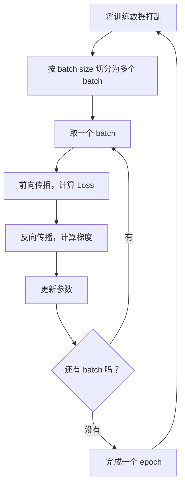
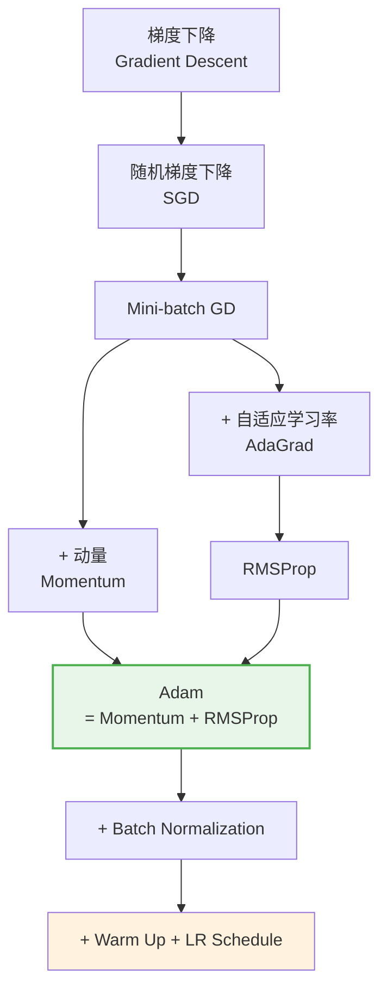

# 深度学习基础

> [!info] 导航
> 本篇是深度学习系列的第一篇，涵盖神经网络的核心概念。后续篇章：
> [[02-CNN与RNN-学习笔记]] | [[03-注意力机制与Transformer-学习笔记]] | [[04-预训练与生成式AI-学习笔记]] | [[05-生成模型与强化学习-学习笔记]]

---

## 1. 机器学习的本质：寻找函数

### 1.1 为什么要从"函数"说起？

所有机器学习问题的本质可以归结为一件事：**自动寻找一个函数（模型）**。输入一些特征（feature），输出我们想要的结果。至于输出是什么，决定了我们在做哪类任务：

| 输出类型 | 任务名称 | 例子 |
|---------|---------|------|
| 标量（数值） | 回归 (Regression) | 预测房价、股票走势 |
| 类别标签 | 分类 (Classification) | 垃圾邮件判断、图像识别 |
| 复杂结构 | 结构化学习 (Structured Learning) | 文本生成、语音合成 |


### 1.2 找函数的三步走


1. **设定范围** — 选择模型架构，决定函数的"搜索空间"。比如用线性模型还是神经网络？
2. **设定目标** — 定义损失函数（Loss），量化"模型有多差"。
3. **达成目标** — 用优化算法（如梯度下降）不断调参，让 Loss 越来越小。


> [!tip] 模型大小
> "模型大小"指的是参数数量。数据量小的时候，模型不宜太大，否则容易**过拟合**（overfitting）——在训练集上表现好，换个数据集就不行了。

---

## 2. 训练中会遇到的问题

模型训练并非一帆风顺，常见的问题可以归为四类：


### 2.1 Model Bias（模型偏差）

**问题**：模型太简单，连训练数据都拟合不好。比如用一条直线去拟合抛物线数据。

**解决**：增加模型复杂度——更多特征、更多层、更多神经元。


### 2.2 Optimization Issue（优化困难）

**问题**：模型够复杂，但梯度降不下去，卡在 critical point（梯度为零的点）。

**如何区分 Model Bias 和 Optimization Issue？** 看训练集上的 Loss：
- 训练 Loss 高 → 可能是 Model Bias，也可能是 Optimization Issue
- 换一个更简单的模型，如果简单模型训练 Loss 反而更低 → 说明是 Optimization Issue

### 2.3 Overfitting（过拟合）

**问题**：训练集 Loss 低，测试集 Loss 高。模型把训练数据的"噪声"也学进去了。

**解决**：
- 增加训练数据
- 控制模型复杂度（减少参数、正则化）
- 使用 **train/validation split**：把训练集分出一部分做验证，用验证集选模型


### 2.4 Mismatch（分布不匹配）

**问题**：训练数据和测试数据的分布不同。比如用白天的照片训练，却要识别夜景。

这类问题无法通过调参解决，需要从数据层面入手。


---

## 3. 神经网络

### 3.1 为什么需要神经网络？

线性模型只能拟合线性关系，面对复杂问题（图像识别、语音理解）力不从心。神经网络通过**层层叠加非线性变换**，可以逼近任意复杂的函数。

### 3.2 神经元：最小计算单元

每个神经元做三件事：


- **加权求和**：给每个输入乘以权重（weight），再加偏置（bias）
- **激活函数**：引入非线性，让网络能表示复杂关系

### 3.3 从单层到多层


单层神经网络的表达能力有限。把多个隐藏层（hidden layer）串联起来，就构成了**深度神经网络**——这就是"深度学习"名称的由来。


> [!warning] 层数不是越多越好
> 隐藏层太多容易过拟合，尤其在数据量不足时。需要在模型复杂度和数据量之间取得平衡。

### 3.4 输出层的设计

输出层的激活函数取决于任务类型：

| 任务 | 输出层激活函数 | 说明 |
|------|-------------|------|
| 回归 | 恒等函数（无激活） | 直接输出数值 |
| 二分类 | Sigmoid | 输出概率值 ∈ (0,1) |
| 多分类 | Softmax | 输出概率分布向量 |

多分类时，标签通常用 **one-hot 编码**表示（只有正确类别为 1，其余为 0），配合**交叉熵损失**训练。

### 3.5 全连接神经网络（Fully Connected Network）

最基础的网络结构：每个神经元接收前一层**所有**输出作为输入。

**局限性**：
- **参数量大**：层数和神经元一多，参数量爆炸
- **无法捕捉序列信息**：对时序数据无能为力（→ 需要 [[CNN与RNN-学习笔记|RNN]]）
- **无空间感知**：忽略图像的局部结构（→ 需要 [[CNN与RNN-学习笔记|CNN]]）

---

## 4. 激活函数

### 4.1 为什么需要激活函数？

没有激活函数，无论堆多少层，网络始终是线性变换的叠加——效果等同于单层线性模型。激活函数引入非线性，赋予网络拟合复杂函数的能力。

> 直觉理解：任何连续曲线都可以用**分段线性函数**逼近，而分段线性函数可以由若干个 ReLU 或 hard sigmoid 拼出来。激活函数让网络具备了"拼积木"的能力。

### 4.2 常见激活函数一览

#### Sigmoid

将任意实数映射到 $(0, 1)$ 区间，早期使用广泛：

$$\sigma(z) = \frac{1}{1 + e^{-z}}$$

在神经网络中，带 Sigmoid 激活的完整表达式：

$$y = b + \sum_i c_i \cdot \sigma\left(b_i + \sum_j w_{ij} \cdot x_j\right)$$


**缺点**：梯度在两端趋近于零，导致**梯度消失**，深层网络难以训练。

#### tanh

将输出映射到 $(-1, 1)$，是 Sigmoid 的改进版：

$$\tanh(z) = \frac{e^z - e^{-z}}{e^z + e^{-z}}$$

输出以零为中心，收敛通常比 Sigmoid 快，但仍有梯度消失问题。

#### ReLU（Rectified Linear Unit）

现代神经网络最常用的激活函数：

$$f(z) = \max(0, z)$$


**优点**：计算极其简单，梯度不会消失（正区间梯度恒为 1）。

**缺点**："死亡 ReLU"问题——如果某个神经元输出始终为负，梯度永远为零，该神经元再也学不动。

```python
import torch.nn as nn

# PyTorch 中使用 ReLU
model = nn.Sequential(
    nn.Linear(784, 256),
    nn.ReLU(),
    nn.Linear(256, 128),
    nn.ReLU(),
    nn.Linear(128, 10),
)
```

#### GELU（Gaussian Error Linear Unit）

$$\text{GELU}(x) = x \cdot \Phi(x)$$

其中 $\Phi(x)$ 是标准正态分布的累积分布函数。比 ReLU 更平滑，在 **Transformer** 架构中被广泛采用（参见 [[03-注意力机制与Transformer-学习笔记]]）。

#### Softmax

不是逐元素操作，而是将整个向量转换为**概率分布**：

$$\text{softmax}(z_i) = \frac{e^{z_i}}{\sum_j e^{z_j}}$$

所有输出之和为 1，用于多分类任务的输出层。


> [!note] Sigmoid vs Softmax
> - **Sigmoid**：每个输出独立计算，适合**二分类**或**多标签分类**
> - **Softmax**：输出互相竞争（和为 1），适合**互斥多分类**

### 4.3 感知机的故事

感知机（Perceptron）是最早的神经网络，输出只有 0 或 1。单层感知机无法解决异或（XOR）等非线性问题，这曾导致 AI 进入"寒冬"。后来人们发现，多层感知机（MLP）可以解决这个问题——这就是深度学习的雏形。


---

## 5. 损失函数与误差曲面

### 5.1 为什么需要损失函数？

训练需要一个明确的目标来衡量"模型有多差"。损失函数（Loss Function）就是这个标尺——它量化预测值与真实值之间的差距，**Loss 越小，模型越好**。

### 5.2 误差曲面（Error Surface）

把 Loss 值画在参数空间上，形成一个曲面。训练的过程就是在这个曲面上寻找最低点。


### 5.3 回归任务的损失函数

**均方误差（MSE）**：

$$\text{MSE} = \frac{1}{N} \sum_{n=1}^{N} (y_n - \hat{y}_n)^2$$

**平均绝对误差（MAE）**：

$$\text{MAE} = \frac{1}{N} \sum_{n=1}^{N} |y_n - \hat{y}_n|$$

MSE 对大误差惩罚更重（平方放大），MAE 对异常值更鲁棒。

```python
import torch.nn as nn

# PyTorch 损失函数
mse_loss = nn.MSELoss()
mae_loss = nn.L1Loss()
```

### 5.4 分类任务的损失函数：交叉熵

**为什么分类不用 MSE？** 因为分类的输出是概率分布，MSE 在概率空间中梯度很小，训练极慢。交叉熵（Cross Entropy）更适合度量两个概率分布的差异。

**二分类交叉熵**：

$$L = -\left[ y \log(\hat{y}) + (1-y) \log(1-\hat{y}) \right]$$

**多分类交叉熵**：

$$L = -\sum_{c=1}^{C} y_c \log(\hat{y}_c)$$

其中 $y_c$ 是 one-hot 标签，$\hat{y}_c$ 是 Softmax 输出的概率。

```python
# PyTorch 交叉熵（内部自带 Softmax，输入为 logits）
criterion = nn.CrossEntropyLoss()
loss = criterion(logits, labels)
```

### 5.5 正则化：防止过拟合

在 Loss 中加入参数的惩罚项，抑制模型过度复杂：

- **L1 正则化**：$L + \lambda \sum |w_i|$ → 倾向让参数稀疏（为零）
- **L2 正则化**：$L + \lambda \sum w_i^2$ → 倾向让参数值小而均匀

```python
# PyTorch 中 L2 正则化通过 weight_decay 实现
optimizer = torch.optim.Adam(model.parameters(), lr=0.001, weight_decay=1e-4)
```

---

## 6. 反向传播与梯度下降

### 6.1 梯度是什么？

**梯度**（Gradient）是函数在某一点变化率的向量，指向函数值增长最快的方向。对于损失函数 $L$，梯度 $\nabla L$ 告诉我们"往哪个方向调参数，Loss 会增加最快"。

### 6.2 梯度下降（Gradient Descent）

既然梯度指向 Loss 增长最快的方向，那**反方向**就是 Loss 下降最快的方向。参数更新公式：

$$w_1 = w_0 - \eta \cdot \frac{\partial L}{\partial w}$$

- **方向**：偏导数 $\frac{\partial L}{\partial w}$ 决定往哪走
- **步长**：学习率 $\eta$（超参数）决定走多远


### 6.3 三种梯度下降策略

| 策略 | 每次用多少数据 | 特点 |
|------|-------------|------|
| BGD（Batch Gradient Descent） | 全部训练数据 | 稳定但慢，内存消耗大 |
| SGD（Stochastic GD） | 单个样本 | 快但噪声大，不稳定 |
| **Mini-batch GD** | 一小批（如 32、64） | 兼顾速度和稳定性，**最常用** |

### 6.4 实际训练流程



> **一个 epoch** = 遍历所有 batch 各一次。通常需要训练多个 epoch。

### 6.5 反向传播（Backpropagation）

**问题**：神经网络参数动辄百万级，如何高效计算每个参数的梯度？

**答案**：利用微积分的**链式法则**（Chain Rule），从输出层逐层向后传播梯度。这就是反向传播算法。


核心思想：对于任一参数 $w$，它对 Loss 的影响可以拆解为：

$$\frac{\partial L}{\partial w} = \frac{\partial L}{\partial a} \cdot \frac{\partial a}{\partial z} \cdot \frac{\partial z}{\partial w}$$

每一项要么可以直接计算，要么可以从后一层复用。整个过程只需要**两遍扫描**（前向 + 反向），时间复杂度与前向传播相当。


```python
import torch

# PyTorch 自动完成反向传播
optimizer.zero_grad()  # 清除旧梯度
loss = criterion(model(x), y)  # 前向传播 + 计算损失
loss.backward()        # 反向传播，计算所有参数梯度
optimizer.step()       # 用梯度更新参数
```

---

## 7. 优化技巧

梯度下降的基本思路简单，但实际训练中会遇到很多困难。以下是解决这些困难的关键技巧。

### 7.1 Critical Point 与逃逸策略

**问题**：梯度为零的点（critical point）不一定是最优解，可能是：
- **局部最小值**（local minimum）：四周都比它高
- **鞍点**（saddle point）：某些方向高、某些方向低


**判断方法**：使用 **Hessian 矩阵**（二阶导数矩阵）：
- 所有特征值为正 → 局部最小值
- 所有特征值为负 → 局部最大值
- 特征值有正有负 → 鞍点（可以沿负特征值方向逃逸）

> 实际中 Hessian 矩阵的计算量太大，很少直接使用。但理论上说明：高维空间中鞍点远多于局部最小值，实际卡住的往往是鞍点。


### 7.2 Batch Size 的影响

| | 大 Batch | 小 Batch |
|--|---------|---------|
| 每个 epoch 速度 | 快（并行计算） | 慢（更多更新次数） |
| 每步更新质量 | 稳定但可能卡住 | 有噪声但能跳出局部最优 |
| 优化效果 | 一般 | **更好**（噪声帮助逃逸） |
| 泛化能力 | 一般 | **更好**（倾向找平坦最小值） |


> 小 batch 的噪声就像"随机扰动"，让优化过程更容易找到**平坦的最小值**——这种最小值泛化能力更强。

### 7.3 动量法（Momentum）

**问题**：普通梯度下降容易在狭长山谷中来回震荡。

**解法**：不只看当前梯度，还考虑历史移动方向。就像球滚下山坡会有惯性。

$$v_t = \lambda v_{t-1} - \eta \nabla L(w_t)$$
$$w_{t+1} = w_t + v_t$$


动量不仅能加速收敛，还能帮助跨越小的局部最小值。

### 7.4 自适应学习率

**问题**：固定学习率对所有参数一视同仁，但有些参数梯度大（需要小步走），有些梯度小（需要大步走）。

#### AdaGrad

为每个参数记录历史梯度的平方和，梯度大的参数自动降低学习率：

$$w_{t+1} = w_t - \frac{\eta}{\sqrt{\sum_{\tau=0}^{t} g_\tau^2}} \cdot g_t$$

**缺点**：学习率单调递减，后期可能过小导致训练停滞。


#### RMSProp

用**指数移动平均**取代简单累加，让近期梯度的影响更大：

$$v_t = \alpha v_{t-1} + (1-\alpha) g_t^2$$
$$w_{t+1} = w_t - \frac{\eta}{\sqrt{v_t}} \cdot g_t$$

比 AdaGrad 更灵活，能适应梯度变化。


#### Adam（最常用）

融合了 **Momentum**（一阶动量）和 **RMSProp**（二阶动量），加上偏置校正：

$$m_t = \beta_1 m_{t-1} + (1-\beta_1) g_t \quad \text{（一阶矩估计）}$$
$$v_t = \beta_2 v_{t-1} + (1-\beta_2) g_t^2 \quad \text{（二阶矩估计）}$$
$$\hat{m}_t = \frac{m_t}{1-\beta_1^t}, \quad \hat{v}_t = \frac{v_t}{1-\beta_2^t} \quad \text{（偏置校正）}$$
$$w_{t+1} = w_t - \frac{\eta}{\sqrt{\hat{v}_t} + \epsilon} \cdot \hat{m}_t$$

```python
# Adam 是实践中的默认选择
optimizer = torch.optim.Adam(
    model.parameters(),
    lr=0.001,           # 学习率
    betas=(0.9, 0.999), # β₁, β₂
    eps=1e-8,           # 数值稳定项
    weight_decay=1e-4,  # L2 正则化
)
```


### 7.5 学习率调度

#### Warm Up

训练初期，参数随机初始化，统计量（如 Adam 中的动量估计）尚不准确。直接用大学习率容易让训练崩掉。

**策略**：先用小学习率热身，逐步增大到目标值，再衰减。


### 7.6 Batch Normalization

**问题**：不同特征的数值范围差异很大时（比如年龄 0~100，收入 0~1000000），Loss 曲面会变得很"崎岖"，梯度下降效率低。

**解法**：对每个 mini-batch，在每一层内对特征做归一化——让均值为 0、方差为 1：

$$\hat{x}_i = \frac{x_i - \mu_B}{\sqrt{\sigma_B^2 + \epsilon}}$$

其中 $\mu_B$ 和 $\sigma_B^2$ 是当前 batch 内该维度的均值和方差。

归一化后还会乘以可学习的 $\gamma$ 和加上 $\beta$，保留网络的表达能力：

$$y_i = \gamma \hat{x}_i + \beta$$


```python
# PyTorch Batch Normalization
model = nn.Sequential(
    nn.Linear(784, 256),
    nn.BatchNorm1d(256),  # 对 256 维特征做归一化
    nn.ReLU(),
    nn.Linear(256, 10),
)
```

> [!note] 训练 vs 推理
> 训练时用当前 batch 的统计量；推理时用训练阶段积累的**移动平均**统计量，确保结果确定性。

---

## 8. 总结：优化方法演进



| 技巧 | 解决什么问题 |
|------|-----------|
| Mini-batch | 平衡计算效率与更新质量 |
| Momentum | 加速收敛、跳出局部最优 |
| AdaGrad / RMSProp | 参数级别的学习率调整 |
| Adam | 融合动量与自适应学习率 |
| Batch Normalization | 加速收敛、稳定训练 |
| Warm Up | 避免训练初期崩溃 |
| 正则化（L1/L2） | 防止过拟合 |

---

## 9. 规模定律与训练策略（Scaling Laws）（补充自 AI Engineering 笔记）

大语言模型的性能不仅取决于架构设计，更取决于**规模**——参数量、数据量和算力三者的关系决定了模型的最终能力。

### 9.1 三个关键变量

影响模型性能的三个核心变量：

| 变量 | 含义 | 直觉理解 |
|------|------|----------|
| **参数量（Parameters）** | 模型的学习容量 | 大脑的神经元数量 |
| **训练 token 数（Data）** | 模型学了多少数据 | 读过多少本书 |
| **FLOPs** | 训练的计算成本 | 花了多少时间学习 |

三者之间存在明确的数学关系：给定固定的 FLOPs 预算，存在最优的参数量与数据量的分配比例。

### 9.2 Chinchilla Scaling Law

DeepMind 在 2022 年提出的 **Chinchilla Scaling Law** 指出：**训练 token 数应约为参数量的 20 倍**。例如，3B 参数的模型需要约 60B tokens 才能充分训练。

这一发现揭示了一个重要事实——很多模型不是"做小了"，而是**训练量不足**。Chinchilla 用 70B 参数 + 1.4T tokens 的配置，击败了更大的 GPT-3（175B 参数 / 300B tokens）和 Gopher（280B 参数 / 300B tokens）。

### 9.3 过训练策略（Over-training）

工业界实践中，模型往往被**故意超量训练**，远超 Chinchilla 最优点。

典型案例：**Llama 3 8B** 使用了 15T tokens 训练，而其 Chinchilla 最优点约为 200B tokens——超出约 75 倍。

**背后的逻辑**：训练是一次性成本，而推理是持续成本。用更小的模型 + 更多的训练数据，可以在推理阶段节省大量计算资源。

Llama 系列的演进清晰地体现了这一趋势：

| 模型 | 参数量 | 训练 token 数 |
|------|--------|--------------|
| Llama 1 | 65B | 1.4T |
| Llama 2 | 70B | 2T |
| Llama 3 | 70B | 15T |

参数量几乎不变，但训练数据翻了 **10 倍**。

### 9.4 知识压缩机制

预训练过程中，模型的 embedding 空间会**自发形成语义结构**。经典的例子是词向量运算：

$$\text{king} - \text{man} + \text{woman} \approx \text{queen}$$

这种语义关系不是人为设计的，而是模型从海量文本中自动学到的。在 [[03-注意力机制与Transformer-学习笔记|Transformer]] 的多层结构中，向量表示在各层之间逐步精化——底层捕捉词法特征，高层捕捉语义和推理关系。

### 9.5 预训练锁定的设计决策

一旦开始预训练，以下设计决策就被**永久锁定**，后续无法更改：

- **Tokenizer 词表大小**：如 Llama 2 使用 32K 词表，Llama 3 扩展到 128K 词表（更大的词表对多语言支持更好）
- **Context window 长度**：决定模型能处理的最大输入长度
- **多模态支持**：是否支持图像、音频等非文本输入

> [!tip] 关键启示
> 预训练阶段的决策影响深远，因此在开始训练之前，需要仔细权衡这些无法事后修改的设计选择。

### 9.6 数据工程：配方决定能力（补充自大模型训练全链路）

数据不是简单的"燃料"，而是**能力设计**——只喂 Wikipedia 会得到百科全书型模型，只喂 GitHub 会得到代码机器人。数据配方直接决定模型的能力轮廓。

#### 数据处理管线

预训练数据从原始采集到可用，需要经过六步标准管线：


以 **RedPajama-v2** 为例，原始语料达 30 万亿 token，但经过层层过滤后高质量数据比例很低——数据工程的核心就是从海量噪声中提取有价值的信号。

#### 去重的关键性

去重是数据处理中最容易被低估但最关键的环节：

- **重复模板**：大量网页包含相同的 Cookie 声明、版权声明等模板文本
- **镜像网页**：同一内容被多个站点复制
- **Benchmark 泄漏**：最致命的问题——如果训练数据中混入了评测集的内容，模型的评测分数将虚高，丧失参考价值

#### Data Mixing Laws

数据配比本身就是一个研究问题。不同领域数据的比例会显著影响模型能力的分布：

> [!example] 代码数据的双刃剑效应
> 代码占比从 5% 提升到 20%，模型的**逻辑推理能力**显著增强，但**日常对话能力**会下降。这说明数据配比是一场多目标的权衡博弈。

#### 合成数据：跨代知识传递

合成数据的核心思路是让模型给下一代造训练数据，形成类似"本科生 → 研究生 → 资深工程师"的跨代进化链条。

> [!important] 关键洞察：能力解耦
> 模型必须先在大规模训练中形成能力，然后才能通过[[05-生成模型与强化学习-学习笔记#5.2 模型压缩|蒸馏]]等方式压缩到小模型。能力的"习得"和"压缩"是两个独立的阶段，不能跳过前者直接做后者。

### 9.7 系统与架构约束（补充自大模型训练全链路）

#### MoE 架构：以路由换效率

**MoE（Mixture of Experts）** 架构的核心思想是：总参数量大，但每个 token 只激活部分专家网络。以 **Mixtral 8x7B** 为例：

| 指标               | 数值  |
|--------------------|-------|
| 总参数量            | 46.7B |
| 每 token 活跃参数   | 12.9B |

代价是引入了额外的**路由复杂度**和**负载均衡**问题——如果所有 token 都被路由到少数专家，其他专家就被浪费了。

#### 训练配方的精细化

现代大模型训练中，超参数调优本身也在走向系统化：

- **muP（maximal update parameterization）**：在小模型上调参，结果可直接迁移到大模型，避免在大模型上反复试错
- **WSD 学习率调度**：Warmup-Stable-Decay 三阶段策略
- **最优 batch size**：与模型规模和训练阶段相关，不是越大越好

#### 资源约束的四向博弈

训练大模型时，四个维度互相挤占预算：

$$\text{模型大小} \leftrightarrow \text{训练数据} \leftrightarrow \text{上下文长度} \leftrightarrow \text{部署成本}$$

> [!warning] 上下文长度的代价
> 上下文窗口拉长 → [[03-注意力机制与Transformer-学习笔记|Self-Attention]] 计算量 $O(n^2)$ 增长 → 单卡能放的 batch size 更小 → 训练效率下降。每拉长一倍上下文，训练成本远不止翻倍。

#### 训练稳定性

大规模训练面临的工程挑战：loss spike（训练损失突然飙升）、静默 GPU 错误、NVLink 异常等。

> [!example] DeepSeek-V3 的工程壮举
> DeepSeek-V3 全程训练无 irrecoverable loss spike，消耗 278.8 万 H800 GPU 小时，处理 14.8T tokens。这种训练稳定性本身就是重大的工程成就。

---

> [!abstract] 下一步
> 掌握了全连接网络和基础优化方法之后，接下来学习针对不同数据类型的专用架构：
> - 图像数据 → [[CNN与RNN-学习笔记|卷积神经网络 CNN]]
> - 序列数据 → [[CNN与RNN-学习笔记|循环神经网络 RNN]]
> - 通用序列建模 → [[注意力机制与Transformer-学习笔记|Transformer]]
