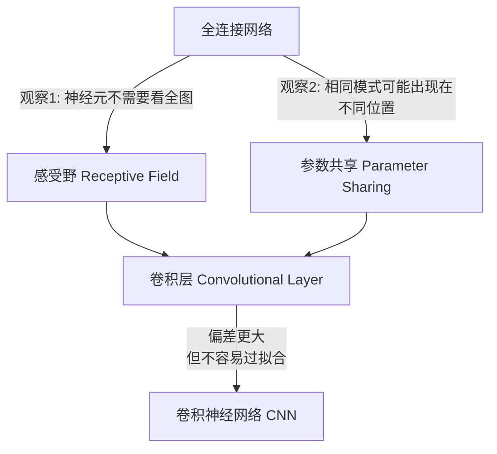
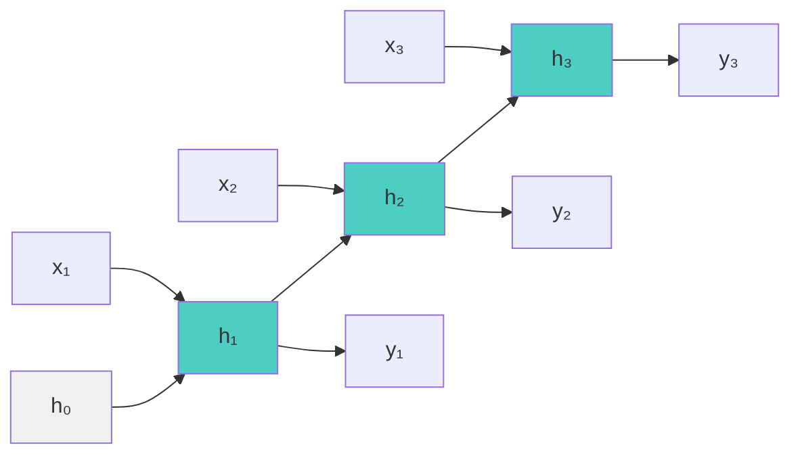
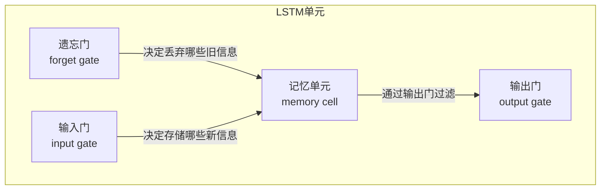
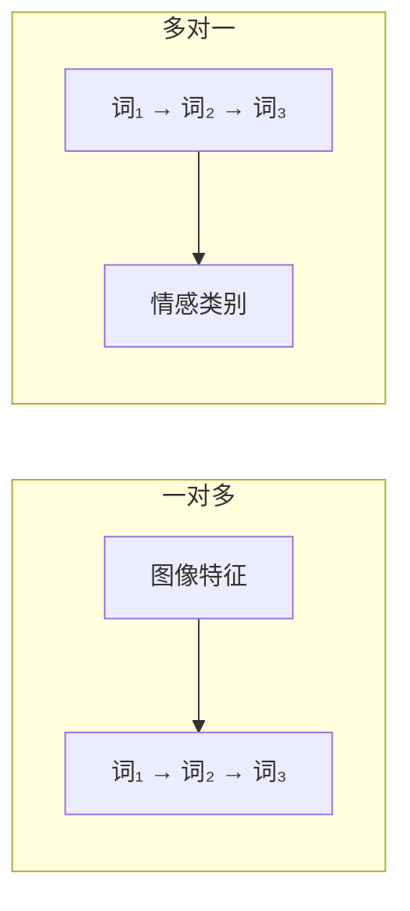

# CNN与RNN 学习笔记

> 本笔记覆盖卷积神经网络（CNN）和循环神经网络（RNN），包括 LSTM 和 GRU。
> 相关笔记：[[01-深度学习基础-学习笔记]] | [[03-注意力机制与Transformer-学习笔记]]

---

## 1. CNN | 卷积神经网络

### 1.1 为什么需要 CNN？

在理解 CNN 之前，先想清楚一个问题：**全连接网络处理图像时，到底遇到了什么麻烦？**

一张图像本质上是一个三维张量（宽 x 高 x 通道）。以一张 100x100 的彩色图像为例，它有 100 x 100 x 3 = 30,000 个数值。要输入全连接网络，必须先将三维张量**展平**为一维向量。

> 不是所有图像尺寸都是一样的。常见的处理方式是把所有图像先调整成相同尺寸，再输入到识别系统里面。

如果采用全连接网络（fully connected network），问题很明显：

- **参数太多**：30,000 维输入，每个神经元都要 30,000 个权重，运算量巨大
- **模型弹性太大**：参数多意味着模型能力过强，极容易**过拟合（overfitting）**


**核心目标：简化网络，降低模型弹性。** CNN 正是为此而生。

---

### 1.2 CNN 的核心思想（版本1）：感受野 + 参数共享

CNN 通过两个关键观察来简化全连接网络：



#### 1.2.1 感受野（Receptive Field）

**直觉**：识别一只鸟，不需要每个神经元都看完整张图——只需要关注局部区域即可。比如负责检测鸟嘴的神经元，只需看鸟嘴附近的像素。

**做法**：为每个神经元分配一个局部区域，称为**感受野（receptive field）**。神经元只关心自己感受野内的信息。


> 类比：神经元是交警，感受野是管辖区域，输入是来往车辆。交警只需关注自己片区的车辆。

**感受野的特性：**

- 感受野之间**可以重叠**
- 每个感受野都有**一组神经元**（同一片区可以有多个交警）


**关键术语：**

| 术语 | 含义 |
|------|------|
| **kernel size（核大小）** | 感受野的高 x 宽（深度等于通道数，无需额外指定） |
| **stride（步幅）** | 感受野移动的量，一般为 1 或 2，希望感受野之间有重叠 |
| **padding（填充）** | 超出图像边界的处理方式，常用 zero padding（补0） |


#### 1.2.2 参数共享（Parameter Sharing）

**直觉**：同样的模式（比如鸟嘴）可能出现在图像的不同位置。为什么要让不同位置的神经元各学一套参数？让它们**共用同一组权重**就好了。

这组共用的参数称为**滤波器（filter）**。


> **全连接层 vs 卷积层**：全连接层中每个神经元有独立权重；卷积层中不同位置的神经元共享同一套权重（filter），以在不同位置提取相同特征。

**重点**：单个神经元的参数 $\bold w$ 是固定的，不会因为感受野不同而改变（当然 $\bold w$ 是需要学出来的）。同一个神经元针对不同的输入会有不同的输出。

#### 1.2.3 总结：感受野 + 参数共享 = 卷积层


全连接层可以自己决定看整张图还是一小块，弹性很大。加上感受野后只能看局部，弹性变小。参数共享又进一步限制弹性。**模型偏差大不一定是坏事**——弹性低意味着不容易过拟合。

---

### 1.3 卷积的具体操作（版本2：Filter 视角）

从 filter 的角度重新理解卷积：

一个卷积层包含**一组滤波器（filter）**，每个 filter 是一个张量（tensor），其中的数值就是需要学习的模型参数。


> 类比：交警（神经元）用测醉器（滤波器）查来往车辆（图像）。

**卷积过程：**

1. 将 filter 放在图像左上角
2. filter 中的值与对应区域的值逐元素相乘再求和（**内积**）
3. 按步幅（stride）移动 filter，扫过整张图像
4. 每个 filter 得到一组数字，称为**特征映射（feature map）**


**多层卷积的通道关系：**

- 假设第1层有 64 个 filter → 输出 64 个通道的新"图像"
- 第2层的 filter 深度 = 前一层 filter 数（即64）
- 卷积层可以不断叠加

**两个版本的统一**：用 filter 扫过图像 = 不同感受野的神经元共用参数。这就是"卷积"名字的由来。

---

### 1.4 池化（Pooling）

卷积之后，往往跟一个池化操作来**缩小图像尺寸**（通道数不变）。

**关键特点：池化没有参数，不是一个层，不需要学习。**

| 池化方式 | 操作 |
|----------|------|
| **Max Pooling** | 在每组中取最大值 |
| **Mean Pooling** | 在每组中取平均值 |


#### 池化 vs 下采样（Subsampling）

- **池化**：用滑动窗口提取最大或平均值，减小特征图尺寸的同时**保留主要信息**，增强鲁棒性
- **下采样**：仅减少采样点（如每隔一定距离取一个像素），纯粹减少数据量。可通过池化、跨步卷积、分层采样等方式实现


#### CNN 的局限

CNN **不能处理放大、缩小、旋转**的问题，只能通过 **data augmentation**（数据增强）来缓解。也有专门的网络如 spatial transformer layer 可以处理这类问题。

---

### 1.5 CNN 的应用

| 维度 | 数据类型 | 典型应用 |
|------|----------|----------|
| **1D CNN** | 一维序列 | 文本分类、语音识别、股票价格预测 |
| **2D CNN** | 二维图像 | 图像分类、目标检测、图像分割 |

---

## 2. RNN | 循环神经网络

### 2.1 为什么需要 RNN？

在 RNN 出现之前，处理序列数据的方案有两类，但都存在根本缺陷：

#### N-gram 语言模型

基于统计，通过语料库中连续 N 个词的共现频率来预测下一个词。

| 局限 | 说明 |
|------|------|
| **短视** | 只能感知固定窗口内的上下文，无法建模远距离依赖 |
| **数据稀疏** | N 越大，找不到匹配的概率越高（维度灾难） |
| **语义盲** | 将每个词视为独立符号，语义相近的词无任何关联 |

#### 前馈神经网络（FFNN）

将固定长度的上下文窗口作为输入，通过全连接层预测下一个词。

| 局限 | 说明 |
|------|------|
| **固定输入长度** | 窗口大小决定了能看到多远的历史 |
| **无记忆能力** | 相同输入永远产生相同输出，无法感知前文语境 |
| **参数不共享** | 不同位置使用不同权重，序列越长参数越多 |

> **核心矛盾：两类方案都无法对序列进行动态的、有记忆的建模 → RNN 应运而生。**

#### Slot Filling（槽填充）应用示例

Slot filling 是从用户输入中识别并提取特定实体，填充到预定义的槽位中。

> 例："*我想订一张下周一从北京飞往上海的机票*"
> - "下周一" → `departure_date`
> - "北京" → `departure_city`
> - "上海" → `arrival_city`

---

### 2.2 RNN 基础架构

RNN 是带有隐藏状态（记忆单元）的神经网络。在每个时间步，将上一时刻隐状态 $h_{t-1}$ 与当前输入 $x_t$ 共同映射为新隐状态 $h_t$：

$$
h_t = f(h_{t-1}, x_t)
$$



**输入输出：**
- **输入**：当前输入向量 $x_t$ + 前一时刻隐状态 $h_{t-1}$
- **输出**：当前隐状态 $h_t$（可作为下一时刻输入，也可用于预测）

**隐藏状态随时间传播信息。**


#### 参数共享

RNN 的一个核心特性：对所有时间步使用**同一套**权重矩阵：

| 权重 | 作用 |
|------|------|
| $W_{xh}$ | 输入 → 隐状态 |
| $W_{hh}$ | 隐状态 → 隐状态 |

无论序列多长，参数量不变，天然支持任意长度输入。

> 类比：用同一把"尺子"量序列中的每个位置，而不是为每个位置单独配一把尺子。

#### BPTT（随时间反向传播）

正因为参数共享，$W_{xh}$ 和 $W_{hh}$ 参与了所有时间步的计算，训练时梯度必须：

1. **前向传播**：按 $t=1 \to T$ 顺序依次计算每步的 $h_t$ 和 loss
2. **逆向传播**：从 $t=T$ 开始倒着走，计算每个时间步对共享权重的梯度贡献
3. **梯度累加**：将所有时间步的梯度加总
4. **统一更新**：用汇总梯度一次性更新 $W_{xh}$ 和 $W_{hh}$

> BPTT 的代价：梯度需要穿越 $T$ 个时间步连续相乘——时间步越长，链式法则的乘法链越长，这正是**梯度消失**的根本成因。

#### Cost Function

使用**交叉熵损失函数**。RNN 对序列中每个时刻 $t$ 都输出预测，与真实标注比较计算 loss。最终 loss 是所有 $T$ 个时刻的 loss 求平均。

---

### 2.3 双向 RNN

同时运行正向（左→右）和逆向（右→左）两个 RNN，将两个方向的隐状态**拼接**后输出，使每个时刻的预测都能看到完整序列上下文。


> **局限**：需要完整输入序列才能运行，不适合实时/流式场景（如语音实时识别）。

---

### 2.4 RNN 的问题与解决方案

#### 计算效率

RNN 是串联的，每个时间步依赖上一步输出，**难以并行**。这是后来 Transformer 取代 RNN 的重要原因之一。

#### 梯度消失

梯度通过链式法则逐步反向传播，跨越多个时间步时会**逐步衰减变小**，最终接近 0。导致 RNN 对**远距离依赖关系学习不足**，只能学习近距离特征。


#### 梯度爆炸

与梯度消失同源：当权重矩阵的特征值大于 1 时，梯度在反向传播过程中会**指数级增长**。

#### 解决方案

| 方案 | 说明 |
|------|------|
| **ReLU 激活函数** | 替代 sigmoid，缓解梯度消失 |
| **梯度裁剪（Gradient Clipping）** | 手动将梯度限制在阈值内，防止梯度爆炸 |
| **残差连接** | 添加跳跃连接，为梯度提供更短的反向传播路径 |
| **LSTM / GRU 门控机制** | **根本解决方案**（见下节） |

---

### 2.5 GRU（门控循环单元）

GRU 用 **2 个门**简化了 LSTM（无独立细胞状态，参数更少，实践效果接近）。


| 门 | 作用 |
|----|------|
| **重置门 $r_t$** | 决定历史状态 $h_{t-1}$ 在计算候选隐状态时的参与程度 |
| **更新门 $z_t$** | 在旧状态 $h_{t-1}$ 和新候选状态 $\tilde{h}_t$ 之间插值，决定最终 $h_t$ |

$$
h_t = (1 - z_t) \odot h_{t-1} + z_t \odot \tilde{h}_t
$$

- $z_t \to 0$ → 完全保留旧状态（记忆）
- $z_t \to 1$ → 完全采用新候选状态（更新）

---

### 2.6 LSTM（长短期记忆网络）

LSTM 通过引入**门控机制**来控制信息流动，从根本上解决长序列训练中的梯度消失和梯度爆炸问题。

门控机制使网络能有选择地保留或遗忘信息，允许梯度沿"恒等"路径（细胞状态 $c_t$）跨多时间步几乎无损传播。


#### 两个传输状态

| 状态 | 含义 |
|------|------|
| $c_t$（cell state，细胞状态） | LSTM 内部的记忆信息，可跨时间步传递 |
| $h_t$（hidden state，隐藏状态） | 当前时间步的输出特征 |

#### 三个门 + 记忆单元



| 门 | 作用 |
|----|------|
| **输入门（Input Gate）** | 决定要存储的新信息 |
| **遗忘门（Forget Gate）** | 决定哪些旧信息不再重要（注意：*打开*代表记得，*关闭*代表遗忘，与直觉相反） |
| **输出门（Output Gate）** | 决定当前步骤要输出的信息 |


每个时间步，三个门同时接收当前输入 $x_t$、上一隐状态 $h_{t-1}$ 和上一细胞状态 $c_{t-1}$，通过各自的线性变换 + sigmoid 激活得到 0~1 的门控值，进而控制信息的保留与遗忘。

#### LSTM 的使用

把 LSTM 想成一个特殊的神经元，直接替换掉原来简单的 RNN 神经元即可。


#### LSTM 的局限

| 局限 | 说明 | 后续发展 |
|------|------|----------|
| **串行计算，无法并行** | 每个时间步依赖上一步输出 | → Transformer |
| **记忆容量有限** | $c_t$ 是固定维度向量，较早信息可能被过度压缩 | → Attention |
| **均等对待历史信息** | 无法对不同位置的信息差异化加权 | → Attention Mechanism (2015) → Transformer (2017) |
| **参数量大** | 3个门使参数量约为标准RNN的4倍 | → GRU 精简为2个门 |

---

### 2.7 GRU vs LSTM

| 对比项 | GRU | LSTM |
|--------|-----|------|
| **门数** | 2个（重置门、更新门） | 3个（输入、遗忘、输出门） |
| **状态数** | 1个（$h_t$） | 2个（$h_t$ + $c_t$） |
| **参数量** | 更少 | 约为标准RNN的4倍 |
| **训练速度** | 更快 | 较慢 |
| **适用场景** | 数据量少或计算受限 | 超长序列和复杂依赖 |
| **实践效果** | 接近 LSTM | 略强于 GRU |

> 实践中两者效果接近，推荐优先尝试 GRU。

---

### 2.8 RNN 的应用模式



| 模式 | 输入→输出 | 典型应用 |
|------|-----------|----------|
| **一对多（One-to-Many）** | 单个输入 → 序列输出 | 图像描述生成 |
| **多对一（Many-to-One）** | 序列输入 → 单个输出 | 情感分析 |
| **多对多等长** | 序列 → 等长序列 | 序列标注、槽填充 |
| **多对多不等长（Seq2Seq）** | 序列 → 不等长序列 | 机器翻译（Encoder-Decoder） |

---

### 2.9 PyTorch 代码示例

#### nn.RNN 初始化

```python
self.rnn = nn.RNN(input_size, hidden_size, num_layers)
```

| 参数 | 含义 |
|------|------|
| `input_size` | 输入张量 $x$ 的维度 |
| `hidden_size` | 隐层张量 $h$ 的维度 |
| `num_layers` | 隐藏层的数量 |
| `nonlinearity` | 激活函数，默认 `tanh` |

#### 前向传播

```python
output, h_n = self.rnn(input, h_0)
```

| 输出 | 形状 | 含义 |
|------|------|------|
| `output` | `[seq_len, batch, hidden_size]` | 所有时刻的隐状态 |
| `h_n` | `[num_layers, batch, hidden_size]` | 最后时刻的隐状态 |

---

## 3. CNN 与 RNN 对比总结

| 对比项 | CNN | RNN (LSTM/GRU) |
|--------|-----|-----------------|
| **核心思想** | 局部特征提取 + 参数共享 | 时序记忆 + 门控机制 |
| **擅长数据** | 空间结构（图像） | 时序结构（文本、语音） |
| **参数共享方式** | 同一 filter 扫过不同空间位置 | 同一权重矩阵用于不同时间步 |
| **并行性** | 高（各位置独立计算） | 低（时间步串行） |
| **长距离依赖** | 通过堆叠层数扩大感受野 | LSTM/GRU 门控机制 |
| **后续发展** | ResNet, EfficientNet | → Attention → Transformer |

> 两者并非对立关系。现代架构中经常将 CNN 和 RNN 组合使用，比如在视频理解任务中用 CNN 提取帧特征、再用 RNN 建模时序关系。而 [[注意力机制与Transformer-学习笔记|Transformer]] 的出现则在很大程度上统一了两者的应用场景。
