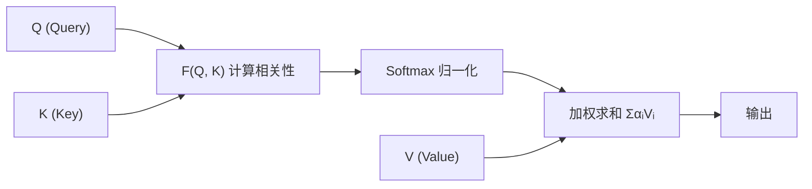
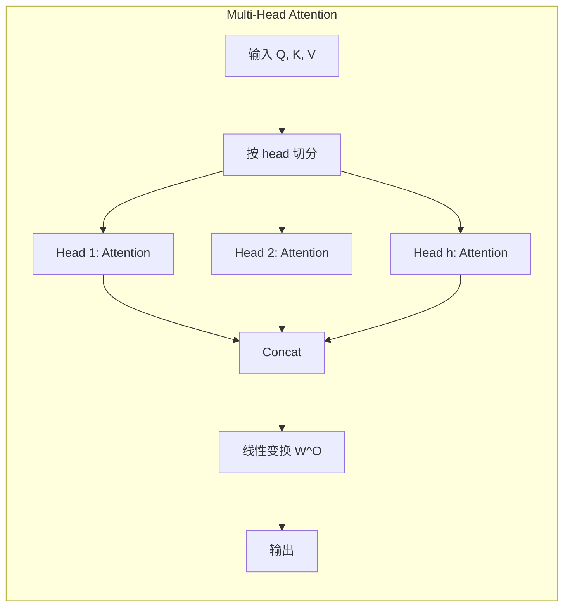
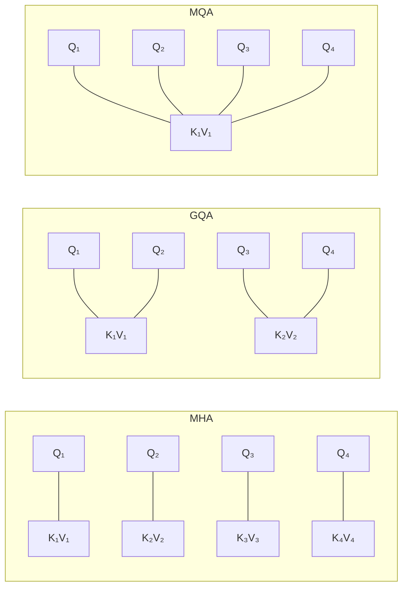
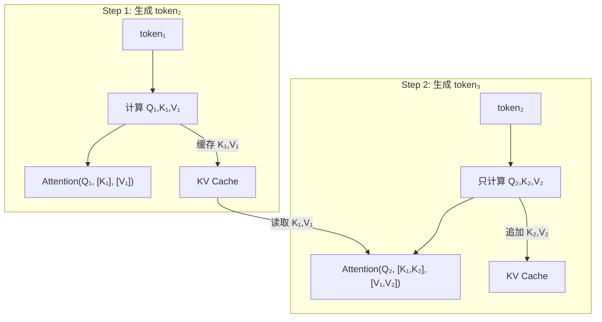
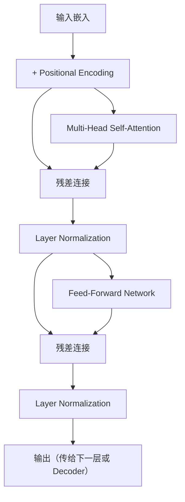
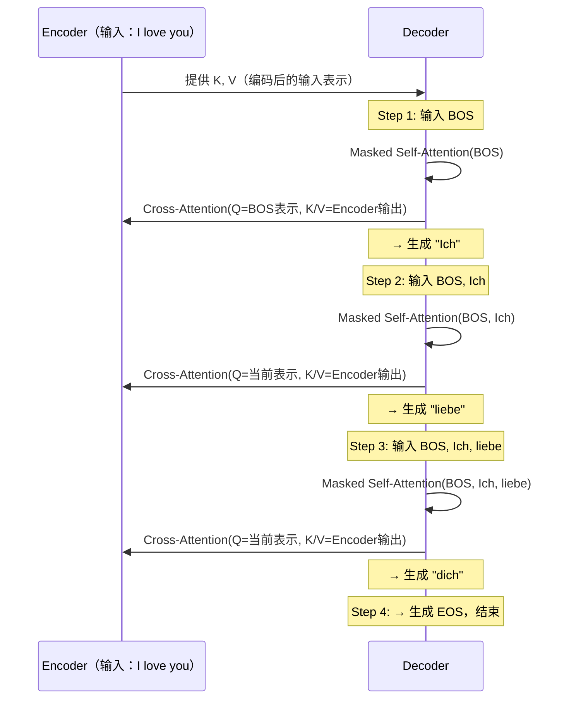
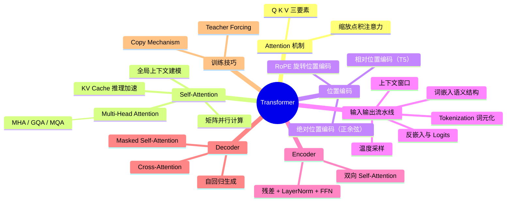

# 注意力机制与 Transformer 学习笔记

> 本笔记涵盖 Attention 机制、Self-Attention、Multi-Head Attention、KV Cache、位置编码以及 Transformer 完整架构。
> 前置知识：[[01-深度学习基础-学习笔记]]、[[02-CNN与RNN-学习笔记]]

---

## 1. Attention 机制——为什么需要"注意力"

### 1.1 动机

在处理序列数据时，我们希望模型能够**有选择地关注**输入中最相关的部分，而不是平等对待所有信息。例如翻译"The cat sat on the mat"时，生成"猫"这个词时应更关注"cat"而非"mat"。

### 1.2 核心三要素：Q、K、V

Attention 机制借鉴了**信息检索**的思想，由三个部分组成：

| 要素 | 含义 | 类比 |
|------|------|------|
| **Query（查询）** | "我在找什么" | 搜索引擎的搜索词 |
| **Key（键）** | "我有什么可以匹配的" | 每条网页的标题/关键词 |
| **Value（值）** | "匹配上后返回什么" | 网页的实际内容 |

### 1.3 计算步骤



1. **计算相关性** $F(Q, K)$：衡量 Query 与每个 Key 的匹配程度
2. **Softmax 归一化**：将相关性分数转为概率分布（权重之和为 1）
3. **加权求和**：用归一化后的权重对 Value 求加权和

### 1.4 相关性的计算方式

| 方法 | 公式 | 特点 |
|------|------|------|
| 向量点积 | $\alpha = Q \cdot K$ | 最常用，计算高效 |
| 缩放点积 | $\alpha = \frac{Q \cdot K}{\sqrt{d_k}}$ | 防止维度过大导致梯度消失 |
| 余弦相似度 | $\alpha = \frac{Q \cdot K}{\|Q\| \cdot \|K\|}$ | 归一化后的点积 |
| 额外神经网络 | $\alpha = W \cdot \tanh(W_1 Q + W_2 K)$ | 可学习，更灵活 |

---

## 2. Self-Attention（自注意力机制）

### 2.1 为什么需要 Self-Attention

> 先理解问题，再看解决方案。

**全连接网络的局限**：给定一个输入序列（如一句话中的多个词向量），全连接网络独立处理每个向量，**无法捕捉向量之间的关系**。

如果尝试用更大的窗口将多个向量拼接输入全连接层，则：
- 窗口太大 → 参数爆炸 → 过拟合
- 窗口太小 → 丢失长距离依赖

**Self-Attention 的解决思路**：让序列中的每个位置都能**直接关注**序列中的所有其他位置，动态学习它们之间的关联强度。


### 2.2 Self-Attention 是什么

**核心思想**：给定输入向量集 $X = [x_1, x_2, \dots, x_n]$，计算序列中不同位置之间的关联度，从而获取**全局上下文信息**。

- **输入**：$n$ 个向量组成的序列
- **输出**：同样 $n$ 个向量，但每个输出向量 $y_i$ 都融合了整个序列的信息
- **关键优势**：所有位置的计算可以**并行化为矩阵运算**，充分利用 GPU 加速

### 2.3 输入可以是什么

Self-Attention 的输入是一组向量，不同领域的数据需要不同的向量化方式：

| 数据类型 | 向量化方式 | 说明 |
|----------|-----------|------|
| **文字** | Word Embedding | one-hot 编码无语义信息；Word Embedding（如 Word2Vec）将词映射到语义空间 |
| **语音** | 帧特征向量 | 25ms 窗口、10ms 滑动步长，每秒约产生 100 个特征向量 |
| **图结构** | 节点特征向量 | 社交网络节点、化学分子原子 |


### 2.4 运作原理

以计算输出 $b_1$ 为例，逐步拆解 Self-Attention 的计算过程：

#### 第一步：生成 Q、K、V

每个输入向量 $a_i$ 通过三个可学习的权重矩阵生成对应的 Query、Key、Value：

$$q_i = W^Q \cdot a_i, \quad k_i = W^K \cdot a_i, \quad v_i = W^V \cdot a_i$$


#### 第二步：计算注意力分数

用 $q_1$ 与所有 $k_i$ 做点积，得到注意力分数（Attention Score）：

$$\alpha_{1,i} = q_1 \cdot k_i$$

然后通过 Softmax 归一化：

$$\alpha'_{1,i} = \text{softmax}(\alpha_{1,i}) = \frac{e^{\alpha_{1,i}}}{\sum_j e^{\alpha_{1,j}}}$$


#### 第三步：加权求和得到输出

$$b_1 = \sum_i \alpha'_{1,i} \cdot v_i$$

$b_1$ 融合了序列中所有位置的信息，权重由 $q_1$ 与各 $k_i$ 的相关性决定。


### 2.5 矩阵形式（并行计算）

将所有向量堆叠为矩阵，整个 Self-Attention 可以用矩阵乘法表示：

$$Q = I \cdot W^Q, \quad K = I \cdot W^K, \quad V = I \cdot W^V$$

$$A = \text{softmax}\left(\frac{QK^T}{\sqrt{d_k}}\right)$$

$$\text{Output} = A \cdot V$$

其中 $d_k$ 是 Key 向量的维度，除以 $\sqrt{d_k}$ 是为了防止点积值过大导致 Softmax 梯度消失。

> **唯一需要学习的参数**：$W^Q$、$W^K$、$W^V$ 三个权重矩阵。


---

## 3. Multi-Head Attention 及其变体

### 3.1 Multi-Head Attention（MHA）

#### 为什么需要多头

单一的 Attention 只从一个"角度"观察输入。但不同的语义关系（语法关系、语义相似性、指代关系等）可能需要不同的关注模式。此外，单头 Attention 的 $QK^T$ 矩阵容易在对角线上产生过大的值（自身与自身的相关性最高），多头机制可以缓解这个问题。

#### 工作原理

将 Q、K、V 在 hidden 维度上切分为 `head_num` 份，每个头独立计算 Attention，最后拼接：

$$q_i \xrightarrow{\text{切分}} q_{i,1}, q_{i,2}, \dots, q_{i,h}$$

每个头独立做 Attention：

$$\text{head}_j = \text{Attention}(Q_j, K_j, V_j)$$

拼接后通过线性变换：

$$\text{MultiHead}(Q, K, V) = \text{Concat}(\text{head}_1, \dots, \text{head}_h) \cdot W^O$$




### 3.2 Attention 变体对比

#### MQA（Multi-Query Attention）

为了减少推理时的 KV Cache 内存开销，MQA 只把 Q 分成多个头，而**所有头共享同一组 K 和 V**。

- 优点：大幅减少 KV Cache 内存消耗
- 缺点：效果略有下降

#### GQA（Grouped Query Attention）

GQA 是 MHA 和 MQA 的折中方案：将 Q 的多个头分成若干组，**同组内的 Q 头共享一组 K/V**。



| 方法 | Q 头数 | K/V 头数 | 内存消耗 | 效果 |
|------|--------|----------|----------|------|
| MHA | $h$ | $h$ | 高 | 最好 |
| GQA | $h$ | $g$（$1 < g < h$） | 中 | 接近 MHA |
| MQA | $h$ | $1$ | 低 | 略降 |


---

## 4. KV Cache

### 4.1 背景与动机

KV Cache 是一种**仅用于自回归解码器推理阶段**的加速技术。

在自回归生成中（如 GPT），每生成一个新 token 都需要对整个已生成序列做 Attention。如果每一步都重新计算所有 token 的 K 和 V，大量计算是**重复的浪费**。

### 4.2 工作原理

核心思路很简单：**缓存已计算的 K 和 V，下一步只计算新 token 的 Q/K/V**。



> 重要细节：每个 token 的 K/V 值是**上下文相关**的（经过 Attention 层层变换），不是全局通用的。不同上下文中同一个词的 K/V 可能完全不同。

### 4.3 逐层计算

Transformer 有多层堆叠，KV Cache 需要**逐层存储**。每一层的 Attention 都会塑造 token 的表示，因此每层都需要独立的 KV Cache。

### 4.4 内存消耗

KV Cache 的内存占用公式：

$$\text{Memory} = 2 \times \text{precision} \times n_{\text{layers}} \times d_{\text{model}} \times \text{seqlen} \times \text{batch}$$

其中：
- **2**：K 和 V 各一份
- **precision**：数据精度（如 FP16 = 2 bytes，FP32 = 4 bytes）
- **$n_{\text{layers}}$**：Transformer 层数
- **$d_{\text{model}}$**：模型隐藏维度
- **seqlen**：序列长度
- **batch**：批量大小

### 4.5 具体示例

以两层 Transformer 生成"今天天气真不错"为例：

| 生成步骤 | 新 token | 计算内容 | Cache 内容（每层） |
|----------|----------|----------|-------------------|
| Step 1 | 今 | Q₁,K₁,V₁ | K=[K₁], V=[V₁] |
| Step 2 | 天 | Q₂,K₂,V₂ | K=[K₁,K₂], V=[V₁,V₂] |
| Step 3 | 天 | Q₃,K₃,V₃ | K=[K₁,K₂,K₃], V=[V₁,V₂,V₃] |
| Step 4 | 气 | Q₄,K₄,V₄ | K=[K₁,...,K₄], V=[V₁,...,V₄] |
| ... | ... | ... | ... |


---

## 5. 截断自注意力与对比

### 5.1 截断自注意力

标准 Self-Attention 的计算复杂度是 $O(n^2)$，对于很长的序列（如语音识别中每秒 100 帧），计算量巨大。

**截断自注意力**（Truncated Self-Attention）限制每个位置只关注周围一个小窗口内的位置，类似于局部注意力。

### 5.2 Self-Attention vs CNN vs RNN

| 特性 | Self-Attention | CNN | RNN |
|------|---------------|-----|-----|
| 感受野 | 全局（自动学习） | 局部（卷积核大小） | 理论全局（实际受梯度限制） |
| 并行性 | 完全并行 | 完全并行 | 无法并行（时序依赖） |
| 计算复杂度 | $O(n^2 \cdot d)$ | $O(k \cdot n \cdot d^2)$ | $O(n \cdot d^2)$ |
| 数据量需求 | 大（弹性大需要更多数据） | 小（归纳偏置强） | 中 |

> Self-Attention 可以看作**更灵活的 CNN**——CNN 的感受野由卷积核大小固定，而 Self-Attention 的"感受野"通过注意力权重自动学习。数据量充足时 SA 更优，数据量有限时 CNN 可能更好。RNN 的大部分应用场景已可被 SA 取代。


---

## 6. 位置编码（Positional Encoding）

Self-Attention 本身是**置换不变**的（Permutation Invariant）——打乱输入顺序不影响输出。但序列任务中位置信息至关重要（"猫追狗"和"狗追猫"含义完全不同），因此需要**位置编码**来注入顺序信息。

### 6.1 绝对位置编码

最直接的方式：为每个位置生成一个位置向量 $p_i$，与词向量相加：

$$\tilde{x}_i = x_i + p_i$$


#### 正余弦位置编码（Sinusoidal）

原始 Transformer 使用的编码方式：

$$PE_{(pos, 2i)} = \sin\left(\frac{pos}{10000^{2i/d}}\right)$$

$$PE_{(pos, 2i+1)} = \cos\left(\frac{pos}{10000^{2i/d}}\right)$$

其中 $pos$ 是位置索引，$i$ 是维度索引，$d$ 是模型维度。

**特点**：
- 不同维度使用不同频率的正余弦函数
- 任意两个位置的编码差异可以通过线性变换表示（$PE_{pos+k}$ 可以由 $PE_{pos}$ 线性变换得到）
- 不需要学习参数


```python
import numpy as np

def sinusoidal_position_encoding(max_len, d_model):
    """生成正余弦位置编码矩阵"""
    pe = np.zeros((max_len, d_model))
    position = np.arange(0, max_len).reshape(-1, 1)
    div_term = np.exp(np.arange(0, d_model, 2) * -(np.log(10000.0) / d_model))

    pe[:, 0::2] = np.sin(position * div_term)  # 偶数维度用 sin
    pe[:, 1::2] = np.cos(position * div_term)  # 奇数维度用 cos
    return pe
```

### 6.2 相对位置编码

绝对位置编码告诉模型"这个词在第几个位置"，而相对位置编码告诉模型"两个词之间距离多远"。

以 T5 模型为例，相对位置信息直接加到注意力分数上：

$$a_{ij} = \text{softmax}(x_i W^Q {W^K}^T x_j^T + \beta_{i,j})$$

其中 $\beta_{i,j}$ 是位置 $i$ 和 $j$ 之间的相对位置偏置。


### 6.3 RoPE（旋转位置编码）

RoPE（Rotary Positional Embeddings）巧妙地结合了绝对编码和相对编码的优点。

#### 核心思想

对 Q 和 K 向量施加**旋转矩阵**来编码位置信息，使得两个位置的注意力分数只取决于它们的**相对距离**。

对二维情况，位置 $m$ 的旋转矩阵为：

$$R_m = \begin{pmatrix} \cos m\theta & -\sin m\theta \\ \sin m\theta & \cos m\theta \end{pmatrix}$$

编码后的 Q 和 K 做点积：

$$(R_m q)^T (R_n k) = q^T R_{n-m} k$$

结果只取决于相对距离 $n - m$。


#### 高维推广

在高维中，将向量两两一组进行旋转：

$$R_m = \begin{pmatrix} \cos m\theta_1 & -\sin m\theta_1 & & \\ \sin m\theta_1 & \cos m\theta_1 & & \\ & & \cos m\theta_2 & -\sin m\theta_2 \\ & & \sin m\theta_2 & \cos m\theta_2 \\ & & & & \ddots \end{pmatrix}$$

#### 精简实现

为了计算效率，RoPE 可以用 element-wise 乘法实现，避免稀疏矩阵乘法：

$$\text{RoPE}(x) = x \odot \cos(m\theta) + \text{rotate\_half}(x) \odot \sin(m\theta)$$

#### 远程衰减特性

RoPE 天然具有**远程衰减**特性——距离越远的两个位置，注意力分数倾向于越小，这符合自然语言中的局部性先验。


---

## 7. Transformer 架构

### 7.1 Seq2Seq 背景

Transformer 的前身是 **Seq2Seq**（Sequence-to-Sequence）模型（2014 年 Google 提出），由 Encoder 和 Decoder 组成：

- **Encoder**：将输入序列压缩为一个固定长度的 Context Vector（上下文向量）
- **Decoder**：基于 Context Vector 逐步生成输出序列

**Seq2Seq 的关键缺陷**——信息瓶颈：无论输入多长，都被压缩到一个固定大小的向量中。长句子的早期信息会被后面的信息逐渐淡化。

**改进方向**：引入注意力机制，让 Decoder 在每一步都能直接访问 Encoder 的所有隐藏状态，而非仅靠一个压缩后的向量。

### 7.2 Tokenization——词元化（补充自 Transformer-架构全景解析）

Token 是模型的**最小处理单位**。在进入 Embedding 之前，原始文本必须先被切分为 token 序列。

#### 为什么选择子词（Subword）

| 方案 | 问题 |
|------|------|
| 按**字符**切分 | 序列太长，Self-Attention $O(n^2)$ 复杂度爆炸 |
| 按**完整单词**切分 | 词表太大，且无法处理未登录词（OOV 问题） |
| **子词（Subword）** | 主流方案——在序列长度和词表大小之间取得平衡 |

常用子词算法包括 **BPE**（Byte Pair Encoding）和 **SentencePiece**。GPT-3 的词汇表包含 **50,257 个 token**。

#### 词表大小影响全链路效率

词表设计不仅影响模型参数量，还直接影响推理效率。以 Llama 系列为例：

| 模型 | 词表大小 | 效果 |
|------|----------|------|
| Llama 2 | 32K | 基线 |
| Llama 3 | 128K | 同样文本的 token 数减少约 **15%**，计算量节省约 **28%** |

词表越大，单个 token 能表达的信息越多，序列越短，Attention 的 $O(n^2)$ 开销也随之降低。

### 7.3 GPT-3 参数规模与数据流全景（补充自 AI Engineering 笔记）

以 GPT-3 为例，可以直观感受 Transformer 的工程规模：

- **175B 参数** = 约 27,938 个矩阵，分为 8 个类别，堆叠 **96 层** Transformer
- 所有计算几乎都是**矩阵乘法**

#### 数据流全景

从输入到输出的完整路径：

$$\text{原始文本} \xrightarrow{\text{Token化}} \text{Token IDs} \xrightarrow{\text{Embedding}} \text{向量} \xrightarrow{[\text{Attention} + \text{FFN}] \times N} \xrightarrow{\text{Unembedding}} \text{Logits} \xrightarrow{\text{Softmax}} \text{概率分布}$$

#### 两类核心模块

| 模块 | 作用 | 处理方式 |
|------|------|----------|
| **注意力模块（Attention）** | 弄清上下文关联 | 向量间**交互**——每个 token 与其他 token 沟通 |
| **前馈层 / MLP（FFN）** | 知识提炼与推理 | 向量**独立处理**——每个 token 各自变换 |

这两类模块交替堆叠，构成了 Transformer 的骨干。参见 [[#7.7 内部组件详解]] 中 FFN 和 Attention 的具体结构。

#### 权重 vs 被处理数据

| 概念 | 含义 | 类比 |
|------|------|------|
| **权重（Weights）** | 模型的"大脑"，通过训练学到 | 人的知识和经验 |
| **被处理数据 / Activations** | 某次推理时的输入和中间结果 | 人正在阅读的那篇文章 |

权重在推理时保持不变，而 Activations 随每次输入动态变化。

### 7.4 Transformer 概述

2017 年 Google 在论文 "Attention Is All You Need" 中提出 Transformer，彻底抛弃了 RNN 结构，完全基于 Attention 机制。

**核心优势**：
- **强大的并行计算能力**：Self-Attention 的矩阵乘法天然可并行、层间计算可并行、batch 并行
- **强大的特征提取能力**：全局感受野，能捕捉任意距离的依赖关系
- **输入输出长度可以不同**：天然适合翻译、摘要等序列到序列任务


### 7.5 Encoder

Encoder 的每一层（Block）结构如下：



**关键细节**：
- **残差连接**（Residual Connection）：$\text{output} = x + \text{SubLayer}(x)$，保证信息无损传递，缓解梯度消失
- **Layer Normalization**：在特征维度上归一化，保持训练稳定性
- Block 重复 $N$ 次堆叠（原始论文 $N = 6$）
- Encoder 的 Self-Attention 是**双向**的（每个位置可以看到全部输入），如 BERT


### 7.6 Decoder

#### 自回归 Decoder（Autoregressive）

Decoder 逐步生成输出序列，**每一步的输出依赖于前面所有步的输出**：

1. 以特殊标记 `<BOS>`（Begin of Sequence）作为起始输入
2. 每步生成一个 token，将其追加到已生成序列中作为下一步的输入
3. 当生成 `<EOS>`（End of Sequence）时停止

**Error Propagation 问题**：一步错则步步错，早期的错误会传播到后续所有生成步骤。

#### 非自回归 Decoder（Non-Autoregressive）

一次性并行生成所有输出 token。速度快但质量通常不如自回归方式（难以建模 token 之间的依赖）。


### 7.7 内部组件详解

#### Embedding + Positional Encoding

输入 token 先通过 Embedding 层转为向量，再加上位置编码：

$$\text{input} = \text{Embedding}(token) + \text{PE}(position)$$

#### 词嵌入的语义结构（补充自 Transformer-架构全景解析）

嵌入矩阵 $W_E \in \mathbb{R}^{d_{\text{model}} \times |V|}$，以 GPT-3 为例：$12{,}288 \times 50{,}257 \approx$ **6.17 亿参数**。

嵌入空间会自发形成丰富的**语义结构**：

- **含义相近的词在空间中靠近**（如 "happy" 和 "joyful"）
- **方向承载语义关系**——经典例子：$\vec{king} - \vec{man} + \vec{woman} \approx \vec{queen}$
- **点积衡量对齐程度**：方向相似 → 正值，垂直 → 零，相反 → 负值

一个有趣的实验：取"复数方向向量" $\vec{cats} - \vec{cat}$，将它与各词做点积，会发现 one / two / three 的投影值递增——说明嵌入空间中确实编码了数量概念。

> **嵌入向量的上下文演化**：token 的初始嵌入只携带通用含义。经过多层 Attention + MLP 后，向量逐步融合完整上下文信息，最终表示与原始嵌入可能完全不同。

#### 上下文窗口（Context Window）（补充自 Transformer-架构全景解析）

模型每次推理只能处理**固定数量的 token**，这个上限称为上下文窗口。

| 模型 | 上下文窗口大小 |
|------|---------------|
| GPT-3 | 2,048 |
| GPT-4 | 8K / 32K / 128K |
| Claude 3.5 | 200K |

数据的实际形状为：**上下文大小 × 嵌入维度**（GPT-3 对应 $2{,}048 \times 12{,}288$）。

上下文窗口直接限制了模型在预测时能"看到"的文本范围。早期 ChatGPT 在长对话中容易丢失话题、前后矛盾，根本原因就是超出了上下文窗口——较早的对话内容被截断，模型无法再访问。

#### Residual Connection（残差连接）

$$\text{output} = x + F(x)$$

即使 $F(x)$ 学到的变换很小，信息也能通过恒等映射 $x$ 无损传递。这使得深层网络的训练成为可能。

#### Layer Normalization

对同一样本的所有特征维度做归一化，保持每层输出的分布稳定。

两种放置方式：
- **Post-LN**（原始 Transformer）：先子层计算，再归一化。训练不太稳定，需要 warm-up
- **Pre-LN**（现代常用）：先归一化，再子层计算。训练更稳定


#### Masked Self-Attention

在 Decoder 中，生成第 $t$ 个 token 时，**不能看到位置 $t$ 之后的内容**（因为那些还没生成）。

实现方式：在 Attention 分数矩阵上应用 **Mask 掩码**，将未来位置的分数设为 $-\infty$，经过 Softmax 后变为 0。

$$\text{score}_{masked} = \text{score} + \text{mask}$$

其中 mask 是一个上三角矩阵，上三角部分为 $-\infty$，其余为 0：

```python
def subsequent_mask(size):
    """生成 Decoder 的掩码矩阵，防止看到未来位置"""
    mask = np.triu(np.ones((size, size)), k=1)  # 上三角为1
    return mask == 0  # True 表示保留，False 表示屏蔽
```

**示例**：翻译 "I love you" → "Ich liebe dich"

| 生成步骤 | 输入 | 可见位置 | 输出 |
|----------|------|----------|------|
| Step 1 | `<BOS>` | [1] | Ich |
| Step 2 | `<BOS>` Ich | [1,2] | liebe |
| Step 3 | `<BOS>` Ich liebe | [1,2,3] | dich |
| Step 4 | `<BOS>` Ich liebe dich | [1,2,3,4] | `<EOS>` |


#### FFN（Feed-Forward Network）

每个 Attention 子层之后跟一个前馈网络，由两层线性变换和一个激活函数组成：

$$\text{FFN}(x) = W_2 \cdot \text{ReLU}(W_1 \cdot x + b_1) + b_2$$

维度变化：$d_{\text{model}} \to 4d_{\text{model}} \to d_{\text{model}}$

先升维再降维，中间的高维空间让模型有更大的表达能力。现代 Transformer 常用 GELU 替代 ReLU。


#### Encoder-Decoder Attention（Cross-Attention）

这是连接 Encoder 和 Decoder 的桥梁：

- **Q** 来自 Decoder 的当前层
- **K、V** 来自 Encoder 的最终输出

这使得 Decoder 在生成每个 token 时，都能"回顾"完整的输入序列。

**完整翻译示例**（4 步）：




### 7.8 输出层：Linear + Softmax

Decoder 最后一层的输出经过：

1. **线性层**：将 $d_{\text{model}}$ 维向量映射到词典大小 $|V|$ 维
2. **Softmax**：转为概率分布，取概率最大的 token 作为输出

$$P(w) = \text{softmax}(W_{\text{linear}} \cdot h + b)$$


#### 反嵌入与 Logits 细节（补充自 Transformer-架构全景解析）

上面的"线性层"在 GPT 类模型中通常称为**反嵌入矩阵**（Unembedding Matrix）：

$$W_U \in \mathbb{R}^{|V| \times d_{\text{model}}}, \quad \text{logits} = W_U \cdot h_{\text{last}}$$

$W_U$ 的参数量与嵌入矩阵 $W_E$ 相同，约 **6.17 亿**（以 GPT-3 为例）。

几个关键细节：

- **Logits** 是原始的未归一化分数，可以是正数、负数或零，需要经过 Softmax 归一化后才成为概率分布
- **训练时**：每个位置都预测下一个 token（即同时计算所有位置的 logits），这大幅提高了训练数据的利用效率
- **推理时**：只需要取**最后一个位置**的输出来预测下一个 token

#### 温度采样的直观理解（补充自 Transformer-架构全景解析）

Softmax 中引入温度参数 $T$ 来控制输出分布的"尖锐程度"：

$$P(w_i) = \frac{e^{z_i / T}}{\sum_j e^{z_j / T}}$$

以 GPT-3 生成 "Once upon a time" 的后续为例：

| 温度 | 效果 | 结果特征 |
|------|------|----------|
| $T = 0$（贪婪） | 始终选概率最高的 token | 确定性输出，内容老套可预测 |
| 适中 $T$ | 概率分布适度平滑 | 有创意，如生成韩国网络艺术家的故事 |
| $T$ 过高 | 概率接近均匀分布 | 退化为近乎随机的无意义内容 |

> OpenAI API 将温度限制在 $[0, 2]$ 范围内。这是**工程限制**而非数学限制——数学上温度可以是任意正数，但过大的值在实际应用中毫无意义。

更多关于采样策略（top-k、top-p 等）的内容，参见 [[04-预训练与生成式AI-学习笔记]]。

### 7.9 训练技巧

#### Teacher Forcing

训练时不使用模型自身的预测作为下一步输入，而是直接**给正确答案**作为输入。这样避免了训练初期错误累积的问题，大幅加速收敛。

> 类比：学生做练习时，老师直接告诉上一步的正确答案，让学生专注于学习当前步骤。

#### Copy Mechanism

有些输出可以直接从输入中**复制**，例如：
- 名字、专有名词的翻译
- 摘要任务中的关键短语

Pointer Network 就是这种思想的实现——模型可以选择"从词表中生成"或"从输入中复制"。


---

## 8. 总结



**核心公式速查**：

| 组件 | 公式 |
|------|------|
| Scaled Dot-Product Attention | $\text{Attention}(Q,K,V) = \text{softmax}\left(\frac{QK^T}{\sqrt{d_k}}\right)V$ |
| Multi-Head Attention | $\text{MHA} = \text{Concat}(\text{head}_1,...,\text{head}_h)W^O$ |
| 正余弦位置编码 | $PE_{(pos,2i)} = \sin(pos / 10000^{2i/d})$ |
| FFN | $\text{FFN}(x) = W_2 \cdot \text{ReLU}(W_1 x + b_1) + b_2$ |
| KV Cache 内存 | $2 \times \text{precision} \times n_{\text{layers}} \times d \times \text{seqlen} \times \text{batch}$ |
| 嵌入矩阵 | $W_E \in \mathbb{R}^{d_{\text{model}} \times \|V\|}$，GPT-3: $12{,}288 \times 50{,}257$ |
| 反嵌入（Logits） | $\text{logits} = W_U \cdot h_{\text{last}}$，$W_U \in \mathbb{R}^{\|V\| \times d_{\text{model}}}$ |
| 温度采样 | $P(w_i) = e^{z_i/T} / \sum_j e^{z_j/T}$ |

---

## 9. Transformer 替代架构与模型规模（补充自 AI Engineering ch02）

### 9.1 为什么 Transformer 难以被取代

自 2017 年至今，Transformer 已主导超过八年——在深度学习领域极为罕见。新架构难以取代它的原因：经过极深入的工程优化，新架构必须在**人们关心的规模**和**实际使用的硬件**上全面超越。

### 9.2 主要替代架构

#### RWKV

基于 RNN 但可**并行训练**的架构。理论上不受上下文长度限制，但实践中在长上下文上的表现仍有差距。

#### 状态空间模型（SSM）系列

| 模型 | 关键贡献 |
|------|----------|
| **S4**（Gu et al., 2021b） | 提高了 SSM 的长序列处理效率 |
| **H3**（Fu et al., 2022） | 引入跨序列回忆和比较机制，类似注意力但更高效 |
| **Mamba**（Gu & Dao, 2023） | 推理复杂度随序列长度**线性增长**（Transformer 是二次方）；Mamba-3B 超越同等大小 Transformer，匹配两倍大小 Transformer |
| **Jamba**（Lieber et al., 2024） | **混合架构**——交替堆叠 Transformer 层和 Mamba 层 + MoE；52B 总参数（12B 活跃）可放入单个 80GB GPU |

> 截至 2026 年，混合架构（Transformer + SSM）获得更广泛采用，但 Transformer 在最大规模模型中仍是主流。

### 9.3 稀疏模型与混合专家（MoE）

**MoE**（Mixture-of-Experts）将模型参数分为多组"专家"，每个 token 只激活部分专家：

> **Mixtral 8x7B 实例**：8 个专家，因参数共享总参数 **46.7B**。每层每 token 只激活 2 个专家 → 活跃参数仅 **12.9B** → 推理成本等同于 12.9B 密集模型。

### 9.4 Scaling Law 与计算预算

**Chinchilla Scaling Law**（DeepMind, 2022）基于 400 个模型的实验发现：

> 计算最优训练中，训练 token 数应约为参数量的 **20 倍**。

但 Scaling Law 有局限：
- 针对密集模型推导，对 MoE 和合成数据的适用性是开放问题
- **计算最优 ≠ 实用最优**——Meta 选择训练较小的 Llama 模型而非计算最优的更大模型，因为小模型更易部署

### 9.5 缩放瓶颈

| 瓶颈 | 说明 |
|------|------|
| **数据枯竭** | 训练数据增长速度远超新数据产生速度；C4 数据集已有 **45%** 被限制使用 |
| **能源瓶颈** | 数据中心消耗全球电力 1-2%，预计 2030 年达 4-20%；数据中心最多增长约 50 倍 |
| **逆缩放** | 更大模型在需要记忆的任务和有强先验的任务上有时表现更差 |

---

**延伸阅读**：
- [[04-预训练与生成式AI-学习笔记]]——了解 Transformer 在预训练模型（BERT、GPT）中的应用
- [[01-深度学习基础-学习笔记]]——回顾神经网络基础知识
- [[02-CNN与RNN-学习笔记]]——对比理解不同架构的优劣
