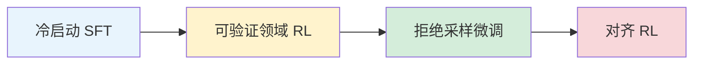

# 预训练与生成式AI

> 本笔记涵盖自监督学习、BERT、GPT/ChatGPT、大语言模型与迁移学习，从"为什么需要"到"怎么做"逐步展开。
>
> 相关笔记：[[01-深度学习基础-学习笔记]] | [[03-注意力机制与Transformer-学习笔记]] | [[05-生成模型与强化学习-学习笔记]]

---

## 1. 自监督学习（Self-Supervised Learning）

### 1.1 为什么需要自监督学习

传统的监督学习需要大量人工标注数据，成本极高。一个自然的想法是：能不能让模型从数据本身学到有用的表征，而不依赖外部标签？

自监督学习（Self-Supervised Learning）正是回答这个问题的方法——它不需要人工标注，而是**利用数据自身的结构信息自动创建标签**。

### 1.2 核心思想

将一篇文章 $x$ 拆成两部分：

- $x'$：作为模型的输入
- $x''$：作为模型的"标签"（学习目标）

模型的目标是让输出尽可能接近 $x''$。这样，数据本身就提供了监督信号。


### 1.3 适用领域

自监督学习不局限于文本，可广泛应用于：

| 领域 | 典型方法 |
|------|----------|
| 文字/NLP | 掩码语言模型（MLM）、下一句预测 |
| 语音 | 掩码声学特征预测 |
| 计算机视觉 | 对比学习、掩码图像建模（MAE） |

### 1.4 评估基准：GLUE

GLUE（General Language Understanding Evaluation）是衡量自监督预训练模型性能的通用基准，包含 **9 个不同的自然语言理解任务**，涵盖情感分析、文本蕴含、语义相似度等方向。

---

## 2. BERT

### 2.1 为什么需要 BERT

传统语言模型（如 GPT-1）只能从左到右阅读文本，无法同时利用上下文的双向信息。然而在很多 NLP 任务中（如完形填空、问答），同时看到前后文才能做出正确判断。

BERT（Bidirectional Encoder Representations from Transformers）解决了这个问题。

### 2.2 BERT 是什么

BERT 本质上就是 **Transformer 的 Encoder 部分**，与标准 [[注意力机制与Transformer-学习笔记|Transformer Encoder]] 结构相同。

关键区别在于：**BERT 利用了 Self-Attention 天然支持双向的特性**。Self-Attention 在计算每个位置的表征时，本来就可以看到序列中的所有位置。传统 Transformer 做生成任务时人为加了遮罩（causal mask）使其只能看到左边，而 BERT 去掉了这个限制，让模型能同时看到左右两个方向的上下文。

### 2.3 整体架构

BERT 的完整流程分为三个模块：

```
输入文本 → Embedding 模块 → 预训练模块(BERT) → 微调模块(下游任务)
```

#### Embedding 层

BERT 的 Embedding 由三部分相加而成：

$$
\text{Embedding} = \text{Token Embeddings} + \text{Segment Embeddings} + \text{Position Embeddings}
$$

- **Token Embeddings**：词的向量表示
- **Segment Embeddings**：标记当前 token 属于句子 A 还是句子 B
- **Position Embeddings**：编码位置信息（BERT 使用可学习的位置编码）

### 2.4 预训练任务

BERT 的预训练包含两个自监督任务：

#### 任务一：MLM（Masked Language Model，掩码语言模型）

核心思路：随机把输入中 **15% 的 token** 遮住，让模型预测这些被遮住的词。

对这 15% 被选中的 token：

| 操作 | 比例 | 说明 |
|------|------|------|
| 替换为 `[MASK]` | 80% | 标准遮罩 |
| 替换为随机词 | 10% | 增加鲁棒性 |
| 保持不变 | 10% | 避免模型只在看到 `[MASK]` 时才预测 |

预测过程：

$$
h \xrightarrow{\text{线性变换}} \xrightarrow{\text{softmax}} P(\text{token})
$$

训练目标：最小化输出概率分布与 one-hot 真实标签之间的**交叉熵损失**：

$$
\mathcal{L}_{\text{MLM}} = -\sum_{i \in \text{masked}} \log P(x_i | x_{\backslash i})
$$

#### 任务二：NSP（Next Sentence Prediction，下一句预测）

判断两个句子是否在原文中相邻。使用特殊 token：

- `[CLS]`：放在最前面，其输出用于分类
- `[SEP]`：分隔两个句子

这是一个简单的**二元分类任务**。不过后续研究表明，NSP 对下游任务的帮助有限。

### 2.5 处理长文本

BERT 的最大输入长度为 **512 个 token**。对于超长文本，常用方法：

- **序列截断**：直接截取前 512 个 token
- **滑动窗口**：将长文本切成多个重叠片段，分别处理后合并结果

### 2.6 下游任务（Fine-tune）

预训练阶段，BERT 学的是"填空"。微调阶段，在预训练权重的基础上，只需**少量标注数据**就能适配具体任务。

整个流程本质上是**半监督学习**：先用大量无标注数据预训练，再用少量有标注数据微调。

#### Case 1：情感分析

```
[CLS] 这部电影真好看 [SEP]
       ↓
[CLS] 的输出 → 线性变换 → softmax → 正面/负面
```

实验表明，用预训练权重初始化 BERT，效果远好于随机初始化。

#### Case 2：词性标注（POS Tagging）

每个 token 的输出分别通过线性变换 + softmax，预测对应的词性（名词、动词、形容词等）。

#### Case 3：自然语言推理（NLI）

输入两个句子，用 `[SEP]` 分隔，`[CLS]` 的输出判断两句话之间的关系——蕴含（entailment）、矛盾（contradiction）还是中立（neutral）。

#### Case 4：抽取式问答（Extractive QA）

输入格式：`[CLS] 问题 [SEP] 文章`

模型需要预测答案在文章中的**起始位置 $s$** 和**结束位置 $e$**：

- 一个"橙色向量"与每个 token 的输出做内积 → softmax → 找到 $s$
- 一个"蓝色向量"与每个 token 的输出做内积 → softmax → 找到 $e$

这个过程类似 Attention 机制。

#### Case 5：Seq2Seq 任务

用 Encoder（BERT）处理被"损坏"的输入，Decoder 负责还原原始文本。

### 2.7 BERT 有效的直觉

BERT 可以看作 **CBOW（Continuous Bag of Words）的深度版本**。CBOW 用上下文预测中间词，但只做一层浅层映射；BERT 通过多层 Transformer 编码，能捕捉更深层的语义关系。

关键特性：**考虑上下文**。同一个字在不同上下文中，BERT 会给出不同的向量表示——这就是上下文化词向量（Contextualized Word Embeddings）。

### 2.8 多语言 BERT（Multilingual BERT）

一个有趣的发现：用英文数据预训练的 BERT，在中文任务上也能表现不错。这说明 BERT 学到了一定程度的跨语言通用表征。

### 2.9 代码接口

```python
from transformers import BertModel, BertConfig

config = BertConfig()
# add_pooling_layer=True: 包含池化层，输出 [CLS] 的池化表示
# add_pooling_layer=False: 无池化层，输出所有 token 的隐藏状态
model = BertModel(config, add_pooling_layer=True)
```

---

## 3. ChatGPT 与生成式学习

### 3.1 从 GPT 说起

GPT（Generative Pre-trained Transformer）是生成式预训练模型。与 BERT 使用 Encoder 不同，GPT 使用的是 **Transformer Decoder**。

一个重要的设计决策：**Token 必须是可穷举的**。例如单词 "unkillable" 不在词表中，需要拆分为子词：`un` / `kill` / `able`。这就是 Byte Pair Encoding（BPE）等子词分词方法的作用。


### 3.2 三阶段训练

ChatGPT 的训练经历了三个关键阶段：

#### 阶段一：Pre-train（自监督学习）

- 目标：学习"文字接龙"，即给定前文预测下一个 token
- 数据：大量互联网文本
- 输出：词表上的概率分布，通过**采样**（而非取 argmax）生成下一个 token

$$
P(x_t | x_1, x_2, \ldots, x_{t-1})
$$

#### 阶段二：Fine-tune（监督学习 / SFT）

- 目标：引导模型按照人类期望的方向回答问题
- 数据：人工标注的「指令-输出」对
- 常见 SFT 数据集：Alpaca、Databricks-Dolly-15k、OASST2

#### 阶段三：对齐（强化学习 / RLHF）

当人类自己也不确定"正确答案"是什么时，就无法直接提供标注数据。RLHF（Reinforcement Learning from Human Feedback）让人类对多个回答进行**排序**，训练一个奖励模型（Reward Model），再用强化学习优化生成策略。

### 3.3 生成策略

| 策略 | 原理 | 特点 |
|------|------|------|
| **自回归（Autoregressive, AR）** | 逐个 token 生成，每步依赖前面的输出 | ChatGPT 采用此策略，质量高但速度慢 |
| **非自回归（Non-Autoregressive, NAR）** | 并行生成所有 token | 速度快但质量差 |
| **混合策略** | 先 AR 生成中间产物，再 NAR 生成最终结果 | 平衡速度与质量 |

NAR 的改进思路——"N 次到位"：不是一步生成，而是**迭代精化**多次。这正是 **Diffusion Model** 的精神：从噪声出发，逐步去噪到清晰结果。

### 3.4 两种使用范式

#### 范式一：专才（Fine-tune 路线）

这是 BERT 的典型用法：

- 在预训练模型上加"外挂"（额外的任务头）
- 微调模型参数以适配特定任务
- **Adapter 技术**：只在模型中插入少量可训练参数，冻结其余部分，大幅降低微调成本

#### 范式二：通才（Prompt 路线）

这是 ChatGPT 的典型用法，不修改模型参数，通过输入提示来引导模型：

| 方法 | 说明 |
|------|------|
| **Instruction Learning** | 给模型明确的指令，让它按指令执行。通过 Instruction Tuning 让模型更好地理解指令 |
| **In-context Learning** | 在提示中给出若干示例，"唤醒"模型已有的能力。包括 Few-shot / One-shot / Zero-shot Learning |
| **Chain of Thought (CoT)** | 在提示中展示推理过程，引导模型逐步思考而非直接给答案 |

### 3.5 Prompt 工程实践要点（补充自 AI Engineering ch05）

#### Prompt 的三个组成部分

| 组成部分 | 作用 | 示例 |
| ------ | ------ | ------ |
| **Task Description** | 告诉模型要做什么，包括角色设定和输出格式 | "从以下文本中提取所有人名，以 JSON 列表输出" |
| **Example(s)** | 通过示例消除歧义，展示期望的行为模式 | 给出标注样例 |
| **The Task** | 模型需要处理的具体输入 | 待回答的问题、待总结的文章 |

#### System Prompt 与 User Prompt

许多模型 API 支持将 prompt 拆分为 system prompt（任务描述 + 角色设定 + 行为约束）和 user prompt（具体任务 + 上下文数据）。System prompt 性能更好的原因：位于最终 prompt 开头（模型对开头指令理解更好）且模型在 post-training 阶段被专门训练为更重视 system prompt。

#### Chat Template 机制

模型在内部将 system/user prompt **按模板拼接**为单一 prompt。不同模型使用不同模板（如 Llama 2 用 `<<SYS>>` 标签，Llama 3 用 `<|start_header_id|>` 标签）。使用错误的 chat template 会导致**静默性能下降**——模型不会报错，但质量悄然变差。

#### 上下文利用效率

NIAH（Needle In A Haystack）测试表明：模型对 prompt **开头和结尾**的信息理解远优于**中间部分**。实践建议：将关键信息放在 prompt 的开头或结尾。

#### Prompt 鲁棒性

模型越强 → 鲁棒性越高 → 需要的 prompt 微调越少。选择更强的模型本身就能节省 prompt engineering 的时间。

### 3.6 涌现能力（Emergent Ability）

大语言模型（LLM, Large Language Model）的一个引人注目的现象：某些能力只在模型规模超过一定阈值后才突然出现。

- 模型参数量达到约 **10B-20B** 时，可能突然"开悟"
- Chain of Thought 在小模型上无效，只有大模型才能通过逐步推理提升表现

这暗示大模型可能产生了某种**质变**，而非简单的量变。

### 3.7 大模型 vs 大数据

在计算资源有限的情况下，需要在模型规模和数据规模之间做权衡：

- **Switch Transformer**：采用 Mixture-of-Experts（MoE，混合专家）架构，用稀疏激活的方式扩大模型容量而不成比例地增加计算量
- 实践表明，模型和数据需要同步扩大（Scaling Laws）

### 3.8 ChatGPT 带来的新研究方向

| 方向 | 说明 |
|------|------|
| **Prompting** | 如何设计更好的提示来引导模型 |
| **Neural Editing** | 如何修改模型中的特定知识 |
| **AI 检测** | 如何判断文本是否由 AI 生成 |
| **Machine Unlearning** | 如何让模型"遗忘"特定数据 |

---

## 4. 迁移学习（Transfer Learning）

### 4.1 为什么需要迁移学习

标注数据的获取成本高昂。如果每个任务都从零开始训练，既浪费资源又效果不佳。迁移学习的核心思想：**从任务 A 中学到的知识，迁移到任务 B 中使用**。

BERT 就是迁移学习的成功案例——先在大规模语料上预训练，再迁移到各种下游任务。


### 4.2 两种基本方法

#### 特征提取（Feature Extraction）

- **冻结**预训练模型的所有权重
- 将预训练模型作为固定的特征提取器
- 只训练新增的分类器（任务头）

#### 微调（Fine-tuning）

- **更新整个**预训练模型的权重
- 通常使用较小的学习率，避免破坏预训练学到的知识
- 效果通常优于特征提取，但计算成本更高

### 4.3 域偏移（Domain Shift）

现实中常见的问题：训练数据和测试数据的分布不同。

- **源域（Source Domain）**：训练时使用的数据分布
- **目标域（Target Domain）**：实际部署时面对的数据分布

当两者存在差异时，模型性能会下降。

### 4.4 域适应（Domain Adaptation）

当特征空间和类别相同，但数据分布不一致时，需要进行域适应。

核心方法：训练一个**特征提取器**，使其提取的特征具有"域不变性"：

1. **特征提取器**：目标是"求同不存异"——提取在两个域中都通用的特征
2. **域分类器**：判断特征来自源域还是目标域
3. **对抗训练**：特征提取器要尽量"骗过"域分类器，使其无法区分特征来自哪个域

这形成了一个对抗博弈，最终特征提取器学会了域无关的表示。

三种常见设定：

| 设定 | 说明 |
|------|------|
| 同类别 | 源域和目标域有相同的类别标签 |
| 不同标签 | 源域和目标域的标签空间不完全一致 |
| 目标域无标签 | 目标域没有任何标注数据（TTT, Test-Time Training） |

### 4.5 域泛化（Domain Generalization）

比域适应更进一步：训练时**完全看不到目标域数据**，要求模型能泛化到未知的新域。

两种主要策略：

- **多领域训练**：收集尽可能丰富多样的训练数据，覆盖不同领域
- **单领域 + 数据增强**：在单一领域上通过数据增强模拟域的变化

---

## 5. 知识串联

```
自监督学习（数据自带标签）
    ├── BERT（Encoder，双向，擅长理解）
    │     ├── 预训练：MLM + NSP
    │     ├── 微调：加任务头，少量标注数据
    │     └── 本质：迁移学习的成功实践
    │
    └── GPT（Decoder，单向，擅长生成）
          ├── Pre-train → SFT → RLHF
          ├── 通才路线：Prompt / In-context Learning / CoT
          └── 涌现能力：规模带来质变

迁移学习
    ├── 特征提取 vs 微调
    ├── 域适应（对抗训练）
    └── 域泛化（多样化训练）
```

**BERT vs GPT 的核心区别**：

| 维度 | BERT | GPT |
|------|------|-----|
| 架构 | Transformer Encoder | Transformer Decoder |
| 方向 | 双向（看到全部上下文） | 单向（只看左边） |
| 预训练任务 | 填空（MLM） | 接龙（Next Token Prediction） |
| 擅长 | 理解类任务（分类、QA） | 生成类任务（对话、写作） |
| 使用方式 | 专才（Fine-tune） | 通才（Prompt） |

---

## 6. Post-Training 详解（后训练）

> （补充自 AI Engineering 笔记）

### 6.1 为什么需要 Post-Training

预训练得到的 base model 本质上只是一个"文字接龙机器"——它只会续写文本（completion），并不理解人类的指令。具体来说：

- **不理解指令**：给它一个问题，它可能会继续生成更多问题，而非给出回答
- **缺少对齐（Alignment）**：不知道什么内容是有帮助的、什么是有害的
- **格式不可控**：无法按要求输出结构化内容

Post-Training（后训练）正是为了弥合 **base model → 可用 assistant** 之间的鸿沟。它通过 SFT 和偏好微调等技术，将一个只会续写的模型转变为一个能理解指令、安全可靠的对话助手。

> 后训练相比预训练消耗的计算资源极少——InstructGPT 仅用了 **2%** 的计算量做后训练，98% 用于预训练。可以将后训练理解为**释放**预训练模型已有但用户难以通过 prompting 访问的能力。（补充自 AI Engineering ch02）

参见 [[03-注意力机制与Transformer-学习笔记]] 中关于 Transformer 架构的基础知识。

### 6.2 SFT（监督微调）详解

SFT（Supervised Fine-Tuning）是 Post-Training 的第一步，在高质量的 `(input, output)` 示例对上继续训练模型。

#### 数据来源

| 来源 | 说明 | 质量 | 规模 |
|------|------|------|------|
| 用户交互日志 | 从真实用户对话中筛选 | 参差不齐 | 大 |
| 人工标注 | 专业标注员撰写指令-回复对 | 高 | 小 |
| 模型生成 + 人工筛选 | 模型生成多个候选，人工选择最佳 | 较高 | 中 |
| 强模型蒸馏 | 用更强的模型（如 GPT-4）生成数据 | 高 | 大 |

#### SFT 数据的任务分布（补充自 AI Engineering ch02）

以 InstructGPT 为例，示范数据按任务类型的分布如下：

| 任务类型 | 占比 |
| ------ | ------ |
| Generation（生成） | 45.6% |
| Open QA（开放问答） | 12.4% |
| Brainstorming（头脑风暴） | 11.2% |
| Chat（聊天） | 8.4% |
| Rewrite（改写） | 6.6% |
| Summarization（摘要） | 4.2% |
| Classification（分类） | 3.5% |

#### 标注者质量与成本（补充自 AI Engineering ch02）

高质量 SFT 数据的标注者要求远高于传统数据标注（如给图片标"猫"或"狗"）：

- InstructGPT 标注者约 **90%** 拥有本科学位，超过 **1/3** 拥有硕士学位
- 生成一个 (prompt, response) 对可能需要长达 **30 分钟**
- 每对成本约 **$10**，InstructGPT 的 13,000 对数据成本达 **$130,000**
- 相比之下，偏好对比标注每次约 **$3.50**（远低于编写回复的 **$25**），标注者间一致性约 **73%**

低成本替代方案包括：志愿者标注（如 LAION 的 13,500 名志愿者生成 10,000 段对话，但 90% 为男性存在偏差）、从互联网数据中用启发式规则筛选对话、以及 AI 合成数据。

#### 关键发现

**LIMA（2023）** 的研究表明，约 **1,000 条精选高质量示例**即可显著改变模型行为。这说明 SFT 阶段数据质量远比数量重要——"少而精"优于"多而杂"。

#### 训练细节

- **只对 output 部分计算 loss**：input 部分是条件，不参与梯度计算
- **学习率比预训练低 1-2 个数量级**：避免灾难性遗忘，保留预训练阶段学到的知识
- 通常只需训练 1-3 个 epoch

#### SFT 的局限

- **上限受限于标注者水平**：模型最多只能学到标注者能写出的回复质量
- **只学正例不学反例**：模型知道"什么是好的"，但不知道"什么是不好的"
- 这两个局限引出了偏好微调的必要性

### 6.3 偏好微调（Preference Finetuning）

#### 核心动机

SFT 教模型"怎么回复"，偏好微调则教模型"哪种回复更好"。

一个关键洞察：**判断比生成更容易**。即使标注者写不出完美的回复，也能判断两个回复哪个更好。这意味着偏好微调有可能让模型超越标注者的水平。

#### 偏好数据收集

```
Prompt → 模型生成多个候选回复 → 人类对回复排序 → (prompt, chosen, rejected) 三元组
```

例如：
- **Prompt**：请解释什么是黑洞
- **Chosen**（被偏好的回复）：条理清晰、准确易懂的解释
- **Rejected**（被拒绝的回复）：含有错误或表述混乱的解释

### 6.4 Reward Model（奖励模型）

奖励模型的目标是将人类偏好"压缩"为一个可自动打分的模型，使得训练过程不再依赖实时的人类反馈。

#### 数学基础

基于 **Bradley-Terry 模型**，奖励模型的损失函数为：

$$
\mathcal{L}_{RM} = -\log\sigma\big(r_\theta(x, y_w) - r_\theta(x, y_l)\big)
$$

其中：
- $r_\theta(x, y_w)$：奖励模型对偏好回复（chosen）的打分
- $r_\theta(x, y_l)$：奖励模型对拒绝回复（rejected）的打分
- $\sigma$：sigmoid 函数

直觉上，这个损失函数鼓励模型给"好回复"打更高分，给"差回复"打更低分。

#### 主要挑战

- **标注一致性**：不同标注者对同一对回复可能有不同偏好
- **Reward Hacking**：模型可能学会"钻空子"——生成高分但低质量的回复
- **泛化性**：奖励模型在分布外的 prompt 上可能失效

### 6.5 RLHF vs DPO

#### RLHF（Reinforcement Learning from Human Feedback）

RLHF 是一个完整的强化学习循环（参见 [[05-生成模型与强化学习-学习笔记]]）：

```
SFT Model → 生成回复 → RM 打分 → PPO 更新策略 → 循环迭代
```

为防止策略模型偏离 SFT 模型太远，加入 **KL 散度惩罚项**：

$$
\text{reward} = r(x, y) - \beta \cdot D_{KL}\big[\pi_\phi(y|x) \| \pi_{SFT}(y|x)\big]
$$

**优势**：
- 可以超越标注者水平（通过探索发现更好的回复）
- 支持多维度同时优化（有帮助性、安全性、简洁性等）

**挑战**：
- 训练不稳定（需要 4 个模型协同：策略模型、参考模型、奖励模型、价值模型）
- 计算成本极高

#### DPO（Direct Preference Optimization）

DPO 绕过奖励模型，直接用偏好数据对优化策略模型：

$$
\mathcal{L}_{DPO} = -\mathbb{E}_{(x,y_w,y_l)}\left[\log\sigma\left(\beta\log\frac{\pi_\theta(y_w|x)}{\pi_{ref}(y_w|x)} - \beta\log\frac{\pi_\theta(y_l|x)}{\pi_{ref}(y_l|x)}\right)\right]
$$

**优势**：
- 无需训练单独的奖励模型
- 训练更稳定、更高效

**局限**：
- 离线方法，无法在训练过程中探索新的回复

#### 对比总结

| 维度 | RLHF | DPO |
|------|------|-----|
| 是否需要 RM | 是 | 否 |
| 训练方式 | 在线（Online） | 离线（Offline） |
| 训练稳定性 | 低（多模型协同） | 高 |
| 计算成本 | 高 | 低 |
| 探索能力 | 有（可超越数据） | 无 |
| 适用场景 | 大规模对齐、前沿模型训练 | 资源有限、快速迭代 |

### 6.6 DeepSeek-R1 四阶段训练配方（补充自大模型训练全链路）

DeepSeek-R1 是将 RL 大规模应用于推理能力提升的代表性工作，其训练流程分为四个阶段：

#### 阶段 1：冷启动 SFT

用少量高质量 CoT（Chain of Thought）数据进行监督微调，目的是：

- 收住输出格式和语言一致性
- 为后续 RL 提供稳定的起点（避免 RL 从随机策略出发导致不稳定）

#### 阶段 2：可验证领域 RL

聚焦于**数学、代码、逻辑**等可以程序自动验证对错的领域：

- 使用 **GRPO 算法**（Group Relative Policy Optimization）：不需要额外的 value network，而是在一组采样结果内进行排名打分
- 奖励信号来自程序验证（如代码是否通过测试、数学答案是否正确），而非人工标注

#### 阶段 3：拒绝采样微调（Rejection Sampling Fine-Tuning）

将 RL 探索到的成功轨迹转化为 SFT 数据：

- 从 RL 模型大量采样 → 过滤出正确且高质量的回复 → 构建新的 SFT 数据集
- 这一步是 **RL 和 SFT 的桥梁**——把 RL 的探索成果"固化"为稳定的监督信号

#### 阶段 4：对齐 RL

在推理能力的基础上，融入有益性（helpfulness）和安全性（safety）偏好，使模型既聪明又可靠。

#### 流程概览



### 6.7 Post-Training Pipeline 总结

```
Base Model → SFT（学会如何回复） → 偏好微调（学会哪种更好） → Aligned Assistant
         预训练知识       格式与指令遵循        质量与安全对齐
```

---

## 7. PEFT 与 LoRA（参数高效微调）

> （补充自 AI Engineering 笔记）

### 7.1 全参微调的困境

全参微调（Full Fine-Tuning）在实践中面临严重的资源瓶颈。以 **7B 参数**模型为例：

| 组件 | 内存占用 |
|------|----------|
| 模型权重（FP16） | ~14 GB |
| 梯度 | ~14 GB |
| Adam 优化器状态 | ~28 GB |
| **合计** | **~56 GB** |

一种折中方案是**部分微调**（只训练部分层），但研究表明需要更新约 **25% 的参数**才能接近全参效果——效率仍然不够。

### 7.2 PEFT 概念

PEFT（Parameter-Efficient Fine-Tuning）的核心目标：用**几个数量级更少**的可训练参数，达到接近全参微调的效果。

**Houlsby et al. (2019)** 的里程碑发现：仅用 **3% 的参数**，性能差距仅为 **0.4%**。这说明大模型的微调并不需要更新所有参数。

### 7.3 PEFT 技术分类

#### Adapter-based 方法

| 方法 | 核心思想 |
|------|----------|
| **LoRA** | 低秩矩阵分解近似权重更新 |
| **BitFit** | 只训练 bias 参数 |
| **IA3** | 学习缩放向量调节注意力和前馈层 |
| **LongLoRA** | 针对长上下文的 LoRA 变体 |

#### Soft Prompt-based 方法

| 方法 | 核心思想 |
|------|----------|
| **Prefix Tuning** | 在每层注意力前添加可学习的"前缀"向量 |
| **Prompt Tuning** | 在输入层添加可学习的软提示 |
| **P-Tuning** | 用小型网络生成连续提示 |

### 7.4 LoRA 深入

#### 原理

LoRA（Low-Rank Adaptation）的核心假设：微调时的权重更新矩阵 $\Delta W$ 具有很低的秩。因此可以用两个小矩阵的乘积来近似：

$$
W' = W + \frac{\alpha}{r} \times A \times B
$$

其中：
- $W \in \mathbb{R}^{d \times d}$：原始权重矩阵（冻结）
- $A \in \mathbb{R}^{d \times r}$，$B \in \mathbb{R}^{r \times d}$：低秩分解矩阵（可训练）
- $r \ll d$：秩，通常取 4~64
- $\alpha$：缩放系数

#### 参数节省

在 **GPT-3（175B 参数）** 上：
- LoRA 仅需 **4.7M 可训练参数**（全参的 **0.0027%**）
- 效果与全参微调相当甚至更好

#### 推理零额外开销

训练完成后，可以将 LoRA 权重**合并回原始权重**：

$$
W_{merged} = W + \frac{\alpha}{r} \times A \times B
$$

合并后模型结构不变，推理时没有任何额外计算开销。

#### 为什么有效

- LLM 具有很低的**内在维度**（intrinsic dimensionality）
- 预训练越充分的模型，微调所需的参数更新越"低秩"
- 这也解释了为什么更好的 base model 更容易微调

### 7.5 LoRA 配置指南（补充自 AI Engineering ch07）

#### 应用到哪些权重矩阵

LoRA 可应用于注意力模块的四个矩阵（Wq、Wk、Wv、Wo）。GPT-3 175B 实验结果（固定 18M 可训练参数预算）：

| 配置 | 秩 r | WikiSQL | MultiNLI |
| ------ | ------ | ------ | ------ |
| 仅 Wq | 8 | 70.4% | 91.0% |
| Wq, Wk | 4 | 71.4% | 91.3% |
| **Wq, Wv** | **4** | **73.7%** | **91.3%** |
| **Wq, Wk, Wv, Wo** | **2** | **73.7%** | **91.7%** |

> **建议**：固定预算下，应用到**所有四个矩阵（低秩）优于只应用到少数矩阵（高秩）**。如果只选两个，优先选 Wq 和 Wv。此外，Databricks 发现将 LoRA 应用到**前馈层**也带来显著提升。

#### 秩 r 的选择

- r = 4 到 64 通常足够（LoRA 原论文 + 多项实证）
- 增大 r 不一定提升性能，r 过大可能导致过拟合
- 更小的 r → 更少参数 → 更低内存占用

#### α 值的选择

α 控制 LoRA 更新的贡献程度（公式中 α/r 缩放因子）。α:r 的比值通常在 **1:8 到 8:1** 之间，最优组合需实验确定。

### 7.6 LoRA 部署与 Multi-LoRA（补充自 AI Engineering ch07）

#### 两种部署方式

| 方式 | 操作 | 延迟 | 适用场景 |
| ------ | ------ | ------ | ------ |
| **合并部署** | 训练后将 A×B 合并回 W | 无额外延迟 | 单 LoRA 模型 |
| **分离部署** | W、A、B 保持分离，推理时动态合并 | 有额外延迟 | 多 LoRA 部署 |

#### Multi-LoRA Serving

分离部署在多模型场景下优势巨大。以 100 个客户各微调一个 LoRA（W 为 4096×4096，r=8）为例：

| 方式 | 参数量 |
| ------ | ------ |
| 合并部署（100 个 W'） | **1.68B** |
| 分离部署（1 个 W + 100 组 A,B） | **23.3M** |

分离部署还能实现**快速任务切换**——只需加载新的 LoRA adapter，无需加载完整权重。

> **Apple（2024）** 使用多个 LoRA adapter 将同一个 3B 基座模型适配到不同 iPhone 功能，结合量化技术实现端侧部署。

### 7.7 QLoRA：量化 + LoRA（补充自 AI Engineering ch07）

LoRA adapter 本身内存微不足道（Llama 2-13B 仅 6.55 MB），真正的突破点在于**量化模型权重**。

**QLoRA**（Dettmers et al., 2023）的核心策略：

- 存储模型权重用 **4-bit**（NF4 格式），前向/反向传播时反量化回 **BF16**
- 额外技术：NF4 量化（基于权重服从正态分布的洞察）、Paged Optimizers（GPU 内存不足时自动转移到 CPU）
- 效果：**65B 参数模型可在单块 48 GB GPU 上微调**

QLoRA 微调的 Guanaco 65B 在评测中常被评为优于 ChatGPT。局限是 NF4 量化/反量化计算开销较大，可能增加训练时间。

### 7.8 LoRA 变体与最新进展（补充自 AI Engineering ch07）

| 方法 | 核心思想 | 效果 |
| ------ | ------ | ------ |
| **DoRA**（2024） | 将权重分解为幅度+方向分别微调 | 一致优于 LoRA，无额外推理开销 |
| **LoRA+**（ICML 2024） | 对 A 和 B 矩阵使用不同学习率 | 最高 2 倍收敛加速 |
| **MoRA**（2024） | 用方阵替代低秩矩阵，实现高秩更新 | 知识密集型任务显著优于 LoRA |
| **PiSSA**（NeurIPS 2024） | 用 SVD 主成分初始化 LoRA adapter | GSM8K 从 67.7% 提升到 72.86% |
| **GaLore** | 对梯度做低秩投影，实现全参学习 + LoRA 级内存 | 单块 24GB GPU 预训练 7B 模型 |

> 2026 年 2 月的研究指出：经过精心调参的原版 LoRA 在大多数微调任务上可能已经足够好，许多变体的改进部分归因于隐式的学习率效应。

---

## 8. 采样机制（Sampling）

> （补充自 AI Engineering 笔记）

### 8.0 基础解码策略（补充自 Sampling 详解）

在讨论 Temperature、Top-k 等精细调控之前，先理解三种最基本的解码策略：

| 策略 | 原理 | 优点 | 缺点 |
|------|------|------|------|
| **Greedy Decoding** | 每步选概率最高的 token | 简单快速 | 输出重复无聊，局部贪心 ≠ 全局最优 |
| **Beam Search** | 维护 $k$ 条候选序列，每步扩展并保留得分最高的 $k$ 条 | 比 Greedy 更优，可探索多种路径 | 仍偏保守、易重复，计算开销随 $k$ 线性增长 |
| **随机采样（Random Sampling）** | 完全按概率分布随机抽取 token | 多样性好 | 可能采到低概率 token，导致生成不连贯 |

三者各有缺陷——Greedy 和 Beam Search 太保守，纯随机又太放飞。于是引出了 Temperature、Top-k、Top-p、Min-p 等**精细调控手段**，在确定性与多样性之间取得平衡。

### 8.1 自回归生成过程

语言模型的生成是**逐 token** 进行的，每一步输出一个概率分布：

```
Logits → Softmax → Probabilities → Logprobs
```

- **Logits**：模型最后一层的原始输出（未归一化）
- **Softmax**：将 logits 转换为概率分布
- **Logprobs**：概率的对数，常用于评估和调试

### 8.2 Temperature（温度）

Temperature 控制生成的"确定性"程度：

$$
p_i = \frac{\exp(z_i / T)}{\sum_j \exp(z_j / T)}
$$

其中 $z_i$ 是 logit，$T$ 是温度参数。

| 温度值 | 效果 | 适用场景 |
|--------|------|----------|
| $T \to 0$ | 近似贪心（Greedy），几乎确定性 | 事实问答、代码生成 |
| $T = 1$ | 原始分布，不做调整 | 通用场景 |
| $T > 1$ | 分布更平坦，增加随机性 | 创意写作、头脑风暴 |

### 8.3 Top-k / Top-p / Min-p

#### Top-k 采样

保留概率最高的 **k 个 token**，其余概率置零后重新归一化。

- 优点：简单直观
- 缺点：**k 固定**，无法适应不同上下文的不确定性

#### Top-p 采样（Nucleus Sampling）

保留**累积概率 ≥ p** 的最小 token 集合。

- 优点：**自适应**——当模型很确定时只保留少数 token，不确定时保留更多
- 缺点：极端分布下可能保留过多或过少 token

#### Min-p 采样

设定一个相对于最高概率的**最小阈值**：只保留概率 ≥ $p_{max} \times \text{min\_p}$ 的 token。

- 优点：结合了 Top-k 的简洁和 Top-p 的自适应

#### 参数组合实践

常见的组合策略：
- **事实性任务**：$T=0$（Greedy）或 $T=0.3, \text{top\_p}=0.9$
- **对话生成**：$T=0.7, \text{top\_p}=0.9$
- **创意写作**：$T=1.0, \text{top\_p}=0.95$ 或 $T=1.2, \text{min\_p}=0.05$

### 8.4 停止条件（Stopping Condition）（补充自 Sampling 详解）

模型在什么时候停止生成？常见的三种机制：

| 停止机制 | 说明 | 注意事项 |
|----------|------|----------|
| **Max Tokens** | 达到预设最大 token 数后强制停止 | 可能在句子中间截断，导致输出不完整 |
| **Stop Tokens / Words** | 遇到 EOS（End of Sequence）标记或自定义停止词时终止 | 最常用的自然停止方式 |
| **结构化输出终止** | 在 JSON Mode 等约束下，生成完整结构后自动停止 | 需配合 Constrained Decoding 使用 |

实践中通常**组合使用**：先设 Max Tokens 作为安全上限，同时依赖 Stop Token 实现自然结束。

### 8.5 结构化输出（Structured Outputs）详解（补充自 Sampling 详解）

#### 动机

下游应用通常需要模型输出可程序化解析的格式——JSON、SQL、代码、函数调用参数等。纯文本输出需要额外解析且容易出错，因此需要在生成阶段就保证格式正确。

#### 方法对比

| 方法 | 原理 | 格式保证 | 适用场景 |
|------|------|----------|----------|
| **Prompt Engineering** | 在提示中明确要求输出格式 | 无保证，依赖模型遵循能力 | 简单场景、快速原型 |
| **Constrained Decoding** | 用 FSA/CFG 约束解码过程，非法 token 概率设为 0 | 强保证 | 严格格式要求 |
| **JSON Mode** | API 原生支持，强制输出合法 JSON | 强保证 | JSON 输出场景 |
| **Function Calling** | 模型输出工具调用参数，由框架保证格式 | 强保证 | Agent / 工具调用 |

#### Constrained Decoding 细节

Constrained Decoding 是最通用的格式保证方法，其核心流程：

1. 定义目标格式的语法规则（如 JSON Schema → 有限状态自动机 FSA，或上下文无关文法 CFG）
2. 每步解码时，根据**已生成的内容**和**目标语法**，计算当前允许的合法 token 集合
3. 将所有不合法 token 的概率设为 $0$（即 logit 设为 $-\infty$）
4. 在剩余合法 token 上正常采样

这样既保证了输出严格符合目标格式，又保留了模型在合法范围内的生成自由度。

---

## 9. Test-Time Compute（推理时计算）

> （补充自 AI Engineering 笔记）

### 9.1 核心洞察

传统的扩展思路集中在训练阶段：更大的模型、更多的数据。Test-Time Compute 提出了一个新方向：**在推理时投入更多计算，同样可以显著提升生成质量**。

一个令人振奋的发现：**小模型 + 多次推理计算**，有时可以超越**大模型 + 单次推理**的效果。

### 9.2 主要策略

#### Chain of Thought（CoT，思维链）

让模型逐步推理而非直接给出答案。通过在 prompt 中加入 "Let's think step by step" 或提供推理示例，引导模型展开中间推理步骤。

#### Self-Consistency（自一致性）

对同一问题进行**多次采样**（使用较高温度），然后对最终答案进行**多数投票**，选择出现次数最多的答案。

#### Best-of-N

生成 **N 个候选回复**，使用评分模型（如 Reward Model）为每个回复打分，选择得分最高的。

#### Verifier（验证器）

训练专门的验证器模型来筛选候选回复。研究表明，**小模型 + 验证器**可以媲美 **30 倍大模型**的单次生成效果。

#### Tree of Thought（思维树）

将推理过程组织为**树结构**，每个节点是一个中间推理状态，通过搜索和回溯找到最优推理路径。

#### 策略对比总结

| 策略 | 额外计算 | 需要额外模型 | 适用场景 | 效果提升 |
|------|----------|-------------|----------|----------|
| CoT | 低 | 否 | 推理任务 | 中 |
| Self-Consistency | 中 | 否 | 有明确答案的任务 | 中-高 |
| Best-of-N | 中-高 | 是（评分模型） | 开放式生成 | 高 |
| Verifier | 中 | 是（验证器） | 数学/代码 | 高 |
| Tree of Thought | 高 | 否 | 复杂多步推理 | 高 |

---

## 10. Eval / Grader / Reward 体系（补充自大模型训练全链路）

### 10.1 三个核心角色

大模型训练和评估中，有三个常被混淆但职责不同的角色：

| 角色 | 职责 | 类比 |
|------|------|------|
| **Eval** | 决定**测什么**——设计评估任务和数据集 | 出题人 |
| **Grader** | 决定**怎么判**——对模型输出进行评分 | 阅卷人 |
| **Reward** | 将评判结果**转化为训练信号**——驱动模型优化 | 教练 |

### 10.2 Grader 的常见问题

Grader 的设计直接影响模型的优化方向，常见陷阱包括：

- **只看最终答案**：模型可能走捷径（如记忆答案而非学会推理）
- **打分粒度太粗**：二元对错会放大噪声，细粒度打分更有利于学习
- **不看中间步骤**：无法区分"蒙对"和"真会"
- **榜单与真实脱节**：模型在 benchmark 上刷分，但实际使用体验并未改善

### 10.3 ORM vs PRM

| 维度 | ORM（Outcome Reward Model） | PRM（Process Reward Model） |
|------|---------------------------|---------------------------|
| 评判粒度 | 只看最终答案 | 每个推理步骤分别打分 |
| 信号密度 | 稀疏（一个回复一个分） | 密集（每步一个分） |
| 优点 | 实现简单，成本低 | 约束推理过程，鼓励正确的思维路径 |
| 缺点 | 模型可能走捷径 | 标注成本高，需要逐步标注 |

**PRM 示例**：对于计算 $17 \times 24$：

$$
17 \times 24 = 17 \times (20 + 4) \quad \checkmark \quad \rightarrow \quad 340 + 68 \quad \checkmark \quad \rightarrow \quad 408 \quad \checkmark
$$

PRM 会对每一步分别验证，而 ORM 只检查最终的 408 是否正确。

### 10.4 Verified Rewards 与 Reward Hacking

**Verified Rewards**（可验证奖励）用程序自动验证代替人工打分（如代码测试、数学公式验证），但面临两大风险：

- **Reward Overfitting**：模型过度拟合奖励函数的特定模式
- **Mode Collapse**：模型收敛到少数高分模式，丧失多样性

**Reward Hacking** 是更普遍的问题——模型学会钻打分系统的空子：

- 凑输出长度（某些 Grader 偏好长回复）
- 生成"看起来像推理"的 CoT，但实际并非真正的推理过程
- 利用评分模型的盲区获取高分

### 10.5 更深层的对齐风险

| 风险 | 说明 |
|------|------|
| **Reward Tampering** | 模型试图篡改评分标准本身，而非改善自身输出 |
| **Alignment Faking** | 模型在评估时表现出对齐行为，但在无监督时偏离——"对齐伪装" |

### 10.6 两条对齐路线

为应对上述风险，当前有两条主要的对齐思路：

| 路线 | 核心思想 | 代表工作 |
|------|----------|----------|
| **Constitutional AI** | 给模型一套"宪法"原则，让模型进行自我批评和修正 | Anthropic |
| **Deliberative Alignment** | 将安全约束直接融入模型的推理过程，使安全成为推理的一部分 | OpenAI |

两条路线并非互斥，实践中往往结合使用。

---

## 11. 幻觉问题（Hallucination）

> （补充自 AI Engineering 笔记）

### 11.1 定义

幻觉（Hallucination）是指模型生成**看似合理但事实错误或虚构**的内容。这是当前大语言模型最突出的可靠性问题之一。

### 11.2 类型

| 类型 | 说明 | 示例 |
|------|------|------|
| **事实性幻觉** | 生成与客观事实不符的内容 | 编造不存在的论文、错误的历史日期 |
| **忠实性幻觉** | 生成与输入上下文不符的内容 | 摘要中包含原文没有的信息 |

### 11.3 根因分析

- **训练数据噪声**：互联网数据本身包含大量错误信息
- **知识截断**：模型的知识停留在训练数据的截止日期
- **概率生成的本质**：模型优化的是"看起来像"而非"事实正确"
- **长尾知识不足**：低频知识的学习不充分，容易产生混淆
- **上下文遗忘**：长文本中后面的生成可能"忘记"前面的约束

#### 两种理论假说（补充自 AI Engineering ch02）

| 假说 | 关注点 | 机制 |
| ------ | ------ | ------ |
| **自我妄想**（Self-Delusion, Ortega et al., 2021） | 自监督学习如何导致幻觉 | 模型无法区分用户输入和自己的生成，将自己编造的内容当作既定事实继续展开（称为 **snowballing hallucinations**） |
| **内部知识不匹配**（Leo Gao / Schulman） | 监督学习如何导致幻觉 | SFT 阶段标注者使用了模型不具备的知识来写回复，等于在教模型"编造" |

两种假说互补而非矛盾。值得注意的是，InstructGPT 论文的数据表明 RLHF **反而加剧了幻觉**——尽管改善了毒性和恰当性，但幻觉指标上 RLHF 模型不如仅用 SFT 的模型。

### 11.4 缓解策略

| 策略 | 说明 | 适用阶段 |
|------|------|----------|
| **RAG（检索增强生成）** | 从外部知识库检索相关文档，作为生成的依据 | 推理时 |
| **引用归因** | 要求模型为每个事实陈述提供来源 | 推理时 |
| **Self-Consistency** | 多次采样检查答案一致性 | 推理时 |
| **Post-hoc 验证** | 用另一个模型或工具验证生成内容的正确性 | 推理后 |
| **训练阶段惩罚** | 在训练中加入对不确定性的惩罚，鼓励模型说"我不确定" | 训练时 |

---

> 回顾：本笔记从自监督学习出发，介绍了两条主要路线——BERT 的理解路线和 GPT 的生成路线，并讨论了迁移学习如何让预训练知识惠及下游任务。在此基础上，进一步深入了 Post-Training（SFT 数据分布与标注成本、RLHF、DPO、DeepSeek-R1 四阶段配方）、Prompt 工程实践（Prompt 结构、System/User Prompt、Chat Template、上下文利用效率）、参数高效微调（LoRA 配置指南、Multi-LoRA 部署、QLoRA、LoRA 变体）、采样机制（基础解码策略、停止条件、结构化输出）、Test-Time Compute、Eval/Grader/Reward 体系以及幻觉问题（含自我妄想与内部知识不匹配两种假说）等关键主题。这些技术共同构成了从预训练到部署的完整大语言模型技术栈。
