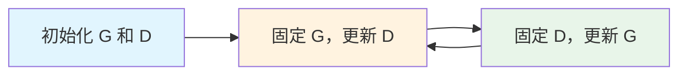

# 生成模型与强化学习

> [!info] 导航
> 本篇是深度学习系列的第四篇，涵盖图像生成模型、GAN、强化学习和 Reformer。前序篇章：
> [[01-深度学习基础-学习笔记]] | [[02-CNN与RNN-学习笔记]] | [[03-注意力机制与Transformer-学习笔记]] | [[04-预训练与生成式AI-学习笔记]]

---

## 1. 图像生成模型：从噪声中创造图像

### 1.1 为什么图像生成不能照搬文字生成的方法？

文字生成通常使用 **Auto-regressive**（自回归）方式——逐个 token 输出。但图像有成千上万个像素，逐像素生成实在太慢。因此，大多数图像生成模型选择**一次到位**（或少数几次）直接输出整张图像。

### 1.2 所有生成模型的共同起点

不管是哪种生成模型，都遵循同一个核心思路：**从一个简单的已知分布（如正态分布 Normal Distribution）中采样一个随机向量，再通过网络将它变成目标图像。** 这个随机向量就是"创造力"的种子——不同的采样会生成不同的图像。

### 1.3 四大生成模型对比

| 模型 | 核心思路 | 生成步数 | 特点 |
|------|---------|---------|------|
| VAE | Encoder 压缩 → 约束为正态分布 → Decoder 还原 | 1 步 | 输出偏模糊 |
| Flow-based | 可逆 Encoder，输出向量直接服从正态分布 | 1 步 | 结构可逆，训练稳定 |
| Diffusion Model | 从纯噪声逐步去噪 | N 步 | 质量高，但生成较慢 |
| GAN | Generator 与 Discriminator 对抗博弈 | 1 步 | 图像锐利，训练不稳定 |

#### VAE（变分自编码器）

VAE 的思路是：先用 **Encoder** 将真实图像压缩成一个低维向量，并**约束这个向量的分布接近标准正态分布**；再用 **Decoder** 从该向量重建图像。生成时只需从正态分布中采样，输入 Decoder 即可得到新图像。

#### Flow-based Model（基于流的模型）

与 VAE 不同，Flow-based Model 的 Encoder 是**完全可逆**的——给定输出可以精确还原输入。训练时让 Encoder 的输出分布尽量接近正态分布，生成时从正态分布采样后通过逆运算得到图像。

#### Diffusion Model（扩散模型）

Diffusion Model 采用"N 次到位"的策略：训练时对真实图像**逐步加噪声**直到变成纯噪声；生成时则反过来，从纯噪声出发**逐步去噪**，一步步恢复出清晰的图像。虽然生成过程较慢，但图像质量往往最好。

---

## 2. GAN：生成对抗网络

### 2.1 为什么需要 GAN？

传统方法中，要让机器生成逼真内容，通常需要大量人工标注和人工判断。GAN 的设计初衷就是**让机器自己学会判断"好不好"**——通过两个网络的对抗，自动化地提升生成质量。

### 2.2 核心概念：警察与小偷的进化

GAN 由两个角色组成：

- **Generator（生成器）**：好比造假币的小偷，目标是生成足以"以假乱真"的输出，骗过判别器
- **Discriminator（判别器）**：好比鉴别假币的警察，目标是分辨出哪些是真实数据、哪些是生成的

两者互相博弈，螺旋上升——小偷越来越会造假，警察也越来越会鉴别，最终生成器能产出几乎无法区分真假的结果。

#### 为什么 Generator 输出的是"分布"而非单一结果？

因为很多问题的正确答案不止一个。比如"从A走到B"，岔路口有多条路线都是正确的。如果只输出一个固定答案，模型就会把所有正确答案"平均"掉，结果反而不好。输出一个**概率分布**，然后从中采样，就能产生多样化的合理结果。

#### Discriminator 的结构

Discriminator 本质上是一个分类网络——输入一张图像，输出一个标量，表示"这张图像有多真实"。它可以用 CNN、Transformer 等任何能处理图像的架构来实现。

### 2.3 训练过程

GAN 的训练是交替进行的：

1. **更新 Discriminator**：固定 Generator，让 D 学会给真实数据打高分、给生成数据打低分
2. **更新 Generator**：固定 Discriminator，让 G 学会生成能骗过 D 的数据

两步反复交替，直到达到平衡。

### 2.4 理论基础：衡量分布差异

GAN 的终极目标可以用数学表达：

$$G^* = \arg\min_G \text{Div}(P_G, P_{data})$$

其中 $P_G$ 是生成器输出的分布，$P_{data}$ 是真实数据分布，$\text{Div}$ 是某种散度（衡量两个分布有多不同）。我们希望找到一个 $G$，使两个分布尽可能接近。

#### JS Divergence 及其问题

原始 GAN 使用 **JS Divergence**（Jensen-Shannon 散度）来衡量分布差异。训练目标函数为：

$$D^* = \arg\max_D V(D, G)$$

其中 $V(D,G)$ 的最大值与 JS Divergence 直接相关。

> [!warning] JS Divergence 的致命问题
> 当 $P_G$ 和 $P_{data}$ 完全不重叠时（这在高维空间中几乎总是发生），JS Divergence 恒等于 $\log 2$，无论 $P_G$ 离 $P_{data}$ 有多远。这意味着 Generator 完全得不到有用的梯度信号，无法进化。

#### Wasserstein Distance：推土机距离

为了解决 JS Divergence 的问题，**WGAN** 引入了 **Wasserstein Distance**（推土机距离）。

直觉上，Wasserstein Distance 把一个分布想象成一堆土，要把它搬成另一个分布的形状。穷举所有可能的搬运方式，找到搬运**平均距离最小**的那种方案，这个最小平均距离就是 Wasserstein Distance。

$$W(P_G, P_{data}) = \inf_{\gamma \in \Pi(P_G, P_{data})} \mathbb{E}_{(x,y) \sim \gamma} [\|x - y\|]$$

> [!tip] 为什么 Wasserstein Distance 更好？
> 即使两个分布完全不重叠，Wasserstein Distance 依然能反映它们的远近。分布越靠近，距离越小——这为 Generator 提供了有意义的梯度方向。

---

## 3. 强化学习：在试错中学习

### 3.1 为什么需要强化学习？

[[深度学习基础-学习笔记|监督学习]]需要大量标注数据来告诉模型"正确答案是什么"。但在很多场景中（下棋、驾驶、对话），我们无法提前给出每一步的标准答案，只能在最后知道结果好不好。**强化学习（Reinforcement Learning, RL）** 正是为此而生——通过与环境的反复互动，在试错中学习最优策略。

### 3.2 核心要素

强化学习包含五个核心概念：

| 概念 | 含义 | 类比（下棋） |
|------|------|-------------|
| **Agent**（智能体） | 做决策的主体 | 棋手 |
| **Environment**（环境） | Agent 所在的世界 | 棋盘 |
| **Observation**（观测） | Agent 看到的当前状态 | 当前棋局 |
| **Action**（动作） | Agent 做出的决定 | 落子位置 |
| **Reward**（奖励） | 环境给的即时反馈 | 赢棋 +1 / 输棋 -1 |

**目标**：找到一个策略（Policy），使得在整个交互过程中获得的**奖励总和最大化**。

### 3.3 三步框架

强化学习同样可以用"找函数"的三步走来理解：

#### 第一步：定义函数——Policy Network

Agent 的决策函数就是一个神经网络，称为 **Policy Network**。它接收当前的 observation 作为输入，输出每个可能 action 的分数，再通过 softmax 转成概率，最后**按概率采样**来选择动作。

> [!note] 为什么要采样而非选最高分？
> 引入随机性可以让 Agent 探索更多可能，避免陷入局部最优。这是强化学习中**探索（exploration）与利用（exploitation）** 的平衡。

#### 第二步：定义目标——回报

一次完整的交互称为一个 **episode**（回合），其中包含的状态-动作序列称为 **trajectory**（轨迹）：

$$\tau = \{s_1, a_1, s_2, a_2, \dots, s_T, a_T\}$$

回合中所有奖励的总和称为 **return**（回报）：

$$R(\tau) = \sum_{t=1}^{T} r_t$$

我们的目标就是最大化回报的期望值。

#### 第三步：优化——梯度上升

与监督学习用梯度下降最小化 loss 不同，强化学习用**梯度上升**来最大化回报。

损失函数可以写为：

$$L = \sum_n A_n \cdot e_n$$

其中 $A_n$ 控制每个动作的执行程度——如果一个动作带来了好的回报，$A_n$ 为正，增大该动作的概率；反之减小。$e_n$ 是对应动作的交叉熵。

> [!warning] 强化学习的挑战
> 环境的状态转移和奖励都可能有随机性，这使得训练比监督学习困难得多。通常需要大量的交互数据才能学到好的策略。

### 3.4 RLHF：让大语言模型对齐人类偏好

**RLHF（Reinforcement Learning from Human Feedback）** 是将强化学习应用于 [[预训练与生成式AI-学习笔记|大语言模型]] 微调的关键技术，流程如下：

1. 用微调后的模型对同一个 prompt 生成**多个不同响应**
2. 由人类标注员对这些响应进行**排名**（哪个更好）
3. 用排名数据训练一个 **Reward Model**，让它自动给响应打分
4. 用 **PPO**（Proximal Policy Optimization）算法，以 Reward Model 的打分作为奖励信号，优化语言模型的策略

这样，模型就能学会生成更符合人类期望的回答。

### 3.5 Actor-Critic 方法

基本的策略梯度方法只有一个网络（Actor），而 **Actor-Critic** 引入第二个网络来辅助训练：

- **Actor（演员）**：即 Policy Network，负责选择动作
- **Critic（评论家）**：即 Value Function（价值函数），负责评估当前状态有多好

#### 两种更新方式

| 方法 | 更新时机 | 特点 |
|------|---------|------|
| **蒙特卡洛（Monte Carlo）** | 完整 episode 结束后 | 无偏但方差大 |
| **时序差分（TD, Temporal Difference）** | 每一步都更新 | 有偏但方差小，更实用 |

时序差分的核心思想：不需要等到游戏结束，每执行一步就用 $r_t + V(s_{t+1}) - V(s_t)$ 来估算当前动作的好坏，立即更新网络。这在实际应用中更为常用。

---

## 4. Reformer：让 Transformer 处理长序列

### 4.1 为什么标准 Transformer 处理不了长序列？

在 [[注意力机制与Transformer-学习笔记|标准 Transformer]] 中，Self-Attention 需要计算每对 token 之间的注意力，对于长度为 $L$ 的序列：

- **时间复杂度**：$O(L^2)$——序列长度翻倍，计算量变为原来的 4 倍
- **空间复杂度**：每一层的激活值都需要保存用于反向传播，层数越多内存消耗越大

当序列长度达到数千甚至数万 token 时，标准 Transformer 在时间和内存上都难以承受。

### 4.2 LSH Attention：用哈希降低注意力复杂度

**LSH（Locality-Sensitive Hashing，局部敏感哈希）** 的核心洞察是：在 Attention 计算中，每个 query 其实只和少数几个 key 有较大的注意力权重，大部分 key 的贡献接近于零。那么，能不能只计算"相关"的那些 key？

具体做法：

1. **随机投影（Random Projections）**：用随机向量将所有 key（和 query）通过哈希函数分到不同的 **bucket**（桶）中
2. **同桶计算**：每个 query 只与同一个 bucket 内的 key 计算注意力，忽略其他 bucket
3. **多次哈希**：单次哈希可能会遗漏一些相关的 key-query 对，因此重复多次 hashing，提高找到真正相关对的概率

这样注意力计算的复杂度从 $O(L^2)$ 降到了接近 $O(L)$。

### 4.3 Reversible Residual Layers：用可逆计算省内存

#### 内存瓶颈在哪里？

标准 Transformer 在前向传播时，每一层的中间激活值都需要**显式存储**在内存中，因为反向传播（计算梯度）时需要用到它们。层数越多，内存消耗越大。

#### 可逆残差层的巧思

Reformer 将 Transformer 的每一层拆分为两个子层——**注意力子层**和 **FFN 子层**，并设计成**可逆结构**：给定输出，可以精确地反向计算出输入。

$$y_1 = x_1 + \text{Attention}(x_2)$$
$$y_2 = x_2 + \text{FFN}(y_1)$$

反向恢复：

$$x_2 = y_2 - \text{FFN}(y_1)$$
$$x_1 = y_1 - \text{Attention}(x_2)$$

> [!tip] 内存节省
> 由于可以从输出反推输入，就不需要在前向传播时保存每一层的激活值了。反向传播时"边算边恢复"即可。这使得内存消耗从与层数成正比降到了几乎**与层数无关**。

---

## 5. 推理优化（Inference Optimization）（补充自 AI Engineering 笔记）

训练好的模型如何高效地服务用户？推理优化是将模型从实验室搬到生产环境的关键环节。

### 5.1 三层优化框架

| 层级 | 策略 | 典型方法 |
|------|------|----------|
| **模型级** | 修改模型本身，使其更小更快 | 量化、蒸馏、剪枝 |
| **硬件级** | 使用更强的芯片和硬件 | GPU/TPU 升级、专用推理芯片 |
| **服务级** | 不改模型，改服务方式 | 推测解码、批处理优化、[[03-注意力机制与Transformer-学习笔记#4. KV Cache|KV Cache]] 优化 |

### 5.2 模型压缩

三种主要的模型压缩技术：

#### 量化（Quantization）

将模型参数从高精度浮点数转换为低精度表示：

$$\text{FP32} \to \text{FP16} \to \text{INT8} \to \text{INT4}$$

- **最流行、最实用**的压缩方法，效果接近极限
- 每降一级精度，模型体积约缩小一半，推理速度显著提升
- 精度损失在大多数任务上可以接受

#### 蒸馏（Distillation）

用一个小模型（学生）模仿大模型（教师）的行为。学生模型不是直接学习原始数据的标签，而是学习教师模型输出的**概率分布**（soft labels），从而继承大模型的"知识"。

#### 剪枝（Pruning）

移除模型中不重要的部分：

| 类型 | 做法 | 特点 |
|------|------|------|
| **结构化剪枝** | 移除整个神经元、注意力头或层 | 直接减少计算量，硬件友好 |
| **非结构化剪枝** | 将单个参数设为零 | 理论压缩率高，但需要稀疏计算支持 |

> 实践中，剪枝不如量化和蒸馏常用。

### 5.3 推测解码（Speculative Decoding）

推测解码是一种巧妙的服务级优化，在**不改变模型输出质量**的前提下大幅降低延迟。

#### 核心思路

1. 用一个**小而快的草稿模型**（Draft Model）先快速生成 $K$ 个候选 token
2. 用**大目标模型**（Target Model）**并行验证**这 $K$ 个 token 的正确性
3. 接受正确的部分，从第一个错误处重新生成

#### 为什么有效？

- **验证比生成快**：验证 $K$ 个 token 类似于 prefill 阶段，可以并行处理，远快于逐个生成
- **很多 token 容易预测**：自然语言中大量 token（如常见词、语法结构词）是高度可预测的，小模型也能猜对
- **解码阶段有空闲算力**：自回归解码是 memory-bound 的，GPU 计算单元大量闲置，正好用来做验证

#### 实验效果

DeepMind 的实验表明，使用 4B 参数草稿模型 + 70B 参数目标模型的组合，**延迟降低超过 50%**，同时保持与单独使用 70B 模型完全相同的输出质量。

推测解码已被集成到主流推理框架中：**vLLM**、**TensorRT-LLM**、**llama.cpp** 等均已原生支持。

---

## 6. Agent 训练：优化的边界扩展到模型之外（补充自大模型训练全链路）

[[03-注意力机制与Transformer-学习笔记|Transformer]] 模型从"思考"走向"行动"，训练范式也随之发生根本变化。

### 6.1 从推理到行动

推理模型和 Agent 的核心区别在于交互模式：

- **推理模型**：一次性——看题 → 思维链 → 答案。输入固定，输出固定
- **Agent**：多步的——接任务 → 读代码 → 制定计划 → 写代码 → 跑测试 → 读错误 → 修改 → 再测试...环境状态不断变化，输出根据反馈动态调整

推理模型像闭卷考试，Agent 像在真实项目中工作——需要不断感知环境、做出决策、观察结果、再调整策略。

### 6.2 训练栈扩容：环境进入训练系统

传统的模型训练只需要数据和计算资源。Agent 训练则把**整个工作环境**纳入训练系统：

- 浏览器（网页交互）
- 终端（命令执行）
- 搜索引擎（信息检索）
- 代码沙盒（安全执行）
- 工具服务器（API 调用）

模型不再只是"读"数据，而是在真实或仿真环境中**学习行动**。

### 6.3 Harness 概念

Harness 是包在模型外层的控制程序，决定了模型与环境的交互方式：

- **模型看到什么输入**：prompt construction
- **能做什么**：tool orchestration
- **何时裁剪上下文**：context editing
- **怎么接收反馈**：memory update、retrieval policy

> [!warning] 铁律
> Harness 先稳住，模型训练才有意义。如果 harness 本身不稳定（比如上下文管理混乱、工具调用不可靠），模型在训练中收到的信号就是噪声，再多的训练也学不到有效策略。

### 6.4 三家典型做法

#### Kimi K2.5 PARL（并行 Agent RL）

只训练 orchestrator（编排器），不动底层工具模型。设计三类奖励信号：

- $r_{\text{task}}$：任务完成度
- $r_{\text{parallel}}$：并行调用效率
- $r_{\text{completion}}$：完成质量

#### Cursor Composer 2

将 **self-summarization**（自我总结能力）纳入奖励函数，并通过 **real-time RL** 把生产环境的用户流量直接接回训练管线——用户的真实使用行为成为持续的训练信号。

#### Chroma Context-1

检索型 Agent，将 **context pruning**（上下文裁剪）训练成一个可学习的策略，而非硬编码的规则。模型学会主动决定哪些信息该保留、哪些该丢弃。

### 6.5 Meta-Harness

> [!important] 同一底模，只改 harness，可拉出 6 倍性能差距

Meta-Harness 的核心思路是自动发现 environment bootstrap 策略，而非人工设计。实验效果：

- 文本分类任务提升 **+7.7 点**
- context token 用量压缩到 **1/4**

这说明 harness 的设计空间远比我们想象的大，值得用系统化方法去探索。

### 6.6 发布后链路继续跑

Agent 的训练不是一个有明确终点的过程，发布后链路仍在持续运转：

- **跨代数据合成**：更强的模型给下一代造训练数据（如 [[04-预训练与生成式AI-学习笔记|DeepSeek-R1]] 蒸馏）
- **产品决策 ≠ 最强 checkpoint**：上线版本是综合考虑延迟、成本、安全性后的产品决策，不一定是评测最高分的那个 checkpoint
- **反馈回路在缩短**：从传统的"训练 → 部署 → 收集反馈 → 重新训练"的月级周期，到 Cursor real-time RL 这样的近实时闭环

---

## 7. 总结

| 主题 | 核心问题 | 关键方案 |
|------|---------|---------|
| 图像生成模型 | 如何从噪声生成图像 | VAE / Flow / Diffusion / GAN |
| GAN | 如何自动判断生成质量 | Generator-Discriminator 对抗 + Wasserstein Distance |
| 强化学习 | 没有标注数据怎么学 | 与环境互动 + 奖励信号 + Policy Gradient |
| Reformer | Transformer 长序列的效率瓶颈 | LSH Attention + Reversible Layers |

> [!info] 系列导航
> - 上一篇：[[04-预训练与生成式AI-学习笔记]]
> - 系列首篇：[[01-深度学习基础-学习笔记]]
