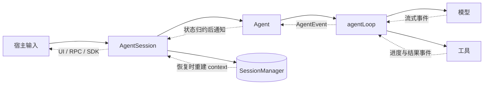

# Pi Agent Harness 知识地图

> [!summary] 本目录的主线
> Pi 用 `pi-ai` 统一模型协议，用 `agentLoop` 推进一次运行，用 `Agent` 保存跨运行状态，再由 `AgentSession`、`SessionManager`、资源系统和宿主把它组装成可用的 coding agent。

本文只负责**定义范围、统一术语和导航**。具体机制各自只在一篇专题中完整解释；官方功能说明继续保留在 `official-doc/`，仅维护因重编号产生的交叉链接，不改其内容结构。

---

## 1. 先建立最小运行模型

最小 agent loop 只有四个动作：调用模型、读取工具请求、执行工具、把结果交回模型。

```javascript
const messages = [userMessage]

while (true) {
  const assistant = await callModel(messages)
  messages.push(assistant)

  const calls = getToolCalls(assistant)
  if (calls.length === 0) break

  const results = await executeTools(calls)
  messages.push(...results)
}
```

Pi 的工程化工作不是改变这条骨架，而是把骨架周围的责任分层：

- provider 差异由模型协议层吸收；
- 当前运行的循环与跨运行状态分开；
- 工具调用经过统一管道；
- finalized message 与实时事件分开；
- session 持久化、压缩、资源发现和 UI 留在产品层；
- Extension 通过受支持的注册面和生命周期点接入，而不是把功能硬编码进 loop。

---

## 2. 六个术语必须分开

### 2.1 Agent harness

围绕无状态大模型建立的运行时系统。它负责保存上下文、反复调用模型、执行工具、处理结果，并把过程交给 UI、持久化与扩展。

### 2.2 `context`

某一次模型请求使用的材料：system prompt、消息和可用工具。它不等于 **context window**；后者是模型可接收的 token 容量。

### 2.3 `loop turn`

一次 LLM 调用，以及这条 assistant 回复所请求的一批 tool call。一个 turn 可以没有工具，也可以有多个工具。

### 2.4 `agent run`

从 `agent_start` 到 `agent_end` 的一次连续循环执行。一个 run 可以包含多个 loop turn。

### 2.5 session

跨多次运行保存的长期会话。Pi 产品层用会话树和 JSONL entry 保存事实；一次用户 prompt 也可能因为 retry 或 compaction 产生多个 agent run。

### 2.6 runtime

本目录不把 runtime 当成一个无边界的泛称：

- **产品运行层**：`pi-coding-agent` 及其 `AgentSession`、会话、资源和恢复策略；
- **`AgentSessionRuntime`**：产品运行层里的具体调度对象；
- **执行环境**：进程实际拥有的文件、网络和 shell 权限。

物理 sandbox 属于执行环境，不等于产品运行层，也不等于工具 hook。

---

## 3. Pi 主链的包含关系

```text
宿主入口（Interactive / Print / JSON / RPC / SDK）
└── AgentSessionRuntime〔需要多 session 调度时〕
    └── AgentSession〔产品 API、资源与恢复策略〕
        ├── SessionManager / ResourceLoader / ExtensionRunner
        └── Agent〔跨 run 的内存状态与生命周期〕
            └── agentLoop〔单次 run 的控制流〕
                ├── StreamFunction → Models → Provider → LLM
                └── tool execution → 文件 / 进程 / 网络
```

这是一条**包含与调用关系**，不是一组平级模块。完整静态边界见 [[01-Pi-自上而下整体架构]]。

---

## 4. 三条同时发生的流



- **控制流向内**：宿主 → `AgentSession` → `Agent` → `agentLoop` → 模型或工具。
- **事件流向外**：模型与工具 → `AgentEvent` → `Agent` 状态归约 → 产品订阅者。
- **状态流跨运行**：finalized message/entry → `SessionManager` → 恢复或压缩后的 context 投影。

动态先后顺序只在 [[02-Agent-Loop-模块交互]] 中展开。

---

## 5. 根目录笔记的唯一职责

### 00 · 本文：知识地图

只回答“有哪些概念、各篇读什么、从哪里下钻”。不再承担源码细节或跨产品机制百科。

### 01 · [[01-Pi-自上而下整体架构]]

只回答“系统分几层、对象怎样嵌套、状态归谁、边界在哪里”。这是静态架构篇。

### 02 · [[02-Agent-Loop-模块交互]]

只回答“一条 prompt 从进入 `AgentSession` 到最终收束，按什么顺序发生”。这是动态时序篇。

### 03 · [[03-agentLoop-无状态循环引擎]]

只解释单次 `agent run` 的控制流、双层循环、消息转换、模型调用和停止判断。

### 04 · [[04-tool-execution-三阶段管道]]

只解释 tool call 的 `prepare → execute → finalize`、批调度、结果顺序、错误与取消。

### 05 · [[05-Agent-有状态运行时外壳]]

只解释 `Agent` 的跨运行内存状态、事件归约、listener、互斥、idle 与 abort。

### 06 · [[06-pi-设计艺术-全书精要]]

只回答“Pi 为什么采用这些边界与取舍”，并保留原书章节索引。它不是第二份源码手册。

### `_Pi笔记写作规范`

[[_Pi笔记写作规范]] 是本目录的编辑规范，不属于学习主线。

---

## 6. 推荐阅读顺序

### 第一次建立整体模型

1. 本文：统一术语和范围；
2. [[01-Pi-自上而下整体架构]]：建立空间结构；
3. [[02-Agent-Loop-模块交互]]：建立时间结构；
4. [[03-agentLoop-无状态循环引擎]]：理解循环；
5. [[04-tool-execution-三阶段管道]]：理解副作用；
6. [[05-Agent-有状态运行时外壳]]：理解状态与完成语义；
7. [[06-pi-设计艺术-全书精要]]：回看设计取舍。

### 按任务查询

- 使用 Pi、配置 provider、快捷键或平台：从 [[official-doc/00-Pi-概述与文档导航]] 进入。
- session 与 compaction：读 [[official-doc/06-Sessions-会话树]]、[[official-doc/07-Compaction-上下文压缩]] 和 [[official-doc/15-Session-文件格式]]。
- Extension 与 Skill：读 [[official-doc/08-Extensions-扩展编写]]、[[official-doc/09-Skills-按需技能]]。
- SDK、RPC 与 JSON 事件：读 [[official-doc/16-SDK-嵌入-Node-应用]]、[[official-doc/17-RPC-模式]]、[[official-doc/18-JSON-事件流]]。
- 跨 harness 比较：读 [[study-notes/AI/harness-engineering/claude-code/Claude_Code-Harness_Engineering]] 与 [[study-notes/AI/harness-engineering/harness-survey-etclovg/00-Survey总览-ETCLOVG七层框架]]；不要把其中的 Claude Code 机制当成 Pi 当前实现。

---

## 7. 五个高频边界

1. **包不等于对象**：`pi-agent-core` 是包，`Agent` 是类，`agentLoop` 是函数。
2. **事件不等于消息**：事件描述过程；finalized message 才进入 transcript，并可被产品层持久化。
3. **工具边界不等于 sandbox**：schema 与 hook 能决定是否调用 `execute()`，不能限制同进程代码的 OS 权限。
4. **`agent_end` 不等于整条用户请求已经收束**：产品层仍可能做 retry、compaction 或 continuation。
5. **“无状态 loop”不等于运行时没有局部变量**：它表示 loop 不拥有跨 run 的长期状态或 session 存储。

实际排错时使用 [[01-Pi-自上而下整体架构#10. 调试定位法|01-Pi-自上而下整体架构 §10「调试定位法」]]，避免在知识地图里维护第二份诊断清单。

---

## 8. 基线说明

- 03–05 的核心机制以各篇声明的 `earendil-works/pi` commit 为准。
- 01 与 06 的较高层架构和设计判断来自 `pi-book` 书稿快照；数量级与实验性接口不视为稳定 API。
- `official-doc/` 是功能与使用参考，本目录根部笔记负责概念与源码边界；两者不重复展开。
