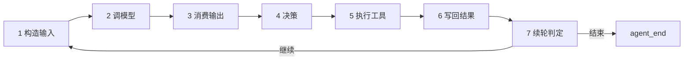
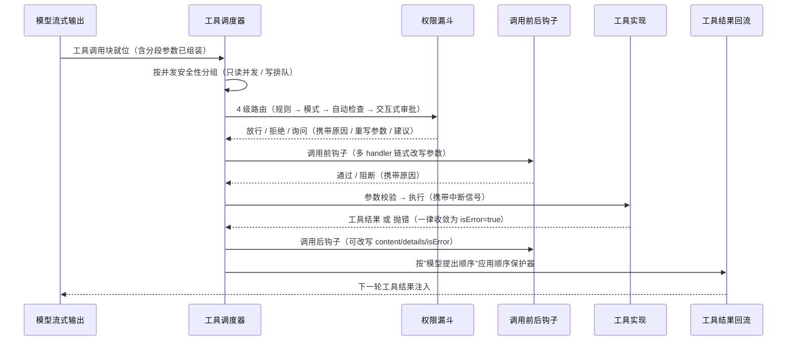
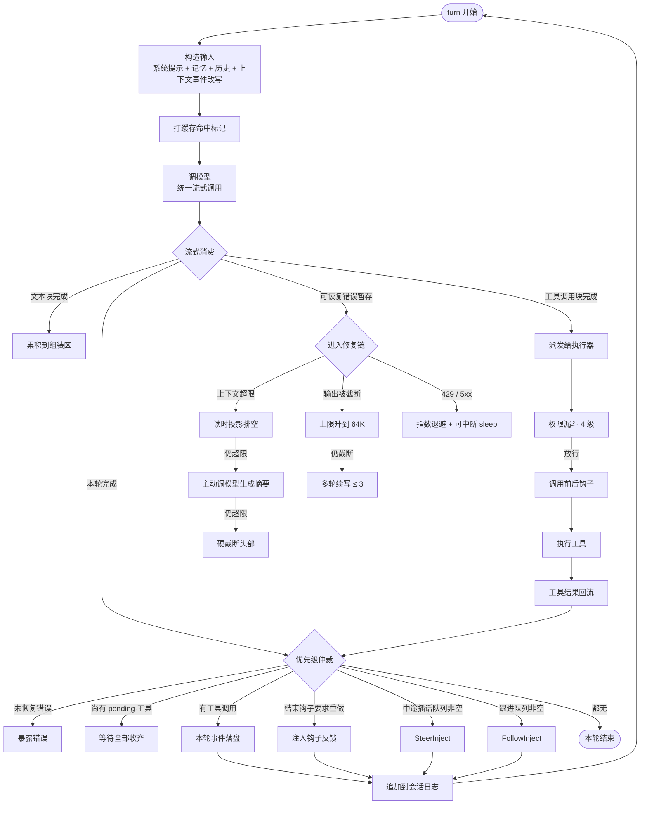
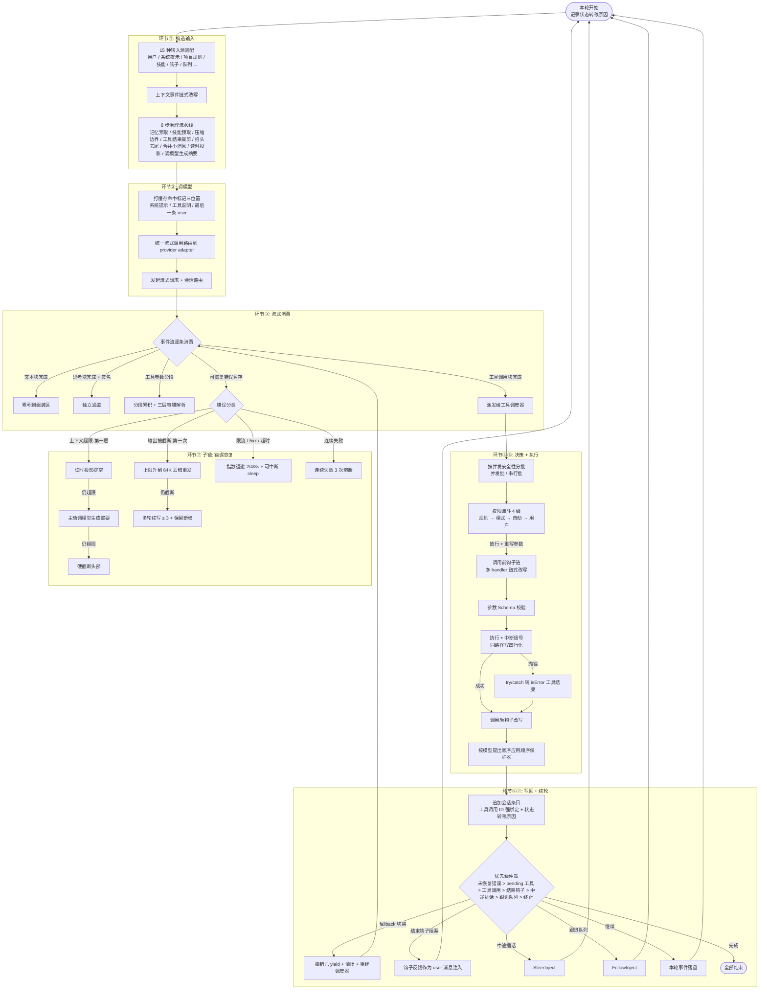
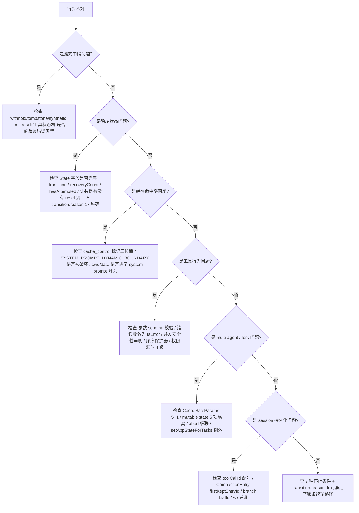

# Agent Harness 知识全景图

> 本图沿 Agent Loop 心跳的每一个环节做"工程演化考古"——从最朴素的几行 while 循环，到 Claude Code / Pi 这种工业级 harness，每一步严谨化都标明"为什么这么做"。

## § 0 Agent Loop 心跳骨架

**最朴素的 8 行 while 伪代码**（这是一切演化的起点）：

```javascript
const messages = [systemPrompt, userInput]
while (true) {
  const reply = await callLLM(messages)         // ② 调模型
  messages.push(reply)                          // ⑥ 写回
  if (!reply.toolCalls) break                   // ⑦ 决定续轮
  const results = await runTools(reply.toolCalls) // ⑤ 执行工具
  messages.push(...results)                     // ⑥ 写回
}
```

七个环节自然嵌在一个函数体里——但工业级 harness 把每一步都做成显式状态机。



**核心结论**：朴素 while 在 toy 阶段能跑，但任何一项真实需求（中断、压缩、并发工具、错误恢复、可观测性、扩展点）都会把它逼成一个**显式的多层状态机**。Pi 的 `runLoop()` 和 Claude Code（以下简称 CC）的 `queryLoop` 在外层骨架上仍是 `while (true)`，但内层多出 8–15 个机制守住 5 个不变量（见 [[#§ 14 五大不变量 I1-I5]]）。

**两个心智锚点**：
- 状态机的状态字段必须**可枚举、可断言、可序列化**——见 [[#§ 7 跨环节 · State Machine]]
- 心跳的每个边界都要 emit 事件让外部世界订阅——见 [[#§ 6 环节⑦ 决定续轮 + 错误恢复]]

---

## § 0.1 概念辨析：agent / runtime / agentLoop / 基础设施模块

**为什么容易混淆**：讨论、博客、源码里这四个词常被混着用——有人说"agent loop 调 LLM"，有人说"runtime 调 LLM"，有人说"LLM client 调 LLM"。三句话对的是同一件事的不同抽象层，但平铺在一起会让人误以为它们是并列模块。

### 层级关系：包含，不是并列

从外到内：

```
agent（整个进程 / 系统）
  └── runtime（agent 的执行环境，提供所有运行时设施）
        ├── 基础设施模块（被动）
        │     ├── LLM client          ← SDK 封装、认证、重试
        │     ├── tool registry       ← 工具元数据
        │     ├── tool executor       ← 执行单个工具调用
        │     ├── context store       ← 存对话历史
        │     └── observability hook  ← 日志、trace
        │
        └── agentLoop（主动循环，串起所有基础设施）
              while not done:
                  response = LLM_client.call(context)        ← 调模型在这
                  if is_final(response): break
                  result = tool_executor.run(response.tool_call)
                  context_store.append(result)
```

### 三个层级的分工

| 层 | 性质 | 职责 | 类比 |
|---|---|---|---|
| **runtime** | 全部基础设施 + agentLoop | 提供 agent 跑起来需要的全部能力 | JVM / Node.js runtime |
| **基础设施模块** | 被动模块 | 提供单一能力，等待被调用 | HTTP client 库 |
| **agentLoop** | 主动循环 | 决定**何时**用哪个能力，把流程推进起来 | 应用主循环 |

### 不同 framework 的命名对照

概念在每个生态里都存在，只是名字不同——选型时按概念对位即可：

| Framework | runtime 对应物 | agentLoop 对应物 |
|---|---|---|
| LangChain | `AgentExecutor` 周边设施 | `AgentExecutor._call()` 主循环 |
| OpenAI Assistants | Assistants API 服务端 | run 状态机推进 |
| Claude Agent SDK | harness | `query()` 内部循环 |
| smolagents | `CodeAgent` 实例 | `run()` 内的 step 循环 |
| Pi | `AgentSessionRuntime` + `AgentSession` | `agent-loop.ts` 内的 while 循环 |
| Claude Code | query loop 周边设施 | `queryLoop` |

### 关键判断

- runtime 是宿主环境，agentLoop 是宿主里那个不停跑的决策循环
- **agentLoop 包含 Model 调用**——它是 loop 体的核心步骤；LLM client 是这一步的执行者
- LLM 调用既属于 agentLoop（作为 loop 的一步）也属于 LLM client（作为模块的功能）——前者是"何时调"，后者是"怎么调"
- 基础设施模块是被动的：tool executor 不会自己决定执行什么工具，context store 不会自己决定写入什么。**真正"按下按钮"的是 agentLoop**
- "agent 怎么工作"描述的是 agentLoop；"agent 部署在哪、依赖什么"描述的是 runtime
- 本文档 §0 心跳骨架里的 8 行 while 伪代码就是 agentLoop 的最小形态；§1–§7 七个环节谈的都是 runtime 内部基础设施模块对 agentLoop 的支撑细节——比如 §2 调模型谈的是 LLM client 模块如何演化、§4 决策+执行工具谈的是 tool executor 模块如何演化

### 与 T 层协议的衔接

[[02-T-工具接口与协议]] 用 *integration boundary* 给协议分类时，function calling 落在 "Model ↔ Function" 边界——这条边界恰好就在 **agentLoop 与 LLM client 之间**：

- LLM 通过 function calling 协议输出结构化指令（JSON）
- agentLoop 收到指令后用 tool executor 真正执行
- MCP / OpenAPI / A2A / AGENTS.md 则跨在 runtime 与外部实体之间，属于 runtime 边界协议

function calling 看似在 agent 内部的原因正是这条：它连接的是 LLM client 和 agentLoop 这两个 runtime 内部组件，没有跨出 runtime 边界。

---

## § 1 环节① 构造输入

**根本问题**：模型每次只能看到一份 messages 数组，但真实需求里"输入"包含至少 15 种来源（用户、CLAUDE.md、tool result、hook、扩展、slash command…），且各自语义、生命周期、缓存策略完全不同。

**最朴素做法**：把所有要送给模型的东西按时序拼成一个 user message 数组，user 提交什么就直接拼上去——一个 context window 当成无差别 chat history 仓库用。

### 朴素做法暴露的失败

1. **所有输入当 user message 平铺**：用户指令、@file 注入、CLAUDE.md、tool result、hook 报错全混在 user content 里 → 模型无法区分谁在说话；prompt injection 防线消失；CLAUDE.md 每轮原样重发，token 成本爆炸；slash command 不展开，模型直接看到 `/compact` 当普通文本回答"好的"。
2. **system prompt 写成一段 hardcode 字符串**：cwd 切换、todo 更新、skill 增删任何变化都让整段 system prompt 变化，prompt cache 全失效，每轮成本飙 10 倍。
3. **context = messages 数组，没有扩展插点**：plan-mode 注入下一轮 plan 没地方塞；todo 状态注入 context 不可能；用户只能整段替换 prompt 或忍受默认。
4. **tool result 和 user message 共用 role**：模型把 system-reminder 当用户在抱怨，把 hook 报错当 tool 自己抱怨，错误归因导致死循环。

### 所有输入源（覆盖 15 种来源）

| 输入源 | 触发来源 | 装入方式 | 为什么需要 | Pi 实现位置 | CC 章节 |
|---|---|---|---|---|---|
| User message | 人类输入 | role=user 的 Message | 用户意图的入口锚点 | `agent-session.ts:1076-1084` userContent | CC §2.1 |
| System prompt | 控制平面装配 | API 的 system 字段 | API 层最高权威，规则独立通道 | `core/system-prompt.ts:28` buildSystemPrompt | CC §2.2-2.5 |
| 上一轮 assistant + tool result | agent loop 上一轮产物 | messages 数组保留 | 跨轮记忆载体 | `agent.state.messages` | CC §3.2-3.3 |
| Slash command 展开 | `/` 开头的输入 | 客户端拦截 → extension command / skill / template 三路 | harness 控制流不让模型看见 | `agent-session.ts:987` _tryExecuteExtensionCommand | TUI 层 |
| @file 附件 | CLI 启动参数 | `<file name="...">content</file>` XML 标签 | 来源声明，区分粘贴 vs 文件 | `cli/file-processor.ts:24` processFileArguments | 未单独 |
| Environment context | cwd/date/OS/git | system prompt 末尾 append | agent 在世界中的位置，放末尾保 cache | `core/system-prompt.ts:42-46` | CC §2.5 env_info |
| Memory / CLAUDE.md | 4 层文件加载 | `<system-reminder>` 包裹的首条 user message + isMeta 标记 | 团队/项目长期指令分层维护 | `resource-loader.ts:75` loadProjectContextFiles | CC §5.2-5.3 |
| Skill markdown | inline 列表 + fork 加载 | `<available_skills>` 或 `<skill name=... location=...>` | 按需触发，不预加载内容 | `core/skills.ts:335` formatSkillsForPrompt | CC §8.3 |
| MCP resources | 外部协议 | mcp_instructions section（动态 cacheBreak） | 外部系统状态投影 | N/A（外包给 pi-mcp-adapter） | CC §2.5 |
| Hook injection | 团队配置的 shell 命令 | `<user-prompt-submit-hook>` XML 包裹的 user message | 强制运行而非模型决策 | N/A（Pi 用 extensions） | CC §2.2 第 5 条 |
| System reminder | 系统注入元信息 | `<system-reminder>` XML 标签 | 复用 user 通道 + 标签隔离声明 | Pi 用 role=custom + customType | CC §2.2 §5.2 |
| followUp / steering / nextTurn queue | 轮间注入 | 三种语义对应三种时机 | steer=紧急打断 / followUp=加塞下一轮 / nextTurn=搭便车 | `agent-session.ts:264-268` | CC §3.5 §3.7 暗示 |
| Extension custom message | before_agent_start 事件 | role=custom 的 CustomMessage | 既不是 user 也不是 tool result 的中间态 | `agent-session.ts:1093-1118` | N/A（CC 用 subagent+hook） |
| Context event 改写 | 每次 LLM 调用前 | 链式 messages → messages | API call 边界的细粒度 hook | `extensions/runner.ts:858` emitContext | CC 硬编码在 query loop |
| Error feedback 注入 | PTL/overflow/stop hook blocking | 删错误源 → compact → retry | 错误反馈进入 context 但不污染 | `agent-session.ts:1786` _checkCompaction | CC §3.6 §3.6.3 |

### 上下文治理演化表（13 步）

> 上下文是预算，不是仓库——这是治理的总命题。

| 步 | 触发 | 加上的机制 | 深层理由 | Pi | CC | 不变量 |
|---|---|---|---|---|---|---|
| 1 | 单次 read/bash 一次干爆窗口 | Tool result budget（源头裁剪，read 保头/bash 保尾） | 源头掐才能阻止单次失误打爆，附 actionable next-offset 不丢可继续能力 | `core/tools/truncate.ts` (2000 行 / 50KB / grep 单行 500) | 未单独展开 | I3 |
| 2 | 切点切在 toolResult 上让 API 400 | 永不切 toolResult 的 findValidCutPoints | API 协议硬约束代码化，不是优化 | `compaction.ts:299-337` | §5.6 groupMessagesByApiRound 同构 | I5 |
| 3 | compact 触发时模型无空间写摘要 | Autocompact 阈值预扣 16K reserveTokens | context window 是 input+output 共享的，必须给 compact 自身的 output 留场地 | `compaction.ts:219` shouldCompact | §5.5.1 阈值计算 | I3 |
| 4 | 一刀切固定位置丢失关键决策 | 倒序累加到 keepRecentTokens + 找合法切点 | 近的更值钱（最近工具结果、用户反馈、代码改动） | `compaction.ts:386-448` findCutPoint | §5.4.1 同思路 | I3+I5 |
| 5 | turn 内有 50 次 toolCall 切点必落 turn 中 | Split-turn dual summary（主摘要 + turnPrefix 摘要） | 保留的后半段离开 user 原始诉求不可解读 | `compaction.ts:771-815` | N/A | I3 |
| 6 | 每次 compact 从零生成摘要让保真衰减不可控 | Iterative summary update（在旧摘要上 update） | 把已压缩部分当只读历史，新历史只在新空间压缩，衰减有界 | `compaction.ts:644-719` UPDATE_PROMPT | §5.4 session memory 增量同思路 | I4 |
| 7 | 摘要 LLM 把消息当对话续写 | 序列化 + 图片占位 + toolResult 单条截断到 2K | 包 `<conversation>` 标签 + 独立 system prompt 三重明确切换语义 | `compaction/utils.ts:109` | §5.6 stripImagesFromMessages 同思路 | I3 |
| 8 | 自由摘要漏关键文件路径 | 9 段结构化模板（Goal/Constraints/Progress/Done/InProgress/Blocked/KeyDecisions/NextSteps/CriticalContext） | 摘要真正的用户是下一轮的模型自己，要可执行 checkpoint 不是回忆录 | `compaction.ts:454-485` | §5.5.1 9 部分模板 | I4 |
| 9 | 摘要塞 system 污染缓存 | CompactionSummary role + `<summary>` 标签 → user 注入 | user role 最低代价不破坏配对，标签让模型语义识别 | `messages.ts:11-24` PREFIX/SUFFIX | §5.6 prependUserContext 同构 | I5 |
| 10 | 子目录规则丢失 / 跨项目偏好需复制 | AGENTS.md/CLAUDE.md 多层级祖先目录冒泡 | 团队规则放根、模块规则放子、个人偏好放 ~，三层共存 | `resource-loader.ts:75` | §5.2 四层（多 Managed/Local） | I2 |
| 11 | date/cwd 放 system prompt 开头让 cache 命中归零 | 静态在前、动态在后的装配顺序 | Anthropic prompt caching 按前缀匹配，变化部分只影响尾部 | `system-prompt.ts:53-81` | §2.5 SYSTEM_PROMPT_DYNAMIC_BOUNDARY | I1 |
| 12 | provider 不知道在哪缓存 | cache_control 显式标记三个位置（system / tools / 最后 user msg） | 三个稳定层级对应三种生命周期 | `custom-provider-anthropic` 示例 | §2.5 section 级 cacheBreak | I1 |
| 13 | fork 子分支被遗弃丢失"探索过的负知识" | Branch summary（带 `<branch_summary>` 标签） | 负知识比正知识更值钱——下次不再走同样错路 | `branch-summarization.ts:283` | N/A（CC 在 subagent 章覆盖） | I4 |

**工业版终点**：上下文治理是分层防线。最里层（工具层）就把单次输出裁到 KB 级；中层（compact 算法）按 token 预算倒序确定切点落在合法 turn 边界；外层（摘要生成）用 9 段结构化模板强制 checkpoint 语义且在已有摘要上 update 而非重写让保真衰减有界；最外层（system prompt 装配 + cache_control）保证缓存前缀稳定让重复请求按 1/10 价格走。

**关键判断**：
- model context 不是一个 messages 数组，而是一个**多通道装配区**——每通道有自己的 role/位置/优先级/缓存策略
- user message 常常是最薄的那块；真正决定模型行为的是 system prompt（控制平面）、CLAUDE.md（团队宪法）、tool result（环境反馈）这三大块
- slash command 必须在客户端展开成正常 user text 后再送给模型——`/compact /resume` 属于 harness 控制流，根本不能让模型看到原文
- 系统注入的内容必须用显式标签（`<system-reminder>` / `<file name>` / `<project_instructions path>` / `<skill location>`）声明来源
- CLAUDE.md/memory 不进 system 字段，而是作为"第一条 user message + system-reminder 标签 + isMeta 标记"注入——既保持持久又避免摘要浪费 token
- Pi 没有 system-reminder/MEMORY 机制，但把"扩展可插入的点"做成一等公民（context/before_agent_start/resources_discover 事件）——CC 把这些硬编码在 query loop，Pi 把治理决策开放给 extensions

---

## § 2 环节② 调模型

**根本问题**：agent loop 只关心"流式生成 AssistantMessage 事件"，不该被 14+ 家 provider 的协议差异和经济性（cache / max_tokens / 重试）污染。

**最朴素做法**：直接调一次 provider SDK 的 chat completion，await 拿到字符串回复，拼回历史送下一轮。错就 throw 让上层 try/catch。

### 朴素做法暴露的失败

1. **SDK 当黑盒 await**：一次性等完整 AssistantMessage 才能 yield → TTFT 高、UI 几秒空白、并行工具时间重叠彻底做不了
2. **只支持一家 provider**：换模型在 query loop 加 if/else；接 OpenRouter/Bedrock/Vertex/Fireworks 都要 patch
3. **每轮完整 system prompt + 历史一字不差发出去**：输入 token 成本线性涨，长 session 几万 token 全价
4. **max_tokens 写死 8192 或 64000**：保守值 1% 真长回答被截断且没救；激进值 99% 短回答都占 64K 调度槽位
5. **输出截断直接报错或断处接着写**：用户看到半句话+错误，下一轮模型完全不知写到哪
6. **首选模型超时直接抛错把 partial 留在 UI**：用户看到两段拼接的话对不上
7. **所有错误一视同仁 sleep(1000) 重试**：context overflow（413）永远重发永远失败；429 反被反复戳被进一步惩罚
8. **服务端 Retry-After 说 10 分钟时盲目 sleep**：agent 卡死 10 分钟用户以为挂了

### 调模型演化表（8 步）

| 步 | 触发的失败 | 加上的机制 | 深层理由 | Pi | CC | 不变量 |
|---|---|---|---|---|---|---|
| 1 | 只支持一家 SDK | Provider adapter 抽象 `StreamFunction<TApi, TOptions>` + registerApiProvider 注册表 | agent loop 只持有 `stream(model, context, options)` 一个函数指针；compat 字段把同协议方言差异压在 adapter 层 | `packages/ai/src/stream.ts` + 14+ providers | 单一 Anthropic+Bedrock+Vertex 几条线 | I1 |
| 2 | await 整段返回延迟不可接受 | stream=true 流式协议（AssistantMessageEventStream，start / *_delta / *_end / done / error） | 流式不是性能优化是控制流前置：工具能在模型还说话时启动、用户能中段按 Esc、可恢复错误能在事件流内检测 | `event-stream.ts` + `anthropic.ts:518` | §3.4 同构 | I2 |
| 3 | 长 session 输入按全价 + 多副本 cache miss | cache_control 标记三位置（system / tools / 最后 user msg）+ sessionId header 路由 | Anthropic 命中 cache 输入价压到 1/10，sessionId 让 provider 把同 session 请求路由到同副本 | `anthropic.ts:44-67` resolveCacheRetention | §2.5 section 级 + boundary | I1 |
| 4 | 8K 截断 / 64K 浪费 / 截断处直接报错 | max_output_tokens 三层递进恢复：8K → 64K escalate → 多轮 recovery（限 3 次） | 对应三种失败假设：上限太保守、任务确实大、真的太长；recovery prompt 每句话都反制模型默认行为 | N/A（Pi 用静态 model.maxTokens） | §3.6.2 三层递进 | — |
| 5 | 错误一出现立刻 yield 让 SDK 断开 | Withhold 机制（PTL / 媒体 / max_output_tokens 先扣住） | yield = AsyncGenerator 对外承诺，withhold 让内部恢复链先跑；恢复成功 → 外层无感 | N/A（Pi 是 post-stream 重试） | §3.4.2 四 withheld 分支 | I5 |
| 6 | fallback 切换让 UI 出现两段对不上的话 | Tombstone 协议（撤销已 yield + 清场 + 重建 executor） | 流式 yield 默认 append-only 收不回，tombstone 是显式撤销协议 | N/A（Pi 无 streaming fallback） | §3.4 query.ts:712-740 | I5 |
| 7 | 所有错误一视同仁退避 | 错误分类决策树（overflow → compact / 限流终结 → 不重试 / 可重试瞬态 → 退避 / max_output → 升上限） | overflow 重发必败要先改输入；429/5xx 重发可能成；billing 重试无意义 | `_isRetryableError` + 21 条 overflow 正则 | §3.6.1 PTL 三层修复 | I3 |
| 8 | 服务端要等 10 分钟时盲目 sleep | 指数退避 + Retry-After 协商 + maxRetryDelayMs 兜底 + abortable sleep | 退避是给 provider 冷静期；Retry-After 比本地公式准但要 cap 防卡死；abort signal 贯穿 sleep 保证 Esc 不被吞 | `_prepareRetry` 2s/4s/8s | SDK 客户端层 maxRetries | I3 |

**工业版终点**：调模型环节长成三层结构——(a) Provider adapter 把 N 家 API 抽象成统一 StreamFunction，换 provider 不动 agent 代码；(b) 流式事件协议让 agent loop 在生成期间就能并行启动工具、扣住可恢复错误、撤销已 yield 内容；(c) 错误分类决策树把 overflow → 走 compact、429/5xx → 内部重试用户无感、max_output → 升上限后续写、Retry-After → 解析但 cap 拒绝长等。配合 prompt cache 把长 session 输入成本压到全价 1/10。

**关键判断**：
- 调模型阶段的核心抽象是 **StreamFunction，不是 ChatCompletion**——返回 `AssistantMessageEventStream` 而不是 `Promise<Message>`
- cache_control 不是优化是经济性的前提——没有这层 agent 模式根本不具备商业可行性
- max_tokens 不是配置项是经济策略——8K + 64K + 多轮续写对应"99% 短回答最便宜 / 1% 长回答能完成 / 极端长任务能拆"
- tombstone 存在的全部理由是 UI 已经看到了 partial 消息——非流式 await 根本不需要 tombstone
- 错误恢复的根本分叉是"重发会不会同样失败"
- Pi 没有 max_output_tokens escalation、tombstone、withhold——通用 agent 库把这些决策让给上层 harness

---

## § 3 环节③ 消费输出

**根本问题**：模型输出是 SSE 字节流，但下游需要"已经完成了一件事"的语义事件（一段 text 完成、一个 tool_use 就绪、一段 thinking 完整）来做决策。

**最朴素做法**：调一次 API，await 完整 assistant message，顺序扫描 content blocks，遇到 tool_use 就执行，全部跑完回主循环。请求-响应思维。

### 朴素做法暴露的失败

1. **首 token 到首工具的延迟拉满**：模型说出 tool_use 那一刻就可以并发拉起 Read，但等模型把后面解释文本也吐完才执行
2. **中断粒度只有"整轮"**：用户按 Esc 时要么这轮全跑完中断不掉，要么完全没开始也没什么可中断
3. **工具参数累积不是原生 JSON**：Anthropic API 的 tool_use input 按 partial_json_delta 一段段流来，朴素等 content_block_stop 一次 JSON.parse，中途想读 args 做不到
4. **可恢复错误被当致命错误**：PTL（413）作为流的第一条消息、max_output_tokens 作为最后一条，直接把流的消息往外吐 UI 先看到错误就断开
5. **fallback 模型回退时上下文撕裂**：首选模型已吐半截给 UI 故障切到 fallback，要么拼起来语义乱要么让用户感知到切换
6. **thinking blocks 与 text blocks 没区分**：朴素流消费把所有 delta 当文本拼接，thinking 内容混进了最终回答

### 流式消费演化表（10 步）

| 步 | 触发的失败 | 加上的机制 | 深层理由 | Pi | CC | 不变量 |
|---|---|---|---|---|---|---|
| 1 | 朴素 await 整段，无 block 边界 | ContentBlock 增量协议（content_block_start / _delta / _stop） | block 是协议层最小语义单元；所有 mid-stream 决策建立在"某 block 已 stop"事件上 | `anthropic.ts:525-681` | §3.4 同构 | I1 |
| 2 | thinking 与 text 混淆 | 按 block type 分派状态机（text/thinking/tool_use 各自有 partial 累积器） | 三种语义完全不同必须早期分流，否则在事后字符串解析里争抢无解 | `anthropic.ts:538-579` | §3.4 区分 type | I2 |
| 3 | tool_use input 等 stop 才能 parse | input_json_delta 流式累积 + 每步 partial parse（三层降级） | mid-stream 让 args 持续可用；调用方拿到的 arguments 始终是有效对象 | `json-parse.ts:104-124` | §3.4 隐含 StreamingToolExecutor 依赖 | I3 |
| 4 | 工具与模型输出严格串行 | StreamingToolExecutor：tool_use 一就位就 dispatch | 让工具执行与模型输出在时间上重叠——把"工具调用"从批处理变成带生命周期的状态机 | N/A（Pi stream 结束才 executeToolCalls） | §3.4.1 StreamingToolExecutor.ts | I4 |
| 5 | 中断只能粗暴 abort 整 batch | 工具状态机 queued/executing/completed/aborted 四态显式追踪 | 状态机是中断和恢复的前置——每个状态分别处理生成 synthetic result | N/A（Pi 只有 promise + signal.aborted） | §3.4.1 §3.5 | I1+I4 |
| 6 | 可恢复错误一 yield 就让外层断连 | Withhold 暂存：流式阶段拦截 PTL / 媒体 / max_output | yield = AsyncGenerator 对外承诺，withhold 让内部修复链有时间跑 | Partial（Pi post-stream 在 `_checkCompaction` 清理） | §3.4.2 query.ts:799-822 | I5 |
| 7 | 用户按 Esc 留下 tool_use 没配对 result | 中断时补齐 synthetic tool_result | 协议级不变量"系统向外承诺了一段执行就要在中断时把账补平" | Partial（Pi 用 message-level aborted） | §3.5 query.ts:1011 | I5+I1 |
| 8 | fallback 让 UI 出现脏内容 | Tombstone 撤销 + 清场 + 重建 executor | yield 默认 append-only，tombstone 是协议层的显式撤销 | N/A | §3.4 query.ts:712-740 | I5 |
| 9 | extended thinking 大于最终回答首屏空白 | Thinking blocks 与 partial message 的实时镜像 | thinking 是协议层一等公民不是特殊 text——独立通道支持折叠/计费/重放签名 | `anthropic.ts:547-565` | §3.4 间接提及 | I2 |
| 10 | 每个消费者各自实现累积逻辑 | Partial AssistantMessage 镜像（每个事件带当前完整快照） | 增量 vs 全量交给消费者选；provider 端只维护一份真相 | `types.ts:354-363` partial 字段 | yield 完整 AssistantMessage 同思路 | I2+I5 |

**工业版终点**：流式消费的最终样子不是"更快的请求-响应"，而是一套带显式时序与状态的控制平面——按 block 切片、三类 block 分通道、tool_use 一就位就 dispatch、流式阶段就 withhold 可恢复错误、中断与 fallback 是协议一等公民、每事件带 partial 快照。Pi 实现了 (1)(2)(3 partial)(6)，但在 withhold/synthetic/tombstone 上选择简化模型——能跑、扩展性好，但失去了 CC 把"流式作为控制流结构"的全部威力。

**关键判断**：
- 流式不是性能优化是控制流结构——把"整轮"原子操作拆成 block 级、tool 级、event 级的细粒度可决策单元
- `content_block_stop` 是协议的关键时刻不是 `message_stop`
- tool_use input 必须 mid-stream 可 parse（partial JSON），否则退化成 post-stream 顺序执行——这是 CC StreamingToolExecutor 与 Pi 串行执行的本质差异
- Withhold 是 yield 语义的反向用法
- Tombstone 是流式协议的"撤销"语义
- Pi 与 CC 根本分歧不在能力而在"流式作为协议层抽象 vs 内部实现细节"——前者上限更高，后者扩展性更好

---

## § 4 环节④⑤ 决策 + 执行工具

**根本问题**：工具不是函数，是动作。一旦工具接触真实世界（写文件、跑 shell、调远程 API），错误就不再是返回值层面的事而是状态破坏；agent 还要保证并发安全、权限治理、中断恢复、扩展可插。

**最朴素做法**：把模型生成的 tool_use 直接 `tools[name](args)` 同步调用，execute 抛错就让异常冒泡。所有工具一律并发（或一律串行）。Bash 直接 `child_process.exec()`。read/write 信任传入路径不检查。按 Ctrl+C 直接 `process.exit()`。

### 朴素做法暴露的失败

1. **tool schema 不校验，模型胡乱填字段直接进 execute** → TypeError 崩溃 / 类型错误把 number 当 string 拼 shell
2. **execute 抛异常未捕获冒泡到 agent loop** → 一次 ENOENT 杀掉整条 query loop，会话进入半死状态
3. **所有工具一律并发或一律串行** → 并发：Edit/Write 同文件覆盖产生半截内容；串行：Read 三个文件 1 秒能完成却排成 3 秒
4. **contextModifier 按完成顺序应用** → 同样输入 IO 抖动让下游"已读文件列表"不一样，bug 不可复现
5. **权限只有 allow/deny 两态** → 系统被迫替用户拍板，没有"我也不知道，问你"的出口
6. **没有 before/after hook** → 审计/改写/外挂策略无处插，扩展只能 fork 源码
7. **中断时直接丢 in-flight tool_use** → 下一轮 tool_use 没 tool_result 配对 API 直接 400
8. **Bash 工具放出去靠模型自觉** → 把 `rm -rf` 藏在 `find -exec` 里、用 `git push --force` 覆盖 main、用 `git add -A` 提交 .env
9. **read/write 工具不限路径** → 读 `../../../etc/passwd` / `~/.ssh/id_rsa` / `~/.aws/credentials`
10. **tool 不支持 abort 信号** → Esc 后 30 秒还在跑长 grep；子进程会成孤儿持续占 CPU

### 工具调用链路时序图



### 工具系统演化表（11 步）

| 步 | 触发的失败 | 加上的机制 | 深层理由 | Pi | CC | 不变量 |
|---|---|---|---|---|---|---|
| 1 | schema 不校验模型胡乱填 | Tool Registry + TypeBox Schema 静态校验 | schema 既给模型看（拼进 system prompt）又给 runtime 用，单一源；失败信息要写给模型读 | `core/tools/*.ts` + `validation.ts:292` validateToolArguments | §4.3 前置校验 | I3 |
| 2 | execute 抛异常杀 loop | 错误收敛为 isError ToolResult（三阶段 try/catch 全转 createErrorToolResult） | tool 错误应是模型的输入而不是 runtime 的异常——模型读到"刚才命令失败原因是 X"反而能自己修 | `agent-loop.ts:619-625/656-662/697-700` | §4.3 同思路 | I1+I3 |
| 3 | 一律并发或一律串行 | Tool 按并发安全性分批调度（partitionToolCalls） | 并发安全性是工具本身的语义属性应由工具自己声明 | `executionMode: sequential/parallel` Pi 一票否决 | `partitionToolCalls()` CC 更精细 | I3+I4 |
| 4 | IO 抖动让 contextModifier 顺序错乱 | contextModifier 按"模型提出顺序"回放（不按完成顺序） | 并发的是 IO，排序保护的是状态；函数复合不满足交换律必须有标准序 | N/A（Pi 无 contextModifier 抽象） | `toolOrchestration.ts:19-63` queuedContextModifiers | I4 |
| 5 | 同文件 Edit+Write 并发覆盖 | withFileMutationQueue 按 realpath 串行化写操作 | 比整工具标 sequential 牺牲并发度小；realpath 避免符号链接绕过锁 | `file-mutation-queue.ts:32` | 概念等价 | I4 |
| 6 | 权限只有 allow/deny 两态 | Permission 三态系统（allow/deny/ask）+ 4 级路由漏斗（Rules → Mode → Auto → User） | ask 承认"系统不该替用户做决定"；discriminated union 让 deny 强制带 reason、allow 带 updatedInput、ask 带 message+suggestions | N/A（Pi 只有 allowedToolNames 静态白名单） | §4.4 useCanUseTool + §4.5 PermissionResult | I5 |
| 7 | 没 hook 扩展无法审计/改写 | beforeToolCall / afterToolCall hook pipeline（block / rewrite / mutate-in-place） | 扩展不应改源码；mutate in place 让多 hook 自然串成 pipeline | `agent-session.ts:396-444` + `runner.ts:806-827` | §4.3 流水线 | I3+I5 |
| 8 | 中断丢 in-flight tool_use 让 API 400 | Synthetic ToolResult（中断时为缺漏 tool_use 补合成结果） | Anthropic API 硬要求成对；中断是"正常情况"之一应有一等语义而不是异常兜底 | N/A（Pi abort 后直接 break） | §4.6 StreamingToolExecutor sibling_error/user_interrupted/streaming_fallback | I1+I2 |
| 9 | Bash 靠模型自觉藏 rm -rf | Bash 双层防线（Prompt Git Safety Protocol + 运行时 tree-sitter AST 解析按子命令一票否决） | Prompt 让模型生成阶段就避开；运行时 AST 防"藏在长复合命令中"；50 子命令阈值是 CC-643 真实事故经验值 | N/A（Pi 直接 spawn 无解析） | §4.7 BashTool/prompt.ts + bashPermissions.ts | I5+I6 |
| 10 | read/write 不限路径模型读 ~/.ssh | 路径解析与规范化（防 unicode/NFD/curly-quote 变体绕过） | Pi 假设"相信本地 user"故意做 trade-off；CC 用 permission Rules layer 做 path prefix 规则 | `path-utils.ts:48` resolveToCwd（无 sandbox） | §4.4 Rules layer 支持 path 前缀 | I5+I7 |
| 11 | Esc 后子进程仍跑成孤儿 | AbortSignal 端到端传播 + killProcessTree + 队列锁延迟释放 | abort 不是请求停止而是资源回收契约——必须保证停下来后系统状态干净；killProcessTree 因 bash spawn 孙进程 | `bash.ts:89-91` onAbort + killProcessTree；`write.ts:204-210` 不从 abort listener reject | §4.6 中断语义 | I2+I8 |

### 关键判断

- **工具是动作不是函数**——一旦接触真实世界，错误就不再是返回值层面而是状态破坏；schema 校验、isError 收敛、permission 三态、abort 传播、synthetic ToolResult 本质都在守护**真实世界的可追溯性**
- 调度策略 = 并发/串行 + 顺序保障：并发加速的是 IO，排序保护的是状态
- 权限必须有第三态 ask——否则系统被迫替用户拍板；deny 必须带 reason 让模型知道怎么改
- 中断必须有一等语义——CC 用 `interruptBehavior: cancel | block` 区分"能随时停"和"必须跑完"的工具
- Bash 是风险放大器不能享受通用工具待遇——双层防线缺一不可
- 错误收敛是 loop 不死的前提——模型读到"刚才命令失败原因是 X"反而能自我修复
- Pi 当前最大的安全缺口是 Bash 双层防线两层都没有 + 没有 permission 三态系统——把治理决策推给本地 user 信任假设

---

## § 5 环节⑥ 写回结果

**根本问题**：对话历史是 agent 的"记忆 + 审计日志 + 可回放数据"三合一——既要任何时刻崩溃都能 resume，又要支持分支/fork，还要让 compact 这种治理动作不破坏历史。

**最朴素做法**：用一个内存 messages 数组累积对话，进程结束就丢；需要时整份 JSON 写盘——既不可恢复也不可分支。

### 朴素做法暴露的失败

1. **内存数组 messages.push() 持久化对话** → 进程崩溃/重启全部丢失；用户被迫从零重述需求；agent 几小时工作付诸东流
2. **整文件 rewrite 写盘** → 每次写入成本随历史线性增长；大 session 单次保存几秒 IO；写到一半崩溃留下损坏 JSON
3. **没有 entry id / parentId** → 无法 fork/branch，只能整体复制；并发分支无法在同文件并存
4. **没有 entry 类型** → 持久化什么和喂给 LLM 什么混在一起；扩展状态无处附着；compact 边界无法标记
5. **compact 是删除动作** → 历史是事实但被改写；摘要质量差时无法回滚；audit 不全
6. **toolCallId 没强绑定** → 多个并发工具结果乱序到达靠顺序匹配，错配
7. **持久化路径不带 reason** → 错误恢复机制再完善没有 reason 就是黑盒
8. **resume 是事件重放而非状态重建** → 性能差 + 历史一变就 resume 不出

### 持久化演化表（11 步）

| 步 | 触发的失败 | 加上的机制 | 深层理由 | Pi | CC | 不变量 |
|---|---|---|---|---|---|---|
| 0 | 起点 | 内存 messages.push() | prototype 最小可行 | `agent.state.messages` 仍作为临时层 | N/A | — |
| 1 | 内存崩溃即丢 | JSONL append-only 持久化 | append 是文件系统最便宜的写操作（O(1)）；单行损坏只丢一条；JSONL 对 grep/jq/tail 友好；时间戳+uuid 文件名保证多并发无冲突 | `session-manager.ts:860-887` _persist | N/A | I1 |
| 2 | 线性数组无法分支 | entry tree（id / parentId / leafId） | 分支变 O(1) 指针；同文件可并存多路径共享公共祖先；buildSessionContext 只走 leaf→root 一条线 | `session-manager.ts:44-49` SessionEntryBase + `:813-832` _buildIndex | N/A | I2 |
| 3 | 持久化什么和喂 LLM 什么混在一起 | entry 类型化（message/compaction/branch_summary/model_change/thinking_level_change/custom/custom_message/label/session_info） | 解耦持久层和 LLM 上下文层；扩展能 piggyback 自己的状态；按类型重建 thinking level / model | `session-manager.ts:51-147` + `:323-430` buildSessionContext | N/A | I3 |
| 4 | compact 当删除操作丢历史 | CompactionEntry 追加而不删除（firstKeptEntryId / tokensBefore / summary） | compact 是治理动作不是删除；历史是事实不应被改写；万一摘要差用户可把 leaf 回滚到 compaction 之前 | `:67-76` + `:942-962` appendCompaction | N/A | I4 |
| 5 | tool_use ↔ tool_result 配对失效 | toolCallId 强关联保护配对 | Claude API 硬约束；多并发结果乱序到达靠 id 而非顺序匹配；中断时为每个未完成 tool_use 补 synthetic | `agent-session.ts:407/427/642-659` 传递 toolCallId | §3.5 §4.6 配对协议 | I5 |
| 6 | 错误恢复是黑盒 | transition.reason 状态码记录每次状态转移（17 种） | 可观测性的本质是能说清自己经历——运维拿到 session 可重放 reason 序列还原完整故事 | `agent-session.ts:135-140/332/1633/1736/1747/1817` | §3.7 §6.3 transition.reason 17 种码 | — |
| 7 | resume 是事件重放 | session resume：leafId + 树遍历重建上下文 | 重建当前可工作状态而非重放过去事件；thinkingLevel 和 model 从路径上最后一次 change entry 取值；CompactionEntry 按摘要+保留部分重建 | `session-manager.ts:1364-1371/448-474/274-284` | N/A | — |
| 8 | 分支需复制整个历史 | branch / fork / createBranchedSession（指针操作 vs 物化新文件） | 日常分支用指针零成本；需要导出时再物化；parentSession 链路保留可追溯 | `:1193-1198/1238-1330/1385-1436` | N/A | — |
| 9 | schema 演进破坏旧文件 | version 字段 + 迁移函数（v1→v2→v3） | data 一定比 code 活得久；显式 version 让格式可无痛升级；加载时按需触发 | `:28 CURRENT_SESSION_VERSION + :223-289 migrateV*` | N/A | — |
| 10 | bash 执行打断 tool_use/tool_result 配对 | BashExecutionMessage 延迟持久化（队列对齐到 agent 轮次边界） | 写入文件的顺序也必须保持配对；同设计哲学用在 steeringMessages/followUpMessages 队列上 | `agent-session.ts:284 _pendingBashMessages + :2594-2617 recordBashResult` | N/A | I5 延伸到持久化 |

**工业版终点**：会话持久化是 append-only 的事件溯源系统——每条 entry 自描述（type+id+parentId+timestamp）、按行 append 到 JSONL、节点间通过 parentId 形成树。entry 类型化分离消息/元数据/扩展状态/治理动作。所有写入（含 compact、branch、model 切换）都是新增而非修改——只能往前走不能改历史。toolCallId 强绑定保证 tool_use ↔ tool_result 配对不变量。leafId 是廉价指针，移动它即可分支/回放/resume。CompactionEntry 记录摘要+firstKeptEntryId+tokensBefore，buildSessionContext() 根据 leaf 走树时把摘要+保留部分+后续消息重新拼成可继续工作的上下文。

**关键判断**：
- 持久化的本质是**不变量保护**：append-only + entry id/parentId + toolCallId 绑定，三条不变量保证 session 文件任何时刻打开都是合法的可恢复状态
- entry 类型化把"持久化什么"和"喂 LLM 什么"解耦：CustomEntry 不进 context、CustomMessageEntry 进 context、CompactionEntry 同时是边界标记和摘要载体
- leafId 是 O(1) 的分支操作：不复制历史只移动指针；createBranchedSession 才物化为新文件，多数 branch 操作零成本
- compact 不删历史只追加 CompactionEntry+firstKeptEntryId：旧消息物理上还在文件里，buildSessionContext() 在树遍历时按 firstKeptEntryId 跳过；后悔随时可回滚 leaf 到 compaction 之前
- version 字段 + 迁移函数让 v1→v2→v3 数据格式演化不破坏已有文件
- transition.reason（17 种码）让系统"说得清自己做过什么"——这是从"能跑"到"能运维"的分水岭

---

## § 6 环节⑦ 决定续轮 + 错误恢复

**根本问题**：续轮判定不是 if/else 而是**优先级仲裁**——错误恢复、API 不变量、模型自发行为、质量门、用户干预、extension 自请同时存在时，必须有确定的优先级让系统行为可预测、可审计。

**最朴素做法**：每轮模型输出后看 toolCalls：有就执行进入下一轮，没有就 return 退出。单层 while 搞定。

### 朴素做法暴露的失败

1. **toolCalls 空就 return** → UI 中途插话只能等本轮结束才能进下一轮；用户在长任务中按 Enter 输入新指令得等模型把 50 步跑完
2. **外部插话直接 push 到 messages** → 流式阶段 tool_use 没收齐 tool_result 就插 user message 违反 API 不变量，下一轮 400
3. **stop hook 反馈直接重进循环** → 上一轮 PTL → hook 注入反馈 → 重试 → 又 PTL → death spiral，从 100K 滚到 200K
4. **max_output_tokens 截断当普通错误** → 复杂任务永远写不完；用户每次手动说 continue 还得带摘要
5. **PTL 直接 yield 给 UI** → 外层 SDK/CLI 看到错误立刻断连，内部修复链还没启动
6. **autocompact 失败无熔断** → compact 自身 PTL → 重试 → 又 PTL → 无限重试烧光配额
7. **异步事件等模型当前轮结束才注入** → CronCreate 到点但模型在跑 30 秒工具；提醒失去时效性
8. **多源信号没有优先级** → tool calls、steering、followUp、stop hook 同时存在谁先谁后无定义

### 续轮演化表（11 步）

| 步 | 触发的失败 | 加上的机制 | 深层理由 | Pi | CC | 不变量 |
|---|---|---|---|---|---|---|
| 0 | 起点 | toolCalls 空就 return | 符合 OpenAI/Anthropic tool use 最直观语义 | `agent-loop.ts:203-216` | §3.7 表第 1 行 | I1 |
| 1 | 中途插话破坏 tool_use/tool_result 配对 | Steering queue（UI 中途插话排队） | 高优先级 = 用户在场必须尽快响应；但选"当前轮工具跑完→下一轮开始前注入"安全注入点 | `agent.ts:265-267` steer() | §3.5 §3.8 | I2 |
| 2 | extension 抢答让用户体感失控 | FollowUp queue（独立于 steering 的低优先级队列） | 优先级分层：steering 在 inner loop drain，followUp 只在 outer loop 边界 drain | `agent-loop.ts:257-262 + agent-session.ts:932-934` | §3.7 §3.8 | I3 |
| 3 | 模型说做完了实际没过 lint/test | Stop hook 阻塞（hook 反馈注入下一轮） | 把"质量门"和"模型自我判断"解耦——模型不知 CI 标准但 hook 知；hook 通过"假装是用户在催"强制续轮 | N/A | §3.6.3 §3.7 §6.3 hook_stopped | I4 |
| 4 | Stop hook + PTL 死循环 | Death spiral 防护（上一轮 API 错则跳过 stop hook） | hook 的设计前提是"模型给了回复 hook 评估"；没回复时跑只会污染上下文 | N/A | §3.6.3 stop hooks guard | I5 |
| 5 | 定时事件等模型闲下来才告知 | System reminder 注入（异步事件 → 下一轮 user message） | 复用 user message 通道传递系统元信息——不需新 role，模型已被训练识别 `<system-reminder>` | N/A（Pi 用结构化 CustomMessage） | §2.2 §5.2 | I3 |
| 6 | API 错误立刻 yield 让外层断连 | Withheld 错误（PTL/max_output 不立即 yield） | 续轮入口必须在流式阶段就打开；错误检查和正常内容共用同一循环 | N/A（Pi post-stream 在 `_checkCompaction`） | §3.4.2 query.ts:799-822 | I5 |
| 7 | 对话长了 PTL 是常态错误 | PTL 三层修复链（collapse → reactive compact → truncateHead） | 分层=分代价：collapse 最便宜 / compact 中等 / truncate 最贵；每层有明确失败信号触发下层不会跳级 | N/A（Pi 只有单一 `_runAutoCompaction` + `_overflowRecoveryAttempted` 一次性标记） | §3.6.1 §5.6 §6.3 collapse_drain_retry/reactive_compact_retry | I1+I5 |
| 8 | 输出截断当报错 | max_output_tokens 两阶段恢复（escalate + continue） | 第一次截断说明 cap 设小了；64K 还截说明任务大就续写（input 比 output 便宜）；recovery 限 3 次因 thinking 累加挤占 context | N/A | §3.6.2 max_output_tokens_escalate/recovery | I1 |
| 9 | autocompact 反复失败无终止 | Circuit Breaker（连续失败 3 次熔断） | agent 自己不知何时该放弃必须靠外部计数；阈值 3 是经验值；任意成功归零让短暂故障恢复后能继续 | N/A（Pi 只有一次性 boolean） | §5.5.2 | I5 |
| 10 | 信号源太多无优先级 | 多源仲裁的优先级链（withheld → pending tool → toolCalls → stop hook → steering → followUp → 终止） | 优先级编码系统价值观：错误恢复 > API 不变量 > 模型自发 > 质量门 > 用户实时 > extension 自请 > 终止 | `agent-loop.ts:174/253/257-262 + agent-session.ts:940-967` Pi 实现了但只 5 个分支 | §3.7 7 种停止 + §6.3 transition.reason 17 种 | I1+I2+I3+I4+I5 |

### 完整心跳流程图（含错误恢复路径）



**关键判断**：
- 续轮判定是优先级仲裁：withheld 错误 > toolCalls > hook 反馈 > queue
- 外部插话和模型自请下一轮必须**分两个队列**：steering 高优先（用户在场）/ followUp 低优先（agent 自请）
- stop hook 反馈本质是把 hook 输出当 user message 注入——必引入死循环风险必须有 guard
- max_output_tokens 续写比重新生成便宜（thinking 上轮是 output 下轮变 input）但占 context 空间必须有上限
- PTL 修复必须分层：collapse → reactive compact → truncateHead，每层对应一个失败假设不混用
- Circuit breaker 是续轮系统的**反自杀机制**——agent 自己不知何时该放弃必须靠外部计数器强制
- Pi 在续轮判定上做对了基础但没做 PTL 三层、max_output 两阶段、circuit breaker、stop hook guard——这些是 long-running agent 在真实流量下被逼出来的
- 续轮的本质是把"错误是异常分支"变成"错误是主路径上的一种正常 transition"——transition.reason 17 种取值就是这哲学的字面化

---

## § 7 跨环节 · State Machine

**根本问题**：跨迭代要保留的所有状态如果散落在局部变量和闭包里，新增恢复路径就要改循环结构，回归测试无法覆盖每条恢复链。

**最朴素做法**：messages 是循环内局部数组、retry 次数是 let 计数、是否压缩用 boolean、预算上限读全局配置——每加一个恢复路径就在循环里加一个新变量。

### 朴素做法暴露的失败

1. **状态散落分支条件依赖多变量组合** → 代码读不懂、测不动；任何分支写错让 loop 死循环或提前退出
2. **没有 transition 字段** → 测试只能通过检查 messages 内容反推恢复路径有没有触发
3. **autoCompact 和 reactiveCompact 共用布尔** → PTL 时 compact 被重复触发 → 上下文恢复失败 → 又 413 死循环
4. **max-output-tokens 截断无计数器无临时上限** → 模型反复在同一位置截断无限重试
5. **pendingToolUseSummary 用普通 await** → 工具汇总没完下一轮被同步等待阻塞失去流式优势
6. **stopHook 执行期来新消息没标记位** → stop hook 半途被打断 / 新任务和正在收尾的状态混在一起

### State 字段分类与演化（按"历史/预算/恢复/节奏"四类）

| 类别 | 字段 | 触发的失败 | 加上的机制 | 深层理由 | Pi | CC | 不变量 |
|---|---|---|---|---|---|---|---|
| — | type State | 状态散落不可读 | 把状态从局部变量提取成显式 State type | 承认 agent loop 是 state machine 而非流水线；强制设计者面对完整状态空间 | `AgentState` 9 字段 + `AgentHarnessTurnState` | `type State` 10 字段（query.ts:204） | I3 |
| 历史 | messages + transition | 不知本轮被什么逼出来 | 双字段：messages 是数据、transition 是元数据 | "为什么没停"显式记下让测试断言"恢复路径 X 触发了"而不必看 messages | `AgentState.messages` + Pi 用 AgentEvent 替代 transition | query.ts:203-217 | I4 |
| 预算 | autoCompactTracking + maxOutputTokensOverride | compact 重复触发；max-output 截断无处提升 | 将预算字段显式纳入 State | 预算不是一次性配置，而是会被恢复路径动态调整的运行时变量 | `_compactionAbortController + _overflowRecoveryAttempted`；Pi 不动态调 max_output_tokens | query.ts autoCompactTracking + maxOutputTokensOverride | I2 |
| 恢复 | maxOutputTokensRecoveryCount + hasAttemptedReactiveCompact | 截断重试无限循环；compact 重复死循环 | 按恢复路径拆分计数器与标志位 | 计数器分两种：永久型（跨迭代累积）+ 一次性型（本轮有效） | `_retryAttempt`（永久）+ `_overflowRecoveryAttempted`（一次性） | maxOutputTokensRecoveryCount + hasAttemptedReactiveCompact | I1 恢复必有界 |
| 节奏 | turnCount + pendingToolUseSummary + stopHookActive | 工具汇总阻塞主循环；stop hook 半途打断 | 将异步等待与收尾锁提升为 State | pendingToolUseSummary 用 Promise 类型暴露异步性，强制使用方思考 await 时机；stopHookActive 是节奏锁 | `_turnIndex` agent_start 归零；pending/stopHookActive 在 Pi 无等价 | 3 字段同名 | I5 节奏可控 |
| 映射 | 字段-环节一对一 | 字段没人能说出"服务于哪个环节" | 建立字段与环节的显式映射 | 每字段都要回答"谁读它、谁写它、何时清零" | Pi 三层分离：AgentState 公共面 / AgentHarnessTurnState 私有 / AgentSession 运行时计数器 | CC 单一 State type 集中管理 | I3+I4 |

**演化逻辑**：CC 走"单一 State type"路线把全部 10 字段集中管理；Pi 走"三层分离"路线（AgentState 公共面 / AgentHarnessTurnState turn 快照 / 私有运行时计数器），把跨进程边界状态和私有状态隔离开——两种设计对应不同的扩展点形态（CC 暴露 query loop 给 extension；Pi 把扩展面收窄到 AgentState + 事件流）。

**关键判断**：
- State 是 agent loop 区别于一次性脚本的根本标志：承认跨迭代需要状态并显式管理它
- 状态字段必须分类（历史/预算/恢复/节奏），混在一起会让"是否继续循环"的判断不可读不可测
- transition 字段是"为测试和可观测性而存在"的元数据——线上排查和单测都依赖它而不是 messages 内容
- 每条恢复路径都要有专属预算（计数器或一次性标记），共享变量会导致死循环或饥饿
- pendingToolUseSummary 用 Promise 类型暴露异步性，强制使用方在类型层面思考 await 时机
- Pi 没有等价的 transition / pendingToolUseSummary / stopHookActive——用事件流 + AgentHarnessPhase 状态机替代，恢复路径可测性弱于 CC
- 状态分层是 SDK 化的前提：Pi 把 AgentState 暴露为公共面、turn 快照藏 harness 内部、恢复计数器藏私有字段，三层边界对应三种使用者

---

## § 8 横向扩展 · Multi-agent

**根本问题**：单 agent 上下文撑不住大任务时，必须横向拆分；但 fork 子 agent 有两面——cache-safe 参数必须父子一致（性能/成本），mutable state 必须父子隔离（正确性/安全），否则子 agent 既污染父缓存又污染父状态。

**最朴素做法**：单 agent 一条上下文链上同时做研究、实现、验证；或最朴素的"多 agent"：spawn 新进程把任务扔出去，让它自己跑、自己写文件、自己提交，不管缓存、状态边界、综合环节。

### 朴素做法暴露的失败

1. 研究/实现/验证挤同一上下文互相抢预算抢注意力 → 中后期一致性崩溃
2. 子 agent 复用父 setAppState/权限规则/文件历史 → 写入竞争，调度顺序决定结果
3. 子改 system prompt/工具定义让 prompt cache 整段失效 → 每次 fork 付全价
4. 子共享父 readFileState → 研究子的过期版本污染父文件缓存
5. 子启动 Bash 后台任务但 setAppState 是 no-op → 注册不进父任务表，留僵尸进程
6. 父被 Ctrl+C 子不知道继续跑 → 幽灵副作用甚至污染下次会话
7. Coordinator 偷懒"based on your findings, fix the bug" → 理解责任踢皮球，multi-agent 退化为礼貌外壳的任务转发
8. 让实现 worker 自己验证自己写的代码 → 携带实现假设做验证，rubber-stamp
9. Pi 朴素 subagent extension 把 prompt 直接拼 argv → 太长被 shell ARG_MAX 截断（看不见的故障）

### Fork 设计的两面 + Coordinator 协议

> 一面：5+1 个 cache-critical 字段必须父子同步（性能/成本）
> 另一面：mutable state 默认全量隔离（正确性/安全）

| 维度 | 5+1 cache-safe 必须同步 | mutable state 必须隔离 |
|---|---|---|
| 字段 | systemPrompt / userContext / systemContext / toolUseContext / forkContextMessages（+ maxOutputTokens 影响 thinking budget 进 cache key） | readFileState 克隆 / abortController 独立 / setAppState 设 no-op / nestedMemoryAttachmentTriggers 重建空 Set / discoveredSkillNames 重建空 Set |
| 目的 | 让 API 端前缀缓存命中，子 agent 输入价压到 1/10 | 防文件版本污染 / 让子可被单独中止 / 防权限规则写入竞争 / 防 memory triggers 泄露 / 防 skill 列表泄露 |
| 设计 | 用类型在编译期约束哪 5 个不能动（CC 用 CacheSafeParams 类型） | 默认隔离，shareSetAppState/shareSetResponseLength/shareAbortController 显式 opt-in 才共享 |
| 例外 | — | setAppStateForTasks 强制穿透父：防僵尸进程比状态隔离更基础，冲突时给更基础的开后门 |

**Coordinator 四阶段工作流**（约 370 行 coordinator prompt 写死）：

```
Research（workers 并行调研）→ Synthesis（coordinator 自己做综合）→ Implementation（workers 实施）→ Verification（workers 验证）
```

**Synthesis 不可委派**：coordinator 唯一不可委派的责任。禁止用"based on your findings/research"——必须在 worker prompt 里写出具体文件路径、行号、要改什么。理由：multi-agent 系统真正稀缺的能力不是"有人干活"而是"把零散发现重新整理成清晰、可执行、可验证的下一步"——理解必须有一个地方落地，coordinator 是这个理解锚点。

**Verify spawn fresh**：验证必须 spawn fresh worker 而非 continue 实现 worker——任何 context bias 都会侵蚀验证的核心价值"独立质疑"，让验证退化为 rubber-stamp。CC verification worker 指令：run tests WITH the feature enabled / investigate errors don't dismiss as unrelated / be skeptical / test independently don't rubber-stamp。

### Multi-agent 演化表（13 步）

| 步 | 触发 | 加上的机制 | 深层理由 | Pi | CC | 不变量 |
|---|---|---|---|---|---|---|
| 0 | 起点 | 朴素 spawn 子进程 | 进程/上下文隔离是横向扩展最低门槛 | `subagent/index.ts:328-333` spawn | §7.2.1 主代理 fork | I1 |
| 1 | 子改前缀让 cache 整段失效 | CacheSafeParams 5+1 字段必须一致 | 与其每次祈祷开发者别动前缀，不如用类型把"哪 5 个不能动"明确写进契约 | N/A（Pi subagent 是独立进程各自缓存） | §7.2.2 forkedAgent.ts:97-101 | I2 |
| 2 | 并行子 agent 共享 mutable 写入竞争 | Mutable state 全量隔离（默认 no-op + 克隆 + 重建空集合） | "cache 相关参数必须同步，mutable state 必须隔离"——反向操作目的相同 | Pi 进程隔离天然达到等价；--no-session 不写回父 | §7.3 createSubagentContext | I3 |
| 3 | 全部隔离让少数确需共享场景不能表达 | shareSetAppState 显式 opt-in（默认拒绝） | 把"共享"高风险动作变显式承诺；忘记关 = 数据竞争（隐蔽故障）vs 忘记开 = 功能不工作（明显故障），永远选明显故障 | N/A | §7.3 末段 | I3 |
| 4 | setAppState=no-op 让 Bash 任务注册不进父 | setAppStateForTasks 强制穿透（隔离规则的唯一例外） | 防僵尸进程比状态隔离更基础——两个不变量冲突时为更基础的开后门 | N/A（Pi 子进程 OS 层负责清理） | §7.2.1/§7.3 例外框 | I4 |
| 5 | 父杀 Ctrl+C 子继续跑产生幽灵副作用 | Abort 级联（父杀 → 子全跟，WeakRef + 事件监听） | 中止语义必须满足"父杀子全跟"；SIGTERM→5s→SIGKILL 给子一次自清理机会 | `subagent/index.ts:393-403` signal+killProc 5s | §7.3 abortController + §7.6 createChildAbortController | I5 |
| 6 | 子 agent 怎么登记/cleanup/转录文件去哪 | registerAsyncAgent 四件套生命周期管理 | initTaskOutputAsSymlink + createChildAbortController + registerCleanup + registerTask；逆序清理符合栈式约定 | N/A（Pi 用 OS 进程模型） | §7.6 LocalAgentTask.tsx:466-514 | I4 |
| 7 | 每个 worker 端到端干完任务无协议 | Coordinator 四阶段工作流（Research → Synthesis → Implementation → Verification） | 把"让模型自己决定怎么协作"升级为"写死的固定剧本"；可推理、可调试、可优化 | `subagent/prompts/*.md` scout→planner→worker 物化剧本 | §7.4 Section 4 | I6 |
| 8 | Coordinator 转发"based on your findings" | Synthesis 不可委派 | 理解必须有一个地方落地，coordinator 是唯一理解锚点；workers 看不到 coordinator conversation 综合只能 coordinator 亲做 | `{previous}` 占位符在 chain 步骤间传，无强制综合语义 | §7.4 Section 5 + 正反例 | I7 |
| 9 | 让实现 worker 自己验证 rubber-stamp | Continue vs Spawn 决策矩阵 + 验证必须 spawn fresh | Continue 省 token 但带 context bias，spawn fresh 贵但中立；验证核心价值是独立质疑，任何 context bias 都侵蚀 | `implement-and-review.md` worker→reviewer→worker；reviewer 工具集隔离 read-only | §7.4 末 + §7.5 + 四条验证原则 | I8 |
| 10 | Worker 结果裸文本回流 coordinator 难解析 | `<task-notification>` XML 包裹（task-id/status/summary/result/usage） | 结构化让 coordinator 机器解析地知道哪个 task 回来/成功失败/花多少 token；user-role 让 coordinator 视角是"外部输入"符合心智 | markdown ### `[agent-name]` status 头简化版 | §7.4 末段 | I9 |
| 11 | 团队想在子启停做外部观测/打回去重做 | SubagentStart/SubagentStop hooks + exit code 2 反馈回灌 | hooks 解决外部可观测+干预 vs registerAsyncAgent 解决内部生命周期；exit code 2 借用 Unix 通用契约零额外协议 | onUpdate 回调流式状态汇报，无 exit code 2 形式化通道 | §7.6 hook 表 + 三层变换 | I10 |
| 12 | 不同任务对隔离强度需求不同 | 三种执行模式（local / worktree / remote）按隔离级别递增 | 隔离强度变可选参数让代价匹配场景：研究用 local 零开销 / 改代码用 worktree 防污染 / 高风险用 remote 完全沙箱；worktree 无改动自动删避免堆积 | Pi 只支持等价 local 模式 | §7.8 AgentTool.tsx:430-431 | I11 |

**关键判断**：
- Fork 设计有两面：cache-safe params 必须父子同步（5+1 字段）与 mutable state 必须父子隔离（5 项隔离）——两侧反向操作目的相同：让子 agent 既不破坏父缓存也不污染父状态
- setAppStateForTasks 是 setAppState=no-op 规则的唯一例外强制穿透父——因为防僵尸进程比状态隔离更基础
- shareSetAppState 等共享开关是 opt-in 而非 opt-out：默认隔离是安全默认，要共享必须显式承诺
- Abort 级联用 WeakRef + 事件监听实现父杀子全跟；Pi 用 SIGTERM 后 5s SIGKILL 两阶段强杀
- Coordinator 模式的本质是"综合不可委派"：研究/实现/验证都可委派给 worker，但把 worker 发现重组为可执行下一步的责任必须落在 coordinator 自己身上
- Verification 必须 spawn fresh worker——任何 context bias 都会让验证退化为 rubber-stamp
- Multi-agent 真正解决的不是"让 AI 更聪明"而是"把不确定性按角色分区"——研究在局部探索不污染主线 / 实现专注修改不扛全局沟通 / 验证专门怀疑不替自己辩护 / coordinator 在中间综合
- Pi 通过进程隔离 + chain prompt + --no-session + tmp prompt file 这套朴素机制达到与 CC fork+ContextManager 等价的隔离效果
- Hooks 管外部可观测和干预（团队配脚本），registerAsyncAgent 管内部生命周期清理（系统自动跑）——两层各管各的

---

## § 9 团队扩展 · Convention

**根本问题**：团队多人协作时，"靠高手脑子里维持的秩序"必须写成"白纸黑字的系统级强制"——制度的最大敌人不是冲突而是模糊。CLAUDE.md / Skill / Approval / Memory / Hook 五个治理面缺一不可。

**最朴素做法**：团队所有人共用一份纯文本 prompt + 一刀切的"工具是否允许"开关，靠口口相传的最佳实践、临场判断哪些命令危险。

### 朴素做法暴露的失败（8 条）

1. 全局 prompt 无法兼顾团队规则/个人偏好/项目约束/本地覆盖（4 类性质完全不同的指令）
2. Skill 没强制调用语义——模型自由决定要不要走 → 团队定义的标准流程变形式主义
3. Skill 没执行模式区分（inline vs fork）→ 研究性 skill 撑爆主上下文 / 简单 skill 被不必要隔离
4. Approval 按工具种类粗暴切分 → 频繁打断无意义小命令或放过 curl 生产
5. MEMORY 只在当前会话有效或保存了但不知谁写的/什么时候过期
6. 从 memory 推荐时不验证现状 → 推荐已被重命名/删除的 API
7. Skill 复制流程但不复制质量底线 → 同标签下产出参差不齐
8. 生命周期事件没挂载点 → 治理只能靠静态规则

### CLAUDE.md 4 层加载

| 层 | 路径 | 谁维护 | 是否入库 | 优先级 |
|---|---|---|---|---|
| Managed | `/etc/claude-code/CLAUDE.md` | 管理员强制策略 | 系统级 | 最高（不可覆盖） |
| User | `~/.claude/CLAUDE.md` | 用户全局偏好 | 否 | 跨项目稳定 |
| Project | 项目根 `CLAUDE.md` + `.claude/rules/*.md` | 团队共识 | 是 | 项目级 |
| Local | `CLAUDE.local.md` | 本地实验 | 否 | 最近（覆盖前三层） |

> 离 cwd 越近、越私有的越晚加载、越靠近模型注意力前沿。Pi 只实现 2 层（agentDir + ancestor chain），无 Managed/Local。

### Skill 执行双路径 + Approval 八级 + Memory 双轨

| 维度 | 子机制 | 深层理由 | Pi | CC |
|---|---|---|---|---|
| **Skill 强制调用** | BLOCKING REQUIREMENT prompt 规则 | 团队制度不能依赖模型自由裁量——匹配即必走 | 只是建议性"可以用"，无 BLOCKING | §8.3 |
| **Skill inline 路径** | 主 agent 直接展开共享上下文可中途交互 | 简单几步流程不必隔离 | 所有 skill 都 inline | §8.3 SkillTool.ts:621-632 |
| **Skill fork 路径** | 启动独立子 agent 隔离上下文有独立 token 预算 | 自包含跑完给结果的重型任务必须 fork 否则污染主上下文 | N/A | §8.3 executeForkedSkill |
| **Skill fork 工具白名单合并** | frontmatter allowed-tools 进 alwaysAllowRules.command 前置授权 | fork 子 agent 没人盯每个工具问用户不现实但又不能继承全部权限 | N/A | §8.3 步骤 4 |
| **Approval 八级来源** | policySettings/userSettings/projectSettings/localSettings/flagSettings/cliArg/command/session | 按"后果不可逆性 + 环境敏感度"切分而非按工具种类——同工具跑 ls 和 rm -rf 风险天差地别 | 只有 allowedToolNames 静态白名单 | §8.4 + §4.4 三态系统 |
| **Memory AutoMem（私有）** | `memory/` 目录 + `<system-reminder>` "user's auto-memory" | 个人偏好不应推给同事 | N/A | §5.3 |
| **Memory TeamMem（团队共享）** | `memory/team/` + `<team-memory-content>` XML | 团队共识必须同步给所有成员 | N/A | §5.3 |
| **MEMORY.md 索引 vs 正文分离** | MEMORY.md 是 ENTRYPOINT（≤200 行/25KB）、具体内容在独立文件 | 入口低成本寻址（每轮加载）+ 正文高密度承载（按需读取） | N/A | §5.3 buildMemoryLines |
| **Memory 淘汰策略** | 5 类禁存（代码模式/git 历史/调试方案/CLAUDE.md 已有/临时状态）+ "即使用户要求存也要追问 surprising/non-obvious" | 拒绝什么比采集什么更决定边界质量 | N/A | §2.4 |
| **Before-recommend 验证** | memory 提到文件/函数/flag 时先检查存在/grep 验证 | 把"memory 可能过期"变系统级预设而非例外 | N/A | §2.4 TRUSTING_RECALL_SECTION |
| **Hook 生命周期事件清单** | SubagentStart/Stop, PreCompact/PostCompact, StopFailure, InstructionsLoaded, SessionStart/End, DirectoryChange, FileChanged, PermissionRequest/Denied, Setup | 治理动作分静态规则（CLAUDE.md）+ 时点动作（Hook） | Pi extensions 部分实现（SessionEvent/ToolExecution 但非配置） | §8.5 |
| **先验证定义再扩 skill** | DoD 优先于流程数量 | skill 复制流程，验证定义复制质量底线——只做前者等于流程拉齐但终点线各自划 | N/A | §8.6 |
| **观测与审计五元组** | skill invocation / forked agent token+cache / subagent stop hook 转录 / task 状态 / compact boundary | 不可追溯的自动化等于黑箱，制度部署必须同时部署可追溯性 | telemetry.ts 基础但无 5 类分类 | §8.7 |

**关键判断**：
- 团队制度的本质是把"靠高手脑子里维持的秩序"写成"白纸黑字的系统级强制"——制度的最大敌人不是冲突而是模糊
- CLAUDE.md 必须分层是因为治理责任天然分层（管理员/用户/团队/本地）
- Skill 必须有 inline/fork 双路径是因为 skill 的语义性质天然分两类（轻量交互式 vs 重型自包含）
- Approval 必须按"后果不可逆性"切分而非按"工具种类"
- MEMORY 的价值密度依赖严格的淘汰策略——拒绝什么比采集什么更决定系统边界质量
- Memory 必须 before-recommend 验证——把"memory 可能过期"变系统级预设而非例外
- Hook 用来挂时点动作，CLAUDE.md 用来写静态规则——分不清这点最终只会得到 CLAUDE.md 巨长或 hook 巨乱
- 先统一验证定义（DoD）再扩 skill 数量——skill 复制流程，验证定义复制质量底线，两者正交
- 制度部署必须同时部署可追溯性——不可追溯的自动化等于黑箱
- Pi 团队层基本未实现：无 Managed/Local 层、无 BLOCKING skill 语义、无 fork 路径、无 MEMORY、无权限系统、无 hook 配置——证明这一层是 CC 相对 Pi 最厚重的差异，也是个人 toy 走向团队工业品的核心门槛

---

## § 10 Pi 特色 · Extensions 系统

**根本问题**：Pi 要同时支持 interactive TUI、RPC、print/json 三种 mode；写死在 core 的功能会污染其他模式。Plan mode、sandbox、subagent、自定义 provider 都需要 cross-cutting hook——若只暴露一两个 hook 完全不够。

**最朴素做法**：把所有功能硬编码在 core 里，每加一个新能力（plan mode、sandbox、新 provider、子 agent）就改 core 发版升级。

### 朴素做法暴露的失败（5 条）

1. Pi 要同时支持 interactive TUI / RPC / print/json 三种 mode；写死在 core 污染其他模式 → core 越来越胖；DOOM overlay 等新场景进不了主干，企业 fork 维护成本高
2. 用户/企业要求自定义 provider（私有 gateway、GitLab Duo、自带 OAuth），如果都内置 core 要捆绑无数 SDK → 二进制膨胀；公司私有 endpoint 进不了主干
3. Plan mode / sandbox / subagent 都需要 cross-cutting hook（注入系统 prompt / 过滤 active tools / 拦截 tool 调用 / 改写 bash / 丢弃旧上下文）→ 只暴露一两个 hook 不够；要么放弃灵活性要么把 hook 加成补丁
4. 扩展自带的 skill/prompt/theme 没法被主进程的资源发现机制看到 → 插件无法分发自带资源
5. 扩展是 TS 文件，必须在 Bun 单二进制 + Node dev 两套环境下都能 import @earendil-works/pi-* 同一份包

### Pi Extensions 注入点（14 个机制）

| 机制 | 注入点 | 深层理由 | Pi 实现 |
|---|---|---|---|
| Extension factory + ExtensionAPI 注册面 | createExtensionAPI 阶段 | 用 capability passing 而非 import singleton，让 runner 知道"哪个 handler/tool/command 是谁注册的" | `extensions/types.ts:1086-1313` + `loader.ts:177-329` |
| ExtensionRuntime：注册阶段 vs 运行阶段分离 | bindCore 阶段切换 | 阶段化 stub 比 Promise 更能直接报错；provider 注册依赖 ModelRegistry 队列化但允许 factory 内声明 | `loader.ts:124-170` + `runner.ts:266-336` |
| 30+ 生命周期事件作为统一 hook 面 | agent_start / turn_start / turn_end / agent_end / before_provider_request / after_provider_response / tool_call / tool_execution_* / context / input / before_agent_start / resources_discover / session_* | 通过对 agent loop 每个可观测边界开 hook，所有 cross-cutting 能力用 `on(event, handler)` 统一形式实现 | `types.ts:952-974` ExtensionEvent union + `agent-session.ts:598-665` 发射点 |
| Runner 是发射器 + 错误隔离器 | emit/emitMessageEnd/emitToolCall/emitContext/emitBeforeAgentStart | extension 是第三方代码必须假设会崩；cancel/block/chain 是有意保留的退出口 | `runner.ts:680/714/806/858/924` |
| ExtensionContext：cwd-bound runtime 注入 handler | createContext / invalidate('stale') | lazy getter 让 session 切换后旧 ctx 引用被 invalidate，避免 cross-session 状态泄漏 | `runner.ts:573-634/636-669/466` |
| Dynamic Resources：resources_discover 事件 | session 启动/重载时 | 事件只在启动时触发把 IO 集中；返回路径而非内容让资源加载走主路径（缓存/merge/diagnostics 一致） | `dynamic-resources/index.ts`（15 行示例） |
| Plan Mode 扩展：多 hook 协作 | input / context / tool_call / agent_end 等多个 timing | 把"mode"拆成数据状态（todoItems）+ 多独立 handler；resume 通过 session entry 恢复不依赖外部文件；allowlist 而非 denylist 因 bash 是任意可执行的 | `plan-mode/index.ts`（341 行） |
| Sandbox 扩展：tool override + user_bash hook 双管 | registerTool 同名覆盖 + user_bash hook | 通过 registerTool with same name 覆盖内置——比修改 tool_call mutation 更彻底（tool definition 和 renderer 也能换）；user_bash 是独立路径必须双 hook | `sandbox/index.ts`（322 行） |
| Subagent 扩展：spawn 子 pi 进程 + JSON 流通信 | 子进程的 stdout 是 JSONL 事件流 | 用子进程而非子 session：彻底隔离 context window 和 tool state；JSON mode 拿结构化事件而非 parse 文本 | `subagent/index.ts`（1010 行） |
| Custom Provider Extension | pi.registerProvider 三层灵活度 | (a) 只换 baseUrl → 传 baseUrl 覆盖；(b) 加新 model → models 数组；(c) 改 wire 协议 → streamSimple 完全接管；OAuth 是一等公民因企业 SSO 是常见需求 | `types.ts:1320-1378` ProviderConfig + `custom-provider-anthropic` |
| DOOM Overlay：极端 UI 扩展 | ctx.ui.custom 返回 promise | ExtensionUIContext 的 escape hatch——extension 直接控制完整 component 生命周期；但仍走 done() 回调而非直接控制屏幕，保证主 UI 还能管焦点和退出 | `doom-overlay/index.ts` + `ExtensionUIContext.custom` |
| with-deps：自带 node_modules + jiti 双模式 | static import + virtualModules | 让 bun build 能把 pi-* 包打进二进制；jiti 同时处理 TS 编译和 alias 解析 | `loader.ts:44-61 VIRTUAL_MODULES` + `loadExtensionModule:331-343` |
| Tool override：同名 registerTool 替换内置 | AgentSession 装配工具时 extension tools 在内置之后注册同名优先 | "override by name" 比 hook mutation 更彻底——能改 description（影响 system prompt）和 renderer（影响 UI），省略 renderer fallback 到内置 | `runner.ts:374-384 getAllRegisteredTools` |
| Dynamic tools：registerTool 不限于 load 阶段 | runtime.refreshTools | plan mode/sandbox/subagent 可能根据用户行为动态调整工具列表 | `loader.ts:192-199` + `dynamic-tools.ts` |

### 与 CC 的哲学差异

| 维度 | Pi（构造性） | CC（约束性） |
|---|---|---|
| Core 边界 | 极小——只有 query loop / tool dispatch / session 管理 / system prompt 装配 | 重——内置 telemetry / permission / memory / MCP 四大子系统 |
| 扩展点哲学 | 30+ 事件 + ExtensionAPI 让一切都可被替换 | 严格的 hook point + 严格的 schema 让一切都有边界 |
| 谁承担工具生态治理 | 用户和 package 作者扛——"你需要什么自己装" | core 自己扛——mcp_instructions 缓存失效、namespace 冲突、cacheBreak 标记机制都是 core 责任 |
| 隔离方式 | 子进程 spawn（OS 级隔离） | in-process fork（cache-safe params 类型约束） |
| Plan mode / Sandbox / Subagent | 全部是 `examples/extensions/` 下的可选扩展 | 内置功能 |

**关键判断**：
- Extension 不是装饰器或 middleware，是 agent loop 30+ 事件点的 first-class 订阅者。事件按 agent loop 时序划分而非按功能划分，新功能只需要挑对事件不需要 core 增加 hook 类型
- Pi 把 plan mode/sandbox/subagent 这些"CC 内置功能"全放进 examples/extensions/——core 只负责机制不负责策略
- ExtensionAPI 和 ExtensionContext 严格分离：API 是注册面（一次性），Context 是运行面（每次事件 lazy 注入），新 cwd/session 切换会让旧 ctx 被 invalidate
- Provider 注册和 streamSimple escape hatch 让任何企业/私有 endpoint 不改 core 就能接入
- tool override + tool_call hook + user_bash hook 三种 tool 干预方式覆盖了从 audit 到完全沙盒的所有用例
- subagent 用真子进程 + JSON 流通信而非 in-process fork——隔离比 CC Task tool 更彻底但代价是启动延迟和 IPC 成本
- Loader 用 jiti + virtualModules 双模式解决 bun binary 和 node dev 的 import 解析差异

---

## § 11 补充章节

> 这一节汇总 5 个独立子系统：多模态、Thinking blocks、MCP、Pi 三种运行模式、Telemetry/Permission 持久化、HTTP+Session 锁。每个都是真实工程里"绕不过去但单独成章"的话题。

### § 11.1 多模态输入

**根本问题**：用户给个图片路径 / 剪贴板粘贴 / @file，最终要变成 Anthropic API 接受的 `{type:'image', source:{type:'base64', media_type, data}}` block——中间隔着 5MB 上限、EXIF orientation、Linux 剪贴板地狱、WASM worker 隔离、Bun sandbox 等一堆工程问题。

**核心机制 16 步**：
1. ImageContent 统一类型 + content block 数组（所有层共用 `{type:'image', data, mimeType}`，只在 provider 适配层翻译）
2. mime 魔数嗅探（白名单 jpeg/png/gif/webp + 反 PNG-anim + 反 CMYK JPEG）
3. Photon (Rust/WASM) 解码 + EXIF orientation 修正（手写 TIFF IFD 扫描省 wasm 依赖）
4. image-resize-core 双约束搜索（维度 2000 + base64 4.5MB 留 headroom + PNG/JPEG 多档质量并行试探 + 维度 ×0.75 递减）
5. Worker thread 隔离 WASM 解码（zero-copy transfer，保护 TUI 主循环）
6. Photon WASM 路径修补（Bun 单二进制 `__dirname` 烤死，临时 monkey-patch `fs.readFileSync`）
7. 三层 clipboard fallback：native addon → 平台 CLI（wl-paste/xclip/PowerShell）→ OSC52
8. 未知格式自动转 PNG（BMP/HEIC 兜底，photon 解码失败返 null 而非送脏数据）
9. Ctrl+V 路径：剪贴板图 → tmp 文件路径插入而非 inline base64（复用 @file 入口管道）
10. resize 同时产出 dimensionNote 文本（`[Image: original 4032x3024, displayed at 2000x1497. Multiply coordinates by 2.02]` 让模型反推坐标）
11. Read tool 复用同一 resize 管道
12. Anthropic provider 层：扁平 content 翻译为嵌套 `source.type=base64` 块
13. blockImages 全局开关 + convertToLlm 兜底过滤（动态查设置而非构造时 snapshot，让 mid-session 切换立即生效且可逆）
14. Compaction token 估算：图块按固定 `ESTIMATED_IMAGE_CHARS=4800`（≈1200 tokens）计算，与 base64 字节脱钩
15. Compact 时 Pi 不像 CC 主动 stripImages（Pi 押注摘要模型 context 比对话窗口大，或依赖底层错误恢复链——明显差异点）
16. RPC / print mode 统一通过 ImageContent[] 传图（RPC 层不做 resize，责任前置给调用方）

**关键判断**：
- ImageContent 在所有层统一为 `{type:'image', data: base64, mimeType}`，只在 provider 适配层翻译成 Anthropic 嵌套 source
- resize 用"维度 + 编码字节"双约束 + PNG/JPEG 多档质量并行试探 + 维度 ×0.75 递减，4.5MB 留 5MB headroom
- WASM 解码必须放 worker_threads 否则 TUI 主循环卡死；同时保留 in-process fallback
- Linux 剪贴板是地狱：Wayland/X11/WSL/Termux/原生 addon 五条路径都得各自 fallback
- Ctrl+V 粘贴图不直接 inline base64 到 editor，而是写 tmp 文件 + 插入路径 → 复用 @file 入口（一条管道一份 bug）
- EXIF orientation 修正必须放在 resize 前（旋转改变 width/height）
- compact 阶段图块按固定 4800 chars 估算与 base64 字节脱钩——上下文预算才可预测
- Pi 当前 compact 不主动剥图，这是与 CC §5.6 stripImagesFromMessages 的明确差异点

### § 11.2 Thinking blocks

**根本问题**：extended thinking 是协议级一等公民（与 text/tool_use 并列的 content block），不是 prompt 工程的延伸。它贯穿 prompt/context/persistence 三个平面。

**核心机制 7 步**：
1. ThinkingLevel 离散枚举（off/minimal/low/medium/high/xhigh）+ thinkingBudgets 映射表（用户层用枚举抽象掉 provider 间 token 数差异，let SDK 边界翻译为 provider 所需格式）
2. clampThinkingLevel 模型能力夹紧（切到不支持 thinking 的模型如 GPT-4 自动降到 off；用户偏好仍按原始 level 持久化，clamp 只影响本次调用）
3. thinking_level_change SessionEntry 持久化（控制平面状态与对话内容分离持久化，按 path 遍历"最后写入胜出"语义支持会话树分支）
4. thinkingLevel 作为 Agent.state 字段而非 message 字段（与 model/tools/systemPrompt 同级 sampling 参数，与 messages 数据解耦）
5. convertToLlm 对 assistant 消息整体透传保留 thinking blocks（messages.ts:184-187 不做任何字段剥离；compaction estimateTokens 显式把 block.thinking.length 计入预算）
6. hideThinkingBlock 纯 UI 层开关（只影响渲染不影响 API/messages——区分显示偏好与推理预算两个正交维度）
7. scopedModels 数组每项独立 thinkingLevel（承认 sub-agent 可能选不同模型且对推理深度需求不同——plan 用 high / execute 用 low）

**关键判断**：
- thinking 不是 prompt 工程的延伸而是独立的"sampling 参数 + content block 类型"双重存在
- ThinkingLevel 用离散枚举而不是 token 数是为了在 provider/model 切换时仍有可移植语义
- clampThinkingLevel 的存在揭示了一个不变量：用户偏好与模型能力可能不匹配，必须有一层把用户意图夹紧到实际可执行范围
- thinking blocks 在 messages 数组的存在是 anthropic 协议硬性要求——下一轮请求必须把上一轮 assistant 消息（含 thinking）原样回传否则 invalid_request
- compaction.estimateTokens 显式把 block.thinking.length 计入估算，承认 thinking 是真实占预算的
- session 持久化用 thinking_level_change 专门 entry 而不是塞 message——level 是控制平面状态而非对话内容
- hideThinkingBlock 是纯 UI 层开关——区分了"显示偏好"与"推理预算"两个正交维度

### § 11.3 MCP（Pi 不支持）

**根本问题**：MCP 是一种成本承担选择，不是技术必需品——决定的是"谁来维护工具生态"，而不是"agent 能不能调用外部工具"。

**两条工业级路线**：

| 路线 | CC | Pi |
|---|---|---|
| 工具接入 | 开放协议 MCP（harness 内置 MCP client） | in-process ExtensionAPI + 子进程 spawn 自家 RPC |
| 谁扛工具生态治理 | core 自己扛（mcp_instructions 缓存失效 / namespace 冲突 / cacheBreak 标记 / attachment delta / compact 全量重播） | 用户和 package 作者扛——"你需要什么自己装" |
| 产品判断 | 工具生态做成网络效应资产（更多 server → 更强 agent） | core 保持极小把扩展性责任彻底外包给社区 |
| 适用场景 | harness 核心价值是工具广度（office / CRM / 监控） | 核心价值是 coding loop 本身且工具集相对稳定 |

**CC MCP 关键工程模式（Pi 完全没有）**：
- mcp_instructions → DANGEROUS_uncachedSystemPromptSection（MCP server 可能在两轮间连接/断开必须 cacheBreak: true）
- SYSTEM_PROMPT_DYNAMIC_BOUNDARY（把所有 cacheBreak section 集中堆到末尾控制爆炸半径）
- MCP tool listing → ToolDefinition + namespace 化（`mcp__<server>__<tool>`）
- attachment delta（deferred_tools_delta / agent_listing_delta / mcp_instructions_delta 共享同一套机制——动态资源通知统一解法）
- compact 后的 mcp_instructions_delta 全量重播（空消息历史 → announced 集合为空 → 当前所有工具被判定为新增）

**关键判断**：
- MCP 在 Pi 设计层面被外包给第三方 package（grep 整个 src 仅命中 `npm:pi-mcp-adapter` 字面量）
- Pi 的 ExtensionAPI 足够等价 MCP 的核心能力但全部在 in-process 完成
- Pi 的跨进程扩展机制不是 MCP 而是子 pi 进程 + JSONL over stdout
- attachment delta 机制是 MCP 触发出来的工程模式——MCP server 中途连接/断开让工具清单动态变化，全量重播每轮吃 token 所以必须做增量 diff
- compact 必须为 delta 做"全量重播"是 MCP 接入后 compact 设计必须做的额外工作，Pi 因为没有 MCP 不需要处理这类"状态-消息一致性"问题

### § 11.4 Pi 三种运行模式

**根本问题**：interactive TUI、SDK 嵌入、headless 三种壳如果各自重新实现 agent loop / session 管理 / extension 装配，三套 bug 三套 fork/resume 语义。

**核心机制 11 步**：
1. AppMode 枚举 + resolveAppMode dispatch（interactive | print | json | rpc 四值；stdin 不是 TTY 自动降级到 print）
2. takeOverStdout 早绑（dispatch 后立刻判断 appMode !== 'interactive' 就 takeOverStdout()——把 process.stdout.write 重定向到 stderr 的底层 raw write）
3. AgentSessionRuntime — 同一 runtime、多种壳（持有当前 AgentSession + cwd-bound services + 重建会话用的 createRuntime factory；switchSession 等原子操作封装）
4. RpcCommand 类型联合 + id 关联（37+ 种命令的 discriminated union；prompt/steer/follow_up 是异步流式，handleCommand 立刻返回 undefined）
5. attachJsonlLineReader — 严格 LF 切行替代 readline（Node readline 会按 U+2028/U+2029 切而这两个是 JSON 字符串里合法字符）
6. writeRawStdout 串行链 + waitForRawStdoutBackpressure（所有写入串到一条 Promise 链；agent loop 自己阻塞等 stdout 排干）
7. extension UI 双向 RPC — pendingExtensionRequests + ExtensionUIContext 适配器（三态：双向带返回值走 createDialogPromise / 单向 fire-and-forget / no-op）
8. 三种 mode 的信号策略分化（interactive 只 trap SIGTERM+SIGHUP 让 Ctrl+C 走 TUI raw-mode 当普通按键；print/RPC 也只 trap SIGTERM+SIGHUP）
9. InteractiveMode 自建 TUI 栈 — 不用 Ink（Ink/React 的 vdom 在频繁流式刷新下 GC 抖、布局不可控、键盘事件抢占难做）
10. createAgentSession SDK 面 — 同一 AgentSession，零外围（调用方在自己 Node 进程里直接 await session.prompt() 写测试，或把 session.subscribe 接 Electron/VSCode webview/web socket）
11. Bun 入口与 sandbox env 修复（restoreSandboxEnv 从 /proc/self/environ 读 NUL 分隔的 env 灌回；register-bedrock 显式手动注册让 Bun tree-shaking 不丢）

**关键判断**：
- 三种 mode 不是三个程序，是同一个 AgentSession 的三层壳：runtime 持有会话和服务，mode 只负责 I/O 适配
- RPC 模式的核心契约只有三条：stdin 是单向命令流（带可选 id 用来关联响应）；stdout 是事件流 + 命令响应 + extension_ui_request 三路混合；extension_ui_response 通过 stdin 反向回灌按 id 在 pendingExtensionRequests 中 resolve
- JSONL 必须 LF-only 切行而不是用 Node 的 readline
- stdout backpressure 是 RPC 模式能跑长时间不 OOM 的关键
- interactive 不 trap SIGINT 而 print/RPC trap：因为 interactive 下 Ctrl+C 是被 TUI raw-mode 当普通按键吃掉的（走 app.clear 动作）
- CC 笔记中没有"modes"这一章——CC 只有一个 TUI 形态；Pi 的"三壳一核"本质是 CC 没有正面处理的工程问题

### § 11.5 遥测 / 权限持久化

**核心对照**：Pi 是**最小内核 + 外包给生态**的极端形态，CC 是**重内核、强默认**路线，两者完全相反。

| 维度 | Pi | CC |
|---|---|---|
| 内置 telemetry | 只剩一个匿名 install ping（`https://pi.dev/api/report-install?version=...`，5s timeout silent fail） | 内置 telemetry 记录工具名/耗时/是否成功 |
| Permission 决策持久化 | 完全不持久化——每次 session 重启都要重新审批 | settings.json 持久化 allow/deny 规则做静态匹配 |
| Settings scope 层数 | 2 层（global + project） | 4 层（managed / user / project / local） |
| 事件 payload 字段 | 故意瘦身——ToolExecutionStart/End 都没有 duration；AfterProviderResponse 没有 usage tokens | 直接记耗时 |
| Hook timeout 可观测性 | abortFn 中止但没有发出 timeout 事件、没有累计计数 | 完整观测 |
| RPC 协议是否暴露审批/遥测接管 API | 没有 permission_request / approval_decision / metric_report 命令 | 通过 SDK 等价 |
| 审计 | 零——没有 audit log、approval ledger、查询接口 | 有 |

**Pi 设计哲学**：可观测性和合规是企业的事，框架只提供 hook 点。30+ 生命周期事件是唯一观测面但 payload 故意瘦身——extension 必须自己 `Date.now()` 配对计算时延、自己解析 response headers 读 usage。代价：开箱即用的 Pi 装进生产几乎什么都监控不到、什么都回溯不了——必须由企业自己写 OpenTelemetry/audit-log extension 才能填补。

**关键判断**：
- Pi 内置 telemetry 仅一个端点；grep 整个 src 无 metric/counter/histogram/prometheus/opentelemetry 任何关键词
- Pi 的 Settings 类型里压根没有 permission 字段——allow/deny 规则不持久化
- Pi 只有 2 层 settings scope，没有 managed 一层——企业管理员无法下发不可覆盖策略
- 关键不对称：Pi 监控做减法（少到只剩 install ping），但 extension 事件面做加法（30+ 事件）——意图明显：**框架不强加观测税，但留满 hook 让企业自建**

### § 11.6 HTTP + Session 锁

**核心机制 13 步**：
1. 全局 undici dispatcher + 5 min 闲置超时（替换全局 dispatcher 为 EnvHttpProxyAgent；setGlobalDispatcher 让 fetch 也走这条链——所有出站 HTTP 统一可治理）
2. EnvHttpProxyAgent 自动读取 HTTPS_PROXY / HTTP_PROXY / NO_PROXY（不需要自己暴露 proxy 配置项，借 undici 已有环境约定与企业 IT 工具链共用）
3. undici.install() 统一 fetch 与 dispatcher 实现（Node 26.0 内置 fetch 与 npm undici dispatcher 是两套实现，gzip 响应 decompress 不一致让 response.json() silently 失败）
4. settings 变更/reload 时重新装配 dispatcher（setGlobalDispatcher 是幂等覆盖语义；HTTP 行为可热更新无需重启进程）
5. session 文件的 'wx 首刷' 语义（第一次落盘用 `openSync(file, 'wx')`——文件已存在就 EEXIST 抛错防同会话被两个进程同时 resume）
6. _rewriteFile 全量覆盖写（branch summarization 后用；有意识地放弃 wx 保护——重写必然要覆盖已存在文件）
7. Pi 不做跨进程 session 锁仅靠 wx 边界（跨平台 fcntl 在 Node 里没有标准 API 而 wx 已能覆盖最常见的"冷启动同一会话两次"场景）
8. detached 子进程全局 PID 注册表（bash 工具 spawn 的 shell 在 Unix 上 detached=true；killProcessTree(-pid, SIGKILL) 杀整个进程组）
9. Print/RPC mode 仅响应 SIGTERM/SIGHUP 不响应 SIGINT（interactive 是 raw-mode 终端 SIGINT 不应该绕过 TUI 直接杀进程——这才是"两下 Ctrl+C 才退出"的语义来源）
10. Bun sandbox 环境变量恢复（/proc/self/environ）（Bun compiled binary 在 Linux sandbox 里 process.env 是空的——Bun issue #27802）
11. Windows 自更新隔离（quarantine native .node 文件）（Windows 不允许覆盖正在被进程加载的 .node 二进制；rename + copy 组合让 npm 看见新可写文件路径同时保持当前进程运行）
12. version-check 三段离线豁免与 changelog 解析（PI_SKIP_VERSION_CHECK / PI_OFFLINE env 变量）
13. Deprecation 警告去重（模块级 Set 用 message 字符串本身做幂等 key）

**关键判断**：
- 工业级 agent 必须把所有出站 HTTP 收拢到全局 dispatcher——provider SDK 不会替运行时管超时、代理、压缩
- Pi 的 session 文件并发模型不是 absolutely correct，是 good enough：只用 wx 防冷启动冲突，承认 fcntl 跨平台不值得
- detached 子进程必须有全局 PID 注册表 + 退出时 kill 进程组，否则 bash 工具会留孤儿进程
- SIGINT/SIGTERM/SIGHUP 不该被一刀切统一处理
- Bun compiled binary 在 sandbox env 为空、Node 26 fetch 与 npm undici 不一致、Windows 不能覆盖加载中的 .node——这三个 hot-fix 各自只服务一个发行渠道但缺一个该渠道就完全废掉，是"工业版 vs 玩具版"的分水岭
- configureHttpDispatcher 在 cli.ts 启动时先调一次默认值、main.ts 加载完 settings 再调一次用户配置——"尽早启用安全默认值，再被实际配置覆盖"的两阶段模式

---

## § 12 端到端对照 · 完整工业版心跳

### 工业版心跳完整流程图



### Pi vs CC 对照表

| 维度 | Pi | CC |
|---|---|---|
| 心跳层数 | 三层（agent-loop inner / agent-session outer / runtime 切壳） | 两层（queryLoop / QueryEngine 跨 turn 状态） |
| State 字段管理 | 三层分离（AgentState 公共面 / AgentHarnessTurnState / 私有运行时计数器） | 单一 State type 集中 10 字段 |
| 流式控制流 | 协议层隐藏，对外只暴露 message 边界（agent-loop:208 stream 结束才 executeToolCalls） | 流式状态机暴露为 agent 系统的核心（StreamingToolExecutor + withhold + tombstone） |
| Provider 数量 | 14+（统一 StreamFunction + 9 KnownApi shape + compat 字段） | 几条线（Anthropic + Bedrock + Vertex） |
| max_output_tokens | 静态 model.maxTokens | 三层递进恢复（8K → 64K → 多轮续写 ≤3） |
| Withhold / Tombstone | 无（post-stream 重试） | 有（流式阶段拦截 / 流式 fallback 撤销） |
| 工具并发分批 | executionMode 一票否决（batch 内任一 sequential 全 sequential） | partitionToolCalls 精细分组（先并发只读再串行写） |
| Permission | 静态 allowedToolNames 白名单 | 三态系统（allow/deny/ask）+ 4 级路由漏斗 + 8 级来源 |
| Bash 安全 | 直接 spawn 无解析 | 双层防线（Prompt Git Safety Protocol + 运行时 tree-sitter AST 按子命令一票否决） |
| 中断后补齐 | message-level aborted | tool-level synthetic ToolResult（sibling_error/user_interrupted/streaming_fallback） |
| Context 治理 | 单一 _runAutoCompaction + _overflowRecoveryAttempted 一次性标记 | PTL 三层修复链（collapse → reactive compact → truncateHead）+ circuit breaker |
| Session 持久化 | JSONL append-only entry tree + version 字段 + branch 指针 | session memory 增量摘要（每轮后台 hook 维护 9 栏结构）+ context collapse 读时投影 |
| CLAUDE.md 层数 | 2 层（agentDir + ancestor chain） | 4 层（Managed/User/Project/Local） |
| Skill 执行 | 全部 inline（disable-model-invocation 单字段） | inline / fork 双路径 + frontmatter allowed-tools 前置授权 |
| Memory | 完全无 MEMORY 系统 | AutoMem（私有）+ TeamMem（团队同步）双轨 + 索引/正文分离 + before-recommend 验证 |
| 扩展机制 | in-process ExtensionAPI（registerTool/Provider/Command）+ 30+ 事件 + 子进程 spawn JSONL RPC | hook（shell 命令）+ subagent fork + MCP（外部协议） |
| MCP | N/A（外包给 pi-mcp-adapter package） | 内置 MCP client + mcp_instructions DANGEROUS section + attachment delta + compact 全量重播 |
| 运行模式 | 三壳一核（interactive TUI / RPC / print/json 共享 AgentSessionRuntime） | 只有 TUI 单壳 |
| Telemetry | 只剩一个匿名 install ping；30+ 事件 payload 故意瘦身 | 内置记录工具名/耗时/是否成功 |
| 信任模型 | 信任本地 user，路径无 sandbox check | 远程/团队场景，path sandbox 在 permission Rules layer |

---

## § 13 总论

### Agent 的定义

Agent = **能够自主调用工具完成多步任务的程序**。它最小化的形态是 [[#§ 0 Agent Loop 心跳骨架]] 那 8 行 while 循环——模型说话 → 执行工具 → 再说话——足以演示 chat-with-tools 形态，但不足以在真实世界生存。

### 为什么必须 harness

朴素 while 在 toy 阶段能跑，但任何一项真实需求都会把它逼成一个显式多层状态机：

- **中断** → 需要 synthetic tool_result 补齐协议配对
- **压缩** → 需要预扣 reserveTokens、找合法切点、9 段结构化模板
- **并发工具** → 需要按并发安全性分批 + contextModifier 按模型提出顺序回放
- **错误恢复** → 需要把错误分类（overflow vs 可重试 vs 终结）走不同路径
- **可观测性** → 需要 transition.reason 17 种码记录每次状态转移
- **扩展点** → 需要 30+ 生命周期事件让团队/企业把治理挂上来
- **持久化** → 需要 append-only entry tree 让任何时刻崩溃都能 resume

Harness 不是把 agent 装饰得更花哨，而是**把"模型说话"这件事变成一个能在真实异质环境里稳定运行的系统**——错误能自愈、被中断能干净停下、长 session 不爆 cache、跨进程能 fork、企业能审计。

### Prompt vs Harness 的边界

| Prompt 的边界 | Harness 的边界 |
|---|---|
| 告诉模型"你是谁、能做什么、规则是什么" | 让模型实际"能够"调工具、被中断、自我恢复 |
| 控制平面的"声明" | 控制流的"机制" |
| 失败模式：模型不听话 / 自由发挥 | 失败模式：会话破损 / 死循环 / cache miss / 孤儿进程 |
| 治理手段：写更精细的规则 | 治理手段：写更严密的状态机 |

> 一句话：Prompt 是给模型读的，Harness 是给系统跑的。

---

## § 14 五大不变量 I1-I5

> 这五条不变量贯穿整个 agent harness——任何一条被打破，系统都会在某种场景下崩溃。每条都标明它守在哪几个环节。

| ID | 不变量 | 守在哪些环节 | 一旦违反的后果 |
|---|---|---|---|
| **I1** | 循环的跨轮状态必须可枚举、可断言、可序列化 | [[#§ 7 跨环节 · State Machine]]（State type）、[[#§ 5 环节⑥ 写回结果]]（SessionEntry 树）、[[#§ 6 环节⑦ 决定续轮 + 错误恢复]]（transition.reason）、[[#§ 3 环节③ 消费输出]]（工具状态机四态） | 测试只能通过检查 messages 内容反推恢复路径；线上崩溃无法回答"这次迭代是被什么逼出来的"；新增恢复路径要改循环结构 |
| **I2** | 模型输出是事件流而非最终答案，runtime 必须随收随处理 | [[#§ 2 环节② 调模型]]（StreamFunction）、[[#§ 3 环节③ 消费输出]]（ContentBlock 增量协议 + partial message 镜像）、[[#§ 4 环节④⑤ 决策 + 执行工具]]（StreamingToolExecutor） | 首工具空窗几秒到几十秒；中断粒度只有"整轮"；可恢复错误来不及修复就被外抛；fallback 必然产生 UI 脏内容 |
| **I3** | 循环必须能接住跨轮注入而不退出 | [[#§ 1 环节① 构造输入]]（followUp/steering/nextTurn 三 queue）、[[#§ 6 环节⑦ 决定续轮 + 错误恢复]]（优先级仲裁 + system reminder 注入）、[[#§ 0 Agent Loop 心跳骨架]]（双层 while） | 用户在长任务中输入新指令得等模型把 50 步跑完；异步事件失去时效性；agent 像批处理而非反应式 |
| **I4** | 模型调用之前必须先治理输入；信息保真不可重复有损压缩 | [[#§ 1 环节① 构造输入]]（8 步治理流水线 + iterative summary update + 9 段模板）、[[#§ 5 环节⑥ 写回结果]]（CompactionEntry 追加不删除）、[[#§ 4 环节④⑤ 决策 + 执行工具]]（contextModifier 按模型提出顺序回放） | 模型自己消化噪声成本翻倍且可能不读；摘要几次压缩后变毫无信息量的套话；并发结果让上下文不可复现 |
| **I5** | tool_use 必须有 tool_result 配对，违反就废掉整段历史；外部承诺一致性（yield 出去的消息必须是终态） | [[#§ 3 环节③ 消费输出]]（withhold + synthetic tool_result + tombstone）、[[#§ 4 环节④⑤ 决策 + 执行工具]]（Synthetic ToolResult）、[[#§ 5 环节⑥ 写回结果]]（toolCallId 强绑定）、[[#§ 1 环节① 构造输入]]（永不切 toolResult） | 中断一次会话就废了必须 reset 全部历史；可恢复错误外抛后 SDK 立刻断连让内部修复链无法触发；fallback 在 UI 上变成灾难 |

---

## § 15 学习路径（7 阶段）

> 这 7 阶段对应"从理解 toy → 能搭一个能跑的 agent → 能维护一个工业级 harness"的认知阶梯。

| 阶段 | 目标 | 关键章节 | 完成标志 |
|---|---|---|---|
| 1. 心跳骨架 | 理解 agent loop 是什么 | [[#§ 0 Agent Loop 心跳骨架]] + [[#§ 13 总论]] | 能用 30 行代码写一个能调工具的 toy agent |
| 2. 流式与中断 | 理解流式不是性能优化是控制流 | [[#§ 2 环节② 调模型]] + [[#§ 3 环节③ 消费输出]] | 能解释为什么 `Promise<Message>` 和 `AsyncGenerator<Event>` 的差别决定了整个系统的上限 |
| 3. 工具与权限 | 理解工具是动作不是函数 | [[#§ 4 环节④⑤ 决策 + 执行工具]] | 能设计 permission 三态系统 + 解释 Bash 双层防线的必要性 |
| 4. 上下文治理 | 理解上下文是预算不是仓库 | [[#§ 1 环节① 构造输入]]（治理表 13 步） + [[#§ 7 跨环节 · State Machine]] | 能讲清楚 keepRecentTokens / reserveTokens / splittTurn / iterative update 四件事为什么必须同时存在 |
| 5. 错误恢复 | 理解错误是主路径上的一种正常 transition | [[#§ 6 环节⑦ 决定续轮 + 错误恢复]] | 能枚举 7 种停止条件 + 设计 PTL 三层修复链 + circuit breaker |
| 6. 持久化与多 agent | 理解 session 是事件溯源 + fork 的两面 | [[#§ 5 环节⑥ 写回结果]] + [[#§ 8 横向扩展 · Multi-agent]] | 能设计 entry tree + leafId 分支 + cache-safe params 类型约束 |
| 7. 团队治理与扩展 | 理解制度部署必须同时部署可追溯性 | [[#§ 9 团队扩展 · Convention]] + [[#§ 10 Pi 特色 · Extensions 系统]] + [[#§ 11 补充章节]] | 能设计 CLAUDE.md 4 层 + Skill 双路径 + Memory 双轨 + Hook 时点动作 + 5 元组审计 |

---

## § 16 常见误区（15 条）

> 这 15 条是新手最容易踩的坑。每条都对应文档前面已经回答过的"为什么这么做"。

1. **以为 agent loop 就是一个 while** —— 实际上是三层嵌套（inner turn / middle steering / outer follow-up），见 [[#§ 0 Agent Loop 心跳骨架]]
2. **以为流式只是为了首字延迟低** —— 流式不是性能优化，是控制流结构；中断/恢复/fallback/并发工具都建立在流式协议上
3. **以为 user message 是主要输入** —— 真正决定模型行为的是 system prompt、CLAUDE.md、tool result 这三大块
4. **以为 system prompt 是人设** —— 它是控制平面，分静态/动态 section 独立缓存、独立覆盖
5. **以为权限是 boolean** —— 必须有第三态 ask，否则系统被迫替用户拍板
6. **以为工具是函数** —— 工具是动作，错误会破坏真实世界状态，必须 isError 收敛 + synthetic 补齐 + abort 端到端传播
7. **以为 max_tokens 是配置项** —— 它是经济策略：8K + 64K + 多轮续写对应"短回答最便宜 / 长回答能完成 / 极端长任务能拆"
8. **以为 compact 是删除历史** —— compact 是治理动作不是删除；CompactionEntry 追加不删，万一摘要差可回滚 leaf
9. **以为摘要质量是可读性问题** —— 摘要真正的用户是下一轮的模型自己，9 段结构化模板让"可继续工作"是显式 KPI
10. **以为重发就能修错误** —— context overflow 重发必败要先改输入；429/5xx 重发可能成；billing 重试无意义——必须分类
11. **以为 fork 就是拷贝一份** —— 5+1 cache-safe 字段必须父子同步，5 项 mutable state 必须父子隔离，两侧反向操作目的相同
12. **以为 coordinator 就是分发任务** —— coordinator 唯一不可委派的责任是 synthesis；禁止"based on your findings"
13. **以为让实现 worker 自己验证省事** —— 任何 context bias 都让验证退化为 rubber-stamp，必须 spawn fresh
14. **以为 MEMORY 是日记本** —— MEMORY.md 是 ENTRYPOINT（索引）不是内容仓库；正文写独立文件
15. **以为 telemetry 是 nice-to-have** —— 不可追溯的自动化等于黑箱，制度部署必须同时部署可追溯性

---

## § 17 专家思维框架

### 决策树：遇到"agent 在某场景行为不对"



### 七问诊断法

任何 agent harness 设计决策都用这七个问题对齐：

1. **不变量**：这个机制守的是 I1-I5 哪一条？违反它的后果是什么？
2. **触发的失败**：朴素做法在什么场景会暴露什么具体后果？
3. **深层理由**：为什么是这个机制而不是它的反面？反面被否决的理由是什么？
4. **边界**：这个机制在哪些环节生效？跟其他机制怎么交互？
5. **状态字段**：需要在 State 里加什么字段？归属哪个 owner？什么时候 reset？
6. **可观测性**：怎么 emit 事件让外部世界订阅？transition.reason 加哪个码？
7. **测试断言**：测试怎么写？是断言 messages 内容还是断言 transition / 计数器？

---

## § 18 两个心智模型对照

> Pi 和 CC 在哲学上完全相反，但都对——区别在于**谁来承担工业化复杂度**。

### Pi 的构造性心智模型

> "core 极小 + 一切可被替换"

- Core 只负责机制不负责策略——plan mode / sandbox / subagent 都是 `examples/extensions/` 下的可选扩展
- 30+ 生命周期事件 + ExtensionAPI 让一切都可被注册/拦截/替换
- 隔离用子进程 spawn（OS 级），不用 in-process fork
- 治理责任外包给用户和 package 作者——"你需要什么自己装"
- 适合：harness 核心价值是 coding loop 本身且工具集相对稳定；单用户/小团队场景
- 代价：开箱即用什么都监控不到、什么都回溯不了；企业必须自己写 OpenTelemetry/audit-log extension

### CC 的约束性心智模型

> "重内核 + 强默认 + 严格 schema"

- Core 内置 telemetry / permission / memory / MCP 四大子系统
- 严格的 hook point + 严格的 schema 让一切都有边界——CLAUDE.md 4 层 / Skill BLOCKING / Permission 8 级来源 / Memory 双轨 / Hook 时点
- 隔离用 in-process fork + CacheSafeParams 类型约束（5+1 字段必须同步）
- 治理责任 core 自己扛——mcp_instructions 缓存失效、namespace 冲突、cacheBreak 标记、attachment delta、compact 全量重播都是 core 责任
- 适合：harness 核心价值是工具广度（office / CRM / 监控）；多人团队 + 合规需求
- 代价：core 复杂度高；新场景进主干门槛高；扩展要 fork 源码或走 MCP

### 何时选哪个

| 场景 | 推荐路线 |
|---|---|
| 个人项目 + 工具集稳定 | Pi 路线 |
| 企业级 + 工具生态网络效应 | CC 路线 |
| 想做 SDK / 想嵌入到 IDE / Web / 自定义 host | Pi 路线（三壳一核 + RPC 协议） |
| 想做合规 / 审计 / 团队管理 | CC 路线（telemetry + permission rules + Managed CLAUDE.md） |
| 跨语言扩展（Python ML / Go infra） | CC 的 MCP 路线 |
| 极致最小核 + 自由灵活 | Pi 路线 |

---

## § 19 与其他笔记关系

### 上游材料

- [[official-doc/22-从零到一搭建-Agent-完整技术文档]] — Pi 的完整源码级技术文档，覆盖 packages/agent / packages/coding-agent / packages/ai 三个核心包
- [[Claude_Code-Harness_Engineering]] — Claude Code 的 harness 工程笔记，覆盖 8 章 prompt / query loop / 工具系统 / 上下文治理 / 错误恢复 / multi-agent / 团队治理

### 平行展开（按环节深挖）

- [[official-doc/06-Sessions-会话树]] — 与 [[#§ 5 环节⑥ 写回结果]] 平行，深入讲 Pi 的 session 文件格式、fork 语义、resume 流程
- [[official-doc/07-Compaction-上下文压缩]] — 与 [[#§ 1 环节① 构造输入]] 治理表 13 步平行，深入讲 Pi 的 compact 算法实现
- [[official-doc/08-Extensions-扩展编写]] — 与 [[#§ 10 Pi 特色 · Extensions 系统]] 平行，深入讲怎么写 Pi extension
- [[official-doc/09-Skills-按需技能]] — 与 [[#§ 9 团队扩展 · Convention]] 的 Skill 双路径平行
- [[official-doc/13-Custom-Models-自定义模型]] / [[official-doc/14-Custom-Providers-自定义-Provider]] — 与 [[#§ 2 环节② 调模型]] 的 Provider adapter 平行
- [[official-doc/15-Session-文件格式]] — [[#§ 5 环节⑥ 写回结果]] 持久化演化表 11 步的具体文件格式
- [[official-doc/16-SDK-嵌入-Node-应用]] — [[#§ 11.4 Pi 三种运行模式]] 的 createAgentSession SDK 面具体用法

### 横向参照

- [[#§ 13 总论]] 的"Prompt vs Harness 边界" → 与 prompt engineering 类笔记（如 [[official-doc/10-Prompt-Templates-提示模板]]）形成正交对比
- [[#§ 14 五大不变量 I1-I5]] → 是整个文档的索引锚点，每条不变量在多个章节有具体落地
- [[#§ 17 专家思维框架]] 的七问诊断法 → 用于 review 任何新增的 harness 机制

### 引用约定

- 全文用 `[[#§ N 标题]]` 做跨节引用
- 引用 Pi 源码用 `packages/...../file.ts:line` 格式
- 引用 CC 笔记用 `§ N.M` 格式对应 [[Claude_Code-Harness_Engineering]] 的章节号
- 演化表的"Pi / CC"列直接标注实现位置，不在叙述中插入路径


