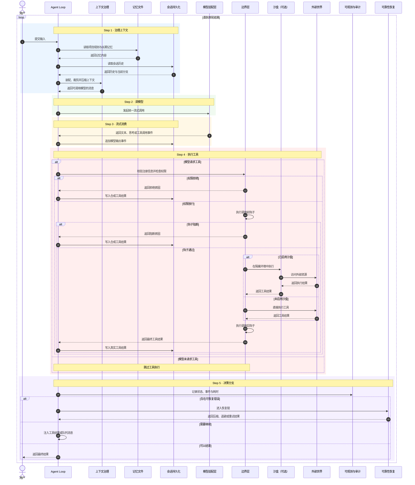

# Agent Loop × 模块交互（时序视角）

> 主图 [[00-Agent-Harness-知识全景图]] 把所有模块平铺在一张图上，方便记忆"有什么"，但看不出运行时"谁先调谁、读什么写什么"。本图补这条**时间轴**：把一次 `Agent Loop` 迭代里对每个模块的调用顺序拍平。



---

## 1. 这张图回答的是什么问题

时序图的核心命题：**模块之间的依赖不是结构关系，是时序关系**。

罗列式静态图告诉读者"边界层包含权限、钩子、注册三件套"——这是名词。但模型在 Step 4 想执行一个工具时，到底是先过权限还是先过钩子？钩子返回 `block` 之后还要不要补一条工具结果？模型流没结束就报错怎么办？这些问题只有把横轴换成时间才能答清楚。

所以这张图的设计原则：

- **纵向 = 时间**。从上到下走一次完整迭代，再循环回顶部。
- **横向 = 模块**。每个模块一条 lifeline，调用从主循环列发起。
- **实线 = 主动调用**。**虚线 = 返回**。`alt / else` 区块表示条件分支。
- **背景色块 = 当前所处的 Step**。主循环走到哪个色块，就说明这一刻在做哪个阶段的事。

---

## 2. 五个 Step 的"职能定位"

按 IO 方向分类，每个 Step 在做的事其实可以归为四种之一：

| Step | 名字 | IO 性质 | 关键模块 |
|---|---|---|---|
| 1 | 治理上下文 | **读侧** | 上下文治理 · 记忆文件 · 会话持久化 |
| 2 | 调模型 | **出口** | 模型适配层 |
| 3 | 流式消费 | **入口** | 模型适配层 · 会话持久化 |
| 4 | 执行工具 | **副作用** | 边界层 · 外部世界 · 沙盒（可选）|
| 5 | 决策分支 | **控制流** | 可观测与审计 · 可靠性恢复 |

Step 1–3 是"准备好上下文 → 发出去 → 收回来落账"的三段闭环，每轮必跑。Step 4 只有在模型回流里包含工具请求时才跑，否则直接进 Step 5。Step 5 决定下一轮去向。

---

## 3. Step 4 是为什么需要单独放大

Step 4 的高度在图里占了将近一半，不是排版偷懒——是因为这条流水线**任何一个环节失败都不能短路**：

```
权限三态  →  执行前钩子  →  执行  →  执行后钩子  →  落账
   ↓            ↓           ↓          ↓           ↓
  拒绝时       block 时   失败时    可改写结果   永远写入
   ↓            ↓           ↓
   都要补一条「合成的工具结果」回到模型，否则消息序列就坏了
```

这就是主图里 `Synthetic Result`（合成结果）那个组件的运行时含义：**模型一旦请求了工具，账本上就必须有对应的工具结果**，无论结果是真的执行了，还是被权限拒了、被钩子阻断了、被用户中断了。这张时序图把"无论何种原因都要走完这条线"画成了一条贯穿的水平流水线。

沙盒在图里是一个标注"已启用 / 未启用"的可选分支——对应主图里那条灰色的"未实现"层。当前 harness 没有这一跳，所有副作用直接落到用户主机权限下的外部世界。

---

## 4. 与主图的对应

| Step | 触及主图哪些区块 |
|---|---|
| Step 1 | 上下文治理 · 记忆文件 · 会话持久化 |
| Step 2 | 协议层 · 模型适配层 |
| Step 3 | 模型适配层 · 会话持久化 |
| Step 4 | 边界层（权限+钩子+注册）· 外部世界 · 沙盒（可选） |
| Step 5 | 可观测与审计 · 可靠性恢复 |

主图描述"系统由哪些块组成"，本图描述"一次心跳里这些块怎么协同"。两张图配合看：先看主图建立空间感，再看本图建立时间感。

---

## 5. 本图刻意没画的东西

- **多 agent fork / coordinate / verify**：属于 Step 4 内某一次工具调用展开出的子序列，需要单独一张时序图。
- **可靠性恢复链的内部步骤**：本图只在 Step 5 标了一条出路"进入恢复链"，具体如何 collapse → compact → truncate 见主图 Section 7。
- **跨会话的记忆演化**（`MEMORY.md` 怎么从一次会话写到下一次）：这是脱机过程，不属于 loop 内的时间轴。
- **steering / 用户中断打断当前 Step**：实际上是异步事件，会落到 Step 5 的"中断需补齐工具结果"分支，本图为了纵向可读性合并到了合成结果的注脚里。

---

## 6. 复用这张图的方法

新读者上手 harness 时，三张图按顺序看：

1. **静态全景**：[[00-Agent-Harness-知识全景图]] —— 建立"有哪些模块"的空间记忆。
2. **动态时序**（本图）—— 建立"一次心跳怎么跑"的时间记忆。
3. **修源码时**：每改一处都问"这处改动落在本图哪个 Step 的哪条箭头上"，能避免误改其它阶段的逻辑。
