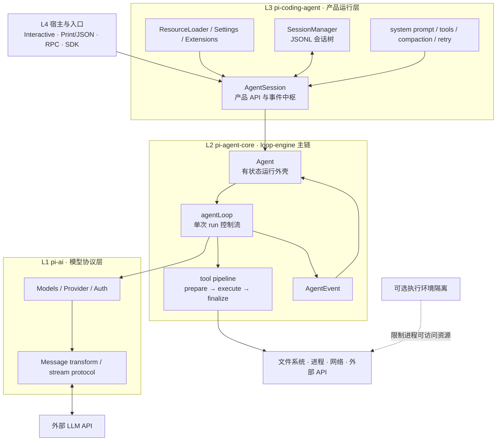

# Pi Agent 整体架构：自上而下

> [!summary] 先记住这个边界
> Pi 的“轻量”指 loop-engine 主链职责少且协议稳定，不指整个产品代码很少。模型适配、会话、压缩、具体工具、配置、UI 与扩展系统仍构成完整产品壳。

本文只讲**静态结构、对象嵌套、状态所有权和系统边界**。一条 prompt 的动态先后顺序见 [[02-Agent-Loop-模块交互]]。

---

## 1. 阅读前先统一四个词

### 1.1 Agent harness

围绕无状态模型建立的运行时系统。它让模型能够在多轮调用中读取上下文、请求工具、观察结果并继续工作。

### 1.2 产品运行层

本文用它指 `pi-coding-agent`：包含 `AgentSession`、`SessionManager`、资源发现、具体 coding tools、compaction、retry 与 Extension Runner。

### 1.3 `AgentSessionRuntime`

产品运行层中的具体调度对象。它可以持有当前活动 session，并负责新建、恢复、切换或 fork；它不等于“所有运行时基础设施”的泛称。

### 1.4 执行环境

Pi 进程实际拥有的文件、网络、凭证和 shell 权限。OS sandbox、容器或 microVM 属于这一层。

工具查找、schema 校验和 hook 只是**动作准入与结果处理**，不构成物理隔离。

---

## 2. 四层主链



依赖方向向内收敛：宿主依赖产品层，产品层依赖 agent core，agent core 依赖模型协议层。内层不需要知道外层使用 TUI、RPC 还是 SDK。

---

## 3. 各层只承担什么

### 3.1 L1 · `pi-ai`

负责把不同 provider 的差异收敛为统一调用契约：

- `Model`、`Context`、`Message` 与统一事件类型；
- provider 身份、模型目录与认证；
- 流式请求和错误的统一表示；
- 跨模型消息转换与 provider 特有字段处理。

这一层不执行本地工具，也不管理产品 session。

### 3.2 L2 · `pi-agent-core`

coding-agent 主链有三个承重部分：

- `agentLoop`：推进一次 agent run；
- tool pipeline：处理单批 tool call；
- `Agent`：保存跨 run 内存状态、队列、listener 与 active-run 生命周期。

这一层不发现项目资源、不决定产品 compaction 策略，也不写 JSONL 会话树。

### 3.3 L3 · `pi-coding-agent`

把通用 core 组装成 coding agent：

- `AgentSession` 对宿主暴露 prompt、steer、follow-up、abort 与 subscribe 等产品 API；
- `SessionManager` 保存会话 entry，并把活动分支重建成消息投影；
- `ResourceLoader` 发现 settings、extensions、skills、templates、themes 与项目上下文；
- 产品层装配 system prompt、具体 tools、retry、compaction 与 Extension Runner。

### 3.4 L4 · 宿主与入口

Interactive、Print/JSON、RPC 与 SDK 负责输入输出和进程形态，不应各自复制 agent loop。编程接入见 [[official-doc/16-SDK-嵌入-Node-应用]]、[[official-doc/17-RPC-模式]] 与 [[official-doc/18-JSON-事件流]]。

---

## 4. 包、类和函数不是平级概念

```text
宿主进程
└── AgentSessionRuntime〔可选的 session 调度对象〕
    └── AgentSession〔pi-coding-agent 的产品对象〕
        ├── SessionManager
        ├── ResourceLoader
        ├── ExtensionRunner
        └── Agent〔pi-agent-core 的有状态类〕
            └── agentLoop〔pi-agent-core 的控制流函数〕
                ├── StreamFunction → Models → Provider
                └── AgentTool.execute()
```

- package 规定代码与依赖边界；
- class 保存运行时状态并提供方法；
- function 推进一次明确的控制过程；
- interface/type 只规定数据或调用形状。

把它们画成同一层，是后续混淆 `AgentSession`、`Agent` 与 loop 的主要原因。

---

## 5. 状态所有权

### 5.1 `SessionManager`：持久事实

拥有 append-only session entries、父指针、活动 leaf、model/thinking 变更、compaction 与 branch summary。恢复时沿活动路径重建当前 context 投影。

### 5.2 `AgentSession`：产品处理状态

拥有产品层的 retry/compaction 流程、资源快照、Extension Runner、session 事件 fan-out，以及产品级待处理消息。

### 5.3 `Agent`：跨 run 的内存状态

拥有当前 transcript、model、tools、streaming message、pending tool calls、error、steering/follow-up 队列、listeners、取消控制器与 active run。

### 5.4 `agentLoop`：单次 run 的局部状态

拥有当前 context、pending messages、loop turn、tool batch 与停止判断。这些局部变量随本次 run 结束而消失。

### 5.5 provider event stream：单次响应状态

拥有正在累积的 text、thinking、tool call 与 usage；最终形成 assistant message。

### 5.6 UI / RPC / SDK：视图状态

拥有渲染、传输与客户端交互状态。它们消费事件，不是 transcript 或 session 事实的所有者。

---

## 6. 三条关键边界

### 6.1 模型边界

```text
AgentMessage[]
  → transformContext
  → convertToLlm
  → Message[]
  → StreamFunction
  → Models / Provider / LLM
```

`transformContext` 决定本次请求看到哪些内部消息；`convertToLlm` 把可扩展的 `AgentMessage` 转成模型协议接受的 `Message`。provider adapter 再处理厂商 wire format。

### 6.2 工具副作用边界

```text
ToolCall
  → 查找与参数预处理
  → schema 验证
  → beforeToolCall
  → execute
  → afterToolCall
  → ToolResultMessage
```

这条边界统一动作准入、错误封装、事件与结果顺序。它不保证 execute 内部副作用可回滚，也不限制同进程代码的 OS 权限。

详细机制见 [[04-tool-execution-三阶段管道]]。

### 6.3 持久化边界

`Agent.state.messages` 是当前内存 transcript；`SessionManager` 的 entries 是长期事实。产品层在 finalized message 到达时追加 entry；恢复、分支或 compaction 后，再从 entries 投影出新的工作消息。

事件是过程通知，不等于持久事实。

---

## 7. Extension 位于哪里

Extension 是与 Pi 同进程执行的 TypeScript/JavaScript 模块，主要做三类事：

- **注册**：tool、command、shortcut、provider、renderer 与资源路径；
- **观察或干预**：在输入、context、tool、provider、session 等生命周期点运行 handler；
- **提供 UI**：在支持 UI 的宿主里显示通知、对话框、widget 或自定义组件。

Extension 增加产品组合，不应让 `agentLoop` 为每个功能增加专用分支。新 tool 进入同一 tool pipeline，新 provider 进入同一模型协议层，新 UI 消费同一事件流。

但 Extension API 是兼容性边界，不是安全边界。Extension 可直接访问进程权限；不可信代码应放到独立进程或受控执行环境。

完整 API 见 [[official-doc/08-Extensions-扩展编写]]。

---

## 8. Skill、Extension、Package、Provider 与 SDK

- **Skill**：Markdown 指令，影响模型怎样工作；正文通常按需读取。
- **Extension**：同进程可执行代码，改变 Pi 行为。
- **Pi package**：分发容器，可携带 extension、skill、prompt 与 theme。
- **Provider**：模型、认证、目录与 streaming 的运行时单元。
- **SDK**：宿主边界，让 Node 应用直接拥有 `AgentSession`。
- **RPC**：进程边界，让非 Node 或需要隔离的宿主通过 JSON 事件驱动 Pi。

这些概念解决的问题不同，不能都称为“插件”。

---

## 9. `AgentHarness` 厚壳分支

同一 `pi-agent-core` 包内还存在 `harness/` / `AgentHarness` 方向，尝试把 session、compaction、skills 与执行环境等能力收回更厚的接口面。

本文跟踪的是 coding-agent 使用的 `Agent + agentLoop` 主链。`AgentHarness` 的完成度、调用方和接口可能随书稿快照变化，因此：

- 不把整个 `pi-agent-core` 都称为“极小内核”；
- 不把实验性厚壳的接口当成 coding-agent 当前行为；
- 核验具体版本后再讨论其生产状态。

“轻量”的收益与代价集中在 [[06-pi-设计艺术-全书精要#3. 关键取舍及其代价|06-pi-设计艺术-全书精要 §3「关键取舍及其代价」]]，本文不再重复。

---

## 10. 调试定位法

遇到问题时按这个顺序定位：

1. **状态归谁**：SessionManager、AgentSession、Agent、agentLoop 还是 provider stream？
2. **发生在哪条边界**：模型、工具副作用、持久化还是执行环境？
3. **当前看到什么载体**：事件、内存消息、session entry 还是 UI 投影？
4. **这是机制还是策略**：core 固定协议，还是产品层/Extension 的可选决定？

动态调用顺序见 [[02-Agent-Loop-模块交互]]；局部实现继续下钻到 [[03-agentLoop-无状态循环引擎]]、[[04-tool-execution-三阶段管道]] 和 [[05-Agent-有状态运行时外壳]]。

---

## 11. 基线与可信度

- 架构主线参考 `pi-book` 书稿快照及本目录 03–05 的源码笔记。
- 书稿中的代码量、实验性包和调用方只表示该快照，不视为稳定 API。
- 使用与配置细节以 [[official-doc/00-Pi-概述与文档导航]] 为入口。
- 可视化补充仍可打开 [[study-notes/AI/harness-engineering/Pi/Pi-Agent-整体架构.canvas]]；本文是 Markdown fallback 与概念基准。
