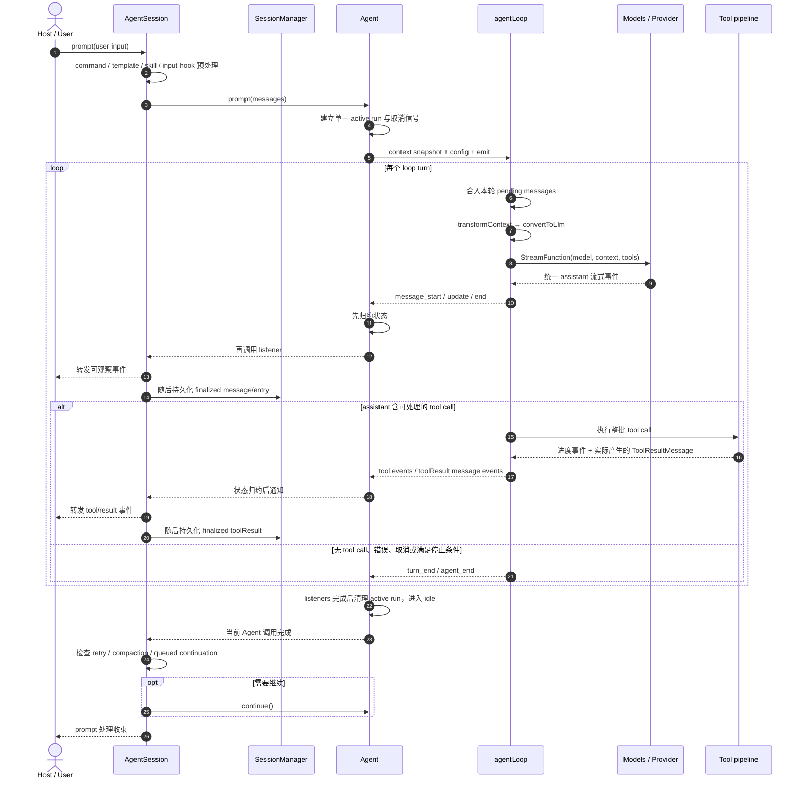

# Pi Agent 端到端运行时序

> [!summary] 本文只回答一个问题
> 一条用户 prompt 进入活动 session 后，`AgentSession`、`Agent`、`agentLoop`、模型、工具与持久化组件按什么顺序协作？

静态层次与状态所有权见 [[01-Pi-自上而下整体架构]]；本文不重复模块定义，也不把 Claude Code 的恢复机制或通用“工业目标”画成 Pi 当前事实。

---

## 0. 本文新增的时间尺度

`loop turn`、`agent run` 与 session 的统一定义见 [[00-Agent-Harness-知识全景图#2. 六个术语必须分开|00-Agent-Harness-知识全景图 §2「六个术语必须分开」]]。本文只增加一个产品层尺度：

- **prompt 处理**：`AgentSession` 对一条用户输入的完整处理；它可因 retry、compaction 或 continuation 启动多个 agent run。

因此时间范围是“prompt 处理 ≥ agent run ≥ loop turn”；模型调用一次、loop 结束一次和用户请求完全收束是三个不同完成点。

---

## 1. 启动阶段先装配运行材料

在第一条 prompt 之前，产品层先创建或恢复 `AgentSession`：

```text
读取 settings 与受信任的资源
  → 发现 extensions / skills / prompt templates / themes
  → 装配 system prompt 与可用 tools
  → 打开或创建 SessionManager
  → 从活动会话分支重建消息投影
  → 创建 Agent 并绑定 AgentSession 事件处理
```

这些动作不是每个 loop turn 都重做。只有显式 reload、切换 session、重建运行对象或相关资源变化时，才重新装配。

---

## 2. 一条 prompt 的完整时序



这张图有三个关键限制：

1. 资源发现发生在 prompt 之前，不是每个 loop turn 都读取“记忆文件”。
2. `SessionManager` 持久化 finalized message/entry，不保存每个模型 delta。
3. 工具取消可能使尚未启动的调用不产生结果；不能把“每个 tool call 永远都有 synthetic result”写成 Pi 当前实现的无条件保证。

---

## 3. 一个 loop turn 内部发生什么

一次正常 turn 按以下顺序推进：

```text
turn_start
  → 合入本轮待处理消息
  → transformContext：决定本次请求看到哪些 AgentMessage
  → convertToLlm：转成 provider 可接受的 Message
  → 调用 StreamFunction
  → assistant 流式生成并最终定型
  → 若含 tool call，则调用工具批处理管道
  → 将实际产生的 toolResult 按模型请求顺序加入工作消息
  → turn_end
```

工具批处理的 `prepare → execute → finalize`、并发和取消语义只在 [[04-tool-execution-三阶段管道]] 解释。

---

## 4. turn 结束后如何决定下一步

当前 turn 闭合后，循环依次面对几类决策：

1. assistant 若以 `error` 或 `aborted` 结束，当前 agent run 结束；loop 本身不做 retry。
2. 上层可在 turn 边界准备下一轮 context、model 或 thinking level。
3. `shouldStopAfterTurn` 若要求停止，本次 run 结束，队列不会在该 run 中继续消费。
4. `steering` 若存在，在安全的 turn 边界进入下一次 LLM 请求。
5. 普通 tool result 若仍要求模型读取，开始下一个 loop turn。
6. 原任务本可结束时，再检查 `follow-up`；有则重新进入内层循环。
7. 都没有时发出 `agent_end`。

严格控制流见 [[03-agentLoop-无状态循环引擎]]。

---

## 5. 三种排队消息的时机

### 5.1 `steering`

表示“当前任务继续，但下一步尽快改变方向”。它不会打断正在生成的 assistant，也不会撤销已经启动的工具；当前 tool batch 结束后，才在下一次模型请求前注入。

### 5.2 `follow-up`

表示“当前任务先完成，原本准备退出时再处理这件事”。只有内层循环本可结束时才消费。

### 5.3 `nextTurn`

这是 `AgentSession` 产品层的 custom-message 交付方式，不属于 `agentLoop` 两个队列。它等待当前 prompt 处理完全收束，和下一条真正启动新处理的用户 prompt 一起进入；单独入队不会主动启动 idle agent。

---

## 6. 事件路径与消息路径不能混写

### 6.1 事件描述“现在发生到哪”

`message_update`、`tool_execution_update` 等事件用于流式 UI、日志和扩展生命周期。并行工具的事件可以按实际完成时间交错。

### 6.2 消息描述“最终产生了什么”

user、assistant 与 toolResult 等 finalized message 先进入 `Agent.state.messages`，随后由产品层持久化为 session entry。并行工具结果进入 transcript 时仍按模型原始请求顺序排列。

### 6.3 顺序是“先归约，再通知，后持久化”

`Agent` 收到 loop 事件后先更新 state，再 await listeners。`AgentSession` 处理 finalized message 时，先把事件转发给 session subscribers，再追加到 `SessionManager`。因此 listener 能读到已归约的内存状态，但宿主收到 `message_end` 时不能据此认定该消息已经落盘。慢 listener 也会延长运行路径。

---

## 7. 四个完成时点

### 7.1 `turn_end`

当前 LLM 回复及该 turn 实际产生的工具结果已经闭合。它不表示 agent run 已结束。

### 7.2 `agent_end`

当前 `agentLoop` invocation 的终止事件。产品层仍可能决定 retry、compaction 或 continuation。

### 7.3 `Agent` idle

`agent_end` 已经被所有 listeners 处理，active run 已清理，可以安全启动下一次 `prompt()` 或 `continue()`。`waitForIdle()` 等待的是这个时点。

### 7.4 prompt settled

`AgentSession` 不再需要自动 retry、compaction 或 continuation，整条用户请求才算收束。收束不等于成功：错误路径也可以正常收束。

---

## 8. 两个边界不要画错

### 模型边界

`AgentMessage[] → transformContext → convertToLlm → Message[] → StreamFunction → Provider`。

前一段决定“模型本次看到什么”，后一段决定“怎样转换成统一模型协议”。

### 工具副作用边界

`ToolCall → prepare → execute → finalize → ToolResultMessage`。

它提供查找、验证、hook、错误封装与事件，但不是物理 sandbox。Extension 与工具代码若和 Pi 同进程运行，仍拥有该进程的 OS 权限。

---

## 9. 相关笔记

- 静态层次与状态 owner：[[01-Pi-自上而下整体架构]]
- 单次 run 的精确控制流：[[03-agentLoop-无状态循环引擎]]
- 工具批处理：[[04-tool-execution-三阶段管道]]
- `Agent` 的 idle、listener 与互斥：[[05-Agent-有状态运行时外壳]]
- session 与 compaction：[[official-doc/06-Sessions-会话树]]、[[official-doc/07-Compaction-上下文压缩]]
