---

## title: 从零到一搭建 Agent：基于 Pi 的完整技术文档

tags: [Pi, agent, harness-engineering, architecture]
created: 2026-05-28
sources:

- /Users/liangzhu/Documents/dev/agent-in-one/pi-agents/docs
- [https://github.com/earendil-works/pi/tree/main/packages/coding-agent](https://github.com/earendil-works/pi/tree/main/packages/coding-agent)

# 从零到一搭建 Agent：基于 Pi 的完整技术文档

> 目标：把一个真实可用的 coding agent 系统从零拼出来。读完之后，你应该能回答两类问题：
>
> 1. **结构问题**：Pi 由哪些模块组成？模块之间通过什么协议交互？为什么要这样分层？
> 2. **实现问题**：如果让我自己从空目录开始写，应该先写什么、后写什么、每一步的最小可运行形态是什么？

本文以 Pi 的真实工程实现（`earendil-works/pi`）和本仓库教学版 `pi-agents/` 为参照系，把"概念—架构—代码"打通。所有架构图均使用 Mermaid 嵌入，可直接在 Obsidian 渲染。

---

## 0. 阅读地图

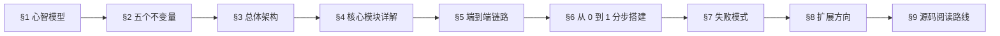


| 章节    | 你会得到什么                          |
| ----- | ------------------------------- |
| §1–§2 | 心智模型，避免把 Agent 想成"更聪明的 chatbot" |
| §3    | 一张总体架构图，看清 Pi 的三层分工             |
| §4    | 每个核心模块的职责、协议、关键代码骨架             |
| §5    | 一次完整请求穿过所有层的时序图                 |
| §6    | 八个可运行的分步实现，跟做即得最小 Agent         |
| §7–§8 | 上线/扩展时必须考虑的工程边界                 |
| §9    | 真正打开 Pi monorepo 时该怎么读          |


---

## 1. 心智模型：Agent 是什么

工程化定义：

> **Agent 是一个围绕大模型构建的运行时系统。它维护状态，把用户目标转换成多轮模型请求，允许模型调用工具，接收工具结果，再决定下一步。**

它不是"一次性的 prompt+response"，而是一条闭环：

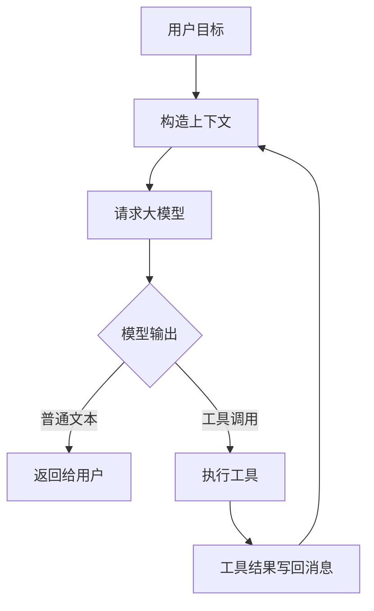


一个最小 Agent 只需要五个概念：


| 概念        | 做什么              | 缺失会怎样           |
| --------- | ---------------- | --------------- |
| `Message` | 保存用户、助手、工具结果     | 模型不知道之前发生过什么    |
| `Model`   | 根据上下文生成下一步       | 无推理与规划能力        |
| `Tool`    | 把模型连接到外部世界       | 只能聊天，不能读文件/执行命令 |
| `Loop`    | 反复"模型 → 工具 → 模型" | 只能跑一步，无法完成复杂任务  |
| `Event`   | 把过程暴露给 UI/日志     | 用户只能看最终答案       |


**为什么一次 prompt 解决不了**：以"读 README，修正安装命令"为例：

1. 模型并不知道 README 的真实内容；
2. 即使猜对，也不能真正写文件；
3. 写完还得验证。

这三件事必须通过多轮"模型 ↔ 工具"协作完成。

---

## 2. 五个不变量

这是后续所有工程决策的"宪法"。读源码读到迷茫时，回到这五条对一下，能立刻定位 Pi 为什么这样写。


| #      | 不变量                                   | 含义                                                        |
| ------ | ------------------------------------- | --------------------------------------------------------- |
| **I1** | **模型输入输出统一为结构化消息/事件**                 | 不允许 `if (provider === "openai") ...` 散落在业务代码里             |
| **I2** | **Agent Loop 不直接做产品 I/O**             | Loop 不碰磁盘、不碰 HTTP、不碰 UI                                   |
| **I3** | **工具副作用必须经过 schema、hook、tool result** | 模型只能"请求"工具，本地运行时才执行；任何失败都转为 `isError: true` 的 tool result |
| **I4** | **会话不是数组，是 JSONL entry tree**         | 用稳定 `id` / `parentId` / `leafId`，支持 append、恢复、分支          |
| **I5** | **长上下文用摘要 entry 承接，不删除历史**            | compaction 是追加而非覆盖；原始历史可审计                                |


后续每一节都会反复回到这些不变量。

---

## 3. 总体架构：三层分工

Pi 的核心设计思想是**把不稳定的外部世界和稳定的核心循环分开**。

模型供应商会变、工具会变、UI 会变、用户想装的扩展会变，但 Agent Loop 的本质相对稳定。

### 3.1 三层包结构（对应 Pi 实际 monorepo）

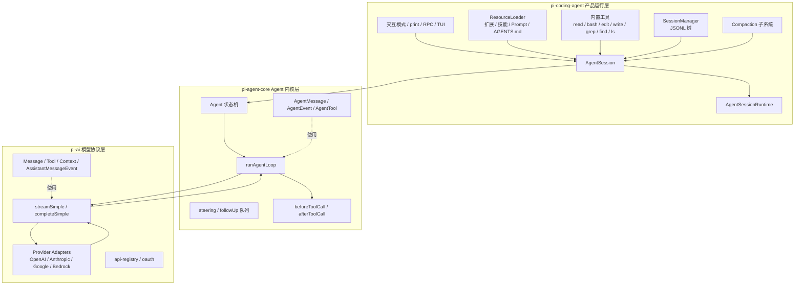


### 3.2 每层职责


| 层                 | 关键问题                               | 解决方式                                                         |
| ----------------- | ---------------------------------- | ------------------------------------------------------------ |
| `pi-ai`           | 各家模型 API 工具调用、流式协议、错误结构都不一样        | 统一为 `Message` / `Tool` / `Context` / `AssistantMessageEvent` |
| `pi-agent-core`   | "请求模型 → 执行工具 → 回写结果 → 继续或停止" 的稳定闭环 | `Agent` 类 + `runAgentLoop()`，对外只暴露事件                         |
| `pi-coding-agent` | 把内核变成可日常使用的开发工具                    | 会话、资源、内置工具、压缩、扩展、多运行模式                                       |


### 3.3 两个关键边界

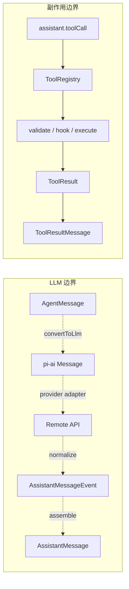


- **LLM 边界**：进入模型前 message 被翻译成供应商格式；离开模型后再被翻译回统一事件。
- **副作用边界**：模型不能直接读写，必须经过工具；任何失败、拦截、改写都被收敛为 tool result。

抓稳这两个边界，就不会被 Pi 的 TUI、扩展、provider 兼容性绕晕。

### 3.4 真实文件位置（来自 `earendil-works/pi`）

```
packages/
├─ ai/src/
│   ├─ types.ts              # Message / Tool / Context / Event
│   ├─ stream.ts             # streamSimple / completeSimple
│   ├─ api-registry.ts       # provider 注册查找
│   └─ providers/            # openai-responses / anthropic / google / bedrock ...
│
├─ agent/src/
│   ├─ types.ts              # AgentMessage / AgentEvent / AgentTool
│   ├─ agent-loop.ts         # runLoop / streamAssistantResponse / executeToolCalls
│   ├─ agent.ts              # Agent 状态机
│   └─ harness/              # 内置的 harness 工具
│
└─ coding-agent/src/core/
    ├─ sdk.ts                # createAgentSession
    ├─ agent-session.ts      # AgentSession
    ├─ agent-session-runtime.ts
    ├─ session-manager.ts    # JSONL 树
    ├─ resource-loader.ts    # 扩展/技能/Prompt/AGENTS.md 加载
    ├─ system-prompt.ts      # 系统提示词组装
    ├─ skills.ts / prompt-templates.ts
    ├─ extensions/           # 扩展运行时
    ├─ tools/                # 内置工具
    └─ compaction/           # compaction / branch summary
```

---

## 4. 核心模块详解

下面按"协议 → 内核 → 产品"自下而上展开每个核心模块。

### 4.1 消息协议层（`pi-ai`）

#### 三类基础消息

```ts
type Message = UserMessage | AssistantMessage | ToolResultMessage;

interface UserMessage {
  role: "user";
  content: string | ContentBlock[];
  timestamp: number;
}

interface AssistantMessage {
  role: "assistant";
  content: Array<TextBlock | ThinkingBlock | ToolCallBlock>;
  stopReason: "stop" | "length" | "toolUse" | "error" | "aborted";
  usage: Usage;
  timestamp: number;
}

interface ToolResultMessage {
  role: "toolResult";
  toolCallId: string;
  toolName: string;
  content: ContentBlock[];
  isError: boolean;
  timestamp: number;
}
```

关键点：`AssistantMessage.content` **可以同时混合文本和 tool call**。这是后续 Loop 工作的前提。

#### 为什么必须结构化


| 设计选择         | 原因                                     |
| ------------ | -------------------------------------- |
| 消息是结构化对象     | 工具调用、图片、thinking、错误、token 用量无法用纯文本可靠表达 |
| 事件是增量协议      | UI 需要看到流式输出，而不是等最终答案                   |
| 工具定义是 schema | 模型需要知道参数形状，运行时也要校验                     |
| 会话条目是 JSONL  | 长会话需要 append、恢复、分支、压缩                  |


#### Provider 适配链路

```mermaid
sequenceDiagram
  participant Loop as Agent Loop
  participant AI as pi-ai
  participant Adapter as Provider Adapter
  participant API as Remote Model API

  Loop->>AI: streamSimple(context, options)
  AI->>Adapter: normalize context
  Adapter->>API: provider-specific request
  API-->>Adapter: provider-specific stream
  Adapter-->>AI: AssistantMessageEvent
  AI-->>Loop: text/tool/thinking/error events
  Loop->>Loop: assemble AssistantMessage
```


三个不变量牢记：

1. 上层只传 `Context = { systemPrompt, messages, tools }`
2. 下层只吐 `AssistantMessageEvent` 流
3. 最终都能组装成 `AssistantMessage`

> **教学版对应**：`pi-agents/05_openai_compatible.py` 里那个 `safe_json_loads()` + 把 `tool_calls` 翻译成 `tool` message 的代码，本质就是一个微型 provider adapter。

### 4.2 Agent 内核（`pi-agent-core`）

#### 极简骨架

```ts
async function runAgentLoop(context, config) {
  while (true) {
    const assistant = await streamAssistantResponse(context, config);
    context.messages.push(assistant);

    const toolCalls = assistant.content.filter(b => b.type === "toolCall");
    if (toolCalls.length === 0) return;

    for (const call of toolCalls) {
      const tool = context.tools.find(t => t.name === call.name);
      const result = await tool.execute(call.arguments);
      context.messages.push(toToolResultMessage(call, result));
    }
  }
}
```

所有 Agent 框架都绕不开这个骨架。

#### Pi 真实 Loop 的工程细节

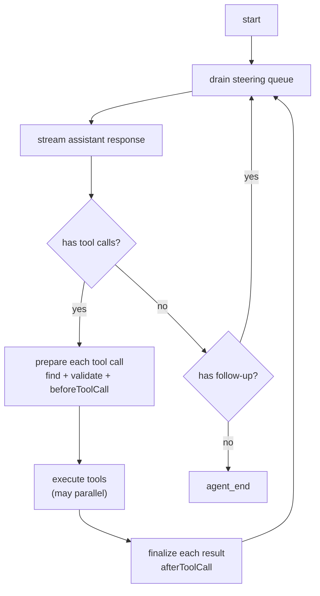


**四个真实细节**：


| 细节                        | 解决什么                                                                      |
| ------------------------- | ------------------------------------------------------------------------- |
| 内外两层循环                    | `steering` 队列在每轮工具结束后注入；`followUp` 队列在准备停止时再次检查                           |
| 流式 partial 先占位            | `text_delta` / `toolcall_delta` 持续替换 partial，最后 `done` 时固化为 final message |
| `prepareToolCall` 四步      | 找工具 → 参数兼容 → schema 校验 → `beforeToolCall` hook                            |
| `finalize` 与 terminate 规则 | `afterToolCall` 可改写结果；**只有当批次内每个 tool result 都 `terminate: true` 时才提前停止** |


#### Loop 为什么不写磁盘（不变量 I2）


| 如果 Loop 直接写磁盘         | Pi 的做法                                 |
| --------------------- | -------------------------------------- |
| 测试每个边界都要准备真实文件        | 测试只断言 events 和 newMessages             |
| SDK/TUI/RPC 难以复用同一个核心 | 所有模式订阅同一套 AgentEvent                   |
| 扩展想替换持久化策略很痛苦         | `AgentSession` + `SessionManager` 负责写入 |


### 4.3 工具系统

#### 工具定义最少字段

```ts
interface AgentTool<TArgs, TResult> {
  name: string;
  description: string;
  parameters: unknown;            // JSON Schema / TypeBox / Zod
  execute(args: TArgs, signal?: AbortSignal): Promise<TResult>;
}
```

#### 工具调用完整时序

```mermaid
sequenceDiagram
  participant Loop as Agent Loop
  participant Model as LLM
  participant Hook as Hooks
  participant Tool as Tool
  participant Ctx as Context

  Loop->>Model: messages + tools
  Model-->>Loop: assistant content: toolCall
  Loop->>Loop: find tool by name
  Loop->>Loop: validate args (schema)
  Loop->>Hook: beforeToolCall
  Hook-->>Loop: allow / block / rewrite / confirm
  Loop->>Tool: execute(args, signal)
  Tool-->>Loop: ToolResult
  Loop->>Hook: afterToolCall
  Hook-->>Loop: optional override
  Loop->>Ctx: append toolResult
  Loop->>Model: next request
```


#### Hook 的工程意义


| Hook             | 常见用途                      |
| ---------------- | ------------------------- |
| `beforeToolCall` | 权限审批、路径保护、命令黑名单、参数改写、人工确认 |
| `afterToolCall`  | 脱敏、截断、记录审计日志、改成结构化摘要      |


教学版仅实现 `allow / block / rewrite` 就足以演示这层价值——比如：

- `write_note` 如果文件名包含 `secret` / `秘密` → block
- `list_files` 缺失 `path` → rewrite 成 `"."`

#### 并行 vs 串行


| 模式         | 适合场景                       | 风险          |
| ---------- | -------------------------- | ----------- |
| parallel   | 多个只读操作（grep / read / find） | 完成顺序与调用顺序不同 |
| sequential | 写文件、依赖前步结果                 | 慢，但保证副作用顺序  |


**关键规则**：可以并发执行，但生成 `toolResult` 时**必须按 assistant 原始 tool call 顺序回写**，否则模型看到的上下文会错乱。

#### 错误也是工具结果

工具不存在、参数校验失败、被 hook 阻止、执行抛错——**任何一种都不应该让进程崩**，而是返回：

```ts
{
  role: "toolResult",
  toolCallId: "call_1",
  toolName: "read_file",
  isError: true,
  content: [{ type: "text", text: "File not found: README.md" }]
}
```

让模型有机会调整计划。

### 4.4 会话树（JSONL）

#### 为什么是 JSONL

```json
{"type":"session","version":3,"id":"s1","cwd":"/repo"}
{"type":"message","id":"u1","parentId":null,"message":{"role":"user","content":"修复测试"}}
{"type":"message","id":"a1","parentId":"u1","message":{"role":"assistant","content":[]}}
{"type":"compaction","id":"c1","parentId":"a1","summary":"前面已经定位到...","firstKeptEntryId":"u8"}
```


| 优点          | 解释                    |
| ----------- | --------------------- |
| append-only | 每条 entry 完成就写入，崩溃损失最小 |
| 每行独立        | 解析坏行/迁移版本/外部脚本扫描都方便   |
| 不强制线性       | 配合 `parentId` 就能表达树   |
| 天然日志形态      | 适合多种 entry 类型混存       |


#### 树结构与 leaf

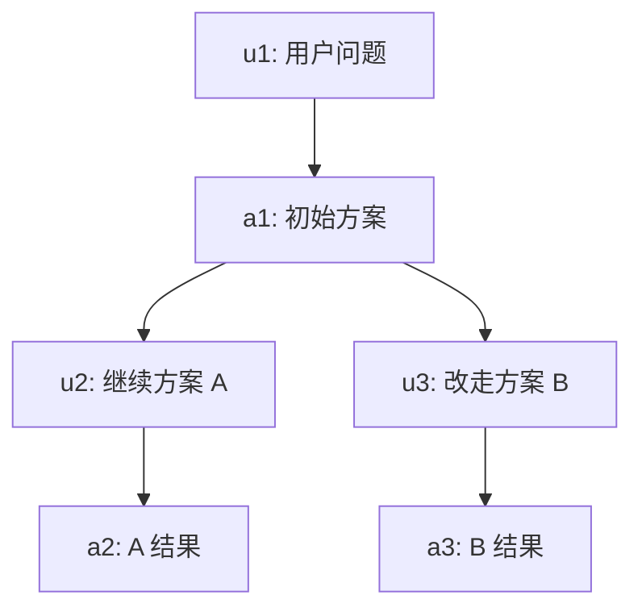


- `leafId` 指向当前分支末端
- 构建上下文 = 从 leaf 沿 `parentId` 回溯到根，再反转
- 切到旧节点提交新消息 → 自动长出新分支，旧分支不会丢

伪代码：

```ts
function buildPath(leafId: string, byId: Map<string, Entry>): Entry[] {
  const path: Entry[] = [];
  let current = byId.get(leafId);
  while (current) {
    path.unshift(current);
    current = current.parentId ? byId.get(current.parentId) : undefined;
  }
  return path;
}
```

#### Entry 类型不只是消息


| entry                       | 解决的问题           |
| --------------------------- | --------------- |
| `message`                   | 构建后续 LLM 上下文    |
| `model_change`              | 恢复当前模型选择        |
| `thinking_level_change`     | 恢复 reasoning 设置 |
| `compaction`                | 摘要替代旧上下文        |
| `branch_summary`            | 切分支时携带离开分支的发现   |
| `custom` / `custom_message` | 扩展持久化自己的状态      |
| `label` / `session_info`    | UI 和会话管理信息      |


只保存 `role / content` 在玩具项目里没问题，**一旦要恢复真实 Agent 行为就会缺很多东西**。

#### Agent.state.messages vs SessionManager · 双 store 不变量

前面 §4.2 极简骨架里那行 `context.messages.push(assistant)` 是简化写法。真实 Pi **同时维护两个并行的消息 store**，由同一个事件保持同步。

两个 store 的分工：


| Store                    | 形态                  | 用途                                   | 读取频率          |
| ------------------------ | ------------------- | ------------------------------------ | ------------- |
| `Agent.state.messages`   | 进程内数组              | Loop 每轮 LLM 调用的 `context.messages` 源 | 高频（每次迭代）    |
| `SessionManager`         | JSONL 文件（entry tree） | 会话恢复 / 分支 / 压缩 / 跨进程持久化            | 低频（仅会话边界事件） |


**写入路径：同源双写**

每条 AssistantMessage / ToolResultMessage 完成后，`message_end` 事件被两个独立订阅者各消费一次：

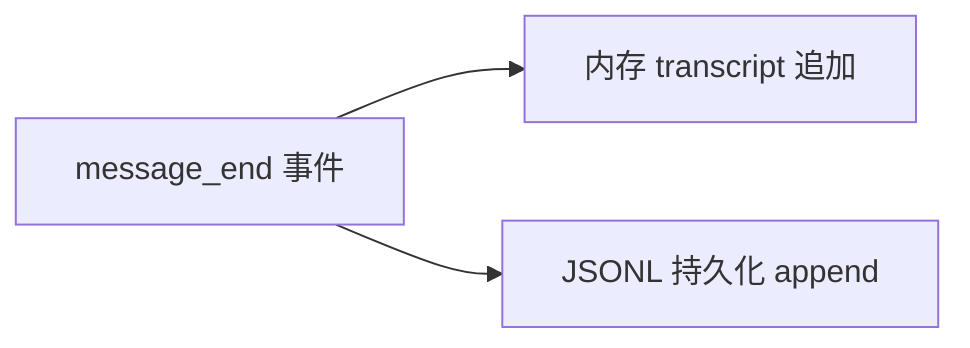

- **Agent 内部**订阅事件 → 内部数组 push
- **AgentSession** 订阅事件 → 调 `sessionManager.appendMessage()`

两路独立，不互相调用。两个 store 始终内容一致——这是**不变量**，不是 API 契约。

**读取路径：分层使用**

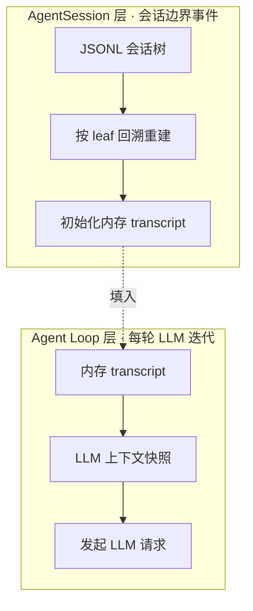

两层在不同时机触发：


| 层                                                                | 触发场景                                       | 频率                |
| ---------------------------------------------------------------- | ------------------------------------------ | ----------------- |
| Loop 层：读 state.messages → context                              | 每次 LLM 调用前                                | 高（一个 turn 一次）   |
| Session 层：`buildSessionContext(leafId)` → 初始化 state.messages  | prompt 入口 / compaction 完成 / 会话恢复 / 分支切换 | 低（一次 prompt 调用一次） |


**Loop 内的 turn 迭代不会调 `buildSessionContext`**，它只用内存里已有的 state.messages。`buildSessionContext` 是会话级事件，不是 loop 级事件。

**为什么必须分两层**


| 假设只保留一边                              | 后果                                                                                          |
| ------------------------------------ | ------------------------------------------------------------------------------------------- |
| 只有 SessionManager，没有 state.messages | 每轮 LLM 调用都要从 JSONL 回溯重建 → 高频磁盘 IO + 解析开销；Agent 无法脱离 AgentSession 独立运行（测试 / SDK 嵌入受限） |
| 只有 state.messages，没有 SessionManager | 进程崩溃 / 重启即丢历史；不能恢复，不能分支，不能压缩                                                            |


**三个常见误解**


| 误解                                          | 实际                                                                          |
| ------------------------------------------- | --------------------------------------------------------------------------- |
| state.messages 通过某个调用同步给 SessionManager   | 两者独立，没有这种调用；它们订阅**同一事件**                                                |
| context 是被工具结果"追加"进去的容器                   | context 是每轮 build 出来的快照；来源是 state.messages                              |
| 下一轮 turn 时调 buildSessionContext 重建上下文    | loop 内只读 state.messages；buildSessionContext 只在 session-level 事件触发      |


### 4.5 资源加载与扩展

`ResourceLoader` 决定启动时有哪些工具、技能、提示模板、上下文文件进入运行时。

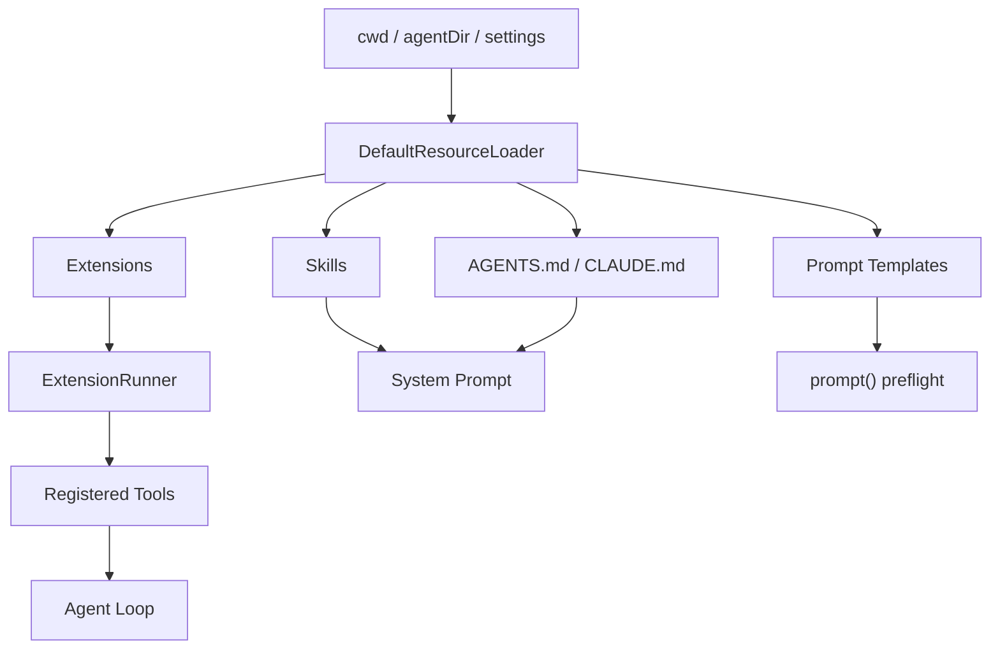


#### 四个外部资源类型的边界


| 机制                  | 本质               | 典型用途               | 是否执行代码     |
| ------------------- | ---------------- | ------------------ | ---------- |
| **Extension**       | TypeScript 运行时代码 | 工具、命令、事件拦截、UI      | 是          |
| **Skill**           | 按需加载的说明书/资产      | 可复用工作流，例如"如何做性能审计" | 由 Agent 决定 |
| **Prompt Template** | 可复用用户提示          | 常用任务模板             | 否          |
| **Context File**    | 项目长期规则           | 编码规范、运行命令、仓库约定     | 否          |


判断方法：

1. 需要改运行时行为 → Extension
2. 需要教 Agent 做一类任务 → Skill
3. 需要复用一段用户输入 → Prompt Template
4. 需要长期告诉 Agent 项目规则 → Context File

#### 技能为什么不全文注入

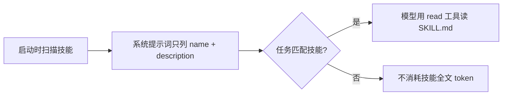


> 这一招是 Pi 上下文管理最关键的小技巧——**索引发出去，全文按需读**。

#### 扩展事件就像一排检查点

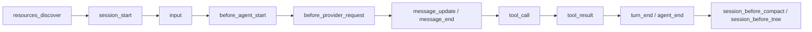


每个扩展只挂自己关心的位置。这就是为什么核心 Loop 不需要知道产品需求——**产品需求挂在事件 hook 上**。

### 4.6 上下文压缩（Compaction）

压缩不是删除历史，是追加摘要 entry：

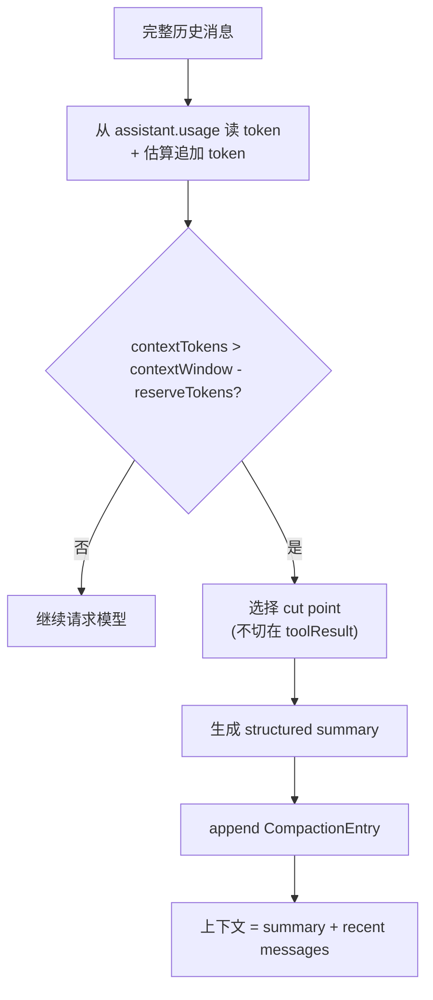


#### CompactionEntry 字段


| 字段                 | 作用               | 缺失会怎样            |
| ------------------ | ---------------- | ---------------- |
| `summary`          | 旧上下文摘要           | 只能知道大概发生过什么      |
| `firstKeptEntryId` | 后续原文从哪个 entry 接回 | 重建上下文时漏消息/重消息    |
| `tokensBefore`     | 压缩前 token 规模     | 无法在 UI/日志里解释这次压缩 |
| `details`          | 累计文件读写等结构化线索     | 摘要只剩自然语言，丢工程现场   |


#### 真实 Pi 的边界（教学版可暂时不实现）


| 真实能力                          | 说明                                                                         |
| ----------------------------- | -------------------------------------------------------------------------- |
| `reserveTokens` (默认 16384)    | 给下一次模型响应预留空间                                                               |
| `keepRecentTokens` (默认 20000) | 最近多少 token 必须保留原文                                                          |
| **Cut point rules**           | 合法切点：user / assistant / bashExecution / branch_summary；**不会切在 toolResult** |
| **Split turn**                | 一个 turn 自己超过 `keepRecentTokens` 时，把前半段单独摘要                                 |
| **Reentry compaction**        | 第二次压缩从前一次 `firstKeptEntryId` 附近继续                                          |
| **Cumulative file tracking**  | 默认摘要包含 `<read-files>` `<modified-files>`                                   |


> 这些细节不是炫技。它们共同保证：压缩后模型看到的上下文仍像"连续工作现场"，而不是抽象回忆录。

#### compaction vs branch summary


| 维度       | compaction             | branch summary           |
| -------- | ---------------------- | ------------------------ |
| 触发       | 上下文超阈值 / 用户 `/compact` | `/tree` 切换到另一条分支         |
| 摘要对象     | 当前路径上的旧上下文             | 正在离开的分支（旧 leaf → 共同祖先）   |
| 目标       | 减少 token 占用            | 把离开分支的发现带到新位置            |
| 写入 entry | `type: "compaction"`   | `type: "branch_summary"` |


### 4.7 流式事件

事件是 UI 的投影，**不是唯一存储**。

```ts
type AgentEvent =
  | { type: "agent_start" }
  | { type: "turn_start"; turn: number }
  | { type: "message_start"; message }
  | { type: "message_update"; message; delta }
  | { type: "message_end"; message }
  | { type: "tool_execution_start"; toolCallId; toolName; args }
  | { type: "tool_execution_update"; toolCallId; chunk }
  | { type: "tool_execution_end"; toolCallId; toolName; result; isError }
  | { type: "turn_end"; turn; message; toolResults }
  | { type: "compaction"; summary; tokensBefore; firstKeptEntryId }
  | { type: "agent_end"; messages };
```

#### 状态机视角

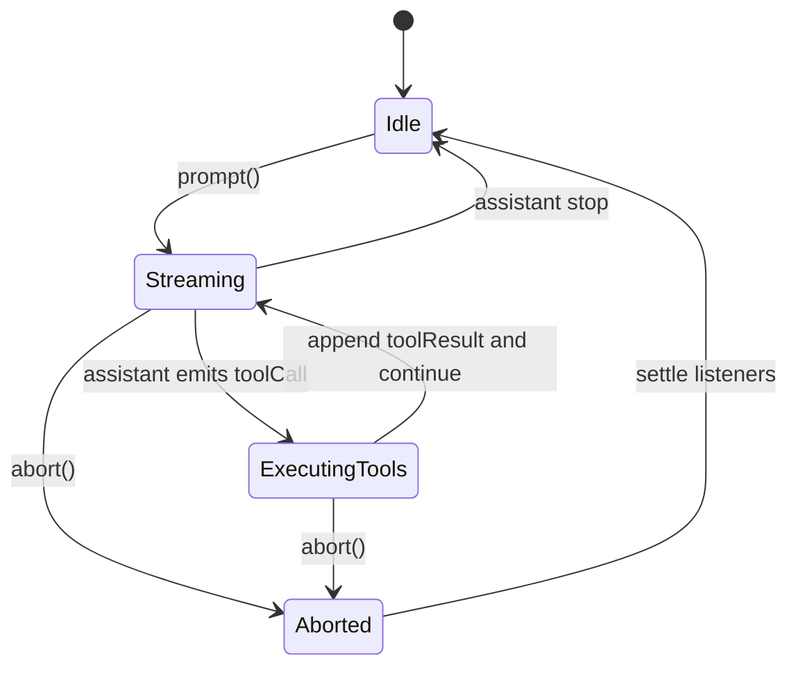


#### 三个设计要点

1. **消息是事实来源**：后续模型请求、会话恢复、压缩、分支都依赖结构化消息
2. **事件是投影**：适合驱动 UI、日志、插件；不要拿事件做唯一存储
3. **工具结果也必须是消息**：常见错误是工具结果只展示给用户，模型下一轮就不知道工具输出了

---

## 5. 模块交互全景：一次请求的端到端链路

把前面所有模块串起来，看一次 `prompt("修复 README 的安装命令")` 在 Pi 系统里跑过的全路径：

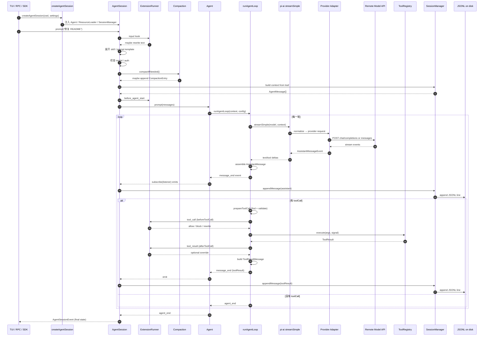


### 5.1 链路上的关键决策点


| 节点                | 谁决定               | 失败时怎么收尾                                            |
| ----------------- | ----------------- | -------------------------------------------------- |
| ① preflight       | `AgentSession`    | 模型不存在/未登录 → 抛出明确错误                                 |
| ② compactIfNeeded | `Compaction` 子系统  | 压缩失败 → 退回不压缩，继续请求                                  |
| ③ build context   | `SessionManager`  | leaf 不存在 → 退回空 context                             |
| ④ stream model    | `pi-ai` provider  | HTTP 错误 → `stopReason: "error"` 的 AssistantMessage |
| ⑤ beforeToolCall  | `ExtensionRunner` | block → `isError: true` 的 toolResult               |
| ⑥ execute tool    | `ToolRegistry`    | 抛错 → 转 `isError: true` 的 toolResult                |
| ⑦ afterToolCall   | `ExtensionRunner` | 可以截断/脱敏，可设 `terminate: true`                       |
| ⑧ append to JSONL | `SessionManager`  | 文件写错 → 仍发出事件，下次启动时尝试恢复                             |


### 5.2 教学版的等价映射

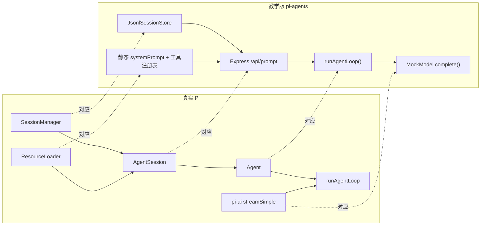


---

## 6. 从 0 到 1：分步搭建

下面是从空目录开始，**每一步都能跑通验证**的实现路线。技术栈用 React + Node + TypeScript（也对照本仓库 Python 版 `pi-agents/01_loop.py` 等）。

### 6.0 系统目标

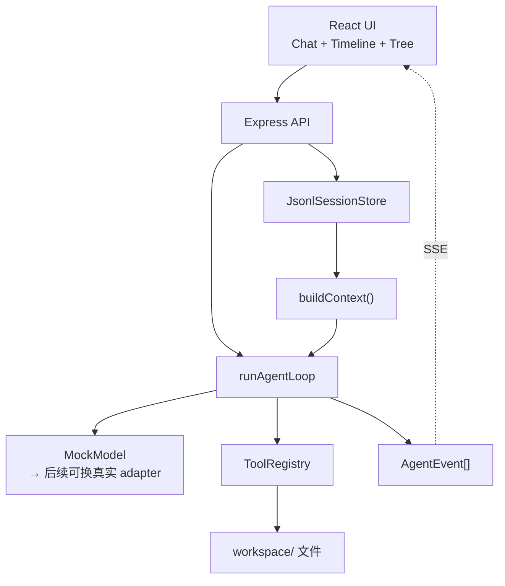


### 6.1 准备脚手架

```bash
mkdir pi-agent-teaching && cd pi-agent-teaching
npm init -y && npm pkg set type=module
mkdir -p src/shared src/server/agent src/client workspace

npm install express react react-dom lucide-react \
  @vitejs/plugin-react concurrently vite tsx
npm install -D typescript @types/node @types/express \
  @types/react @types/react-dom
```

最小 `package.json` scripts：

```json
{
  "scripts": {
    "dev": "concurrently -k -n api,web -c cyan,green \"npm:dev:server\" \"npm:dev:web\"",
    "dev:server": "tsx watch src/server/index.ts",
    "dev:web": "vite --host 0.0.0.0 --port 5174",
    "typecheck": "tsc --noEmit"
  }
}
```

`vite.config.ts` 把 `/api/*` 代理到 Express：

```ts
import react from "@vitejs/plugin-react";
import { defineConfig } from "vite";
export default defineConfig({
  plugins: [react()],
  server: {
    port: 5174,
    proxy: { "/api": "http://localhost:4317" }
  }
});
```

### 6.2 Step 1：共享协议（地基）

**对应文件**：`src/shared/protocol.ts`

这一步只写类型，不写业务。所有后续模块都围绕同一组类型工作。

```ts
export type TextContent = { type: "text"; text: string };

export type ToolCallContent = {
  type: "toolCall";
  id: string;
  name: string;
  arguments: Record<string, unknown>;
};

export type Usage = { input: number; output: number; totalTokens: number };

export type UserMessage = {
  role: "user";
  content: TextContent[];
  timestamp: number;
};

export type AssistantMessage = {
  role: "assistant";
  content: Array<TextContent | ToolCallContent>;
  stopReason: "stop" | "toolUse" | "error" | "aborted";
  usage: Usage;
  timestamp: number;
  errorMessage?: string;
};

export type ToolResultMessage = {
  role: "toolResult";
  toolCallId: string;
  toolName: string;
  content: TextContent[];
  details?: unknown;
  isError: boolean;
  timestamp: number;
};

export type AgentMessage = UserMessage | AssistantMessage | ToolResultMessage;

export type ToolDefinition = {
  name: string;
  description: string;
  parameters: Record<string, unknown>;
};

export type ToolResult = {
  content: TextContent[];
  details?: unknown;
  terminate?: boolean;
};

export type SessionEntry =
  | { type: "session"; version: 1; id: string; timestamp: string; cwd: string }
  | { type: "message"; id: string; parentId: string | null; timestamp: string; message: AgentMessage }
  | { type: "compaction"; id: string; parentId: string | null; timestamp: string;
      summary: string; firstKeptEntryId: string; tokensBefore: number };

export type AgentEvent =
  | { type: "agent_start" }
  | { type: "agent_end"; messages: AgentMessage[] }
  | { type: "turn_start"; turn: number }
  | { type: "turn_end"; turn: number; message: AssistantMessage; toolResults: ToolResultMessage[] }
  | { type: "message_start"; message: AgentMessage }
  | { type: "message_update"; message: AssistantMessage; delta: string }
  | { type: "message_end"; message: AgentMessage }
  | { type: "tool_execution_start"; toolCallId: string; toolName: string; args: Record<string, unknown> }
  | { type: "tool_execution_end"; toolCallId: string; toolName: string; result: ToolResult; isError: boolean }
  | { type: "compaction"; summary: string; tokensBefore: number; firstKeptEntryId: string };
```

**验收**：`npm run typecheck` 通过。

### 6.3 Step 2：Loop + MockModel（心跳）

**对应文件**：`src/server/agent/{message,model,mockModel,loop}.ts`

只跑内存逻辑，不接 HTTP / JSONL。

`message.ts`：

```ts
import type { AgentMessage, AssistantMessage, TextContent, UserMessage } from "../../shared/protocol";

export const text = (t: string): TextContent => ({ type: "text", text: t });

export const createUserMessage = (input: string): UserMessage => ({
  role: "user",
  content: [text(input)],
  timestamp: Date.now(),
});

export const createAssistantMessage = (
  content: AssistantMessage["content"],
  stopReason: AssistantMessage["stopReason"] = "stop",
): AssistantMessage => ({
  role: "assistant",
  content,
  stopReason,
  usage: { input: 0, output: 0, totalTokens: 0 },
  timestamp: Date.now(),
});

export const messageText = (m: AgentMessage): string =>
  m.content.filter(b => b.type === "text").map(b => b.text).join("\n");
```

`model.ts` + `mockModel.ts`：

```ts
import type { AgentMessage, AssistantMessage, ToolDefinition } from "../../shared/protocol";
import { createAssistantMessage, messageText, text } from "./message";

export type CompleteInput = {
  systemPrompt: string;
  messages: AgentMessage[];
  tools: ToolDefinition[];
};

export interface TeachingModel {
  complete(input: CompleteInput): Promise<AssistantMessage>;
}

export class MockModel implements TeachingModel {
  async complete({ messages }: CompleteInput): Promise<AssistantMessage> {
    const last = messages[messages.length - 1];
    if (!last) return createAssistantMessage([text("还没有上下文。")]);

    if (last.role === "toolResult") {
      return createAssistantMessage([text(`我看到了工具结果：${messageText(last)}`)]);
    }

    if (last.role === "user" && /文件|列出/.test(messageText(last))) {
      return createAssistantMessage(
        [{ type: "toolCall", id: `call_${Date.now()}`, name: "list_files", arguments: { path: "." } }],
        "toolUse",
      );
    }

    return createAssistantMessage([text("教学版 Agent 收到你的问题。")]);
  }
}
```

`loop.ts` 主循环骨架：

```ts
for (let turn = 1; turn <= maxTurns; turn++) {
  emit({ type: "turn_start", turn });

  const assistant = await model.complete({ systemPrompt, messages: context, tools });
  context.push(assistant);
  newMessages.push(assistant);

  const toolCalls = assistant.content.filter(b => b.type === "toolCall");
  if (toolCalls.length === 0) {
    emit({ type: "agent_end", messages: newMessages });
    return { newMessages, events };
  }

  for (const call of toolCalls) {
    emit({ type: "tool_execution_start", toolCallId: call.id, toolName: call.name, args: call.arguments });
    let result: ToolResult, isError = false;
    try {
      const decision = await beforeToolCall?.(call);
      if (decision?.action === "block") {
        result = { content: [text(`Blocked: ${decision.reason}`)] };
        isError = true;
      } else {
        const args = decision?.action === "rewrite" ? decision.args : call.arguments;
        result = await toolRegistry.execute(call.name, args);
      }
    } catch (e) {
      result = { content: [text(String(e))] };
      isError = true;
    }
    emit({ type: "tool_execution_end", toolCallId: call.id, toolName: call.name, result, isError });

    const toolMsg: ToolResultMessage = {
      role: "toolResult",
      toolCallId: call.id,
      toolName: call.name,
      content: result.content,
      details: result.details,
      isError,
      timestamp: Date.now(),
    };
    context.push(toolMsg);
    newMessages.push(toolMsg);
  }
}
```

**验收**（最小 smoke test）：

```bash
npx tsx src/server/smoke.ts
# 预期输出:
# [ 'assistant', 'toolResult', 'assistant' ]
```

> 对照 Python 版：`pi-agents/01_loop.py` (最小 loop) + `pi-agents/02_tools.py` (加工具)。

### 6.4 Step 3：工具系统（让 Agent 能做事）

**对应文件**：`src/server/agent/tools.ts`

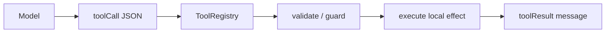


```ts
export class ToolRegistry {
  private readonly tools = new Map<string, RegisteredTool>();

  register(tool: RegisteredTool): void { this.tools.set(tool.name, tool); }

  definitions(): ToolDefinition[] {
    return Array.from(this.tools.values()).map(({ name, description, parameters }) =>
      ({ name, description, parameters }));
  }

  async execute(name: string, args: Record<string, unknown>): Promise<ToolResult> {
    const tool = this.tools.get(name);
    if (!tool) throw new Error(`Tool not found: ${name}`);
    return tool.execute(args);
  }
}
```

**路径保护**（这是最值得认真看的代码）：

```ts
function resolveInsideWorkspace(root: string, input: string): string {
  const target = resolve(root, input);
  const rootR = resolve(root);
  const rel = relative(rootR, target);
  if (rel.startsWith("..") || (rel === "" && input.includes(".."))) {
    throw new Error(`Path escapes workspace: ${input}`);
  }
  return target;
}
```

注册三个最小工具：


| 工具           | 用途                 | 安全边界                 |
| ------------ | ------------------ | -------------------- |
| `list_files` | 列出 `workspace/` 文件 | 仅 `workspace/`       |
| `read_file`  | 读 UTF-8 文本         | 路径必须在 `workspace/` 内 |
| `write_note` | 写 markdown 笔记      | 仅 `workspace/notes/` |


**验收**：

```ts
const reg = createToolRegistry(resolve(process.cwd(), "workspace"));
console.log(await reg.execute("list_files", { path: "." }));
console.log(await reg.execute("read_file", { path: "agent-notes.md" }));
```

### 6.5 Step 4：JSONL 会话（可恢复历史）

**对应文件**：`src/server/agent/sessionStore.ts`

按这个顺序实现：

```text
1. constructor(filePath, cwd) → 如果文件不存在，写 session header
2. appendMessage(message) → 生成 entry_N，parentId 指向当前 leaf
3. pathToLeaf() → 从 leaf 沿 parentId 回溯
4. buildContext() → 把 leaf 路径转成 AgentMessage[]
5. switchLeaf(id) → 支持分支切换
6. reset() → 删文件并重写 header
7. compactIfNeeded() → 最后再补
```

核心代码：

```ts
private leafId: string | null = null;
private byId = new Map<string, SessionEntry>();

async appendMessage(message: AgentMessage): Promise<string> {
  const id = this.nextId();
  const entry: SessionEntry = {
    type: "message", id,
    parentId: this.leafId,
    timestamp: new Date().toISOString(),
    message,
  };
  await this.appendEntry(entry);
  this.byId.set(id, entry);
  this.leafId = id;
  return id;
}

private pathToLeaf(): SessionEntry[] {
  if (!this.leafId) return [];
  const path: SessionEntry[] = [];
  let cur = this.byId.get(this.leafId);
  while (cur) {
    path.unshift(cur);
    cur = cur.parentId ? this.byId.get(cur.parentId) : undefined;
  }
  return path;
}
```

简化 compaction：

```ts
async compactIfNeeded(maxApproxTokens: number, keepRecentMessages: number) {
  const ctx = this.buildContext();
  const tokensBefore = estimateTokens(ctx);
  if (tokensBefore <= maxApproxTokens) return undefined;

  const entries = this.pathToLeaf().filter(e => e.type === "message");
  const kept = entries.slice(-keepRecentMessages);
  const toSummarize = entries.slice(0, -keepRecentMessages);
  const summary = summarizeEntries(toSummarize);

  return this.appendCompactionEntry(summary, kept[0].id, tokensBefore);
}
```

**验收**：连续提几次 prompt 后 `cat .teaching-agent/session.jsonl` 应该看到 `session` / `message` / 偶尔 `compaction`。

> 对照 Python 版：`pi-agents/03_session_tree.py` (会话树) + `pi-agents/04_compaction.py` (压缩)。

### 6.6 Step 5：Express API（orchestrator）

**对应文件**：`src/server/index.ts`

```mermaid
sequenceDiagram
  participant UI
  participant API as Express
  participant Store
  participant Loop

  UI->>API: POST /api/prompt
  API->>Store: append user message
  API->>Store: compactIfNeeded
  API->>Store: buildContext
  API->>Loop: runAgentLoop(context)
  Loop-->>API: newMessages + events
  API->>Store: append newMessages
  API-->>UI: SessionResponse
```


最小骨架：

```ts
const app = express();
app.use(express.json());

app.get("/api/session", (_req, res) => res.json(createResponse()));

app.post("/api/prompt", async (req, res) => {
  const input = (req.body?.text ?? "").trim();
  if (!input) return res.status(400).json({ error: "text is required" });

  await store.appendMessage(createUserMessage(input));
  await store.compactIfNeeded(1200, 8);

  const result = await runAgentLoop({
    systemPrompt,
    messages: store.buildContext(),
    tools: toolRegistry.definitions(),
    model,
    toolRegistry,
  });

  for (const msg of result.newMessages) await store.appendMessage(msg);
  res.json(createResponse());
});

app.listen(4317);
```

**注意顺序**：用户消息先 append 再 build context，否则模型看不到当前输入。

### 6.7 Step 6：流式 UI（让事件被看见）

把 `/api/prompt` 升级成 `POST /api/runs` + `GET /api/runs/:runId/events` (SSE)：

```mermaid
sequenceDiagram
  participant UI
  participant API
  participant Loop

  UI->>API: POST /api/runs { text }
  API-->>UI: { runId }
  UI->>API: GET /api/runs/:runId/events (SSE)
  API->>Loop: runAgentLoop(onEvent)
  Loop-->>API: message_update
  API-->>UI: SSE message_update
  Loop-->>API: tool_execution_start
  API-->>UI: SSE tool_execution_start
  Loop-->>API: tool_execution_end
  API-->>UI: SSE tool_execution_end
  Loop-->>API: agent_end
  API-->>UI: SSE run_done + full session
```


后端发送：

```ts
function sendEvent(res: Response, event: AgentEvent) {
  res.write(`event: ${event.type}\n`);
  res.write(`data: ${JSON.stringify(event)}\n\n`);
}
```

前端订阅：

```ts
const source = new EventSource(`/api/runs/${runId}/events`);
source.addEventListener("message_update", e => appendDelta(JSON.parse(e.data)));
source.addEventListener("tool_execution_start", e => markToolRunning(JSON.parse(e.data)));
source.addEventListener("run_done", e => syncFromServer(JSON.parse(e.data)));
```

React 状态建议：


| 状态                   | 说明                                 |
| -------------------- | ---------------------------------- |
| `draftAssistantById` | 正在生成的 assistant 消息                 |
| `runningTools`       | `Record<toolCallId, ToolState>`    |
| `messages`           | 已完成消息                              |
| `runStatus`          | `idle / running / error / aborted` |


### 6.8 Step 7：接入真实模型（替换 MockModel）

只需要让真实 adapter 实现 `TeachingModel` 接口，**Loop、工具、会话都不用改**。

```mermaid
flowchart LR
  A["OpenAI/Anthropic API response"] --> B["toTeachingAssistantMessage()"]
  B --> C["AssistantMessage"]
  C --> D["runAgentLoop contract"]
  E["ToolResultMessage"] --> F["provider tool message"]
  F --> A
```


OpenAI-compatible 适配函数：

```ts
function toTeachingAssistantMessage(message, finishReason): AssistantMessage {
  const toolCalls = (message.tool_calls ?? []).map(c => ({
    type: "toolCall",
    id: c.id,
    name: c.function.name,
    arguments: safeJsonParse(c.function.arguments),
  }));

  return {
    role: "assistant",
    content: [
      ...(message.content ? [{ type: "text", text: message.content }] : []),
      ...toolCalls,
    ],
    stopReason: finishReason === "tool_calls" || toolCalls.length > 0 ? "toolUse" : "stop",
    usage: { input: 0, output: 0, totalTokens: 0 },
    timestamp: Date.now(),
  };
}
```

ToolResultMessage → provider 格式：

```ts
{
  role: "tool",
  tool_call_id: toolMsg.toolCallId,
  content: textContentToString(toolMsg.content),
}
```

#### 流式 delta 拼装注意

```mermaid
flowchart TD
  A["delta.content"] --> B["append text buffer"]
  C["delta.tool_calls[i].function.name"] --> D["remember tool name"]
  E["delta.tool_calls[i].function.arguments"] --> F["append argument buffer"]
  B --> G["emit message_update"]
  D --> G
  F --> G
  G --> H{"finish_reason?"}
  H -->|"tool_calls"| I["emit AssistantMessage with toolCall blocks"]
  H -->|"stop"| J["emit AssistantMessage with text blocks"]
```


**坑**：tool arguments 在流式下是分段 JSON 字符串，**绝对不能每个 delta 都 `JSON.parse`**。先按 `tool_call.id/index` 累积，finish 后再一次性 parse。

#### 错误与 abort 收尾


| 场景                  | adapter 应该返回                               |
| ------------------- | ------------------------------------------ |
| HTTP 401/429/500    | `stopReason: "error"`，`errorMessage` 写明状态码 |
| tool args JSON 解析失败 | `isError: true` 的 tool result，让模型修正        |
| 用户 abort            | `stopReason: "aborted"`，停止后续工具执行           |
| 网络断流                | 已累积文本作为 partial，最终发 `message_end` 或错误事件    |


> 对照 Python 版：`pi-agents/05_openai_compatible.py` 就是一个完整的最小 adapter（默认走 litellm-staging 代理，模型 `gpt-5-mini`）。

### 6.9 Step 8：上下文压缩（生存机制）

如果第 6.5 步只做了字符级近似压缩，这一步把它逼近真实 Pi：


| 教学版当前         | 升级目标                                   |
| ------------- | -------------------------------------- |
| 按字符长度估算       | 按 assistant.usage 的真实 token + 估算追加     |
| 固定保留最近 N 条    | 按 `keepRecentTokens` 向前累积              |
| 不区分 cut point | 跳过 `toolResult` 切点                     |
| 摘要只存 summary  | 加 `details`：被读/被改的文件列表                 |
| 单次压缩          | 处理 reentry（从前一次 `firstKeptEntryId` 接续） |


最小升级：

```ts
async compactIfNeeded({
  reserveTokens = 16384,
  keepRecentTokens = 20000,
  contextWindow,
}: CompactOptions) {
  const ctx = this.buildContext();
  const tokens = estimateTokens(ctx);
  if (tokens <= contextWindow - reserveTokens) return;

  const cutPoint = chooseCutPoint(ctx, keepRecentTokens);
  // 保证 cutPoint 前是 user / assistant / bashExecution / branch_summary
  // 不允许切在 toolResult 上
  const toSummarize = ctx.slice(0, cutPoint);
  const kept = ctx.slice(cutPoint);

  const summary = await summarizer.summarize(toSummarize, {
    readFiles: extractReadFiles(toSummarize),
    modifiedFiles: extractModifiedFiles(toSummarize),
  });

  await this.appendCompactionEntry({
    summary,
    firstKeptEntryId: getEntryId(kept[0]),
    tokensBefore: tokens,
    details: { readFiles, modifiedFiles },
  });
}
```

### 6.10 八步全景

```mermaid
flowchart LR
  S1["Step 1<br/>共享协议"] --> S2["Step 2<br/>Loop + MockModel"]
  S2 --> S3["Step 3<br/>工具系统"]
  S3 --> S4["Step 4<br/>JSONL 会话"]
  S4 --> S5["Step 5<br/>Express API"]
  S5 --> S6["Step 6<br/>SSE 流式 UI"]
  S6 --> S7["Step 7<br/>接入真实模型"]
  S7 --> S8["Step 8<br/>压缩生存机制"]
```


**每步完成都立刻 commit 一次**——Agent 项目的 bug 经常跨协议、loop、工具和存储，阶段提交能让你快速回到上一个可运行点。

---

## 7. 失败模式与防护清单

Agent 工程的难点不在 happy path，而在边界。这张表来自 Pi 真实运行经验：


| 失败模式                       | 症状                    | 最小保护                                             |
| -------------------------- | --------------------- | ------------------------------------------------ |
| 无限 tool call               | 模型一直调同一个工具            | `maxTurns` + 预算 + 重复工具检测                         |
| 工具输出过长                     | 下一轮 prompt 爆上下文       | 工具层截断 / 附件化 / compaction                         |
| 模型不调用工具                    | 让它读文件却凭空编造            | system prompt 明确工具职责 + UI 标出未使用工具                |
| 工具参数 JSON 错误               | provider 返回不可解析参数     | adapter 捕获 → `isError: true`                     |
| 工具不存在                      | 名字拼错 / 没注册            | registry 直接返回错误 toolResult                       |
| provider 超时/断流             | UI 一直 loading         | `AbortController` + 超时 + `stopReason: "aborted"` |
| 用户中途取消                     | 后端仍跑工具                | 请求 close 时 abort 模型和工具                           |
| 路径越界                       | 模型传 `../secret`       | 后端 workspace guard（不能只在前端做）                      |
| 并发提交                       | 两个 run 同时写 session    | per-session run lock 或队列                         |
| 压缩丢关键事实                    | 后续模型忘了刚改的文件           | 保留最近消息 + 记录文件 read/write details                 |
| 流式 tool args 提前 parse      | adapter 报 SyntaxError | 累积完整字符串后再 parse                                  |
| 工具结果只给前端                   | 模型下一轮不知道发生了什么         | 必须同时生成 `toolResult` message                      |
| compaction 切在 toolResult 上 | 模型看到孤儿工具结果            | cut point 规则：跳过 toolResult                       |


### 关键防护图谱

```mermaid
flowchart TB
  M["Model"] --> P1{"max turns?"}
  P1 -->|"超过"| Stop1["agent_end + guardrail message"]
  P1 -->|"未超"| TC{"toolCall?"}
  TC -->|"无"| End["normal stop"]
  TC -->|"有"| V1{"tool 存在?"}
  V1 -->|"否"| ToolErr["isError toolResult"]
  V1 -->|"是"| V2{"参数 schema 合法?"}
  V2 -->|"否"| ToolErr
  V2 -->|"是"| V3{"beforeToolCall allow?"}
  V3 -->|"block"| BlockErr["isError toolResult"]
  V3 -->|"rewrite"| Exec
  V3 -->|"allow"| Exec["execute"]
  Exec --> V4{"成功?"}
  V4 -->|"否"| ExecErr["isError toolResult"]
  V4 -->|"是"| V5["afterToolCall 截断/脱敏"]
  V5 --> Result["toolResult → context"]
  Result --> M
```


每一个 `isError: true` 都是"系统没崩，模型可以继续修正"——这就是协议化错误处理的核心价值。

---

## 8. 扩展方向

从教学版到生产级，沿着 Pi 的真实工程边界逐步扩展：

```mermaid
flowchart TB
  A["教学版 MockModel Agent"] --> B["provider adapter"]
  A --> C["tool permission hook"]
  A --> D["SSE streaming UI"]
  A --> E["session tree UI"]
  A --> F["真实 compaction"]
  A --> G["扩展系统"]
  B --> R1["真实模型 + 统一协议"]
  C --> R2["confirm / block / rewrite"]
  D --> R3["增量消息和工具事件"]
  E --> R4["分支导航 + branch summary"]
  F --> R5["token-aware + cut point + split turn"]
  G --> R6["自定义命令 / 注册工具 / 事件拦截"]
```


### 8.1 推荐实施顺序

1. **抽出 `TeachingModel` 接口** —— MockModel 和真实 adapter 都实现它
2. **加 `beforeToolCall`** —— 先支持 allow / block / rewrite
3. `**/api/prompt` → `/api/runs` + SSE** —— 前端从一次性响应升级为增量
4. **前端增量状态** —— `draftAssistantById` / `runningTools`
5. `**/api/branch` + 树 UI** —— 让 `id/parentId/leafId` 被看见
6. **branch summary + compaction details** —— 等有了树 UI 再补
7. **真实压缩边界** —— `reserveTokens` / `keepRecentTokens` / cut point rules
8. **扩展系统** —— 事件 hook + 注册工具/命令 + 持久化自己的 entry

### 8.2 工具权限的最小决策模型

```ts
type ToolDecision =
  | { action: "allow" }
  | { action: "block"; reason: string }
  | { action: "rewrite"; args: Record<string, unknown>; reason?: string }
  | { action: "confirm"; prompt: string };

type BeforeToolCall = (call: {
  id: string;
  name: string;
  arguments: Record<string, unknown>;
}) => Promise<ToolDecision>;
```

常见规则：


| 工具            | 规则示例                          |
| ------------- | ----------------------------- |
| `write_note`  | 文件名不能含 `secret` / 绝对路径 / `..` |
| `read_file`   | 大文件先截断 / 敏感文件直接 block         |
| `run_command` | `rm -rf`、`curl                |
| `web_fetch`   | 限制域名和响应大小                     |


> **权限不能只在前端做**。前端确认能改善体验，真正拦截必须在后端工具执行前完成。

---

## 9. 源码阅读路线

### 9.1 第一遍：抓主线

只追一条路径：**用户输入一句话，到磁盘里出现一条 session message**。

```mermaid
sequenceDiagram
  participant UI as CLI/TUI/RPC/SDK
  participant SDK as createAgentSession
  participant AS as AgentSession
  participant A as Agent
  participant L as runAgentLoop
  participant AI as streamSimple
  participant S as SessionManager

  UI->>SDK: 创建 session
  SDK->>AS: 注入 Agent / ResourceLoader / SessionManager
  UI->>AS: prompt(text)
  AS->>A: prompt(messages)
  A->>L: runAgentLoop(context, config)
  L->>AI: streamSimple(model, context)
  AI-->>L: AssistantMessageEvent
  L-->>A: AgentEvent
  A-->>AS: subscribe(listener)
  AS->>S: appendMessage(message)
```


第一遍**不要追扩展 hook**。先把主线打通。

### 9.2 读文件顺序


| 顺序  | 文件                                                  | 你要回答什么                                                |
| --- | --------------------------------------------------- | ----------------------------------------------------- |
| 1   | `packages/ai/src/types.ts`                          | Message / Tool / Context / AssistantMessageEvent 长什么样 |
| 2   | `packages/ai/src/stream.ts`                         | `streamSimple()` 如何驱动 provider                        |
| 3   | `packages/ai/src/providers/openai-responses.ts`     | 一个真实 adapter 如何处理 tool 和 stream                       |
| 4   | `packages/agent/src/types.ts`                       | AgentMessage / AgentTool / AgentEvent                 |
| 5   | `packages/agent/src/agent-loop.ts`                  | runLoop / streamAssistantResponse / executeToolCalls  |
| 6   | `packages/agent/src/agent.ts`                       | Agent 如何包 loop、维护状态和队列                                |
| 7   | `packages/coding-agent/src/core/sdk.ts`             | `createAgentSession()` 入口                             |
| 8   | `packages/coding-agent/src/core/agent-session.ts`   | `prompt()` preflight、事件订阅                             |
| 9   | `packages/coding-agent/src/core/session-manager.ts` | JSONL 读写、leaf、树导航                                     |
| 10  | `packages/coding-agent/src/core/resource-loader.ts` | 资源装配                                                  |
| 11  | `packages/coding-agent/src/core/extensions/`        | 扩展运行时                                                 |
| 12  | `packages/coding-agent/src/core/compaction/`        | 真实压缩边界                                                |


### 9.3 第二遍：扩展点地图


| 扩展点                       | 所在阶段                      | 用途                                  |
| ------------------------- | ------------------------- | ----------------------------------- |
| `input`                   | `AgentSession.prompt()` 前 | 改写或接管用户输入                           |
| `before_agent_start`      | 构造消息后、调用 Agent 前          | 注入 custom message / 改 system prompt |
| `before_provider_request` | 请求模型前                     | 修改 provider payload                 |
| `tool_call`               | 工具执行前                     | 审批、拦截、改参数                           |
| `tool_result`             | 工具执行后                     | 脱敏、截断、改结果                           |
| `session_before_compact`  | 压缩前                       | 自定义压缩策略                             |


### 9.4 五个不变量再验证一次

读源码到迷茫时，回到 §2 的五条对一下：


| 不变量                         | 在哪里看到                                                      |
| --------------------------- | ---------------------------------------------------------- |
| I1 模型 I/O 统一                | `packages/ai/` 所有 provider 适配                              |
| I2 Loop 不做 I/O              | `packages/agent/src/agent-loop.ts` 只接收 context/config/emit |
| I3 副作用经过 schema/hook/result | `agent-loop.ts` + `coding-agent/src/core/tools/`           |
| I4 会话是 entry tree           | `coding-agent/src/core/session-manager.ts`                 |
| I5 长上下文用摘要 entry            | `coding-agent/src/core/compaction/`                        |


只要某段代码在保护这些不变量，先理解它"为什么存在"，再看它"具体怎么写"。

---

## 10. 附录

### 10.1 本仓库教学版与真实 Pi 的对照


| 真实 Pi                                      | 教学版 (`pi-agents/`)                                 |
| ------------------------------------------ | -------------------------------------------------- |
| `pi-ai streamSimple()` + provider adapters | `MockModel.complete()` / `05_openai_compatible.py` |
| `Agent` + `runAgentLoop`                   | `runAgentLoop()` + in-memory context               |
| `AgentSession`                             | Express `/api/prompt` 里的 orchestrator              |
| `SessionManager`                           | `JsonlSessionStore`                                |
| `ResourceLoader`                           | 静态 system prompt + ToolRegistry                    |
| `ExtensionRunner`                          | 简化的 `beforeToolCall` hook                          |
| 多 entry 类型                                 | 只实现 `session` / `message` / `compaction`           |
| Skills 索引按需读                               | 不实现（扩展练习）                                          |
| Branch summary                             | 不实现（需要树 UI）                                        |


### 10.2 Python 教学 Demo 速查


| Demo                      | 主题                             | 是否需要真实 LLM |
| ------------------------- | ------------------------------ | ---------- |
| `01_loop.py`              | 最小 Agent Loop（流式事件）            | 否          |
| `02_tools.py`             | 工具调用：模型只产生 tool call，运行时执行     | 否          |
| `03_session_tree.py`      | 会话树：`parentId` + `leafId` 实现分支 | 否          |
| `04_compaction.py`        | 上下文压缩：摘要旧消息 + 保留最近 N 条         | 否          |
| `05_openai_compatible.py` | 接真实 LLM（OpenAI 兼容协议）           | **是**      |


### 10.3 三个常见误区与修正


| 误区                    | 后果               | 修正                                             |
| --------------------- | ---------------- | ---------------------------------------------- |
| "Loop 里直接判断 provider" | 每加一家模型 loop 要改一次 | 把 provider 差异锁在 adapter 里                      |
| "工具结果给前端就行"           | 模型下一轮不知发生了什么     | 必须生成 `toolResult` 消息进上下文                       |
| "压缩就是删旧消息"            | 失去审计能力、压缩后摘要无锚点  | append `CompactionEntry`，记录 `firstKeptEntryId` |


### 10.4 推荐阅读

- 本仓库 `pi-agents/docs/` 全套（特别是 `concepts/` 和 `source/`）
- Pi 官方文档：[https://pi.dev/docs/latest](https://pi.dev/docs/latest)
- Pi 源码：[https://github.com/earendil-works/pi](https://github.com/earendil-works/pi)
- 本仓库 Python 教学 demo：`pi-agents/01_loop.py` … `05_openai_compatible.py`

---

## 结语

从 0 到 1 搭一个 Agent，最难的不是写代码，而是**抓住正确的边界**：

1. **模型边界** —— provider 差异必须锁在 `pi-ai` 这一层
2. **副作用边界** —— 模型只能"请求"，本地才能"执行"
3. **持久化边界** —— Loop 不写磁盘，由会话层 append JSONL
4. **失败收敛边界** —— 一切异常变 `isError: true` 的 tool result，不让进程崩
5. **演进边界** —— 产品需求挂在事件 hook 上，不污染核心 Loop

如果你按 §6 的八步把教学版跑通，再把 §9 的源码读完，就具备了独立构建 coding agent 的核心能力——剩下的，是把 §8 的扩展方向按业务需要一项一项补齐。