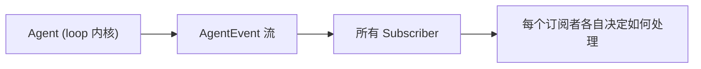
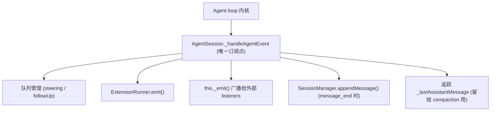
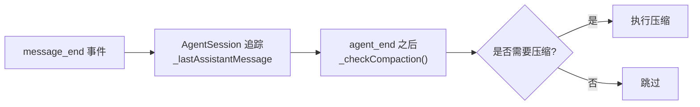
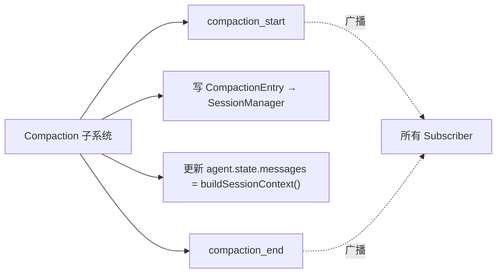
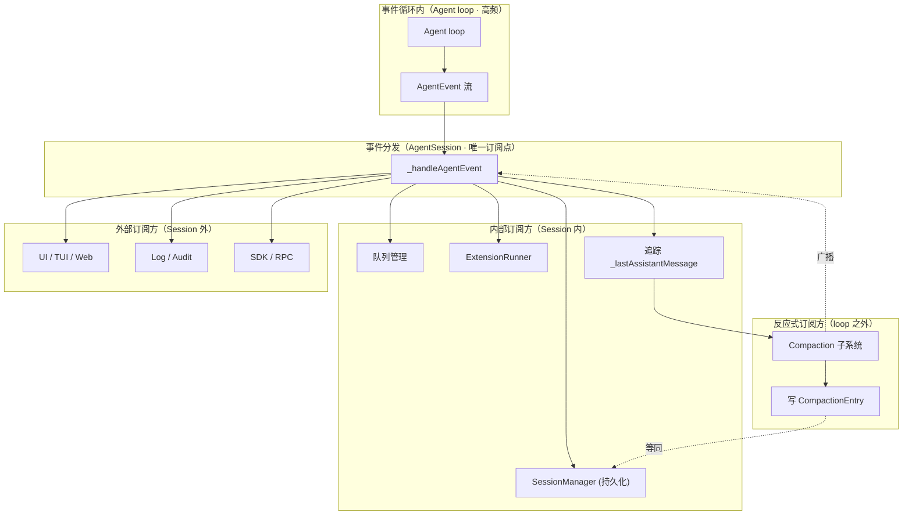

---

## title: AgentEvent 订阅模型 · Compaction 为何也是 subscriber
tags: [Pi, agent, harness-engineering, event-driven, compaction]
created: 2026-05-31
sources:
  - /Users/liangzhu/Documents/dev/pi/packages/agent/src/types.ts
  - /Users/liangzhu/Documents/dev/pi/packages/coding-agent/src/core/agent-session.ts
  - /Users/liangzhu/Documents/dev/pi/packages/coding-agent/src/core/compaction/

# AgentEvent 订阅模型 · Compaction 为何也是 subscriber

> 问题：Page-11 / Page-15 图里 `Subscriber` 框列出了 UI、Log、SDK、ExtensionRunner、SessionManager 之外，还放了一个 "Compaction 子系统"。它跟其它订阅者不是一回事——本文把这件事讲透：事件如何分发，Compaction 凭什么也算订阅方，它的输入/输出/时机分别是什么。

---

## 1. 一句话总结

**Agent 只暴露一个事件流（`AgentEvent`），所有下游消费者（包括 Compaction）都通过订阅这个流获取上下文变化的信号。Compaction 不是事件循环的一部分，它是事件的下游消费者——同时也是事件的反向生产者。**

记住三层关系：




Compaction 处于 `Subscriber` 这一层：它**读** AssistantMessage 的 `usage` 决定要不要压缩，**写** `CompactionEntry` 到 SessionManager，并**反向广播** `compaction_start` / `compaction_end` 让其它订阅者也能感知。

---

## 2. AgentEvent 全集

事件类型定义在 `packages/agent/src/types.ts`：


| 事件                      | 触发时机                           | 关键 payload                         |
| ----------------------- | ------------------------------ | ---------------------------------- |
| `agent_start`           | 整次 prompt() 调用开始               | —                                  |
| `agent_end`             | loop 完全停止（无更多 turn / followUp） | `messages: AgentMessage[]`         |
| `turn_start`            | 单次 LLM 调用即将发起                  | `turn: number`                     |
| `turn_end`              | 单次 LLM 响应处理完（含 tool 执行）        | `message`, `toolResults[]`         |
| `message_start`         | 某条消息开始流式生成                     | `message`                          |
| `message_update`        | 某条消息流式增量                       | `message`, `delta`                 |
| `message_end`           | 某条消息完整固化                       | `message`                          |
| `tool_execution_start`  | 单个 tool 即将执行                   | `toolCallId`, `toolName`, `args`   |
| `tool_execution_update` | 单个 tool 输出 partial result      | `toolCallId`, `partialResult`      |
| `tool_execution_end`    | 单个 tool 执行完毕                   | `toolCallId`, `result`, `isError`  |
| `compaction_start`      | 自动压缩开始（由 AgentSession 发出）      | `reason: "overflow" | "threshold"` |
| `compaction_end`        | 自动压缩结束                         | `result`, `aborted`, `willRetry`   |


**两个不变量**：

- `**message_end` 是"消息固化"的唯一信号**——所有持久化和压缩判断都挂在它上面
- `**agent_end` 是"本次 prompt 结束"的唯一信号**——但 AgentSession 在它之后还可能触发 compaction 然后 `agent.continue()`

---

## 3. 订阅模型的物理结构

Pi 的事件分发**只有一个真正的订阅点**：`Agent.subscribe(listener)`。AgentSession 在构造时调一次：

```ts
// agent-session.ts: ~336
this._unsubscribeAgent = this.agent.subscribe(this._handleAgentEvent);
```

之后 `_handleAgentEvent` 内部再做 **fan-out**，把同一个 AgentEvent 分发给所有真正的下游消费者：




注意：所有 Subscriber 的"分发"是在 AgentSession 这一层完成的，**Agent 自己不知道下游有谁**。这正是不变量 I2（Loop 不做产品 I/O）的体现。

### 3.1 runAgentLoop vs runtime · 三层边界

| 层 | 职责 | 视野范围 |
| --- | --- | --- |
| **runAgentLoop**（主循环） | 读内存数组 → 调模型 → 处理工具 → 回写 → 继续/退出 | 不知道订阅者、不知道磁盘、不知道自己被谁包着 |
| **AgentSession**（会话容器） | 持有主循环 + 会话树 + 订阅总线；事件分发与 compaction 检查 | 不知道自己是不是"当前会话" |
| **runtime**（会话调度层，进程级） | 持有"当前会话"指针；打开/新建/派生分支时整体销毁重建 | 不进主循环内部 |

层级：`runtime ⊃ AgentSession ⊃ runAgentLoop`。后文讲的 "loop 之外" 全部指 **AgentSession 这一层**（不到 runtime）——compaction 检查、用户消息广播、`_lastAssistantMessage` 追踪都属于这一层。用户输入接收、外部订阅消费、会话切换在主循环之外；compaction 是这"之外"里唯一不换执行体的特例。

---

## 4. 谁是 subscriber

按"事件接收方"分类，subscriber 有两组：

### 4.1 内部订阅方（Session 内）


| 订阅方                        | 监听哪些事件                                     | 干什么                                                           |
| -------------------------- | ------------------------------------------ | ------------------------------------------------------------- |
| 队列管理                       | `message_start` (user role)                | 用户消息进入 transcript 时，从 steering / followUp 队列中移除               |
| ExtensionRunner            | 全部（按扩展声明的 hook 名映射）                        | 转发给扩展，扩展可改写参数 / 拦截 / 注入 custom message                        |
| SessionManager             | `message_end`                              | 把 message 序列化为 JSONL entry，append 到磁盘                         |
| `_lastAssistantMessage` 追踪 | `message_end` (role=assistant)             | 记录最新一条 AssistantMessage，留给 compaction 决策用                     |
| **Compaction 子系统**         | **agent_end 之后回看 `_lastAssistantMessage`** | **判断是否需要压缩；若是则写 CompactionEntry + 反向广播 compaction_start/end** |


### 4.2 外部订阅方（Session 外）

外部订阅方通过 `AgentSession.subscribe(listener)` 注册（这是 `_emit` 广播的目标）：


| 订阅方           | 典型用途                  |
| ------------- | --------------------- |
| TUI / Web UI  | 流式渲染消息、tool 调用动画、状态条  |
| Log / Audit   | 完整事件流落地，供后续审计 / 重放    |
| SDK / RPC 客户端 | 把事件转 JSON-line 推给上层应用 |


外部订阅方**只读**，不能改写事件、不能阻止动作。要改写动作必须走 ExtensionRunner 的 hook（before/after），不在 Subscriber 层。

---

## 5. Compaction 为什么是 subscriber

这是本文的核心问题。Compaction 看起来像个独立子系统，为什么要画进 Subscriber 框？

### 5.1 原理：Compaction 的输入 = 事件流的副产物

Compaction 的决策依赖三个数据：

1. **当前 context 的 token 规模** —— 从最近一条 `AssistantMessage.usage` 读出
2. **最新一条 AssistantMessage 的 `stopReason`** —— 判断是否触发了"上下文溢出"错误
3. **整段 transcript** —— 用来生成 summary

这三个数据**全部来自 message_end 事件**。Compaction 不能脱离事件流自己拿到这些信息。




### 5.2 推论：触发时机不在 loop 内，在 loop 之外

`_checkCompaction()` 在 `_handlePostAgentRun()` 中调用，这个方法在 `agent.prompt()` 返回**之后**、`agent.continue()` 之前执行：

```ts
// agent-session.ts: ~929
private async _runAgentPrompt(messages) {
  await this.agent.prompt(messages);          // loop 跑完
  while (await this._handlePostAgentRun()) {  // 检查是否需要 compaction / retry
    await this.agent.continue();              // 如果有事要做,继续 loop
  }
}
```

`_handlePostAgentRun()` 三个 case：

```ts
// agent-session.ts: ~940
private async _handlePostAgentRun(): Promise<boolean> {
  const msg = this._lastAssistantMessage;
  if (!msg) return false;

  if (this._isRetryableError(msg) && (await this._prepareRetry(msg))) return true;
  if (await this._checkCompaction(msg)) return true;     // ← 压缩在这里触发
  return this.agent.hasQueuedMessages();
}
```

**所以 Compaction 是"事件循环之外的反应式动作"**：

- loop 跑完一轮 (`agent_end` 已经触发)
- AgentSession 才回看刚才追踪的 `_lastAssistantMessage`
- 判断后决定是否压缩，然后让 loop continue

### 5.3 两种触发原因


| 原因          | 触发条件                                                            | 行为                                         |
| ----------- | --------------------------------------------------------------- | ------------------------------------------ |
| `overflow`  | LLM 返回 context overflow 错误（`stopReason: "error"`）               | 立刻压缩 + 重试（remove 最后一条错误 assistant message） |
| `threshold` | `shouldCompact(contextTokens, contextWindow, settings)` 返回 true | 压缩，但不重试                                    |


`contextTokens` 来源：

- 正常情况：`assistantMessage.usage.totalTokens` 直接读
- 错误情况：从历史 `messages` 估算（因为错误响应没有 usage 数据）

### 5.4 Compaction 的输出：它自己也是事件生产者

Compaction 不止"消费"事件，还"广播"事件：




也就是说，Compaction 完成后，其它订阅者（UI / Log）会收到 `compaction_start` / `compaction_end` 事件——它对其它订阅者来说**也是事件源**。这就是为什么图上把它和 Subscriber 画在一起：它既消费事件，也产生事件。

### 5.5 完整 lifecycle

把所有动作串起来：

```mermaid
sequenceDiagram
  participant Loop as Agent loop
  participant AS as AgentSession
  participant SM as SessionManager
  participant Comp as Compaction 子系统
  participant Subs as 其它 Subscriber

  Loop->>AS: message_end (assistant)
  AS->>SM: appendMessage(assistant)
  AS->>AS: _lastAssistantMessage = assistant
  AS->>Subs: 广播 message_end

  Loop->>AS: agent_end
  AS->>Subs: 广播 agent_end

  Note over AS: 进入 _handlePostAgentRun()
  AS->>Comp: _checkCompaction(_lastAssistantMessage)
  Comp->>Comp: 读 usage,判断 shouldCompact

  alt 需要压缩
    Comp->>Subs: 广播 compaction_start
    Comp->>Comp: prepareCompaction + compact (调 LLM 生成 summary)
    Comp->>SM: appendCompaction(summary, firstKeptEntryId, tokensBefore)
    Comp->>AS: agent.state.messages = buildSessionContext().messages
    Comp->>Subs: 广播 compaction_end
    Comp-->>AS: return true (告知需要 continue)
    AS->>Loop: agent.continue()
  else 不需要压缩
    Comp-->>AS: return false
  end
```


### 5.6 一句话回答"为什么是 subscriber"

> **Compaction 不在 loop 里写消息、不在 loop 里读消息，它在 loop 之外通过事件流的副产物（`_lastAssistantMessage`）感知 context 状态，决定是否要压缩，并通过事件流向其它订阅者宣告自己的动作。它消费事件、产生事件——所以是 Subscriber 这一层的一员。**

---

## 6. 共同遵守的不变量

所有 subscriber 都遵守这几条规则，Compaction 也不例外：


| 不变量            | 含义                                                                        |
| -------------- | ------------------------------------------------------------------------- |
| **事件是只读投影**    | Subscriber 不能改写事件本身；要改写必须走 ExtensionRunner 的 hook                         |
| **消息是事实来源**    | Subscriber 不能假设事件包含完整状态——需要消息时从 `state.messages` 取                        |
| **失败收敛，不抛异常**  | 单个 subscriber 处理失败不能阻塞其它订阅方；Compaction 失败只发 compaction_end 带 errorMessage |
| **同一事件可被多次消费** | Agent 不知道下游有几个订阅者；任何订阅者的处理都不影响事件传递                                        |


---

## 7. 源码定位与读图对照

### 7.1 关键文件


| 文件                                                        | 关键内容                                                    |
| --------------------------------------------------------- | ------------------------------------------------------- |
| `packages/agent/src/types.ts`                             | `AgentEvent` 类型定义                                       |
| `packages/agent/src/agent.ts`                             | `Agent.subscribe()` / `_emit()` 实现                      |
| `packages/coding-agent/src/core/agent-session.ts:336`     | AgentSession 注册唯一订阅者                                    |
| `packages/coding-agent/src/core/agent-session.ts:469`     | `_handleAgentEvent`：fan-out 入口                          |
| `packages/coding-agent/src/core/agent-session.ts:940`     | `_handlePostAgentRun`：触发 compaction 检查                  |
| `packages/coding-agent/src/core/agent-session.ts:1869`    | `_runAutoCompaction`：实际压缩流程                             |
| `packages/coding-agent/src/core/compaction/compaction.ts` | `compact()` / `prepareCompaction()` / `shouldCompact()` |


### 7.2 与 Page-11 的对照


| 图上元素                                          | 对应实现                                                   |
| --------------------------------------------- | ------------------------------------------------------ |
| Subscriber 框里的 "UI / TUI / Web 实时渲染"          | 外部订阅方，通过 `AgentSession.subscribe()` 注册                 |
| Subscriber 框里的 "Log / Audit"                  | 同上，是外部 listeners                                       |
| Subscriber 框里的 "SDK / RPC"                    | 同上                                                     |
| Subscriber 框里的 "ExtensionRunner hook"         | `_emitExtensionEvent()` 内部转发                           |
| Subscriber 框里的 "SessionManager appendMessage" | `_handleAgentEvent` 里 message_end 分支                   |
| **Subscriber 框里的 "Compaction 子系统"**           | `**_handlePostAgentRun` 调 `_checkCompaction`，对应本文 §5** |


---

## 8. 一图回望




**最关键的一条线**：图最右下角那条 `Compaction → 广播 → _handleAgentEvent` 的虚线——它表达了 Compaction **既订阅事件、又产生事件**的双重身份。这就是它出现在 Subscriber 框的根本原因。

---

## 结语

把 Compaction 视为 Subscriber 的核心收益：

1. **统一心智模型** —— 不需要给 Compaction 单独造一个"管理者"概念，它就是事件流的下游
2. **可替换** —— 任何想替代 Compaction 策略的扩展，只要订阅相同事件 + 写相同 entry 类型即可
3. **可观察** —— Compaction 的所有动作都通过事件外溢，UI / Log / 审计天然能感知

如果以后看到"X 是 subscriber"这种说法，先问三个问题：

- 它消费哪些事件？
- 它的副作用写到哪？
- 它是否反向广播新事件？

三个问题答清楚，就分清了 X 在事件驱动架构里的位置。