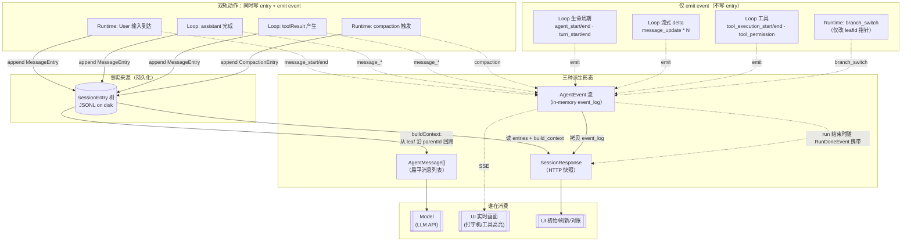

#### protocol

##### ContentBlock

- TextContent
  - type
  - text
- ToolCallContent
  - type
  - id
  - name
  - arguments

##### AgentMessage

- UserMessage
  - role
  - content
  - timestamp
- AssistantMessage
  - role
  - content
  - timestamp
  - stopReason
    - stop
    - toolUse
    - error
    - aborted
  - usage
    - input
    - output
    - totalTokens
  - errorMessage?
- ToolResultMessage
  - role
  - content
  - timestamp
  - toolCallId
  - toolName
  - isError
  - details?

##### ToolDefinition

- name
- description
- parameters

##### ToolResult

- content
- details?
- terminate?

##### SessionEntry

- SessionHeader
  - type
  - version
  - id
  - timestamp
  - cwd
- MessageEntry
  - type
  - id
  - parentId
  - timestamp
  - message
- CompactionEntry
  - type
  - id
  - parentId
  - timestamp
  - summary
  - firstKeptEntryId
  - tokensBefore

##### AgentEvent

- 生命周期
  - AgentStart
    - type
  - AgentEnd
    - type
    - messages
  - TurnStart
    - type
    - turn
  - TurnEnd
    - type
    - turn
    - message
    - toolResults
- 消息流
  - MessageStart
    - type
    - message
  - MessageUpdate
    - type
    - message
    - delta
  - MessageEnd
    - type
    - message
- 工具
  - ToolExecutionStart
    - type
    - toolCallId
    - toolName
    - args
  - ToolExecutionEnd
    - type
    - toolCallId
    - toolName
    - result
    - isError
  - ToolPermission
    - type
    - toolCallId
    - toolName
    - action
      - allow
      - block
      - rewrite
    - originalArgs
    - args
    - reason?
- 会话
  - BranchSwitch
    - type
    - leafId
  - Compaction
    - type
    - summary
    - tokensBefore
    - firstKeptEntryId

##### HTTP 响应

- SessionResponse
  - sessionId
  - leafId
  - messages
  - events
  - tools
  - entries
- CreateRunResponse
  - runId
- RunStreamEvent
  - AgentEvent
  - RunDoneEvent
    - type
    - session
  - RunErrorEvent
    - type
    - error
    - session

##### ToolDecision

- AllowDecision
  - action
  - reason?
- BlockDecision
  - action
  - reason
- RewriteDecision
  - action
  - args
  - reason?

---

##### 数据流与关系

###### 三种形态、三种受众


| 数据                | 形态                   | 受众             | 生命周期         | 是否持久化                             |
| ----------------- | -------------------- | -------------- | ------------ | --------------------------------- |
| `SessionEntry`    | 树（JSONL append-only） | Runtime 自己     | 永久           | 是（**唯一事实来源**）                     |
| `AgentMessage[]`  | 扁平列表（从树 walk 出来）     | **Model**      | 每轮 Loop 重建一次 | 否                                 |
| `AgentEvent`      | 流（SSE 增量）            | **UI 实时画面**    | 一次 run 内     | 否（in-memory `event_log`，重启即丢）     |
| `SessionResponse` | 快照（HTTP JSON）        | **UI 初始 / 对账** | 一次请求         | 否（每次请求由 `_session_snapshot()` 重算） |


核心心智：`SessionEntry` 是 **源**；`AgentMessage[]` / `AgentEvent` / `SessionResponse` 都是从源派生出来的 **投影**，面向不同受众。

> Model 并不直接读 `SessionEntry`。中间隔着 `buildContext()`：从 `leafId` 沿 `parentId` 回溯到根，把路径上的 `MessageEntry.message` 抽出来、反转、拼成 `AgentMessage[]`，这才是给 Model 的输入（`teaching-agent/server/session_store.py:104-144`）。

> 「派生」是**概念层**的表述：三种投影承载的都是同一组事实。**实现层**上 Runtime 不是从 JSONL 反读出 event，而是在 `_execute_prompt_locked()` 里用同一个消息对象**并行**调用 `store.append_message()` + `emit()`（`teaching-agent/server/main.py:248-280`），关系图里的虚线 `同时 emit` 表达的就是这一点。

###### 关系图




###### 端到端时序：一次 prompt 走一遍

```mermaid
sequenceDiagram
  autonumber
  participant UI
  participant API as Express
  participant SE as SessionEntry (JSONL)
  participant Loop
  participant Model

  UI->>API: POST /api/runs { text: "列出文件" }
  API->>SE: append MessageEntry(UserMessage)
  API->>SE: buildContext() 从 leaf 回溯
  SE-->>API: AgentMessage[]
  API->>Loop: runAgentLoop(messages)

  Loop->>Model: AgentMessage[] (含 user)
  Model-->>Loop: stream tokens
  Loop-->>UI: SSE: MessageStart / MessageUpdate*N / MessageEnd
  Note right of Loop: ↑ AgentEvent 流，<br/>UI 实时打字机
  Loop->>SE: append MessageEntry(AssistantMessage)
  Note right of SE: ↑ 落盘，事实来源更新

  Loop->>Loop: 发现 toolCall
  Loop-->>UI: SSE: ToolExecutionStart
  Loop->>Loop: 执行 list_files
  Loop-->>UI: SSE: ToolExecutionEnd
  Loop->>SE: append MessageEntry(ToolResultMessage)

  Loop->>SE: buildContext() 重建（含新 toolResult）
  SE-->>Loop: AgentMessage[]
  Loop->>Model: 下一轮
  Model-->>Loop: "这是文件列表..."
  Loop-->>UI: SSE: MessageStart/Update/End
  Loop->>SE: append MessageEntry(AssistantMessage)

  Loop-->>UI: SSE: AgentEnd
  API->>SE: 序列化整树
  SE-->>API: SessionResponse
  API-->>UI: SSE: RunDoneEvent { session }
  Note right of UI: ↑ 用快照对账，<br/>修正可能漏掉的 event
```


###### 实现细节速查（按需查阅）


| 关注点                                         | 源码位置                                         | 说明                                                                                   |
| ------------------------------------------- | -------------------------------------------- | ------------------------------------------------------------------------------------ |
| 「写 entry + emit event」如何配对                  | `main.py:248-280` `_execute_prompt_locked()` | Runtime 在每个动作里手动调两次                                                                  |
| `SessionResponse` 怎么拼出来                     | `main.py:117-125` `_session_snapshot()`      | `messages` 来自 `build_context()`、`entries` 来自 JSONL、`events` 来自 in-memory `event_log` |
| Loop 是否会碰持久化                                | `loop.py:40-57` 签名                           | 无 `store` 参数，只接 `on_event` 回调（呼应不变量 I2）                                              |
| `RunDoneEvent.session` 与 `GET /api/session` | `main.py:230`、`main.py:128-130`              | 同一个 `_session_snapshot()`，因此「run 结束对账快照」与「页面初次打开快照」是同一对象的两次序列化                       |
| `branch_switch` event 为何没有新 entry           | `main.py:151-154`                            | 切 leaf 只改指针，不产生新事实；event 仅作 UI 通知                                                    |
| 重启后 `events` 字段为何为空                         | `event_log` 是模块级 list                        | 进程重启即清零；`messages` / `entries` 从 JSONL 完整恢复                                          |


###### 一句话总结

`SessionEntry` 是真相，`AgentMessage[]` 是给模型的投影，`AgentEvent` + `SessionResponse` 是给 UI 的两种投影 —— 前者负责「实时增量」，后者负责「对齐全量」。任何模块要做新功能，先问：它该写到事实来源里（落 entry），还是只是某一种投影（emit event / 拼 response）？答案决定了它该改哪一层。