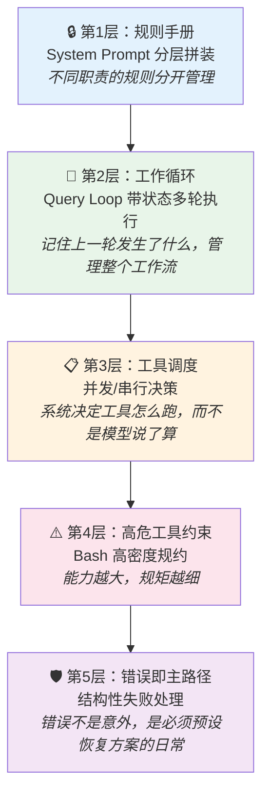
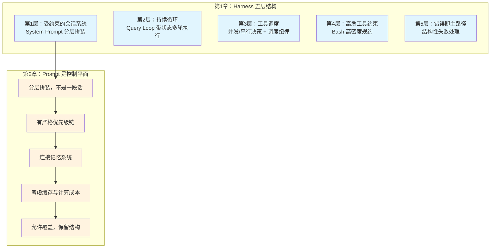

# Harness Engineering 学习笔记：序言 & 第 1-2 章

> 来源：《Harness Engineering — 以 Claude Code 为样本》(@wquguru, 2026.04.01)
> 在线阅读：harness-books.agentway.dev/book1-claude-code

---

## 导读：这本书在讲什么

这本书的核心关注点不是"模型会不会写代码"，而是——

> **一个会写代码的模型被放进终端、仓库和团队流程以后，怎样才不会把系统带偏。**

它不是产品功能介绍，也不是源码注释汇编。它关注的是 Claude Code 如何把**不稳定的模型**收束进**可持续运行的工程秩序**，让控制面、主循环、工具权限、上下文治理、恢复路径、多 agent 验证与团队制度长成一套完整骨架。

### 三个阅读前提

1. **重点不在模型能力**，而在 harness 如何组织约束与执行
2. **重点不在函数逐条解释**，而在运行时结构为什么必须这样长出来
3. **重点不在个人技巧**，而在这些结构怎样变成团队可以复用的制度

### 什么是 Harness Engineering

Harness 可以理解为**一组持续生效的控制结构**，用来约束模型在工程环境中的行为边界。对 AI coding agent 来说，没有约束的能力只会扩大事故半径。

本书要做两件事：

1. **讲结构**：基于 Claude Code 源码，把真正决定系统可靠性的结构讲清楚——为什么上下文治理必须成为主路径，为什么多 agent 解决的是职责分区，为什么团队制度必须挂到生命周期节点上
2. **提原则**：把实现背后的判断提炼成更一般的工程原则，不随具体代码版本变化而失效

### 六条核心判断


| 原则                    | 含义                       |
| --------------------- | ------------------------ |
| 错误路径要按主路径设计           | 失败不是例外，是日常状态             |
| 验证必须进入完成定义            | 没经过验证的输出不算完成             |
| 权限是系统器官，而不是附属功能       | 权限控制嵌入系统核心，不是事后补丁        |
| 上下文是资源，不是垃圾桶          | context window 有限，必须主动治理 |
| 多 agent 要靠角色分离，不靠人海战术 | 多 agent 的价值在于职责拆分，不是数量堆叠 |
| 团队制度比个人技巧重要           | 可复用的制度 > 不可复制的个人经验       |


---

## 序言：Harness、终端与工程约束

### 为什么"agent"这个词容易产生误导

这些年人们喜欢把会写代码的模型叫作 agent。这个词带着乐观色彩，仿佛只要模型能读仓库、调工具、写 patch，它就可以在工程环境里独立行动。

但工程环境有明确后果——终端、文件系统和 Git 历史都不是抽象空间，任何改动都会留下痕迹。

### 从"回答"到"执行"的质变

- **只输出文本的模型**：出错时主要带来理解成本
- **能运行命令、写文件、访问网络、修改仓库的模型**：出错后留下的是**执行结果**——目录会变化，进程会中断，配置会损坏，历史会变得难以追踪

到了这一步，核心问题不再是模型是否足够聪明，而是**系统是否提供了足够约束**。

### Harness 的基本立场

> **Prompt 决定它怎么说话，Harness 决定它怎么做事。**

这里说的 harness，不是一层附属工具，也不是对模型能力的情绪化防御。它是**模型进入工程环境的前提**。缺少这层约束，风险最终会转移给用户、团队和未来的维护者。

### Claude Code 为什么值得研究

Claude Code 在实现上保持了明确的工程克制，没有做乐观假定：


| 设计决策                                         | 原因                   |
| -------------------------------------------- | -------------------- |
| 用 query loop 管理状态                            | 没有假定模型会持续正确          |
| 用权限和调度约束工具                                   | 没有假定调用天然安全           |
| 引入 memory、CLAUDE.md、compact 和 session memory | 没有假定上下文越多越好          |
| 为 prompt too long、max output tokens 等设计恢复路径  | 没有把错误视为偶发事件          |
| 把 synthesis 和 verification 单独拆开              | 没有把多 agent 直接等同于更强能力 |


这一整套东西，合起来才是 agent。模型只是 agent 里最会说话、也最不稳定的那个部件。

---

## 第 1 章：为什么需要 Harness Engineering

这一章的核心问题用一句话概括：**当一个 AI 模型能在你的电脑上跑命令、改文件、操作 Git 的时候，谁来确保它不搞砸？** 答案不是"用更聪明的模型"，而是"给它套上一整套管理结构"——这就是 Harness Engineering。

下面通过 Claude Code 的五层管理结构，具体看看这套"笼头"长什么样。

### 1.1 问题在于让模型别乱来

先看一个对比，理解为什么 agent 需要 harness：


| 场景       | 纯聊天模型（如 ChatGPT 网页版） | 能执行操作的 agent（如 Claude Code）    |
| -------- | -------------------- | ------------------------------ |
| 说错一句话    | 你看了觉得不对，忽略就好         | 它可能已经把错误代码写进文件了                |
| "帮我整理代码" | 输出一段文本，你自己复制粘贴       | 直接改了你的文件，可能还 commit 了          |
| 犯了个逻辑错误  | 你纠正它，它重新回答           | 错误已经执行——目录结构变了、进程挂了、Git 历史被污染了 |


一句话总结：**纯聊天模型的错误是"说错话"，agent 的错误是"做错事"。** 做错事的后果要严重得多，因为文件系统、终端、Git 历史都是有记忆的，改了就留痕。

所以问题的重点一直是：**怎样给 agent 一套管理制度，让它在做事之前、做事过程中、做错事之后都受到约束**。这就是 Harness——不是一个单一功能，而是一整套制度化的控制结构。

### 1.2 第一层：规则手册——System Prompt 不是一段话，而是分层规章

**日常类比**：一个新员工入职，你不会只跟他说"你是一个优秀的工程师，好好干"。你会给他看公司规章制度、团队开发规范、项目 README、代码审查清单……这些文件各管各的领域，层层叠加。

Claude Code 的 system prompt 就是这样组织的：

```
第一段（prompts.ts:175）：你是谁，你的职责是什么
   → 类比：入职通知书——"你是一个交互式 agent，用工具帮用户完成软件工程任务"

第二段（prompts.ts:186）：系统级规则
   → 类比：公司安全规章——"用户能看到什么、工具调用要审批、被拒绝后不准重复骚扰"

第三段（prompts.ts:199）：做任务时的工程约束
   → 类比：代码审查清单——"不要自作主张加功能、不要隐瞒测试失败、不要造无用抽象"
```

关键点不在于每段写了什么，而在于**它们是分开管理的**。在源码 `getSystemPrompt()` 里，这些不是拼成一整串文字，而是一个**数组**，每个 section 独立存在，有的是静态的（每次一样），有的是动态的（根据当前状态变化，比如正在用什么语言、有没有 MCP 工具等）。

> **为什么要分层？** 因为一段"万能提示词"无法应对所有场景。就像你不可能用一份文件同时规定公司战略和食堂管理规则——职责不同的规则必须分开，才能分别修改、分别生效。

### 1.3 第二层：工作循环——Query Loop 不是一问一答，而是持续运转的状态机

**日常类比**：想象一个人类工程师在终端里工作。他不是回答一个问题就走了——他会读文件、跑命令、看结果、判断下一步、遇到错误再处理。这个过程是**持续的、有状态的**。

Claude Code 的 query loop（查询循环）就是在模拟这个过程：

```
用户说"帮我修这个 bug"
  → 第1轮：模型读取相关文件
  → 第2轮：模型提出修改方案，调用编辑工具
  → 第3轮：编辑成功，模型跑测试
  → 第4轮：测试失败，模型分析错误
  → 第5轮：模型调整方案，再次编辑
  → ...直到任务完成或遇到无法继续的情况
```

这个循环不是简单的"重复调用 API"。它在每一轮之间维护着一组**跨轮状态**（`src/query.ts:268`），包括：


| 状态                             | 作用         | 日常类比              |
| ------------------------------ | ---------- | ----------------- |
| `messages`                     | 对话历史       | 你和同事的聊天记录         |
| `turnCount`                    | 当前第几轮      | 工作计时器             |
| `toolUseContext`               | 工具使用上下文    | 你刚刚打开了哪些文件、跑了什么命令 |
| `maxOutputTokensRecoveryCount` | 输出被截断的恢复计数 | 报告写到一半纸用完了，换了几次纸  |
| `autoCompactTracking`          | 上下文压缩追踪    | 对话太长了，自动做了几次摘要    |


**为什么需要这些？** 因为模型本身是"无记忆"的——每次 API 调用对模型来说都是全新的。是 query loop 这层结构在帮它"记住"上一轮发生了什么、做到哪一步、出了什么问题。

#### 每轮开始前的"整理桌面"

在每一轮调用模型之前，query loop 还会做一系列清理工作（`src/query.ts:365`）：

- **tool result budget**：工具返回的结果太长？裁剪掉，只保留关键信息
- **history snip**：对话历史太长？删掉中间部分，保留开头和最近的内容
- **autocompact**：上下文快爆了？自动压缩，把之前的对话浓缩成摘要

这就像一个人工作时会定期整理桌面——把不需要的文件收起来，只留当前任务相关的材料。不然桌面堆满了，反而什么都找不到。

> **Harness Engineering 和 Prompt Engineering 的区别**：Prompt Engineering 关心"怎么措辞让模型回答得更好"；Harness Engineering 关心的是"这个循环怎么转、状态怎么管、爆了怎么恢复"。前者是修辞技巧，后者是**系统工程**。

### 1.4 第三层：工具调度——谁先跑、谁后跑、能不能同时跑

**日常类比**：一个团队里有人负责读代码、有人负责写文件、有人负责跑测试。你不能让"写文件"和"读同一个文件"同时进行——必须先写完再读，否则读到的是旧内容。

Claude Code 面临同样的问题。模型在一轮里可能同时请求多个工具调用，比如同时读 3 个文件、同时编辑 2 个文件。系统的工具调度模块（`toolOrchestration.ts`）要决定：

```
模型请求：[读文件A, 读文件B, 编辑文件C, 运行测试]

调度结果：
  批次1（并发）：读文件A + 读文件B    ← 互不影响，可以同时跑
  批次2（串行）：编辑文件C            ← 会改东西，必须单独跑
  批次3（串行）：运行测试              ← 依赖编辑结果，必须等上一步完成
```

具体实现中，系统通过 `isConcurrencySafe()` 判断每个工具是否可以安全并发——只读操作通常可以，写操作则必须排队。

> 关键洞察：Claude Code **没有把工具当成模型能力的自然延伸**（"模型想调就调"），而是当成**需要调度纪律的受管执行单元**（"系统决定怎么调"）。这个区别很重要：前者把信任给了模型，后者把控制权留在了系统。

### 1.5 第四层：高危工具的特殊约束——Bash 为什么最危险

Claude Code 有很多工具：Read（读文件）、Edit（编辑文件）、Grep（搜索）、Write（写文件）等。这些工具都有明确的功能边界——Read 只能读、Edit 只能改指定内容。

但 **Bash 工具不一样**。它可以执行任意 shell 命令，这意味着：

```
通过 Bash，模型可以：
  ✅ 读任意文件（cat, less）
  ✅ 删任意文件（rm -rf）
  ✅ 修改 Git 历史（git rebase, git push --force）
  ✅ 安装/卸载软件（npm install, pip uninstall）
  ✅ 访问网络（curl, wget）
  ✅ 启动/杀死进程（kill, pkill）
```

一个 `rm -rf /` 就可以毁掉整个系统。所以 Claude Code 对 Bash 配备了最细的规矩（`BashTool/prompt.ts:42`）：


| 禁止行为                        | 为什么危险                         |
| --------------------------- | ----------------------------- |
| 不要乱改 git config             | 可能影响所有后续 Git 操作               |
| 不要跳过 hooks（`--no-verify`）   | hooks 是团队的安全检查，跳过等于绕过安检       |
| 不要随手 `git add .`            | 可能把 `.env`（密码文件）提交上去          |
| pre-commit 失败后不要用 `--amend` | amend 会修改上一个 commit，可能丢失别人的工作 |
| 没有明确要求不要 commit             | 自作主张提交 = 往团队历史里塞未审查的代码        |
| 更不要默认 push                  | push 了就是公开发布，团队所有人都会看到        |


> **原则：能力越强，约束越细。** 这不是多余的谨慎。外部世界不会因为"AI 不是故意的"就原谅一次误操作——`git push --force` 把同事的代码覆盖了，道歉没有用。

### 1.6 第五层：错误不是意外，错误是日常

**日常类比**：想象你开车。你不会说"我技术好，不会出事故，所以不需要安全带和气囊"。安全带的设计前提就是——**事故一定会发生**，问题只是发生后你能不能活下来。

agent 系统也是一样。以下这些"事故"不是偶尔发生，而是**必然会反复发生**：


| "事故"                       | 发生频率       | 如果不处理会怎样             |
| -------------------------- | ---------- | -------------------- |
| 模型输出被截断（max_output_tokens） | 长任务中经常发生   | 回答说到一半就断了，用户困惑       |
| 上下文超限（prompt too long）     | 对话几十轮后必然发生 | API 直接报错，对话中断        |
| 工具调用被用户拒绝                  | 用户不信任某个操作时 | 如果模型反复重试，用户会很恼火      |
| Hook 阻塞（比如 lint 不通过）       | 代码不规范时     | 提交失败，模型如果不理解原因会陷入死循环 |


普通助手的做法：先回答，错了再道歉，道歉完再试一次。

Claude Code 的做法（`src/query.ts:453` 和 `:592`）：把这些情况当作**正常流程的一部分**来设计——

- 输出被截断？自动检测，触发恢复流程继续输出
- 上下文快满了？主动触发 autocompact（自动压缩），在崩溃之前就腾出空间
- 工具被拒绝？记录下来，换一种方式完成任务
- Hook 失败？分析失败原因，修复后重新提交（而不是加 `--no-verify` 绕过）

> **Harness 和普通助手的核心区别：普通助手靠"临场发挥"应对错误，Harness 靠"预设的恢复路径"应对错误。** 一个会道歉的系统，不一定成熟；一个知道何时不该开始、何时该重试、何时该中止、何时该准确汇报失败的系统，才更接近成熟。

### 1.7 第一个原则

> **Agent 系统的关键能力是约束执行。**

五层结构的总结：




把这些放在一起看，Harness Engineering 并不神秘。它只是坚持几条常被忽视的工程常识：

- 模型会犯错 → 所以需要规则手册（第1层）
- 任务是多步骤的 → 所以需要工作循环来管理状态（第2层）
- 工具会扩大错误后果 → 所以工具调用要受调度（第3层）
- 有些工具特别危险 → 所以要配特别细的规矩（第4层）
- 失败会反复出现 → 所以错误处理要成为正式流程（第5层）

**系统不能靠模型"聪明"来维持秩序，只能靠结构维持秩序。** 结构不像聪明那样显眼，但通常更可靠。

---

## 第 2 章：Prompt 不是人格，Prompt 是控制平面

### 2.1 把 prompt 当成人设，是一种常见误会

很多人一说起 system prompt，首先想到的是一段人设话术：你是谁，你擅长什么，你应该温柔、专业、简洁，最好再有一点稳定的人格。

对于只负责聊天的系统，这种理解问题不大；但对一个要读文件、调工具、动 shell、处理权限、跨轮执行的agent 系统来说，**这种理解明显不够**。

#### 人设 vs 控制平面


| 维度    | 人设（Persona） | 控制平面（Control Plane）       |
| ----- | ----------- | ------------------------- |
| 解决的问题 | "它像什么"      | "它能做什么、什么时候做、做错了怎么办、谁来兜底" |
| 所在层级  | 表达层         | 执行层                       |
| 缺失的后果 | 风格不一致       | 系统行为不可预测                  |


> Claude Code 的 system prompt 是一组**分层拼装的行为区块**。换句话说，这里的 prompt 更接近一套**运行时协议**，而不是一篇人物小传。

### 2.2 从源码看，prompt 从一开始就是分层的

在 `src/constants/prompts.ts:444` 的 `getSystemPrompt()` 里，Claude Code 返回的是一个**由多个 section 组成的数组**，而不是一段完整字符串。

因为一旦 prompt 变成多个块，系统就正式承认它内部包含一组职责不同的约束。

#### 三类 Section 内容

**第一类：身份和总任务说明**

- 在 `src/constants/prompts.ts:175`，系统说明自己是一个交互式 agent，要用可用工具帮助用户完成软件工程任务
- 顺手塞入了一些安全约束，比如不要乱猜 URL

**第二类：系统级规则**

- 在 `src/constants/prompts.ts:186`，系统明确规定：
  - 用户能看见的是哪些文本
  - 工具调用可能触发权限审批
  - 用户拒绝后不能机械重试
  - tool result 和 user message 里可能混入 system-reminder
  - 上下文会被自动压缩

这些内容的显著特征：它们并不关心模型"像不像一个聪明助手"，而是关心它是否是一个**守规矩的执行体**。

**第三类：工程性指令**

- 在 `src/constants/prompts.ts:199`，做任务时的工程指令：
  - 不要随意增加需求
  - 不要越权优化
  - 不要为了看起来体面而隐瞒验证失败
  - 不要在没有必要时制造抽象

> 从源码结构上就能看出来：Claude Code 的 prompt 要解决的是**如何让模型在复杂运行时里遵守边界**。

### 2.3 Prompt 的真正价值，不在文字本身，而在优先级

如果 prompt 只是存在，还不够说明问题。真正决定它是否属于控制平面的，是系统是否给它定义了**严格优先级**。

#### Prompt 来源的优先级链

在 `src/utils/systemPrompt.ts:28` 的 `buildEffectiveSystemPrompt()`，这段代码把 prompt 的来源明确排成一条链：

```
1. override system prompt     ← 最高优先级
2. coordinator system prompt
3. agent system prompt
4. custom system prompt
5. default system prompt      ← 最低优先级（基线）
```

最后还会统一拼接 `appendSystemPrompt`。

#### 这个设计说明了什么

它表明 Claude Code 并不相信"默认 prompt 一劳永逸"。相反，它承认系统里存在多种语境：

- 协调者模式需要自己的系统行为
- agent 模式需要自己的职责说明
- 用户可以通过 CLI 覆盖或追加 prompt
- 默认 prompt 只是没有更高优先级时的基线

> 成熟系统不会迷信唯一版本的 prompt。它会把 prompt 看成一个**有层级的配置系统**，让不同职责在不同上下文里生效。

#### Proactive Mode 的特殊处理

在 `src/utils/systemPrompt.ts:99` 往后，系统对 proactive mode 做了特殊处理：如果 agent prompt 和 proactive mode 同时存在，agent prompt 不再替换默认 prompt，而是**附加在默认 prompt 之后**。

这意味着：有时候默认约束不能丢，新增 agent 只能在默认约束之上叠加领域行为，而不能把整套纪律换掉。

> 可以把它理解为一套通用制度外加岗位说明书。岗位说明书可以补充职责，但不能直接冲掉底层制度。

### 2.4 Prompt 不是静态文案，它还连接着记忆系统

Claude Code 不只是用 prompt 规定"这一轮怎么说话"，还用 prompt 规定**"长期记忆如何形成"**。

#### Memory 的上下文装配

在 `src/utils/claudemd.ts:1153` 的 `getClaudeMds()` 里，系统会把 project instructions、local instructions、team memory、auto memory 等不同来源的内容整理成统一格式，再拼接进 prompt 相关上下文中。

这里连每种内容的来源说明都写得很细：项目级指令、用户私有项目指令、共享 team memory，还是跨会话持久化的 auto memory。

#### Memory 的保存规则也是 Prompt 的一部分

在 `src/memdir/memdir.ts:187` 的 `buildMemoryLines()` 里，系统连"如何保存记忆"这件事都变成了 prompt 的一部分：

- memory 是文件化持久系统
- MEMORY.md 是索引，不是正文
- 要如何写 frontmatter
- 哪些信息不该保存
- plan 和 task 不该被误用成 memory

> 它把 prompt 的职责从"约束当前行为"扩展到了"约束未来知识的沉淀方式"。这已经超出了通常意义上的提示词，更接近一份写给运行时参与者的**知识治理协议**。

### 2.5 真正的控制平面，还要考虑缓存与计算成本

多数人理解 prompt 时，很少会想到性能。常见想法是 prompt 只是喂给模型的文本，写好即可。但 Claude Code 的实现更直接：**prompt 同时也是计算成本**。它越复杂、变化越频繁，缓存命中就越差，系统运行就越贵、越慢。

#### 为什么 prompt 有计算成本

每次 Claude Code 跑一轮对话，都要把 system prompt 发给 API。API 端会为 prompt 计算 KV cache（键值缓存，用于加速后续推理）。如果 prompt 内容**每轮都一样**，API 可以直接复用上次的计算结果，速度快、成本低。但如果 prompt 里**混入了会变的内容**（比如当前环境信息、动态 memory），缓存就失效了，得重新计算——又慢又贵。

所以 Claude Code 在 prompt 层面做了两级缓存优化：**Section 级缓存**和 **Boundary 分隔**。

#### 第一级：Section 级缓存

在 `src/constants/systemPromptSections.ts` 中，系统把每个 prompt section 标记为两类：

```typescript
// 可缓存的 section：计算一次，直到 /clear 或 /compact 才重算
systemPromptSection('memory', () => loadMemoryPrompt())
//  → cacheBreak: false — 结果被缓存

// 会打破缓存的 section：每轮重算，因为内容可能随时变化
DANGEROUS_uncachedSystemPromptSection(
    'mcp_instructions',
    () => getMcpInstructionsSection(mcpClients),
    'MCP servers connect/disconnect between turns'  // 必须写明原因
)
//  → cacheBreak: true — 每次都重新计算
```

`resolveSystemPromptSections()` 在解析时会先检查缓存：如果 section 标记为 `cacheBreak: false` 且缓存中已有结果，就直接复用，不再调用 `compute()` 函数。到了 `/clear` 或 `/compact` 时，`clearSystemPromptSections()` 会清空所有缓存，下一轮全部重算。

注意 `DANGEROUS_uncachedSystemPromptSection` 这个函数名——前缀 `DANGEROUS_` 是刻意的，表示"使用这个类型会打破缓存，你必须有充分理由"，而且必须传入一个 `_reason` 参数解释为什么非这样不可。

#### 第二级：Boundary 分隔——告诉 API "从哪里切一刀"

Section 级缓存解决的是 Claude Code 内部"要不要重新计算某段内容"的问题。但最终发给 API 的是一整个 prompt，API 端也有自己的缓存（prompt cache）。这就引出了第二级优化。

在 `src/constants/prompts.ts:114`，定义了一个特殊的分隔标记：

```typescript
export const SYSTEM_PROMPT_DYNAMIC_BOUNDARY =
    '__SYSTEM_PROMPT_DYNAMIC_BOUNDARY__'
```

这个标记被插在最终返回的 prompt 数组中间（`prompts.ts:572-575`），把整个 prompt 一分为二：

```typescript
return [
    // --- 静态内容（所有用户都一样） ---
    getSimpleIntroSection(),        // 身份介绍
    getSimpleSystemSection(),       // 系统规则
    getSimpleDoingTasksSection(),   // 工程约束
    getActionsSection(),            // 操作规范
    getUsingYourToolsSection(),     // 工具使用说明
    getSimpleToneAndStyleSection(), // 语气风格
    getOutputEfficiencySection(),   // 输出效率

    // === BOUNDARY MARKER - DO NOT MOVE OR REMOVE ===
    SYSTEM_PROMPT_DYNAMIC_BOUNDARY,   // ← 分界线

    // --- 动态内容（每个用户/会话不同） ---
    ...resolvedDynamicSections,       // memory、环境信息、MCP 指令等
]
```

然后在 `src/utils/api.ts:362-396`，系统根据这个标记做最终的缓存策略分配：

```typescript
for (let i = 0; i < systemPrompt.length; i++) {
    const block = systemPrompt[i]
    if (i < boundaryIndex) {
        staticBlocks.push(block)     // boundary 之前 → 静态块
    } else {
        dynamicBlocks.push(block)    // boundary 之后 → 动态块
    }
}

// 静态部分：标记为全局缓存，所有用户共享
result.push({ text: staticJoined, cacheScope: 'global' })
// 动态部分：不缓存，每次重算
result.push({ text: dynamicJoined, cacheScope: null })
```

**`cacheScope: 'global'`** 意味着这段 prompt 的 KV cache 可以跨用户、跨会话共享——因为内容对所有人都一样（身份介绍、系统规则、工程约束这些不会因用户不同而变化）。而动态部分（你的 memory、你的环境信息）每个人都不同，没法共享，所以标记为 `null`（不缓存）。

#### 用一个比喻理解

想象每次去餐厅，服务员都要给你念完整菜单。菜单分两部分：

- **前半部分**（固定菜品）：每天都一样——"我们有宫保鸡丁、鱼香肉丝..."
- **后半部分**（今日特供）：每天不同——"今天有清蒸鲈鱼、时令蔬菜..."

没有分界线的话，服务员每次都要从头念到尾。有了分界线，服务员可以说"前面跟昨天一样（直接跳过），今天的特供是..."——省了大量重复工作。Boundary 就是那条分界线。

#### 这件事为什么重要

这实际上同样属于控制平面。一个真正可运行的 prompt 系统，不可能只考虑表达能力，而不考虑它对吞吐、延迟和缓存的影响。Claude Code 在 `getSystemPrompt()` 里甚至把静态部分和动态部分用 boundary 显式分开，并在源码注释里写着 `DO NOT MOVE OR REMOVE`——说明这不是一个可有可无的优化，而是系统架构的一部分。

> 一个工程系统只要开始关心"哪部分 prompt 会导致缓存失效"，它就已经不再把 prompt 当作文案创作。文案追求完整表达，控制平面追求**可治理、可复用、可预测的行为成本**。

### 2.6 用户可以覆盖 prompt，但不能跳过这套结构

Claude Code 并没有把用户锁死在默认 prompt 上。在 `src/main.tsx:1342` 往后，系统处理这些 CLI 选项：

```
--system-prompt
--system-prompt-file
--append-system-prompt
--append-system-prompt-file
```

用户当然可以带着自己的规约来。但关键点在于：系统虽然允许覆盖和追加，却仍然坚持用统一的 `buildEffectiveSystemPrompt()` 做最终装配。

> **用户可以改内容，系统仍然保留结构。** 没有结构的可定制，最后往往会退化成另一种随意——今天加一段，明天减一段，后天某个 agent 又替换掉基线约束，系统行为就会越来越像临时口头通知。

### 2.7 为什么说 prompt 在这里更像宪法，而不是台词


| 台词（Script）  | 宪法（Constitution）                                                  |
| ----------- | ----------------------------------------------------------------- |
| 给角色在场上说的    | 规定权力边界、责任关系和例外情况如何处理                                              |
| 一块写到底       | 分层                                                                |
| 谁后写谁说了算     | 有优先级                                                              |
| 独立存在        | 与 memory、CLAUDE.md、agent instructions、MCP instructions 一起组成完整控制平面 |
| 随手拼一段文本     | 有缓存和动态 section 机制                                                 |
| 游离于系统之外的装饰物 | 和 runtime 紧密耦合                                                    |


> "写一个好 prompt"单独拿出来时价值有限。更重要的问题是：prompt 在系统里处于什么位置，它和哪些模块配合，它是否参与权限、状态、上下文和长期记忆的治理。

### 2.8 第二个原则

> **Prompt 的价值，在于它是否被纳入一套清楚的控制结构。**

Claude Code 的源码在几个地方共同证明了这一点：


| 源码文件                                | 证明了什么                             |
| ----------------------------------- | --------------------------------- |
| `constants/prompts.ts`              | prompt 写成分段控制结构，而不是一段统一宣言         |
| `utils/systemPrompt.ts`             | 明确规定了 prompt 来源的优先级               |
| `utils/claudemd.ts`                 | 把项目级和长期记忆内容纳入上下文装配                |
| `memdir/memdir.ts`                  | 用 prompt 规定了长期记忆的保存规则             |
| `constants/systemPromptSections.ts` | 把 prompt 进一步变成可缓存、可失效、可按段重算的运行时对象 |


所以，一个成熟 agent里的 prompt，不该被理解成"让模型入戏的开场白"。它更像一套运行中的**制度文本**。制度文本当然也可以写得清楚，但最重要的部分始终是**约束力**。

---

## 两章总结：从 Harness 五层结构到 Prompt 控制平面




**两个核心原则：**

1. **agent 系统的关键能力是约束执行** —— 不是模型有多聪明，而是系统有多少结构来确保它不乱来
2. **Prompt 的价值在于它是否被纳入一套清楚的控制结构** —— 不是写得多好，而是在系统中处于什么位置、与什么模块配合

