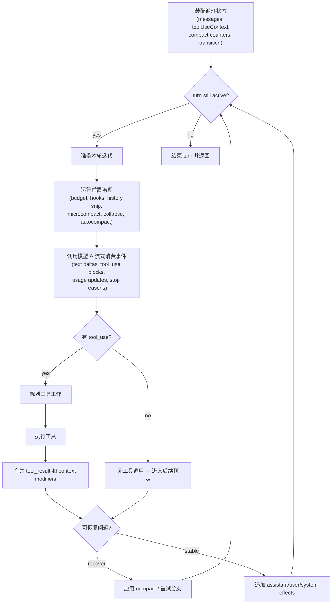
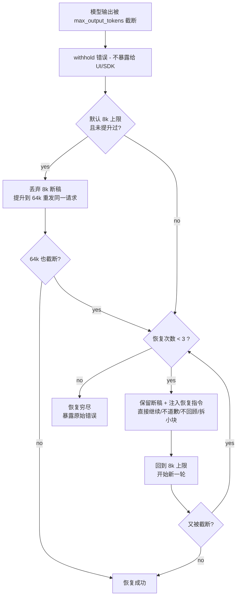
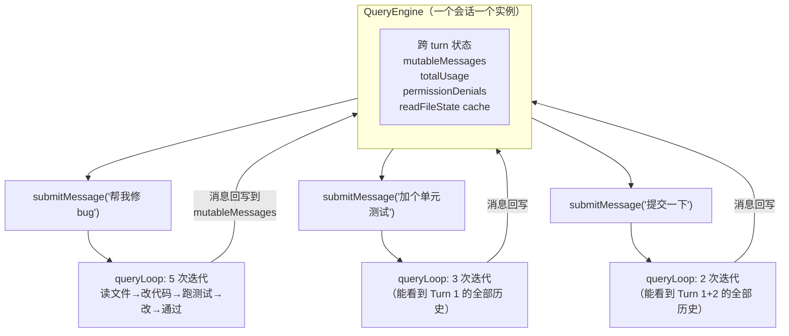
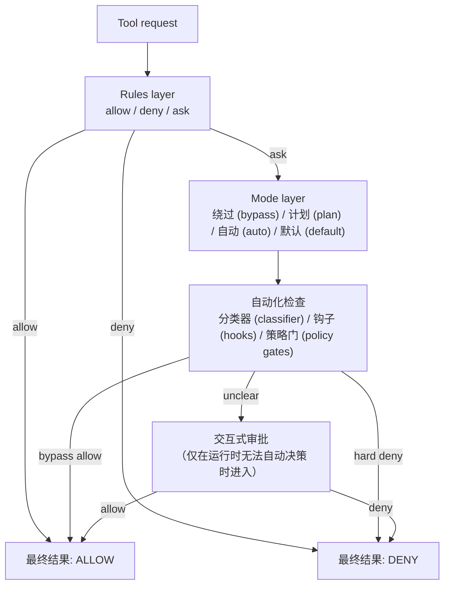

# Harness Engineering 学习笔记：第 3-4 章

> 来源：《Harness Engineering — 以 Claude Code 为样本》(@wquguru, 2026.04.01)
> 在线阅读：harness-books.agentway.dev/book1-claude-code

---

## 第 3 章：Query Loop——agent 系统的心跳

### 3.1 判断一个agent 系统是否成熟，先看它有没有循环

把一个会写代码的模型看成agent 系统，最容易犯的错误，就是把它想象成一个加强版问答接口——用户发来一句话，模型输出一个结果，事情就算办完。这种"一问一答"的理解，对纯聊天产品大体成立，但只要系统开始调用工具、跨轮执行、处理中断、保存状态、重试失败、压缩上下文，这种简单模型就迅速失效了。

Claude Code 的实现没有犯这个错误。它从结构上明确承认：**agent 依赖一段持续的、有状态的执行过程**。

这一点在源码里表现得很明显。`src/query.ts:219` 的 `query()` 和 `src/query.ts:241` 的 `queryLoop()` 是两个不同层次的函数：

- `**query()`**：入口壳函数，负责启动整个查询流程
- `**queryLoop()`**：真正的核心。它不是把模型调用包在一个 try/catch 里就完事，而是维护了一套跨迭代状态，处理一系列前置治理动作，然后进入模型流式阶段，再在返回后决定是否进入工具执行、恢复、压缩、继续下一轮，或者直接终止

> **这里的关键名词是 lifecycle（生命周期）。** 一个系统是否能被称为 agent，往往不取决于它会不会说话，而取决于它能不能在几轮之后仍然知道自己在做什么。

### 3.2 状态属于主业务——不是附属品，而是心跳的一部分

很多系统在设计之初，都倾向于把状态看成包袱，仿佛无状态才更优雅。对agent 系统来说，这种偏好作用有限。只要它进入真实工作流，状态就会自然出现。忽视状态，并不能消除状态，只会让它以更难管理的方式返回。

Claude Code 在 `src/query.ts:204-217` 明确定义了 query loop 的可变状态（`type State`）：


| 状态字段                           | 作用                                         | 日常类比                 |
| ------------------------------ | ------------------------------------------ | -------------------- |
| `messages`                     | 对话历史——承载所有轮次产生的 user/assistant/tool 消息     | 你和同事的完整聊天记录          |
| `toolUseContext`               | 工具使用上下文——记录当前轮次工具调用的相关信息                   | 你桌上摊开的文件和终端窗口        |
| `autoCompactTracking`          | 自动压缩追踪——记录压缩发生过几次、压缩边界在哪                   | 笔记本写满了，记下"从第几页开始是摘要" |
| `maxOutputTokensRecoveryCount` | 输出截断恢复计数——模型输出被 max_output_tokens 截断后的重试次数 | 报告写到一半纸用完了，换了几次纸     |
| `hasAttemptedReactiveCompact`  | 是否已尝试过响应式压缩——防止重复触发                        | "我已经整理过一次桌面了，别再整理"   |
| `maxOutputTokensOverride`      | 输出 token 上限的临时覆盖值——恢复时可能提升上限               | 临时多给你几张纸             |
| `pendingToolUseSummary`        | 待处理的工具使用摘要——上一轮工具执行结果的简报                   | 上一步操作的结果备忘           |
| `stopHookActive`               | stop hook 是否激活——标记系统是否正在执行停止钩子             | "正在走下班流程，别再派新任务"     |
| `turnCount`                    | 当前轮次计数                                     | 工作计时器——"这是今天处理的第几件事" |
| `transition`                   | 转换原因——记录从上一轮到当前轮的转换类型                      | "我为什么从上一个任务切到了这个"    |


到了 `src/query.ts:268`，这些状态在每次 query loop 启动时被整体装配成一个 State 对象，并在后续各个 continue 分支里整体更新。

> **这一点很重要。** Claude Code 没有把恢复、压缩、预算、hook、turn 计数散落在局部变量和布尔开关里，而是承认它们共同构成了"本轮结束后下一轮如何继续"的基础。它把状态当作心跳的一部分——没有这些状态，循环就不知道下一轮该恢复、该压缩还是该停止。
>
> 这就是成熟agent 系统和一次性脚本的区别。脚本本只关心这一步有没有跑完，agent 系统还要关心：这一步失败之后，下一步能不能继续接住前面的世界。

### 3.3 Query loop 的第一职责是治理输入

**日常类比**：想象你是一个翻译。有人丢给你一份 300 页的文件说"翻译一下"。你不会立刻开始翻——你会先数页数、看格式、确认语种、判断有没有图片需要特殊处理。这个"翻译前的整理"决定了翻译质量。

从外部看agent 系统，很多人会以为它的核心动作是"调用模型"。但在工程上，**真正重要的常常是模型调用之前那一长串整理工作**。Claude Code 在 `queryLoop()` 里把这件事写得很清楚。

在正式进入模型流之前，系统会按顺序做这些事：

```text
1. 启动相关 memory 的预取        ← src/query.ts:297
2. 预取 skill discovery          ← src/query.ts:323
3. 截取 compact boundary 之后的有效消息  ← src/query.ts:365
4. 应用 tool result budget       ← src/query.ts:369
5. 进行 history snip             ← src/query.ts:396
6. 进行 microcompact             ← src/query.ts:412
7. 进行 context collapse         ← src/query.ts:428
8. 最后才尝试 autocompact          ← src/query.ts:453
```

每一步在做什么：


| 步骤                  | 做了什么                              | 为什么需要                    |
| ------------------- | --------------------------------- | ------------------------ |
| memory 预取           | 提前加载 CLAUDE.md、auto memory 等持久化记忆 | 让模型"记住"跨会话的知识和用户偏好       |
| skill discovery     | 预加载可用的 skill 定义                   | 让模型知道有哪些技能可以调用           |
| compact boundary 截取 | 如果之前发生过压缩，只保留压缩点之后的消息             | 压缩前的原始消息已经被摘要替代，不需要重复发送  |
| tool result budget  | 工具返回结果太长时裁剪                       | 防止单个工具结果占掉大量上下文空间        |
| history snip        | 对话历史太长时，删掉中间部分                    | 保留开头（任务上下文）和最近内容（当前进展）   |
| microcompact        | 轻量级压缩——合并相邻的小消息                   | 减少碎片化，不触发完整压缩            |
| context collapse    | 较大规模的上下文折叠                        | 在 autocompact 之前先尝试低成本手段 |
| autocompact         | 调用模型生成摘要来替代旧消息                    | 最后手段，成本最高但效果最彻底          |


> **这串顺序本身就是一种架构声明。** 它告诉读者，Claude Code 把"上下文治理"放在"模型推理"之前。也就是说，它不把从混乱中整理秩序的责任交给模型，而是先由运行时完成治理，再把更干净的输入交给模型。
>
> 很多系统恰恰相反：先把大量上下文塞进去，再寄希望于模型自己判断什么重要、什么不重要。那种做法看似省事，实际上是在把运行时应承担的责任转嫁给概率分布。

### 3.4 调用模型只是循环的一段，不是循环本身

等前面的治理工作都做完，Claude Code 才进入模型调用阶段。这个阶段出现在 `src/query.ts:659` 往后。这里有个值得专门指出的细节：**系统会进入 `for await` 流式消费模型输出，而不是同步拿一个完整结果回来**。

这意味着模型输出在 Claude Code 里是**一串事件流**，而不只是"最终答案"。事件里可能包含：


| 事件类型             | 含义                                |
| ---------------- | --------------------------------- |
| assistant 文本     | 模型正在输出文字回复                        |
| `tool_use` block | 模型请求调用一个工具                        |
| usage 更新         | token 用量统计                        |
| stop reason      | 模型为什么停止（正常结束、被截断、遇到 stop token 等） |
| API 错误           | 调用失败                              |


在 `src/query.ts:826` 往后尤其明显。系统会把 assistant message 存起来，提取其中的 `tool_use` block，决定是否需要 follow-up，还可能边流边把工具送给 `StreamingToolExecutor`。

#### 流式消费的本质：模型输出和工具执行在时间上重叠

要理解流式消费，先要知道 Claude API 的推送方式。模型的一条回复（assistant message）的 `content` 是一个数组，里面可以有不同类型的内容块（content block）：

```typescript
// 一条 assistant message 的 content 数组
content: [
    { type: 'text', text: '让我先读取这两个文件...' },          // 内容块 0：文本
    { type: 'tool_use', name: 'Read', input: {...}, id: '1' },  // 内容块 1：工具调用
    { type: 'tool_use', name: 'Read', input: {...}, id: '2' },  // 内容块 2：工具调用
    { type: 'tool_use', name: 'Bash', input: {...}, id: '3' },  // 内容块 3：工具调用
]
```

API 不是把这个数组一次性返回，而是**每个内容块完成时就立刻推送**（通过 SSE 事件流）。具体过程是这样的：

```
API 推送的原始事件序列（以上面的例子为例）：

事件1: content_block_start   → type: 'text'           ← 开始第 0 个块（文本）
事件2: content_block_delta   → '让我先读取'             ← 文本一点点到达
事件3: content_block_delta   → '这两个文件...'
事件4: content_block_stop                              ← 第 0 个块结束 → yield 一条 AssistantMessage
                                                         content: [{ type:'text', text:'...' }]

事件5: content_block_start   → type: 'tool_use', name: 'Read'   ← 开始第 1 个块
事件6: content_block_delta   → input_json: '{"file_path":"src/utils.ts"}'
事件7: content_block_stop                              ← 第 1 个块结束 → yield 一条 AssistantMessage
                                                         content: [{ type:'tool_use', name:'Read', ... }]

事件8: content_block_start   → type: 'tool_use', name: 'Read'   ← 开始第 2 个块
...以此类推
```

关键在 `content_block_stop` 这个事件。`src/services/api/claude.ts:2171` 每收到一个 `content_block_stop`，就把刚完成的那一个内容块包装成一条 `AssistantMessage` yield 出来。所以 `query.ts:659` 的 `for await` 循环，**每迭代一次就收到一个刚完成的内容块**——第一次迭代收到文本块，第二次迭代收到第一个 tool_use 块，第三次迭代收到第二个 tool_use 块……不需要等模型把所有块都生成完。

在 `for await` 循环内部（`query.ts:826-862`），系统每收到一个内容块，会先检查里面有没有 `tool_use`：

- **没有 tool_use**（比如第一次收到纯文本块）：存起来就完事，继续等下一个块
- **有 tool_use**（比如第二次收到 Read 工具调用）：**立刻**把这个 tool_use block 送进 `StreamingToolExecutor`（`:841-843`），然后检查 executor 中有没有已经跑完的工具结果，有就立刻收割输出（`:851-857`）

`StreamingToolExecutor`（`src/services/tools/StreamingToolExecutor.ts:40`）内部维护一个工具队列，这是流式工具执行的核心结构。每次收到一个工具（`addTool`），它都会立刻尝试 `processQueue()` 看能不能马上开始执行——而不是等模型说完再统一处理。

#### 工具的启动时机：由并发约束决定，不由模型完成时机决定

`processQueue` 的运行逻辑决定了工具何时真正开始执行。它内部用 `await executeTool(tool)` 等待当前工具完成后，**会继续 for 循环检查队列中的下一个排队工具**。这意味着：

- **并发安全的工具**（如 Read）：`addTool` 后立刻启动，多个 Read 可以同时跑
- **非并发安全的工具**（如 Bash）：排队等待，但**不是等模型结束**，而是**等前面所有正在执行的工具完成**。一旦队列清空，排队的 Bash 自动启动

这里有一个容易误解的地方：Bash 的启动时机跟模型是否输出完毕无关。如果两个 Read 在模型还在吐 token 的时候就跑完了，Bash 会在模型仍在输出的过程中就开始执行。

用一个具体例子演示时间重叠：

```
假设用户说：帮我看看 utils.ts 和 config.ts，顺便跑测试

模型输出（流式）:
  块0: text "让我先读取..."
  块1: tool_use Read(utils.ts)     ← 到达后立刻开始执行
  块2: tool_use Read(config.ts)    ← 到达后立刻并发执行（Read 是并发安全的）
  块3: tool_use Bash(npm test)     ← 到达时 Read 还在跑，Bash 排队

时间轴 ──────────────────────────────────────────────►

模型输出 ║ text ║ Read1 ║ Read2 ║  Bash  ║ done ║
工具执行        │ Read1 ████████done    │       │
               │      Read2 ████████████done    │
               │                        Bash ██████████done
               │         ↑              ↑
               │   两个 Read 并发执行   Read 都完成后 Bash 自动启动
               │                  （不需要等模型输出结束）
```

对比传统的请求-响应模式（等模型全部说完再处理工具）：

```
时间轴 ────────────────────────────────────────────────────────►

模型输出  ║ ═══════ 等待完整响应 ═══════ ║
工具执行                               ║ Read1 ║ Read2 ║ Bash ║
```

#### `for await` 循环内部不只是"接收消息"——它同时在做四件事

在流式消费过程中（`query.ts:788-862`），每收到一个内容块，系统会同时处理多个关注点：


| 关注点      | 做了什么                                                                                       | 源码位置               |
| -------- | ------------------------------------------------------------------------------------------ | ------------------ |
| **工具提交** | 发现 tool_use block 后立刻送进 StreamingToolExecutor，工具可能在模型还在说话时就开始执行                            | `query.ts:841-843` |
| **结果收割** | 检查 executor 中已完成的工具，立刻 yield 给外层（UI 显示、transcript 记录）                                      | `query.ts:851-857` |
| **错误拦截** | prompt-too-long 和 max-output-tokens 错误在流式阶段就被标记为 `withheld`，暂不 yield，留给后续恢复逻辑处理            | `query.ts:799-822` |
| **回退处理** | 如果流式传输中途失败（streaming fallback），用 tombstone 标记已有的部分消息为作废，丢弃 executor 中的孤儿结果，重建一个新的 executor | `query.ts:712-740` |


第三点（错误拦截）值得展开：系统不是等流结束后才检查有没有出错，而是在流式消费的每一步都在检查。一旦发现可恢复错误，就在当场拦截（`withheld = true`，不 yield 给外层），让后续的恢复分支（collapse / reactive compact）有机会介入。这意味着**恢复路径的入口在流式阶段就已经打开了**。

#### Bash 出错会级联取消兄弟工具，但 Read 出错不会

`StreamingToolExecutor` 内部还有一个细腻的设计：并非所有工具出错都会影响其他工具。在 `StreamingToolExecutor.ts:354-363`，只有 **Bash 工具出错**时才会触发 `siblingAbortController.abort('sibling_error')`，取消所有正在并行执行的兄弟工具。Read、WebFetch 等工具出错不会——因为它们彼此独立，一个失败不应该牵连其他。

这背后的判断是：Bash 命令之间往往有隐含的依赖链（比如 `mkdir` 失败了，后续命令就没意义），而只读工具之间没有这种依赖。所以级联取消的范围被精确限定在 Bash，而不是一刀切地取消所有兄弟。

> **从工程角度看，这是一种根本性的变化。** 传统模式下，模型输出和工具执行是串行的两个阶段；流式消费让它们在时间上重叠——模型还在往外吐 token，工具已经在并行执行了。这不只是"更快"的问题，它改变了系统的控制流拓扑：中断可以更精确（知道哪些工具已经发出去了），恢复可以前置（在流式阶段就拦截 prompt-too-long），回退可以无缝（丢弃已有的部分结果，切换 fallback 模型）。
>
> 这也是为什么前面说 query loop 才是 agent 系统的心跳，而不是模型调用本身。模型调用只是心跳中的一次收缩，真正维持系统运行的是整套循环：输入如何收进来，流如何消费，工具如何调度，失败如何恢复，何时继续下一轮。




### 3.5 心跳必须处理中断，否则它就只是惯性

**日常类比**：一颗真正的心脏，不只是能持续跳动，还必须能在必要时停下来（比如手术中的心脏停搏）。一个只会不停跳、停不下来的心脏，是一种病态。

agent 系统也是一样。如果它只能一轮接一轮地跑下去，不能在用户中断、API 出错、工具失败时干净地停下来，那它就只是在做惯性运动。

Claude Code 对中断的处理写得很实在。在 `src/query.ts:1011` 往后，系统会优先处理 streaming abort。具体流程是：

1. 若启用了 `StreamingToolExecutor`，调用它的 `getRemainingResults()` 把所有还没收割的工具结果（包括正在执行的和排队中的）全部收回来。对于被中断而没跑完的工具，executor 会自动生成 synthetic tool_result（一条带 `is_error: true` 的消息，内容说明"用户中断了"或"兄弟工具出错了"），确保每个 `tool_use` 都有配对的 `tool_result`
2. 若没有启用 StreamingToolExecutor，系统用 `yieldMissingToolResultBlocks()` 扫描所有已发出但还没有 result 的 `tool_use` block，为每个都补上一条中断说明

**为什么必须补齐？** 因为 Claude API 要求对话中每个 `tool_use` 必须有对应的 `tool_result`，否则下一轮 API 调用会报错。而且 UI 和 transcript 也需要知道每个工具的结局——是执行成功、执行失败，还是被中断。如果只是把中断后的 `tool_use` 悄悄丢掉，对话历史就出现了断裂：模型说了"我要读这个文件"，但没有任何后续，下一轮模型看到这样的历史会困惑。

> **只要系统向外承诺了一段执行，就要在中断时把账补平。** 不能因为用户打断了，就假装前面的几个 `tool_use` 从未发生。外部系统、UI 和 transcript 都需要一致的因果链，哪怕结果是"中断了"，也必须中断得完整。

> **处理中断是 runtime 的基本责任。** 已经开始的动作需要有交代，哪怕交代的是"没做完"。

### 3.6 心跳还必须处理恢复，否则它就只是脆弱的重复劳动

如果说中断是外部世界打进来的意外，那么恢复就是系统内部预留的余量。没有恢复能力的循环，不管表面多整洁，最后都会暴露出同一个问题：它把幸运当成了设计。

Claude Code 对恢复的处理是层层递进的，而不是简单重试。最典型的是 prompt-too-long 和 max-output-tokens 这两种场景。

#### prompt-too-long 恢复（上下文太长，API 拒绝接受）

在 `src/query.ts:1065` 往后，系统会先判断最后一条 assistant message 是否是被 withheld 的 prompt too long：

```text
第一层尝试（低成本）：context collapse
  → 把积压的 collapse 提交出去（src/query.ts:1086-1116）

第二层尝试（中等成本）：reactive compact
  → 调用模型生成摘要替代旧消息（src/query.ts:1119-1166）

第三层：如果都不够，最终返回错误
```

**日常类比**：你的桌子满了，放不下新文件。第一步先把不用的文件收进抽屉（collapse）；不够的话，把旧文件扫描存电子版、纸质版扔掉（compact）；再不够，只能跟领导说"这个任务我暂时做不了"。

#### max-output-tokens 恢复（模型输出被截断）

**背景知识**：每次调用 Claude API 时，都有一个 `max_output_tokens` 参数限制模型单次输出的长度。当模型正在写一段很长的回复（比如生成一个大文件、写一段详细分析），如果输出 token 数量触及上限，API 会强制截断——模型的回答"说到一半"就戛然而止。这不是 bug，是 API 的硬约束。

在 `src/query.ts:1185` 往后，处理方式是**按成本从低到高逐层递进**的三层策略：

##### 第一层：提升 token 上限——丢弃断稿，换张纸重写（`src/query.ts:1195-1221`）

Claude Code 默认用较保守的 8k 输出上限（大多数回复不需要更长）。当 8k 被触顶时，系统的第一反应是：

```typescript
const next: State = {
  messages: messagesForQuery,              // ← 只有原始输入，8k 断稿被丢弃
  maxOutputTokensOverride: ESCALATED_MAX_TOKENS, // ← 64k
  // ...
}
state = next
continue  // 重新进入循环
```

**关键点：模型根本看不到上次的输出。** 系统用同样的输入重发请求，只是把输出上限从 8k 提到 64k（`ESCALATED_MAX_TOKENS = 64_000`）。就像考试时笔没墨了写了半页废稿，监考老师给你一支新笔和一张新答题纸，让你从头重写这道题。

这样做成本确实增加了（输入 token 付了两次，第一次 8k 输出白付了），但背后是一笔经济账：


| 方案                | 说明                                 | 整体成本    |
| ----------------- | ---------------------------------- | ------- |
| 所有请求一律 64k 上限     | 99% 的回复只需几百到几千 token，每次都占 64k 调度槽位 | 高（大量浪费） |
| 默认 8k，触顶再升 64k 重试 | 绝大多数请求零浪费，极少数多付一次输入                | 低（整体更省） |


防护条件：只触发一次（`maxOutputTokensOverride === undefined`），且只在首方 API 上生效（feature flag `tengu_otk_slot_v1` 守卫）。

##### 第二层：注入恢复消息——保留断稿，从断点接着写（`src/query.ts:1223-1252`）

如果 64k 也不够，说明模型确实在生成很长的内容。这时系统会把**模型上次被截断的 64k 输出原样放回消息列表**：

```typescript
const next: State = {
  messages: [
    ...messagesForQuery,      // 原始输入
    ...assistantMessages,     // 64k 断稿（上一轮的输出，不是 8k 那次的）
    recoveryMessage,          // 系统注入的恢复指令
  ],
  maxOutputTokensOverride: undefined,  // ← 回到 8k 默认
  maxOutputTokensRecoveryCount: maxOutputTokensRecoveryCount + 1,
  // ...
}
```

模型看到的对话变成：

```
[user]       帮我重构这个文件……
[assistant]  好的，我来分三步处理。第一步……第二步……第三步写到一半就
[user]       Output token limit hit. Resume directly — no apology,
             no recap of what you were doing. Pick up mid-thought
             if that is where the cut happened. Break remaining
             work into smaller pieces.
```

**模型怎么知道断在哪？** 因为它的断稿就摆在上文里——大语言模型天然具备"看到上文就能接着写"的能力，这不需要任何特殊机制。就像同事把你写好的半篇文章打印出来放你面前说"接着写"。

**上下文不会超吗？** 不会。`max_output_tokens` 限制的是输出空间（8k/64k），和输入上下文窗口（200k）是两个独立的限额。把 64k 断稿塞回输入，总输入从比如 50k 变成 114k，离 200k 还有余量。而且即使输入真的变长了，query loop 每轮开始前的治理流水线（history snip → microcompact → context collapse → autocompact）会自动兜底。

恢复指令的三个设计细节：


| 指令内容                        | 为什么这样写                                                    |
| --------------------------- | --------------------------------------------------------- |
| "no apology"                | 模型被打断后默认会先道歉（"抱歉，我的回答被截断了..."），浪费输出空间                     |
| "no recap"                  | 模型倾向于重新总结前文（"之前我提到了..."），这是冗余的——前文已经在消息历史里                |
| "break into smaller pieces" | 引导模型拆小块，降低再次截断的概率；这也是 `maxOutputTokensOverride` 回到 8k 的原因 |


恢复指令用 `createUserMessage({ isMeta: true })` 包装成 user 角色，因为 API 要求 assistant 和 user 消息交替出现，两个 assistant 不能连续。

最多重试 3 次（`MAX_OUTPUT_TOKENS_RECOVERY_LIMIT = 3`）。

##### 第三层：恢复穷尽，暴露错误（`src/query.ts:1254-1256`）

如果 3 次恢复都没搞定，系统才把之前一直扣着的错误放出去。

##### Withhold 机制：错误不是立刻暴露的

还有一个精妙的设计：max-output-tokens 错误**不是一发生就暴露给外层的**。在 `src/query.ts:820-822`，流式消费阶段检测到截断后会设 `withheld = true`，不 yield 这条消息。原因是某些消费端（如桌面客户端）看到任何 error 就直接终止会话——如果系统一截断就暴露错误，外层会断开连接，恢复循环就算还在跑也没人听了。所以系统先扣住错误，自己在内部悄悄恢复，只有恢复彻底失败了才把错误放出去。

##### 完整生命周期

```
调用 1 ─ 8k 上限 ─ 截断 ─→ 丢弃 8k 断稿，升到 64k 重来
调用 2 ─ 64k 上限 ─ 截断 ─→ 保留 64k 断稿 + 恢复指令，回到 8k
调用 3 ─  8k 上限 ─ 截断 ─→ 保留 8k 断稿 + 恢复指令（第 2 次恢复）
调用 4 ─  8k 上限 ─ 截断 ─→ 保留 8k 断稿 + 恢复指令（第 3 次恢复）
调用 5 ─  8k 上限 ─ 截断 ─→ 恢复穷尽，暴露错误
```




> **这套机制体现的核心理念是：恢复不是善后，而是主路径。** 不是"出错 → 报错 → 等用户重新输入"，而是"出错 → 先别声张 → 自己想办法修 → 修了多次还不行再说"。这和人类工程师的工作方式很像：IDE 崩了你不会先给老板发消息道歉，而是重新打开从断点接着写。

### 3.7 停止条件不能只有一个，否则系统会把失败和完成混为一谈

**日常类比**：一个项目经理说"项目结束了"，这可能意味着"项目完成了"、"项目被取消了"、"预算花完了"或者"团队解散了"——这几种完全不是一回事。如果项目管理系统只有一种"已结束"状态，你永远分不清项目是成功还是失败。

普通问答系统的停止条件比较简单：有回答就结束。agent 系统不能这么偷懒，因为在一个会话里，出现"当前轮结束"并不等于"任务完成"，更不等于"系统成功"。

Claude Code 的 query loop 至少区分了这些停止情况：


| 停止情况                        | 含义           | 后续动作                          |
| --------------------------- | ------------ | ----------------------------- |
| streaming 正常完成且有 `tool_use` | 模型想调工具       | 执行工具，继续下一轮                    |
| 没有 `tool_use`，进入 stop hooks | 模型认为任务完成     | 运行 stop hooks 做后续判定           |
| 被用户中断                       | 用户按了取消       | 补齐 synthetic tool_result，干净退出 |
| prompt-too-long 恢复          | 上下文超限        | 走 collapse → compact 恢复链      |
| max-output-tokens 恢复        | 输出被截断        | 提升上限或注入继续指令                   |
| stop hook 阻塞导致重进循环          | hook 判定任务未完成 | 带着 hook 反馈继续下一轮               |
| API 错误                      | 调用失败         | 直接返回错误                        |


这可以从 `src/query.ts:1062` 一直看到 `:1305`。尤其是 stop hooks 那段（`:1267` 到 `:1305`），系统不仅处理 hook，还专门防止死循环。死循环的场景是这样的：

```text
stop hook 说"任务没完成，继续" → 重进循环 → 上下文太长触发 compact
→ compact 后仍然太长 → 触发 prompt-too-long → 再次 compact
→ compact 后进入模型 → stop hook 又说"没完成" → 再次重进循环
→ 无限循环
```

防止方式：系统用 State 里的 `hasAttemptedReactiveCompact` 标记是否已经尝试过压缩。如果压缩过一次后 stop hook 仍然要求继续，但上下文已经压不动了，系统会选择结束 turn 而不是继续循环。

> 许多系统只有一种朴素想法：失败了就重试。Claude Code 则承认，**重试本身也是一种需要被管理的行为**。系统必须知道为什么重试、已经试过什么、哪些保护状态不能被重置、哪些情况会导致无限循环。正是这些判断，把一个"会继续试"的系统和一个"知道什么时候不该再试"的系统区分开了。

### 3.8 QueryEngine 说明循环属于会话生命周期

如果 `queryLoop()` 还不足以说明问题，那么 `QueryEngine` 的存在就更直接了。

在 `src/QueryEngine.ts:176-184`，源码明确写着：

> QueryEngine owns the query lifecycle and session state for a conversation.
> One QueryEngine per conversation. Each submitMessage() call starts a new turn within the same conversation. State (messages, file cache, usage, etc.) persists across turns.

#### QueryEngine 和 queryLoop 是两层不同的东西

要理解这段话，关键是分清两个东西的职责边界：

- `**queryLoop()`**（在 `query.ts` 里）负责**一个 turn 内部**的事情：循环调用模型 → 处理工具 → 恢复错误 → 决定是否继续。它的状态（State 类型的那 10 个字段）只在当前 turn 内存活，turn 结束就消失了。
- `**QueryEngine`**（在 `QueryEngine.ts` 里）负责**跨 turn** 的事情：用户发了第一条消息是 turn 1，又发了第二条消息是 turn 2——这两轮之间需要共享的东西，由 QueryEngine 管。

**日常类比**：`queryLoop` 像你处理一封邮件的完整过程——读邮件、查资料、写回复、检查附件、发出去。一封邮件处理完就结束了。`QueryEngine` 像你的工位——你的文件夹、待办清单、上次打开的标签页，这些在你处理第 1 封邮件和第 100 封邮件时都还在。

#### QueryEngine 跨 turn 保存了什么

从 `src/QueryEngine.ts:184-198` 看，QueryEngine 维护的私有状态有：


| 状态字段                      | 类型                      | 为什么必须跨 turn 保存                                          |
| ------------------------- | ----------------------- | ------------------------------------------------------- |
| `mutableMessages`         | `Message[]`             | 所有轮次积累的完整消息列表。如果不保存，用户发第二条消息时模型完全不记得第一条说了什么             |
| `abortController`         | `AbortController`       | 中断控制器。任何 turn 都可以触发中断，需要统一的控制入口                         |
| `permissionDenials`       | `SDKPermissionDenial[]` | 权限拒绝记录。如果不跨 turn 累积，用户在 turn 1 拒绝了某个工具权限，turn 2 又弹出来问一遍 |
| `totalUsage`              | `NonNullableUsage`      | 总 token 用量统计。如果每轮清零，预算控制就失效了                            |
| `readFileState`           | `FileStateCache`        | 文件读取缓存。同一个文件不需要每轮都重新读磁盘                                 |
| `discoveredSkillNames`    | `Set<string>`           | 已发现的 skill 名称集合。注意：这个每轮开头会 `clear()`，防止在 SDK 模式下无限增长    |
| `loadedNestedMemoryPaths` | `Set<string>`           | 已加载的嵌套 memory 路径集合。避免重复加载                               |


这些状态和 `queryLoop` 内部的 State（`messages`, `turnCount`, `autoCompactTracking` 等）形成了清晰的分层：

```text
QueryEngine 状态（跨 turn 存活）
  ├── mutableMessages     ← 整个会话的消息历史
  ├── totalUsage          ← 整个会话的 token 消耗
  ├── permissionDenials   ← 整个会话的权限拒绝记录
  ├── readFileState       ← 文件缓存
  └── ...

queryLoop 状态（单 turn 内存活）
  ├── turnCount           ← 本轮内的迭代次数
  ├── autoCompactTracking ← 本轮的压缩追踪
  ├── maxOutputTokensRecoveryCount ← 本轮的截断恢复次数
  ├── transition          ← 本轮内上一次迭代为什么 continue
  └── ...
```

#### submitMessage() 是怎样串起两层的

每次用户发消息，调的是 `QueryEngine.submitMessage()`（`src/QueryEngine.ts:209`）。它做的事情可以用伪代码表示：

```text
submitMessage(prompt):
    // 1. 用跨 turn 状态 + 当前 prompt 组装本轮输入
    messages = this.mutableMessages + 新的 user message
    systemPrompt = 拼装好的 system prompt
    userContext = 处理过的用户上下文
    toolUseContext = 工具上下文

    // 2. 把一切交给 query()，进入 queryLoop
    for await (message of query({messages, systemPrompt, ...})):

        // 3. 把 queryLoop 产出的消息写回跨 turn 状态
        if message.type == 'assistant' or 'user' or 'compact_boundary':
            messages.push(message)       // ← 这就是 mutableMessages
            recordTranscript(messages)   // ← 持久化到磁盘

        // 4. 更新用量统计
        this.totalUsage += message.usage

        // 5. yield 给外层（SDK / UI）
        yield message
```

**关键在第 3 步**：`queryLoop` 产出的每条消息，都被 push 进了 `this.mutableMessages`。这个数组跨 turn 存活。所以下次 `submitMessage()` 被调用时，模型能看到之前所有轮次的对话历史。

从 `src/QueryEngine.ts:675` 能看到实际代码——QueryEngine 把准备好的 messages、systemPrompt、userContext、systemContext、toolUseContext 一起交给 `query()`，再把 assistant、user、compact boundary 等消息写回 transcript。

#### 把关系画出来

```text
一个 conversation（会话）
  └── 由一个 QueryEngine 实例管理
        ├── Turn 1: submitMessage("帮我修 bug")
        │     └── queryLoop 内部跑了 5 次迭代
        │         （读文件→改代码→跑测试→改→通过）
        │         → 产出的消息全部回写到 mutableMessages
        │
        ├── Turn 2: submitMessage("再帮我加个单元测试")
        │     └── queryLoop 内部跑了 3 次迭代
        │         → 模型能看到 Turn 1 的所有消息
        │
        └── Turn 3: submitMessage("提交一下")
              └── queryLoop 内部跑了 2 次迭代
                  → 模型能看到 Turn 1 + Turn 2 的所有消息
```




#### "循环属于会话生命周期"到底在说什么

这句话的意思是：**query loop 不是一个独立运行的东西，它被嵌在 QueryEngine 所管理的会话生命周期里。** 每次 loop 的输入来自会话历史（mutableMessages），每次 loop 的输出写回会话历史。loop 自己不拥有持久状态——持久状态属于 QueryEngine，也就是属于会话。

如果把 queryLoop 比作一次心跳，那 QueryEngine 就是心脏本身。心跳是一次性的收缩-舒张过程，但心脏要持续工作、维持血液循环。queryLoop 管的是"这一跳怎么跳"，QueryEngine 管的是"跳完之后血液去了哪、下一跳从什么状态开始"。

> **这说明 query loop 是会话系统真正的执行中心。** 外层的 UI、SDK、session persistence 都围着它转。要理解 Claude Code 的设计，不能只看它有哪些工具，也不能只看它 prompt 写了什么，最终还是得看这个循环如何把前面的约束落实成连续行为。

### 3.9 从源码里可以提炼出的第三个原则

> **agent 系统的核心能力，是维持可恢复的执行循环。**

Claude Code 的源码在几个关键点共同支持这个判断：

- `query.ts` 用显式 State 管理跨轮执行状态，而不是把一切寄托在局部变量上
- 模型调用前有大段输入治理逻辑，说明**运行时先于推理**
- 流式消费把模型输出当事件流，而不是当最终文案
- 中断路径会补齐 synthetic tool_result，说明系统关心因果闭环
- prompt-too-long、max-output-tokens、stop hooks 都走明确恢复分支，说明**失败是主路径的一部分**
- `QueryEngine.ts` 明确把 query lifecycle 当作 conversation 的所有权对象

一个成熟 agent 的"心跳"至少要满足：

1. 它有明确的跨轮状态
2. 它能治理输入，而不只是被动消费输入
3. 它能流式地接住模型输出
4. 它能补齐中断后的执行账本
5. 它能区分完成、失败、恢复和继续

缺少这些结构的系统，也许仍然能做出漂亮 demo，但它们更接近一次性表演，而不是运行时。

---

## 第 4 章：工具、权限与中断——为什么 agent 不能直接碰世界

### 4.1 一旦模型开始调用工具，问题的性质就变了

**日常类比**：一个人坐在会议室里发表意见——说错了，最多被纠正，不会有实质损害。但如果这个人走出会议室，开始直接操作生产线，说错话就变成了做错事。

只会输出文本的模型，出错时主要增加沟通成本。它说错了，可以不信；它总结得糟，可以重问。可一旦模型开始调用工具，问题的性质就变了——因为**工具是动作，动作会留下结果，结果会接触真实世界**。

在 shell 上最容易看清：一段解释写错了，影响通常还停留在理解层面；可要是它运行了一条不该运行的命令，文件会被删掉，进程会被中止，Git 历史也会变得难以收拾。能力增强往往伴随后果增强。

> **所以，工具系统最重要的问题是：谁来约束这些工具。** Claude Code 对这个问题的回答，是把工具变成受管执行接口，避免让模型直接伸手去碰世界。

### 4.2 工具调度属于行为宪法的一部分

Claude Code 在 `src/services/tools/toolOrchestration.ts:19` 的 `runTools()` 里，先做了一件很有代表性的事情：**不直接执行一串 tool_use，而是先按并发安全性分批**。

在 `src/services/tools/toolOrchestration.ts:91` 的 `partitionToolCalls()` 里，系统会先读取工具的 inputSchema，再调用 `isConcurrencySafe()` 判断这类调用是否适合并发。如果适合，就把它们归入并发批次；如果不适合，就拆成串行单元。


| 调度策略 | 何时使用               | 日常类比            |
| ---- | ------------------ | --------------- |
| 并发执行 | 多个只读操作（如同时读 3 个文件） | 几个人同时查阅不同的参考资料  |
| 串行执行 | 涉及写操作或状态变更         | 只能一个人操作打印机，排队等候 |


这看上去像性能优化，实际更接近一致性设计。为什么这么说？需要先理解一个概念。

#### 什么是 contextModifier

有些工具执行后会修改 `ToolUseContext`（工具执行的上下文状态），比如更新文件缓存、变更权限状态等。这个修改操作叫 contextModifier——类型是 `(context: ToolUseContext) => ToolUseContext` 的函数。

如果工具全部串行执行，contextModifier 的应用顺序天然就是执行顺序，不会有任何歧义。

#### 并发为什么会引入顺序问题

但一旦工具并发执行，问题就来了。假设模型在一轮里请求了三个工具调用，在 assistant message 里的顺序是 A → B → C：

```text
串行时：A 跑完 → 应用 A 的 modifier → B 跑完 → 应用 B 的 modifier → C 跑完 → 应用 C 的 modifier
  → 顺序确定，每次都一样

并发时：A、B、C 同时开跑，C 先跑完，A 其次，B 最后
  → modifier 按完成顺序应用就变成了 C → A → B
  → 但下次执行同样的请求，可能 B 先跑完
  → modifier 顺序变成 B → C → A
  → 两次执行后的上下文状态可能不同
```

**同样的输入，因为并发时序不同，上下文演化出了不同结果——系统行为变得不确定。** 这就是并发引入的顺序问题。

#### Claude Code 怎么解决

Claude Code 的做法是：在 `toolOrchestration.ts:31` 到 `:63`，用一个字典 `queuedContextModifiers` 按工具 ID 缓存每个工具的 modifier，等所有工具跑完后，**按原始 assistant block 顺序**（A → B → C，而不是完成顺序）依次应用。这样无论谁先跑完，最终上下文的演化路径都是一样的。

> **这是一种典型的工程保守。** 它的前提是：并发可以提高吞吐，但不能破坏因果秩序。工具如果只是跑得更快，却不能保证上下文一致性，就会替系统制造另一种随机性。

### 4.3 运行一个工具，真正执行前已经发生了很多事

很多人以为 `tool_use` 一旦出现，下一步自然就是执行。Claude Code 的实现说明，真靠谱的系统不会这么草率。

在 `src/services/tools/toolExecution.ts:337` 之后，`runToolUse()` 把工具执行包在了多层结构里。具体来说，一个工具从 `tool_use` 到最终产出 `tool_result`，中间经过这些阶段：

```text
tool_use 出现
  → 前置校验：权限检查（allow / deny / ask）——决定这个工具能不能跑
  → 执行中：
      - hooks 触发：在工具执行前后运行用户配置的 shell 命令（比如 lint 检查、日志记录）
      - telemetry 记录：记下工具名称、耗时、是否成功等指标，用于分析和调试
      - 中断监听：随时检查 abortController 是否被触发（用户按了取消？兄弟工具出错了？）
  → 执行后：
      - 结果合并：把工具产出的 tool_result 消息和 contextModifier 收集起来
      - synthetic error 生成：如果工具本身没出错但被外部原因取消了，
        生成一条假的 error result 说明原因（如"用户中断"或"兄弟工具出错"）
```

**日常类比**：普通函数调用就像你自己在家做饭——切菜就切，不需要报备。工具执行更像一个外包团队替你施工——施工前要审批（permission），施工中有监理（hooks + telemetry），施工时随时可能被叫停（中断监听），施工完要验收和记录（结果合并），施工被叫停了也要出一份说明（synthetic error）。

这说明工具在这里的地位，和普通库函数并不一样。库函数默认属于程序内部，调用者自己承担后果；工具则属于模型与外部世界之间的接口，**所以系统不能假设调用者具备稳定判断**。

### 4.4 权限先于能力——系统必须把"会做"和"可以做"分开

**日常类比**：公司里每个人都"会"发公司公告邮件（技术上你有邮箱权限），但不是每个人都"可以"发——这需要审批。一个成熟的组织不会因为你"会做"就默认你"可以做"。

Claude Code 的权限入口在 `src/hooks/useCanUseTool.tsx:27` 往后。`CanUseToolFn` 的存在本身已经说明一件事：工具是否允许执行，并不由模型自己说了算，而要交给权限判定链。

在 `useCanUseTool()` 里，系统不会因为模型提出了一个工具请求就默认执行。相反，它会先调用 `hasPermissionsToUseTool(...)` 做权限判定（`useCanUseTool.tsx:37`）。返回结果会分成三种：


| 判定结果    | 含义       | 后续动作                                   |
| ------- | -------- | -------------------------------------- |
| `allow` | 规则明确允许   | 直接执行                                   |
| `deny`  | 规则明确拒绝   | 直接拒绝，生成拒绝消息                            |
| `ask`   | 规则无法自动决定 | 进入协调器、swarm worker、classifier 或交互式审批路径 |


> `**ask` 这个第三种状态非常关键。** 因为真正成熟的权限系统，除了"能"和"不能"，还要承认第三种状态：**系统自己也不该替用户做决定**。理解意图不等于拥有授权，拥有授权不等于拥有持续授权。




从这个角度看，权限系统是在澄清 agent 角色：Claude Code 允许模型提出动作建议，但**是否放行，由运行时、规则和用户决定**。这里被刻意分开的，是能力判断和授权判断。

### 4.5 权限结果本身也是一种运行时语义

在 `src/utils/permissions/PermissionResult.ts:23` 往后（实际类型定义在 `src/types/permissions.ts`），系统把权限判定的结果定义成了专门的类型：`PermissionAllowDecision`、`PermissionDenyDecision`、`PermissionAskDecision`，而不是简单的 `boolean`。

这跟用 `true/false` 表示权限有什么区别？区别在于布尔值只能告诉你"行"或"不行"，而这些类型还携带了**原因和元数据**：

- `PermissionDenyDecision` 可以携带拒绝理由（比如"规则不允许在沙箱外执行 Bash"），这个理由会被展示给用户或写入日志
- `PermissionAskDecision` 可以携带应该走哪条审批路径（交互式确认？classifier 自动判定？）
- `PermissionAllowDecision` 可以区分是"规则明确允许"还是"用户临时授权"——后者可能需要在下次重新确认

这让系统能够精确地回答"为什么这一步没有继续"。当用户看到"需要确认"时，系统知道这是哪条规则触发的、应该怎么处理、处理完之后状态该怎么更新。如果权限只是一个布尔值，这些信息就丢失了——你只知道"不行"，但不知道为什么不行、该怎么变成"行"。

### 4.6 StreamingToolExecutor 说明中断是一等语义

**日常类比**：你正在做饭，同时炒着两个菜。突然燃气灶报警了。你不能只关火了事——你还需要知道：第一个菜炒到什么程度了、第二个菜需不需要端下来、灶台上的油是否要擦掉。**"被打断"不是一种边缘情况，而是需要专门交代的正常场景。**

工具一旦开始并发和流式执行，中断问题就会立刻变得复杂。此时系统面对的是一个包含 queued、executing、completed、yielded 等多状态的队列，而不再只是单一动作。

Claude Code 在 `src/services/tools/StreamingToolExecutor.ts:40` 往后，明确把这套东西做成了一个独立的流式工具执行器。这里面最值得注意的是它如何处理中断和丢弃。

#### 中断时的 Synthetic Error 机制

在 `StreamingToolExecutor.ts:64-71`，系统允许在 streaming fallback 时整体 discard 当前工具集合。在 `:153` 到 `:205`，它会根据不同原因生成 synthetic error message：


| 中断原因      | synthetic error 类型   | 含义                        |
| --------- | -------------------- | ------------------------- |
| 并行的兄弟工具出错 | `sibling_error`      | "我没出错，但旁边的工具出错了，所以我也被取消了" |
| 用户按了中断    | `user_interrupted`   | "用户主动打断了执行"               |
| 流式回退      | `streaming_fallback` | "流式执行过程中出了问题，整批工具被丢弃"     |


#### 中断原因的细化判定

到了 `:210` 往后，系统还会专门判断中断原因，区分：

- 因为别的并行工具出错而取消
- 因为用户 interrupt 而取消
- 因为 fallback 而放弃当前批次

更细一点，在 `:233` 往后，工具还有 `interruptBehavior`，决定它在用户插话时究竟该 `cancel` 还是 `block`。这两者的区别是：

- `**cancel`**：用户一插话，这个工具就立刻被取消，生成 synthetic error（"用户中断了"）。适用于执行时间长且可以安全中止的工具，比如一个还在跑的 Bash 命令
- `**block`**：用户插话了，但这个工具**不会被取消**，而是继续跑完。用户的新消息会被阻塞，等工具执行完再处理。适用于不能中途停下的工具（默认行为），比如一个正在写文件的操作——写到一半中止会留下损坏的文件

> 这套设计说明 Claude Code 并不把中断理解成"执行失败的一种特殊情况"，而是把中断当成和执行本身同样重要的语义。系统不仅要知道工具能不能开始，还要知道它被打断时如何收场、如何补齐结果、是否允许新消息插入。
>
> 这正是 Harness Engineering 的一个基本特点：**不仅设计开始，也设计停下。** 没有设计停下语义的执行系统，最终只能依赖用户外部打断来补完设计。

### 4.7 Bash 为什么永远比别的工具更可疑

在 Claude Code 的工具世界里，Bash 不是普通工具，它更像**风险放大器**。原因很简单：它过于通用。越通用的接口，越难靠领域知识限制它。一个 file read tool 至少不会顺手杀进程，一个 grep tool 至少不会偷偷 push 代码，而 Bash 几乎什么都能做。

Claude Code 对 Bash 的不信任，写得相当实在，分成两层：

#### 第一层：Prompt 级别的明确规则

在 `src/tools/BashTool/prompt.ts` 里，系统通过 prompt 直接告诉模型哪些 Bash 操作是禁区。比如：

- 不要随意修改 git config（会影响所有后续 Git 操作）
- 不要用 `--no-verify` 跳过 pre-commit hook（hook 是团队的安全检查）
- 不要用 `git add .` 或 `git add -A`（可能把 `.env` 等敏感文件提交上去）
- pre-commit 失败后不要用 `--amend`（会修改上一个 commit，可能丢失别人的工作）
- 没有明确要求不要自作主张 commit，更不要默认 push
- 不要用 `-i` 交互模式（如 `git rebase -i`），因为 CLI 环境不支持交互式输入

这些规则看上去啰嗦，实际上很有分寸：**凡是后果大的地方，系统就不怕啰嗦**。

#### 第二层：权限和安全判定

`src/tools/BashTool/bashPermissions.ts` 是第二层防线，它在运行时对**模型生成的命令**做安全分析。具体做了这些事：

- **解析 shell 语义**：把模型生成的命令字符串拆解成结构化的命令树（处理管道 `|`、链式 `&&`、子 shell `$()` 等语法），而不是当成一整个字符串做简单匹配
- **提取命令前缀**：识别 `sudo`、`env`、`nohup` 等前缀 wrapper，穿透它们找到真正要执行的命令（比如 `sudo rm -rf /` 里真正危险的是 `rm -rf /`）
- **匹配安全规则**：把解析出的命令与预定义的 allow/deny 规则做比对，决定这条命令该放行、拒绝还是需要用户确认
- **防止检查爆炸**：复合命令（如 `cmd1 && cmd2 && cmd3 && ...`）可能包含大量子命令，逐个检查成本会指数增长。所以系统设了上限 `MAX_SUBCOMMANDS_FOR_SECURITY_CHECK = 50`——超过 50 个子命令的复合命令直接要求用户确认，不尝试逐个分析

> **这是一个值得借鉴的判断：高风险能力不应该享受通用能力的待遇。** 能力越通用，越要特殊看管。把 Bash 当成普通工具，往往只是设计上的偷懒。

### 4.8 工具系统真正保护的，不只是用户，还包括系统自己

权限、调度和中断看起来像是在保护用户，其实它们同时也在保护系统自身。因为一个 agent 系统如果允许自己留下不完整的 tool_result、失序的上下文修改、无边界的并发副作用和说不清楚的中断语义，最先崩掉的往往是系统的一致性。

这一点在 `query.ts` 里和工具执行层是互相咬合的：

- **query loop** 在中断时会补齐 synthetic tool_result（第 3 章提到的）
- **StreamingToolExecutor** 也在内部预留了 `discarded`、`hasErrored`、`siblingAbortController`、`interruptBehavior` 等机制

两边一起作用，目的是让系统在"执行过什么、没执行完什么、为什么停了"这些问题上还能保持一条可追溯的因果链。

> **这也是 Harness 的核心含义之一：替系统保住秩序。** 很多约束表面上是在防止误操作，更深一层是在防止系统自己变成一堆无法解释的状态残片。

### 4.9 从源码里可以提炼出的第四个原则

> **工具是受管执行接口；权限是 agent 系统的基本器官。**

Claude Code 的源码在几个地方共同支持这个判断：

- `toolOrchestration.ts` 把工具先分批、再执行，说明**调度先于冲动**
- `toolExecution.ts` 把 hooks、permission、telemetry 和 synthetic error 包在工具执行周围，说明**执行不是裸调用**
- `useCanUseTool.tsx` 把权限结果分成 allow / deny / ask，说明系统把**授权当成独立语义**
- `StreamingToolExecutor.ts` 为中断、fallback、并发出错预留专门语义，说明**停止和开始同样重要**
- `BashTool/prompt.ts` 与 `bashPermissions.ts` 对 Bash 采取特殊高压治理，说明**高风险能力必须接受更密约束**

如果要把这些提炼成可迁移的工程原则，大概可以写成这样几条：

1. **让模型提出动作，不等于让模型拥有授权**
2. **工具调度必须保持因果秩序，哪怕执行并发**
3. **中断要有一等语义，不能靠异常兜底**
4. **高风险工具必须区别对待，不能图省事走通道化设计**
5. **一个工具系统真正保护的，既是用户，也是运行时本身**

下一章要讨论的是这套系统里另一种常见错觉：上下文越多越好。Claude Code 的实现恰好说明，真正有经验的系统不会把上下文当仓库，而会把它当资源。接下来要讲的，是 memory、CLAUDE.md 与 compact 如何共同组成上下文治理。