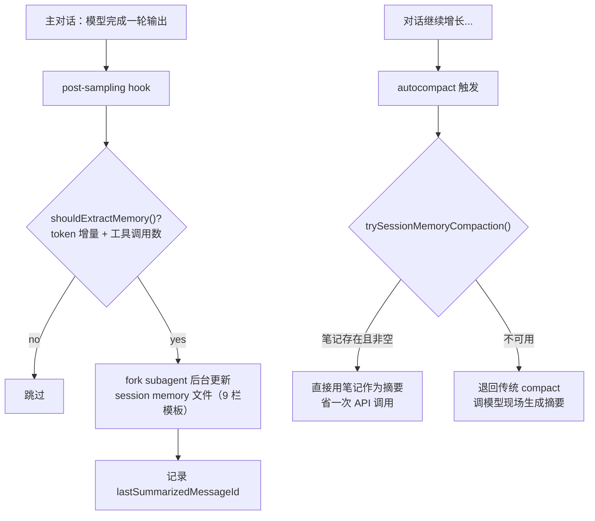
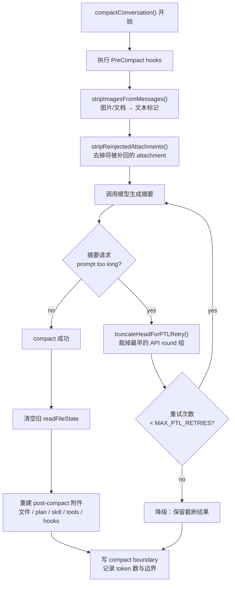
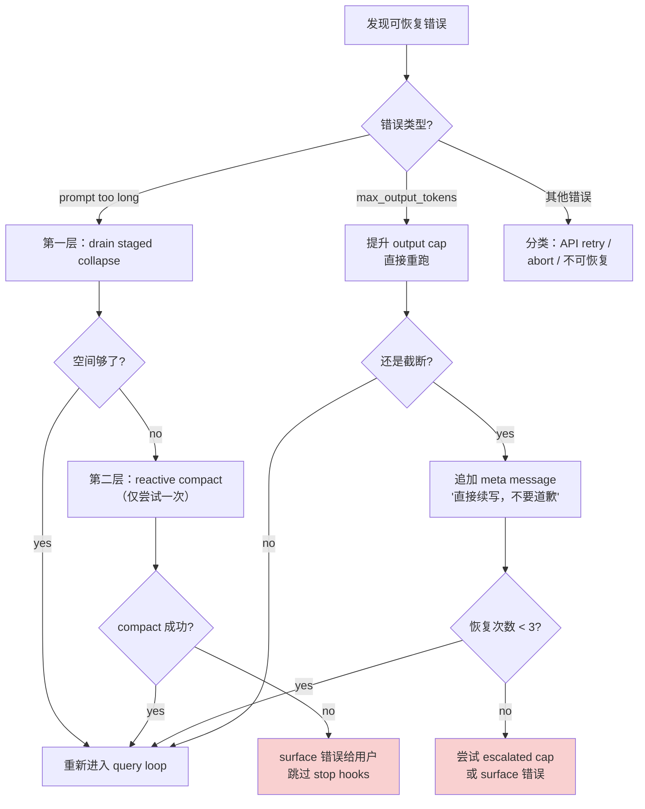

# Harness Engineering 学习笔记：第 5-6 章

---

## 第 5 章：上下文治理——Memory、CLAUDE.md 与 Compact 是预算制度

### 5.1 上下文一多，系统就容易产生一种低级幻觉

人一旦可以往上下文里不停塞东西，就很容易相信一个朴素的神话：信息越多，系统越聪明。这个想法听起来合情合理——毕竟知道得多，总比知道得少强。但实际情况是：

- 上下文不是图书馆，模型也不是藏书管理员
- 上下文不是一个"存进去就算拥有"的仓库——它首先是一笔昂贵的、易膨胀的、还会自我污染的预算
- 塞进去越多，每一轮都要重复注入，浪费上下文空间；要么靠模型自己回忆，迟早丢失关键信息

**Claude Code 的源码在这件事上很不浪漫。** 它并没有把上下文设计成一个可以无限堆叠的记忆池，反而在很多地方反复提醒自己：该加载什么、该截断什么、什么东西要长期保留、什么东西只能短期摘要。这些都是运行时必须严肃治理的事。

> **本章的核心命题：** Claude Code 怎样防止自己被记住的东西拖死。这件事和"记住更多"看起来相近，工程上却是两种制度——前者偏向收藏癖，后者才接近治理术。

### 5.2 CLAUDE.md 体系——长期指令不能和临场对话混在一起

Claude Code 在 `src/utils/claudemd.ts` 开头就把记忆层次说得很清楚。它把 instruction source 分成几层：


| 层次             | 文件位置                                                        | 性质               | 加载优先级            |
| -------------- | ----------------------------------------------------------- | ---------------- | ---------------- |
| managed memory | `/etc/claude-code/CLAUDE.md`                                | 全局管理员配置，所有用户共享   | 最低（最早加载，离工作目录最远） |
| user memory    | `~/.claude/CLAUDE.md`                                       | 用户个人私有，跨所有项目     | 较低               |
| project memory | 项目根目录的 `CLAUDE.md`、`.claude/CLAUDE.md`、`.claude/rules/*.md` | 项目级规则，团队共享       | 较高               |
| local memory   | `CLAUDE.local.md`                                           | 本地私有的项目规则，不进版本控制 | 最高（最晚加载，注意力最前沿）  |


这些文件按**优先级和目录距离**加载：离当前工作目录越近的 project 规则，优先级越高；越偏向私有、越偏向本地的规则，越晚加载——因而越靠近模型注意力的前沿。

**这件事特别要紧。** 因为它说明 Claude Code 从一开始就拒绝把"长期协作规则"和"本轮临时对话"混成一锅粥。团队规范、个人偏好、仓库约束，这些东西的寿命远长于某一轮用户消息。CLAUDE.md 的内容虽然每轮都会发送给模型，但它进入的是 **system prompt**（系统提示词的独立字段），而不是 messages 数组（聊天历史）。这意味着它不会被 compact 摘要掉，也不会和对话消息竞争上下文空间。如果没有这层分离，把规则当作普通聊天消息塞进对话里，系统就会在两个极端之间摇摆：要么每轮都手动重复注入规则消息，浪费上下文预算；要么靠模型从历史消息中自己回忆规则，迟早在某次 compact 后丢失。

#### @include 机制：防止无关内容涌入

`claudemd.ts` 给出的答案，是把这些稳定规则做成**可发现、可分层、可组合的持久指令系统**。还有个细节很有意思：它支持 `@include` 指令，并且只允许一批明确列出的文本扩展名（源码里定义了 `TEXT_FILE_EXTENSIONS`，包含 100+ 种文本格式），同时限制最大递归深度 `MAX_INCLUDE_DEPTH = 5`。

这说明工程师除了追求 include 的便利，也在提防另一种常见事故：有人把二进制文件、巨型文档、甚至不该进 prompt 的东西糊涂带进来了。

> **这是一种很像正经工程师的克制。** 系统会先问："什么东西值得进入系统记忆，什么东西一旦进入就是污染？"

#### 条件规则：按路径匹配加载

`.claude/rules/*.md` 支持在 frontmatter 中用 `paths:` 字段指定 glob 模式。系统通过 `processConditionedMdRules()` 函数把这些规则与当前工作路径做匹配，只加载相关的规则文件。这意味着不同目录、不同文件类型可以有不同的规则集——前端代码用前端规范，后端代码用后端规范，互不干扰。

### 5.3 MEMORY.md 是索引，不是日记本

如果 CLAUDE.md 管的是规则层，那么 memdir 处理的就是另一类更细的**长期记忆**。`src/memdir/memdir.ts` 里有一段设计很值得反复看：`ENTRYPOINT_NAME` 被定义成 `MEMORY.md`，但这个文件并不被鼓励用来直接堆内容，它被定义为 **index**。

源码里写得很实在。`buildMemoryLines()` 明确告诉模型，保存 memory 是两步：

1. 把具体 memory 写进独立文件（如 `user_role.md`、`feedback_testing.md`）
2. 再在 MEMORY.md 里加一个一行指针（格式：`- [标题](文件名.md) — 一句话说明`）

**为什么这么麻烦？** 因为系统知道入口文件天然会被频繁加载，而频繁加载的东西一旦变胖，整套上下文就会被它慢慢拖成一个不好收拾的胖子。

这也是为什么 `memdir.ts` 里专门有两个硬限制：


| 常量                     | 值      | 含义                   |
| ---------------------- | ------ | -------------------- |
| `MAX_ENTRYPOINT_LINES` | 200    | MEMORY.md 最多加载 200 行 |
| `MAX_ENTRYPOINT_BYTES` | 25,000 | MEMORY.md 最多加载 25KB  |


超过了，系统会直接调用 `truncateEntrypointContent()` 截断，并在结尾追加明确警告：只加载了一部分，请把细节移到 topic files。

#### 截断的具体逻辑

`truncateEntrypointContent()` 返回一个 `EntrypointTruncation` 对象，包含截断后的内容、原始行数/字节数、以及两个布尔标记（`wasLineTruncated`、`wasByteTruncated`）。截断顺序是：先按行数截断（在自然换行处切割），再检查字节数——如果某些行特别长，即使行数没超标，字节数也可能超标，此时会在最后一个换行符前切断，避免截在一行中间。

**这套做法特别像一个见过太多失控索引的人。** 它不相信大家会天然克制，所以把"入口必须短"做成硬约束。因为入口文件一旦既当目录又当正文，最后就既不是目录、也不是正文，只是一个谁都不愿再读第二遍的烂尾摘要。

> **从 Harness Engineering 的角度看，这里抽出来的原则非常清楚：** 长期记忆必须分成"入口"和"正文"。入口负责低成本寻址，正文负责高密度承载。把两者混为一谈，最终一定是入口失效，随后整套记忆系统退化成摆设。

### 5.4 Session memory——短期连续性也不能靠聊天记录硬扛

只有长期 memory 还不够。agent 系统真正难受的地方，常常在于"这轮之前我们到底做到哪一步了"。这是一次会话内部的连续性问题。

Claude Code 在 `src/services/SessionMemory/prompts.ts` 里专门给这件事建了一套模板。默认模板里有这些栏目：


| 栏目                                    | 记录什么                   | 为什么需要         |
| ------------------------------------- | ---------------------- | ------------- |
| **Current State**                     | 现在做到哪了，有哪些待完成任务，下一步是什么 | 压缩后模型需要知道工作进度 |
| **Task specification**                | 用户要求构建什么、设计决策、背景上下文    | 防止压缩后遗忘任务定义   |
| **Files and Functions**               | 重要文件、内容、与任务的关系         | 保留代码层面的工作现场   |
| **Workflow**                          | bash 命令、执行顺序、输出解读方式    | 保留操作步骤记忆      |
| **Errors & Corrections**              | 遇到的错误、修复方式、失败的尝试       | 避免重复踩坑        |
| **Codebase and System Documentation** | 系统组件、它们如何组装在一起         | 保留架构理解        |
| **Learnings**                         | 什么方法有效、什么没效果、什么要避免     | 积累经验          |
| **Key results**                       | 用户要求的精确输出（表格、答案、文档）    | 保留核心产出        |
| **Worklog**                           | 精简的步骤记录                | 时间线参考         |


你一看就知道，这不是给人抒情的。它关心的是：**现在做到哪了，踩过什么坑，改过哪些文件，后面该接什么。** 更有意思的是更新 prompt 的语气。源码里明确要求：

- 只能用 Edit tool 更新 notes file
- 不要提 note-taking 这件事本身（不要"元操作"干扰正常工作）
- 不要改模板结构
- **Current State 必须始终反映最近工作**
- 每节都要信息密集，但要控制预算

#### Session memory 的运行机制：后台提取 + 替代 compact

理解这些栏目的关键，在于知道它们**不是给人看的笔记，而是 compact 的预制摘要**。整个机制分两个阶段：

**写入阶段（后台增量更新）：** Session memory 在 `initSessionMemory()` 时注册为一个 **post-sampling hook**——每次主对话的模型完成一轮输出后，这个 hook 就有机会被触发。但不是每轮都触发。`shouldExtractMemory()` 会检查两个条件：（1）上次提取后上下文增长了足够多的 token；（2）自上次提取后发生了足够多次工具调用。两者都满足时，系统 fork 出一个独立 subagent（`querySource = 'session_memory'`），这个 subagent 读取当前笔记文件，用 Edit tool 增量更新各栏目内容，**全程在后台运行，不打断主对话**。更新完成后，系统会记录下 `lastSummarizedMessageId`——"到这条消息为止的内容都已经提取进 session memory 了"。

**读取阶段（替代传统 compact）：** 当 autocompact 触发时，系统的**第一选择不是调模型生成摘要**，而是调用 `trySessionMemoryCompaction()`：如果 session memory 文件存在且非空，就直接把它当作摘要使用，只保留 `lastSummarizedMessageId` 之后的新消息——**省掉一次 API 调用**。只有 session memory 不可用时，才退回传统的 `compactConversation()`（调模型现场生成摘要）。




所以那 9 个栏目的模板不是装饰性的——它们是一种**预结构化的摘要格式**，让后台 subagent 每次增量更新时知道往哪填，也让 compact 时能直接当摘要使用。传统 compact 每次都要临时调模型生成摘要，而 session memory 把这个工作分摊到了平时。

#### Session memory 的预算控制

这里有个极其工程化的细节。`prompts.ts` 里定义了两个关键常量：


| 常量                                | 值             | 含义              |
| --------------------------------- | ------------- | --------------- |
| `MAX_SECTION_LENGTH`              | 2,000 tokens  | 单个栏目的 token 上限  |
| `MAX_TOTAL_SESSION_MEMORY_TOKENS` | 12,000 tokens | 所有栏目的总 token 预算 |


超过预算，系统不会夸你记得细——而是要求你 aggressively condense（积极压缩），尤其优先保留 **Current State** 和 **Errors & Corrections**。

`analyzeSectionSizes()` 函数会解析每个 section 并通过 `roughTokenCountEstimation()` 估算 token 数；`generateSectionReminders()` 会为超限的 section 生成 CRITICAL 警告。在 compact 时，`truncateSessionMemoryForCompact()` 会按 `MAX_SECTION_LENGTH * 4` 字符数截断每个 section。

> **这很能说明问题。** 真正成熟的系统，会把"为继续工作保留最有用的部分"当成美德。因为上下文预算是工作内存，工作内存的第一职责是可操作。

### 5.5 自动 compact——上下文治理首先是预算治理

到这里，长期规则、持久 memory、session memory 都有了，但上下文还是会膨胀。于是 Claude Code 在 `src/services/compact/autoCompact.ts` 里进一步承认一个现实：**不管你多会整理，只要对话够长，总会逼近窗口边缘。**

#### 预算计算：先给 compact 本身留钱

要理解这里的预算逻辑，先要理解传统 compact 的工作方式。Compact 本质上是**让模型读完整段会话历史，然后输出一段摘要文本来替代原来的历史**。这意味着 compact 自身就是一次 API 调用——会话历史是 input，摘要是 output。而 Claude API 的 context window 是 input + output 共享的，如果 input 把窗口占满了，模型就没有空间写 output，compact 就会失败。

所以 `getEffectiveContextWindowSize()` 做的第一件事，就是从总窗口里**预扣一笔摘要输出空间**：`MAX_OUTPUT_TOKENS_FOR_SUMMARY = 20,000` tokens。这个值不是随意定的——源码注释说根据实际观测，99.99% 的 compact 摘要输出在 17,387 tokens 以内，取 20,000 作为安全上界。

为什么摘要输出会这么长？因为 compact prompt（`src/services/compact/prompt.ts:61-77`）要求模型输出包含 9 个部分的详细摘要：用户请求与意图、关键技术概念、涉及的文件与代码片段、遇到的错误与修复、问题解决过程、所有用户消息（原文）、待完成任务、当前工作状态、下一步计划。模型还被要求先写一个 `<analysis>` 思考块（由 `formatCompactSummary()` 在保存前丢掉），再写正式的 `<summary>`，所以实际输出会比最终保留的摘要更长。

除了这两层主要扣减，系统还为其他场景预留了 buffer：


| 预算                                | 用途               |
| --------------------------------- | ---------------- |
| 警告阈值 buffer（20,000 tokens）        | 显示上下文即将用完的警告     |
| 错误阈值 buffer（20,000 tokens）        | 显示上下文严重不足的错误     |
| 手动 compact buffer（3,000 tokens）   | `/compact` 命令的余量 |
| autocompact buffer（13,000 tokens） | 自动 compact 的触发余量 |


这套数字背后有一个很朴素的道理：**上下文治理需要提前为失败和恢复留出余地。** 不留余地的系统，平时看着像节俭，出事时就暴露出本质——那只是把风险账单留给下一轮。

#### Circuit breaker：连续失败就停手

Autocompact 不是每次都能成功。比如会话里有一张特别大的图片导致 media size error，或者上下文结构本身就有问题——这时候调模型做摘要，模型会报错返回。问题在于：**autocompact 是每轮自动触发的**。如果第一次失败了，下一轮对话结束后系统又检测到"上下文超阈值了"，于是又尝试 compact，又失败，再下一轮又来……每次失败都是一次白白浪费的 API 调用。

这个问题在真实环境里有多严重？源码注释引用了 BigQuery（Anthropic 内部的数据仓库）的统计：曾有 1,279 个 session 出现过 50 次以上的连续 compact 失败，最极端的一个 session 连续失败了 3,272 次。也就是说，某个用户的一次对话里，系统默默地浪费了 3,272 次 API 调用在一个注定失败的操作上。

解决方案是 circuit breaker（熔断器）模式。系统用 `AutoCompactTrackingState` 追踪 compact 的状态：


| 字段                    | 记录什么                     | 为什么需要             |
| --------------------- | ------------------------ | ----------------- |
| `compacted`           | 本 session 是否成功 compact 过 | 判断是否第一次 compact   |
| `turnCounter`         | 当前对话轮次编号                 | 关联 compact 发生在哪一轮 |
| `turnId`              | 当前轮次的唯一标识                | 用于重复检测和日志追踪       |
| `consecutiveFailures` | 连续失败次数                   | **熔断器的核心计数器**     |


熔断逻辑很直接：

```
第 1 轮：compact 失败 → consecutiveFailures = 1 → 下次还试
第 2 轮：compact 失败 → consecutiveFailures = 2 → 下次还试
第 3 轮：compact 失败 → consecutiveFailures = 3 → 触发熔断！
第 4 轮起：不再尝试 compact，直接跳过

（中间任何一次成功 → consecutiveFailures 归零，熔断器恢复）
```

熔断阈值是 `MAX_CONSECUTIVE_AUTOCOMPACT_FAILURES = 3`。一旦触发，本 session 后续所有 autocompact 都被跳过。这意味着系统主动承认：**在这个局面里，compact 已经救不了了，继续尝试只是浪费钱。**

> 这就是成熟系统的态度——不是"永不放弃地重试"，而是**在确认手段无效时及时止损**。

#### 递归保护与功能门控

`shouldAutoCompact()` 还内置了递归保护——如果当前请求来源（`querySource`）本身就是 `session_memory`、`compact` 或 `marble_origami`，则直接跳过 autocompact，避免"为了压缩而触发的请求又触发压缩"的死循环。

此外还有两个功能门控：`REACTIVE_COMPACT` 开启时会抑制主动 autocompact（让 reactive compact 在 API 报 prompt-too-long 时再介入）；`CONTEXT_COLLAPSE` 开启时会完全抑制 autocompact（由 collapse 机制接管上下文管理）。

### 5.6 compactConversation()——摘要要重建可继续工作的上下文

很多人一听 compact，会以为就是"把前面聊天摘要一下"。Claude Code 的实现要复杂得多。`src/services/compact/compact.ts` 里的 `compactConversation()` 真正做的，是把原有上下文拆开、摘要、再注入必要附件，**重新搭出一个还能工作的后 compact 世界**。

#### 第一步：压缩前的清洗


| 清洗函数                           | 做了什么                                                         | 为什么                                                                   |
| ------------------------------ | ------------------------------------------------------------ | --------------------------------------------------------------------- |
| `stripImagesFromMessages()`    | 把图片替换成 `[image]`、文档替换成 `[document]` 之类的标记                    | 图片对摘要无用，但对 token 极贵，尤其在 CCD（桌面端）场景下容易让 compact 请求本身触发 prompt-too-long |
| `stripReinjectedAttachments()` | 把反正之后还要重新注入的 attachment 先剥掉（如 skill_discovery、skill_listing） | 免得浪费 token 让摘要模型去总结那些马上会被原样补回来的内容                                     |


仅这两个动作就说明，compact 会有选择地丢掉那些"对于摘要无用、但对于 token 极贵"的部分。

#### 第二步：摘要失败时的处理——compact 自己也可能 prompt too long

正常 compact 的流程是：系统把**整段会话历史**发给模型，让模型输出摘要。但如果会话历史本身就已经长到连"请帮我摘要"这个请求都超出了 context window，API 会返回 prompt too long 错误——摘要工具自己都装不下要摘要的内容。

这时候 `truncateHeadForPTLRetry()` 就是最后手段：**砍掉最早的一部分对话，让剩下的内容能塞进窗口，再重试摘要。** 虽然会丢失早期历史，但至少能让系统恢复运行。

**什么是"API round 分组"？** 系统用 `groupMessagesByApiRound()` 把会话历史按"一次完整的 API 交互"分组。每一组包含：一条 assistant 消息 + 它发起的所有工具调用 + 对应的工具返回结果。分组是为了保证砍的时候不会把一次交互砍成两半（比如保留了 tool_use 但丢了 tool_result，API 会报格式错误）。

用一个具体例子说明砍的过程：

```
假设一段会话按 API round 分组后：

  组 0 (最早):  用户"帮我搭项目"  → 模型回复 → 3 个工具调用+结果  (~8K tokens)
  组 1:         用户"加登录功能"  → 模型回复 → 5 个工具调用+结果  (~12K tokens)
  组 2:         用户"修个 bug"   → 模型回复 → 2 个工具调用+结果  (~6K tokens)
  组 3:         用户"跑下测试"   → 模型回复 → 4 个工具调用+结果  (~9K tokens)
  组 4 (最近):  用户"重构一下"   → 模型回复 → 6 个工具调用+结果  (~15K tokens)

  总计 5 组，compact 请求发出后 API 返回：prompt too long，超出 15K tokens
```

**砍多少？** 有两种策略：

```
策略 A（精确计算）：API 错误响应里包含"你超了 15K tokens"
  → 从最早的组开始累加：组 0 = 8K，组 0+1 = 20K ≥ 15K
  → 砍掉组 0 和组 1，用组 2-4 重试 compact

策略 B（兜底 20%）：API 错误格式无法解析，不知道超了多少
  → 砍掉 20% 的组 = floor(5 × 0.2) = 1 组
  → 砍掉组 0，用组 1-4 重试 compact
```

**砍完的收尾处理：** 砍掉组 0 后，剩余消息可能以 assistant 消息开头，而 Claude API 要求第一条消息必须是 user 角色。所以系统会在最前面插入一条占位 user 消息，内容就是那个标记：`'[earlier conversation truncated for compaction retry]'`。下一次重试时，这条标记会被识别并先剥掉，避免它自己变成一个组导致后续重试只砍标记不砍实际内容、陷入原地打转。

整个流程最多重试 `MAX_PTL_RETRIES = 3` 次。如果 3 次之后还是塞不下，就抛出错误放弃 compact。

> **这很像真实世界，而不是 demo。** 系统不仅承认主流程会爆，还承认"救火工具本身也会爆"。

#### 第三步：compact 成功之后的环境重建

而在 compact 成功之后，Claude Code 做的不是简单保留一条 summary。它还会：


| 恢复动作                                                                     | 具体内容                                                                                                                                                             | 为什么需要                                |
| ------------------------------------------------------------------------ | ---------------------------------------------------------------------------------------------------------------------------------------------------------------- | ------------------------------------ |
| 清空旧的 `readFileState`                                                     | 释放之前缓存的文件读取状态                                                                                                                                                    | compact 后旧的文件缓存失效                    |
| 重新生成 post-compact file attachments                                       | 恢复最近访问过的文件（最多 `POST_COMPACT_MAX_FILES_TO_RESTORE = 5` 个，总预算 `POST_COMPACT_TOKEN_BUDGET = 50,000` tokens，单文件上限 `POST_COMPACT_MAX_TOKENS_PER_FILE = 5,000` tokens） | 这些文件构成当前工作面的局部现实                     |
| 把 plan attachment 补回来                                                    | 恢复当前执行计划                                                                                                                                                         | 否则模型压缩完以后可能忘了自己还处在 plan discipline 里 |
| 把 plan mode attachment 补回来                                               | 恢复 plan mode 状态                                                                                                                                                  | 保持模式一致性                              |
| 把 invoked skills attachment 补回来                                          | 恢复已调用的 skill 内容，按最近使用排序，每个 skill 设 token cap（`POST_COMPACT_MAX_TOKENS_PER_SKILL = 5,000`，总预算 `POST_COMPACT_SKILLS_TOKEN_BUDGET = 25,000`）                        | 避免 skill 本身在 post-compact 阶段反客为主     |
| 把 deferred tools、agent listing、MCP instructions 的 delta attachment 重新补回来 | 重新广播工具/agent 的完整清单（见下方"增量 diff 与全量重播"说明）                                                                                                                         | compact 后模型需要知道有哪些工具可用               |
| 执行 session start hooks 和 post-compact hooks                              | 触发钩子，让外部系统知道发生了 compact                                                                                                                                          | 保持 hook 生态一致                         |
| 写 compact boundary message                                               | 记录 pre-compact token 数与边界信息                                                                                                                                      | 后续可以据此截取有效消息范围                       |


#### 增量 diff 与全量重播：deferred tools / agent listing / MCP instructions 的恢复机制

上面表格最后提到的三类 delta attachment，共享同一套"增量 diff"通知机制。理解它需要先知道一个背景：Claude Code 启动时注册了很多工具（Read、Edit、Bash、各种 MCP 工具等），但不会一开始就把所有工具的完整定义（schema）都塞进 prompt——那样太占 token。系统用"延迟加载"策略：先只通过 attachment 告诉模型有哪些工具**名字**可用，模型想用哪个再通过 ToolSearch 获取完整 schema。

**平时的增量通知方式：**

```text
第 1 轮：系统发现 30 个 deferred tools
  → 注入 attachment: "新增: Read, Edit, Bash, Grep, ... 共 30 个"
  → 模型知道有 30 个工具

第 2 轮：用户新连了一个 MCP server，多了 2 个工具
  → 系统扫描历史中已有的 delta attachment，发现已广播 30 个
  → diff：只有 2 个是新的
  → 注入 attachment: "新增: mcp__slack__send_message, mcp__slack__list_channels"

第 3-10 轮：无变化 → 不注入（省 token）
```

**compact 后的问题：** 第 1-10 轮的所有消息（包括那些 delta attachment）被替换成了一段摘要文本。如果系统照常扫描历史中的 delta attachment 来做 diff，会发现历史里已经没有任何 delta attachment 了——模型丢失了"有哪些工具可用"的认知。

**Claude Code 的解法：** compact 时故意传入**空消息数组** `[]` 作为历史，让 diff 函数认为"之前什么都没广播过"，从而输出所有工具作为"新增"——等于全量重播。agent listing 和 MCP instructions 的恢复也是同样的原理：平时靠"只说变化"省 token，compact 后靠"假装从没说过"来全量重播。

这些动作合在一起，意思很明确：**compact 的目标是把"继续干活所需的运行时环境"重新铺平。** 摘要只是中间产物，不是最终目的。




> **所以 compact 在 Claude Code 里更像一次受控重启，而不是一次聊天总结。** 旧上下文被转译成新的工作底座。这种设计很值得记住，因为很多系统只做前半截——生成摘要——结果 compact 之后虽然"还记得大概"，却已经失去了工具状态、计划状态、附件状态，接下来还得再花几轮找回自己。

### 5.7 上下文治理的关键是保留工作语义

如果只看 `compact.ts` 的后半段，会发现一个贯穿始终的倾向：Claude Code 真正在意的是把**工作语义**保住。

具体体现：

- 它会恢复最近访问文件的 attachment，因为这些文件往往构成当前工作面的局部现实
- 它会恢复 plan mode，因为否则模型压缩完以后可能忘了自己还处在 plan discipline 里
- 它会保留 invoked skills 的内容，但又给每个 skill 设置 token cap，避免 skill 本身在 post-compact 阶段反客为主
- 源码里有一句很有味道的话：**per-skill truncation beats dropping**。意思是，即使要截，也优先保住开头那一段最关键指令，而不是整个扔掉

#### 一个具体例子：compact 前后模型"看到"的东西对比

假设你正在用 Claude Code 做一个任务：给一个 Express 项目加 JWT 认证。经过 20 轮对话后，上下文膨胀到 170K tokens，触发 autocompact。此时模型的工作状态是：

- 正处于 plan mode（已经制定了 3 步计划，完成了 2 步）
- 最近读过 5 个文件：`auth.ts`、`middleware.ts`、`routes.ts`、`package.json`、`test/auth.test.ts`
- 调用过 `/commit` 这个 skill（它有自己的一套提交规范指令）
- 还有 3 个 MCP 工具可用（比如 feishu-mcp）

**如果只做"纯摘要"（很多系统的做法）：**

compact 后模型看到的只有这些：

```text
[compact boundary marker]

[摘要]: 用户要求给 Express 项目加 JWT 认证。已完成路由保护和
middleware 实现。遇到过 token 过期时间配置错误，已修复。
接下来需要写测试...

（完。大约 2K tokens）
```

**问题在哪？** 模型现在不知道：

- 自己还在 plan mode 里（可能开始自由发挥，不再遵循计划）
- `auth.ts` 当前长什么样（需要重新 Read 一遍才能继续改）
- `/commit` skill 的具体规范是什么（下次提交时可能格式不对）
- 有哪些工具可用（可能忘了可以用 MCP 工具）

结果就是：compact 后的头几轮，模型要花时间重新读文件、重新发现工具、重新理解自己的角色，效率大幅下降，甚至可能偏离计划。

**Claude Code 实际做的事——重建完整工作环境：**

compact 后模型看到的消息序列是这样的（`compact.ts:517-594`，按 `buildPostCompactMessages()` 的顺序排列）：

```text
1. [compact boundary marker]                    ← 标记压缩边界
     记录 pre-compact token 数 = 170K
     记录之前发现过的 deferred tools

2. [摘要 summary]                               ← 模型生成的摘要（~几K tokens）
     包含任务定义、已完成步骤、遇到的错误、当前进度...

3. [file attachment: auth.ts]                   ← 最近读过的文件（最多 5 个）
     createPostCompactFileAttachments() 按时间排序
     每个文件最多 5K tokens，总共最多 50K tokens
     跳过已在保留消息中出现的文件（避免重复）

4. [file attachment: middleware.ts]
5. [file attachment: routes.ts]
6. [file attachment: test/auth.test.ts]
7. [file attachment: package.json]

8. [plan attachment]                            ← 当前计划内容
     "步骤1 ✓ 步骤2 ✓ 步骤3 待完成"
     createPlanAttachmentIfNeeded()

9. [plan mode attachment]                       ← "你当前处于 plan mode"
     createPlanModeAttachmentIfNeeded()
     确保模型继续在计划框架内工作

10. [skill attachment: /commit]                  ← 调用过的 skill 的文件正文
      createSkillAttachmentIfNeeded()
      按最近使用时间排序
      每个 skill 保留其文件正文（如 .claude/skills/commit/prompt.md）的前 5K tokens——
      因为 skill 文件通常把使用规则和指令放在开头，截前部就能保住最关键的规范

11. [deferred tools delta]                       ← 可用工具清单
      getDeferredToolsDeltaAttachment()
      来源：当前 session 注册的所有工具（Read, Edit, Bash, 各种 MCP 工具等）。
      平时系统用增量 diff 通知模型"新增/移除了哪些工具"，但 compact 后旧的 diff 消息被摘要吃掉了。
      所以这里传入空消息历史做 diff（diff against [] = 认为之前什么都没广播过），让模型重新收到完整的工具名称列表

12. [agent listing delta]                        ← 可用 agent 清单
      getAgentListingDeltaAttachment()
      来源：当前 session 配置的 agent 定义（toolUseContext.options.agentDefinitions）
      原理同上——原本 agent 列表嵌在 AgentTool 的description 里，但这导致 MCP 连接变化时 tool schema 跟着变、缓存频繁失效，所以改为通过 delta attachment注入。compact 后同样全量重播

13. [MCP instructions delta]                     ← MCP 工具的使用说明
      getMcpInstructionsDeltaAttachment()
      来源：当前连接的 MCP server 提供的 instructions（如 feishu-mcp 的"如何读写飞书文档"说明）同样是平时增量通知、compact 后全量重播

14. [session start hook results]                 ← CLAUDE.md 等上下文重新加载
      processSessionStartHooks('compact')
```

对比一下两种做法：


| 维度             | 纯摘要                     | Claude Code 的做法            |
| -------------- | ----------------------- | -------------------------- |
| 模型知道自己在做什么     | 大致知道                    | 精确知道（plan + 当前步骤）          |
| 模型能直接继续改代码     | 不能，需要重新 Read 文件         | 能，文件已经补回来了                 |
| 模型遵守 skill 规范  | 不一定，规范内容丢了              | 能，skill 指令已恢复              |
| 模型知道有哪些工具      | 不知道，deferred tools 信息丢了 | 知道，工具清单已重新广播               |
| 模型保持 plan mode | 不会，模式信息丢了               | 会，plan mode attachment 已恢复 |
| 上下文大小          | ~2K tokens              | ~30-50K tokens（但远小于 170K）  |


**这就是"保留工作语义"的含义：** compact 之后的上下文虽然只有原来的 1/5 到 1/3，但模型拿到它就能**立刻接着干活**，不需要再花几轮重新读文件、重新发现工具、重新理解自己的角色。

**这就是治理，不是纯粹节流。** 纯节流是砍哪里都行，治理是知道该砍哪里、该保什么。

> **从这里可以抽出一个相当稳妥的经验：** 上下文系统应该**优先保留能维持行动语义的东西**，而不是优先保留看起来信息量最大的东西。文件细节、当前计划、错误修正、技能约束，这些都直接决定下一步能不能做对。反过来，冗长的历史对话、重复出现的附件、已经可由运行时重新发现的东西，就没必要再占座位。

### 5.8 从源码里可以提炼出的第五个原则

这一章最后可以压成一句话：

> **上下文是工作内存。治理它的目标是支持系统继续工作。**

Claude Code 的源码在几个层面共同支持这个判断：


| 源码模块                       | 做了什么                           | 说明了什么                          |
| -------------------------- | ------------------------------ | ------------------------------ |
| `claudemd.ts`              | 把长期指令分层加载                      | 稳定规则要和临时对话分开治理                 |
| `memdir.ts`                | 把 MEMORY.md 定义成索引并强行截断         | 入口文件必须短而可寻址                    |
| `SessionMemory/prompts.ts` | 用固定模板提炼会话连续性，并对 section 和总量设预算 | 短期记忆也必须结构化                     |
| `autoCompact.ts`           | 为 compact 预留输出预算、缓冲区和失败熔断      | 上下文窗口要按风险来经营                   |
| `compact.ts`               | 在摘要后恢复计划、文件、技能、工具附件和 hook 状态   | compact 的目标是重建工作语义，而不是写一段好看的总结 |


**如果把这些抽象成可迁移的工程原则，大概这样几条：**

1. 长期规则、长期记忆、会话连续性，应该分层，不该混写
2. 入口型记忆必须短小，否则整个系统会被入口拖垮
3. session summary 应该服务于"继续工作"，而不是服务于"回忆完整"
4. compact 是上下文治理主路径
5. 压缩后的上下文必须保住运行语义，而不是只保住语言表面

---

## 第 6 章：错误与恢复——出错后仍能继续工作的代理系统

### 6.1 工程世界最不值得相信的话，就是"正常情况下"

很多系统设计档里，最常见的偷懒方式，就是先讲一遍"正常情况下"的流程，仿佛只要主路径足够漂亮，错误就会自动显得次要。可代理系统一旦进入真实运行环境，这种写法通常很快就露馅：

- 因为模型会被截断（max output tokens）
- 请求会超长（prompt too long）
- hook 会制造回环
- 工具会中断
- fallback 会发生
- 恢复逻辑本身也会失手

所以，判断一个代理系统成熟不成熟，不能只看它回答顺畅的时候有多像个人，而要看**它出故障的时候像不像系统**。前者容易靠一点 prompt 工程粉饰，后者只能靠运行时纪律。

> **Claude Code 在这一点上的可取之处，是它没有假装自己不会出错。** 相反，源码里反复体现出一种冷静判断：**错误属于主路径，恢复则是必须提前设计好的运行机制。**

### 6.2 prompt too long 是一种必然周期

对长会话代理来说，prompt too long 是一种迟早会来的季节变化。你如果把它当偶发异常，系统迟早会被它教育。

Claude Code 的 `src/query.ts` 就没有把它当偶发异常处理。在流式阶段，系统甚至会"暂时扣下"这类错误，不立刻把它原样抛给用户。流式阶段里，withheld 逻辑会识别 recoverable errors，包括：


| 可恢复错误类型           | 含义                     |
| ----------------- | ---------------------- |
| prompt too long   | 上下文总长超过模型窗口限制，API 拒绝处理 |
| media size error  | 图片/文档附件太大              |
| max output tokens | 模型输出在写到一半时被截断          |


**这件事的意思很明确：有些错误要先交给恢复系统试着处理，再决定是否展示给用户。** 这个顺序很关键，因为用户真正关心的通常是系统还能不能继续干活。

#### prompt too long 的分层恢复

先理解背景。第 3 章讲过，query loop 每一轮向 API 发请求之前，会做一系列上下文治理（history snip、microcompact、context collapse、autocompact 等）。但这些治理是**预防性**的——它们根据估算提前压缩，不能保证 100% 不超限。当 API 真的返回 prompt too long（HTTP 413）时，就需要**应急恢复**。

Claude Code 对这个应急恢复设计了**两层**，从轻到重依次尝试（`query.ts:1085-1165`）：

**第一层：context collapse drain（低成本，不调用模型）**

context collapse 是一种在 query loop 中运行的**局部替换**机制。它不像 compact 那样把整段对话压成一段摘要，而是对**单条旧消息**做替换——比如把一条 5000 token 的工具调用结果替换成一句 30 token 的摘要（"读了 auth.ts，180 行，含 JWT 配置"）。原始消息保留在 REPL 的完整历史里不动，同时系统在一个叫 **collapse store** 的地方存了一张替换表（源码注释：`Summary messages live in the collapse store, not the REPL array`），内容类似：

```
消息 3 的替换摘要 → "读了 auth.ts，180行，含JWT配置"
消息 7 的替换摘要 → "跑了测试，3个失败"
```

每次构建发给 API 的消息列表时，系统从 REPL 完整历史里读消息，碰到 collapse store 里有对应记录的，就用短摘要替换掉原始内容。API 实际收到的是 30 token 的摘要，但原始 5000 token 的工具结果还在 REPL 里（源码注释称之为"read-time projection"——读取时替换，不动原数据）。

在正常 query loop 中，`applyCollapsesIfNeeded()` 每轮会扫描消息历史，识别出哪些旧消息可以被折叠，并生成好对应的短摘要。但这些折叠不一定立刻生效——有些会被 **staged**（暂存），等后续轮次再写进 collapse store。这借用了 git 的概念：就像 `git add` 把文件放进 staging area 但还没 `git commit`，staged 的折叠意味着"替换摘要已经准备好了，但还没正式启用，下次发给 API 时这条消息仍以原始完整内容出现"。系统之所以不一次全部 commit，是为了保守——一次折叠太多条消息，模型可能突然丢失大量细节。

当 API 返回 413 时，`recoverFromOverflow()` 把所有 staged 的折叠**一口气全部 commit**——本来打算分几轮慢慢生效的，现在 413 了，全部立刻写进 collapse store 让替换生效：

```
假设 20 轮对话后，有 3 条旧消息被标记为可折叠（staged）：

  消息 3:  Read(auth.ts) 的工具结果 (4000 tokens)
          → 可折叠为 "读了 auth.ts，180行，含JWT配置" (30 tokens)

  消息 7:  Bash(npm test) 的工具结果 (3000 tokens)
          → 可折叠为 "跑了测试，3个失败" (20 tokens)

  消息 12: Read(middleware.ts) 的工具结果 (5000 tokens)
          → 可折叠为 "读了 middleware.ts，含鉴权逻辑" (25 tokens)

  消息 15-20: 较新的消息 → 未标记（太新，不适合折叠）

遇到 413 → recoverFromOverflow() 一次性执行全部 staged 折叠：
  消息 3:  4000 → 30 tokens   (节省 3970)
  消息 7:  3000 → 20 tokens   (节省 2980)
  消息 12: 5000 → 25 tokens   (节省 4975)
  总共释放 ~11,925 tokens

  → transition.reason = 'collapse_drain_retry'
  → 用折叠后的消息重试 API 请求
```

这一步的关键优势是：**不需要调用模型**（纯本地操作），而且**只替换了特定几条旧消息**，其他消息的完整内容都保留着，比全量 compact 的信息损失小得多。

如果全部 commit 之后重试还是 413（说明能折叠的都折叠了还不够，或者根本没启用 context collapse），就进入第二层。源码用 `state.transition?.reason !== 'collapse_drain_retry'` 来判断：如果上一轮已经把 staged 折叠排空了（drain = 排空，像放水一样把 staged 列表清空）还是 413，就不再重复，直接往下走。

**第二层：reactive compact（中等成本，需要调用模型）**

这一层调用 `reactiveCompact.tryReactiveCompact()`，做的事情和第 5 章讲的 `compactConversation()` 类似：把整段对话发给模型生成摘要，用摘要替代旧消息，再补回文件/plan/skill 等附件。

这一步的代价是：**需要一次额外的 API 调用**来生成摘要，而且旧的对话细节会被压缩成一段概括性文本，细粒度信息会丢失。

```
drain 后还是 413（或者没有 context collapse 可用）
  → tryReactiveCompact() 调用模型生成摘要
  → 170K tokens 的对话被压缩成 ~几K tokens 的摘要 + 附件
  → hasAttemptedReactiveCompact = true（标记为已尝试，不再重复）
  → transition.reason = 'reactive_compact_retry'
  → 用压缩后的消息重新进入 query loop
```

**如果两层都失败了：** 直接把错误展示给用户（并跳过 stop hooks，避免死循环——见 6.3 节）。

两层恢复的对比：

| 维度 | 第一层：collapse drain | 第二层：reactive compact |
|------|----------------------|----------------------|
| 成本 | 零（纯本地操作） | 一次 API 调用 |
| 信息损失 | 低（只删已标记为可折叠的内容） | 高（整段历史被压缩成摘要） |
| 前提条件 | 需要 context collapse 功能开启且有待提交的折叠 | 需要 reactive compact 功能开启且未曾尝试过 |
| 恢复速度 | 瞬间 | 需要等模型生成摘要 |

> **这种分层设计的本质是：先试成本最低、损失最小的手段，不行再升级到更重的手段。** 不会一上来就把整段对话压成摘要——如果只需要删掉几条早期工具调用细节就能腾出空间，为什么要做全量压缩？

### 6.3 响应式 compact——恢复的关键在于别把自己逼进死循环

很多系统做恢复时容易犯一个愚蠢但常见的错误：一旦发现错误可恢复，就不停重试，直到把错误从偶发事件升级成资源灾难。

Claude Code 对这件事非常警惕。`query.ts` 里有两个地方都能看出这种警惕：

#### 第一处：hasAttemptedReactiveCompact

这是一个 `boolean` 标记，存在 query loop 的 `State` 类型中。一旦 reactive compact 已经试过，再次遇到同类问题时，系统不会装傻重来。因为工程师很明白：如果 compact 之后还是不行，那么继续 compact 大概率只是在把同一种失败换个姿势再演一次。

#### 第二处：stop hooks 的防死循环处理

先解释什么是 stop hooks。用户可以在 settings.json 里配置 shell 命令，让系统在模型**每轮输出完成后**自动执行。比如配一个 hook："每次模型回复后，跑一下 `eslint` 检查代码质量"。如果 hook 发现问题（比如 lint 不通过），它可以返回 blocking error 告诉系统"这个回复有问题"，系统就会把 hook 的反馈注入消息历史，让模型重新生成。

正常流程：

```
用户提问 → 模型回复了一段代码 → 执行 stop hook（eslint）
  → hook 说 "lint 不通过，第 42 行缺少分号"
  → 把这条反馈注入消息历史 → 模型重新回复（修好了分号）
  → hook 说 "通过了" → 结束
```

**但如果模型这轮根本没有正常回复**——比如 API 返回了 prompt too long 错误——会发生什么？

```
用户提问 → API 返回 prompt too long（模型没有产生任何回复）
  → 执行 stop hook → hook 往消息历史里注入了反馈（增加了 token）
  → 系统重试 → 上下文更长了 → 又 prompt too long
  → 又执行 stop hook → 又注入更多内容 → 又重试 → 又 prompt too long
  → ... 无限循环，每一轮上下文都在变长
```

每一轮 hook 都往消息里加东西，上下文越来越长，prompt too long 就越来越严重——这就是源码注释说的 **death spiral**（死亡螺旋）。

所以 Claude Code 的处理是：**如果最后一条消息是 API 错误（不是模型的正常回复），就直接跳过 stop hooks**（`query.ts:1168-1175`），把错误展示给用户。因为模型根本没有产生有意义的回复，hook 没有东西可以评估，强行跑 hook 只会往已经爆掉的上下文里继续加料。

```typescript
// No recovery — surface the withheld error and exit. Do NOT fall
// through to stop hooks: the model never produced a valid response,
// so hooks have nothing meaningful to evaluate. Running stop hooks
// on prompt-too-long creates a death spiral: error → hook blocking
// → retry → error → … (the hook injects more tokens each cycle).
```

> **原因很简单：这时候继续走形式流程，只会让坏事更有仪式感。**

### 6.4 max_output_tokens 的处理——恢复要以续写为主

**什么是 max_output_tokens 错误？** 模型每次回复有一个输出 token 上限（比如默认 8K tokens）。如果模型正在写一段很长的代码或解释，写到一半就触及上限，API 会强制截断输出——模型的回复被切成了半成品。

**很多产品的做法（不好）：** 截断后让模型重新回复，模型通常会说"抱歉，刚才被截断了，我来总结一下之前的内容……"。这段道歉和总结本身又消耗了几百个 token，然后模型才开始继续干活——但很可能又被截断，然后又道歉……每一轮都在浪费 token 做 recap，实际工作越来越少。

**Claude Code 的做法（`query.ts:1188-1230`）：** 分两层恢复，核心思路是"别废话，接着写"。

**第一层（静默提升上限）：** 如果当前使用的是保守的默认 cap（比如 8K），系统直接把 `maxOutputTokensOverride` 提升到更高值（如 64K），然后**用完全相同的请求重跑一遍**。注意，这一步没有插入任何提示消息，也没有让模型知道自己被截断了——系统只是悄悄给了更大的输出空间，让模型一次把活干完。

```
模型在写一段长代码 → 写到 8K tokens 被截断
  → 系统检测到 max_output_tokens 错误
  → maxOutputTokensOverride = 64K
  → 用相同的输入重跑请求（模型不知道自己被截断过）
  → 这次有 64K 空间，写完了
```

**第二层（告诉模型续写）：** 如果提升上限后还是被截断（真的写太长了），系统追加一条 meta user message，内容是：

> **直接继续，不要道歉，不要 recap，若中断发生在半句，就从半句接着写；剩余工作拆小一点。**

这条指令让模型从断点处接着写，而不是从头回顾。这一步可以重复最多 `MAX_OUTPUT_TOKENS_RECOVERY_LIMIT = 3` 次。

```
第一次续写：模型从第 64K token 的断点接着写 → 又被截断
第二次续写：从新断点接着写 → 又被截断
第三次续写：从新断点接着写 → 写完了（或者 3 次用完，surface 错误给用户）
```

**为什么续写比 recap 好？** 每一次 recap 都会消耗 token 重复已经写过的内容，而且模型每次"回忆"之前写了什么时都可能产生偏差（语义漂移）。续写则是直接从断点继续，不浪费 token，不引入偏差。

### 6.5 auto compact 的失败熔断——恢复系统自己也要受治理

5.5 节已经详细讲过 autocompact 的 circuit breaker 机制（连续失败 3 次后熔断，跳过后续所有 autocompact）。从错误恢复的角度看，这里要强调的是它体现的原则：

> **任何自动恢复机制都必须可计数、可限次、可熔断。** 如果恢复机制本身反复失败却不停手，它就不再是保险丝，而是新的起火点。autocompact 的 circuit breaker 就是在承认：这个恢复手段在当前局面里已经失效了，继续重试只是浪费资源。

### 6.6 compact 自己也会爆，所以连"修复动作"都需要修复策略

5.6 节已经详细讲过 `truncateHeadForPTLRetry()` 的完整机制（API round 分组、两种砍法、收尾处理）。从错误恢复的角度看，这里要强调的是它构成了一条**三层修复链条**：

```text
正常对话 → prompt too long
  → 第一层：collapse drain（本地裁剪，见 6.2）
  → 第二层：reactive compact（调模型生成摘要，见 6.2）
    → compact 自己也 prompt too long！
      → 第三层：truncateHeadForPTLRetry（砍掉最早的对话组，重试 compact，见 5.6）
        → 最多重试 3 次，还不行就放弃
```

> **工程系统不能只设计正常路径和一层恢复——它需要承认恢复本身也会失败，并为此准备后路。**

### 6.7 abort 语义——中断也属于错误恢复的一部分

用户按 Esc 中断模型，看起来是交互体验的事。但从系统内部看，中断会留下一堆"半成品"需要收尾。

**具体场景：** 模型正在回复，同时发起了 3 个工具调用（比如读 3 个文件）。用户按了 Esc：

```
模型的回复（被中断）:
  content: [
    { type: 'text', text: '让我读取这三个文件...' },
    { type: 'tool_use', name: 'Read', id: '1' },  ← 已执行完，有 tool_result
    { type: 'tool_use', name: 'Read', id: '2' },  ← 正在执行，被中断
    { type: 'tool_use', name: 'Read', id: '3' },  ← 还在排队，未执行
  ]
```

此时对话历史里有 3 个 `tool_use`，但只有 1 个有 `tool_result`。Claude API 要求**每个 tool_use 必须有配对的 tool_result**，否则下一轮 API 调用会报格式错误。

**Claude Code 的处理（`query.ts:1011-1029`）：** 系统调用 `StreamingToolExecutor.getRemainingResults()`，为那两个没有结果的工具生成 **synthetic tool_result**——一条标记为 `is_error: true` 的消息，内容说明"被用户中断了"。这样对话历史就是完整的：

```
tool_use  id='1' → tool_result id='1' (正常结果：文件内容)
tool_use  id='2' → tool_result id='2' (synthetic：Interrupted by user)
tool_use  id='3' → tool_result id='3' (synthetic：Interrupted by user)
```

下一轮模型看到这个历史，就能理解："我想读 3 个文件，读到了 1 个，另外 2 个被用户打断了"，而不是看到一个断裂的、缺少 tool_result 的对话。

**compact 中的 abort 也有类似保护：** 如果用户在 compact 过程中按了 Esc，系统不会把半成品 summary 当作正式结果——compact 被中止，系统状态回到 compact 之前，而不是停在"压缩了一半"的中间态。

> **中断不只是"用户不想看了"，而是一次需要正确收尾的状态转移。** 如果不补齐那些 synthetic tool_result，对话历史就会出现断裂，模型在下一轮会困惑，API 会报错，整个系统的后续行为都不可预测。

### 6.8 错误处理真正保护的，是执行叙事的一致性

前面 6.2-6.7 讲了各种具体的错误恢复机制。6.8 要讲的是：**这些机制共同服务于一个更深层的目标——让系统始终能说清楚自己经历了什么。**

用一个例子串起来。假设一次对话中连续发生了多种错误：

```
第 15 轮：模型输出被截断（max_output_tokens）
  → 系统记录 transition.reason = 'max_output_tokens_recovery'
  → 系统记录 maxOutputTokensRecoveryCount = 1
  → 提升 cap 后重跑

第 16 轮：上下文太长（prompt too long）
  → 系统记录 transition.reason = 'collapse_drain_retry'
  → collapse drain 释放了空间

第 17 轮：还是太长，触发 reactive compact
  → 系统记录 transition.reason = 'reactive_compact_retry'
  → 系统记录 hasAttemptedReactiveCompact = true
  → compact 后写入 compact boundary（记录压缩前 token 数）

第 18 轮：用户按 Esc 中断
  → 系统为 3 个未完成的工具生成 synthetic tool_result
  → 对话历史保持完整
```

`query.ts` 的 `State` 类型里那些看似琐碎的字段——`transition.reason`、`maxOutputTokensRecoveryCount`、`hasAttemptedReactiveCompact`、compact boundary——实际上构成了一条**执行日志**。通过这条日志，系统（以及运维人员）可以还原出完整的故事：

- 第 15 轮：输出被截断，恢复方式是提升 cap，这是第 1 次截断恢复
- 第 16 轮：上下文超标，先试了 collapse drain
- 第 17 轮：drain 不够，升级到 reactive compact，compact 前有 170K tokens
- 第 18 轮：用户中断，3 个工具被标记为中断

**如果没有这些记录会怎样？** 系统表面上还能继续运行，但没人能说清楚发生了什么。用户看到的是"怎么突然变慢了"；运维看到的是"日志里一会儿 hook retry 一会儿 compact retry，什么原因不知道"；团队看到的是"系统出了问题，没人知道怎么复现"。

> **所以错误恢复真正修补的，不只是错误本身，还有系统对自己行为的解释能力。** 一个能解释自己经历的系统，出了问题可以定位和修复；一个说不清自己经历的系统，出了问题只能重启。

### 6.9 从源码里可以提炼出的第六个原则

这一章最后可以收成一句话：

> **代理系统的体面，体现在错误发生后仍能维持可解释、可限界、可继续的执行秩序。**

Claude Code 的源码在几个点上共同支持这个判断：


| 源码模块                                                     | 做了什么                                  | 说明了什么               |
| -------------------------------------------------------- | ------------------------------------- | ------------------- |
| `query.ts` 的 withheld 机制                                 | 暂时扣下可恢复错误，先交给恢复分支处理                   | 错误要先尝试转化，而不是立刻暴露    |
| prompt-too-long 的分层恢复                                    | 先走 collapse drain，再走 reactive compact | 恢复路径按成本和破坏性分层       |
| `hasAttemptedReactiveCompact` 与 stop hook guard          | 明确防止死循环                               | 恢复本身也要受治理           |
| max_output_tokens 恢复                                     | 先提 cap，再要求模型直接续写                      | 恢复的目标是延续任务，不是补充礼貌动作 |
| `autoCompact.ts` 的 consecutive failure 与 circuit breaker | 连续失败 3 次后熔断                           | 自动恢复必须可熔断           |
| `compact.ts` 对自身 prompt-too-long 也有降级修复                  | `truncateHeadForPTLRetry()` 裁掉最早的历史   | 连修复动作本身都要有恢复策略      |
| abort 时补齐 synthetic tool_result                          | 确保每个 tool_use 都有配对结果                  | 中断也是一种需要语义收尾的失败态    |





**如果把这些抽成可迁移的工程原则，大概是这样：**

1. **错误恢复要分层**——不要所有问题都打一把重锤
2. **恢复逻辑必须防止自我回环**——hasAttemptedReactiveCompact 和 stop hook guard 就是为此而生
3. **自动恢复需要计数和熔断**——consecutive failures + circuit breaker
4. **截断后的最佳恢复通常是续写，不是总结**——保持任务连续性优先
5. **中断也是一种需要语义收尾的失败态**——补齐 synthetic tool_result
6. **一个系统是否可靠，最终要看它出错后还能不能把自己的行为讲明白**——transition.reason、recovery count、compact boundary 都在服务叙事一致性

