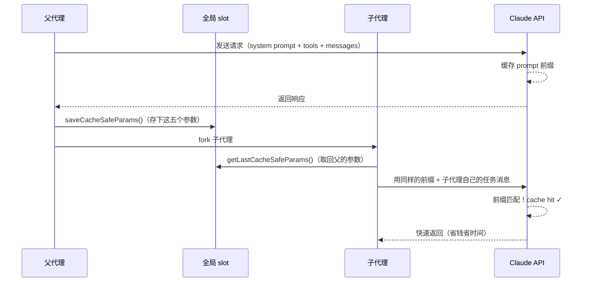
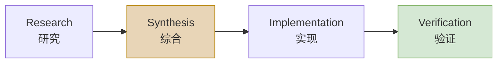
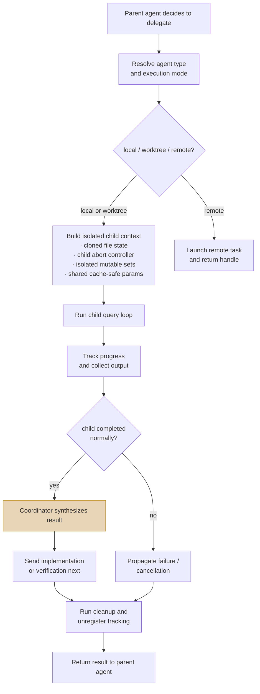

# Harness Engineering 学习笔记：第 7-9 章

---

## 第 7 章：multi-agent 与验证——用分工和验证管理不稳定性

### 7.1 单 agent 走到一定程度，问题就不再是"会不会做"，而是"怎么分工"

一个 agent 如果只在单线程里回答问题，很多矛盾都还能靠耐心遮过去。它慢一点，用户多等会儿；它想得乱一点，多追问几轮；它偶尔把上下文搅成一团，也还可以靠 compact 补救。可一旦任务变大，单 agent 模型就会碰到一个更难缠的问题：研究、实现、验证都挤在同一条上下文链上，彼此抢预算、抢注意力、抢叙事中心。

这时候，multi-agent 看上去像一种自然答案——再开几个 worker 不就行了？但事情没这么便宜。multi-agent 并不天然带来秩序，很多时候它只会把单 agent 的混乱并行复制几份。真正困难的是隔离这些 agent 的不稳定性，同时把结果组织回来。

**Claude Code 的源码在这点上很清醒。** 它没有把 subagent 当成"另一个会话的窗口"，而是把它当成一段需要明确缓存边界、状态边界、验证职责和清理责任的受管执行流程。

### 7.2 forked agent 的第一原则是 cache-safe

#### 先说清楚：什么是 forked agent

Claude Code 在运行时只有一个主对话循环（query loop）。当任务变大，需要让子代理去做研究、实现或验证时，系统不是"开了一个新的聊天窗口"，而是从主进程**分叉（fork）出一个受控的子执行流程**。

这个词借自 Unix 的 `fork()` 系统调用——父进程创建一个子进程，子进程继承父的部分状态，但在自己的隔离空间里运行。Claude Code 的 forked agent 也是这个思路：

```text
主代理（父）
  ├── 自己的上下文、状态、query loop
  │
  └── fork 出子代理
        ├── 继承：system prompt、用户上下文、工具定义（为了 cache）
        ├── 克隆：文件状态缓存（独立副本，不互相污染）
        ├── 新建：abort controller、memory 集合（完全隔离）
        └── 默认关闭：状态回写（setAppState = no-op）
```

**为什么不直接叫"子代理"或"新会话"？** 因为它既不是完全独立的新会话（那样太贵，缓存全丢），也不是和父代理共享一切的线程（那样会互相污染）。它是一个精心控制了"继承什么、隔离什么"的受管分叉，所以叫 forked agent。

#### 再说清楚：什么是 cache-critical params

这要从 Claude API 的 **prompt caching**（提示词缓存）机制说起。每次调 Claude API 时，你发送的内容包括 system prompt + 工具定义 + 消息历史。API 会把这些内容的**前缀**缓存下来。如果下一次请求的前缀和上次一样，API 就可以直接复用之前的计算结果，不用重新处理——这叫 **cache hit**（缓存命中）。

cache hit 的好处非常实际：

- **省钱**：缓存命中的 token 价格只有正常输入的 1/10
- **省时间**：跳过了重新编码和处理前缀的延迟

关键问题来了：**子代理调 API 时，它的请求前缀和父代理一样吗？** 如果子代理用的 system prompt、用户上下文、工具定义和父代理完全一致，那 API 侧已经缓存好的内容就可以直接复用。但只要有一个字段不同——哪怕只是工具上下文多了一行——API 就会认为这是一个全新请求，之前的缓存全部失效。

所以 **cache-critical params 就是"决定能否命中 API 缓存的那几个关键参数"**。子代理必须和父代理保持这些参数完全一致，否则就会把缓存打烂。

#### 源码怎么落地这件事

`src/utils/forkedAgent.ts` 开头有一段注释，非常能说明 Claude Code 对 sub-agent 的真实理解。它说 forked agent utility 的职责包括：

1. 与父代理共享 cache-critical params，确保 prompt cache hit
2. 跟踪整个 query loop 的 usage
3. 记录指标
4. 隔离可变状态，防止干扰主循环

这四条里，最先出现的是"共享 cache-critical params"——这并非偶然。

源码里定义了一个 `CacheSafeParams` 类型，显式列出了必须父子一致的五个字段：

```typescript
export type CacheSafeParams = {
  systemPrompt: SystemPrompt        // 系统提示词——prompt 最开头的部分，一改 cache 全断
  userContext: { [k: string]: string }   // 用户上下文（CLAUDE.md 等）——紧跟 system prompt
  systemContext: { [k: string]: string } // 系统上下文
  toolUseContext: ToolUseContext     // 工具定义和配置——工具列表是 prompt 的组成部分
  forkContextMessages: Message[]    // 父代理的消息前缀——保证子代理的消息开头和父一致
}
```

具体的共享流程：



还有一条专门提醒：别随便改 `maxOutputTokens`，因为 thinking config 也会受影响，而 thinking config 又是 cache key 的一部分。改了就等于换了缓存键，前面缓存的 token 全部作废。

**这段设计说明，多代理首先是运行时经济学问题。** 一个子代理如果每次都把父上下文重新烧一遍 token，看上去像在并行提效，实际只是把浪费并行化。Claude Code 在这个环节先处理的是：怎么 fork 才不把缓存打烂。

#### Usage 跟踪：每轮累计，结束时汇总

`runForkedAgent()` 在整个 query loop 期间累计一个 `totalUsage: NonNullableUsage` 对象，从 `message_delta` 流式事件里提取真实用量（input_tokens、output_tokens、cache_read_input_tokens、cache_creation_input_tokens），通过 `accumulateUsage()` 逐轮累加。子 agent 结束时，日志事件 `tengu_fork_agent_query` 会把完整用量写出，并计算 cache 命中率 = `cache_read_input_tokens / total_input_tokens`。

这意味着团队可以量化每一次 fork 的缓存效率——如果某个 agent type 的 cache hit rate 很低，说明它的上下文参数和父 agent 存在分歧，需要排查。

### 7.3 状态隔离说明，子 agent 首先要减少污染

forked agent 的第二个关键，在 `createSubagentContext()` 函数里。源码里对它的默认行为写得很直白：默认情况下，所有 mutable state 都隔离，避免干扰 parent。

它默认会做这些事：

| 隔离项 | 具体做法 | 目的 |
| --- | --- | --- |
| `readFileState` | 从父 agent `cloneFileStateCache()` 克隆 | 子 agent 的文件读取不会污染父的文件状态缓存 |
| `abortController` | 通过 `createChildAbortController()` 生成子级控制器 | 子 agent 可以被单独中止，父中止也会级联传播 |
| `getAppState` | 包装后设置 `shouldAvoidPermissionPrompts: true` | 后台子 agent 不弹权限对话框 |
| `setAppState` | 默认 no-op | 子 agent 不能修改父的全局状态 |
| `nestedMemoryAttachmentTriggers` | 重新建空集合 | 子 agent 发现的 memory 触发器不泄露给父 |
| `loadedNestedMemoryPaths` | 重新建空集合 | 同上 |
| `discoveredSkillNames` | 重新建空集合 | 子 agent 发现的 skill 不影响父的 skill 列表 |

还有一个容易忽略的细节：`contentReplacementState`（内容替换状态，例如工具返回结果被截断时的替换决策）也是从父 agent clone 来的。源码注释说明了原因——这些替换决策必须和父 agent 保持一致，否则同样的工具返回在父子 agent 间产生不同的内容，prompt cache 的前缀匹配就会断裂。这个点恰好把 7.2 节的 cache-safe 和本节的状态隔离串在了一起：**隔离是为了防污染，但缓存相关的决策必须同步，不能因为隔离而破坏缓存一致性。**

只有在明确 opt-in 的情况下，才会共享某些 callback：

```typescript
shareSetAppState?: boolean      // 共享父的状态变更回调
shareSetResponseLength?: boolean // 共享父的响应指标回调
shareAbortController?: boolean   // 共享父的 abort controller（而非创建子级）
```

这套设计特别重要，因为它揭示了一个很多人做multi-agent 时都会忽略的事实：**子 agent 最宝贵的地方，在于它可以避免把自己的局部混乱污染主线程。** 研究中的误判、临时读到的文件状态、一次性的推理枝权、正在进行的工具决策，如果全都直接写回主上下文，你得到的只会是更快的脏化。

Claude Code 在这里的态度是：共享要靠明确同意，隔离才是默认伦理。这种伦理很像数据库事务设计——它不假定"大家都是自己人，状态可以随便串"，而是假定"只要是可变状态，就必须先隔离，再决定共享哪些部分"。

> **不过有一个例外值得注意：** `setAppStateForTasks` 始终使用父的回调（如果存在）。源码注释解释了原因——如果子 agent 里启动了 Bash 任务，杀掉任务的操作必须能传达到根级 store，否则 Bash 进程会变成 PPID=1 的僵尸进程。这说明"状态隔离"的原则也不是铁板一块，而是在安全性和可操作性之间做了务实的权衡。

### 7.4 协调者模式说明，synthesis 才是稀缺能力

如果只看 `src/coordinator/coordinatorMode.ts`，你会发现 Claude Code 对 coordinator 的要求很有分寸。它明确说 coordinator 的工作包括：

- 帮用户达成目标
- 指挥 worker 做 research、implementation、verification
- 综合结果并和用户沟通
- 能直接回答的问题就直接回答，不要滥委派

最关键的一句，在 prompt 里：**Always synthesize**。当 worker 回报研究结果后，协调者必须先读懂，再写出具体 prompt——要包含具体文件、具体位置、具体变更——不要说"based on your findings"，不要把理解继续外包给 worker。

**这句话几乎就是multi-agent 系统的命门。** 因为真正稀缺的是有人把 worker 带回来的局部知识重新压成清晰、可执行、可验证的下一步。缺少这一层，multi-agent 很快就会退化成一种带着礼貌措辞的任务转发机。每个 agent 都在忙，系统整体却并没有更懂。

Claude Code 至少在 prompt 设计上很明白这个道理。它要求 research 和 synthesis 分开，要求协调者对研究结果负责，要求 follow-up prompt 里出现具体文件、具体位置、具体变更，而不是抽象地"根据前面的结论"。这是非常正统的工程分工：研究可以分布，但理解必须重新收束。

#### Worker 结果如何回到 coordinator

Worker 完成后，其结果以 **user-role message** 的形式回到 coordinator，包裹在 `<task-notification>` XML 标签里，包含：

| 字段 | 内容 |
| --- | --- |
| `task-id` | 任务唯一标识 |
| `status` | completed / failed / killed |
| `summary` | Worker 的自述摘要 |
| `result` | Worker 的完整输出 |
| `usage` | total_tokens、tool_uses、duration_ms |

这意味着 coordinator 能看到每个 worker 花了多少 token、用了多少工具、花了多长时间——这些信息为 synthesis 提供了基本的判断素材。

### 7.5 验证必须独立成阶段，否则"实现完成"很快就会冒充"问题解决"

`coordinatorMode.ts` 还有一段特别值得仔细看。它把常见任务分成四个阶段：



并且专门强调：verification 的目标是证明代码有效，而不只是确认代码存在。源码里甚至写得近乎不留情面：

- run tests **with the feature enabled**（不只是跑测试，要开着新功能跑）
- investigate errors, **don't dismiss as unrelated**（遇到报错，别随手归类为"不相关"）
- **be skeptical**（保持怀疑）
- test independently, **don't rubber-stamp**（独立测试，不要橡皮图章式通过）

这段话说明 Claude Code 没把验证当成实现 worker 顺手带一下的附属环节，而是当作第二层质量关。你甚至能在 prompt 里看到"implementation worker 自证一遍，verification worker 再作为第二层 QA"这种明确分层。

**为什么这点这么重要？** 因为在agent 系统里，"我改了代码"和"代码因此正确"之间，隔着一条很宽的河。模型尤其擅长在这条河上搭纸桥——它会给你改动、解释、甚至给你一段像样的测试输出，但这些都不等于功能真的在系统里站住了。

所以，把 verification 单列出来，是为了防止"会改代码"冒充"能交付结果"。Harness Engineering 在multi-agent 阶段真正需要的，正是这种角色分化：实现的人要尽量专注于改；验证的人要专门怀疑这些改动配不配活着。

### 7.6 hooks 和任务生命周期说明，子 agent 不是扔出去就算了

multi-agent 系统还有一个很容易被忽略的地方：spawn 只是开头，收尾同样重要。

`src/utils/hooks/hooksConfigManager.ts` 里定义了 **SubagentStart** 和 **SubagentStop** 两类 hook：

| Hook | 触发时机 | 输入数据 | 用途 |
| --- | --- | --- | --- |
| `SubagentStart` | subagent 启动时 | `agent_id`、`agent_type` | 观测子 agent 启动，可按 `agent_type` 匹配触发 |
| `SubagentStop` | subagent 即将结束时 | `agent_id`、`agent_type`、`agent_transcript_path` | 追踪子 agent 结束，拿到对话转录路径 |

SubagentStop 有一个特殊机制：如果 hook 脚本以 **exit code 2** 退出，系统会把 hook 的 stderr 内容作为反馈消息注入回 subagent，让它继续执行而不是就地停止。这相当于给团队开了一扇"拦截 + 补救"的门——hook 发现子 agent 输出不对时，可以在它结束前把纠正指令塞回去，而不是等它跑完再善后。其他 exit code（0 = 正常放行，非 0 非 2 = 中止 subagent）则走正常的通过/拒绝路径。

这说明子 agent 在 Claude Code 里是显式暴露生命周期节点的系统对象。启动时可以观测，停止前可以介入，转录路径可追踪。这里的重点在于，"子 agent 结束"也是需要被管理的事件。

与此同时，`src/tasks/LocalAgentTask/LocalAgentTask.tsx` 的 `registerAsyncAgent()` 又展示了另一个层面：每个 async agent 都会注册 cleanup handler，父 abort 可以自动传播给子 abort controller，任务结束后要 evict output、更新状态、解除 cleanup 注册。

```typescript
// 注册时：创建子级 abort controller，自动级联父中止
const abortController = parentAbortController 
  ? createChildAbortController(parentAbortController) 
  : createAbortController()

// 注册 cleanup handler：父进程退出时杀掉子 agent
const unregisterCleanup = registerCleanup(async () => {
  killAsyncAgent(agentId, setAppState)
})
```

这套机制非常像操作系统，不像聊天面板。它关心的核心问题是：

- 这个 agent 是否仍在运行
- 父任务死了它是否该跟着死
- 它的输出文件是否还要保留
- 它的 cleanup callback 有没有泄漏

很多multi-agent demo 都只做到"我能再起一个 agent"，Claude Code 至少做了一步：**它把 agent 当作会泄漏资源、会残留状态、会在父进程结束后变成孤儿的运行实体来看待。** 这才像是在把 agent 当系统组件处理。

### 7.7 验证不仅针对代码，也针对记忆和建议

multi-agent 与验证并不只发生在 code change 之后。Claude Code 在 memory 体系里也埋了一条很值得注意的原则。

`src/memdir/memoryTypes.ts` 里专门提醒：**memory records can become stale**。在基于 memory 给用户建议之前，要先 verify current state；如果记忆与现状冲突，要相信眼下读到的真实状态，并更新或删除 stale memory。

这句话放在multi-agent 章节里，恰好能说明一个更一般的事实：**验证是整个系统用来抵抗时间漂移和上下文漂移的基本习惯。** 一个系统如果只验证新写下去的代码，却不验证旧记忆、旧假设、旧索引，那它仍然会被历史信息带偏。

从这个角度看，verify 既是一项 skill，也是一种组织纪律。你可以把工作分出去，可以把信息存起来，可以让其他 agent 先跑在前面，但在用户准备据此行动之前，总要有人回到当前现实，重新确认这些东西还是真的。

### 7.8 multi-agent 真正解决的是不确定性的分区

把这些源码拼起来看，会发现 Claude Code 的multi-agent 设计其实围绕一个朴素目标展开：**给不确定性分区。**

- 研究 worker 可以在局部上下文里探索，不必把所有试探都写回主线程
- 实现 worker 可以专注修改，不必同时扛着全局沟通负担
- 验证 worker 可以专门怀疑，不必替自己的实现辩护
- coordinator 则留在中间做收束、综合和用户界面

这套分区带来的最大好处是职责清晰。职责一清晰，错误就更容易定位：是 research 没找到点子，还是 synthesis 没吃透研究，还是 implementation 写错了，还是 verification 放水了。反过来，如果所有事情都交给一个 agent 顺手完成，你最后得到的只是一锅浓汤——味道也许不错，出了问题却没法分层修。



> 所以，multi-agent 真正有价值的地方，在于把不同种类的不确定性关进不同约束容器里，再用 coordinator 把它们组织回来。这种做法比单纯追求并发更稳，也更符合工程要求。

### 7.9 从源码里可以提炼出的第七个原则

这一章最后可以压成一句话：

> **multi-agent 依赖清晰分工：研究、实现、验证和综合各自处在不同约束容器里，最后由协调者把结果重新缝合成可交付结果。**

Claude Code 的源码在几个地方共同支持这个判断：


| 源码模块 | 做了什么 | 说明了什么 |
| --- | --- | --- |
| `forkedAgent.ts` | 把 cache-safe 参数、usage tracking 与状态隔离放在第一位 | fork 首先是运行时控制问题 |
| `createSubagentContext()` | 默认隔离 mutable state，只允许显式 opt-in 共享 | 子 agent 先防污染再谈协作 |
| `coordinatorMode.ts` | 强调 coordinator 必须 synthesize，而不是转发研究结果 | 综合理解不能外包 |
| 同一个文件 | 把 verification 独立成阶段，并要求独立证明变更有效 | 实现与验证必须角色分离 |
| `hooksConfigManager.ts` | 提供 SubagentStart / SubagentStop 生命周期 hook | 子 agent 是可观测对象，不是黑箱线程 |
| `LocalAgentTask.tsx` | 处理 parent abort、cleanup、output eviction | agent 生命周期需要回收机制 |


如果把这些提炼成可迁移的工程原则，大概是这样：

1. fork 时先考虑 cache 和状态边界，再考虑"人格分工"
2. 子 agent 默认应隔离，可共享必须显式声明
3. 研究可以委派，综合理解不能委派
4. 验证必须与实现解耦，否则系统会奖励自证正确
5. agent 生命周期必须可观测、可中止、可清理
6. 真正的并行价值在于职责更清楚

---

## 第 8 章：团队落地——把一个聪明工具变成可复用制度

### 8.1 个人能用，不等于团队能承受

很多 AI 工具在个人手里看着很灵。一个熟练用户知道什么时候该补上下文，什么时候该盯着它别乱动，什么时候一句"不许碰这个目录"就能让它老实一会儿。于是大家很容易产生一个错觉：既然高手已经能把它用顺，那团队推广不过是多写点经验文档。

事实通常不是这样。个人技巧之所以有效，往往恰好因为它依赖个人持续盯防、个人背景知识和个人临场判断。团队一旦接手，问题就变了。你不能再假定每个人都知道哪些命令其实危险，哪些 memory 已经过期，哪些 skill 会把任务 fork 出去，哪些 approval 可以省，哪些一步都不能省。

**所以，团队落地的关键是把一部分原本靠高手脑内维持的秩序，写成系统级制度。** Claude Code 的源码之所以值得参考，是因为它已经把不少"高手经验"硬化成了加载顺序、权限语义、hook 生命周期和 skill 执行边界。

### 8.2 团队 CLAUDE.md 的价值，不在于写满，而在于分层稳定

前面已经讲过 `src/utils/claudemd.ts` 如何分层加载 CLAUDE.md。到了团队落地，这就不再只是实现细节，而会直接变成组织设计问题。

一个团队如果要把 Claude Code 真正用起来，最先该做的通常是把哪些规则属于 managed、哪些属于 user、哪些属于 project、哪些属于 local 先想清楚，而不是急着写 skill。因为规则一旦没分层，后面所有 skill、hook、policy 都会陷入互相打架。

团队级 CLAUDE.md 最适合放什么？通常是这些：

- **代码库级硬约束**：例如禁止某类目录写入、禁止某类危险命令
- **统一验证口径**：例如改完必须跑哪些检查，不能用什么"看起来通过"的替代
- **输出纪律**：例如 review 先报 findings，再报总结
- **常见协作约束**：例如不要覆盖用户未要求改动的文件，不要在脏工作区擅自 reset

**不适合放什么？** 通常是会频繁波动、只对少数任务生效、或者本来就该由 skill 承担的具体流程细节。因为 CLAUDE.md 一旦被写成一本百科全书，它很快就会变得没人愿意维护，而系统则会学到一种很典型的坏习惯：把过期规范当现行法律。

所以，团队 CLAUDE.md 的最佳状态，是稳定、清楚、最不容易产生争议。它应该承担基础规则文档的角色，而不是不断堆积临时讨论。

### 8.3 skill 是可复用的制度切片

很多团队做 skill 时最容易走偏的一点，就是把 skill 当成"长一点的 prompt 模板"。Claude Code 的 SkillTool 设计，明显不是这么看的。

#### Skill 的加载与触发机制

`src/tools/SkillTool/prompt.ts` 里把规则写得很死：当用户请求匹配 skill 时，这是 blocking requirement，必须先调用 Skill tool；不能嘴上提 skill 却不实际调用；skill 已经加载过就不要再重复加载。

这意味着 skill 不是建议，而是强制协议。prompt 里的原文语气非常明确：

> "When a skill matches the user's request, this is a **BLOCKING REQUIREMENT**: invoke the relevant Skill tool BEFORE generating any other response about the task"

一旦匹配，系统**必须**走 skill 的执行路径，不允许模型"我大概知道这个 skill 要干什么，让我自己来"的绕行。这跟一般的 prompt hint 完全不同——hint 给的是偏好，blocking requirement 给的是约束。模型在这里没有"我觉得可以跳过"的自由度。

#### Skill 在子 agent 中执行

到了 `src/tools/SkillTool/SkillTool.ts` 与 `utils/forkedAgent.ts` 这一层，又能看见另一件事：**skill 往往在 forked sub-agent context 里执行**，有自己的 token budget、自己的 context isolation、必要时还会带上允许的工具集合。

具体执行流程：

1. 创建新的 `agentId`
2. 准备 forked 上下文（`prepareForkedCommandContext`）
3. 解析 skill 允许的工具列表（`parseToolListFromCLI`）
4. 将允许的工具合并进 `alwaysAllowRules.command`——这意味着 skill 内部的工具调用可以跳过权限对话
5. 选择 agent 类型（skill 自带的 agent 定义 > general-purpose > 第一个可用）
6. 通过 `runAgent()` 在隔离上下文中执行
7. 结束后清理：`clearInvokedSkillsForAgent(agentId)`

这说明 skill 在 Claude Code 里不是一段"建议模型怎么说话"的软说明，更接近一个**带执行语义的制度切片**。它把某类任务的知识、工具边界、工作流顺序和验证要求打包起来，变成一个可以被稳定调用的操作单元。

#### Skill 的预算控制

Skill 列表本身也有预算管理。listing 预算约为上下文窗口的 1%，每个 skill 的描述最多 250 字符（`MAX_LISTING_DESC_CHARS`）。超出预算时，内置 skill 保留完整描述，非内置 skill 被截断以适应空间。这意味着 skill 多了以后，系统会自动收缩展示空间，迫使 skill 的描述精练而可辨识。

#### 团队视角下的 skill 治理

团队落地时，这点尤其重要。因为只有当 skill 被视为制度切片，而不是提示词收藏夹，团队才会认真去做下面这些事情：

- 明确 skill 的适用边界
- 明确它允许动用哪些工具
- 明确它应该直接执行，还是应该 fork 到子 agent
- 明确它的输出物和验证方法

否则 skill 很快就会退化成一堆名字好听、内容冗长、但真正触发时谁也说不准会发生什么的"半自动口号"。

### 8.4 approval 用来替团队划责任边界

Claude Code 整套权限机制，从 `useCanUseTool.tsx` 到 `PermissionResult.ts`，再到 `forkedAgent.ts` 里 `alwaysAllowRules` 的局部注入，其实都在说明一件事：**团队落地里最重要的制度之一，是把"会做"和"被允许做"区分开。**

权限决策分三种结果：

```typescript
type PermissionDecision<Input> = 
  | PermissionAllowDecision<Input>   // 允许执行
  | PermissionDenyDecision<Input>    // 拒绝执行（附原因）
  | PermissionAskDecision<Input>     // 需要人工确认（附描述）
```

而权限规则来源被精确分类：

| 来源 | 含义 |
| --- | --- |
| `userSettings` | 用户个人设置的规则 |
| `projectSettings` | 项目级共享规则 |
| `localSettings` | 本地私有规则 |
| `flagSettings` | 功能标记控制的规则 |
| `policySettings` | 组织策略级规则 |
| `cliArg` | 命令行参数注入的规则 |
| `command` | skill/命令注入的规则（fork 时合并进来） |
| `session` | 当前会话中授予的规则 |

这一点在个人使用时容易被低估，因为个人往往愿意临场放权。可团队里不一样。一旦 agent 开始：

- 写文件
- 改 Git 状态
- 调网络
- 访问 MCP
- 持久写 memory

那么每一步都同时是技术动作和责任动作。谁批准的，为什么可以自动过，哪些场景必须 ask，哪些规则能被 hook 覆盖，哪些绝对不能——这些都必须有制度。

`hooksConfigManager.ts` 里甚至给 `PermissionDenied`、`PreToolUse`、`UserPromptSubmit`、`Notification` 这些事件都预留了结构化 hook 入口。你不必把它们全用上，但这种设计已经说明：**approval 在 Claude Code 里是一套可插桩、可观测、可扩展的治理链，不只是一个 UI 弹窗。**

团队实践上，这意味着一个很简单的建议：**审批不要按"工具种类"粗暴切，而要按"后果不可逆性"和"环境敏感度"切。** 读文件、列目录、纯分析，一般可以放宽；改工作区、推 Git、打外网、碰生产资源，就该明显收紧。否则所谓自动化，最后只是在替团队扩大事故半径。

### 8.5 hook 的真正用途是把制度挂到生命周期上

团队里一说 hook，很多人马上会想到"又多了一层可能出问题的脚本"。这想法也不完全错——hook 确实会带来新的复杂度。但 Claude Code 的实现提醒我们，hook 的价值不在于脚本本身，而在于它给制度找到了生命周期锚点。

`hooksConfigManager.ts` 里列出来的事件，其实就是一张团队治理插点表：

| Hook 事件 | 触发时机 | 团队治理场景举例 |
| --- | --- | --- |
| `SubagentStart` / `SubagentStop` | 子 agent 启动 / 结束 | 记录子 agent 活动，结束前跑验证性检查 |
| `PreCompact` / `PostCompact` | 压缩前 / 后 | compact 前后补充组织级说明或记录摘要 |
| `StopFailure` | 回合因 API 错误终止 | 按错误类型（rate_limit、auth_failed、billing_error 等）分类处理 |
| `InstructionsLoaded` | instruction 文件被加载时 | 记录 observability |
| `SessionStart` / `SessionEnd` | 会话开始 / 结束 | session end 时做归档或回收 |
| `DirectoryChange` | 工作目录切换 | 可按新目录加载不同规则 |
| `FileChanged` | 文件变更 | 触发增量检查或通知 |
| `PermissionRequest` / `PermissionDenied` | 权限请求 / 被拒 | 审计权限使用，监控异常拒绝 |
| `Setup` | 初始化或维护时 | 触发环境检查或配置同步 |

你把这些事件连起来看，就会明白它们的真正作用：**让规范有机会在正确时机发生。** 比如：

- instruction file 被加载时记录 observability
- compact 前后补充组织级说明或记录摘要
- subagent 结束前跑验证性检查
- session end 时做归档或回收

这比把所有制度都塞进 CLAUDE.md 强得多。因为制度并不都属于静态知识，有些制度本来就是时点动作。静态规则该写在 CLAUDE.md，时点动作就该挂在 hook 上。分不清这点，最后只会得到两种坏结果：要么 CLAUDE.md 巨长，要么 hook 巨乱。

### 8.6 团队要复用的，不只是 skill，还有验证定义

#### 什么是"验证定义"

验证定义（Verification Definition）是团队对"什么算验证通过"达成的共识标准——类似 Scrum 里的 Definition of Done，但专门针对验证环节。它回答的核心问题是：**当我们说一个任务"验证通过"了，具体意味着做了哪些检查、达到了什么标准？**

举个具体例子。假设团队有一个"修改 API 端点"的 skill，三个人分别用它完成了任务：

- 张三：agent 改完代码，`npm test` 通过了，就算完
- 李四：agent 改完代码，看了一眼 diff 觉得"逻辑对"，直接合了，没跑测试
- 王五：跑了测试，还用 curl 请求了一次确认返回值正确，检查了错误码处理

三个人用的是同一个 skill（流程一样），但对"验证通过"的理解完全不同。**验证定义就是把王五脑子里的标准写成团队共识**，比如："改了 API 端点的任务，验证必须包含：1）单元测试通过；2）实际请求确认返回值正确；3）检查错误码处理"。有了这三条，不管是谁（人还是 agent）做验证，门槛都一样。

#### 为什么 skill 管不了这件事

落地 AI coding agent，最常见的失败在于团队对"完成"根本没有统一定义。有人觉得能跑就行，有人觉得测试过一半就行，有人觉得模型解释得挺像样也行。这样一来，再聪明的系统也只能学会迎合最低标准。

skill 能统一"怎么做"（流程），但管不了"做到什么程度算完"（质量）。张三和王五用同一个 skill，skill 都"成功执行完了"，但产出质量天差地别。**skill 复制的是流程，验证定义复制的是质量底线。** 前者没有后者，就是在用统一的流程生产参差不齐的结果。

#### Claude Code 怎么抵抗质量滑坡

Claude Code 的很多地方都在抵抗这种滑坡：

- coordinator mode 把 verification 独立成阶段——不是 implementation worker 自己顺手验证，而是交给独立的 verification worker
- verify skill 也不只是检查代码存在，它会明确要求"prove the change works by running the app"

这对团队特别重要。如果团队没有统一"什么算验证通过"，那么每个 skill 最后都会演化出自己的地方标准。到那一步，agent 系统越能干，团队质量只会越不一致。

所以，团队落地时，与其先做二十个花哨 skill，不如先把三条验证定义写清楚：

1. **哪些任务必须有独立验证**——例如：改了业务逻辑的必须验证，纯文档修改可以跳过
2. **验证至少包含哪些动作**——例如：跑测试 + 类型检查 + 实际运行确认功能正常
3. **验证失败时是否允许标记为"已完成但有已知问题"**——例如：允许，但必须在 PR 里注明

这三条一旦不清楚，后面任何自动化都只是加速模糊。

### 8.7 观测与审计说明，制度落地的关键是留下可复盘轨迹

个人使用 agent 时，很多错误都还能靠记忆和直觉补洞。团队里不行。团队真正需要的是：事情出了以后，能不能追出这一步为什么发生。

Claude Code 的实现里，日志、telemetry、task output、transcript path、hook event、agent notification 这些东西虽然分散，但合起来是在做同一件事：给系统留下可复盘轨迹。

| 子系统 | 记录什么 | 回答什么复盘问题 |
| --- | --- | --- |
| skill invocation | skill_name、execution_context、invocation_trigger、was_discovered | 是谁触发的这个 skill？是用户主动调还是系统匹配到的？ |
| forked agent | 完整 token 用量 + cache 命中率 | 这次 fork 花了多少钱？缓存效率如何？ |
| subagent stop hook | agent_transcript_path | 子 agent 跑的完整对话记录在哪？ |
| task 系统 | 状态变化 + 输出文件 | 任务在哪一步从正常变成了异常？输出是什么？ |
| compact boundary | 上下文重写点标记 | 哪些信息在 compact 之后被丢弃了？ |

这说明团队落地的一个基本原则：**不要只部署能力，还要部署解释能力。** 否则团队很快会遇到一种极其尴尬的场景：大家都知道 agent 大概做了什么，但没人能准确说出它为什么那么做、谁允许它那么做、它究竟在哪一步开始偏离。

制度之所以需要审计，是因为出了问题之后，只有可追溯轨迹才能让团队继续相信制度本身。

### 8.8 从源码里可以提炼出的第八个原则

这一章最后可以压成一句话：

> **团队落地的关键，是把个人经验硬化成分层规则、可执行 skill、审批边界和可复盘生命周期。**

Claude Code 的源码在几个地方共同支持这个判断：

| 源码模块 | 做了什么 | 说明了什么 |
| --- | --- | --- |
| `claudemd.ts` | 分层加载团队规则（managed → user → project → local） | 团队规则必须先分层，再注入 |
| `SkillTool` | 强制调用语义 + forked 执行 | skill 应被当作制度切片，而不是提示词收藏夹 |
| 权限链 + `alwaysAllowRules` | 按来源分类的 allow/deny/ask 规则 | approval 必须和责任边界绑定 |
| `hooksConfigManager.ts` | 提供大量生命周期事件 | 制度需要挂到时点，而不是全塞进静态文档 |
| subagent/task/transcript/output 体系 | 提供观测和回收能力 | 团队要复用的是可追踪的做事轨迹 |

如果把这些提炼成团队可操作原则，大概是这样：

1. 先写分层 CLAUDE.md，再谈复杂自动化
2. 先统一验证定义，再扩 skill 数量
3. approval 应按后果和环境分级，而不是按工具名字一刀切
4. hook 用来挂制度时点，不用来堆万能脚本
5. 任何可自动执行的流程，都应该可审计、可回收、可解释

---

## 第 9 章：Harness Engineering 十条原则

### 写在前面

写技术书有个坏习惯，讲完一堆细节以后，生怕下判断，仿佛只要把复杂性展示够了，就可以免除结论责任。其实不行。复杂归复杂，判断还是要下。因为团队真正带得走的，往往是若干能反复使用的原则，而不是某个版本的函数名。

前面八章绕来绕去，无非是在反复逼近这样一个事实：**模型不可靠，但系统仍然可以可靠；前提是你别把可靠性寄托在模型身上，而要把它做进 harness。**

这一章不再展开细讲，只把前面的论点压成十条原则。它们不是格言，也不是口号，它们来自 Claude Code 源码与工程结构里的工作判断。

### 9.1 把模型当不稳定部件，不要当同事

同事可以被信任地承担职责，模型不能。模型也许能像同事一样说话，但它不会自动获得同事那种稳定性、责任感和持续判断力。你越早承认这一点，系统就越早开始长出权限、恢复、验证和回滚。

> **对应的源码证据：** 整个 permission 体系（allow/deny/ask 三态决策）、circuit breaker 熔断机制、verification 独立阶段——这些都是在对"模型可能出错"这个前提做系统级对冲。

### 9.2 Prompt 是控制面的一部分

system prompt 用来定义行为协议。它和 runtime、tool schema、memory、hook 一起组成控制平面。把 prompt 当人格设定，最后你会得到一个很会表演、但不受约束的系统。

> **对应的源码证据：** `coordinatorMode.ts` 里的 prompt 不是在描述"你是一个什么样的助手"，而是在规定 coordinator 的职责边界、任务分阶段执行逻辑、和 synthesis 的强制要求——这是控制协议，不是角色扮演。

### 9.3 Query loop 才是agent 系统的心跳

真正的 agent 依赖一段持续的执行循环。输入治理、流式消费、工具调度、恢复分支、停止条件，都是这个心跳的一部分。没有 query loop 的系统，也许能做 demo，但还谈不上运行时。

> **对应的源码证据：** `forkedAgent.ts` 中 `runForkedAgent()` 围绕 query loop 累计 usage、处理流事件、管理 abort 和恢复——这是一个完整的运行时循环，不是一次 API 调用。

### 9.4 工具是受管执行接口

一旦模型开始碰 shell、文件系统、Git 和网络，问题就从"它会不会说"变成"它会不会留下后果"。所以工具必须被调度、被授权、被中断、被补账。越危险的工具，越不能按普通能力对待。

> **对应的源码证据：** 权限规则按来源八级分类（userSettings → session）、forked skill 的工具白名单合并进 `alwaysAllowRules.command`、后台子 agent 自动 `shouldAvoidPermissionPrompts: true`——每一层都在对工具的执行权做精确管控。

### 9.5 上下文是工作内存

能塞进上下文，不等于应该塞进去。长期规则、持久记忆、会话连续性和临时对话，应该分层治理。compact 的目标是保住继续工作的语义底座。上下文的标准是可治理。

> **对应的源码证据：** CLAUDE.md 四层分层加载、MEMORY.md 作为索引强制截断（200 行 / 25KB）、session memory 9 栏预结构化模板替代 compact、autocompact 的预算预扣和 circuit breaker——这些都在治理上下文，而不只是管理信息量。

### 9.6 错误路径就是主路径

prompt too long、max output tokens、中断、hook 回环、compact 自身失败，这些都是长会话 agent 迟早要面对的日常天气。恢复、熔断、限次、防死循环，必须在设计时就存在，而不是出问题以后再补。

> **对应的源码证据：** PTL 的分层恢复（drain staged collapse → reactive compact → truncate head retry）、max output tokens 的自动提升 + 续写 + 计数熔断、hook 回环的 `hasAttemptedReactiveCompact` 守卫——错误处理代码量不亚于正常路径。

### 9.7 恢复的目标是继续工作

截断之后最好的动作，通常是续写；压缩失败时最重要的是先让系统恢复呼吸。工程系统真正的礼貌，在于别把用户困在失败态里。

> **对应的源码证据：** compact 后恢复计划附件、文件附件、skill 指令、deferred tool 广播、hook 状态——这些不是"恢复信息"，而是"恢复工作能力"。

### 9.8 multi-agent 的意义，是把不确定性分区

multi-agent 会把研究、实现、验证、综合放进不同职责容器里。隔离状态，分离角色，最后由 coordinator 收束理解。并行真正带来的价值是更清楚。

> **对应的源码证据：** `createSubagentContext()` 的默认隔离策略、coordinator 的 "Always synthesize" 强制要求、verification 独立阶段与"be skeptical"指令——每个角色有自己的约束容器。

### 9.9 验证必须独立，不能让系统自己给自己打分

实现者天然倾向于相信自己的改动"差不多行了"。模型更是如此。凡是重要任务，验证都应该成为独立阶段，最好还有独立角色。否则所谓"完成"，很快就会退化成"已经写完并且我觉得没问题"。

> **对应的源码证据：** coordinator mode 的四阶段分工（Research → Synthesis → Implementation → Verification）、verification prompt 中的"run tests with feature enabled / investigate errors / be skeptical / test independently"——系统在制度层面拒绝让实现者兼任验证者。

### 9.10 团队制度比个人技巧重要

一个高手可以靠经验把 agent 驯服，一个团队不行。团队需要的是分层 CLAUDE.md、明确 approval、可执行 skill、生命周期 hook、可追踪 transcript 和统一验证定义。只有把个人经验制度化，agent 系统才可能成为组织能力，而不是个人把戏。

> **对应的源码证据：** `claudemd.ts` 的 managed → user → project → local 四层加载、SkillTool 的强制调用 + forked 执行、`hooksConfigManager.ts` 的全量生命周期事件、subagent/task/transcript 的观测回收体系——这些都是在把"某个高手知道怎么用"变成"系统知道怎么执行"。

### 9.11 最后一句话

如果一定要把全书再缩成一句话，那大概就是：

> **Harness Engineering 关心的是：在模型并不可靠的前提下，系统仍然能表现出工程系统应有的行为。**

Claude Code 的源码真正教人的，是这种克制：它始终把不稳定性当已知前提，再围着这个前提设计 prompt、loop、tools、memory、compact、recovery、verification 和 team workflow。也正因为如此，它值得被当作设计样本。

书写到这里，结论其实已经比过程简单。难的从来不在把原则说出来，而在愿不愿意承认：**Harness 比激情重要，制度比聪明重要，验证比自信重要。** 谁把这三句话听进去了，大概就已经站在 Harness Engineering 的门口了。
