# Harness Engineering 学习笔记：以 Claude Code 为样本

> 来源：《Harness Engineering — 以 Claude Code 为样本》(@wquguru, 2026.04.01)
> 在线阅读：harness-books.agentway.dev/book1-claude-code
> 深度阅读（第二本）：[[book2-deep-dive-c1-c2-学习笔记]] ~ [[book2-deep-dive-c9-c10-学习笔记]]
> 相关笔记：[[Claude_Code_使用文档]] · [[MCP_学习笔记]] · [[AI Agent 运作原理 — 以 OpenClaw 为例]] · [[三个-Scaling-维度的统一框架-学习笔记]] · [[6.2-Agents]]

---

## 全景图

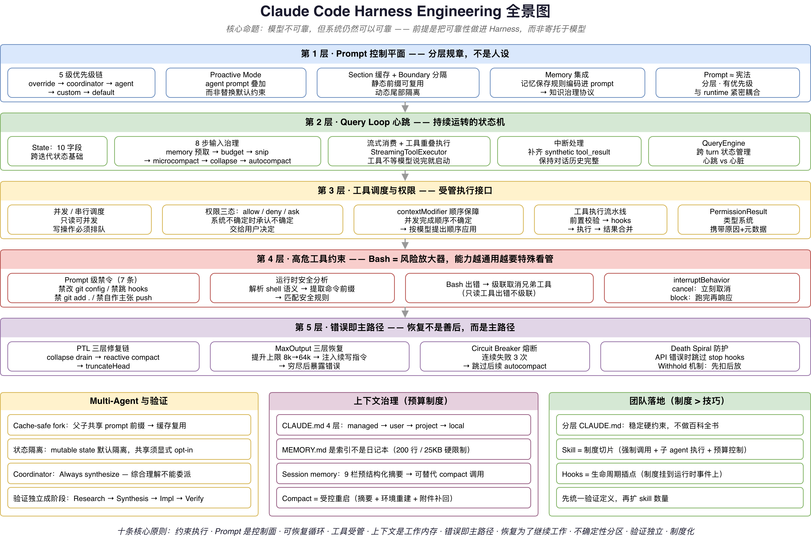

---

## 导读 + 序言

### 这本书在讲什么

核心关注点不是"模型会不会写代码"，而是——

> **一个会写代码的模型被放进终端、仓库和团队流程以后，怎样才不会把系统带偏。**

它关注的是 Claude Code 如何把**不稳定的模型**收束进**可持续运行的工程秩序**，让控制面、主循环、工具权限、上下文治理、恢复路径、多 agent 验证与团队制度长成一套完整骨架。

### 三个阅读前提

1. **重点不在模型能力**，而在 harness 如何组织约束与执行
2. **重点不在函数逐条解释**，而在运行时结构为什么必须这样长出来
3. **重点不在个人技巧**，而在这些结构怎样变成团队可以复用的制度

### 什么是 Harness Engineering

Harness 可以理解为**一组持续生效的控制结构**，用来约束模型在工程环境中的行为边界。对 AI coding agent 来说，没有约束的能力只会扩大事故半径。

> **Prompt 决定它怎么说话，Harness 决定它怎么做事。**

本书做两件事：
1. **讲结构**：基于 Claude Code 源码，把真正决定系统可靠性的结构讲清楚
2. **提原则**：把实现背后的判断提炼成更一般的工程原则，不随具体代码版本变化而失效

### 六条核心判断

| 原则 | 含义 |
|------|------|
| 错误路径要按主路径设计 | 失败不是例外，是日常状态 |
| 验证必须进入完成定义 | 没经过验证的输出不算完成 |
| 权限是系统器官，而不是附属功能 | 权限控制嵌入系统核心，不是事后补丁 |
| 上下文是资源，不是垃圾桶 | context window 有限，必须主动治理 |
| 多 agent 要靠角色分离，不靠人海战术 | 多 agent 的价值在于职责拆分，不是数量堆叠 |
| 团队制度比个人技巧重要 | 可复用的制度 > 不可复制的个人经验 |

### 为什么 Claude Code 值得研究

Claude Code 在实现上保持了明确的工程克制，没有做乐观假定：

| 设计决策 | 原因 |
|---------|------|
| 用 query loop 管理状态 | 没有假定模型会持续正确 |
| 用权限和调度约束工具 | 没有假定调用天然安全 |
| 引入 memory、CLAUDE.md、compact 和 session memory | 没有假定上下文越多越好 |
| 为 prompt too long、max output tokens 等设计恢复路径 | 没有把错误视为偶发事件 |
| 把 synthesis 和 verification 单独拆开 | 没有把多 agent 直接等同于更强能力 |

这一整套东西，合起来才是 agent。模型只是 agent 里最会说话、也最不稳定的那个部件。

### 从"回答"到"执行"的质变

| 场景 | 纯聊天模型 | 能执行操作的 agent |
|------|----------|----------------|
| 说错一句话 | 你看了觉得不对，忽略就好 | 它可能已经把错误代码写进文件了 |
| "帮我整理代码" | 输出一段文本，你自己复制粘贴 | 直接改了你的文件，可能还 commit 了 |
| 犯了个逻辑错误 | 你纠正它，它重新回答 | 错误已经执行——目录结构变了、进程挂了、Git 历史被污染了 |

**纯聊天模型的错误是"说错话"，agent 的错误是"做错事"。** 做错事的后果要严重得多。到了这一步，核心问题不再是模型是否足够聪明，而是**系统是否提供了足够约束**。

---

## 第 1 章：Harness 五层结构总览

这一章是全书的 ROADMAP。核心问题用一句话概括：**当一个 AI 模型能在你的电脑上跑命令、改文件、操作 Git 的时候，谁来确保它不搞砸？** 答案不是"用更聪明的模型"，而是"给它套上一整套管理结构"——这就是 Harness Engineering。

### 1.1 五层结构一览

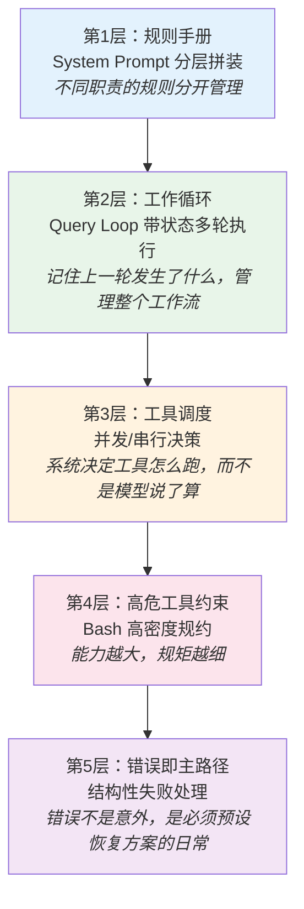

**第 1 层：System Prompt 不是一段话，而是分层规章。** Claude Code 的 system prompt 是一个由多个 section 组成的数组，每个 section 独立管理：身份说明、系统级规则、工程性指令，有的是静态的，有的是动态的。就像公司不会用一份文件同时规定战略和食堂规则。详见 [[#第 2 章：Prompt 控制平面]]。

**第 2 层：Query Loop 不是一问一答，而是持续运转的状态机。** 它在每轮之间维护跨轮状态（消息历史、turn 计数、压缩追踪、恢复计数等），并在每轮开始前做一系列上下文治理。详见 [[#第 3 章：Query Loop——agent 系统的心跳]]。

**第 3 层：工具调度决定谁先跑、谁后跑、能不能同时跑。** 系统通过 `isConcurrencySafe()` 判断每个工具是否可安全并发——只读操作通常可以，写操作必须排队。Claude Code 没有把工具当成模型能力的自然延伸，而是当成需要调度纪律的受管执行单元。详见 [[#第 4 章：工具、权限与中断]]。

**第 4 层：高危工具的特殊约束——Bash 为什么最危险。** Bash 可以执行任意 shell 命令，一个 `rm -rf /` 就可以毁掉整个系统。Claude Code 对 Bash 配备了 prompt 级禁令和运行时安全分析双重防线。详见 [[#4.7 Bash 为什么永远比别的工具更可疑]]。

**第 5 层：错误不是意外，错误是日常。** 输出被截断、上下文超限、工具被拒绝、Hook 阻塞——这些"事故"不是偶尔发生，而是**必然会反复发生**。Claude Code 把它们当作正常流程的一部分来设计。详见 [[#3.6 恢复机制：prompt-too-long 与 max-output-tokens]]。

### 1.2 五层结构的统一逻辑

- 模型会犯错 --> 所以需要规则手册（第1层）
- 任务是多步骤的 --> 所以需要工作循环来管理状态（第2层）
- 工具会扩大错误后果 --> 所以工具调用要受调度（第3层）
- 有些工具特别危险 --> 所以要配特别细的规矩（第4层）
- 失败会反复出现 --> 所以错误处理要成为正式流程（第5层）

**系统不能靠模型"聪明"来维持秩序，只能靠结构维持秩序。** 结构不像聪明那样显眼，但通常更可靠。

Harness Engineering 和 Prompt Engineering 的区别：Prompt Engineering 关心"怎么措辞让模型回答得更好"；Harness Engineering 关心的是"这个循环怎么转、状态怎么管、爆了怎么恢复"。前者是修辞技巧，后者是**系统工程**。

> **原则 1：Agent 系统的关键能力是约束执行。**

---

## 第 2 章：Prompt 控制平面

### 2.1 Prompt 是控制平面，不是人设

很多人一说起 system prompt，首先想到的是一段人设话术。对只负责聊天的系统，这种理解问题不大；但对一个要读文件、调工具、动 shell、处理权限、跨轮执行的 agent 系统来说，**这种理解明显不够**。

| 维度 | 人设（Persona） | 控制平面（Control Plane） |
|------|-------------|------------------------|
| 解决的问题 | "它像什么" | "它能做什么、什么时候做、做错了怎么办、谁来兜底" |
| 所在层级 | 表达层 | 执行层 |
| 缺失的后果 | 风格不一致 | 系统行为不可预测 |

Claude Code 的 system prompt 是一组**分层拼装的行为区块**。它更接近一套**运行时协议**，而不是一篇人物小传。

### 2.2 Prompt 从一开始就是分层的

在 `src/constants/prompts.ts:444` 的 `getSystemPrompt()` 里，返回的是一个**由多个 section 组成的数组**，而不是一段完整字符串。

#### 三类 Section 内容

**第一类：身份和总任务说明**（`prompts.ts:175`）
- 说明自己是一个交互式 agent，用可用工具帮助用户完成软件工程任务
- 顺手塞入安全约束，比如不要乱猜 URL

**第二类：系统级规则**（`prompts.ts:186`）
- 用户能看见的是哪些文本
- 工具调用可能触发权限审批
- 用户拒绝后不能机械重试
- tool result 和 user message 里可能混入 system-reminder
- 上下文会被自动压缩

这些规则不关心模型"像不像一个聪明助手"，而是关心它是否是一个**守规矩的执行体**。

**第三类：工程性指令**（`prompts.ts:199`）
- 不要随意增加需求
- 不要越权优化
- 不要为了看起来体面而隐瞒验证失败
- 不要在没有必要时制造抽象

### 2.3 Prompt 来源的优先级链

在 `src/utils/systemPrompt.ts:28` 的 `buildEffectiveSystemPrompt()` 中，prompt 来源被明确排成一条优先级链：

```
1. override system prompt     <-- 最高优先级
2. coordinator system prompt
3. agent system prompt
4. custom system prompt
5. default system prompt      <-- 最低优先级（基线）
```

各层含义：

| 来源 | 什么时候存在 | 典型内容 |
|------|------------|---------|
| **override** | 外部系统通过 API 强制注入 | 最高权威，覆盖一切——用于安全策略、合规要求等不可商量的约束 |
| **coordinator** | 启用 multi-agent 协调者模式时 | 定义协调者的职责："指挥 worker、综合结果、与用户沟通"（详见 [[#7.4 协调者模式：synthesis 才是稀缺能力]]） |
| **agent** | 以特定角色运行子 agent 时（如 code-reviewer、Explore） | 领域专用指令，告诉模型"你现在扮演什么角色、有什么额外能力和限制" |
| **custom** | 用户通过 `--system-prompt` CLI 参数自定义 | 用户想替换默认行为时的自定义 prompt |
| **default** | 始终存在 | 通用基线——安全约束、工具使用规则、工程规范等"出厂纪律" |

最后还会统一拼接 `appendSystemPrompt`（通过 `--append-system-prompt` 追加，不替换任何层级，只在末尾附加）。

成熟系统不会迷信唯一版本的 prompt。它会把 prompt 看成一个**有层级的配置系统**，让不同职责在不同上下文里生效。

#### Proactive Mode 的特殊处理

在 `src/utils/systemPrompt.ts:99` 往后，如果 agent prompt 和 proactive mode 同时存在，agent prompt 不再替换默认 prompt，而是**附加在默认 prompt 之后**。有时候默认约束不能丢，新增 agent 只能在默认约束之上叠加领域行为，而不能把整套纪律换掉。

**为什么 default system prompt 是最低优先级？** 这遵循的是软件配置里常见的"越具体越优先"原则（类似 CSS 优先级、环境变量覆盖默认值）。default 是通用基线，适用所有场景；custom、agent、override 等层级依次更具体。如果 default 优先级最高，所有定制化指令都无法生效，系统就变成不可配置的死板东西。但 Proactive Mode 的例子也说明这条规则有边界——**便利性上让你覆盖，安全性上不让你丢掉**。

#### agent prompt 与 system prompt 的关系

system prompt 不是一个单一的东西，而是由多个来源按优先级**拼装**出来的最终产物。agent prompt 是其中的一个来源层级，当 Claude Code 以特定 agent 身份运行时（如 code-reviewer、Explore 等子 agent），注入领域专用指令。两者是**"整体与部分"**的关系：system prompt 是最终发给模型的完整指令，agent prompt 是构成它的一个层。正常情况下高优先级来源会替换低优先级来源，但 Proactive Mode 下会改为叠加，确保基线纪律不丢失。

### 2.4 Prompt 连接着记忆系统

Claude Code 不只是用 prompt 规定"这一轮怎么说话"，还用 prompt 规定**"长期记忆如何形成"**。

**Memory 的上下文装配**：在 `src/utils/claudemd.ts:1153` 的 `getClaudeMds()` 里，系统会把 project instructions、local instructions、team memory、auto memory 等不同来源的内容整理成统一格式，再拼接进 prompt 相关上下文中。

**Memory 的保存规则也是 Prompt 的一部分**：在 `src/memdir/memdir.ts:187` 的 `buildMemoryLines()` 里，系统连"如何保存记忆"都变成了 prompt 的一部分——memory 是文件化持久系统，MEMORY.md 是索引不是正文，要如何写 frontmatter，哪些信息不该保存。它把 prompt 的职责从"约束当前行为"扩展到了"约束未来知识的沉淀方式"，更接近一份**知识治理协议**。

具体来说，prompt 中编码了一整套信息管理制度：

- **采集标准**：定义了 user、feedback、project、reference 四种 memory 类型，每种明确规定什么时候该存、怎么用
- **存储格式**：文件必须带 frontmatter（name、description、type），正文按类型有不同结构要求
- **索引规范**：`MEMORY.md` 是索引不是正文，每条不超过 150 字符，超过 200 行会被截断
- **淘汰策略**：明确哪些不该存（代码模式、git 历史、调试方案等已可从代码和版本控制推导的信息）
- **验证机制**：使用 memory 前要验证其是否仍然准确，过期的要更新或删除

Claude 没有原生的持久记忆能力，但通过在 prompt 里写明"怎么用文件系统模拟记忆"，让一个无状态的模型表现得像有长期记忆。**prompt 本身变成了记忆系统的操作手册**。

### 2.5 Prompt 的缓存与计算成本

prompt 同时也是计算成本。它越复杂、变化越频繁，缓存命中就越差，系统运行就越贵、越慢。Claude Code 在 prompt 层面做了两级缓存优化。

**前置概念：Anthropic API 的 prompt caching。** 调用 Claude API 时，如果多次请求的 system prompt 前缀（从开头起的连续内容）相同，API 可以缓存这部分 token 的处理结果，后续请求直接复用——价格降至正常输入的 1/10，且跳过重新编码的延迟。但前提是：**缓存按前缀匹配**，一旦某个位置的内容发生变化，从那个位置往后的缓存全部失效。

#### 第一级：Section 级缓存

在 `src/constants/systemPromptSections.ts` 中，每个 prompt section 被标记为两类：

```typescript
// 可缓存的 section：计算一次，直到 /clear 或 /compact 才重算
systemPromptSection('memory', () => loadMemoryPrompt())
//  → cacheBreak: false

// 会打破缓存的 section：每轮重算
DANGEROUS_uncachedSystemPromptSection(
    'mcp_instructions',
    () => getMcpInstructionsSection(mcpClients),
    'MCP servers connect/disconnect between turns'  // 必须写明原因
)
//  → cacheBreak: true
```

- **`cacheBreak: false`（可缓存）**：内容在会话过程中不变（如 memory prompt），加载一次后直到 `/clear` 或 `/compact` 才重算。这些 section 可以安全地被 API 缓存复用。
- **`cacheBreak: true`（会打破缓存）**：内容每轮对话都可能变（如 MCP instructions，因为 MCP server 可能在两轮之间连接或断开）。一旦重算出不同的值，从这个 section 开始往后的 API 缓存全部失效。

函数名前缀 `DANGEROUS_` 是刻意的，表示"使用这个类型会让缓存失效，你必须有充分理由"，而且必须传入一个 `_reason` 参数。这是一个**成本治理手段**——让"打破缓存"成为需要显式声明理由的昂贵操作，而不是随手就能做的默认行为。

**缓存被打破了怎么办？** 答案是第二级优化——Boundary 分隔。

#### 第二级：Boundary 分隔

在 `src/constants/prompts.ts:114`，一个特殊分隔标记 `SYSTEM_PROMPT_DYNAMIC_BOUNDARY` 把最终 prompt 一分为二：

```typescript
return [
    // --- 静态内容（所有用户都一样） ---
    getSimpleIntroSection(),        // 身份介绍
    getSimpleSystemSection(),       // 系统规则
    getSimpleDoingTasksSection(),   // 工程约束
    getActionsSection(),            // 操作规范
    getUsingYourToolsSection(),     // 工具使用说明
    getSimpleToneAndStyleSection(), // 语气风格
    getOutputEfficiencySection(),   // 输出效率

    // === BOUNDARY MARKER - DO NOT MOVE OR REMOVE ===
    SYSTEM_PROMPT_DYNAMIC_BOUNDARY,   // <-- 分界线

    // --- 动态内容（每个用户/会话不同） ---
    ...resolvedDynamicSections,       // memory、环境信息、MCP 指令等
]
```

然后在 `src/utils/api.ts:362-396`，系统根据这个标记做最终的缓存策略分配：
- **静态部分**：标记为 `cacheScope: 'global'`，跨用户、跨会话共享
- **动态部分**：标记为 `cacheScope: null`，不缓存

因为 API prompt caching 是前缀匹配的，所以把所有会变的内容集中到末尾后：分界线之前的静态内容不管动态部分怎么变，缓存**始终命中**；分界线之后即使每轮重算导致缓存失效，**影响范围被限制在尾部**。这是经典的"控制爆炸半径"策略——没办法让所有内容都可缓存，那就把不稳定的部分集中隔离，保护前面大段稳定内容的缓存收益。

**比喻**：想象服务员念菜单。前半部分（固定菜品）每天一样，后半部分（今日特供）每天不同。有了分界线，服务员可以说"前面跟昨天一样（跳过），今天的特供是..."。

一个工程系统只要开始关心"哪部分 prompt 会导致缓存失效"，它就已经不再把 prompt 当作文案创作。文案追求完整表达，控制平面追求**可治理、可复用、可预测的行为成本**。

### 2.6 用户可以覆盖 prompt，但不能跳过这套结构

Claude Code 在 `src/main.tsx:1342` 往后支持 `--system-prompt`、`--append-system-prompt` 等 CLI 选项。用户可以改内容，系统仍然保留结构——统一通过 `buildEffectiveSystemPrompt()` 做最终装配。

### 2.7 Prompt 更像宪法，不像台词

| 台词（Script） | 宪法（Constitution） |
|------------|-------------------|
| 给角色在场上说的 | 规定权力边界、责任关系和例外情况如何处理 |
| 一块写到底 | 分层 |
| 谁后写谁说了算 | 有优先级 |
| 独立存在 | 与 memory、CLAUDE.md、agent instructions、MCP instructions 一起组成完整控制平面 |
| 随手拼一段文本 | 有缓存和动态 section 机制 |
| 游离于系统之外的装饰物 | 和 runtime 紧密耦合 |

> **原则 2：Prompt 的价值，在于它是否被纳入一套清楚的控制结构。**

| 源码文件 | 证明了什么 |
|---------|----------|
| `constants/prompts.ts` | prompt 写成分段控制结构，而不是一段统一宣言 |
| `utils/systemPrompt.ts` | 明确规定了 prompt 来源的优先级 |
| `utils/claudemd.ts` | 把项目级和长期记忆内容纳入上下文装配 |
| `memdir/memdir.ts` | 用 prompt 规定了长期记忆的保存规则 |
| `constants/systemPromptSections.ts` | 把 prompt 变成可缓存、可失效、可按段重算的运行时对象 |

---

## 第 3 章：Query Loop——agent 系统的心跳

### 3.1 判断成熟度，先看有没有循环

`src/query.ts:219` 的 `query()` 和 `src/query.ts:241` 的 `queryLoop()` 是两个不同层次的函数：
- **`query()`**：入口壳函数，负责启动整个查询流程
- **`queryLoop()`**：真正的核心。它维护一套跨迭代状态，处理前置治理动作，进入模型流式阶段，再在返回后决定是否进入工具执行、恢复、压缩、继续下一轮，或直接终止

> 一个系统是否能被称为 agent，往往不取决于它会不会说话，而取决于它能不能在几轮之后仍然知道自己在做什么。

### 3.2 State 类型：心跳的状态基础

Claude Code 在 `src/query.ts:204-217` 明确定义了 query loop 的可变状态（`type State`），共 10 个字段：

| 状态字段 | 作用 | 日常类比 |
|---------|------|---------|
| `messages` | 对话历史——承载所有轮次产生的 user/assistant/tool 消息 | 完整聊天记录 |
| `toolUseContext` | 工具使用上下文——记录当前轮次工具调用的相关信息 | 桌上摊开的文件和终端窗口 |
| `autoCompactTracking` | 自动压缩追踪——记录压缩发生过几次、压缩边界在哪 | 笔记本写满了，记下"从第几页开始是摘要" |
| `maxOutputTokensRecoveryCount` | 输出截断恢复计数——被 max_output_tokens 截断后的重试次数 | 报告写到一半纸用完了，换了几次纸 |
| `hasAttemptedReactiveCompact` | 是否已尝试过响应式压缩——防止重复触发 | "我已经整理过一次桌面了，别再整理" |
| `maxOutputTokensOverride` | 输出 token 上限的临时覆盖值——恢复时可能提升上限 | 临时多给你几张纸 |
| `pendingToolUseSummary` | 待处理的工具使用摘要——上一轮工具执行结果的简报 | 上一步操作的结果备忘 |
| `stopHookActive` | stop hook 是否激活——标记系统是否正在执行停止钩子 | "正在走下班流程，别再派新任务" |
| `turnCount` | 当前轮次计数 | 工作计时器 |
| `transition` | 转换原因——记录从上一轮到当前轮的转换类型 | "我为什么从上一个任务切到了这个" |

Claude Code 没有把恢复、压缩、预算、hook、turn 计数散落在局部变量和布尔开关里，而是承认它们共同构成了"本轮结束后下一轮如何继续"的基础。这就是成熟 agent 系统和一次性脚本的区别。

### 3.3 输入治理：模型调用前的 8 步流水线

从外部看 agent 系统，很多人以为核心动作是"调用模型"。但在工程上，**真正重要的常常是模型调用之前那一长串整理工作**。

```text
1. 启动相关 memory 的预取        <-- src/query.ts:297
2. 预取 skill discovery          <-- src/query.ts:323
3. 截取 compact boundary 之后的有效消息  <-- src/query.ts:365
4. 应用 tool result budget       <-- src/query.ts:369
5. 进行 history snip             <-- src/query.ts:396
6. 进行 microcompact             <-- src/query.ts:412
7. 进行 context collapse         <-- src/query.ts:428
8. 最后才尝试 autocompact          <-- src/query.ts:453
```

| 步骤 | 做了什么 | 为什么需要 |
|------|---------|----------|
| memory 预取 | 提前加载 CLAUDE.md、auto memory 等持久化记忆 | 让模型"记住"跨会话的知识和用户偏好 |
| skill discovery | 预加载可用的 skill 定义 | 让模型知道有哪些技能可以调用 |
| compact boundary 截取 | 如果之前发生过压缩，只保留压缩点之后的消息 | 压缩前的原始消息已被摘要替代 |
| tool result budget | 工具返回结果太长时裁剪 | 防止单个工具结果占掉大量上下文空间 |
| history snip | 对话历史太长时，删掉中间部分 | 保留开头（任务上下文）和最近内容 |
| microcompact | 轻量级压缩——合并相邻的小消息 | 减少碎片化，不触发完整压缩 |
| context collapse | 较大规模的上下文折叠 | 在 autocompact 之前先尝试低成本手段 |
| autocompact | 调用模型生成摘要来替代旧消息 | 最后手段，成本最高但效果最彻底 |

> 这串顺序本身就是一种架构声明。Claude Code 把"上下文治理"放在"模型推理"之前。它不把从混乱中整理秩序的责任交给模型，而是先由运行时完成治理，再把更干净的输入交给模型。

### 3.4 流式消费：模型输出是事件流，不是最终答案

等前面的治理工作都做完，Claude Code 才在 `src/query.ts:659` 往后进入模型调用阶段。系统进入 `for await` 流式消费模型输出。

API 通过 SSE（Server-Sent Events，服务端推送事件——一种 HTTP 长连接协议，服务端可以持续向客户端推送数据，而不需要客户端反复轮询）事件流逐块推送内容（content block）：

```
事件1: content_block_start   --> type: 'text'           <-- 开始文本块
事件2: content_block_delta   --> '让我先读取'
事件3: content_block_delta   --> '这两个文件...'
事件4: content_block_stop                               <-- 文本块结束 --> yield AssistantMessage

事件5: content_block_start   --> type: 'tool_use', name: 'Read'   <-- 开始工具块
事件6: content_block_delta   --> input_json: '{"file_path":"src/utils.ts"}'
事件7: content_block_stop                               <-- 工具块结束 --> yield AssistantMessage
...
```

关键在 `content_block_stop` 事件。`src/services/api/claude.ts:2171` 每收到一个，就把刚完成的内容块包装成一条 `AssistantMessage` yield 出来。所以 `for await` 循环**每迭代一次就收到一个刚完成的内容块**，不需要等模型把所有块都生成完。

#### StreamingToolExecutor：工具与模型输出在时间上重叠

在 `for await` 循环内部（`query.ts:826-862`），系统每收到一个内容块，会检查里面有没有 `tool_use`：
- **没有 tool_use**（纯文本块）：存起来，继续等下一个块
- **有 tool_use**：**立刻**送进 `StreamingToolExecutor`（`:841-843`），然后检查 executor 中有没有已跑完的工具结果，有就立刻收割

`StreamingToolExecutor`（`src/services/tools/StreamingToolExecutor.ts:40`）内部维护一个工具队列。每次收到一个工具（`addTool`），它都会立刻尝试 `processQueue()` 看能不能马上开始执行——而不是等模型说完再统一处理。

工具的启动时机由并发约束决定，不由模型完成时机决定：
- **并发安全的工具**（如 Read）：`addTool` 后立刻启动，多个 Read 可以同时跑
- **非并发安全的工具**（如 Bash）：排队等待前面所有正在执行的工具完成。一旦队列清空自动启动——即使模型还在输出

```
时间轴 ──────────────────────────────────────────────>

模型输出 | text | Read1 | Read2 |  Bash  | done |
工具执行        | Read1 ████████done    |       |
               |      Read2 ████████████done    |
               |                        Bash ██████████done
               |         ^              ^
               |   两个 Read 并发执行   Read 都完成后 Bash 自动启动
               |                  （不需要等模型输出结束）
```

对比传统的请求-响应模式（等模型全部说完再处理工具）：

```text
时间轴 ────────────────────────────────────────────────────────>

模型输出  | ═══════ 等待完整响应 ═══════ |
工具执行                               | Read1 | Read2 | Bash |
```

流式模式下总耗时明显更短——不只是"更快"，它改变了系统的控制流拓扑：中断可以更精确（知道哪些工具已经发出去了），恢复可以前置（在流式阶段就拦截 PTL），回退可以无缝（丢弃部分结果，切换 fallback 模型）。

#### `for await` 循环内的四个并发关注点

| 关注点 | 做了什么 | 源码位置 |
|--------|---------|---------|
| **工具提交** | 发现 tool_use block 后立刻送进 StreamingToolExecutor | `query.ts:841-843` |
| **结果收割** | 检查 executor 中已完成的工具，立刻 yield | `query.ts:851-857` |
| **错误拦截** | PTL 和 max-output-tokens 错误在流式阶段就被标记为 `withheld`，暂不 yield | `query.ts:799-822` |
| **回退处理** | streaming fallback 时用 tombstone 标记已有消息为作废，丢弃孤儿结果 | `query.ts:712-740` |

错误拦截值得展开：系统不是等流结束后才检查有没有出错，而是在流式消费的每一步都在检查。一旦发现可恢复错误，就在当场拦截（`withheld = true`），让后续恢复分支有机会介入。**恢复路径的入口在流式阶段就已经打开了。**

#### Bash 出错会级联取消兄弟工具

`StreamingToolExecutor.ts:354-363`：只有 **Bash 工具出错**时才会触发 `siblingAbortController.abort('sibling_error')`，取消所有并行执行的兄弟工具。Read、WebFetch 等工具出错不会。因为 Bash 命令之间往往有隐含的依赖链（`mkdir` 失败了，后续命令就没意义），而只读工具之间没有这种依赖。

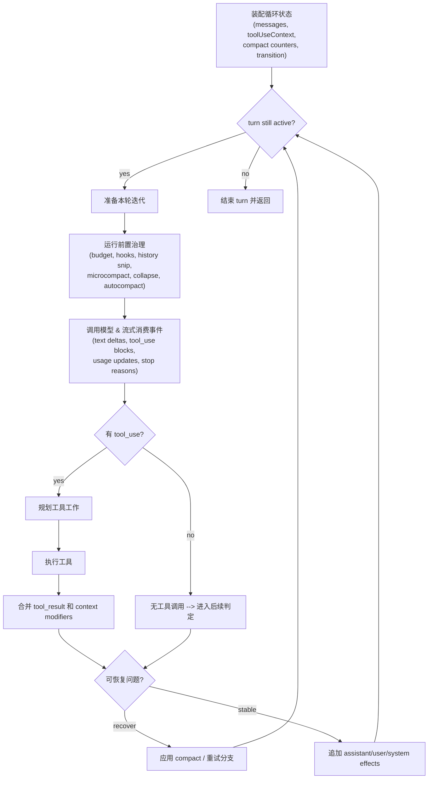

### 3.5 中断处理：心跳必须处理中断，否则它就只是惯性

agent 系统如果只能一轮接一轮地跑下去，不能在用户中断、API 出错、工具失败时干净地停下来，那它就只是在做惯性运动。

**中断时补齐 synthetic tool_result**（`src/query.ts:1011`）：
1. 若启用了 `StreamingToolExecutor`，调用 `getRemainingResults()` 把所有还没收割的工具结果全部收回来。对于被中断而没跑完的工具，executor 自动生成 synthetic tool_result（一条带 `is_error: true` 的消息）
2. 若没有启用 StreamingToolExecutor，用 `yieldMissingToolResultBlocks()` 为每个缺 result 的 `tool_use` 补上中断说明

**为什么必须补齐？** Claude API 要求每个 `tool_use` 必须有对应的 `tool_result`，否则下一轮 API 调用会报错。而且 UI 和 transcript 也需要知道每个工具的结局。如果把中断后的 `tool_use` 悄悄丢掉，对话历史就出现了断裂——模型看到这样的历史会困惑。

> **只要系统向外承诺了一段执行，就要在中断时把账补平。** 处理中断是 runtime 的基本责任。

### 3.6 恢复机制：prompt-too-long 与 max-output-tokens

如果说中断是外部世界打进来的意外，那么恢复就是系统内部预留的余量。Claude Code 对恢复的处理是层层递进的。

#### prompt-too-long 恢复：三层修复链

prompt-too-long（PTL）是一种对长会话 agent 迟早会来的"季节变化"。Claude Code 没有把它当偶发异常处理。

**第一层：context collapse drain（低成本，不调用模型）**

context collapse 是一种**局部替换**机制——对**单条旧消息**做替换，比如把一条 5000 token 的工具调用结果替换成一句 30 token 的摘要。原始消息保留在 REPL 的完整历史里不动，系统在一个叫 **collapse store** 的地方存了一张替换表，读取时替换（"read-time projection"——不动原数据）。

正常 query loop 中，`applyCollapsesIfNeeded()` 每轮扫描消息历史，识别可折叠的旧消息并生成短摘要。但这些折叠不一定立刻生效——有些会被 **staged**（暂存，借用 git 的概念：`git add` 了但还没 `git commit`）。

当 API 返回 413 时，`recoverFromOverflow()` 把所有 staged 的折叠**一口气全部 commit**：

```
假设 20 轮对话后，有 3 条旧消息被标记为可折叠（staged）：

  消息 3:  Read(auth.ts) 的工具结果 (4000 tokens)
          --> 可折叠为 "读了 auth.ts，180行，含JWT配置" (30 tokens)
  消息 7:  Bash(npm test) 的工具结果 (3000 tokens)
          --> 可折叠为 "跑了测试，3个失败" (20 tokens)
  消息 12: Read(middleware.ts) 的工具结果 (5000 tokens)
          --> 可折叠为 "读了 middleware.ts，含鉴权逻辑" (25 tokens)

遇到 413 --> 一次性执行全部 staged 折叠
  总共释放 ~11,925 tokens --> transition.reason = 'collapse_drain_retry'
```

关键优势：**不需要调用模型**（纯本地操作），信息损失比全量 compact 小得多。

**第二层：reactive compact（中等成本，需要调用模型）**（`query.ts:1119-1166`）

如果 drain 后重试还是 413，调用 `reactiveCompact.tryReactiveCompact()`，做的事情和 [[#5.6 compactConversation()——摘要要重建可继续工作的上下文]] 类似：把整段对话发给模型生成摘要，用摘要替代旧消息，再补回文件/plan/skill 等附件。标记 `hasAttemptedReactiveCompact = true`，不再重复。

**第三层：truncateHeadForPTLRetry（compact 自己也可能 PTL）**

如果 reactive compact 自身也遇到 PTL——会话历史长到连"请帮我摘要"这个请求都超出窗口——则砍掉最早的一部分对话组重试。完整机制见 [[#5.6 compactConversation()——摘要要重建可继续工作的上下文]]。

| 维度 | 第一层：collapse drain | 第二层：reactive compact | 第三层：truncateHead |
|------|---------------------|----------------------|-------------------|
| 成本 | 零（纯本地操作） | 一次 API 调用 | 一次 API 调用（在 compact 内部） |
| 信息损失 | 低（只替换已标记的旧消息） | 高（整段历史被压缩成摘要） | 最高（丢弃最早的对话组） |
| 前提条件 | context collapse 开启且有 staged 折叠 | reactive compact 开启且未曾尝试过 | compact 自身遇到 PTL |

**如果三层都失败了：** 直接把错误展示给用户，并跳过 stop hooks——因为模型根本没有产生有意义的回复，hook 没有东西可以评估，强行跑 hook 只会往已经爆掉的上下文里继续加料（**death spiral**，见下方）。

#### max-output-tokens 恢复：三层递进

每次调用 Claude API 时，`max_output_tokens` 参数限制模型单次输出长度。当模型输出触及上限，API 会强制截断——回答"说到一半"就戛然而止。

##### 第一层：提升 token 上限（`src/query.ts:1195-1221`）

Claude Code 默认用较保守的 8k 输出上限。当 8k 被触顶时，系统**丢弃断稿**，用同样的输入重发请求，只是把输出上限从 8k 提到 64k（`ESCALATED_MAX_TOKENS = 64,000`）。模型根本看不到上次的输出。

| 方案 | 说明 | 整体成本 |
|------|------|---------|
| 所有请求一律 64k 上限 | 99% 的回复只需几百到几千 token，每次都占 64k 调度槽位 | 高（大量浪费） |
| 默认 8k，触顶再升 64k 重试 | 绝大多数请求零浪费，极少数多付一次输入 | 低（整体更省） |

防护条件：只触发一次（`maxOutputTokensOverride === undefined`），且只在首方 API 上生效。

##### 第二层：注入恢复消息——保留断稿，从断点接着写（`src/query.ts:1223-1252`）

如果 64k 也不够，系统把模型上次被截断的 64k 输出**原样放回消息列表**，加上一条恢复指令：

```
[user] Output token limit hit. Resume directly -- no apology,
       no recap of what you were doing. Pick up mid-thought
       if that is where the cut happened. Break remaining
       work into smaller pieces.
```

| 指令内容 | 为什么这样写 |
|---------|----------|
| "no apology" | 模型被打断后默认会先道歉，浪费输出空间 |
| "no recap" | 模型倾向于重新总结前文，这是冗余的——前文已经在消息历史里 |
| "break into smaller pieces" | 引导模型拆小块，降低再次截断的概率 |

恢复指令用 `createUserMessage({ isMeta: true })` 包装成 user 角色（API 要求 assistant 和 user 消息交替出现）。最多重试 `MAX_OUTPUT_TOKENS_RECOVERY_LIMIT = 3` 次。

##### 第三层：恢复穷尽，暴露错误（`src/query.ts:1254-1256`）

如果 3 次恢复都没搞定，系统才把之前一直扣着的错误放出去。

##### Withhold 机制：错误不是立刻暴露的

在 `src/query.ts:820-822`，流式消费阶段检测到截断后会设 `withheld = true`，不 yield 这条消息。因为某些消费端看到任何 error 就直接终止会话——如果系统一截断就暴露错误，外层会断开连接，恢复循环就算还在跑也没人听了。所以系统先扣住错误，自己在内部悄悄恢复，只有恢复彻底失败了才把错误放出去。

##### 完整生命周期

```
调用 1 -- 8k 上限 -- 截断 --> 丢弃 8k 断稿，升到 64k 重来
调用 2 -- 64k 上限 -- 截断 --> 保留 64k 断稿 + 恢复指令，回到 8k
调用 3 --  8k 上限 -- 截断 --> 保留 8k 断稿 + 恢复指令（第 2 次恢复）
调用 4 --  8k 上限 -- 截断 --> 保留 8k 断稿 + 恢复指令（第 3 次恢复）
调用 5 --  8k 上限 -- 截断 --> 恢复穷尽，暴露错误
```

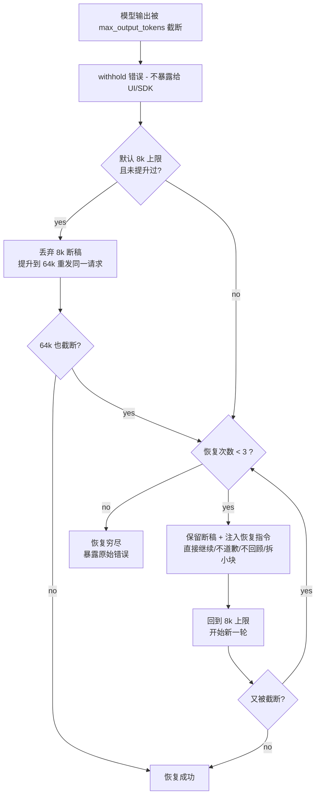

> **恢复不是善后，而是主路径。** 不是"出错 --> 报错 --> 等用户重新输入"，而是"出错 --> 先别声张 --> 自己想办法修 --> 修了多次还不行再说"。

#### Death spiral 防护：stop hooks guard

用户可以配置 stop hooks（每轮输出完成后自动执行的 shell 命令，如 eslint 检查）。如果 hook 发现问题返回 blocking error，系统会把反馈注入消息历史让模型重新生成。

但如果模型这轮根本没有正常回复（比如 API 返回了 prompt too long）：

```
API 返回 prompt too long --> 执行 stop hook --> hook 往消息历史里注入了反馈（增加了 token）
  --> 系统重试 --> 上下文更长了 --> 又 prompt too long
  --> 又执行 stop hook --> 又注入更多内容 --> 无限循环
```

Claude Code 的处理（`query.ts:1168-1175`）：**如果最后一条消息是 API 错误（不是模型的正常回复），就直接跳过 stop hooks**。同时用 `hasAttemptedReactiveCompact` 标记是否已经尝试过压缩——如果压缩过一次后 stop hook 仍然要求继续，但上下文已经压不动了，系统会选择结束 turn 而不是继续循环。

### 3.7 停止条件：7 种不同的结束方式

| 停止情况 | 含义 | 后续动作 |
|---------|------|---------|
| streaming 正常完成且有 `tool_use` | 模型想调工具 | 执行工具，继续下一轮 |
| 没有 `tool_use`，进入 stop hooks | 模型认为任务完成 | 运行 stop hooks 做后续判定 |
| 被用户中断 | 用户按了取消 | 补齐 synthetic tool_result，干净退出 |
| prompt-too-long 恢复 | 上下文超限 | 走 collapse --> compact 恢复链 |
| max-output-tokens 恢复 | 输出被截断 | 提升上限或注入继续指令 |
| stop hook 阻塞导致重进循环 | hook 判定任务未完成 | 带着 hook 反馈继续下一轮 |
| API 错误 | 调用失败 | 直接返回错误 |

> **重试本身也是一种需要被管理的行为。** 系统必须知道为什么重试、已经试过什么、哪些保护状态不能被重置、哪些情况会导致无限循环。

### 3.8 QueryEngine：循环属于会话生命周期

`QueryEngine`（`src/QueryEngine.ts:176-184`）负责**跨 turn** 的事情。如果把 `queryLoop` 比作一次心跳，那 `QueryEngine` 就是心脏本身。

#### 两层状态的分工

```text
QueryEngine 状态（跨 turn 存活）
  |-- mutableMessages     <-- 整个会话的消息历史
  |-- totalUsage          <-- 整个会话的 token 消耗
  |-- permissionDenials   <-- 整个会话的权限拒绝记录
  |-- readFileState       <-- 文件缓存
  |-- abortController     <-- 中断控制器
  |-- discoveredSkillNames <-- 已发现的 skill（每轮清空防增长）
  \-- loadedNestedMemoryPaths <-- 已加载的嵌套 memory 路径

queryLoop 状态（单 turn 内存活）
  |-- turnCount           <-- 本轮内的迭代次数
  |-- autoCompactTracking <-- 本轮的压缩追踪
  |-- maxOutputTokensRecoveryCount <-- 本轮的截断恢复次数
  |-- transition          <-- 本轮内上一次迭代为什么 continue
  \-- ...
```

#### submitMessage() 串起两层

```text
submitMessage(prompt):
    1. 用跨 turn 状态 + 当前 prompt 组装本轮输入
    2. 把一切交给 query()，进入 queryLoop
    3. queryLoop 产出的每条消息，都被 push 进 mutableMessages（跨 turn 存活）
    4. 更新用量统计
    5. yield 给外层（SDK / UI）
```

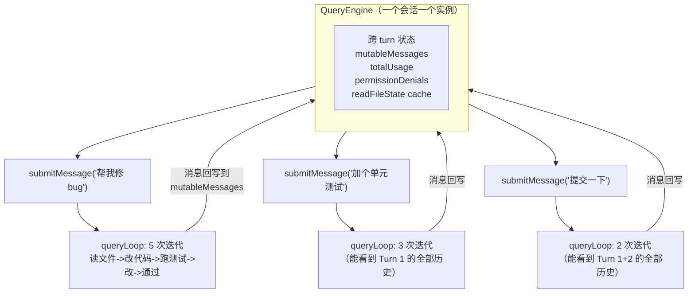

> **query loop 是会话系统真正的执行中心。** 要理解 Claude Code 的设计，不能只看它有哪些工具或 prompt 写了什么，最终还是得看这个循环如何把前面的约束落实成连续行为。

> **原则 3：Agent 系统的核心能力，是维持可恢复的执行循环。**

一个成熟 agent 的"心跳"至少要满足：
1. 有明确的跨轮状态
2. 能治理输入，而不只是被动消费输入
3. 能流式地接住模型输出
4. 能补齐中断后的执行账本
5. 能区分完成、失败、恢复和继续

---

## 第 4 章：工具、权限与中断

### 4.1 一旦模型开始调用工具，问题的性质就变了

只会输出文本的模型，出错时主要增加沟通成本。可一旦模型开始调用工具，问题就变了——因为**工具是动作，动作会留下结果，结果会接触真实世界**。

> **工具系统最重要的问题是：谁来约束这些工具。** Claude Code 的回答是把工具变成受管执行接口，避免让模型直接伸手去碰世界。

### 4.2 工具调度与 contextModifier 的顺序保障

Claude Code 在 `src/services/tools/toolOrchestration.ts:19` 的 `runTools()` 里，先按并发安全性分批：

| 调度策略 | 何时使用 | 日常类比 |
|---------|---------|---------|
| 并发执行 | 多个只读操作（如同时读 3 个文件） | 几个人同时查阅不同的参考资料 |
| 串行执行 | 涉及写操作或状态变更 | 只能一个人操作打印机，排队等候 |

#### contextModifier 的顺序问题

有些工具执行后会修改 `ToolUseContext`（工具执行的上下文状态），这个修改操作叫 **contextModifier**——类型是 `(context: ToolUseContext) => ToolUseContext` 的纯函数。

举个具体例子：当 Read 工具读取了一个文件后，它的 contextModifier 会把"这个文件已经被读过"的信息写入 `ToolUseContext`，这样后续工具（如 Edit）就知道这个文件的内容已经在上下文中了。又比如，Write 工具写入文件后，它的 modifier 会更新文件状态缓存，标记文件内容已变更。

串行时 modifier 顺序天然就是执行顺序。但一旦并发执行，工具完成的先后顺序变得不确定——同样的输入可能因为并发时序不同，上下文演化出不同结果。比如并发执行 Read(A) 和 Read(B)，如果 B 先完成但 A 先被模型提出，上下文最终状态就可能和预期不一致。

**Claude Code 的解法**：在 `toolOrchestration.ts:31-63`，用一个字典 `queuedContextModifiers` 按工具 ID 缓存每个工具的 modifier，等所有工具跑完后，**按原始 assistant block 顺序**（即模型提出工具调用的顺序，而不是工具实际完成的顺序）依次应用。这样无论谁先跑完，最终上下文的演化路径都是一样的。

> **并发可以提高吞吐，但不能破坏因果秩序。**

### 4.3 工具执行流水线

在 `src/services/tools/toolExecution.ts:337` 之后，一个工具从 `tool_use` 到最终产出 `tool_result`，经过多层结构：

```text
tool_use 出现
  --> 前置校验：权限检查（allow / deny / ask）
  --> 执行中：
      - hooks 触发：执行前后运行用户配置的 shell 命令
      - telemetry 记录：工具名称、耗时、是否成功
      - 中断监听：随时检查 abortController
  --> 执行后：
      - 结果合并：tool_result + contextModifier
      - synthetic error 生成：被外部原因取消时生成说明
```

工具在这里的地位和普通库函数不一样。库函数默认属于程序内部，调用者自己承担后果；工具则属于模型与外部世界之间的接口，**系统不能假设调用者具备稳定判断**。

### 4.4 权限三态系统

权限入口在 `src/hooks/useCanUseTool.tsx:27`。`hasPermissionsToUseTool(...)` 返回三种结果：

| 判定结果 | 含义 | 后续动作 |
|---------|------|---------|
| `allow` | 规则明确允许 | 直接执行 |
| `deny` | 规则明确拒绝 | 直接拒绝，生成拒绝消息 |
| `ask` | 规则无法自动决定 | 进入协调器、classifier 或交互式审批 |

> **`ask` 这个第三种状态非常关键。** 真正成熟的权限系统，除了"能"和"不能"，还要承认第三种状态：**系统自己也不该替用户做决定**。

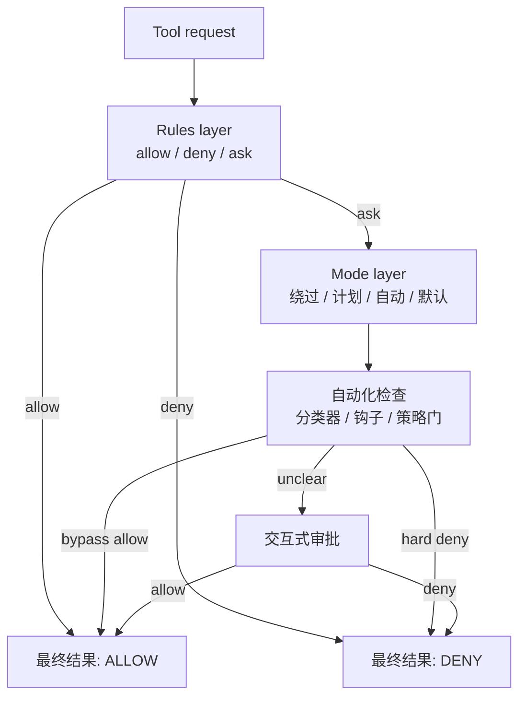

### 4.5 PermissionResult 类型系统

在 `src/types/permissions.ts`，权限判定结果被定义成 `PermissionAllowDecision`、`PermissionDenyDecision`、`PermissionAskDecision` 等专门类型，而不是简单的 `boolean`。这些类型还携带**原因和元数据**：

- `PermissionDenyDecision` 携带拒绝理由（展示给用户或写入日志）
- `PermissionAskDecision` 携带应该走哪条审批路径
- `PermissionAllowDecision` 区分"规则明确允许"和"用户临时授权"

### 4.6 StreamingToolExecutor 的中断语义

工具一旦开始并发和流式执行，中断问题就会立刻变得复杂。`src/services/tools/StreamingToolExecutor.ts:40` 明确把中断当成和执行本身同样重要的语义。

#### Synthetic Error 机制

| 中断原因 | synthetic error 类型 | 含义 |
|---------|---------------------|------|
| 并行的兄弟工具出错 | `sibling_error` | "旁边的工具出错了，所以我也被取消了" |
| 用户按了中断 | `user_interrupted` | "用户主动打断了执行" |
| 流式回退 | `streaming_fallback` | "整批工具被丢弃" |

#### interruptBehavior：cancel vs block

- **`cancel`**：用户一插话，工具立刻被取消。适用于执行时间长且可安全中止的工具（如 Bash）
- **`block`**：用户插话了，但工具**继续跑完**，用户的新消息被阻塞等待。适用于不能中途停下的工具（如正在写文件——写到一半中止会留下损坏的文件）

> **不仅设计开始，也设计停下。** 没有设计停下语义的执行系统，最终只能依赖用户外部打断来补完设计。

### 4.7 Bash 为什么永远比别的工具更可疑

Bash 不是普通工具，它更像**风险放大器**。越通用的接口，越难靠领域知识限制它。Claude Code 对 Bash 的不信任分两层：

#### 第一层：Prompt 级别的明确规则（`BashTool/prompt.ts`）

| 禁止行为 | 为什么危险 |
|---------|----------|
| 不要乱改 git config | 可能影响所有后续 Git 操作 |
| 不要跳过 hooks（`--no-verify`） | hooks 是团队的安全检查，跳过等于绕过安检 |
| 不要随手 `git add .` | 可能把 `.env`（密码文件）提交上去 |
| pre-commit 失败后不要用 `--amend` | amend 会修改上一个 commit，可能丢失别人的工作 |
| 没有明确要求不要 commit | 自作主张提交 = 往团队历史里塞未审查的代码 |
| 更不要默认 push | push 了就是公开发布 |
| 不要用 `-i` 交互模式 | CLI 环境不支持交互式输入 |

#### 第二层：运行时安全分析（`bashPermissions.ts`）

- **解析 shell 语义**：把命令字符串拆解成结构化的命令树（处理管道 `|`、链式 `&&`、子 shell `$()` 等语法）
- **提取命令前缀**：识别 `sudo`、`env`、`nohup` 等前缀 wrapper，穿透找到真正要执行的命令
- **匹配安全规则**：与预定义的 allow/deny 规则做比对
- **防止检查爆炸**：超过 `MAX_SUBCOMMANDS_FOR_SECURITY_CHECK = 50` 个子命令的复合命令直接要求用户确认

> **高风险能力不应该享受通用能力的待遇。** 能力越通用，越要特殊看管。

### 4.8 工具系统保护的不只是用户，还包括系统自己

权限、调度和中断同时也在保护系统自身的一致性。query loop 在中断时补齐 synthetic tool_result（[[#3.5 中断处理：心跳必须处理中断，否则它就只是惯性]]），StreamingToolExecutor 预留了 `discarded`、`hasErrored`、`siblingAbortController`、`interruptBehavior` 等机制——两边一起作用，目的是让系统在"执行过什么、没执行完什么、为什么停了"这些问题上保持可追溯的因果链。

> **原则 4：工具是受管执行接口；权限是 agent 系统的基本器官。**

1. 让模型提出动作，不等于让模型拥有授权
2. 工具调度必须保持因果秩序，哪怕执行并发
3. 中断要有一等语义，不能靠异常兜底
4. 高风险工具必须区别对待，不能图省事走通道化设计
5. 一个工具系统真正保护的，既是用户，也是运行时本身

---

## 第 5 章：上下文治理——Memory、CLAUDE.md 与 Compact 是预算制度

### 5.1 上下文不是仓库，是一笔昂贵的预算

人一旦可以往上下文里不停塞东西，就很容易相信：信息越多，系统越聪明。实际情况是：
- 上下文不是一个"存进去就算拥有"的仓库——它是一笔昂贵的、易膨胀的、还会自我污染的预算
- 塞进去越多，每一轮都要重复注入；要么靠模型自己回忆，迟早丢失关键信息

> **本章核心命题：Claude Code 怎样防止自己被记住的东西拖死。**

### 5.2 CLAUDE.md 体系——长期指令不能和临场对话混在一起

`src/utils/claudemd.ts` 把 instruction source 分成四层：

| 层次 | 文件位置 | 性质 | 加载优先级 |
|------|---------|------|----------|
| managed memory | `/etc/claude-code/CLAUDE.md` | 全局管理员配置，所有用户共享 | 最低 |
| user memory | `~/.claude/CLAUDE.md` | 用户个人私有，跨所有项目 | 较低 |
| project memory | 项目根目录的 `CLAUDE.md`、`.claude/CLAUDE.md`、`.claude/rules/*.md` | 项目级规则，团队共享 | 较高 |
| local memory | `CLAUDE.local.md` | 本地私有的项目规则，不进版本控制 | 最高 |

离当前工作目录越近的 project 规则，优先级越高；越偏向私有、越偏向本地的规则，越晚加载——因而越靠近模型注意力的前沿。

CLAUDE.md 的内容进入的是 **system prompt**（独立字段），而不是 messages 数组。这意味着它不会被 compact 摘要掉，也不会和对话消息竞争上下文空间。

#### @include 机制

支持 `@include` 指令，只允许一批明确列出的文本扩展名（`TEXT_FILE_EXTENSIONS`，100+ 种），限制最大递归深度 `MAX_INCLUDE_DEPTH = 5`。防止二进制文件、巨型文档被糊涂带进 prompt。

#### 条件规则

`.claude/rules/*.md` 支持在 frontmatter 中用 `paths:` 字段指定 glob 模式。`processConditionedMdRules()` 把规则与当前工作路径做匹配，只加载相关规则。不同目录、不同文件类型可以有不同的规则集——前端代码用前端规范，后端代码用后端规范。

### 5.3 MEMORY.md 是索引，不是日记本

`src/memdir/memdir.ts` 里 `ENTRYPOINT_NAME` 被定义成 `MEMORY.md`，但它被定义为 **index**——不被鼓励用来直接堆内容。

`buildMemoryLines()` 明确告诉模型，保存 memory 是两步：
1. 把具体 memory 写进独立文件（如 `user_role.md`、`feedback_testing.md`）
2. 再在 MEMORY.md 里加一个一行指针（格式：`- [标题](文件名.md) -- 一句话说明`）

两个硬限制：

| 常量 | 值 | 含义 |
|------|---|------|
| `MAX_ENTRYPOINT_LINES` | 200 | MEMORY.md 最多加载 200 行 |
| `MAX_ENTRYPOINT_BYTES` | 25,000 | MEMORY.md 最多加载 25KB |

超过了，`truncateEntrypointContent()` 直接截断（先按行数，再检查字节数），并在结尾追加警告。

> **长期记忆必须分成"入口"和"正文"。** 入口负责低成本寻址，正文负责高密度承载。把两者混为一谈，最终入口失效，整套记忆系统退化成摆设。

### 5.4 Session memory——短期连续性的预结构化摘要

只有长期 memory 还不够。agent 系统真正难受的地方在于"这轮之前我们到底做到哪一步了"。

`src/services/SessionMemory/prompts.ts` 里的默认模板包含 9 个栏目：

| 栏目 | 记录什么 | 为什么需要 |
|------|---------|----------|
| **Current State** | 现在做到哪了，下一步是什么 | 压缩后模型需要知道工作进度 |
| **Task specification** | 用户要求、设计决策、背景 | 防止压缩后遗忘任务定义 |
| **Files and Functions** | 重要文件、内容、与任务的关系 | 保留代码层面的工作现场 |
| **Workflow** | bash 命令、执行顺序、输出解读 | 保留操作步骤记忆 |
| **Errors & Corrections** | 遇到的错误、修复方式、失败尝试 | 避免重复踩坑 |
| **Codebase and System Documentation** | 系统组件、组装方式 | 保留架构理解 |
| **Learnings** | 什么有效、什么没效果 | 积累经验 |
| **Key results** | 精确输出（表格、答案、文档） | 保留核心产出 |
| **Worklog** | 精简的步骤记录 | 时间线参考 |

#### 运行机制：后台提取 + 替代 compact

**术语说明**：这里的 "sampling" 指模型推理/生成过程（LLM 通过采样 token 来生成文本），"post-sampling hook" 就是"模型生成完一轮输出之后自动触发的钩子"。

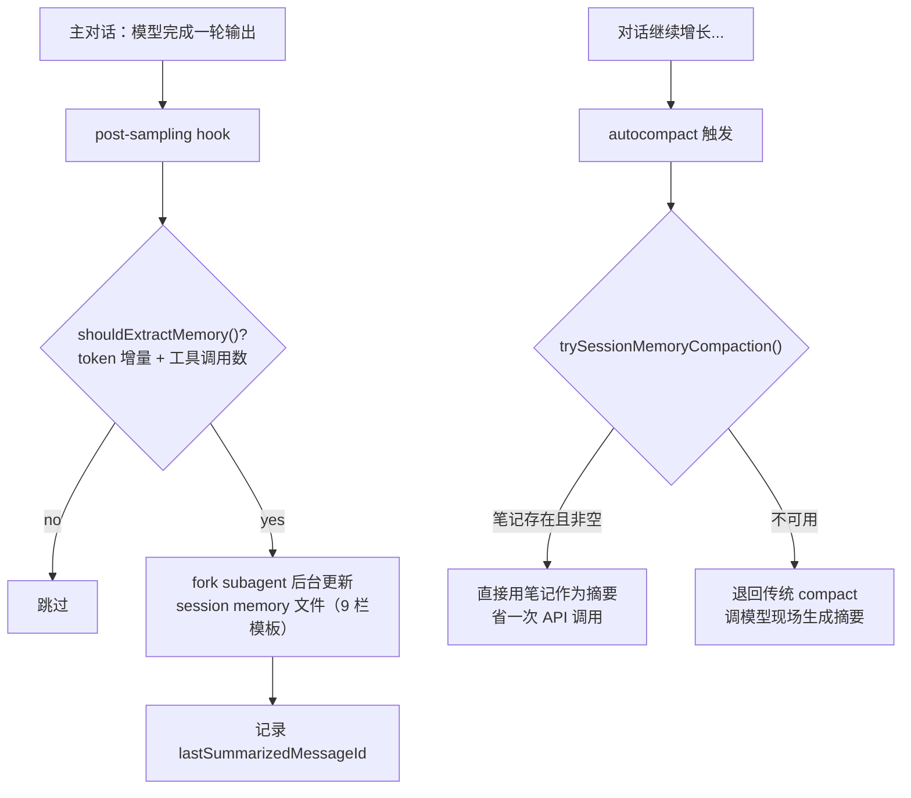

**写入阶段**：session memory 注册为 post-sampling hook。`shouldExtractMemory()` 检查 token 增量和工具调用数，满足条件时 fork 出独立 subagent 后台增量更新各栏目，不打断主对话。

**读取阶段**：autocompact 触发时，**第一选择不是调模型生成摘要**，而是 `trySessionMemoryCompaction()`——如果 session memory 文件存在且非空，直接当摘要使用，省掉一次 API 调用。

所以那 9 个栏目不是装饰——它们是一种**预结构化的摘要格式**，让后台 subagent 每次增量更新时知道往哪填，也让 compact 时能直接当摘要使用。

#### 预算控制

| 常量 | 值 | 含义 |
|------|---|------|
| `MAX_SECTION_LENGTH` | 2,000 tokens | 单个栏目的 token 上限 |
| `MAX_TOTAL_SESSION_MEMORY_TOKENS` | 12,000 tokens | 所有栏目的总 token 预算 |

超过预算，系统要求 aggressively condense，优先保留 **Current State** 和 **Errors & Corrections**。`analyzeSectionSizes()` 估算每个 section 的 token 数，`generateSectionReminders()` 为超限的 section 生成 CRITICAL 警告。

### 5.5 自动 compact——上下文治理首先是预算治理

#### 预算计算：先给 compact 本身留钱

Compact 本质上是让模型读完整段会话历史然后输出摘要——这本身就是一次 API 调用。Claude API 的 context window 是 input + output 共享的，如果 input 把窗口占满了，模型就没有空间写 output。

`getEffectiveContextWindowSize()` 先从总窗口里**预扣**：`MAX_OUTPUT_TOKENS_FOR_SUMMARY = 20,000` tokens（源码注释：根据实际观测，99.99% 的 compact 摘要输出在 17,387 tokens 以内）。

为什么摘要输出会这么长？因为 compact prompt（`src/services/compact/prompt.ts:61-77`）要求模型输出包含 9 个部分的详细摘要：用户请求与意图、关键技术概念、涉及的文件与代码片段、遇到的错误与修复、问题解决过程、所有用户消息（原文）、待完成任务、当前工作状态、下一步计划。模型还被要求先写一个 `<analysis>` 思考块（由 `formatCompactSummary()` 在保存前丢掉），再写正式的 `<summary>`，所以实际输出会比最终保留的摘要更长。

其他预留 buffer：

| 预算 | 用途 |
|------|------|
| 警告阈值 buffer（20,000 tokens） | 显示上下文即将用完的警告 |
| 错误阈值 buffer（20,000 tokens） | 显示上下文严重不足的错误 |
| 手动 compact buffer（3,000 tokens） | `/compact` 命令的余量 |
| autocompact buffer（13,000 tokens） | 自动 compact 的触发余量 |

#### Circuit breaker（熔断器）：连续失败就停手

**Circuit breaker** 是一种源自电路设计的软件模式：当某个操作连续失败达到阈值时，系统主动"断开电路"，后续不再尝试该操作，避免反复失败浪费资源甚至引发级联故障。就像家里的保险丝——电流过大时自动断开，保护整个电路不被烧毁。

Autocompact 不是每次都能成功。源码注释引用了 BigQuery 统计：曾有 1,279 个 session 出现过 50 次以上的连续 compact 失败，最极端的一个 session 连续失败了 **3,272 次**。

`AutoCompactTrackingState` 追踪 compact 状态：

| 字段 | 记录什么 |
|------|---------|
| `compacted` | 本 session 是否成功 compact 过 |
| `turnCounter` | 当前对话轮次编号 |
| `turnId` | 当前轮次的唯一标识 |
| `consecutiveFailures` | **熔断器的核心计数器** |

熔断阈值 `MAX_CONSECUTIVE_AUTOCOMPACT_FAILURES = 3`。连续失败 3 次后触发熔断，本 session 后续所有 autocompact 被跳过。中间任何一次成功则计数归零。

> 成熟系统不是"永不放弃地重试"，而是**在确认手段无效时及时止损**。

#### 递归保护与功能门控

`shouldAutoCompact()` 内置递归保护——如果当前请求来源本身就是 `session_memory`、`compact` 或 `marble_origami`（Claude Code 内部对某个子系统的代号，用于标识特定类型的内部请求），则跳过 autocompact，避免"为了压缩而触发的请求又触发压缩"的死循环。

功能门控：`REACTIVE_COMPACT` 开启时抑制主动 autocompact（让 reactive compact 在 API 报 PTL 时再介入）；`CONTEXT_COLLAPSE` 开启时完全抑制 autocompact（由 collapse 机制接管）。

### 5.6 compactConversation()——摘要要重建可继续工作的上下文

`src/services/compact/compact.ts` 里的 `compactConversation()` 做的不是简单"把聊天摘要一下"，而是拆开、摘要、再注入必要附件，**重新搭出一个还能工作的后 compact 世界**。

#### 第一步：压缩前的清洗

| 清洗函数 | 做了什么 | 为什么 |
|---------|---------|-------|
| `stripImagesFromMessages()` | 图片替换成 `[image]`、文档替换成 `[document]` | 图片对摘要无用但 token 极贵 |
| `stripReinjectedAttachments()` | 把之后会重新注入的 attachment 先剥掉 | 免得浪费 token 让摘要模型去总结那些马上会被原样补回来的内容 |

#### 第二步：摘要失败时的处理——truncateHeadForPTLRetry

如果会话历史长到连"请帮我摘要"这个请求都超出窗口，`truncateHeadForPTLRetry()` 就是最后手段。

系统用 `groupMessagesByApiRound()` 把会话历史按"一次完整的 API 交互"分组（每组 = assistant 消息 + 工具调用 + 工具结果），保证砍的时候不会把一次交互砍成两半。

```
假设 5 组会话，compact 请求超出 15K tokens

策略 A（精确计算）：API 错误响应包含超出量
  --> 从最早的组累加：组 0 = 8K, 组 0+1 = 20K >= 15K
  --> 砍掉组 0 和组 1，用组 2-4 重试

策略 B（兜底 20%）：API 错误格式无法解析
  --> 砍掉 20% 的组 = floor(5 x 0.2) = 1 组
  --> 砍掉组 0，用组 1-4 重试
```

砍完后如果剩余消息以 assistant 开头，系统插入占位 user 消息 `'[earlier conversation truncated for compaction retry]'`。最多重试 `MAX_PTL_RETRIES = 3` 次。

#### 第三步：compact 成功后的环境重建

| 恢复动作 | 具体内容 | 为什么需要 |
|---------|---------|----------|
| 清空旧 readFileState | 释放之前缓存的文件读取状态 | compact 后旧缓存失效 |
| 重建 file attachments | 恢复最近访问的文件（最多 5 个，总预算 50K tokens，单文件上限 5K tokens） | 构成当前工作面的局部现实 |
| 补回 plan attachment | 恢复当前执行计划 | 否则模型可能忘了还在 plan 里 |
| 补回 plan mode | 恢复 plan mode 状态 | 保持模式一致性 |
| 补回 invoked skills | 恢复已调用的 skill 内容（每个 5K tokens，总预算 25K tokens） | per-skill truncation beats dropping |
| 补回 deferred tools / agent listing / MCP instructions | 全量重播工具/agent 清单 | compact 后旧的 delta attachment 被摘要吃掉了 |
| 执行 hooks | session start hooks 和 post-compact hooks | 保持 hook 生态一致 |
| 写 compact boundary | 记录 pre-compact token 数与边界 | 后续据此截取有效消息 |

#### 增量 diff 与全量重播

deferred tools / agent listing / MCP instructions 共享同一套"增量 diff"通知机制。平时只通知变化：

```text
第 1 轮：新增 30 个工具 --> 注入完整清单
第 2 轮：多了 2 个 MCP 工具 --> 只注入 2 个新增
第 3-10 轮：无变化 --> 不注入（省 token）
```

Compact 后旧的 diff 消息都被摘要吃掉了。**Claude Code 的解法**：compact 时传入**空消息数组** `[]` 作为历史，让 diff 函数认为"之前什么都没广播过"，从而全量重播。

#### Compact 前后对比

假设你正在给一个 Express 项目加 JWT 认证，20 轮对话后上下文膨胀到 170K tokens：

| 维度 | 纯摘要（其他系统的做法） | Claude Code 的做法 |
|------|---------------------|-------------------|
| 模型知道自己在做什么 | 大致知道 | 精确知道（plan + 当前步骤） |
| 模型能直接继续改代码 | 不能，需要重新 Read 文件 | 能，文件已经补回来了 |
| 模型遵守 skill 规范 | 不一定，规范内容丢了 | 能，skill 指令已恢复 |
| 模型知道有哪些工具 | 不知道 | 知道，工具清单已全量重播 |
| 模型保持 plan mode | 不会，模式信息丢了 | 会，plan mode attachment 已恢复 |
| 上下文大小 | ~2K tokens | ~30-50K tokens（但远小于 170K） |

> **Compact 在 Claude Code 里更像一次受控重启，而不是一次聊天总结。** 纯节流是砍哪里都行，治理是知道该砍哪里、该保什么。

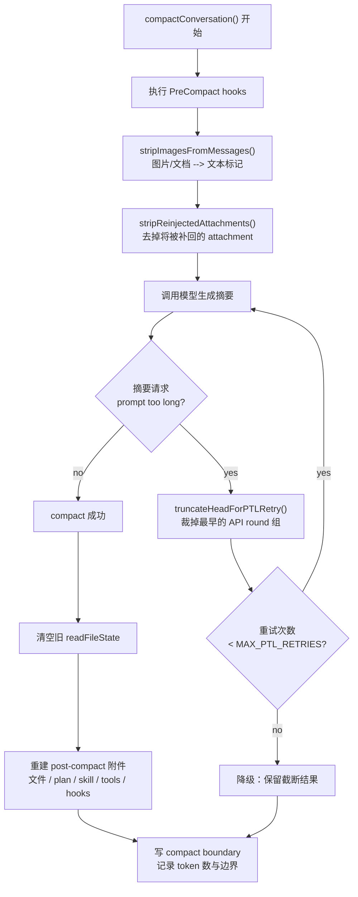

> **原则 5：上下文是工作内存。治理它的目标是支持系统继续工作。**

1. 长期规则、长期记忆、会话连续性，应该分层，不该混写
2. 入口型记忆必须短小，否则整个系统会被入口拖垮
3. session summary 应该服务于"继续工作"，而不是服务于"回忆完整"
4. compact 是上下文治理主路径
5. 压缩后的上下文必须保住运行语义，而不是只保住语言表面

---

## 第 6 章：错误与恢复——"错误即主路径"的设计哲学

### 6.1 "正常情况下"是工程世界最不值得相信的话

判断一个 agent 系统成熟不成熟，不能只看它回答顺畅的时候有多像个人，而要看**它出故障的时候像不像系统**。前者容易靠一点 prompt 工程粉饰，后者只能靠运行时纪律。

> **Claude Code 的可取之处，是它没有假装自己不会出错。** 源码里反复体现出一种冷静判断：**错误属于主路径，恢复则是必须提前设计好的运行机制。**

### 6.2 三层修复链概览

前面各章已经详细展开了每种错误的完整恢复机制，这里用一张图把它们串起来：

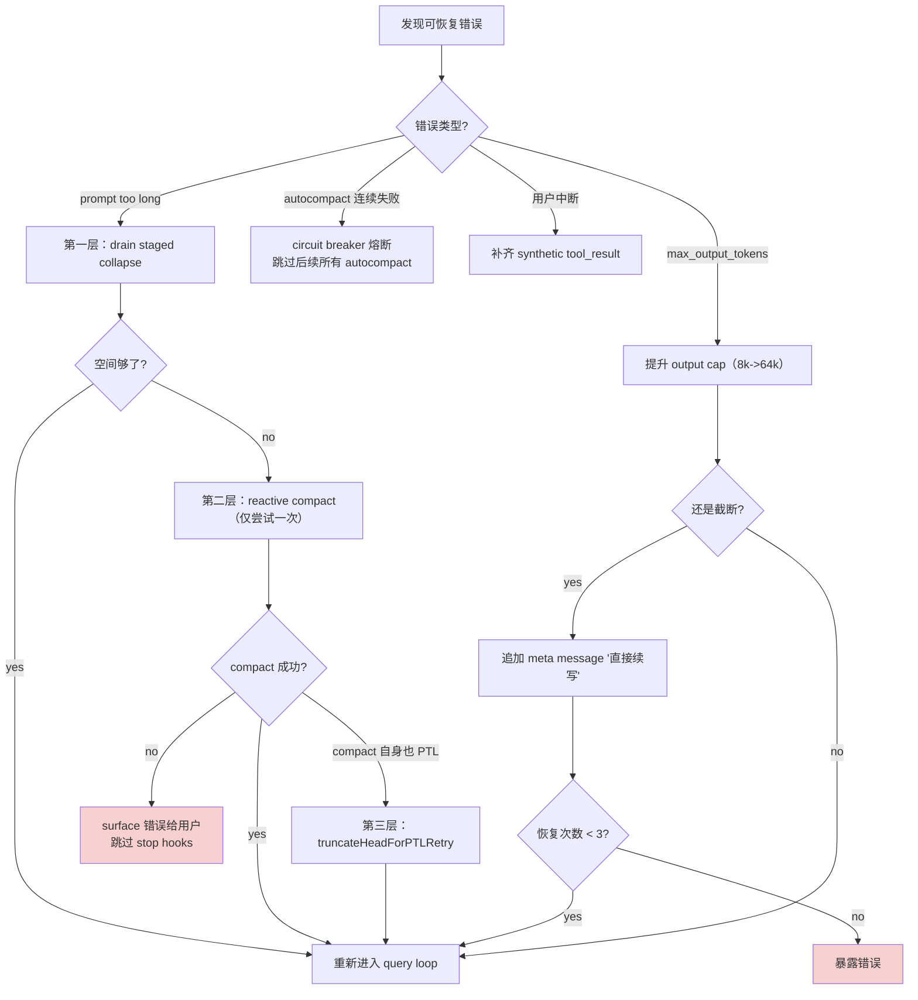

各机制的完整说明位置：
- PTL 的三层恢复（collapse drain -> reactive compact -> truncateHead）：完整机制见 [[#3.6 恢复机制：prompt-too-long 与 max-output-tokens]]
- max-output-tokens 的自动提升 + 续写 + 计数穷尽：完整机制见 [[#3.6 恢复机制：prompt-too-long 与 max-output-tokens]]
- autocompact 的 circuit breaker 熔断：完整机制见 [[#5.5 自动 compact——上下文治理首先是预算治理]]
- truncateHeadForPTLRetry：完整机制见 [[#5.6 compactConversation()——摘要要重建可继续工作的上下文]]
- abort 时补齐 synthetic tool_result：完整机制见 [[#3.5 中断处理：心跳必须处理中断，否则它就只是惯性]]

### 6.3 错误处理真正保护的，是执行叙事的一致性

前面各节讲了各种具体的错误恢复机制。这些机制共同服务于一个更深层的目标——**让系统始终能说清楚自己经历了什么**。

用一个例子串起来：

```
第 15 轮：模型输出被截断（max_output_tokens）
  --> transition.reason = 'max_output_tokens_recovery'
  --> maxOutputTokensRecoveryCount = 1
  --> 提升 cap 后重跑

第 16 轮：上下文太长（prompt too long）
  --> transition.reason = 'collapse_drain_retry'
  --> collapse drain 释放了空间

第 17 轮：还是太长，触发 reactive compact
  --> transition.reason = 'reactive_compact_retry'
  --> hasAttemptedReactiveCompact = true
  --> compact 后写入 compact boundary（记录压缩前 token 数）

第 18 轮：用户按 Esc 中断
  --> 为 3 个未完成的工具生成 synthetic tool_result
  --> 对话历史保持完整
```

`query.ts` 的 `State` 类型里那些看似琐碎的字段——`transition.reason`、`maxOutputTokensRecoveryCount`、`hasAttemptedReactiveCompact`、compact boundary——实际上构成了一条**执行日志**。通过这条日志，系统（以及运维人员）可以还原出完整的故事。

> **错误恢复真正修补的，不只是错误本身，还有系统对自己行为的解释能力。** 一个能解释自己经历的系统，出了问题可以定位和修复；一个说不清自己经历的系统，出了问题只能重启。

> **原则 6：agent 系统的体面，体现在错误发生后仍能维持可解释、可限界、可继续的执行秩序。**

可迁移的工程原则：
1. 错误恢复要分层——不要所有问题都打一把重锤
2. 恢复逻辑必须防止自我回环——`hasAttemptedReactiveCompact` 和 stop hook guard
3. 自动恢复需要计数和熔断——consecutive failures + circuit breaker
4. 截断后的最佳恢复通常是续写，不是总结——保持任务连续性优先
5. 中断也是一种需要语义收尾的失败态——补齐 synthetic tool_result
6. 系统是否可靠，最终要看它出错后还能不能把自己的行为讲明白

---

## 第 7 章：Multi-Agent 与验证

### 7.1 单 agent 走到一定程度，问题变成"怎么分工"

一旦任务变大，单 agent 模型就会碰到一个更难缠的问题：研究、实现、验证都挤在同一条上下文链上，彼此抢预算、抢注意力、抢叙事中心。

multi-agent 看上去像一种自然答案，但它不天然带来秩序。真正困难的是隔离 agent 的不稳定性，同时把结果组织回来。

### 7.2 Forked agent 的第一原则是 cache-safe

#### 什么是 forked agent

Claude Code 在运行时只有一个主对话循环。当需要子代理做研究/实现/验证时，系统从主进程**分叉（fork）出一个受控的子执行流程**——继承父的部分状态，但在自己的隔离空间里运行：

```text
主代理（父）
  |-- 自己的上下文、状态、query loop
  \-- fork 出子代理
        |-- 继承：system prompt、用户上下文、工具定义（为了 cache）
        |-- 克隆：文件状态缓存（独立副本，不互相污染）
        |-- 新建：abort controller、memory 集合（完全隔离）
        \-- 默认关闭：状态回写（setAppState = no-op）
```

#### Cache-critical params

每次调 Claude API 时，API 会把请求的**前缀**（从 system prompt 开头起的连续内容）缓存下来（即 [[#2.5 Prompt 的缓存与计算成本]] 中介绍的 prompt caching 机制）。cache hit（缓存命中）时，已缓存部分的处理价格降至正常输入的 1/10，且跳过重新编码延迟——对频繁调用的 agent 系统来说，这是显著的成本和速度优势。

父代理第一次调用 API 时，API 侧已经缓存了 system prompt + 工具定义等前缀内容。如果子代理的这些字段和父代理完全一致，API 就能直接复用缓存（cache hit）。但只要有一个字段不同——哪怕只多一行——从不同位置开始往后的缓存全部失效（cache miss），子代理就要付全价重新处理整个前缀。

`src/utils/forkedAgent.ts` 定义了 `CacheSafeParams` 类型，显式列出必须父子一致的五个字段：

```typescript
export type CacheSafeParams = {
  systemPrompt: SystemPrompt
  userContext: { [k: string]: string }
  systemContext: { [k: string]: string }
  toolUseContext: ToolUseContext
  forkContextMessages: Message[]
}
```

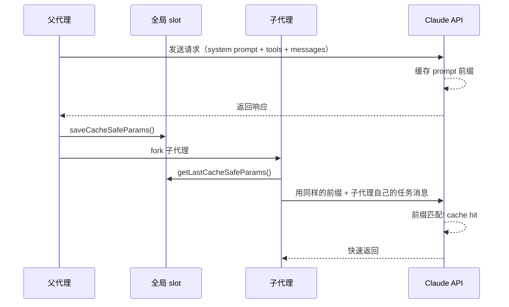

还有一条专门提醒：别随便改 `maxOutputTokens`，因为 thinking config（包含 `maxOutputTokens`）也是 cache key 的一部分——改了它就等于改了前缀，缓存随之失效。

`runForkedAgent()` 在整个 query loop 期间累计 `totalUsage`，结束时日志事件写出完整用量并计算 **cache 命中率 = cache_read_input_tokens / total_input_tokens**。团队可以量化每一次 fork 的缓存效率。

### 7.3 状态隔离：子 agent 首先要减少污染

`createSubagentContext()` 的默认行为：**所有 mutable state 都隔离**。

| 隔离项 | 具体做法 | 目的 |
|--------|---------|------|
| `readFileState` | 从父 `cloneFileStateCache()` 克隆 | 子 agent 的文件读取不污染父的缓存 |
| `abortController` | `createChildAbortController()` | 子 agent 可被单独中止，父中止级联传播 |
| `getAppState` | `shouldAvoidPermissionPrompts: true` | 后台子 agent 不弹权限对话框 |
| `setAppState` | 默认 no-op | 子 agent 不能修改父的全局状态 |
| `nestedMemoryAttachmentTriggers` | 重新建空集合 | memory 触发器不泄露给父 |
| `discoveredSkillNames` | 重新建空集合 | skill 不影响父的列表 |

`contentReplacementState` 从父 clone 来——这些替换决策必须和父一致，否则 prompt cache 的前缀匹配会断裂。**隔离是为了防污染，但缓存相关的决策必须同步。**

只有在明确 opt-in 的情况下才共享：`shareSetAppState`、`shareSetResponseLength`、`shareAbortController`。

> **例外：** `setAppStateForTasks` 始终使用父的回调——如果子 agent 里启动了 Bash 任务，杀掉任务的操作必须能传达到根级 store，否则进程会变成僵尸进程。

### 7.4 协调者模式：synthesis 才是稀缺能力

`src/coordinator/coordinatorMode.ts` 对 coordinator 的要求：
- 帮用户达成目标
- 指挥 worker 做 research、implementation、verification
- 综合结果并和用户沟通
- 能直接回答的问题就直接回答，不要滥委派

最关键的一句：**Always synthesize**。当 worker 回报研究结果后，协调者必须先读懂，再写出具体 prompt——包含具体文件、具体位置、具体变更——不要说"based on your findings"，不要把理解继续外包给 worker。

> **multi-agent 系统的命门。** 真正稀缺的是有人把 worker 带回来的局部知识重新压成清晰、可执行、可验证的下一步。缺少这一层，multi-agent 就退化成带着礼貌措辞的任务转发机。

#### Worker 结果回到 coordinator

Worker 结果以 **user-role message** 回到 coordinator，包裹在 `<task-notification>` XML 标签里：

| 字段 | 内容 |
|------|------|
| `task-id` | 任务唯一标识 |
| `status` | completed / failed / killed |
| `summary` | Worker 的自述摘要 |
| `result` | Worker 的完整输出 |
| `usage` | total_tokens、tool_uses、duration_ms |

### 7.5 验证必须独立成阶段


Verification 的目标是**证明代码有效，而不只是确认代码存在**：
- run tests **with the feature enabled**
- investigate errors, **don't dismiss as unrelated**
- **be skeptical**
- test independently, **don't rubber-stamp**

实现 worker 自证一遍，verification worker 再作为第二层 QA。

> **"我改了代码"和"代码因此正确"之间隔着一条很宽的河。** 把 verification 单列出来，是为了防止"会改代码"冒充"能交付结果"。

### 7.6 Hooks 和任务生命周期

`hooksConfigManager.ts` 定义了 **SubagentStart** 和 **SubagentStop** 两类 hook：

| Hook | 触发时机 | 输入数据 | 用途 |
|------|---------|---------|------|
| `SubagentStart` | subagent 启动时 | `agent_id`、`agent_type` | 观测子 agent 启动 |
| `SubagentStop` | subagent 即将结束时 | `agent_id`、`agent_type`、`agent_transcript_path` | 追踪结束，拿到对话转录路径 |

SubagentStop 的特殊机制：hook 脚本以 **exit code 2** 退出时，系统把 stderr 内容作为反馈消息注入回 subagent，让它继续执行而不是就地停止（其他 exit code：0 = 放行，非 0 非 2 = 中止）。

`LocalAgentTask.tsx` 的 `registerAsyncAgent()` 展示了另一层：每个 async agent 注册 cleanup handler，父 abort 自动级联传播，任务结束后 evict output、更新状态、解除 cleanup 注册。

### 7.7 验证不仅针对代码，也针对记忆

`src/memdir/memoryTypes.ts` 专门提醒：**memory records can become stale**。在基于 memory 给用户建议之前，要先 verify current state；如果记忆与现状冲突，要相信眼下读到的真实状态，并更新或删除 stale memory。

> **验证是整个系统用来抵抗时间漂移和上下文漂移的基本习惯。**

### 7.8 Multi-agent 真正解决的是不确定性的分区

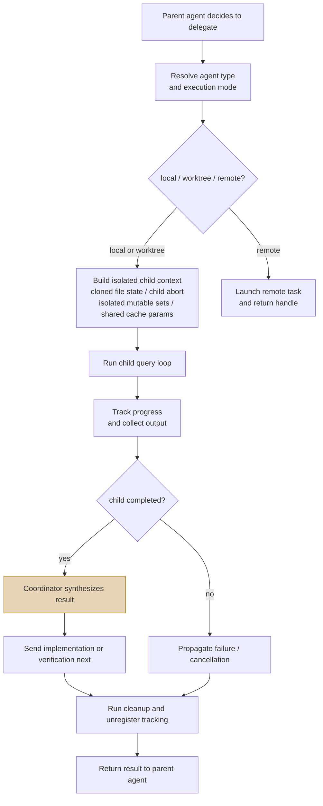

- 研究 worker 在局部上下文里探索，不把试探写回主线程
- 实现 worker 专注修改，不同时扛全局沟通负担
- 验证 worker 专门怀疑，不替自己的实现辩护
- Coordinator 留在中间做收束、综合和用户界面

> **原则 7：Multi-agent 依赖清晰分工：研究、实现、验证和综合各自处在不同约束容器里，最后由协调者把结果重新缝合成可交付结果。**

1. fork 时先考虑 cache 和状态边界，再考虑"人格分工"
2. 子 agent 默认应隔离，可共享必须显式声明
3. 研究可以委派，综合理解不能委派
4. 验证必须与实现解耦，否则系统会奖励自证正确
5. agent 生命周期必须可观测、可中止、可清理

---

## 第 8 章：团队落地——把一个聪明工具变成可复用制度

### 8.1 个人能用，不等于团队能承受

个人技巧之所以有效，往往恰好因为它依赖个人持续盯防、背景知识和临场判断。团队一旦接手，你不能再假定每个人都知道哪些命令其实危险，哪些 memory 已经过期，哪些 skill 会 fork 出子 agent，哪些 approval 一步都不能省。

> **团队落地的关键是把一部分原本靠高手脑内维持的秩序，写成系统级制度。**

### 8.2 团队 CLAUDE.md：分层稳定优先

团队级 CLAUDE.md 最适合放：
- **代码库级硬约束**：禁止某类目录写入、禁止某类危险命令
- **统一验证口径**：改完必须跑哪些检查
- **输出纪律**：review 先报 findings，再报总结
- **常见协作约束**：不要覆盖用户未要求改动的文件

**不适合放**：频繁波动、只对少数任务生效、或本来就该由 skill 承担的具体流程细节。CLAUDE.md 一旦被写成百科全书，很快就没人愿意维护。

> 团队 CLAUDE.md 的最佳状态是稳定、清楚、最不容易产生争议。

### 8.3 Skill 是可复用的制度切片

#### 强制调用语义

`src/tools/SkillTool/prompt.ts` 把规则写得很死：

> "When a skill matches the user's request, this is a **BLOCKING REQUIREMENT**: invoke the relevant Skill tool BEFORE generating any other response about the task"

一旦匹配，系统**必须**走 skill 的执行路径。模型没有"我觉得可以跳过"的自由度。

#### Skill 在子 agent 中执行

`SkillTool.ts` 与 `forkedAgent.ts`：skill 往往在 forked sub-agent context 里执行，有自己的 token budget、context isolation、允许的工具集合。

执行流程：
1. 创建新的 `agentId`
2. 准备 forked 上下文
3. 解析 skill 允许的工具列表（`parseToolListFromCLI`）
4. 将允许的工具合并进 `alwaysAllowRules.command`——skill 内部的工具调用可以跳过权限对话
5. 选择 agent 类型
6. 通过 `runAgent()` 在隔离上下文中执行
7. 结束后清理

#### Skill 的预算控制

listing 预算约为上下文窗口的 1%，每个 skill 描述最多 `MAX_LISTING_DESC_CHARS = 250` 字符。超出预算时内置 skill 保留完整描述，非内置 skill 被截断。

#### 团队视角

只有当 skill 被视为制度切片，团队才会认真去做：
- 明确 skill 的适用边界
- 明确允许动用哪些工具
- 明确应该直接执行还是 fork 到子 agent
- 明确输出物和验证方法

否则 skill 很快退化成"名字好听、内容冗长、真正触发时谁也说不准会发生什么"的半自动口号。

### 8.4 Approval 用来替团队划责任边界

权限规则来源被精确分类：

| 来源 | 含义 |
|------|------|
| `userSettings` | 用户个人设置 |
| `projectSettings` | 项目级共享规则 |
| `localSettings` | 本地私有规则 |
| `flagSettings` | 功能标记控制 |
| `policySettings` | 组织策略级规则 |
| `cliArg` | 命令行参数注入 |
| `command` | skill/命令注入（fork 时合并） |
| `session` | 当前会话中授予 |

> **审批不要按"工具种类"粗暴切，而要按"后果不可逆性"和"环境敏感度"切。** 读文件、列目录可以放宽；改工作区、推 Git、打外网、碰生产资源就该明显收紧。

### 8.5 Hook 的真正用途是把制度挂到生命周期上

`hooksConfigManager.ts` 里的事件，实际上是一张团队治理插点表：

| Hook 事件 | 触发时机 | 团队治理场景举例 |
|----------|---------|---------------|
| `SubagentStart` / `SubagentStop` | 子 agent 启动/结束 | 结束前跑验证性检查 |
| `PreCompact` / `PostCompact` | 压缩前/后 | compact 前后补充说明或记录 |
| `StopFailure` | 回合因 API 错误终止 | 按错误类型分类处理 |
| `InstructionsLoaded` | instruction 文件被加载 | 记录 observability |
| `SessionStart` / `SessionEnd` | 会话开始/结束 | session end 做归档或回收 |
| `DirectoryChange` | 工作目录切换 | 按新目录加载不同规则 |
| `FileChanged` | 文件变更 | 触发增量检查 |
| `PermissionRequest` / `PermissionDenied` | 权限请求/被拒 | 审计权限使用 |
| `Setup` | 初始化或维护 | 环境检查或配置同步 |

> 静态规则该写在 CLAUDE.md，时点动作就该挂在 hook 上。分不清这点，最后只会得到 CLAUDE.md 巨长或 hook 巨乱。

### 8.6 先统一验证定义，再扩 skill 数量

#### 什么是"验证定义"

团队对"什么算验证通过"达成的共识标准，类似 Scrum 的 Definition of Done。

问题场景：三个人用同一个 skill 完成同一类任务，但对"验证通过"的理解完全不同——有人跑了测试+实际请求确认+检查错误码，有人只看了一眼 diff。**验证定义就是把最高标准写成团队共识。**

#### 为什么 skill 管不了这件事

skill 能统一"怎么做"（流程），但管不了"做到什么程度算完"（质量）。**skill 复制的是流程，验证定义复制的是质量底线。**

团队落地时，与其先做二十个花哨 skill，不如先把三条验证定义写清楚：
1. **哪些任务必须有独立验证**
2. **验证至少包含哪些动作**（跑测试 + 类型检查 + 实际运行确认）
3. **验证失败时是否允许标记为"已完成但有已知问题"**

### 8.7 观测与审计

| 子系统 | 记录什么 | 回答什么复盘问题 |
|--------|---------|---------------|
| skill invocation | skill_name、trigger、was_discovered | 谁触发的？主动调还是系统匹配？ |
| forked agent | token 用量 + cache 命中率 | fork 花了多少钱？缓存效率？ |
| subagent stop hook | agent_transcript_path | 完整对话记录在哪？ |
| task 系统 | 状态变化 + 输出文件 | 任务在哪一步从正常变成异常？ |
| compact boundary | 上下文重写点标记 | 哪些信息被丢弃了？ |

> **不要只部署能力，还要部署解释能力。** 只有可追溯轨迹才能让团队继续相信制度本身。

> **原则 8：团队落地的关键，是把个人经验硬化成分层规则、可执行 skill、审批边界和可复盘生命周期。**

1. 先写分层 CLAUDE.md，再谈复杂自动化
2. 先统一验证定义，再扩 skill 数量
3. approval 应按后果和环境分级，而不是按工具名字一刀切
4. hook 用来挂制度时点，不用来堆万能脚本
5. 任何可自动执行的流程，都应该可审计、可回收、可解释

---

## 第 9 章：Harness Engineering 十条原则

前面八章反复逼近这样一个事实：**模型不可靠，但系统仍然可以可靠；前提是你别把可靠性寄托在模型身上，而要把它做进 harness。**

| # | 原则 | 一句话含义 | 源码证据 |
|---|------|----------|---------|
| 1 | 把模型当不稳定部件，不要当同事 | 模型不会自动获得稳定性和责任感 | permission 三态决策、circuit breaker、verification 独立阶段 |
| 2 | Prompt 是控制面的一部分 | system prompt 定义行为协议，不是人格设定 | `coordinatorMode.ts` 规定职责边界和 synthesis 强制要求 |
| 3 | Query loop 才是 agent 系统的心跳 | 输入治理、流式消费、恢复分支都是心跳的一部分 | `forkedAgent.ts` 围绕 query loop 累计 usage、管理 abort 和恢复 |
| 4 | 工具是受管执行接口 | 越危险的工具越不能按普通能力对待 | 权限规则八级分类、skill 工具白名单、后台子 agent 自动 `shouldAvoidPermissionPrompts` |
| 5 | 上下文是工作内存 | 能塞进上下文不等于应该塞进去 | CLAUDE.md 四层加载、MEMORY.md 截断、session memory 预结构化、compact 预算预扣 |
| 6 | 错误路径就是主路径 | PTL、截断、中断、回环是日常天气 | PTL 三层恢复、max-output-tokens 提升+续写+熔断、hook 回环 guard |
| 7 | 恢复的目标是继续工作 | 截断后最好续写，压缩后最重要是恢复呼吸 | compact 后恢复 plan/文件/skill/工具广播/hook 状态 |
| 8 | Multi-agent 是把不确定性分区 | 隔离状态、分离角色、coordinator 收束理解 | `createSubagentContext()` 默认隔离、"Always synthesize"、"be skeptical" |
| 9 | 验证必须独立 | 不能让系统自己给自己打分 | 四阶段分工、verification prompt 中的独立证明要求 |
| 10 | 团队制度比个人技巧重要 | 只有把个人经验制度化，agent 才可能成为组织能力 | CLAUDE.md 四层加载、SkillTool 强制调用、hooks 全量生命周期事件 |

### 最后一句话

> **Harness Engineering 关心的是：在模型并不可靠的前提下，系统仍然能表现出工程系统应有的行为。**

Claude Code 的源码真正教人的，是这种克制：它始终把不稳定性当已知前提，再围着这个前提设计 prompt、loop、tools、memory、compact、recovery、verification 和 team workflow。

难的从来不在把原则说出来，而在愿不愿意承认：**Harness 比激情重要，制度比聪明重要，验证比自信重要。**
