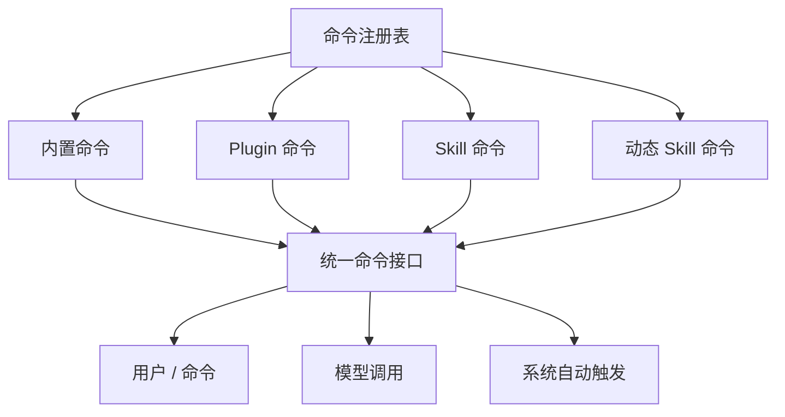
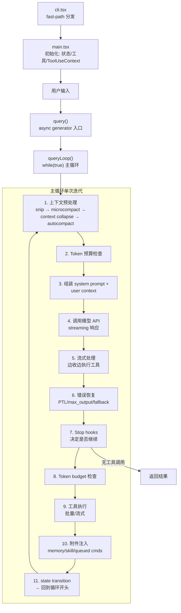
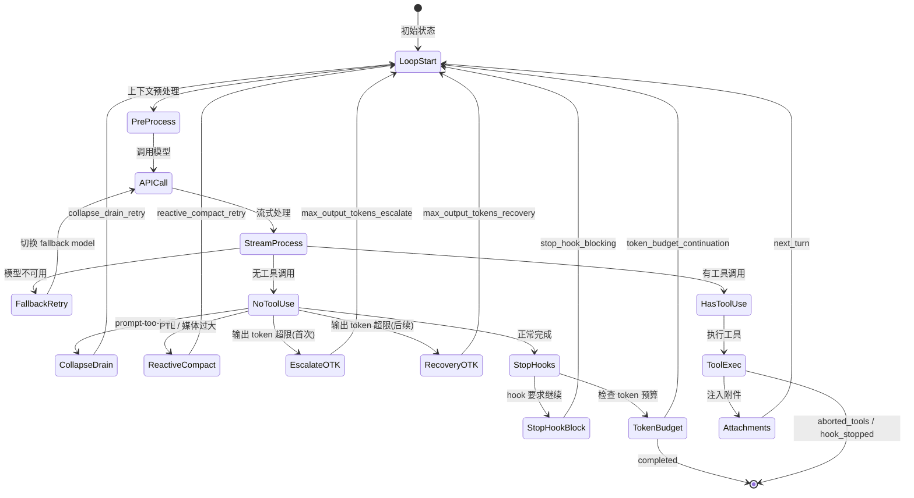
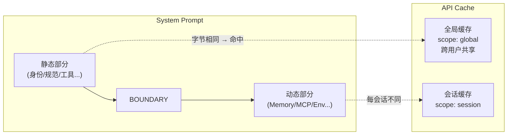
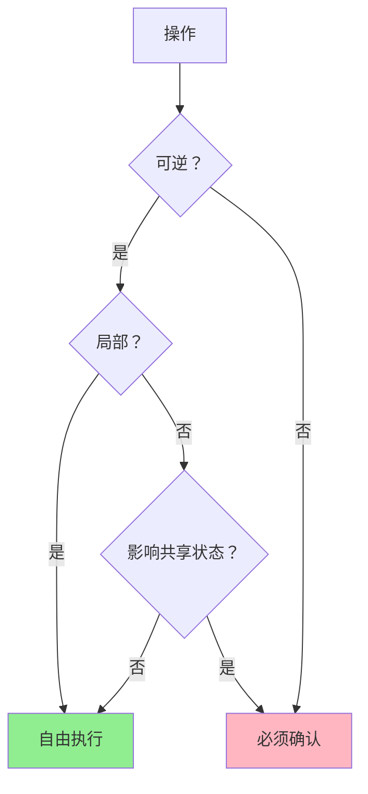

# Claude Code 源码架构深度解析 学习笔记：第 1-2 章

> 来源：《Claude Code 源码架构深度解析 V2.1》(Xiao Tan, 2026.04.04)

---

## 第 1 章：全局视角：CLI 工具 vs Agent Operating System

### 1.1 代码库的真实规模

Claude Code 不是一个"CLI 工具"。当我们解压它的 npm 包，从 `cli.js.map` 中提取出源码后，看到的是将近 4756 个文件。这个数量级已经超过了绝大多数开源 coding agent——后者的 `src/` 目录通常只有一个 main、一个 prompt、几个 tool、一个 utils。

而 Claude Code 的 `src/` 顶层有超过 55 个模块目录：

```
QueryEngine.ts  Tool.ts        assistant/     bootstrap/    bridge/
buddy/          cli/           commands/      components/   constants/
context/        coordinator/   entrypoints/   hooks/        ink/
keybindings/    main.tsx       memdir/        migrations/   native-ts/
outputStyles/   plugins/       query/         query.ts      remote/
schemas/        screens/       server/        services/     skills/
state/          tasks/         tools/         types/        utils/
vim/            voice/         ...
```

各关键模块的文件数量反映了系统的复杂度分布：


| 模块          | 文件数 | 职责                 |
| ----------- | --- | ------------------ |
| utils/      | 564 | 基础设施：权限、Git、模型、设置等 |
| components/ | 389 | Ink TUI 组件         |
| commands/   | 207 | 103 个斜杠命令          |
| tools/      | 184 | 工具定义与执行            |
| services/   | 130 | API、MCP、分析、压缩等服务   |
| hooks/      | 104 | 生命周期钩子             |
| ink/        | 96  | 终端 UI 渲染引擎         |
| bridge/     | 31  | 远程控制桥接             |
| skills/     | 20  | 技能系统               |
| tasks/      | 12  | 任务管理               |


> **关键洞察**：utils/ 的 564 个文件占总量的 12%，这不是"工具函数"膨胀。深入看会发现里面包含了权限系统（permissions/）、Git 操作（git.ts）、模型管理（model/）、设置系统（settings/）、Hook 执行（hooks/）等核心子系统。Claude Code 把大量核心逻辑"藏"在了 utils 命名空间下，这种命名选择可能是历史原因——这些子系统在早期确实是辅助函数，随着产品演进长成了核心模块。

### 1.2 入口层：平台化设计的起点

Claude Code 不是只有一个入口。看 `src/entrypoints/` 目录：

```
cli.tsx              # CLI 主入口
init.ts              # 初始化逻辑
mcp.ts               # MCP 协议入口
sdk/                 # SDK 编程接入
agentSdkTypes.ts     # Agent SDK 类型
sandboxTypes.ts      # 沙箱类型
```

同一个 agent 运行时，能同时服务 CLI 终端、MCP 协议、SDK 调用、IDE 插件。这是**平台化设计**的体现——Claude Code 不是"一个终端程序"，而是"一个 agent 运行时，碰巧有一个终端界面"。

#### cli.tsx 的 fast-path 分发

`cli.tsx` 的核心设计哲学是：**绝大多数入口路径不需要加载完整的应用**。它实现了一套精密的 fast-path 分发逻辑：

```typescript
async function main(): Promise<void> {
  const args = process.argv.slice(2);

  // Fast-path for --version/-v: zero module loading needed
  if (args.length === 1 && (args[0] === '--version' || args[0] === '-v')) {
    console.log(`${MACRO.VERSION} (Claude Code)`);
    return;
  }

  // For all other paths, load the startup profiler
  const { profileCheckpoint } = await import('../utils/startupProfiler.js');
  profileCheckpoint('cli_entry');

  // Fast-path for --dump-system-prompt
  if (feature('DUMP_SYSTEM_PROMPT') && args[0] === '--dump-system-prompt') { ... }
  // Fast-path for --daemon-worker
  if (feature('DAEMON') && args[0] === '--daemon-worker') { ... }
  // Fast-path for remote-control/bridge
  if (feature('BRIDGE_MODE') && (args[0] === 'remote-control' || ...)) { ... }
  // Fast-path for daemon
  if (feature('DAEMON') && args[0] === 'daemon') { ... }
  // Fast-path for ps|logs|attach|kill
  if (feature('BG_SESSIONS') && (args[0] === 'ps' || ...)) { ... }
  // Fast-path for template jobs
  if (feature('TEMPLATES') && (args[0] === 'new' || ...)) { ... }

  // No special flags detected, load and run the full CLI
  const { main: cliMain } = await import('../main.js');
  await cliMain();
}
```

每条 fast-path 的关键特征：


| Fast-path              | 触发条件                         | 加载量              |
| ---------------------- | ---------------------------- | ---------------- |
| `--version`            | 零模块加载                        | 直接打印退出           |
| `--dump-system-prompt` | 仅加载 config + model + prompts | 输出 system prompt |
| `--daemon-worker`      | 加载 daemon worker registry    | 精简 worker 进程     |
| `remote-control`       | 加载 bridge + auth + policy    | 远程控制模式           |
| `daemon`               | 加载 config + sinks + daemon   | 长驻进程             |
| `ps/logs/attach/kill`  | 加载 bg session 管理             | 会话管理             |
| `--worktree --tmux`    | 加载 worktree + tmux           | 直接 exec 进 tmux   |
| 无命中                    | 完整加载 main.tsx                | 完整应用             |


> **关键洞察**：所有 import 都是 `dynamic import`（`await import(...)`），这是有意为之的性能优化。Node.js/Bun 的 `import()` 是惰性的——只有执行到那一行才会加载模块。这意味着 `--version` 路径的启动时间可以控制在几毫秒级别，而不用等待 main.tsx 和它的 200+ 行 import 语句全部求值。

另一个值得注意的细节是 `feature()` 宏（来自 `bun:bundle`）的使用。这是**构建时 dead code elimination** 的手段——如果构建配置中关闭了某个 feature flag，整个 `if` 分支会被编译器移除，不会出现在最终产物中。这意味着外部发布版和内部版本可能有不同的 fast-path 集合。

### 1.3 命令系统：103 个命令的统一架构

`src/commands/` 下有 103 个命令子目录，远超一般 CLI 工具的命令数量：

```
/mcp, /memory, /permissions, /hooks, /plugin, /skills, /tasks,
/plan, /review, /agents, /compact, /doctor, /bridge, /teleport,
/commit, /diff, /branch, /cost, /clear, /debug, /voice, ...
```

这些命令不只是"用户能打的斜杠命令"。它们构成了 Claude Code 的**操作面**——用户、模型、系统三方都可以通过命令系统触发动作。命令系统统一管理了四类来源的命令：




### 1.4 main.tsx：4683 行的控制中心

当没有命中任何 fast-path 时，`cli.tsx` 加载 `main.tsx`。这个文件的前 200 行几乎全是 import 语句——但这不是草率的代码，而是精心安排的**启动顺序**：

```typescript
// 这些 side-effect 必须在所有其他 import 之前运行：
// 1. profileCheckpoint 在模块求值之前打标记
// 2. startMdmRawRead 启动 MDM 子进程（与后续 135ms 的 import 并行运行）
// 3. startKeychainPrefetch 并行启动 macOS keychain 读取
import { profileCheckpoint } from './utils/startupProfiler.js';
profileCheckpoint('main_tsx_entry');

import { startMdmRawRead } from './utils/settings/mdm/rawRead.js';
startMdmRawRead();

import { startKeychainPrefetch } from './utils/secureStorage/keychainPrefetch.js';
startKeychainPrefetch();
```

> **关键洞察**：这三行看似普通的 import + 调用，实际是一个**并行启动优化**。MDM 读取（macOS 管理配置）和 Keychain 预取（OAuth token）是 I/O 密集型操作。把它们放在文件最顶部，就能和后续 135ms 的模块加载并行执行。注释中提到 Keychain 预取省了约 65ms——这种级别的启动优化说明 Anthropic 对终端工具的响应速度有很高的标准。

main.tsx 的 200+ import 涵盖了完整应用所需的全部模块：认证、配置、MCP、分析、权限、工具注册、模型管理、会话恢复、迁移逻辑等。这些 import 是静态的（非 dynamic），因为走到 main.tsx 时意味着需要完整功能，不值得再做惰性加载。

---

## 第 2 章：引擎：主循环与 Prompt 编排

### 2.1 从输入到响应的完整链路

一个用户请求在 Claude Code 中的完整生命周期：




### 2.2 query.ts：1729 行的状态机心脏

`query.ts` 是整个 Claude Code 的核心引擎。它的设计经历了一个关键演进：**从递归到循环**。

#### 为什么不用递归

早期版本的 query 函数在需要继续执行时会递归调用自身。这在短对话中没问题，但在长会话（几十甚至上百轮工具调用）中会遇到**栈溢出**问题。每次递归都在调用栈上新增一帧，JavaScript/Bun 的默认栈深度不够用。

现在的实现是 `while(true)` + `State` 对象，每次 `continue` 就是一个 state transition：

```typescript
// 可变的跨迭代状态
type State = {
  messages: Message[]
  toolUseContext: ToolUseContext
  autoCompactTracking: AutoCompactTrackingState | undefined
  maxOutputTokensRecoveryCount: number
  hasAttemptedReactiveCompact: boolean
  maxOutputTokensOverride: number | undefined
  pendingToolUseSummary: Promise<ToolUseSummaryMessage | null> | undefined
  stopHookActive: boolean | undefined
  turnCount: number
  transition: Continue | undefined  // 上一次迭代为什么 continue
}
```

#### async generator 模式

`query()` 不是一个普通的 async 函数，它是一个 **async generator**：

```typescript
export async function* query(
  params: QueryParams,
): AsyncGenerator<
  StreamEvent | RequestStartEvent | Message | TombstoneMessage | ToolUseSummaryMessage,
  Terminal
> {
  const consumedCommandUuids: string[] = []
  const terminal = yield* queryLoop(params, consumedCommandUuids)
  for (const uuid of consumedCommandUuids) {
    notifyCommandLifecycle(uuid, 'completed')
  }
  return terminal
}
```

使用 generator 的好处是**流式输出**：每次 `yield` 就向调用方推送一条消息（模型的流式输出、工具执行结果、系统消息等），调用方可以立即渲染，不需要等整个循环结束。

> **关键洞察**：`query()` 和 `queryLoop()` 的分离是有意设计的。`query()` 是外层包装，负责命令生命周期通知（`notifyCommandLifecycle`）。`queryLoop()` 是纯粹的主循环逻辑。这种分离让 `queryLoop()` 可以在多个 `continue` 站点直接跳转，而清理逻辑只需要在外层写一次。

#### 主循环的每次迭代

`queryLoop()` 的 `while(true)` 循环体大约有 1400 行，它在每次迭代中做以下事情：

**第一阶段：上下文预处理**


这四层压缩机制是有层次的——从局部到全局，从轻量到重量级：


| 压缩层              | 作用                    | 何时触发            |
| ---------------- | --------------------- | --------------- |
| Snip Compact     | 裁剪最早的消息对，保留最近的上下文     | 每次迭代            |
| Microcompact     | 压缩工具结果的冗余内容（如重复的文件内容） | 每次迭代            |
| Context Collapse | 折叠已完成的上下文段（如已完成的子任务）  | feature flag 控制 |
| Autocompact      | 对整个对话做摘要式压缩           | token 数超过阈值     |


**第二阶段：模型调用**

组装完 system prompt 和 user context 后，通过 `deps.callModel()` 发起流式 API 调用。调用参数丰富：

```typescript
for await (const message of deps.callModel({
  messages: prependUserContext(messagesForQuery, userContext),
  systemPrompt: fullSystemPrompt,
  thinkingConfig: toolUseContext.options.thinkingConfig,
  tools: toolUseContext.options.tools,
  signal: toolUseContext.abortController.signal,
  options: {
    model: currentModel,
    fastMode: appState.fastMode,
    fallbackModel,
    querySource,
    agents: toolUseContext.options.agentDefinitions.activeAgents,
    effortValue: appState.effortValue,
    advisorModel: appState.advisorModel,
    taskBudget: { total, remaining },
    // ...更多参数
  },
})) {
  // 流式处理每一条消息
}
```

**第三阶段：错误恢复矩阵**

主循环的错误恢复是一个多层级的"自救"机制：


| 错误类型            | 恢复策略                                            | 最大尝试次数 |
| --------------- | ----------------------------------------------- | ------ |
| Prompt 太长 (413) | 1. Context Collapse drain → 2. Reactive Compact | 各 1 次  |
| 输出 token 超限     | 1. 升级到 64K max_tokens → 2. 注入恢复消息继续             | 3 次    |
| 模型不可用           | 切换到 fallback model                              | 1 次    |
| 流式中断            | 生成 synthetic tool_result + 中断消息                 | -      |
| 图片/媒体过大         | Reactive Compact 剥离媒体后重试                        | 1 次    |


这些恢复机制在源码中对应为不同的 `state = next; continue;` 分支，每个分支都带有明确的 `transition.reason`：

```typescript
// prompt-too-long 恢复：先尝试 context collapse drain
state = {
  ...currentState,
  transition: { reason: 'collapse_drain_retry', committed: drained.committed },
};
continue;

// 再尝试 reactive compact
state = {
  ...currentState,
  hasAttemptedReactiveCompact: true,
  transition: { reason: 'reactive_compact_retry' },
};
continue;

// 输出 token 升级到 64K
state = {
  ...currentState,
  maxOutputTokensOverride: ESCALATED_MAX_TOKENS,
  transition: { reason: 'max_output_tokens_escalate' },
};
continue;

// 输出 token 多轮恢复
state = {
  ...currentState,
  maxOutputTokensRecoveryCount: maxOutputTokensRecoveryCount + 1,
  transition: { reason: 'max_output_tokens_recovery', attempt: ... },
};
continue;
```

> **关键洞察**：`transition` 字段不仅是调试信息，它是状态机的**防护栏**。例如 `state.transition?.reason !== 'collapse_drain_retry'` 这个判断确保 context collapse drain 只执行一次——如果 drain 后重试仍然 413，就不再重复 drain，而是 fall through 到 reactive compact。没有这个防护，系统可能陷入无限循环。

**第四阶段：循环推进或终止**

正常的工具执行完成后，主循环组装新的消息列表并继续：

```typescript
// 正常的下一轮
const next: State = {
  messages: [...messagesForQuery, ...assistantMessages, ...toolResults],
  toolUseContext: toolUseContextWithQueryTracking,
  autoCompactTracking: tracking,
  turnCount: nextTurnCount,
  maxOutputTokensRecoveryCount: 0,      // 重置恢复计数
  hasAttemptedReactiveCompact: false,    // 重置 compact 标记
  pendingToolUseSummary: nextPendingToolUseSummary,
  maxOutputTokensOverride: undefined,
  stopHookActive,
  transition: { reason: 'next_turn' },
};
state = next;
// while(true) 自动回到循环开头
```

#### 完整的 State Transition 图




### 2.3 Streaming Tool Execution：边收边跑

传统的工具执行流程是**串行的**：等模型完整输出 → 收集所有 `tool_use` block → 依次执行。Claude Code 通过 `StreamingToolExecutor` 实现了**流水线化**：模型还在输出时，已完成的 `tool_use` block 就开始执行。

```typescript
export class StreamingToolExecutor {
  private tools: TrackedTool[] = []
  private siblingAbortController: AbortController

  // 模型输出一个 tool_use block 就立即加入队列
  addTool(block: ToolUseBlock, assistantMessage: AssistantMessage): void {
    const isConcurrencySafe = toolDefinition.isConcurrencySafe(parsedInput)
    this.tools.push({
      id: block.id, block, assistantMessage,
      status: 'queued', isConcurrencySafe,
      pendingProgress: [],
    })
    void this.processQueue()  // 立即尝试执行
  }

  // 并发控制：安全的工具可以并行，不安全的必须独占
  private canExecuteTool(isConcurrencySafe: boolean): boolean {
    const executingTools = this.tools.filter(t => t.status === 'executing')
    return (
      executingTools.length === 0 ||
      (isConcurrencySafe && executingTools.every(t => t.isConcurrencySafe))
    )
  }
}
```

这里有两个关键设计：

**1. 并发安全分类**

每个工具定义了 `isConcurrencySafe()` 方法，返回 `true` 表示可以和其他"并发安全"的工具同时执行。例如，多个 `FileRead` 可以并行，但 `BashTool` 通常需要独占执行。

**2. Sibling Abort Controller**

```typescript
this.siblingAbortController = createChildAbortController(
  toolUseContext.abortController,
)
```

当一个 Bash 工具执行出错时，`siblingAbortController` 会取消所有同级别的正在执行的工具，但不会取消父级的 `abortController`——这意味着主循环（query.ts）不会因为一个工具错误就结束整个 turn。

> **关键洞察**：`StreamingToolExecutor` 的 `discard()` 方法是为模型 fallback 场景设计的。当主模型不可用、切换到 fallback 模型时，之前的 tool_use block（带有旧的 ID）需要被丢弃，因为 fallback 模型会重新生成完全不同的 tool_use block。如果不 discard，就会出现孤儿 `tool_result`（对应了一个不存在的 `tool_use`），API 会报错。

### 2.4 Prompt 组装：一台精密的拼装机器

`prompts.ts` 中的 `getSystemPrompt()` 返回一个字符串数组，每个元素是 system prompt 的一个 section。整个 prompt 分为**静态部分**和**动态部分**，中间用 `SYSTEM_PROMPT_DYNAMIC_BOUNDARY` 标记隔开。

#### 完整的 Prompt 结构

```typescript
return [
  // === 静态内容（可缓存）===
  getSimpleIntroSection(outputStyleConfig),    // 身份定位
  getSimpleSystemSection(),                      // 系统运行规范
  getSimpleDoingTasksSection(),                  // 行为规范（最重要）
  getActionsSection(),                           // 风险动作规范
  getUsingYourToolsSection(enabledTools),         // 工具使用指南
  getSimpleToneAndStyleSection(),                // 语气与风格
  getOutputEfficiencySection(),                  // 输出效率

  // === BOUNDARY MARKER ===
  ...(shouldUseGlobalCacheScope()
    ? [SYSTEM_PROMPT_DYNAMIC_BOUNDARY] : []),

  // === 动态内容（按会话状态注入）===
  ...resolvedDynamicSections,
].filter(s => s !== null)
```

静态 vs 动态 section 的对比：


| 分类      | Section                                                                                          | 特点                           |
| ------- | ------------------------------------------------------------------------------------------------ | ---------------------------- |
| 静态      | Intro / System / DoingTasks / Actions / Tools / ToneStyle / OutputEfficiency                     | 跨会话不变，可全局缓存                  |
| 动态(缓存)  | Session Guidance / Memory / Env Info / Language / Output Style / Scratchpad / FRC / Token Budget | 会话内缓存，/clear 或 /compact 时刷新  |
| 动态(不缓存) | MCP Instructions                                                                                 | 每轮重算，因为 MCP server 可能随时连接/断开 |


#### Prompt Cache 经济学

`SYSTEM_PROMPT_DYNAMIC_BOUNDARY` 标记的存在是一个**成本优化**设计。Anthropic 的 API 支持对 system prompt 做前缀缓存（Prompt Caching）。工作原理：




> **关键洞察**：把不变的内容放前面、会变的放后面，缓存命中率就上去了。这里的"前缀缓存"意味着只要前缀字节完全相同，后续的内容即使不同，前缀部分的计算结果也可以复用。Claude Code 的静态 prompt 部分大约占整个 system prompt 的 60-70%，这意味着每次 API 调用都能省下这部分的 input token 计费。

### 2.5 Section 缓存机制

动态部分的 section 也不是每次都重新计算。`systemPromptSections.ts` 实现了两种 section 类型：

```typescript
// 缓存版：计算一次，缓存到 /clear 或 /compact
export function systemPromptSection(
  name: string,
  compute: ComputeFn,
): SystemPromptSection {
  return { name, compute, cacheBreak: false }
}

// 不缓存版：每轮重新计算，会破坏 prompt cache
export function DANGEROUS_uncachedSystemPromptSection(
  name: string,
  compute: ComputeFn,
  _reason: string,  // 必须说明为什么需要不缓存
): SystemPromptSection {
  return { name, compute, cacheBreak: true }
}
```

注意 `DANGEROUS_` 前缀——这是一个**命名约定的防护栏**。使用这个函数的人必须提供 `_reason` 参数解释为什么需要破坏缓存，强制开发者思考成本影响。

解析逻辑清晰展示了这种缓存策略：

```typescript
export async function resolveSystemPromptSections(
  sections: SystemPromptSection[],
): Promise<(string | null)[]> {
  const cache = getSystemPromptSectionCache()
  return Promise.all(
    sections.map(async s => {
      if (!s.cacheBreak && cache.has(s.name)) {
        return cache.get(s.name) ?? null  // 命中缓存
      }
      const value = await s.compute()     // 计算并缓存
      setSystemPromptSectionCacheEntry(s.name, value)
      return value
    }),
  )
}
```

在实际使用中，只有 MCP Instructions 使用了 `DANGEROUS_uncachedSystemPromptSection`，原因注释明确写出：`'MCP servers connect/disconnect between turns'`。

### 2.6 行为规范：让 AI 工程师不乱来

`getSimpleDoingTasksSection()` 是整个 system prompt 中最有价值的部分。它定义了模型的**工程行为准则**——不是"你是一个有帮助的助手"这种泛泛之谈，而是极具操作性的工程判断：

#### 不要做什么


| 规则                      | 原因                    |
| ----------------------- | --------------------- |
| 不要加用户没要求的功能             | 防止 scope creep        |
| 不要过度抽象：三行重复代码好过一个不成熟的抽象 | 防止过早抽象（Rule of Three） |
| 不要给没改的代码加注释和文档字符串       | 防止噪声 commit           |
| 不要做不必要的错误处理和兜底逻辑        | 信任内部代码和框架保证           |
| 不要设计面向未来的抽象             | YAGNI 原则              |
| 不要给时间估计                 | 避免不准确的承诺              |
| 不要创建文件除非绝对必要            | 防止文件膨胀                |


#### 要做什么


| 规则               | 原因           |
| ---------------- | ------------ |
| 先读代码再改代码         | 理解上下文后再动手    |
| 方法失败了先诊断，不要盲目重试  | 工程师思维 vs 碰运气 |
| 也不要一次失败就放弃       | 韧性 vs 脆弱性    |
| 结果要如实汇报          | 反对虚报成功       |
| 完成前要验证：运行测试、检查输出 | 完成定义包含验证     |


源码中的关键片段：

```typescript
function getSimpleDoingTasksSection(): string {
  const codeStyleSubitems = [
    `Don't add features, refactor code, or make "improvements" beyond what was asked.`,
    `Don't add error handling, fallbacks, or validation for scenarios that can't happen.
     Trust internal code and framework guarantees.
     Only validate at system boundaries (user input, external APIs).`,
    `Don't create helpers, utilities, or abstractions for one-time operations.
     Three similar lines of code is better than a premature abstraction.`,
    // 仅内部版本：
    `Default to writing no comments. Only add one when the WHY is non-obvious.`,
    `Before reporting a task complete, verify it actually works: run the test,
     execute the script, check the output.`,
  ]
  // ...
}
```

> **关键洞察**：注意 `process.env.USER_TYPE === 'ant'` 的条件分支。内部版本（Anthropic 员工使用）比外部版本有更多的行为约束，比如"默认不写注释"和"如实汇报结果"。这些规则可能是从内部使用中发现的真实问题提炼出来的——说明即使是 Claude 最新模型，在没有明确指令约束时也会倾向于过度注释和美化结果。

#### 风险动作规范

`getActionsSection()` 是另一个重要的行为规范，它处理的是**不可逆操作**的决策框架：

```typescript
function getActionsSection(): string {
  return `# Executing actions with care

Carefully consider the reversibility and blast radius of actions.
Generally you can freely take local, reversible actions like editing
files or running tests. But for actions that are hard to reverse,
affect shared systems beyond your local environment, or could
otherwise be risky or destructive, check with the user before
proceeding.

Examples of the kind of risky actions that warrant user confirmation:
- Destructive operations: deleting files/branches, dropping database tables...
- Hard-to-reverse operations: force-pushing, git reset --hard...
- Actions visible to others: pushing code, creating/commenting on PRs...

When you encounter an obstacle, do not use destructive actions as a
shortcut to simply make it go away.`
}
```

这段 prompt 建立了一个清晰的**操作分级模型**：




### 2.7 输出效率与沟通规范

最后两个静态 section 控制模型的沟通方式：

**Tone and Style** — 输出格式规范：

- 不使用 emoji（除非用户要求）
- 引用代码时包含 `file_path:line_number`
- GitHub 引用用 `owner/repo#123` 格式
- 不要在工具调用前加冒号

**Output Efficiency** — 输出效率规范：

- 先说答案，不说推理过程
- 跳过填充词和过渡句
- 不复述用户说过的话
- 只在需要用户输入时详细解释

> **关键洞察**：内部版本和外部版本的 Output Efficiency section 差异很大。外部版本只是简单的"简洁高效"，内部版本（`process.env.USER_TYPE === 'ant'`）则更具体：在工具调用之间保持文字 <= 25 个词，最终回复 <= 100 个词（除非任务需要更多）。这种数值化的长度锚定，根据注释，比定性的"be concise"能减少约 1.2% 的输出 token——在 Anthropic 内部规模的使用量下，这是一个有意义的成本节约。

---

## 总结与反思

### 架构层面

Claude Code 的前两章揭示了一个关键认知：这不是一个 CLI 工具，而是一个**Agent Operating System**。它的设计选择处处体现了这一点：

1. **多入口平台化**：CLI/MCP/SDK/IDE 共享同一个运行时
2. **极致的启动优化**：fast-path 分发 + dynamic import + 并行预加载
3. **状态机主循环**：while(true) + State 对象替代递归，支持无限长会话
4. **多层错误恢复**：每种错误类型都有对应的恢复策略，不是简单重试
5. **Prompt 分层缓存**：静态/动态分离，缓存/不缓存显式标注

### 工程哲学

从 prompt 的行为规范可以提炼出 Claude Code 团队的工程哲学：

- **最小必要复杂度**：不做额外的事，但该做的要做到位
- **诊断优先于重试**：失败时先理解原因
- **验证包含在完成定义中**：没验证的工作不算完成
- **如实汇报**：不美化、不隐瞒、不过度谨慎
- **可逆性决定自由度**：可逆操作自由执行，不可逆操作必须确认

