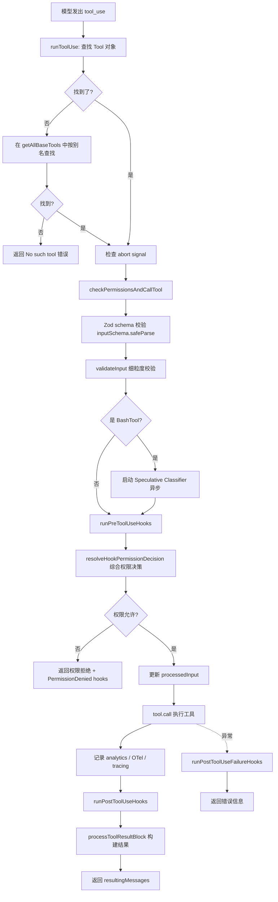
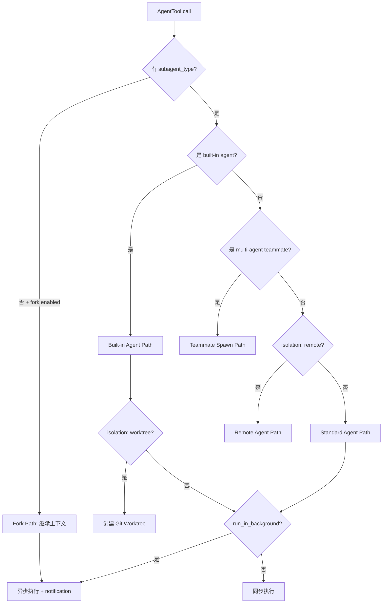
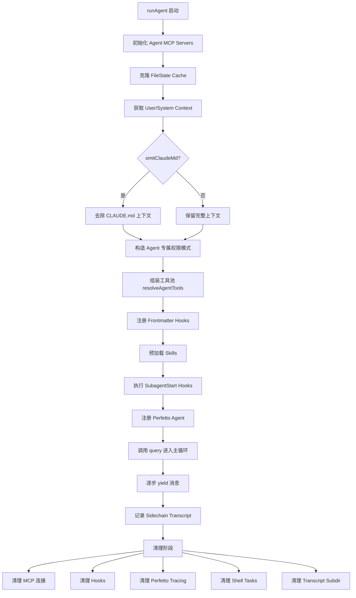
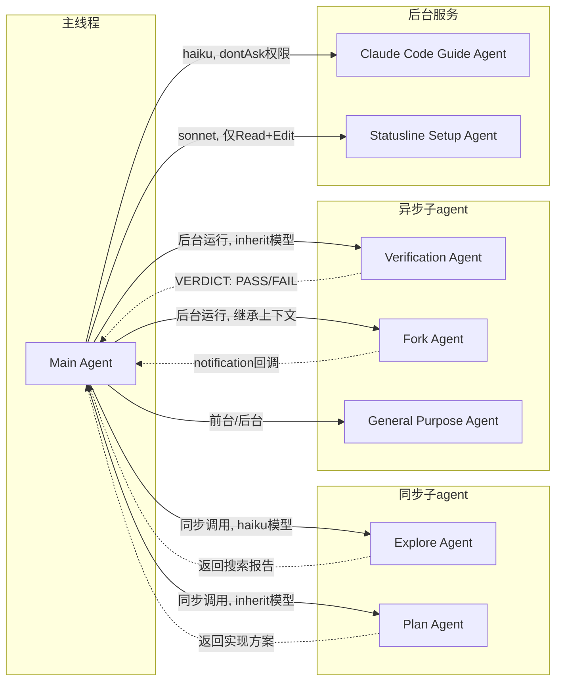

# Claude Code 源码架构深度解析 学习笔记：第 3-4 章

> 来源：《Claude Code 源码架构深度解析 V2.1》(Xiao Tan, 2026.04.04)

---

## 第 3 章：工具系统 —— 42 个工具和一条治理流水线

### 3.1 Tool 接口设计：不只是函数调用

Claude Code 的工具系统不是简单的"函数名 + 输入 + 输出"。`Tool.ts` 定义了一个功能丰富的工具接口，每个工具都是一个具有完整生命周期管理能力的实体。

#### 3.1.1 Tool 类型定义的核心结构

从源码 `src/Tool.ts` 中可以看到，`Tool` 类型是一个复杂的泛型类型：

```typescript
export type Tool<
  Input extends AnyObject = AnyObject,
  Output = unknown,
  P extends ToolProgressData = ToolProgressData,
> = {
  aliases?: string[]
  searchHint?: string
  call(args: z.infer<Input>, context: ToolUseContext, ...): Promise<ToolResult<Output>>
  readonly inputSchema: Input
  inputJSONSchema?: ToolInputJSONSchema
  isConcurrencySafe(input: z.infer<Input>): boolean
  isReadOnly(input: z.infer<Input>): boolean
  isDestructive?(input: z.infer<Input>): boolean
  checkPermissions(input: z.infer<Input>, context: ToolUseContext): Promise<PermissionResult>
  prompt(options: { ... }): Promise<string>
  validateInput?(input: z.infer<Input>, context: ToolUseContext): Promise<ValidationResult>
  preparePermissionMatcher?(input: z.infer<Input>): Promise<(pattern: string) => boolean>
  backfillObservableInput?(input: Record<string, unknown>): void
  toAutoClassifierInput(input: z.infer<Input>): unknown
  // 6+ 个 render 方法...
}
```

三个泛型参数让工具系统具备了完整的类型安全：
- `Input`：Zod schema 定义的输入类型
- `Output`：工具执行结果的类型
- `P`：进度事件的类型

#### 3.1.2 关键方法职责分层

从源码分析来看，Tool 接口的方法可以分为以下几个层次：

| 层次 | 方法 | 职责 |
|------|------|------|
| **执行层** | `call()` | 真正执行工具逻辑 |
| **校验层** | `inputSchema` (Zod) / `validateInput()` | 两级输入校验 |
| **权限层** | `checkPermissions()` / `preparePermissionMatcher()` | 工具级权限检查 + Hook 模式匹配预处理 |
| **安全元数据** | `isReadOnly()` / `isDestructive()` / `isConcurrencySafe()` | 安全属性声明 |
| **可观测性** | `backfillObservableInput()` / `toAutoClassifierInput()` | SDK stream 补充字段 / 安全分类器输入 |
| **提示工程** | `prompt()` / `searchHint` | 动态生成 system prompt 描述 / ToolSearch 关键词匹配 |
| **UI 渲染** | 6+ 个 `render*` 方法 | 工具调用的各种 UI 场景 |

> **关键洞察**：`backfillObservableInput()` 的设计非常巧妙。它只修改"可观测副本"（给 SDK stream、transcript、hooks 看的），而不修改原始输入（用于 `call()` 和 prompt cache）。这种分离确保了 prompt cache 的稳定性，同时让外部观察者能看到完整信息。源码注释明确说："The original API-bound input is never mutated (preserves prompt cache)."

#### 3.1.3 buildTool() 工厂函数：Fail-Closed 的安全默认值

`buildTool()` 是所有工具的统一构造入口。它的默认值体现了"fail-closed"的安全设计哲学：

```typescript
const TOOL_DEFAULTS = {
  isEnabled: () => true,
  isConcurrencySafe: (_input?: unknown) => false,  // 假设不安全
  isReadOnly: (_input?: unknown) => false,          // 假设会写
  isDestructive: (_input?: unknown) => false,
  checkPermissions: (input, _ctx?) =>               // 交给通用权限系统
    Promise.resolve({ behavior: 'allow', updatedInput: input }),
  toAutoClassifierInput: (_input?: unknown) => '',  // 跳过分类器
  userFacingName: (_input?: unknown) => '',
}

export function buildTool<D extends AnyToolDef>(def: D): BuiltTool<D> {
  return {
    ...TOOL_DEFAULTS,
    userFacingName: () => def.name,
    ...def,
  } as BuiltTool<D>
}
```

| 默认值 | 安全含义 |
|--------|----------|
| `isConcurrencySafe: false` | 默认不允许并发执行，防止竞态条件 |
| `isReadOnly: false` | 默认假设工具会修改状态，需要权限检查 |
| `checkPermissions: allow` | 交给上层通用权限系统，而不是在工具层面默认拒绝 |
| `toAutoClassifierInput: ''` | 默认跳过安全分类器，安全相关工具必须显式覆盖 |

> **关键洞察**：`BuiltTool<D>` 类型使用了一个精巧的类型级 spread 操作（`Omit<D, DefaultableKeys> & { [K in DefaultableKeys]-?: ... }`），确保了即使 `ToolDef` 省略了可选方法，最终产出的 `Tool` 对象一定有完整的方法集。这消除了运行时 `?.() ?? default` 的需要。

#### 3.1.4 ToolUseContext：工具执行的完整上下文

`ToolUseContext` 是传递给每个工具 `call()` 方法的巨大上下文对象，包含了 60+ 个字段。几个值得关注的设计：

- **`setAppStateForTasks`**：与 `setAppState` 分离。普通 `setAppState` 对异步 agent 是 no-op，但后台任务注册/清理必须能写入根状态，因此需要这个"always-shared"通道。
- **`renderedSystemPrompt`**：冻结在 turn 开始时的系统提示字节。fork 子 agent 直接复用这个字节序列，而不是重新生成，避免 GrowthBook flag 变化导致 prompt cache 失效。
- **`contentReplacementState`**：工具结果预算的状态管理。主线程只初始化一次（陈旧的 UUID 键是惰性的），子 agent 克隆父级状态以共享 cache 决策。

### 3.2 42+ 个工具的分类全景

从源码 `src/tools/` 目录的实际内容来看，工具数量已经超过了 42 个：

```
AgentTool/          BashTool/           BriefTool/          ConfigTool/
EnterPlanModeTool/  EnterWorktreeTool/  ExitPlanModeTool/   ExitWorktreeTool/
FileEditTool/       FileReadTool/       FileWriteTool/      GlobTool/
GrepTool/           LSPTool/            ListMcpResourcesTool/  MCPTool/
McpAuthTool/        NotebookEditTool/   PowerShellTool/     REPLTool/
ReadMcpResourceTool/ RemoteTriggerTool/ ScheduleCronTool/   SendMessageTool/
SkillTool/          SleepTool/          SuggestBackgroundPRTool/
SyntheticOutputTool/ TaskCreateTool/    TaskGetTool/        TaskListTool/
TaskOutputTool/     TaskStopTool/       TaskUpdateTool/     TeamCreateTool/
TeamDeleteTool/     TodoWriteTool/      ToolSearchTool/     TungstenTool/
VerifyPlanExecutionTool/  WebFetchTool/  WebSearchTool/    WorkflowTool/
```

按功能域分类：

| 类别 | 工具 | 特点 |
|------|------|------|
| **文件操作** | FileRead, FileEdit, FileWrite, GlobTool, GrepTool, NotebookEdit | 核心代码操作能力 |
| **Shell 执行** | BashTool, PowerShellTool | 跨平台命令执行 |
| **Agent 调度** | AgentTool, Task{Create/Get/List/Stop/Update/Output} | 多 agent 体系的核心 |
| **多 Agent 协作** | SendMessage, TeamCreate/Delete | 团队级协作 |
| **MCP 集成** | MCPTool, ListMcpResources, ReadMcpResource, McpAuth | 外部工具扩展 |
| **Web 能力** | WebSearch, WebFetch | 互联网访问 |
| **模式切换** | EnterPlanMode/ExitPlanMode, EnterWorktree/ExitWorktree | 工作模式管理 |
| **工具发现** | ToolSearch, Brief | 延迟加载工具的发现机制 |
| **其他** | SkillTool, SleepTool, TodoWrite, Config, ScheduleCron, RemoteTrigger, WorkflowTool | 辅助功能 |

> **关键洞察**：工具目录中出现了 PDF 未提到的几个新工具：`REPLTool`（透明包装器）、`LSPTool`（Language Server Protocol 集成）、`SuggestBackgroundPRTool`、`SyntheticOutputTool`、`TeamCreateTool/TeamDeleteTool`（团队管理）、`VerifyPlanExecutionTool`、`WorkflowTool`。说明 Claude Code 的工具系统仍在快速演进。`TungstenTool` 是一个特殊的工具（源码注释提到 "TungstenTool doesn't define outputSchema"），可能是某种内部实验性工具。

### 3.3 工具执行 Pipeline：一条 14 步治理流水线

`toolExecution.ts` 实现了从模型决定调用工具到最终返回结果的完整流水线。从源码分析，这条流水线的入口是 `runToolUse()` 函数，核心逻辑在 `checkPermissionsAndCallTool()` 中。

#### 3.3.1 Pipeline 完整流程图



#### 3.3.2 14 步详解（结合源码）

从 `checkPermissionsAndCallTool()` 函数（起始于 `toolExecution.ts:599`）可以清晰地追踪每一步：

**步骤 1-2：查找工具 + 解析 MCP 元数据**（`runToolUse` 函数）

```typescript
// 先在可用工具中找
let tool = findToolByName(toolUseContext.options.tools, toolName)
// 再按别名在所有基础工具中找（向后兼容已弃用的工具名）
if (!tool) {
  const fallbackTool = findToolByName(getAllBaseTools(), toolName)
  if (fallbackTool && fallbackTool.aliases?.includes(toolName)) {
    tool = fallbackTool
  }
}
// 解析 MCP 元数据
const mcpServerType = getMcpServerType(toolName, toolUseContext.options.mcpClients)
```

> 这里有一个向后兼容的设计：工具可以有 `aliases`，比如 `Task` 是 `Agent` 的旧名字（`LEGACY_AGENT_TOOL_NAME = 'Task'`）。这样即使旧的 transcript 中引用了旧名字，也能正确路由。

**步骤 3-4：两级输入校验**

```typescript
// 第一级：Zod schema 校验
const parsedInput = tool.inputSchema.safeParse(input)
if (!parsedInput.success) {
  // 如果是延迟加载工具的 schema 未发送，附加提示
  const schemaHint = buildSchemaNotSentHint(tool, ...)
  // 返回 InputValidationError
}

// 第二级：工具自定义校验
const isValidCall = await tool.validateInput?.(parsedInput.data, toolUseContext)
```

> **两级校验的区别**：Zod schema 校验是结构性的（类型、必填字段），`validateInput()` 是语义性的（比如 BashTool 检查命令是否超出当前工作目录，FileEditTool 检查文件是否存在）。

**步骤 5：Speculative Classifier（BashTool 专属）**

```typescript
if (tool.name === BASH_TOOL_NAME && parsedInput.data && 'command' in parsedInput.data) {
  startSpeculativeClassifierCheck(
    (parsedInput.data as BashToolInput).command,
    appState.toolPermissionContext,
    toolUseContext.abortController.signal,
    toolUseContext.options.isNonInteractiveSession,
  )
}
```

> **关键洞察**：Speculative Classifier 是一个异步启动的"预判器"，在 Hook 执行之前就开始分析 Bash 命令的风险等级。它不阻塞主流程，而是和 PreToolUse hooks 并行运行。等到需要做权限决策时，分类结果可能已经准备好了。源码注释特别说明："The UI indicator (setClassifierChecking) is NOT set here" —— 避免为那些通过前缀规则自动允许的命令闪烁"classifier running"状态。

**步骤 6-8：Hooks + 权限决策**

```typescript
// 步骤 6：PreToolUse hooks
for await (const result of runPreToolUseHooks(toolUseContext, tool, processedInput, ...)) {
  switch (result.type) {
    case 'hookPermissionResult':   // Hook 返回权限决策
    case 'hookUpdatedInput':       // Hook 修改了输入
    case 'preventContinuation':    // Hook 要求阻止后续
    case 'stop':                   // Hook 要求停止
    // ...
  }
}

// 步骤 7-8：综合权限决策
const resolved = await resolveHookPermissionDecision(
  hookPermissionResult, tool, processedInput, toolUseContext, canUseTool, ...
)
```

权限决策的数据流可以用以下表格理解：

| Hook 返回 | 效果 |
|-----------|------|
| `hookPermissionResult: allow` | 直接允许，跳过用户交互 |
| `hookPermissionResult: deny` | 直接拒绝 |
| `hookPermissionResult: ask` | 继续走交互式权限检查 |
| `hookUpdatedInput` | 修改输入但不做权限决策 |
| `preventContinuation` | 允许工具执行但执行后阻止模型继续 |
| `stop` | 立即中止，返回错误 |

**步骤 9：修正输入**

```typescript
// 如果权限决策或 Hook 修改了输入
if (permissionDecision.updatedInput !== undefined) {
  processedInput = permissionDecision.updatedInput
}
```

这里有一个精细的 backfill 逻辑：如果 `processedInput` 仍然指向 backfill 克隆（没有被 Hook/权限修改），就传递原始 `callInput` 给 `call()`，保持 transcript/VCR fixture hash 的稳定性。

**步骤 10：执行 tool.call()**

```typescript
const result = await tool.call(
  callInput,
  { ...toolUseContext, toolUseId: toolUseID, userModified: permissionDecision.userModified ?? false },
  canUseTool,
  assistantMessage,
  progress => onToolProgress({ toolUseID: progress.toolUseID, data: progress.data }),
)
```

**步骤 11：遥测和可观测性**

```typescript
// Analytics event
logEvent('tengu_tool_use_success', { toolName, durationMs, ... })
// OTel span
void logOTelEvent('tool_result', { tool_name, success: 'true', duration_ms, ... })
// Span events for tool content (gated by OTEL_LOG_TOOL_DETAILS)
addToolContentEvent('tool.output', contentAttributes)
```

**步骤 12：PostToolUse hooks**

```typescript
for await (const hookResult of runPostToolUseHooks(
  toolUseContext, tool, toolUseID, ..., processedInput, toolOutput, ...
)) {
  if ('updatedMCPToolOutput' in hookResult) {
    // MCP 工具的 hook 可以修改输出
    toolOutput = hookResult.updatedMCPToolOutput
  }
  // ...
}
```

> **注意**：PostToolUse hooks 对于 MCP 工具有特殊处理 —— hook 可以修改 MCP 工具的输出。对于非 MCP 工具，`addToolResult` 在 PostToolUse hooks 之前就已经调用了。

**步骤 13-14：结果构建 + 失败 hooks**

```typescript
// 成功路径
await addToolResult(toolOutput, mappedToolResultBlock)

// 失败路径（在 catch 块中）
for await (const hookResult of runPostToolUseFailureHooks(
  toolUseContext, tool, toolUseID, ..., processedInput, content, isInterrupt, ...
)) {
  hookMessages.push(hookResult)
}
```

#### 3.3.3 Pipeline 中的性能监控

源码中有两个关键的性能阈值常量：

```typescript
export const HOOK_TIMING_DISPLAY_THRESHOLD_MS = 500   // Hook 耗时超过 500ms 才显示计时摘要
const SLOW_PHASE_LOG_THRESHOLD_MS = 2000               // Hook/权限决策阻塞超过 2s 记录 debug 警告
```

这体现了一个"渐进式警告"的设计：500ms 以上开始在 UI 上显示，2s 以上在日志中标记为"slow"。

---

## 第 4 章：多 Agent 体系 —— 分工和调度

### 4.1 为什么需要多个 Agent

Claude Code 的多 Agent 体系基于一个简单的原则：让一个 Agent 同时做研究、规划、实现和验证，每件事都做不扎实。从源码 `src/tools/AgentTool/built-in/` 目录可以确认，系统内建了 6 个 Agent：

```
claudeCodeGuideAgent.ts   exploreAgent.ts    generalPurposeAgent.ts
planAgent.ts              statuslineSetup.ts  verificationAgent.ts
```

| Agent | 核心定位 | 模型选择 | 特殊属性 |
|-------|----------|---------|----------|
| **General Purpose** | 通用任务执行 | 默认 sub-agent 模型 | `tools: ['*']` |
| **Explore** | 纯只读代码探索 | 外部用户 haiku / 内部 inherit | `omitClaudeMd: true` |
| **Plan** | 纯规划不执行 | inherit | `omitClaudeMd: true` |
| **Verification** | 对抗性验证 | inherit | `background: true`, `color: 'red'` |
| **Claude Code Guide** | 使用指导 | haiku | `permissionMode: 'dontAsk'` |
| **Statusline Setup** | 状态栏配置 | sonnet | `tools: ['Read', 'Edit']`, `color: 'orange'` |

> **关键洞察**：从 `constants.ts` 可以看到 `ONE_SHOT_BUILTIN_AGENT_TYPES` 只包含 `Explore` 和 `Plan`。这意味着这两个 agent 是"一次性"的：执行完就返回报告，不会被 `SendMessage` 继续对话。跳过 agentId/SendMessage/usage trailer 可以"节省 ~135 chars x 34M Explore 每周运行量"。

### 4.2 Explore Agent：裁剪出来的只读专家

Explore Agent 的设计哲学是"极致精简"。从 `exploreAgent.ts` 源码来看：

#### 4.2.1 严格的只读约束

```typescript
function getExploreSystemPrompt(): string {
  return `You are a file search specialist for Claude Code...

=== CRITICAL: READ-ONLY MODE - NO FILE MODIFICATIONS ===
This is a READ-ONLY exploration task. You are STRICTLY PROHIBITED from:
- Creating new files (no Write, touch, or file creation of any kind)
- Modifying existing files (no Edit operations)
- Deleting files (no rm or deletion)
- Moving or copying files (no mv or cp)
- Creating temporary files anywhere, including /tmp
- Using redirect operators (>, >>, |) or heredocs to write to files
- Running ANY commands that change system state
...`
}
```

不仅 prompt 中反复强调只读，工具级别也有硬性约束：

```typescript
export const EXPLORE_AGENT: BuiltInAgentDefinition = {
  disallowedTools: [
    AGENT_TOOL_NAME,           // 不能嵌套 agent
    EXIT_PLAN_MODE_TOOL_NAME,  // 不能切换模式
    FILE_EDIT_TOOL_NAME,       // 不能编辑
    FILE_WRITE_TOOL_NAME,      // 不能写入
    NOTEBOOK_EDIT_TOOL_NAME,   // 不能编辑 notebook
  ],
  model: process.env.USER_TYPE === 'ant' ? 'inherit' : 'haiku',
  omitClaudeMd: true,  // 不注入 CLAUDE.md
}
```

#### 4.2.2 三重性能优化

1. **模型降级**：外部用户默认用 Haiku（更快更便宜），内部用户继承主模型
2. **省略 CLAUDE.md**：`omitClaudeMd: true` 让 Explore Agent 不加载 CLAUDE.md 的 commit/PR/lint 规则，主 agent 已有完整上下文并负责解释结果。源码注释："Dropping claudeMd here saves ~5-15 Gtok/week across 34M+ Explore spawns."
3. **省略 gitStatus**：`runAgent.ts` 中对 Explore 和 Plan agent 特殊处理，去掉了 gitStatus 上下文（可达 40KB），因为它们如需 git 信息会自己运行 `git status` 获取最新数据

```typescript
// runAgent.ts 中的优化
const resolvedSystemContext =
  agentDefinition.agentType === 'Explore' || agentDefinition.agentType === 'Plan'
    ? systemContextNoGit  // 去掉 gitStatus
    : baseSystemContext
```

> **关键洞察**：这些优化的量级非常惊人 —— "5-15 Gtok/week"（Giga-token，10亿 token 级别每周）。这说明 Explore Agent 的调用频率极高（每周 3400 万次），每次节省的上下文 token 累积起来是天文数字。这种"针对高频路径做微优化"的思路在大规模 AI 系统中至关重要。

### 4.3 Verification Agent：整个系统里最严格的 prompt

Verification Agent 的 prompt 是所有 agent 中最长、最精心设计的，它的核心使命就是"想办法搞坏它"。

#### 4.3.1 两种失败模式的防御

从 `verificationAgent.ts` 源码可以看到 prompt 开篇就点明了两种常见失败：

```typescript
const VERIFICATION_SYSTEM_PROMPT = `You are a verification specialist. 
Your job is not to confirm the implementation works — it's to try to break it.

You have two documented failure patterns. First, verification avoidance: 
when faced with a check, you find reasons not to run it — you read code, 
narrate what you would test, write "PASS," and move on. Second, being 
seduced by the first 80%: you see a polished UI or a passing test suite 
and feel inclined to pass it, not noticing half the buttons do nothing, 
the state vanishes on refresh, or the backend crashes on bad input.`
```

#### 4.3.2 强制不修改项目

```typescript
`=== CRITICAL: DO NOT MODIFY THE PROJECT ===
You are STRICTLY PROHIBITED from:
- Creating, modifying, or deleting any files IN THE PROJECT DIRECTORY
- Installing dependencies or packages
- Running git write operations (add, commit, push)

You MAY write ephemeral test scripts to a temp directory (/tmp or $TMPDIR) 
via ${BASH_TOOL_NAME} redirection when inline commands aren't sufficient`
```

在 agent 定义层面也有硬性约束：

```typescript
export const VERIFICATION_AGENT: BuiltInAgentDefinition = {
  disallowedTools: [
    AGENT_TOOL_NAME,
    EXIT_PLAN_MODE_TOOL_NAME,
    FILE_EDIT_TOOL_NAME,
    FILE_WRITE_TOOL_NAME,
    NOTEBOOK_EDIT_TOOL_NAME,
  ],
  criticalSystemReminder_EXPERIMENTAL:
    'CRITICAL: This is a VERIFICATION-ONLY task. You CANNOT edit, write, or create files...',
}
```

> 注意 `criticalSystemReminder_EXPERIMENTAL` 字段 —— 这是在 system prompt 之外的额外"关键提醒"，可能被注入到对话的特殊位置以强化约束。

#### 4.3.3 按变更类型的差异化验证策略

prompt 为不同类型的代码变更定制了不同的验证策略，这是一个精细的分类体系：

| 变更类型 | 验证策略 |
|---------|---------|
| **前端变更** | 启动 dev server -> 浏览器自动化截图/点击/读控制台 -> curl 子资源 -> 前端测试 |
| **后端/API** | 启动服务 -> curl endpoints -> 验证响应体（不只是状态码） -> 测试错误处理 |
| **CLI/脚本** | 执行代表性输入 -> 验证 stdout/stderr/exit code -> 测试边界输入 |
| **基础设施** | 语法验证 -> dry-run -> 检查环境变量 |
| **数据库迁移** | migration up -> 验证 schema -> migration down -> 测试已有数据 |
| **重构** | 测试套件不变通过 -> diff 公共 API -> 抽样验证行为一致 |
| **移动端** | clean build -> 模拟器安装 -> dump UI 树 -> 检查 crash log |

#### 4.3.4 自我反省机制

prompt 中最令人印象深刻的部分是"识别你自己的合理化倾向"：

```
=== RECOGNIZE YOUR OWN RATIONALIZATIONS ===
- "The code looks correct based on my reading" — reading is not verification. Run it.
- "The implementer's tests already pass" — the implementer is an LLM. Verify independently.
- "This is probably fine" — probably is not verified. Run it.
- "I don't have a browser" — did you actually check for mcp__chrome__* / mcp__playwright__*?
- "This would take too long" — not your call.
```

> **关键洞察**：这本质上是一种"元认知 prompt engineering" —— 不只是告诉 LLM 该做什么，而是预测它可能的"偷懒模式"并提前封堵。"the implementer is an LLM. Verify independently." 这句话承认了 LLM 验证 LLM 的固有风险，并通过独立验证来缓解。

#### 4.3.5 强制输出格式

每个检查项必须包含实际执行的命令和观察到的输出，不接受纯代码阅读式的"验证"：

```
Every check MUST follow this structure. A check without a Command run block is not a PASS.

### Check: [what you're verifying]
**Command run:** [exact command]
**Output observed:** [actual terminal output — copy-paste, not paraphrased]
**Result: PASS** (or FAIL — with Expected vs Actual)
```

最终给出三种判定：`VERDICT: PASS`、`VERDICT: FAIL`、`VERDICT: PARTIAL`（仅限环境限制，不允许用于"不确定是否是 bug"）。

### 4.4 AgentTool.tsx：调度总控

`AgentTool.tsx` 是多 agent 系统的调度中心。从源码来看，它需要处理多种 agent 类型和执行模式。

#### 4.4.1 输入 Schema 的动态构建

```typescript
const baseInputSchema = lazySchema(() => z.object({
  description: z.string().describe('A short (3-5 word) description of the task'),
  prompt: z.string().describe('The task for the agent to perform'),
  subagent_type: z.string().optional(),
  model: z.enum(['sonnet', 'opus', 'haiku']).optional(),
  run_in_background: z.boolean().optional(),
}))

// 完整 schema 动态组合 base + multi-agent + isolation
const fullInputSchema = lazySchema(() => {
  return baseInputSchema().merge(multiAgentInputSchema).extend({
    isolation: z.enum(['worktree', 'remote']).optional(),
    cwd: z.string().optional(),
  })
})

// 根据 feature gate 动态裁剪
export const inputSchema = lazySchema(() => {
  const schema = feature('KAIROS') ? fullInputSchema() : fullInputSchema().omit({ cwd: true })
  return isBackgroundTasksDisabled || isForkSubagentEnabled()
    ? schema.omit({ run_in_background: true })
    : schema
})
```

> **关键洞察**：Schema 通过 `lazySchema()` + feature gate 动态构建。这意味着模型看到的工具参数会根据实验开关不同而不同。比如开启 fork 模式后，`run_in_background` 参数会被移除（因为 fork 模式下所有 agent 都自动在后台运行）。

#### 4.4.2 Agent 路由决策

从源码结构可以推断 AgentTool 的 `call()` 方法需要做如下路由：



#### 4.4.3 输出类型的多态设计

```typescript
// 同步完成
type Output = { status: 'completed', prompt: string, ... }
// 异步启动
type Output = { status: 'async_launched', agentId: string, outputFile: string, ... }
// Teammate 生成（内部类型，不暴露到 schema）
type TeammateSpawnedOutput = { status: 'teammate_spawned', tmux_session_name: string, ... }
// 远程启动（内部类型）
type RemoteLaunchedOutput = { status: 'remote_launched', taskId: string, sessionUrl: string, ... }
```

> `TeammateSpawnedOutput` 和 `RemoteLaunchedOutput` 被设计为"private type" —— 不导出到公开 schema 中。源码注释："TypeScript types are erased at compile time"，所以定义它们不会影响 dead code elimination。

### 4.5 Fork Path 的 Cache 优化

Fork 子 agent 是一种特殊的 agent 类型，它继承主线程的完整对话上下文，核心目标是最大化 prompt cache 命中率。

#### 4.5.1 Fork Agent 定义

```typescript
export const FORK_AGENT = {
  agentType: FORK_SUBAGENT_TYPE,  // 'fork'
  tools: ['*'],                     // 继承父级全部工具
  model: 'inherit',                 // 继承父级模型
  permissionMode: 'bubble',         // 权限弹窗传到父级终端
  getSystemPrompt: () => '',        // 不用：直接复用父级已渲染的 system prompt
} satisfies BuiltInAgentDefinition
```

几个关键设计：

1. **`tools: ['*']`** + `useExactTools: true`：fork 子 agent 接收父级的完整工具池，不做任何过滤。这确保了 API 请求中的工具定义部分字节级一致。

2. **`model: 'inherit'`**：不换模型。源码注释直白地写："fork 不应该换模型，因为换模型会改变 system prompt 里的模型描述字段，破坏 cache 前缀匹配。"

3. **`getSystemPrompt: () => ''`**：这个函数永远不会被调用。Fork path 通过 `override.systemPrompt` 直接传入父级已渲染的 system prompt 字节，避免重新生成时 GrowthBook flag 变化导致的 cache 失效。

4. **`permissionMode: 'bubble'`**：权限弹窗冒泡到父级终端，这样后台运行的 fork 仍然可以请求用户授权。

#### 4.5.2 防止递归 fork

```typescript
export function isInForkChild(messages: MessageType[]): boolean {
  return messages.some(m => {
    if (m.type !== 'user') return false
    // 检查对话历史中是否有 fork 标记
    // ...
  })
}
```

Fork 子 agent 保留了 Agent 工具（为了 cache-identical tool definitions），所以需要在运行时检测并拒绝嵌套 fork。

### 4.6 runAgent.ts：子 Agent 的完整运行时

`runAgent.ts`（973 行）负责子 agent 从创建到销毁的完整生命周期。

#### 4.6.1 函数签名揭示的复杂性

```typescript
export async function* runAgent({
  agentDefinition,      // Agent 定义
  promptMessages,       // 提示消息
  toolUseContext,       // 父级上下文
  canUseTool,           // 权限检查函数
  isAsync,              // 是否异步
  canShowPermissionPrompts,  // 是否能显示权限弹窗
  forkContextMessages,  // Fork 上下文（如果是 fork）
  querySource,          // 分析来源
  override,             // 覆盖选项
  model,                // 模型选择
  maxTurns,             // 最大轮次
  preserveToolUseResults,  // 是否保留结果
  availableTools,       // 预计算的工具池
  allowedTools,         // 允许的工具列表
  onCacheSafeParams,    // Cache 安全参数回调
  contentReplacementState,  // 内容替换状态
  useExactTools,        // 是否使用精确工具池
  worktreePath,         // Worktree 路径
  description,          // 任务描述
  transcriptSubdir,     // Transcript 子目录
  onQueryProgress,      // 查询进度回调
}: { ... }): AsyncGenerator<Message, void> {
```

> 这个函数是 `AsyncGenerator` —— 它会逐步 yield 子 agent 产生的消息，而不是等全部完成再返回。这允许 UI 实时显示子 agent 的进度。

#### 4.6.2 生命周期完整流程



#### 4.6.3 Agent 专属 MCP Servers

从 `runAgent.ts` 开头的 `initializeAgentMcpServers()` 函数可以看到，agent 可以自带 MCP servers：

```typescript
async function initializeAgentMcpServers(
  agentDefinition: AgentDefinition,
  parentClients: MCPServerConnection[],
): Promise<{ clients: MCPServerConnection[], tools: Tools, cleanup: () => Promise<void> }> {
  if (!agentDefinition.mcpServers?.length) {
    return { clients: parentClients, tools: [], cleanup: async () => {} }
  }
  
  for (const spec of agentDefinition.mcpServers) {
    if (typeof spec === 'string') {
      // 按名字引用已有的 MCP server（共享连接，不清理）
      config = getMcpConfigByName(spec)
    } else {
      // 内联定义（agent 专属，退出时清理）
      isNewlyCreated = true
    }
    const client = await connectToServer(name, config)
    // ...
  }
  
  // 只清理新创建的连接，不清理引用的共享连接
  const cleanup = async () => {
    for (const client of newlyCreatedClients) { ... }
  }
}
```

> **关键洞察**：MCP 连接有"引用"和"内联"两种模式。引用模式复用父级的连接（通过 memoized `connectToServer`），退出时不清理。内联模式创建新连接，退出时必须清理。这种区分避免了子 agent 退出时意外断开父级正在使用的 MCP 连接。

#### 4.6.4 权限模式的精细控制

`runAgent.ts` 中的 `agentGetAppState()` 闭包展示了子 agent 权限模式的复杂逻辑：

```typescript
const agentGetAppState = () => {
  const state = toolUseContext.getAppState()
  let toolPermissionContext = state.toolPermissionContext

  // 1. Agent 可以定义自己的 permissionMode，但 bypassPermissions / acceptEdits / auto 优先
  if (agentPermissionMode && 
      state.toolPermissionContext.mode !== 'bypassPermissions' &&
      state.toolPermissionContext.mode !== 'acceptEdits') {
    toolPermissionContext = { ...toolPermissionContext, mode: agentPermissionMode }
  }

  // 2. 异步 agent 自动拒绝权限弹窗
  if (shouldAvoidPrompts) {
    toolPermissionContext = { ...toolPermissionContext, shouldAvoidPermissionPrompts: true }
  }

  // 3. 后台但可以显示弹窗的 agent，等自动检查完成后再弹窗
  if (isAsync && !shouldAvoidPrompts) {
    toolPermissionContext = { ...toolPermissionContext, awaitAutomatedChecksBeforeDialog: true }
  }

  // 4. 作用域化工具权限：allowedTools 隔离子 agent 的权限
  if (allowedTools !== undefined) {
    toolPermissionContext = {
      ...toolPermissionContext,
      alwaysAllowRules: {
        cliArg: state.toolPermissionContext.alwaysAllowRules.cliArg,  // 保留 SDK 级权限
        session: [...allowedTools],  // 替换 session 级权限
      },
    }
  }
}
```

权限模式优先级：

| 优先级 | 模式 | 来源 |
|-------|------|------|
| 最高 | `bypassPermissions` / `acceptEdits` | 父级设置，不可被子 agent 覆盖 |
| 高 | `auto` | 父级设置（有 feature gate） |
| 中 | `agentDefinition.permissionMode` | Agent 定义 |
| 低 | 默认 | 继承父级 |

### 4.7 任务系统

从 `src/tasks/` 目录可以看到 5 种任务类型（加上辅助文件）：

```
DreamTask/                     - 自主后台任务
InProcessTeammateTask/         - 进程内 teammate
LocalAgentTask/                - 本地 agent 任务（前台/后台/异步）
LocalShellTask/                - shell 任务
RemoteAgentTask/               - 远程 agent 任务
LocalMainSessionTask.ts        - 主会话任务
```

#### 4.7.1 任务类型对比

| 任务类型 | 执行位置 | 异步/同步 | 典型用途 |
|---------|---------|----------|---------|
| **DreamTask** | 本地后台 | 异步 | 自主后台任务 |
| **LocalAgentTask** | 本地 | 前台/后台/异步 | 最常见的子 agent 任务 |
| **RemoteAgentTask** | 远程环境 | 异步 | `isolation: 'remote'` |
| **InProcessTeammateTask** | 进程内 | 异步但共享终端 | 团队协作模式 |
| **LocalShellTask** | 本地 shell | 异步 | 长时间运行的 shell 命令 |

#### 4.7.2 前台/后台转换

从 `AgentTool.tsx` 中可以看到，后台任务有独立的 abort controller：

```typescript
const isBackgroundTasksDisabled = isEnvTruthy(process.env.CLAUDE_CODE_DISABLE_BACKGROUND_TASKS)

function getAutoBackgroundMs(): number {
  if (isEnvTruthy(process.env.CLAUDE_AUTO_BACKGROUND_TASKS) || 
      getFeatureValue_CACHED_MAY_BE_STALE('tengu_auto_background_agents', false)) {
    return 120_000  // 2 分钟后自动转后台
  }
  return 0
}
```

> **关键洞察**：`CLAUDE_AUTO_BACKGROUND_TASKS` 和 `tengu_auto_background_agents` GrowthBook flag 控制"自动后台化" —— 前台 agent 运行超过 120 秒后自动转为后台。这是对用户体验的优化：长时间运行的 agent 不应该阻塞用户的交互。

### 4.8 Agent 间的协作模式总结

从源码分析，Claude Code 的多 agent 体系有以下几种协作模式：



关键设计原则：

1. **专业化分工**：每个 agent 有明确的能力边界（只读/只写/验证/规划）
2. **最小权限**：每个 agent 只能访问它需要的工具和上下文
3. **性能优化**：高频路径（Explore）用更快更便宜的模型 + 精简上下文
4. **Cache 友好**：Fork 路径追求字节级一致以最大化 prompt cache 命中
5. **异步安全**：后台 agent 自动拒绝或冒泡权限弹窗，避免阻塞

---

## 总结：工程启示

### 工具系统的设计模式

1. **接口即契约**：Tool 接口不仅定义了功能，还定义了安全属性（isReadOnly, isDestructive, isConcurrencySafe）、可观测性（backfillObservableInput, toAutoClassifierInput）和 UI 表现（6+ render 方法）。一个接口承载了完整的治理能力。

2. **Fail-closed 默认值**：`buildTool()` 的默认值选择（并发不安全、假设写操作）确保了即使工具开发者忘记声明安全属性，系统也会以最保守的方式运行。

3. **Pipeline 模式**：14 步执行流水线将校验、权限、执行、遥测、hooks 串成一条完整的治理链。每一步都有明确的职责边界和失败处理。

### 多 Agent 体系的设计模式

1. **Prompt 即策略**：不同 agent 的能力差异主要通过 prompt 而非代码实现。Verification Agent 的 130 行 prompt 比大多数 agent 的代码都长。

2. **分层权限**：从 SDK 级（cliArg）到 session 级到 agent 级到 tool 级，形成了一个完整的权限层次结构，每层都有明确的优先级规则。

3. **经济性驱动架构**：模型选择（haiku vs sonnet vs opus）、上下文裁剪（omitClaudeMd, 去 gitStatus）、cache 优化（fork path）都直接反映了大规模 LLM 系统中"每个 token 都有成本"的经济现实。
