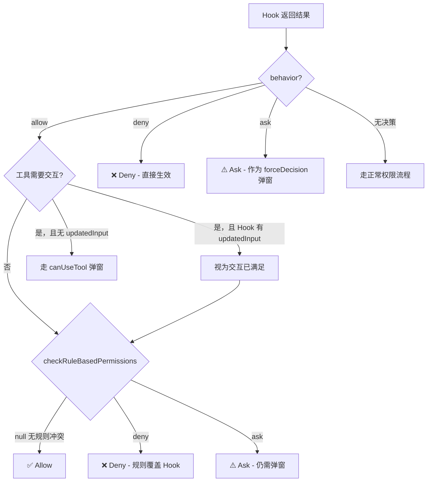
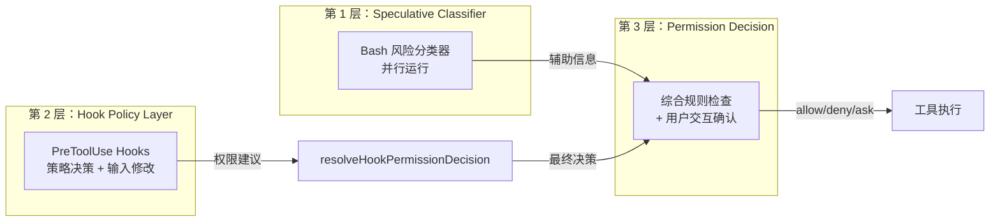
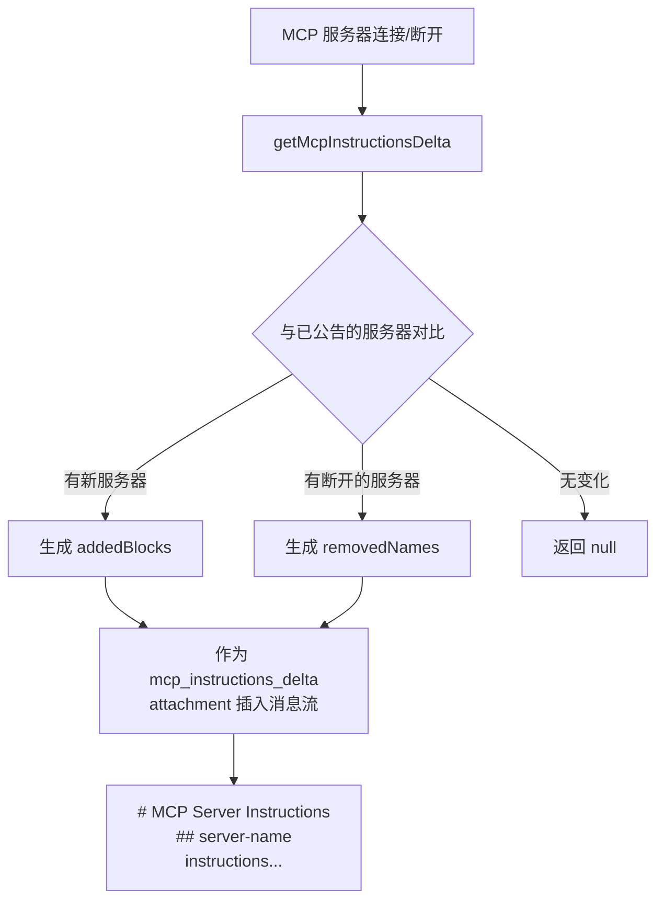
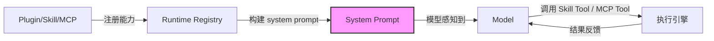

# Claude Code 源码架构深度解析 学习笔记：第 5-6 章

> 来源：《Claude Code 源码架构深度解析 V2.1》(Xiao Tan, 2026.04.04)

---

## 第 5 章：安全层——权限、Hook 和三层防护网

### 5.1 权限系统概览

Claude Code 的权限系统不是一个简单的 ACL 列表，而是分布在 `src/utils/permissions/` 下的 24 个文件组成的完整权限模型。这套系统需要在"让模型自由使用工具"和"绝不让模型搞出灾难"之间走钢丝。

从源码的类型定义可以看到，权限系统围绕四个核心概念构建：

| 核心概念 | 对应文件 | 职责 |
|---------|---------|------|
| PermissionMode | `PermissionMode.ts` → `types/permissions.ts` | 定义全局权限模式：default / plan / acceptEdits / bypassPermissions / dontAsk / auto |
| PermissionRule | `PermissionRule.ts` → `types/permissions.ts` | 定义单条规则：toolName + ruleContent + source + behavior(allow/deny/ask) |
| PermissionResult | `PermissionResult.ts` → `types/permissions.ts` | 决策结果，包含 behavior 和 decisionReason |
| PermissionBehavior | `types/permissions.ts` | 三种行为枚举：`allow` / `deny` / `ask` |

#### 权限模式的层次设计

从源码中 `PERMISSION_MODE_CONFIG` 可以看到模式的设计意图：

```typescript
// src/utils/permissions/PermissionMode.ts
const PERMISSION_MODE_CONFIG: Partial<Record<PermissionMode, PermissionModeConfig>> = {
  default: { title: 'Default', symbol: '', color: 'text', external: 'default' },
  plan: { title: 'Plan Mode', symbol: PAUSE_ICON, color: 'planMode', external: 'plan' },
  acceptEdits: { title: 'Accept edits', symbol: '⏵⏵', color: 'autoAccept', external: 'acceptEdits' },
  bypassPermissions: { title: 'Bypass Permissions', symbol: '⏵⏵', color: 'error', external: 'bypassPermissions' },
  dontAsk: { title: "Don't Ask", symbol: '⏵⏵', color: 'error', external: 'dontAsk' },
  // auto 模式仅内部(ant)构建可用，通过 feature flag 控制
  ...(feature('TRANSCRIPT_CLASSIFIER') ? { auto: { ... } } : {}),
}
```

注意 `auto` 模式在外部构建中根本不存在——它通过 `feature('TRANSCRIPT_CLASSIFIER')` 这个编译时 feature flag 控制，在外部构建时会被 Bun 的 dead code elimination 彻底移除。这意味着外部用户永远看不到这个模式的任何代码。

> **关键洞察：** 权限模式不是运行时配置那么简单。Claude Code 把最敏感的 `auto` 模式做成了编译时特性，从根本上杜绝了外部用户通过配置或 hack 启用它的可能性。这种"安全要在编译时就确定"的思路，比运行时检查更加彻底。

#### 权限规则的来源和优先级

从 `permissions.ts` 中可以看到规则来源的定义：

```typescript
// src/utils/permissions/permissions.ts
const PERMISSION_RULE_SOURCES = [
  ...SETTING_SOURCES,  // userSettings, projectSettings, localSettings, flagSettings, policySettings
  'cliArg',            // 命令行参数
  'command',           // slash command 携带
  'session',           // 会话级规则
] as const satisfies readonly PermissionRuleSource[]
```

规则收集使用 `getAllowRules()` 函数，按来源遍历所有规则并扁平化为统一列表。每条规则都携带自己的 `source` 标记，这在后续决策时可以用于解释"为什么这条命令被允许/拒绝"。

### 5.2 Bash 命令的风险分类

#### 危险命令模式匹配

`dangerousPatterns.ts` 定义了两个关键列表，用于识别可能导致任意代码执行的 Bash 命令前缀：

```typescript
// src/utils/permissions/dangerousPatterns.ts
export const CROSS_PLATFORM_CODE_EXEC = [
  'python', 'python3', 'node', 'deno', 'tsx', 'ruby', 'perl', 'php', 'lua',
  'npx', 'bunx', 'npm run', 'yarn run', 'pnpm run', 'bun run',
  'bash', 'sh', 'ssh',
] as const

export const DANGEROUS_BASH_PATTERNS: readonly string[] = [
  ...CROSS_PLATFORM_CODE_EXEC,
  'zsh', 'fish', 'eval', 'exec', 'env', 'xargs', 'sudo',
  // Anthropic 内部还有额外的模式：gh, curl, wget, git, kubectl, aws...
  ...(process.env.USER_TYPE === 'ant' ? ['fa run', 'coo', 'gh', 'curl', ...] : []),
]
```

这个设计揭示了两个工程决策：

1. **跨平台一致性**：`CROSS_PLATFORM_CODE_EXEC` 被独立抽出来，在 Bash 和 PowerShell 的危险模式列表之间共享，防止两个列表的维护漂移（drift）。
2. **内外有别**：Anthropic 内部构建额外阻断了 `gh`、`curl`、`git` 等命令的宽泛 allow 规则。这些不是"对所有人都危险"的判断，而是基于内部沙箱数据的经验性风险评估。源码注释明确说了：*"These stay ant-only... not a universal 'this tool is unsafe' judgment."*

这些模式被 `permissionSetup.ts` 中的 `isDangerousBashPermission` 用来在进入 auto 模式时剥离过于宽泛的 allow 规则——比如用户配了 `Bash(python:*)` 这样的规则，在 auto 模式下会被静默移除，因为它等于让模型可以执行任意 Python 代码。

#### Shell 规则匹配系统

`shellRuleMatching.ts` 实现了三种规则匹配方式：

| 匹配类型 | 格式示例 | 语义 |
|---------|---------|------|
| exact | `git status` | 精确匹配整条命令 |
| prefix (legacy) | `npm:*` | 匹配以 `npm` 开头的命令（向后兼容的 `:*` 语法） |
| wildcard | `git * --no-verify` | 通配符匹配，`*` 匹配任意字符序列 |

通配符匹配的实现特别值得注意：

```typescript
// src/utils/permissions/shellRuleMatching.ts
export function matchWildcardPattern(
  pattern: string, command: string, caseInsensitive = false
): boolean {
  // 1. 处理转义序列 \* 和 \\
  // 2. 转义正则特殊字符
  // 3. 将 * 转换为 .* 
  // 4. 特殊处理：当模式以 ' *' 结尾且只有一个通配符时，
  //    使空格和参数变为可选，让 'git *' 同时匹配 'git add' 和裸 'git'
  const flags = 's' + (caseInsensitive ? 'i' : '')
  const regex = new RegExp(`^${regexPattern}$`, flags)
  return regex.test(command)
}
```

`'s'`（dotAll）flag 的使用让 `.` 可以匹配换行符。这是刻意的：经过 `splitCommand_DEPRECATED` 处理后的命令可能包含 heredoc 换行内容。

#### 路径校验系统

`pathValidation.ts` 是文件操作安全的最后一道防线。它的 `validatePath()` 函数在允许任何文件路径操作前，会执行一系列安全检查：

```
validatePath(path)
  ├── 去除引号
  ├── 展开 ~ 为 $HOME
  ├── 🛡 阻断 UNC 路径（防止凭据泄露）
  ├── 🛡 阻断 ~user, ~+, ~- 变体（防止 TOCTOU）
  ├── 🛡 阻断含 $, %, = 的路径（防止 shell 变量展开）
  ├── 🛡 阻断写操作中的 glob 模式
  ├── 解析绝对路径 + 符号链接解析
  └── isPathAllowed() 综合检查
```

`isPathAllowed()` 内部的检查层次同样精心设计：

1. **Deny 规则优先**：先查 deny 规则，直接拒绝
2. **内部可编辑路径**：检查 plan files、scratchpad 等内部路径（必须在 safety check 之前，因为这些路径在 `~/.claude/` 下，而该目录本身是"危险目录"）
3. **安全性验证**：`checkPathSafetyForAutoEdit`——检查 Windows 模式、Claude 配置文件、危险文件（必须在检查工作目录之前，防止 acceptEdits 模式的绕过）
4. **工作目录检查**：路径在允许的工作目录内？读操作直接放行；写操作需要 acceptEdits 模式
5. **沙箱写允许列表**：当沙箱启用时，检查路径是否在沙箱的写入白名单中
6. **Allow 规则检查**：最后才检查 allow 规则

> **关键洞察：** 这个检查顺序不是随意的。源码注释中反复强调步骤间的依赖关系——比如"This MUST come before checkPathSafetyForAutoEdit since .claude is a dangerous directory"。每一步的位置都是在实际安全事件后校准的。工程师不是在写代码，而是在维护一份不断从错误中学习的安全策略。

### 5.3 Hook 系统：不只是事件钩子

Hook 系统是整个安全层最有表达力的部分。它定义在 `src/utils/hooks.ts`（3400+ 行）和 `src/services/tools/toolHooks.ts` 中，支持多个生命周期时点：

| Hook 事件 | 触发时机 | 核心能力 |
|-----------|---------|---------|
| PreToolUse | 工具执行前 | 权限决策、修改输入、阻断流程、补充上下文 |
| PostToolUse | 工具执行成功后 | 修改 MCP 工具输出、追加消息、注入上下文、阻止后续流程 |
| PostToolUseFailure | 工具执行失败后 | 追加消息、注入上下文、阻断 |
| PermissionDenied | 权限被拒绝时 | 通知/记录 |
| Notification | 通知事件 | 外部通知 |
| SessionStart / SessionEnd | 会话生命周期 | 初始化/清理 |
| Stop / StopFailure | 停止事件 | 优雅终止 |
| SubagentStart / SubagentStop | 子 agent 生命周期 | agent 管理 |
| PreCompact / PostCompact | 上下文压缩前后 | 压缩策略 |
| ... | ... | ... |

#### Pre-hook 的丰富表达力

从 `runPreToolUseHooks` 的实现可以看到，Pre-hook 能产生的结果类型远不止"允许/拒绝"：

```typescript
// src/services/tools/toolHooks.ts - runPreToolUseHooks 的 yield 类型
| { type: 'message'; message: ... }                    // 进度消息
| { type: 'hookPermissionResult'; hookPermissionResult: PermissionResult }  // 权限决策
| { type: 'hookUpdatedInput'; updatedInput: Record<string, unknown> }  // 修改输入
| { type: 'preventContinuation'; shouldPreventContinuation: boolean }  // 阻止后续
| { type: 'stopReason'; stopReason: string }           // 停止原因
| { type: 'additionalContext'; message: ... }          // 补充上下文
| { type: 'stop' }                                     // 立即停止
```

这里有个设计细节值得注意：`hookUpdatedInput` 可以独立于 `hookPermissionResult` 产出。这意味着 Hook 可以在不做权限决策的情况下修改工具输入——比如一个 Hook 把文件路径从相对路径规范化为绝对路径，同时让正常的权限流程继续进行。

#### Post-hook 的输出修改能力

Post-hook 不仅能记日志，还能修改 MCP 工具的输出：

```typescript
// src/services/tools/toolHooks.ts - runPostToolUseHooks
if (result.updatedMCPToolOutput && isMcpTool(tool)) {
  toolOutput = result.updatedMCPToolOutput as Output
  yield { updatedMCPToolOutput: toolOutput }
}
```

注意 `isMcpTool(tool)` 这个守卫：输出修改仅对 MCP 工具生效，内置工具的输出不可被 Hook 篡改。这是一个精确的信任边界——内置工具是 Claude Code 自己控制的，不需要外部 Hook 来修改其输出；而 MCP 工具来自外部，允许 Hook 对其输出做后处理是合理的。

### 5.4 resolveHookPermissionDecision：安全的关键粘合层

`toolHooks.ts` 中的 `resolveHookPermissionDecision()` 函数是整个安全模型中最关键的粘合层。它的注释开头就明确声明了设计不变式（invariant）：

> *"Encapsulates the invariant that hook 'allow' does NOT bypass settings.json deny/ask rules."*

让我们用代码逐步拆解这个函数的决策逻辑：

```typescript
export async function resolveHookPermissionDecision(
  hookPermissionResult, tool, input, toolUseContext, canUseTool, assistantMessage, toolUseID
): Promise<{ decision: PermissionDecision; input: Record<string, unknown> }> {
  
  if (hookPermissionResult?.behavior === 'allow') {
    const hookInput = hookPermissionResult.updatedInput ?? input
    // 关键：Hook 提供了 updatedInput 的交互式工具 → 视为"已完成交互"
    const interactionSatisfied = requiresInteraction && hookPermissionResult.updatedInput !== undefined

    // 即使 Hook 说 allow，如果工具需要交互且 Hook 没满足 → 仍走 canUseTool
    if ((requiresInteraction && !interactionSatisfied) || requireCanUseTool) {
      return { decision: await canUseTool(...), input: hookInput }
    }

    // Hook allow 不能绕过 settings deny/ask 规则
    const ruleCheck = await checkRuleBasedPermissions(tool, hookInput, toolUseContext)
    if (ruleCheck === null) return { decision: hookPermissionResult, input: hookInput }  // 无规则冲突，放行
    if (ruleCheck.behavior === 'deny') return { decision: ruleCheck, input: hookInput }  // deny 规则覆盖
    // ask 规则 → 即使 Hook 批准了，仍要弹窗
    return { decision: await canUseTool(...), input: hookInput }
  }

  if (hookPermissionResult?.behavior === 'deny') {
    return { decision: hookPermissionResult, input }  // Hook deny 直接生效
  }

  // Hook 说 ask 或没有决策 → 正常权限流程，但可能带 forceDecision
  const forceDecision = hookPermissionResult?.behavior === 'ask' ? hookPermissionResult : undefined
  return { decision: await canUseTool(..., forceDecision), input: askInput }
}
```

用决策矩阵来表达更清晰：

| Hook 决策 | Settings 规则 | 最终结果 | 原因 |
|-----------|-------------|---------|------|
| allow | 无规则 | **allow** | Hook 放行，无冲突 |
| allow | deny | **deny** | deny 规则覆盖 Hook |
| allow | ask | **ask (弹窗)** | ask 规则强制交互 |
| allow（带 updatedInput） | 工具需要交互 | **allow** | Hook 满足了交互需求 |
| allow（无 updatedInput） | 工具需要交互 | **走 canUseTool** | 交互需求未满足 |
| deny | 任何 | **deny** | Hook deny 直接生效 |
| ask | 任何 | **弹窗（带 Hook 消息）** | Hook ask 作为 forceDecision |
| 无决策 | 任何 | **正常流程** | 走标准权限检查 |



> **关键洞察：** 这个设计的核心原则是 **"Hook 是增量策略，不是特权覆盖"**。即使一个 Hook 脚本里有 bug，或者被恶意构造了一个总是返回 `allow` 的 Hook，它也无法让一个被 settings.json 中 deny 掉的操作悄悄通过。Hook 能做的只是在规则没有覆盖的地方施加额外策略，或者在已有 allow 的基础上追加限制。这种"安全层只能收紧、不能放松"的设计，是成熟安全系统的标志。

### 5.5 三层防护网

把权限系统、Hook 系统和工具执行 pipeline 放在一起看，Claude Code 有三层互相独立的防护：



| 防护层 | 模块 | 职责 | 限制 |
|-------|------|------|------|
| Speculative Classifier | `bashClassifier.ts` + `yoloClassifier.ts` | 对 Bash 命令做风险预判，与 Hook 并行运行 | 结果仅作辅助信息，不能绕过 Hook 和规则 |
| Hook Policy Layer | `hooks.ts` + `toolHooks.ts` | PreToolUse hooks 做权限决策、修改输入、阻断流程 | allow 不能覆盖 settings deny/ask |
| Permission Decision | `permissions.ts` + `checkRuleBasedPermissions` | 综合所有规则和用户交互做最终决策 | deny 规则具有最高优先级 |

三层的设计原则是**互相配合但互不绕过**：

- Speculative classifier 的预判结果只是给权限决策层的参考信息，它不能跳过 Hook 层
- Hook 的 allow 不能跳过 settings deny——`resolveHookPermissionDecision` 确保了这一点
- 每层都有自己的职责边界，不会因为上层"说了 OK"就放弃自己的检查

#### checkRuleBasedPermissions 的内部层次

权限决策层本身也不是单一检查，它在 `permissions.ts` 中展开为多个步骤：

```typescript
export async function checkRuleBasedPermissions(tool, input, context) {
  // 1a. 整个工具被 deny 规则禁用？
  const denyRule = getDenyRuleForTool(context, tool)
  if (denyRule) return { behavior: 'deny', ... }

  // 1b. 整个工具有 ask 规则？
  const askRule = getAskRuleForTool(context, tool)
  if (askRule) {
    // 特例：如果沙箱启用且允许自动放行沙箱内的 Bash → 跳过
    const canSandboxAutoAllow = tool.name === BASH_TOOL_NAME 
      && SandboxManager.isSandboxingEnabled() 
      && shouldUseSandbox(input)
    if (!canSandboxAutoAllow) return { behavior: 'ask', ... }
  }

  // 1c. 工具自身的 checkPermissions（如 Bash 的子命令规则检查）
  const toolPermissionResult = await tool.checkPermissions(parsedInput, context)

  // 1d. 工具实现返回 deny → 直接拒绝
  if (toolPermissionResult?.behavior === 'deny') { ... }
  // ...
}
```

> **关键洞察：** 注意沙箱的特殊逻辑——当 Bash 命令在沙箱内运行时，即使有 ask 规则也可以自动放行。这是因为沙箱本身已经提供了隔离保障，再弹窗询问用户是多余的摩擦。这种"安全机制之间可以互相信任"的设计，避免了安全措施的叠加导致可用性下降。

---

## 第 6 章：生态——Skill、Plugin、MCP

### 6.1 Skill：带元数据的 workflow package

Skill 是 Claude Code 最轻量的扩展单元。`src/skills/` 目录下的实现分为两部分：

- `bundled/`：随 CLI 一起编译发布的内置 skill（约 18 个）
- `loadSkillsDir.ts`：从磁盘加载用户自定义 skill 的加载器

#### 内置 Skill 一览

从 `bundled/index.ts` 的 `initBundledSkills()` 函数可以看到完整列表：

| Skill | 描述 | 可用性 |
|-------|------|-------|
| update-config | 配置 settings.json | 所有用户 |
| keybindings | 键位绑定定制 | 所有用户 |
| verify | 验证代码变更是否正确 | ANT-ONLY |
| debug | 调试当前会话 | 所有用户 |
| lorem-ipsum | 生成测试数据 | 所有用户 |
| skillify | 将工作流转化为 skill | 所有用户 |
| remember | 保存长期记忆 | 所有用户 |
| simplify | 代码审查和清理 | 所有用户 |
| batch | 批量操作 | 所有用户 |
| stuck | 诊断卡死的会话 | ANT-ONLY |
| loop | 定时循环执行 | 需要 AGENT_TRIGGERS feature flag |
| schedule | 远程定时 agent | 需要 AGENT_TRIGGERS_REMOTE feature flag |
| claude-api | Claude API 开发辅助 | 需要 BUILDING_CLAUDE_APPS feature flag |
| claude-in-chrome | Chrome 集成 | 需要特定条件 |

#### Skill 的注册机制

每个内置 Skill 通过 `registerBundledSkill()` 注册：

```typescript
// src/skills/bundledSkills.ts
export type BundledSkillDefinition = {
  name: string
  description: string
  aliases?: string[]
  whenToUse?: string           // 告诉模型什么时候应该使用这个 skill
  allowedTools?: string[]      // 限制 skill 执行时可以使用的工具
  model?: string               // 指定使用的模型
  disableModelInvocation?: boolean  // 禁止模型主动调用
  userInvocable?: boolean      // 用户是否可以手动调用
  hooks?: HooksSettings        // skill 自带的 hooks
  context?: 'inline' | 'fork'  // 执行上下文
  agent?: string               // 关联的 agent
  files?: Record<string, string>  // 需要提取到磁盘的参考文件
  getPromptForCommand: (args: string, context: ToolUseContext) => Promise<ContentBlockParam[]>
}
```

注册后的 Skill 被转化为 `Command` 对象存储在内部注册表中。这个 `Command` 类型同时承载了从不同来源加载的命令——无论是内置 skill、磁盘 skill 还是 MCP skill，最终都统一为同一种 `Command` 结构。

#### 一个典型 Skill 的解剖：simplify

`simplify` skill 是理解 Skill 设计的好例子：

```typescript
// src/skills/bundled/simplify.ts
const SIMPLIFY_PROMPT = `# Simplify: Code Review and Cleanup

Review all changed files for reuse, quality, and efficiency. Fix any issues found.

## Phase 1: Identify Changes
Run \`git diff\` ... to see what changed.

## Phase 2: Launch Three Review Agents in Parallel
Use the ${AGENT_TOOL_NAME} tool to launch all three agents concurrently...

### Agent 1: Code Reuse Review ...
### Agent 2: Code Quality Review ...
### Agent 3: Efficiency Review ...

## Phase 3: Fix Issues
Wait for all three agents to complete. Aggregate their findings and fix each issue directly.
`
```

这揭示了 Skill 的本质：**它不是普通的 prompt template，而是一个完整的工作流程编排方案**。`simplify` skill 指示模型并行启动三个 Agent Tool 子 agent，各自做不同维度的代码审查，然后汇总修复。Skill 是 Claude Code 用自然语言编写的"工作流引擎"。

#### 磁盘 Skill 的 Frontmatter 系统

用户自定义 Skill 以 markdown 文件形式存在，通过 frontmatter 声明元数据。从 `parseSkillFrontmatterFields()` 可以看到支持的字段：

```yaml
---
name: my-skill                    # 显示名称
description: 做某件事的 skill      # 描述
when_to_use: 当用户需要...时使用   # 模型判断何时调用的提示
allowed-tools: [Read, Grep, Bash] # 限制可用工具
model: claude-sonnet-4-20250514     # 指定模型
effort: high                      # 推理努力级别
disable-model-invocation: false   # 是否禁止模型主动调用
user-invocable: true              # 用户是否可手动调用
context: fork                     # 执行上下文（fork = 新 agent 线程）
agent: test-runner                # 关联的 agent
hooks:                            # skill 自带的 hooks
  PreToolUse:
    - matcher: Bash
      command: ...
paths: src/frontend/**            # 仅在匹配路径下激活
arguments: [file, message]        # 命令参数名
argument-hint: "[file] [message]" # 参数提示
shell:                            # Shell 配置
  type: bash
---

# Skill 正文（prompt 内容）
```

> **关键洞察：** Skill 的 frontmatter 系统实现了一个关键的架构目标——**声明式能力描述**。模型不需要猜测 skill 能做什么、该在什么时候用、可以用哪些工具。这些元数据直接告诉模型，大大减少了模型的决策负担和出错概率。

#### Skill 文件的安全提取

对于携带 `files` 的 bundled skill，系统会在首次调用时将文件提取到磁盘：

```typescript
// src/skills/bundledSkills.ts
async function safeWriteFile(p: string, content: string): Promise<void> {
  // O_NOFOLLOW | O_EXCL：不跟随符号链接 + 文件必须不存在
  const fh = await open(p, SAFE_WRITE_FLAGS, 0o600)
  try {
    await fh.writeFile(content, 'utf8')
  } finally {
    await fh.close()
  }
}
```

`O_NOFOLLOW | O_EXCL` 的组合防止了 symlink 攻击：攻击者不能预先创建一个指向敏感位置的符号链接来诱使 skill 系统覆盖任意文件。如果文件已存在（`EEXIST`），系统故意不 unlink + retry，因为 `unlink()` 本身也会跟随中间符号链接。

### 6.2 Plugin：模型行为层面的扩展

Plugin 是 Skill 的超集。`src/utils/plugins/` 下的 44 个文件构成了完整的插件生态系统。

#### Plugin 的目录结构

从 `pluginLoader.ts` 的注释可以看到标准结构：

```
my-plugin/
├── plugin.json          # 清单文件（可选但推荐）
├── .mcp.json            # MCP 服务器配置
├── commands/            # 自定义 slash 命令（markdown 文件）
│   ├── build.md
│   └── deploy.md
├── skills/              # Skill 目录
├── agents/              # 自定义 AI agent（markdown 文件）
│   └── test-runner.md
├── hooks/               # Hook 配置
│   └── hooks.json
└── output-styles/       # 输出样式定义
```

#### Plugin Manifest Schema

`schemas.ts` 定义了完整的 `PluginManifestSchema`，它能声明的能力远超普通 CLI 插件：

| Manifest 字段 | 类型 | 作用 |
|--------------|------|------|
| `name` | string | 唯一标识符，用于命名空间 |
| `version` | string | 语义化版本 |
| `description` | string | 用户可见描述 |
| `author` | object | 作者信息 |
| `dependencies` | array | 依赖的其他 plugin |
| `commands` | path/array/object | 额外的 slash 命令 |
| `agents` | path/array | 额外的 agent 定义 |
| `skills` | path/array | 额外的 skill 目录 |
| `hooks` | path/object/array | Hook 配置（inline 或文件引用） |
| `mcpServers` | path/object/array | MCP 服务器配置 |
| `outputStyles` | path/array | 输出样式 |
| `lsp` | object | LSP 服务器配置 |

Plugin Hook 的定义支持多种格式：

```typescript
// src/utils/plugins/schemas.ts
const PluginManifestHooksSchema = lazySchema(() =>
  z.object({
    hooks: z.union([
      RelativeJSONPath(),           // 指向外部 JSON 文件
      z.lazy(() => HooksSchema()),  // 内联 Hook 配置
      z.array(z.union([             // 混合使用
        RelativeJSONPath(),
        z.lazy(() => HooksSchema()),
      ])),
    ]),
  }),
)
```

#### Plugin 安全：Marketplace 防冒充

Plugin 系统特别关注防止第三方冒充官方 marketplace。`schemas.ts` 中有一套多层防护：

```typescript
// 1. 保留名称列表
export const ALLOWED_OFFICIAL_MARKETPLACE_NAMES = new Set([
  'claude-code-marketplace', 'anthropic-marketplace', 'agent-skills', ...
])

// 2. 名称模式阻断（正则匹配 "official" + "anthropic/claude" 的各种组合）
export const BLOCKED_OFFICIAL_NAME_PATTERN = /(?:official[^a-z0-9]*(anthropic|claude)|...)/i

// 3. 非 ASCII 字符检测（防止同形字攻击，如用西里尔字母 'а' 冒充拉丁字母 'a'）
const NON_ASCII_PATTERN = /[^\u0020-\u007E]/

// 4. 源码仓库验证——保留名称必须来自 anthropics/ GitHub 组织
export function validateOfficialNameSource(name, source): string | null {
  if (!ALLOWED_OFFICIAL_MARKETPLACE_NAMES.has(name.toLowerCase())) return null
  if (source.source === 'github') {
    if (!source.repo.toLowerCase().startsWith('anthropics/')) {
      return `The name '${name}' is reserved...`
    }
  }
  // ...
}
```

> **关键洞察：** 这套防冒充系统考虑了三种攻击向量：直接使用保留名称、使用模式相似的名称（如 "claude-official-new"）、使用 Unicode 同形字。而且它不仅检查名称本身，还验证了代码来源——即使攻击者注册了同名 marketplace，如果不是来自 `anthropics/` 组织，也会被拒绝。

#### Plugin 的运行时变量替换

Plugin 支持在 Hook 命令和 MCP 配置中使用变量：

| 变量 | 展开为 |
|------|-------|
| `${CLAUDE_PLUGIN_ROOT}` | 插件安装根目录 |
| `${CLAUDE_PLUGIN_DATA}` | 插件数据目录 |
| `${CLAUDE_PROJECT_ROOT}` | 当前项目根目录 |

这些变量在 `pluginOptionsStorage.ts` 中的 `substitutePluginVariables()` 和 `substituteUserConfigVariables()` 函数中展开，让 Plugin 可以引用自身的文件而不用硬编码路径。

### 6.3 MCP：工具桥 + 行为说明注入

MCP（Model Context Protocol）在 Claude Code 中不仅仅是"给模型增加新工具"那么简单。从 `src/services/mcp/` 下的 22 个文件可以看到，它同时承担了工具注册和行为指导注入两个职责。

#### MCP 服务器的配置类型

从 `types.ts` 可以看到支持的传输方式：

```typescript
export const TransportSchema = lazySchema(() =>
  z.enum(['stdio', 'sse', 'sse-ide', 'http', 'ws', 'sdk']),
)
```

| 传输方式 | 场景 |
|---------|------|
| stdio | 本地进程，通过 stdin/stdout 通信 |
| sse | Server-Sent Events，远程服务器 |
| sse-ide | IDE 扩展专用的 SSE |
| http | Streamable HTTP（新协议） |
| ws | WebSocket |
| sdk | SDK 内嵌传输 |

每种传输方式都有对应的配置 Schema，比如 stdio 需要 `command` + `args` + `env`，而 http 需要 `url` + `headers` + 可选的 `oauth` 配置。

#### MCP Instructions 的注入机制

这是 MCP 最精妙的部分。当 MCP 服务器连接后，它不仅提供工具，还可以提供使用说明（instructions）。从 `client.ts` 可以看到：

```typescript
// src/services/mcp/client.ts
const rawInstructions = client.getInstructions()
let instructions = rawInstructions
// 截断过长的 instructions（上限 MAX_MCP_DESCRIPTION_LENGTH）
if (rawInstructions && rawInstructions.length > MAX_MCP_DESCRIPTION_LENGTH) {
  instructions = rawInstructions.slice(0, MAX_MCP_DESCRIPTION_LENGTH) + '... [truncated]'
}
```

这些 instructions 通过 `prompts.ts` 被拼入 system prompt：

```typescript
// src/constants/prompts.ts
const instructionBlocks = clientsWithInstructions
  .map(client => `## ${client.name}\n${client.instructions}`)
  .join('\n\n')

return `# MCP Server Instructions

The following MCP servers have provided instructions for how to use their tools and resources:

${instructionBlocks}`
```

#### 增量式 Instructions 更新

`mcpInstructionsDelta.ts` 实现了一个增量更新机制。MCP 服务器可能在会话中途连接或断开，系统需要及时通知模型：



新连接的服务器的 instructions 通过 `mcp_instructions_delta` 类型的 attachment 消息注入对话。断开的服务器也会生成通知："The following MCP servers have disconnected. Their instructions above no longer apply."

系统还支持 **client-side instructions**——由客户端为服务器附加的额外说明，服务器本身可能不知道这些信息。比如 `claude-in-chrome` 服务器连接时，客户端可以注入浏览器上下文相关的使用说明。

> **关键洞察：** MCP 的 instructions 注入机制回答了一个深层问题——**工具和使用工具的知识必须一起提供**。很多系统给模型注册了工具但不告诉模型怎么用，或者工具文档和工具实现是分离的。MCP 让"工具能力"和"使用指南"在同一个协议中传递，确保模型在获得新能力的同时也获得了使用这些能力的知识。

### 6.4 Plugin 到 MCP 的集成

Plugin 可以内嵌 MCP 服务器配置。`mcpPluginIntegration.ts` 负责从 Plugin 中提取 MCP 配置并注册到系统中。Plugin manifest 中的 MCP 配置支持多种形式：

- 直接在 `plugin.json` 中内联配置
- 引用 `.mcp.json` 文件
- 引用 `.mcpb` / `.dxt` 打包文件（DXT 是 Desktop eXTension 格式）
- 引用远程 URL 的 `.mcpb` 文件

这种灵活性让 Plugin 可以按需选择最合适的 MCP 分发方式：简单的服务器直接内联配置即可，复杂的可以打包成 DXT 格式发布。

### 6.5 生态的关键：模型"感知到"自己的能力

这一节是整个第 6 章最重要的洞察。很多平台也有插件系统、工具市场，但模型本身对这些扩展一无所知。Claude Code 通过多个通道让模型感知到自己的当前能力：

| 感知通道 | 机制 | 作用 |
|---------|------|------|
| Skills 列表 | system-reminder 中的 available skills | 模型知道可以调用哪些 skill |
| Agent 列表 | system-reminder 中的 agent 定义 | 模型知道可以派出哪些子 agent |
| MCP Instructions | system prompt 中注入的服务器说明 | 模型知道新工具该怎么用 |
| Deferred Tools | ToolSearch 工具 + tool delta 通知 | 模型知道有延迟加载的工具可用 |
| Session Guidance | 会话级的上下文指引 | 模型知道当前会话的特殊约束 |
| Plugin Commands | slash command 列表 | 模型知道有哪些自定义命令 |
| `whenToUse` 字段 | Skill frontmatter | 模型知道什么场景该触发什么 skill |

这就是为什么源码中的 system prompt 构建逻辑如此复杂——它不仅要告诉模型"你能做什么"，还要告诉模型"你刚刚获得了什么新能力"（增量通知）和"你失去了什么能力"（服务器断开通知）。

从 `messages.ts` 中可以看到这种增量通知的实现：

```typescript
// MCP 服务器连接 → 注入 instructions
`# MCP Server Instructions\n\nThe following MCP servers have provided instructions...`

// MCP 服务器断开 → 通知失效
`The following MCP servers have disconnected. Their instructions above no longer apply:...`
```

**这形成了一个关键的设计模式：能力-感知闭环。**



> **关键洞察：** "生态"不只是"有插件可以装"。真正的生态需要模型能感知到自己的能力边界——知道什么能做、什么不能做、什么刚变得可以做。Claude Code 通过在 system prompt 中维护一个动态更新的"能力清单"，让模型的自我认知与实际可用工具保持同步。没有这层感知，再多的插件也只是摆设。

### 6.6 本章总结

Skill、Plugin、MCP 三者构成了一个从轻到重的扩展谱系：

| 维度 | Skill | Plugin | MCP |
|------|-------|--------|-----|
| 最小形态 | 一个 markdown 文件 | 一个目录 + plugin.json | 一个进程/服务 |
| 能力范围 | prompt + 元数据 | 命令 + agent + hooks + MCP + 样式 | 工具 + 资源 + instructions |
| 影响模型行为 | 通过 whenToUse 引导 | 通过 hooks 修改权限规则 | 通过 instructions 注入知识 |
| 分发方式 | 文件复制 / Git | Marketplace / Git | 独立进程 / Docker |
| 安全边界 | 受 allowedTools 限制 | 受 Plugin policy + blocklist 限制 | 受 MCP 权限 + Hook 限制 |
| 运行时状态 | 无状态（每次调用重新加载 prompt） | 有状态（hooks、MCP 连接持久化） | 有状态（保持连接、维护资源） |

三者不是互相替代的关系，而是互补的层次：

- **Skill** 适合定义"做一件事的流程"——它本质上是一个带元数据的 prompt
- **Plugin** 适合定义"一组相关的能力增强"——它能改变模型的行为规则
- **MCP** 适合定义"与外部系统的连接"——它提供工具和使用工具的知识

这三层加在一起，让 Claude Code 从一个"能用的 CLI 工具"变成了一个"可以被深度定制的 agent 平台"。
