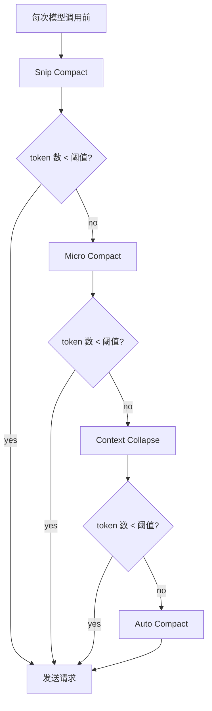
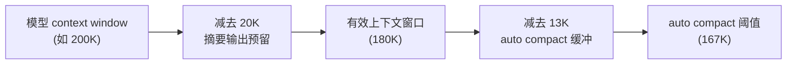
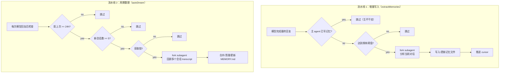
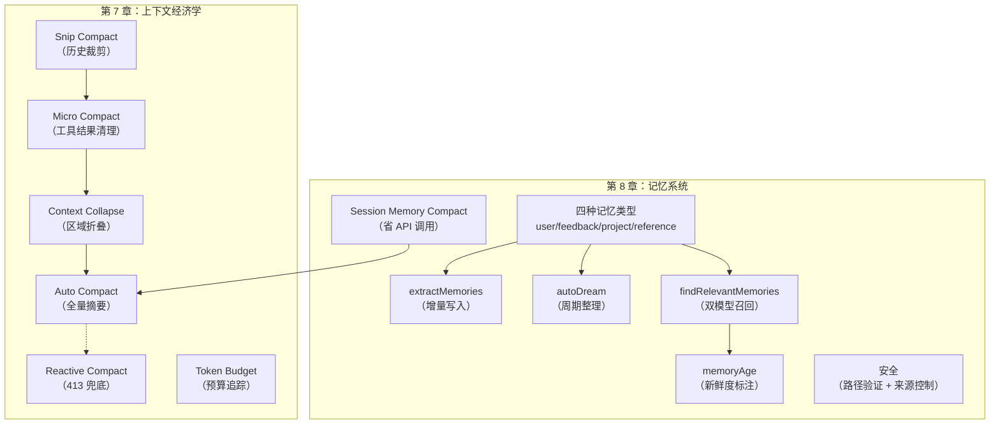

# Claude Code 源码架构深度解析 学习笔记：第 7-8 章

> 来源：《Claude Code 源码架构深度解析 V2.1》(Xiao Tan, 2026.04.04)

---

## 第 7 章：上下文经济学——Token 就是预算

### 7.1 四道压缩机制：从轻到重的渐进式上下文管理

Claude Code 在每次调用模型之前，会对消息列表执行一套渐进式压缩流水线。这套机制不是一上来就做全量压缩，而是**先试轻量操作，只在轻量不够时才升级到重量级操作**。这个设计哲学和操作系统的内存回收策略异曲同工：先回收缓存页，再 swap，最后 OOM kill。

四道机制按成本从低到高排列：

| 机制 | 级别 | 做什么 | 成本 |
|------|------|--------|------|
| Snip Compact | 最轻 | 裁剪历史消息中过长的部分 | 纯本地操作，无 API 调用 |
| Micro Compact | 轻量 | 基于 tool_use_id 清除旧工具结果 | 本地操作或 cache editing API |
| Context Collapse | 中等 | 把不活跃的上下文区域折叠成摘要 | 可能需要 API 调用 |
| Auto Compact | 最重 | 全量摘要压缩，替换整个对话历史 | 一次完整的 API 调用 |



#### Micro Compact 的两种路径

源码中 `microCompact.ts` 的实现特别有意思。Micro Compact 有两条路径：**时间触发路径**和**缓存编辑路径**，前者是传统方式，后者是利用 API 的 cache editing 能力做到的更精细的操作。

时间触发路径的逻辑是：检测上一条 assistant 消息到当前的时间间隔，如果超过阈值（说明 API 侧的 prompt cache 已经过期），就直接清除旧的 tool result 内容——反正缓存已经冷了，清除不会浪费缓存。

```typescript
// 时间触发：cache 冷了，直接内容清除
export function evaluateTimeBasedTrigger(
  messages: Message[],
  querySource: QuerySource | undefined,
): { gapMinutes: number; config: TimeBasedMCConfig } | null {
  const config = getTimeBasedMCConfig()
  if (!config.enabled || !querySource || !isMainThreadSource(querySource)) {
    return null
  }
  const lastAssistant = messages.findLast(m => m.type === 'assistant')
  if (!lastAssistant) return null
  const gapMinutes =
    (Date.now() - new Date(lastAssistant.timestamp).getTime()) / 60_000
  if (!Number.isFinite(gapMinutes) || gapMinutes < config.gapThresholdMinutes) {
    return null
  }
  return { gapMinutes, config }
}
```

缓存编辑路径则不同：它不修改本地消息内容，而是通过 API 的 `cache_edits` 能力，告诉 API "这些 tool result 可以从缓存中删掉"。这样既省了 token，又不破坏缓存前缀——因为消息本身没变，只是通知 API 侧做增量删除。

> **关键洞察：** 时间触发和缓存编辑是互斥的。时间触发在 cache 冷时运行（直接改内容无所谓），缓存编辑在 cache 热时运行（不能改内容，只能通过 API 侧删除）。两者的适用场景正好互补。

#### 可压缩工具的白名单

不是所有工具结果都会被 micro compact。源码定义了一个严格的白名单：

```typescript
const COMPACTABLE_TOOLS = new Set<string>([
  FILE_READ_TOOL_NAME,
  ...SHELL_TOOL_NAMES,
  GREP_TOOL_NAME,
  GLOB_TOOL_NAME,
  WEB_SEARCH_TOOL_NAME,
  WEB_FETCH_TOOL_NAME,
  FILE_EDIT_TOOL_NAME,
  FILE_WRITE_TOOL_NAME,
])
```

这些全是**读取类或文件操作类工具**——它们的输出通常很大（文件内容、搜索结果），但信息密度随时间递减（新的 file read 会覆盖旧的 file read 的价值）。而像 thinking、用户消息这类内容，永远不会被 micro compact 触碰。

#### 防止子 agent 污染主线程状态

缓存编辑路径有一个重要的隔离细节：它**只对主线程（main thread）运行**。源码注释解释得很清楚——如果 forked agent（session_memory、prompt_suggestion 等）也执行缓存编辑，它们会在全局 `cachedMCState` 中注册自己的 tool result，导致主线程在下一轮尝试删除不属于自己对话的工具 ID。

```typescript
// Only run cached MC for the main thread to prevent forked agents
// (session_memory, prompt_suggestion, etc.) from registering their
// tool_results in the global cachedMCState, which would cause the main
// thread to try deleting tools that don't exist in its own conversation.
```

这类跨 agent 的状态泄漏问题，在 multi-agent 系统中极其常见。Claude Code 用 `isMainThreadSource()` 前缀匹配来把关，把所有非主线程的 querySource 挡在外面。

### 7.2 Reactive Compact：API 413 的兜底

如果四道压缩都没能把 token 数压下来，API 返回了 413（prompt too long），系统还有最后一道防线：**reactive compact**。

这个机制的工作方式是：收到 413 后立刻触发一次紧急压缩，然后重试。但它有两个关键的安全设计：

**防循环设计：** `hasAttemptedReactiveCompact` 标记确保每个 turn 只尝试一次。没有这个标记的话，如果压缩后仍然超限，就会陷入"压缩 → 413 → 再压缩 → 再 413"的死循环。

**熔断器（Circuit Breaker）：** Auto Compact 层面还有一个更重的熔断机制。`autoCompact.ts` 中定义了 `MAX_CONSECUTIVE_AUTOCOMPACT_FAILURES = 3`，连续失败 3 次后就彻底停止尝试。源码注释引用了实际数据：

```typescript
// BQ 2026-03-10: 1,279 sessions had 50+ consecutive failures (up to 3,272)
// in a single session, wasting ~250K API calls/day globally.
const MAX_CONSECUTIVE_AUTOCOMPACT_FAILURES = 3
```

> **这是一个从生产事故中学到的教训。** 在没有熔断器之前，有 1,279 个会话陷入了连续失败循环，最多的一个会话连续失败了 3,272 次，全局每天浪费约 25 万次 API 调用。

#### Compact 的 prompt too long 重试

当 compact 请求本身也遇到 prompt too long 时（对话太长，连用来生成摘要的 API 调用也装不下），系统会使用 `truncateHeadForPTLRetry()` 做最后的挽救：按 API round 分组，从最老的组开始丢弃，直到腾出足够空间。这是一个有损操作，但它的替代方案是用户完全卡死。

```typescript
// 按 API round 分组，丢弃最老的组
const groups = groupMessagesByApiRound(input)
if (groups.length < 2) return null

let dropCount: number
if (tokenGap !== undefined) {
  let acc = 0
  dropCount = 0
  for (const g of groups) {
    acc += roughTokenCountEstimationForMessages(g)
    dropCount++
    if (acc >= tokenGap) break
  }
} else {
  // 无法解析 gap 时，保守丢弃 20%
  dropCount = Math.max(1, Math.floor(groups.length * 0.2))
}
```

`groupMessagesByApiRound()` 是一个精心设计的分组函数：它按 `message.id` 识别 API round 边界，同一个 streaming response 的所有 chunk（thinking、tool_use、text）共享一个 id，所以不会被错误地拆开。

### 7.3 Token Budget：让模型知道自己的预算

`query/tokenBudget.ts` 实现了一个精巧的 token 预算追踪系统。当用户在消息中指定了 token 目标（如 `+500k` 或 `use 2M tokens`），系统会创建一个 `BudgetTracker` 来追踪输出 token 的消耗。

#### 预算解析

预算的解析在 `utils/tokenBudget.ts` 中：

```typescript
// 支持三种格式：
// 1. 行首简写："+500k"
// 2. 行尾简写："fix the bug +500k"
// 3. 自然语言："use 2M tokens"
const SHORTHAND_START_RE = /^\s*\+(\d+(?:\.\d+)?)\s*(k|m|b)\b/i
const SHORTHAND_END_RE = /\s\+(\d+(?:\.\d+)?)\s*(k|m|b)\s*[.!?]?\s*$/i
const VERBOSE_RE = /\b(?:use|spend)\s+(\d+(?:\.\d+)?)\s*(k|m|b)\s*tokens?\b/i
```

#### 继续 / 停止决策

核心决策逻辑在 `checkTokenBudget()` 中：

```typescript
const COMPLETION_THRESHOLD = 0.9  // 达到 90% 才停
const DIMINISHING_THRESHOLD = 500 // 每轮增长不到 500 token 视为收益递减

// 两个停止条件：
// 1. 达到 90% 预算
// 2. 收益递减：连续 3 次以上每轮增长不到 500 token
const isDiminishing =
  tracker.continuationCount >= 3 &&
  deltaSinceLastCheck < DIMINISHING_THRESHOLD &&
  tracker.lastDeltaTokens < DIMINISHING_THRESHOLD
```

当模型还没用完预算时，系统会注入一条 nudge message，明确告诉模型当前进度：

```
Stopped at 45% of token target (225,000 / 500,000). Keep working — do not summarize.
```

> **关键洞察：** 收益递减检测（diminishing returns）是一个非常务实的设计。如果模型连续多轮只产出极少量 token（<500），说明它已经没有实质性工作要做了，继续 nudge 只会产生无意义的填充文本。这比硬等到 90% 预算用完要明智得多。

### 7.4 其他上下文优化

#### Skill 按需注入

Skill 的 prompt 不会在启动时全部塞进系统 prompt。只有当模型的查询匹配到某个 skill 时，该 skill 的 prompt 才会被注入。这避免了未使用的 skill 占据宝贵的上下文空间。

#### Tool Result Budget

单个工具结果太大时（比如读取了一个巨大文件），系统会把完整结果持久化到磁盘，只在上下文中保留摘要。这个机制确保了单个工具调用不会一次性吃掉大量上下文预算。

#### Token 估算的保守策略

`estimateMessageTokens()` 在估算 token 数时，会在最终结果上乘以 4/3（约 133%）的保守系数：

```typescript
// Pad estimate by 4/3 to be conservative since we're approximating
return Math.ceil(totalTokens * (4 / 3))
```

这种"宁可高估、不可低估"的策略，确保了 auto compact 不会因为低估 token 数而被推迟，导致真正的 API 调用时才发现超限。

#### Auto Compact 的阈值体系

`autoCompact.ts` 定义了一套多层阈值体系：

| 常量 | 值 | 含义 |
|------|-----|------|
| `AUTOCOMPACT_BUFFER_TOKENS` | 13,000 | auto compact 触发的安全缓冲区 |
| `WARNING_THRESHOLD_BUFFER_TOKENS` | 20,000 | 向用户显示警告的缓冲区 |
| `ERROR_THRESHOLD_BUFFER_TOKENS` | 20,000 | 向用户显示错误的缓冲区 |
| `MANUAL_COMPACT_BUFFER_TOKENS` | 3,000 | 手动 compact 的最低缓冲区 |

auto compact 的触发阈值 = 有效上下文窗口 - 13,000 tokens。有效上下文窗口本身就已经预扣了 20,000 tokens 的摘要输出空间。所以实际上，从模型的总 context window 到 auto compact 触发，中间有 33,000 tokens 的安全距离。



#### Auto Compact 与 Context Collapse 的互斥

源码中有一段很重要的互斥逻辑：当 Context Collapse 启用时，Auto Compact 主动让步。注释解释了原因——Context Collapse 在 90% 时 commit、95% 时 blocking，而 Auto Compact 在约 93% 时触发，正好夹在两者之间。如果两者同时运行，Auto Compact 会抢先把 Context Collapse 正在精细管理的上下文一把摘要掉。

```typescript
// Context-collapse mode: same suppression. Collapse IS the context
// management system when it's on — the 90% commit / 95% blocking-spawn
// flow owns the headroom problem. Autocompact firing at effective-13k
// (~93% of effective) sits right between collapse's commit-start (90%)
// and blocking (95%), so it would race collapse and usually win, nuking
// granular context that collapse was about to save.
```

> **这里体现了一个系统设计原则：同一个资源（上下文空间）的管理权不能被多个子系统同时争夺。** 要么让 Auto Compact 管，要么让 Context Collapse 管，但不能两个一起管。选择了 Context Collapse 后，Auto Compact 只保留作为 413 reactive 兜底的角色。

---

## 第 8 章：记忆系统——跨会话的知识持久化

### 8.1 记忆该存什么：四种类型的封闭分类法

记忆系统的核心在 `src/memdir/` 目录下。`memoryTypes.ts` 开头的注释一句话说清了设计原则：

```typescript
/**
 * Memory type taxonomy.
 *
 * Memories are constrained to four types capturing context NOT derivable
 * from the current project state. Code patterns, architecture, git history,
 * and file structure are derivable (via grep/git/CLAUDE.md) and should NOT
 * be saved as memories.
 */
export const MEMORY_TYPES = [
  'user',
  'feedback',
  'project',
  'reference',
] as const
```

四种记忆类型的完整定义：

| 类型 | 存什么 | 不存什么 | 典型例子 |
|------|--------|----------|----------|
| **user** | 用户角色、目标、偏好、知识水平 | 用户的代码风格（可推导） | "用户是数据科学家，正在调查日志系统" |
| **feedback** | 用户对工作方式的纠正和确认 | 代码修复方案（在 commit 里） | "不要 mock 数据库，上次因此出过事" |
| **project** | 正在进行的工作、目标、截止日期 | 架构决策（可从代码推导） | "周四之后冻结非关键合并" |
| **reference** | 外部系统的指针 | 文件路径（可 grep） | "Linear 项目 INGEST 跟踪 pipeline bugs" |

#### 什么不该存

`WHAT_NOT_TO_SAVE_SECTION` 的定义非常明确：

```typescript
export const WHAT_NOT_TO_SAVE_SECTION: readonly string[] = [
  '## What NOT to save in memory',
  '',
  '- Code patterns, conventions, architecture, file paths, or project structure',
  '- Git history, recent changes, or who-changed-what',
  '- Debugging solutions or fix recipes',
  '- Anything already documented in CLAUDE.md files.',
  '- Ephemeral task details: in-progress work, temporary state, ...',
  '',
  // 即使用户明确要求保存这些，也要拒绝
  'These exclusions apply even when the user explicitly asks you to save.',
]
```

> **关键洞察：** "不可推导的知识"这个判断标准非常精妙。它实际上把记忆系统定位为**对冲信息衰减的最后防线**——只有那些 grep 不到、git log 看不到、代码里读不出来的信息，才值得花记忆空间存储。这不是节省空间的权宜之计，而是一个认识论层面的设计决策：能从当前状态推导出来的"知识"，存进记忆后只会引入**一致性风险**——代码改了，记忆没改，就变成了误导。

#### 记忆文件的物理格式

每条记忆是一个带 frontmatter 的 `.md` 文件，存在 `~/.claude/projects/<sanitized-cwd>/memory/` 下：

```markdown
---
name: {{memory name}}
description: {{one-line description — 用于未来对话的相关性判断}}
type: {{user, feedback, project, reference}}
---

{{memory content}}
```

路径的计算在 `paths.ts` 中，使用 `sanitizePath(getAutoMemBase())` 确保 git root 被正确处理。特别值得注意的是，所有 worktree 共享同一个记忆目录（通过 `findCanonicalGitRoot` 解析到同一个 git 仓库根目录）。

### 8.2 两条流水线：增量写入 + 周期整理

记忆系统的后台维护由两条独立的流水线组成，一条负责实时写入，一条负责定期整理。



#### 流水线 1：extractMemories 增量写入

`extractMemories.ts` 的核心设计要点：

**闭包封装状态：** 所有可变状态（cursor 位置、重叠防护、待处理上下文）都封装在 `initExtractMemories()` 创建的闭包中，避免模块级全局变量被多个实例意外共享。

**互斥与互补：** 当主 agent 已经直接写了记忆（用户说了"记住这个"），后台提取自动跳过。检测方式是扫描 cursor 之后的 assistant 消息，看有没有 Edit/Write tool_use 指向 auto-memory 目录：

```typescript
function hasMemoryWritesSince(
  messages: Message[],
  sinceUuid: string | undefined,
): boolean {
  // ... 扫描 sinceUuid 之后的 assistant 消息
  for (const block of content) {
    const filePath = getWrittenFilePath(block)
    if (filePath !== undefined && isAutoMemPath(filePath)) {
      return true  // 主 agent 已经写了记忆
    }
  }
  return false
}
```

**硬上限 5 个 turn：** `maxTurns: 5` 防止提取 agent 陷入验证兔子洞。源码注释说"良好行为的提取在 2-4 个 turn 内完成（read → write）"。

**工具权限沙箱：** `createAutoMemCanUseTool()` 严格限制了提取 agent 能使用的工具——Read/Grep/Glob 不限制（只读），Bash 只允许只读命令，Edit/Write 只允许写 auto-memory 目录内的文件。这确保了后台 agent 不会意外修改用户的代码。

```typescript
export function createAutoMemCanUseTool(memoryDir: string): CanUseToolFn {
  return async (tool: Tool, input: Record<string, unknown>) => {
    // Read/Grep/Glob: 允许（只读）
    // Bash: 只允许 isReadOnly 命令
    // Edit/Write: 只允许 memoryDir 内的路径
    // 其他: 全部拒绝
  }
}
```

**频率控制：** 通过 `turnsSinceLastExtraction` 计数器和远程配置 `tengu_bramble_lintel` 控制提取频率，避免每个 turn 都触发提取 agent（默认每 1 个 eligible turn 触发一次，但可以远程调整）。

**Trailing run 机制：** 如果在提取过程中又有新的 turn 完成，新的上下文会被 stash 起来，等当前提取完成后执行一次 trailing run。这确保了不会遗漏消息，也不会并发执行多个提取。

#### 流水线 2：autoDream 周期整理

`autoDream.ts` 实现了一个更重量级的、低频率的整理流程。它的触发条件是三道门：

| 门 | 检查项 | 成本 | 目的 |
|----|--------|------|------|
| 时间门 | 距上次 >= 24 小时 | 1 次 stat | 控制频率 |
| 会话门 | 累积 >= 5 个新会话 | 1 次目录扫描 | 确保有足够新信号 |
| 锁门 | 没有其他进程在整理 | 1 次 stat + read | 防并发 |

门的设计从便宜到贵排列——如果时间门就过不了，后面的扫描和锁检查根本不会执行。

**锁机制的巧妙设计：** `consolidationLock.ts` 使用锁文件的 `mtime` 作为 `lastConsolidatedAt` 的存储，PID 写在文件体内。这样"读取上次整理时间"和"检查锁状态"共享同一个文件：

```typescript
// Lock file whose mtime IS lastConsolidatedAt. Body is the holder's PID.
export async function readLastConsolidatedAt(): Promise<number> {
  try {
    const s = await stat(lockPath())
    return s.mtimeMs
  } catch {
    return 0  // ENOENT — 从未整理过
  }
}
```

获取锁时还有**死进程回收**逻辑：如果锁被持有但持有者的 PID 已经死了，就回收锁。同时有 1 小时的绝对超时（`HOLDER_STALE_MS`）防止 PID 重用导致的误判。

**整理 prompt 的四阶段结构：** `buildConsolidationPrompt()` 把整理过程分成四个阶段：Orient（了解现状）→ Gather（收集新信号）→ Consolidate（合并写入）→ Prune（修剪索引）。

> **关键洞察：** autoDream 的三道门设计是一个很好的"级联短路"模式。最便宜的检查（1 次 stat）放最前面，最贵的操作（fork subagent 扫描多个 transcript）放最后面。99% 的时间都在第一道门就返回了。还有一个细节：扫描本身也有节流（`SESSION_SCAN_INTERVAL_MS = 10 分钟`），即使时间门通过了，如果 10 分钟内刚扫过，也不会重复扫。

### 8.3 召回：用便宜模型做筛选

记忆多了之后，不可能全部塞进上下文。`findRelevantMemories.ts` 实现了一个**双模型架构**的召回流程。

#### 第一步：扫描生成 manifest

`memoryScan.ts` 中的 `scanMemoryFiles()` 扫描记忆目录，读取每个 `.md` 文件的前 30 行（只需要 frontmatter），提取 filename、description、type、mtime，生成一份轻量 manifest。

```typescript
const MAX_MEMORY_FILES = 200
const FRONTMATTER_MAX_LINES = 30

export async function scanMemoryFiles(
  memoryDir: string,
  signal: AbortSignal,
): Promise<MemoryHeader[]> {
  // 递归读取 .md 文件，排除 MEMORY.md
  // 并行读取 frontmatter（Promise.allSettled）
  // 按 mtime 降序排列，取前 200 个
}
```

Manifest 的格式化输出每条一行：

```
- [feedback] testing_policy.md (2026-03-15T10:30:00.000Z): 集成测试必须使用真实数据库
- [user] user_profile.md (2026-03-10T08:00:00.000Z): 用户是高级后端工程师，Go 专家
```

#### 第二步：用 Sonnet 做选择

然后把 manifest + 用户查询发给一个便宜的 Sonnet 模型，让它挑最多 5 条相关记忆：

```typescript
const result = await sideQuery({
  model: getDefaultSonnetModel(),  // 用便宜模型
  system: SELECT_MEMORIES_SYSTEM_PROMPT,
  messages: [{
    role: 'user',
    content: `Query: ${query}\n\nAvailable memories:\n${manifest}${toolsSection}`,
  }],
  max_tokens: 256,  // 只需要输出文件名列表
  output_format: {  // JSON schema 约束输出格式
    type: 'json_schema',
    schema: {
      type: 'object',
      properties: {
        selected_memories: { type: 'array', items: { type: 'string' } },
      },
    },
  },
})
```

#### 工具使用的智能过滤

选择器 prompt 中有一个精妙的规则：

```typescript
const SELECT_MEMORIES_SYSTEM_PROMPT = `...
- If a list of recently-used tools is provided, do not select memories that 
  are usage reference or API documentation for those tools (Claude Code is 
  already exercising them). DO still select memories containing warnings, 
  gotchas, or known issues about those tools — active use is exactly when 
  those matter.
`
```

如果用户最近在用 mcp__X__spawn 工具，选择器会跳过这个工具的使用文档（已经在用了，不需要教程），但**保留**关于这个工具的 warnings 和 known issues（正在用的时候才最需要知道坑在哪）。这种区分非常有实操价值。

#### 已展示记忆的去重

`findRelevantMemories` 接受一个 `alreadySurfaced` 参数，在 Sonnet 调用之前就过滤掉已经在之前 turn 展示过的记忆。这确保了 Sonnet 的 5 个 slot 全部用在新候选上：

```typescript
const memories = (await scanMemoryFiles(memoryDir, signal)).filter(
  m => !alreadySurfaced.has(m.filePath),
)
```

### 8.4 新鲜度：把时间问题变成数据问题

模型不擅长做日期运算（"2026-02-17 距离现在多久？"），但很擅长理解自然语言描述（"47 days ago"）。`memoryAge.ts` 把这个认知弱点转化成了一个工程方案：

```typescript
export function memoryAge(mtimeMs: number): string {
  const d = memoryAgeDays(mtimeMs)
  if (d === 0) return 'today'
  if (d === 1) return 'yesterday'
  return `${d} days ago`
}
```

更重要的是 `memoryFreshnessText()` 函数，它为超过 1 天的记忆生成明确的过时警告：

```typescript
export function memoryFreshnessText(mtimeMs: number): string {
  const d = memoryAgeDays(mtimeMs)
  if (d <= 1) return ''
  return (
    `This memory is ${d} days old. ` +
    `Memories are point-in-time observations, not live state — ` +
    `claims about code behavior or file:line citations may be outdated. ` +
    `Verify against current code before asserting as fact.`
  )
}
```

> **关键洞察：** 这不仅是格式转换，更是一种**主动防御记忆漂移**的策略。源码注释提到了具体的失败模式："用户报告说，包含过时代码状态的记忆（文件:行号引用了已经改变的代码）被当作事实断言——引用让过时的声明听起来更权威，而不是更不可信。" 所以系统在每条超过 1 天的被召回记忆旁边注入过时警告，强制模型在引用前验证。

#### 验证协议

`memoryTypes.ts` 中的 `TRUSTING_RECALL_SECTION` 定义了一套完整的验证协议：

```typescript
export const TRUSTING_RECALL_SECTION: readonly string[] = [
  '## Before recommending from memory',
  '',
  '- If the memory names a file path: check the file exists.',
  '- If the memory names a function or flag: grep for it.',
  '- If the user is about to act on your recommendation, verify first.',
  '',
  '"The memory says X exists" is not the same as "X exists now."',
]
```

这套验证协议经过了严格的 eval 验证。注释记录了实验数据：

- H1（验证函数/文件声明）：从 0/2 提升到 3/3
- H5（读侧噪声过滤）：从 0/2 提升到 3/3

### 8.5 Session Memory 复用为 Compact 数据源

`sessionMemoryCompact.ts` 实现了一个聪明的双重用途设计：Session Memory 既是会话内的知识提取，也直接作为 compact 的数据源。

#### 工作原理

传统 auto compact 的流程是：token 超限 → 调 API 让模型读完对话历史 → 输出摘要 → 用摘要替换历史。Session Memory compact 把这个流程简化为：token 超限 → 直接读取已有的 session memory → 用它替换历史。**省掉了那次昂贵的摘要 API 调用。**

```typescript
// autoCompactIfNeeded 中的优先级：
// 1. 先尝试 Session Memory Compact
const sessionMemoryResult = await trySessionMemoryCompaction(
  messages, toolUseContext.agentId, autoCompactThreshold)
if (sessionMemoryResult) {
  // 直接用 session memory 作为摘要，省一次 API 调用
  return { wasCompacted: true, compactionResult: sessionMemoryResult }
}
// 2. 退回传统 compact
const compactionResult = await compactConversation(messages, ...)
```

#### 保留多少消息

`calculateMessagesToKeepIndex()` 决定 compact 后保留多少最近的消息。它有三个约束条件：

| 配置项 | 默认值 | 含义 |
|--------|--------|------|
| `minTokens` | 10,000 | 至少保留这么多 token 的消息 |
| `minTextBlockMessages` | 5 | 至少保留 5 条包含文本的消息 |
| `maxTokens` | 40,000 | 最多保留这么多 token |

从 `lastSummarizedMessageId` 位置开始，向前扩展直到满足 minTokens 和 minTextBlockMessages，但不超过 maxTokens。

#### 保持 API 不变量

`adjustIndexToPreserveAPIInvariants()` 是一个充满工程细节的函数（~80 行注释），它解决一个微妙但关键的问题：compact 后保留的消息不能破坏 `tool_use` / `tool_result` 的配对关系。

如果保留的消息中包含 `tool_result`，但对应的 `tool_use` 被丢弃了，API 会报错。函数的做法是：收集所有保留消息中的 `tool_result_id`，检查对应的 `tool_use` 是否也在保留范围内，如果不在，就向前扩展保留范围直到包含它。还要处理 streaming 产生的 thinking block 分裂问题——同一个 `message.id` 的多个消息块必须全部保留，否则 `normalizeMessagesForAPI` 的合并逻辑会出错。

### 8.6 安全：记忆路径不可信

#### projectSettings 的安全排除

`paths.ts` 中的 `getAutoMemPathSetting()` 有一个至关重要的安全设计：**projectSettings（仓库里提交的 `.claude/settings.json`）被明确排除在记忆路径配置来源之外。**

```typescript
/**
 * SECURITY: projectSettings (.claude/settings.json committed to the repo) is
 * intentionally excluded — a malicious repo could otherwise set
 * autoMemoryDirectory: "~/.ssh" and gain silent write access to sensitive
 * directories via the filesystem.ts write carve-out
 */
function getAutoMemPathSetting(): string | undefined {
  const dir =
    getSettingsForSource('policySettings')?.autoMemoryDirectory ??
    getSettingsForSource('flagSettings')?.autoMemoryDirectory ??
    getSettingsForSource('localSettings')?.autoMemoryDirectory ??
    getSettingsForSource('userSettings')?.autoMemoryDirectory
    // 注意：没有 'projectSettings'
  return validateMemoryPath(dir, true)
}
```

攻击场景很明确：攻击者创建一个恶意仓库，在 `.claude/settings.json` 中设置 `autoMemoryDirectory: "~/.ssh"`，然后当受害者 clone 并使用 Claude Code 时，记忆系统的文件写入白名单就会覆盖到 `~/.ssh` 目录，实现静默写入敏感文件。

#### 路径验证

`validateMemoryPath()` 对候选路径做了全面的安全校验：

| 检查项 | 拒绝原因 |
|--------|----------|
| 相对路径 | `../foo` 会相对于 CWD 解析，不可预测 |
| 根路径或近根路径 | `/` 或 `/a` 太短，匹配范围过大 |
| Windows 驱动器根 | `C:\` 匹配整个驱动器 |
| UNC 路径 | `\\server\share` 跨网络边界 |
| null 字节 | 通过 `normalize()` 后仍可能在 syscall 中截断路径 |
| `~/` 展开后为 HOME 或父级 | `~/.` 或 `~/..` 会匹配整个 HOME 目录 |

```typescript
if (
  !isAbsolute(normalized) ||
  normalized.length < 3 ||
  /^[A-Za-z]:$/.test(normalized) ||
  normalized.startsWith('\\\\') ||
  normalized.startsWith('//') ||
  normalized.includes('\0')
) {
  return undefined  // 拒绝
}
```

> **关键洞察：** 记忆系统的安全模型可以总结为一句话：**写入权限只能来自受信任的配置来源**。策略设置（管理员控制）、本地设置（用户本机私有）、用户设置（用户显式配置）是受信任的；项目设置（仓库提交的文件）不受信任，因为它可能来自任何人。这和浏览器的同源策略思路一致：代码可以来自外部，但敏感操作的授权必须来自本地。

---

## 总结：上下文管理与记忆系统的架构全景



这两章揭示了 Claude Code 上下文管理的核心哲学：

1. **渐进式降级**：从零成本操作（snip）到昂贵操作（full compact），每一层都尽可能推迟下一层的触发
2. **记忆是对冲衰减的最后防线**：只存不可推导的知识，存了之后还要怀疑它是否过时
3. **安全边界穿透信任链**：从路径验证到配置来源控制，每个写入操作都需要回答"这个权限是谁授予的"
4. **双模型架构的经济学**：用便宜模型做筛选（记忆召回）、用贵模型做推理（主对话），是一种很实际的成本优化
5. **Session Memory 的双重身份**：既是连续性保障（会话内知识提取），又是压缩加速器（替代传统 compact 的摘要 API 调用）
