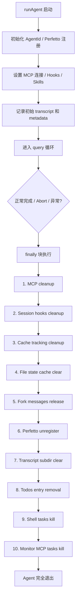
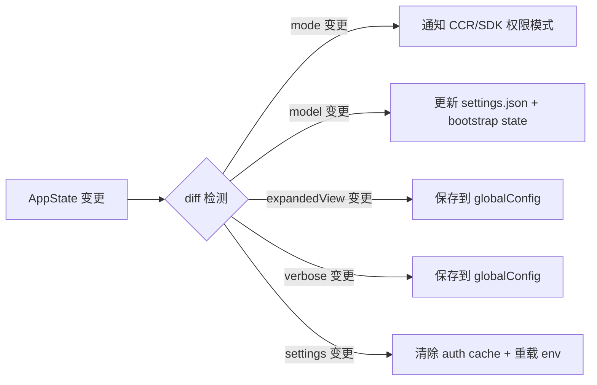
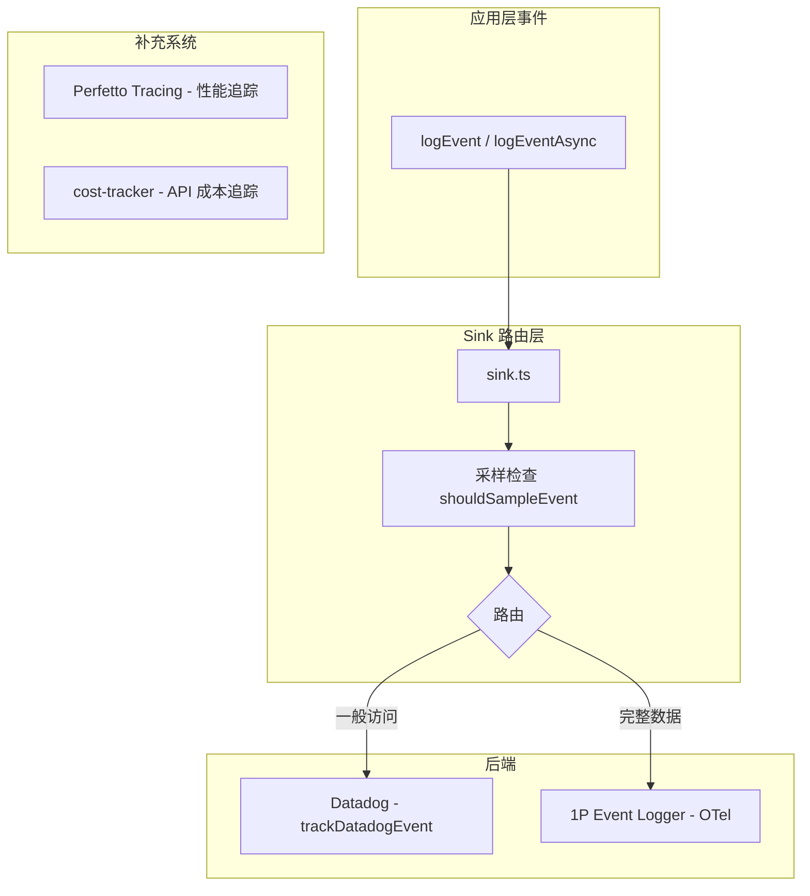
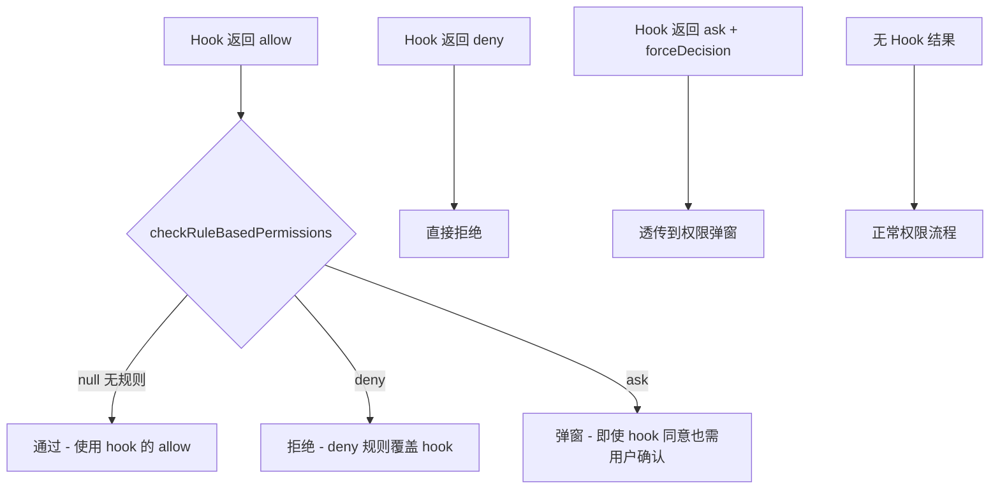
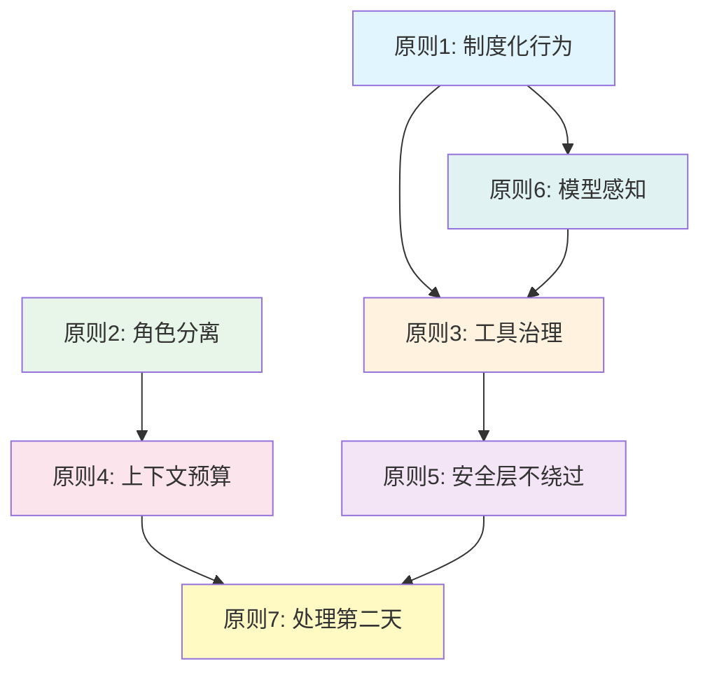

# Claude Code 源码架构深度解析 学习笔记：第 9-10 章

> 来源：《Claude Code 源码架构深度解析 V2.1》(Xiao Tan, 2026.04.04)

---

## 第 9 章：产品化——从 Prototype 到 Product

### 9.1 Agent 生命周期管理

一个 agent 系统最容易被忽视的部分不是核心推理循环，而是**生命周期管理**。Claude Code 在 `runAgent.ts` 的 `finally` 块中实现了一条完整的清理链，覆盖了从 MCP 连接到内存泄漏的所有边界。

#### 9.1.1 清理链的完整拓扑

`runAgent()` 是一个 `AsyncGenerator` 函数。无论正常完成、被 abort、还是抛异常，`finally` 块都会执行以下清理步骤：

```typescript
// runAgent.ts — finally 块（简化版）
finally {
  // 1. 清理 agent 专属的 MCP 服务器连接
  await mcpCleanup()
  // 2. 清理 agent 的 session hooks
  if (agentDefinition.hooks) {
    clearSessionHooks(rootSetAppState, agentId)
  }
  // 3. 清理 prompt cache 追踪状态
  if (feature('PROMPT_CACHE_BREAK_DETECTION')) {
    cleanupAgentTracking(agentId)
  }
  // 4. 释放克隆的 file state cache 内存
  agentToolUseContext.readFileState.clear()
  // 5. 释放 fork 上下文消息的内存
  initialMessages.length = 0
  // 6. 注销 Perfetto agent 注册
  unregisterPerfettoAgent(agentId)
  // 7. 清理 transcript 子目录映射
  clearAgentTranscriptSubdir(agentId)
  // 8. 清理 todos entry 防止内存泄漏
  rootSetAppState(prev => {
    if (!(agentId in prev.todos)) return prev
    const { [agentId]: _removed, ...todos } = prev.todos
    return { ...prev, todos }
  })
  // 9. 杀死 agent 派生的后台 shell 任务
  killShellTasksForAgent(agentId, ...)
  // 10. 杀死 monitor MCP 任务
  if (feature('MONITOR_TOOL')) { ... }
}
```

#### 9.1.2 清理链各环节详解

| 清理步骤 | 函数调用 | 解决的问题 |
|---------|---------|-----------|
| MCP 清理 | `mcpCleanup()` | 仅清理 agent 内联定义的新连接，共享连接不动 |
| Session Hooks | `clearSessionHooks()` | 防止 frontmatter hooks 在 agent 退出后继续触发 |
| Cache 追踪 | `cleanupAgentTracking()` | 清除 prompt cache break detection 的追踪状态 |
| File State | `readFileState.clear()` | 释放克隆的文件状态缓存内存 |
| 消息引用 | `initialMessages.length = 0` | 主动释放 fork 上下文消息数组 |
| Perfetto | `unregisterPerfettoAgent()` | 清除性能追踪的注册项 |
| Transcript | `clearAgentTranscriptSubdir()` | 清除 transcript 子目录映射 |
| Todos | `rootSetAppState(...)` | 删除 agent 的 todos key，防止累积泄漏 |
| Shell 任务 | `killShellTasksForAgent()` | 杀死 agent 派生的所有后台 bash 进程 |
| Monitor MCP | `killMonitorMcpTasksForAgent()` | 清理 monitor MCP 任务 |

> **关键洞察**：源码注释里有一句非常有价值的说明——"Whale sessions spawn hundreds of agents; each orphaned key is a small leak that adds up." 这揭示了一个工程现实：重度用户的 session 可能产生数百个子 agent，每个留下的微小泄漏会累积成严重问题。这就是为什么清理链要精确到连 `todos` 的空 key 都要移除。

#### 9.1.3 MCP 连接管理的精细策略

MCP 清理的逻辑值得深入分析。Agent 的 MCP 服务器有两种来源：

```typescript
// initializeAgentMcpServers() 中的策略区分
if (typeof spec === 'string') {
  // 引用型：复用父级 MCP 连接（memoized）
  // 清理时 *不会* 断开——父级还在用
  name = spec
  config = getMcpConfigByName(spec)
} else {
  // 内联型：agent 专属的新连接
  // 清理时 *会* 断开——只有这个 agent 在用
  isNewlyCreated = true
}
```

这是一个典型的**所有权模式**：共享连接（引用型）归父级所有，agent 只持有引用；私有连接（内联型）归 agent 所有，agent 退出时必须清理。如果不做这个区分，要么连接泄漏（不清理），要么误杀父级连接（全部清理）。

#### 9.1.4 Shell 任务清理：防僵尸进程

`killShellTasksForAgent()` 的实现精确到了进程级别：

```typescript
// killShellTasks.ts
export function killShellTasksForAgent(
  agentId: AgentId,
  getAppState: () => AppState,
  setAppState: SetAppStateFn,
): void {
  const tasks = getAppState().tasks ?? {}
  for (const [taskId, task] of Object.entries(tasks)) {
    if (isLocalShellTask(task) && task.agentId === agentId
        && task.status === 'running') {
      killTask(taskId, setAppState)
    }
  }
  // 清除已排队的通知——agent 的 query 循环已退出，不会消费它们
  dequeueAllMatching(cmd => cmd.agentId === agentId)
}
```

> **关键洞察**：注释中明确提到了真实的故障场景——"a `run_in_background` shell loop (e.g. test fixture fake-logs.sh) outlives the agent as a PPID=1 zombie"。这不是假想的问题，是真实遇到过的 10 天僵尸进程 bug。

#### 9.1.5 生命周期管理流程总览



### 9.2 Bridge 系统：远程控制与 IDE 集成

#### 9.2.1 Bridge 系统架构

`bridge/` 目录包含 31 个文件，实现了 Claude Code 的远程控制（Remote Control）和 IDE 集成能力。Bridge 的核心目标是让 Claude Code 运行时可以在不同环境之间桥接。

Bridge 的文件结构反映了其分层设计：

| 层次 | 文件 | 职责 |
|-----|------|------|
| API 层 | `bridgeApi.ts` | HTTP 客户端，调用 environments API |
| 配置层 | `bridgeConfig.ts`, `pollConfig.ts` | Bridge 实例配置和轮询策略 |
| 消息层 | `bridgeMessaging.ts`, `inboundMessages.ts` | 消息编解码、路由 |
| 传输层 | `replBridgeTransport.ts`, `remoteBridgeCore.ts` | WebSocket/SSE 传输 |
| 权限层 | `bridgePermissionCallbacks.ts` | 远程权限决策回调 |
| Session 管理 | `sessionRunner.ts`, `createSession.ts` | 子进程生命周期 |
| 认证层 | `jwtUtils.ts`, `trustedDevice.ts`, `workSecret.ts` | JWT、设备信任、密钥管理 |
| UI 层 | `bridgeUI.ts`, `bridgeStatusUtil.ts` | 状态显示和日志 |
| REPL Bridge | `replBridge.ts`, `replBridgeHandle.ts`, `initReplBridge.ts` | 始终在线的 REPL 桥接 |

#### 9.2.2 三种 Spawn 模式

Bridge 的 `SpawnMode` 类型定义了三种会话生成策略：

```typescript
// bridge/types.ts
export type SpawnMode =
  | 'single-session'  // 单会话模式：一个 session 在 cwd，结束后 bridge 拆除
  | 'worktree'        // Worktree 模式：每个 session 独立 git worktree
  | 'same-dir'        // 共享目录模式：所有 session 共享 cwd（可能互相踩）
```

这三种模式覆盖了不同的使用场景：`single-session` 适合一次性任务，`worktree` 通过 git worktree 实现完全隔离（互不影响），`same-dir` 适合不涉及文件修改的查询场景。

#### 9.2.3 Bridge 协议与状态机

Bridge 的 `BridgeConfig` 类型暴露了完整的配置面：

```typescript
export type BridgeConfig = {
  dir: string
  machineName: string
  branch: string
  gitRepoUrl: string | null
  maxSessions: number
  spawnMode: SpawnMode
  workerType: string           // 'claude_code' | 'claude_code_assistant'
  environmentId: string        // 客户端生成的幂等注册 UUID
  reuseEnvironmentId?: string  // 后端发放的 ID，用于断线重连
  sessionTimeoutMs?: number    // 默认 24 小时
  // ...
}
```

`SessionHandle` 则管理每个远程 session 的生命周期：

```typescript
export type SessionHandle = {
  sessionId: string
  done: Promise<SessionDoneStatus>  // 'completed' | 'failed' | 'interrupted'
  kill(): void
  forceKill(): void
  activities: SessionActivity[]     // 最近活动的环形缓冲区
  accessToken: string
  writeStdin(data: string): void
  updateAccessToken(token: string): void
}
```

> **关键洞察**：Bridge 系统把"远程控制 Claude Code"这件看似简单的事情，拆解成了 API 层、消息层、传输层、权限层、Session 管理层、认证层六个独立关注点。这种分层使得 CLI 控制远程容器、IDE 插件连接运行时、claude.ai 网页远程操作这些不同的集成场景，可以复用同一套基础设施。

#### 9.2.4 REPL Bridge：始终在线的连接

`replBridge.ts` 实现了一种"始终在线"的桥接模式。与 `bridgeMain.ts` 管理的远程 session 不同，REPL Bridge 直接嵌入到本地 REPL 中，允许 claude.ai 网页实时连接并控制本地运行的 Claude Code 实例。AppState 中有完整的 REPL Bridge 状态字段：

- `replBridgeEnabled` / `replBridgeConnected` / `replBridgeSessionActive` — 三级连接状态
- `replBridgeOutboundOnly` — 仅转发模式，不接受外部输入
- `replBridgeReconnecting` — 重连中状态

### 9.3 State 管理：AppState 架构

#### 9.3.1 Store 的极简实现

Claude Code 没有使用 Redux 或 Zustand 这样的状态管理库，而是自己实现了一个 35 行的 Store：

```typescript
// store.ts
export function createStore<T>(
  initialState: T,
  onChange?: OnChange<T>,
): Store<T> {
  let state = initialState
  const listeners = new Set<Listener>()
  return {
    getState: () => state,
    setState: (updater: (prev: T) => T) => {
      const prev = state
      const next = updater(prev)
      if (Object.is(next, prev)) return  // 引用相等则跳过
      state = next
      onChange?.({ newState: next, oldState: prev })
      for (const listener of listeners) listener()
    },
    subscribe: (listener: Listener) => {
      listeners.add(listener)
      return () => listeners.delete(listener)
    },
  }
}
```

> **关键洞察**：这个 Store 实现了三个核心特性——`Object.is` 短路避免无效更新、onChange 回调实现副作用联动、发布-订阅模式与 React 的 `useSyncExternalStore` 完美配合。35 行代码，零依赖，但满足了全部需求。这是"不要过度设计"的典范。

#### 9.3.2 AppState 的复杂性

与简洁的 Store 形成鲜明对比的是 AppState 本身的复杂性。`AppStateStore.ts` 中的 `AppState` 类型定义超过 300 行，包含了：

| 状态类别 | 示例字段 | 说明 |
|---------|---------|------|
| 核心配置 | `settings`, `verbose`, `mainLoopModel` | 运行时配置 |
| 权限系统 | `toolPermissionContext` | 工具权限上下文（mode, allowRules, denyRules） |
| MCP 状态 | `mcp.clients`, `mcp.tools`, `mcp.resources` | MCP 连接和工具注册 |
| 插件状态 | `plugins.enabled`, `plugins.errors` | 插件加载状态和错误 |
| 任务系统 | `tasks`, `foregroundedTaskId` | 后台任务（shell、agent、teammate） |
| UI 状态 | `expandedView`, `footerSelection` | 界面展示状态 |
| Bridge 状态 | `replBridgeEnabled/Connected/SessionActive` | 远程控制连接状态 |
| Agent 注册 | `agentNameRegistry`, `agentDefinitions` | Agent 名称到 ID 的映射 |
| 遥测 | `tungstenActiveSession`, `bagelActive` | tmux/浏览器工具状态 |
| 投机执行 | `speculation` (SpeculationState) | 预测执行的状态机 |
| Todo | `todos: { [agentId]: TodoList }` | 每个 agent 的任务列表 |

#### 9.3.3 onChange 副作用链

`onChangeAppState.ts` 是一个精巧的副作用引擎。它监听 AppState 的 diff，自动触发相应的外部同步：



核心设计：**所有** `setAppState` 调用如果改变了 `toolPermissionContext.mode`，都会自动通知 CCR（远程运行时）和 SDK 状态流。源码注释明确指出，之前有 8+ 处变更路径只有 2 处通知了 CCR，导致 web UI 与 CLI 的模式不同步。集中到 `onChangeAppState` 后，这类 bug 被彻底消除。

#### 9.3.4 React 集成：selector 模式

`useAppState` hook 使用 selector 模式实现细粒度订阅：

```typescript
// 用法示例：只有 verbose 变化时才重渲染
const verbose = useAppState(s => s.verbose)
const model = useAppState(s => s.mainLoopModel)
```

底层依赖 `useSyncExternalStore`，与 Store 的 subscribe 机制配合。注释中特别警告不要在 selector 中返回新对象——`Object.is` 比较会认为每次都变了，导致无限重渲染。

### 9.4 UI 层：React + Ink 的终端应用

#### 9.4.1 Ink 框架深度定制

`ink/` 目录包含约 50 个文件，这不仅仅是 Ink 框架的使用，而是 Claude Code 对 Ink 的**深度定制甚至 fork**。目录中包含了：

- `reconciler.ts` — React 协调器（reconciler）的定制实现
- `renderer.ts` / `output.ts` — 自定义渲染管线
- `layout/` — 自定义布局引擎
- `optimizer.ts` — 渲染优化
- `render-border.ts` / `render-node-to-output.ts` — 节点到终端输出的转换
- `selection.ts` / `searchHighlight.ts` — 文本选择和搜索高亮
- `parse-keypress.ts` — 键盘事件解析
- `terminal-querier.ts` / `terminal-focus-state.ts` — 终端状态查询
- `bidi.ts` — 双向文本支持
- `wrapAnsi.ts` / `wrap-text.ts` — ANSI 文本换行
- `measure-text.ts` / `measure-element.ts` — 文本和元素测量

#### 9.4.2 组件层的规模

`components/` 目录包含大量 UI 组件（PDF 中提到 389 个文件），覆盖了：

- **权限 UI**：`BypassPermissionsModeDialog.tsx`, `AutoModeOptInDialog.tsx`
- **差异显示**：`FileEditToolDiff.tsx`
- **Agent 状态**：`AgentProgressLine.tsx`, `CoordinatorAgentStatus.tsx`
- **设置**：`Settings/Usage.tsx`, `DiagnosticsDisplay.tsx`
- **Bridge UI**：`BridgeDialog.tsx`
- **反馈**：`Feedback.tsx`, `FeedbackSurvey/`
- **成本**：`CostThresholdDialog.tsx`
- **上下文**：`ContextVisualization.tsx`, `ContextSuggestions.tsx`

基础组件层（`ink/components/`）则提供了 TUI 的基础设施：`Box.tsx`, `Text.tsx`, `Button.tsx`, `ScrollBox.tsx`, `Link.tsx` 等。

> **关键洞察**：Claude Code 在终端 UI 上投入的工程量远超一般认知。它不只是一个"命令行工具"，而是一个**完整的 TUI 应用**，有自定义的渲染管线、布局引擎、文本测量、双向文本支持。这些在后台是看不见的，但它们决定了权限弹窗能否正确显示、diff 能否对齐、agent 状态面板能否实时刷新。

### 9.5 Telemetry：多层遥测体系

#### 9.5.1 遥测架构总览

Claude Code 的遥测体系分为三层：



#### 9.5.2 Analytics 索引层的零依赖设计

`services/analytics/index.ts` 是遥测的入口点，有一个关键的设计选择：

```typescript
// index.ts 头部注释
// DESIGN: This module has NO dependencies to avoid import cycles.
// Events are queued until attachAnalyticsSink() is called during app initialization.
// The sink handles routing to Datadog and 1P event logging.
```

事件在 sink 初始化前会被队列缓存，初始化后异步 drain。这解决了启动阶段的遥测丢失问题。

#### 9.5.3 Datadog 集成

`datadog.ts` 实现了批量日志发送到 Datadog Logs：

| 配置 | 值 | 说明 |
|-----|---|------|
| 刷新间隔 | 15 秒 | `DEFAULT_FLUSH_INTERVAL_MS` |
| 批次大小 | 100 条 | `MAX_BATCH_SIZE`，满则立即刷新 |
| 网络超时 | 5 秒 | `NETWORK_TIMEOUT_MS` |
| 用户分桶 | 30 桶 | 用 SHA-256 hash 分桶，保护隐私同时支持影响面估算 |

用户分桶（`getUserBucket()`）是一个精妙的设计：不直接记录 userId（高基数、隐私风险），而是把用户映射到 30 个桶中。这样告警可以基于"影响了多少个桶"来判断问题范围，而不是基于事件数量（少数用户可能产生大量重试事件）。

#### 9.5.4 PII 保护

analytics 系统内置了多层 PII（个人可识别信息）保护：

```typescript
// 类型层面强制验证
export type AnalyticsMetadata_I_VERIFIED_THIS_IS_NOT_CODE_OR_FILEPATHS = never

// MCP 工具名脱敏
export function sanitizeToolNameForAnalytics(toolName: string) {
  if (toolName.startsWith('mcp__')) {
    return 'mcp_tool'  // 用户自定义 MCP 名称是 PII
  }
  return toolName
}

// _PROTO_* 字段隔离：只有 1P 后端能看到，Datadog 等外部后端自动剥离
export function stripProtoFields<V>(metadata: Record<string, V>) { ... }
```

> **关键洞察**：`AnalyticsMetadata_I_VERIFIED_THIS_IS_NOT_CODE_OR_FILEPATHS` 这个超长类型名本身就是一种"制度化"——开发者每次使用都要显式断言"我验证过这不包含代码或文件路径"。类型系统被当作审计工具使用。

#### 9.5.5 Perfetto 性能追踪

`perfettoTracing.ts` 生成 Chrome Trace Event 格式的追踪数据，可在 [ui.perfetto.dev](https://ui.perfetto.dev) 中可视化：

- Agent 层级关系（父子 swarm）
- API 请求的 TTFT/TTLT、prompt 长度、cache 命中率
- 工具执行的名称、耗时、token 用量
- 用户等待时间

通过 `registerPerfettoAgent()` 和 `unregisterPerfettoAgent()` 管理 agent 在追踪中的注册，实现了 agent 层级的可视化。

#### 9.5.6 成本追踪

`cost-tracker.ts` 和 `costHook.ts` 追踪 API 调用成本。`useCostSummary()` hook 在进程退出时输出成本汇总，并保存到 session 记录中。

---

## 第 10 章：从源码里提炼出的设计原则

### 10.1 原则 1：不信任模型的自觉性——用制度代替临场发挥

#### 核心思想

好行为要写成制度。不要指望 LLM 每次都"想到"该怎么做。制度化的行为比临场发挥稳定得多。

#### 源码对应

`getSimpleDoingTasksSection()` 把 Claude Code 对模型行为的所有期望，以条目化的方式写进系统提示词：

```typescript
function getSimpleDoingTasksSection(): string {
  const codeStyleSubitems = [
    `Don't add features, refactor code, or make "improvements" beyond
     what was asked...`,
    `Don't add error handling, fallbacks, or validation for scenarios
     that can't happen...`,
    `Don't create helpers, utilities, or abstractions for one-time
     operations...`,
  ]
  // ...
  const items = [
    `In general, do not propose changes to code you haven't read.
     If a user asks about or wants you to modify a file, read it first.`,
    `Do not create files unless they're absolutely necessary...`,
    // ...
  ]
  return [`# Doing tasks`, ...prependBullets(items)].join(`\n`)
}
```

`getActionsSection()` 则明确列出了哪些操作需要用户确认：

- 破坏性操作：删文件、drop 数据库表、`rm -rf`
- 难以撤销的操作：force push、`git reset --hard`
- 影响他人的操作：push 代码、创建 PR、发 Slack 消息
- 上传到第三方工具：可能被缓存或索引

> **关键洞察**：这些不是"建议"，而是**嵌入运行时的规则**。模型每次对话都会收到这些指令，无法"忘记"或"忽视"。这是把人类代码审查中常见的 review comment（"不要过度设计"、"先读代码再改"）自动化为系统级约束。

### 10.2 原则 2：把角色拆开——同一个模型也要职责分离

#### 核心思想

至少把"做事的人"和"验收的人"分开。同一个 agent 既实现又验证，天然倾向于觉得自己做得没问题。

#### 源码对应

Claude Code 实现了多种专用 agent：

| Agent 类型 | 角色 | 特殊配置 |
|-----------|------|---------|
| Explore Agent | 只读搜索/分析 | `omitClaudeMd=true`，省略 CLAUDE.md；省略 gitStatus |
| Plan Agent | 只读规划 | 同上，只读不写 |
| Verification Agent | 验证结果 | 独立于执行 agent |
| Fork Agent | 上下文分叉执行 | `useExactTools=true`，继承父级 thinking config |

源码中对 Explore/Plan agent 的优化体现了"角色分离"带来的系统级收益：

```typescript
// runAgent.ts — 只读 agent 省略 claudeMd 和 gitStatus
const shouldOmitClaudeMd =
  agentDefinition.omitClaudeMd &&
  !override?.userContext &&
  getFeatureValue_CACHED_MAY_BE_STALE('tengu_slim_subagent_claudemd', true)

// Explore/Plan 省略 gitStatus（40KB 开销），需要时自己跑 git status
const resolvedSystemContext =
  agentDefinition.agentType === 'Explore' ||
  agentDefinition.agentType === 'Plan'
    ? systemContextNoGit
    : baseSystemContext
```

> **关键洞察**：角色分离不仅提升了质量（避免自我验证偏差），还带来了性能收益。源码注释明确量化："Dropping claudeMd here saves ~5-15 Gtok/week across 34M+ Explore spawns." 34M+ 次 Explore 调用，每次省 5-15K token，折算下来每周节省数十亿 token。

### 10.3 原则 3：工具调用要有治理——14 步 Pipeline

#### 核心思想

模型说要调工具，中间还要过输入校验、权限检查、风险预判。这层治理决定了系统在异常情况下的表现。

#### 源码对应

`toolExecution.ts` 实现了完整的 14 步工具执行 pipeline（详见第 3 章笔记），核心治理点包括：

1. **输入校验** — 验证工具参数格式和合法性
2. **Hook 检查** — PreToolUse hooks 可以拦截、修改或允许
3. **权限决策** — `resolveHookPermissionDecision()` 协调 hook 结果与规则
4. **分类器** — Classifier 独立判断风险
5. **执行** — 实际运行工具
6. **后处理** — PostToolUse hooks
7. **失败处理** — 错误恢复和重试

`resolveHookPermissionDecision()` 是治理的核心函数，它确保了一个关键不变量：**Hook 的 allow 不能绕过 settings 的 deny 规则**。

```typescript
// toolHooks.ts — hook allow 后仍检查规则
if (hookPermissionResult?.behavior === 'allow') {
  // Hook allow 跳过交互式弹窗，但 deny/ask 规则仍然适用
  const ruleCheck = await checkRuleBasedPermissions(tool, hookInput, toolUseContext)
  if (ruleCheck === null) {
    return { decision: hookPermissionResult, input: hookInput }  // 通过
  }
  if (ruleCheck.behavior === 'deny') {
    // deny 规则覆盖 hook 的 allow
    return { decision: ruleCheck, input: hookInput }
  }
  // ask 规则——即使 hook 同意了也要弹窗
  return { decision: await canUseTool(...), input: hookInput }
}
```

### 10.4 原则 4：上下文是预算——每个 Token 都有成本

#### 核心思想

能缓存的要缓存，能按需加载的不要一开始就塞进去，能压缩的要压缩。

#### 源码对应

1. **`SYSTEM_PROMPT_DYNAMIC_BOUNDARY`**：系统提示词分为静态部分（可缓存）和动态部分（每次重建）。通过 `systemPromptSection()` 和 `DANGEROUS_uncachedSystemPromptSection()` 区分，确保 prompt cache 命中率最大化。

2. **Fork cache optimization**：子 agent 的 `useExactTools` 模式继承父级完全相同的 API 请求前缀，确保 prompt cache 命中：

```typescript
// runAgent.ts — fork 子 agent 保持字节级一致
const agentOptions = {
  thinkingConfig: useExactTools
    ? toolUseContext.options.thinkingConfig  // 继承父级
    : { type: 'disabled' as const },        // 普通 agent 关闭 thinking
}
```

3. **子 agent 上下文裁剪**：Explore/Plan agent 自动省略 claudeMd（~5K token）和 gitStatus（~40K token）。

4. **四道压缩机制**：
   - Compact（长对话压缩）
   - Micro-compact（缓存友好的增量压缩）
   - Token budget 管理
   - Tool result clearing（清理中间工具结果）

### 10.5 原则 5：安全层要互不绕过——三层防护的不变量

#### 核心思想

三层防护（classifier、hook、permission）可以互相配合，但任何一层不能绕过另一层。这样即使某一层出了问题，整体安全性不会崩塌。

#### 源码对应

`resolveHookPermissionDecision()` 是这个不变量的守门人：



关键规则：
- **Hook allow ≠ 无条件通过**：仍需 `checkRuleBasedPermissions()` 检查 settings.json 的 deny/ask 规则
- **Hook deny = 绝对拒绝**：不需要进一步检查
- **Settings deny > Hook allow**：配置文件的拒绝规则永远优先
- **Classifier 独立运行**：不受 hook 结果影响

> **关键洞察**：注释引用了 `inc-4788`（一个安全事件编号），说明这个不变量是从真实安全事件中学到的教训。"Hook allow 不应绕过 settings deny" 不是理论上的安全设计，而是 post-mortem 的产物。

### 10.6 原则 6：生态的关键是模型感知——让模型看到自己的能力清单

#### 核心思想

你给系统接了十个插件，但模型不知道什么时候该用哪个，那这十个插件就等于不存在。

#### 源码对应

MCP instructions 注入是这个原则的核心实现：

```typescript
// prompts.ts — 将 MCP 服务器的指令注入系统提示词
function getMcpInstructions(mcpClients: MCPServerConnection[]): string | null {
  const connectedClients = mcpClients.filter(
    (client): client is ConnectedMCPServer => client.type === 'connected',
  )
  const clientsWithInstructions = connectedClients.filter(...)
  // 将每个已连接 MCP 服务器的 instructions 格式化后注入 system prompt
}
```

此外还有增量更新机制——`mcpInstructionsDelta`。当 MCP 服务器在对话中途连接/断开时，不是重建整个 system prompt，而是通过 delta attachment 通知模型能力的变化。

Agent 的 skill discovery 同样体现了这个原则：

```typescript
// runAgent.ts — agent 预加载 skills
const skillsToPreload = agentDefinition.skills ?? []
for (const { skillName, skill, content } of loaded) {
  initialMessages.push(
    createUserMessage({
      content: [{ type: 'text', text: metadata }, ...content],
      isMeta: true,
    }),
  )
}
```

Agent frontmatter 可以声明需要的 skills，启动时自动加载并注入到初始消息中。这确保 agent "知道"自己有哪些能力。

### 10.7 原则 7：产品化在于处理第二天

#### 核心思想

第一天跑起来不难。难的是任务中断怎么续、脏状态怎么清、进程泄漏怎么办、session 怎么恢复。

#### 源码对应

这个原则贯穿了本章讨论的所有系统：

1. **任务中断续传**：`recordSidechainTranscript()` 持续记录子 agent 对话，配合 `writeAgentMetadata()` 记录 agent 类型、worktree 路径、任务描述，使得 resume 成为可能。

2. **脏状态清理**：9.1 节讨论的 10 步清理链。

3. **进程泄漏**：`killShellTasksForAgent()` + `dequeueAllMatching()` 确保 agent 退出时不留僵尸进程和孤儿通知。

4. **Session 恢复**：Bridge 系统的 `reuseEnvironmentId` 和 `reconnectSession()` 支持断线重连。

5. **成本控制**：`CostThresholdDialog` 在成本超阈值时提醒用户。

6. **任务状态机**：

```typescript
// tasks/types.ts — 统一的任务类型联合
export type TaskState =
  | LocalShellTaskState
  | LocalAgentTaskState
  | RemoteAgentTaskState
  | InProcessTeammateTaskState
  | LocalWorkflowTaskState
  | MonitorMcpTaskState
  | DreamTaskState
```

七种不同的任务类型，每种都有自己的生命周期管理，但共享统一的状态检查接口 `isBackgroundTask()`。

---

### 10.8 设计原则总结表

| 原则编号 | 原则名称 | 核心思想 | 对应源码 | 关键实现 |
|---------|---------|---------|---------|---------|
| 1 | 不信任模型的自觉性 | 好行为写成制度，不依赖模型自觉 | `constants/prompts.ts` | `getSimpleDoingTasksSection()` 条目化行为规范；`getActionsSection()` 风险操作清单 |
| 2 | 把角色拆开 | 做事和验收分离，避免自我验证偏差 | `tools/AgentTool/runAgent.ts` | Explore/Plan/Verification Agent 各有专职；只读 agent 省略 claudeMd 和 gitStatus |
| 3 | 工具调用要有治理 | 输入校验→权限检查→执行→后处理 | `services/tools/toolExecution.ts`, `toolHooks.ts` | 14 步 pipeline；`resolveHookPermissionDecision()` 协调多层权限 |
| 4 | 上下文是预算 | 缓存、按需加载、压缩，珍惜每个 token | `constants/prompts.ts`, `runAgent.ts` | `SYSTEM_PROMPT_DYNAMIC_BOUNDARY`；fork cache；子 agent 上下文裁剪；四道压缩 |
| 5 | 安全层要互不绕过 | Classifier/Hook/Permission 三层独立 | `services/tools/toolHooks.ts` | Hook allow 不绕过 settings deny；deny 规则永远优先；来自 inc-4788 安全事件 |
| 6 | 生态的关键是模型感知 | 让模型知道自己有什么能力 | `constants/prompts.ts`, `utils/mcpInstructionsDelta.ts` | MCP instructions 注入 system prompt；skill discovery + preload；delta 增量更新 |
| 7 | 产品化在于处理第二天 | 中断续传、脏状态清理、进程回收 | `runAgent.ts`, `bridge/types.ts`, `tasks/types.ts` | 10 步清理链；transcript 持久化；Bridge 断线重连；7 种任务类型统一管理 |

---

### 10.9 这些原则的内在关联

这七条原则不是孤立的，它们构成了一个相互支撑的体系：



- **原则 1（制度化）是基础**：它决定了模型的默认行为，是其他一切原则能生效的前提
- **原则 2（角色分离）支撑原则 4（上下文预算）**：只读 agent 可以裁剪上下文
- **原则 3（工具治理）依赖原则 1（制度化）**：治理规则本身就是制度
- **原则 5（安全不绕过）是原则 3 的约束**：治理 pipeline 的各层不能互相覆盖
- **原则 6（模型感知）为原则 3 提供输入**：模型知道有什么工具，才能正确调用
- **原则 7（第二天问题）是所有原则的最终检验**：制度、分离、治理、预算、安全、感知——这些在第一天都容易做到，难的是持续、稳定、可恢复

> **最终洞察**：Claude Code 的源码不仅仅是一个工具的实现——它是一套**如何让 LLM 在生产环境中可靠运行**的工程方法论的具体化。每条原则背后都有真实的故障场景（inc-4788、10 天僵尸进程、whale session 内存泄漏），每个设计选择都经过了规模化验证（34M+ Explore 调用、数十亿 token 节省）。这些数字和事件编号是源码注释中的"化石记录"，记录了这个系统是如何从 prototype 进化为 product 的。
