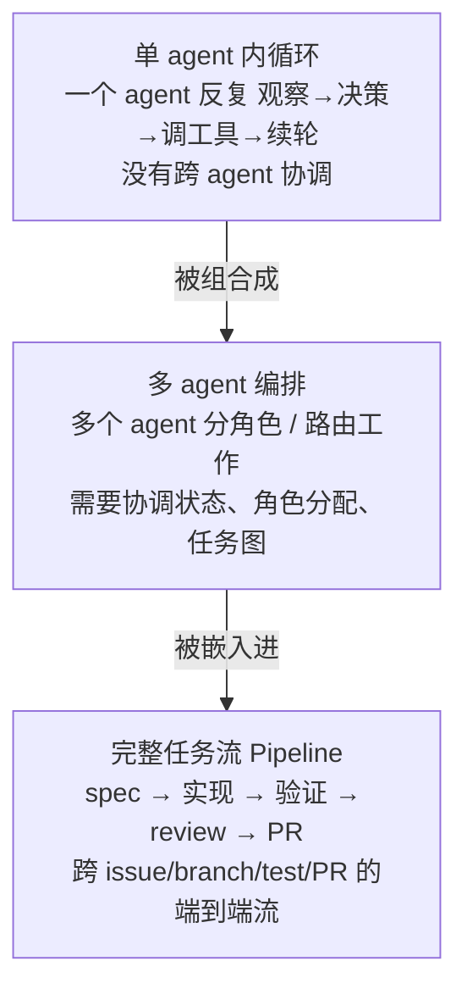
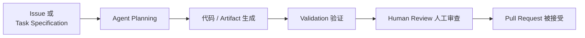
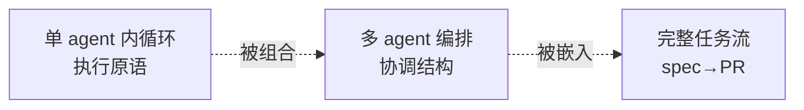

# Lifecycle 层：生命周期与编排（Lifecycle & Orchestration）

> ETCLOVG 七层中的第四层。回答一个问题：**agent 的控制流怎么走下去、怎么读写沿途的状态？** 范围从"单个 agent 自己转圈"，到"多个 agent 分工协作"，再到"从一个 issue 一路做到一个 PR"的完整任务流。回到 [[00-Survey总览-ETCLOVG七层框架]] 看七层全景。

相关已有笔记：

- agent loop 心跳骨架的工程化展开：[[00-Agent-Harness-知识全景图]]
- 单 agent 模块交互图解：[[02-Agent-Loop-模块交互]]
- 实战实现：[[22-从零到一搭建-Agent-完整技术文档]]

---

## 1. Lifecycle 层的核心定位——为什么把"流"和"状态"合成一层

### 1.1 它合并了过去分开讨论的两件事

Lifecycle 层把以前在各家 framework 里分别讲的两件事，合并到同一层：

1. **agent 的执行流（execution flow）**——控制流怎么往下走：这一步做完，下一步做什么？出错了走哪条分支？什么时候停？
2. **流读写的运营状态（operational state）**——这条流跑的过程中，要记住、要持久化的状态：做到哪了、还有哪些子任务没做、改了哪些文件。

**为什么必须合在一起讲**：因为这两件事是死死咬合的——"下一步做什么"这个决策，几乎总要读"目前的状态"才能做出来；而每走一步，又会改写状态。把流和状态拆开看，等于把"怎么走"和"走到哪了"割裂，根本对不上。

### 1.2 长程可靠性不只靠模型，更靠 harness 管这些状态

一个很关键的认知纠偏：**长程任务做得可不可靠，不只取决于"模型能不能产出一个好的下一步 action"。**如果 harness 不会做下面这几件"管家"的事，哪怕模型每一步都聪明，任务照样会崩：

- **记住已经发生过什么**（不然会重复做已完成的工作）
- **决定接下来该发生什么**（调度）
- **从错误中恢复**（一步失败了，能重试或回滚，而不是整个任务挂掉）
- **协调 subtask**（多个子任务之间的依赖、顺序）
- **在任务完成时停下来**（知道"做完了"，不会无限空转）

这五件事全是 harness 的职责，不是模型的。Lifecycle 层就是专门研究这五件事怎么做对。

### 1.3 Lifecycle 与 Context、Observability 的边界——三层都碰"状态"，但用途不同

Context、Lifecycle、Observability 三层都和"状态/信息"打交道，极易混。区分的关键是**这份状态是给谁看、拿来干嘛的**：

| 层                 | 它管的状态                                                                 | 给谁用、干嘛用                                           |
| ----------------- | --------------------------------------------------------------------- | ------------------------------------------------- |
| **Lifecycle**     | 运营状态：pending subtask、checkpoint、retry 计数、共享 artifact、execution status | **harness 自己读**，用来决定"接下来怎么 continue / coordinate" |
| **[[03-C-上下文与记忆管理 | Context]]**                                                           | retrieved doc、memory、对话历史                         |
| **[[05-O-可观测性与运维  | Observability]]**                                                     | logging / tracing / monitoring                    |

一句话区分：**Context 是喂给模型思考的料，Lifecycle 是 harness 用来调度的账本，Observability 是给人看的监控录像。** 同一个"工具调用结果"可能同时进三处——进 Context 让模型接着推、进 Lifecycle 让 harness 记"这步做完了"、进 Observability 让人能回放——但三处的用途完全不同。

---

## 2. 三个组织层级——一层套一层

Lifecycle 层的内容按"组织规模"分三级，且**后一级把前一级当积木用**：

- **multi-agent 编排**：把多个 single-agent loop 当基本执行单位拼起来。
- **full pipeline**：把 multi-agent 编排放进"从 issue 到 PR"这个更大的业务流程里。

所以下面 §4 / §5 / §6 是由小到大、层层包含的关系，不是三个并列的话题。

---

## 3. Lifecycle State Management（运营状态怎么存）

> 这一节讲的是上面五件"管家事"的物质基础——**那份让 agent 能跨 turn、跨 session、跨失败、跨交接继续跑下去的运营状态**到底怎么存。它包含：pending subtask、tool 结果、中间 artifact、repo 改动、协调用的 metadata、session 持久化、checkpoint resume 机制。

### 核心权衡：到底要不要专门存"当前状态"

这是 Lifecycle 层最根本的一道选择题。别被 Stateless / Stateful 这两个词唬住，先把最朴素的区别说清楚。

**任何长任务跑到一半，都有一份"现在干到哪了"的状态**——哪些子任务做完了、文件改成了什么样、下一步该干嘛。Stateless 和 Stateful 的全部区别，**只在于要不要专门把这份"当前状态"存下来**：

- **Stateful（有状态）**：专门存。把"当前状态"本身写下来。
- **Stateless（无状态）**：不专门存"当前状态"。

**这里有个最容易绊住人的点**：stateless 说的"不存"，是不另存"当前状态"这个**成品**，**绝不是连历史也不留**——恰恰相反，它全靠那条历史。所以"stateless"和"会话历史"压根不是一类东西、更不是对立面：**历史是数据**（一条流水账），**stateless 是策略**（只留这条流水账、不另存当前状态，要用时拿它现算）。

就这一句话的事。但"存不存"只是策略，真要落地还得回答同一道题：任务一中断、要接着跑，怎么把"刚才干到哪了"这份当前状态拿回来？对这道题，两边给的答案正好相反——一个干脆直接存下来，一个偏不存、要用时现算：

**① Stateless 的做法 —— replay（无状态回放）**：当前状态不存，但**把一路上每一步的历史完整记下来**。要继续时，**从头把历史重放一遍**，当前状态自然就重建出来了。

> 类比下棋记谱：**棋谱**记的是"每一步怎么走"（`e4`、`e5`、`Nf3`……一串**动作**），它**不是棋盘照片**。要知道当前局面，就从开局把每一步重走一遍，棋盘自然摆出来。stateless 就是只留棋谱、不留照片。

**② Stateful 的做法 —— execution（有状态执行）**：直接把**当前状态本身**外置存下来——写进文件、repo、数据库或某个服务。要继续时，**把这份状态直接读回来**，不重放历史。

> 接着上面那盘棋：stateful 就是**直接给棋盘拍张照片**存着（照片 = 当前状态本身）。要知道当前局面，看照片就行，不用照着棋谱重走一遍。

一句话记住区别：**replay 存的是"这一路怎么走过来的"，execution 存的是"现在人在哪"**——一个靠重走，一个靠读档。所以后文 "Stateless replay" 和 "Stateful execution" 这两个长词，拆开看不过是"无状态那套做法"和"有状态那套做法"，不必当成新概念。

把"到底存什么"摊开看，三种做法（含下面要讲的折中 Hybrid）的差别一目了然：

| 做法            | 存历史（log）吗 | 另存"当前状态"吗 | 继续时怎么做             |
| ------------- | --------- | --------- | ------------------ |
| **Stateless** | ✓ 存       | ✗ 不存      | 重放历史，现算出当前状态       |
| **Stateful**  | ✗ 可不存     | ✓ 存       | 直接读当前状态            |
| **Hybrid**    | ✓ 存       | ✓ 存       | 平时读状态；要复盘 / 审计再翻历史 |

读这张表就化解了最常见的两个糊涂：①"会话历史"只是最左列那份数据，而 **stateless = 只占左列、不占中列**，不是"没有历史"；② stateful 也不等于"丢掉历史"，它只是中列打了勾，要不要顺带留历史是另一回事（留了就是 Hybrid）。

两种做法的优劣完全相反：

| 设计                     | 优点                                                      | 缺点                                            |
| ---------------------- | ------------------------------------------------------- | --------------------------------------------- |
| **Stateless replay**   | 可复现（reproducibility）、可审计（auditability）好——历史是完整的，随时能重放验证 | trajectory 一长，**回放成本飙升**——每继续一步都要把越来越长的历史重放一遍 |
| **Stateful execution** | continuity / recovery 好——状态外置在文件/repo/DB 里，崩了直接读档恢复     | 一致性问题（外置状态可能和实际不同步）、调试更难（不像回放那样一步步可追）         |
| **Hybrid（多数生产系统）**     | 既保留可回放的历史，又依赖持久 artifact——两头的好处都要一点                     | 要同时维护历史和持久状态两套机制，实现和运维更复杂，还得防着两者不一致           |

**为什么生产系统几乎都选 Hybrid**：纯 replay 在长程任务里回放成本受不了；纯 stateful 又丢了可复现性和可审计性。混合做法——保留历史用于审计 / 复现，同时把关键 artifact（如已经写好的代码文件）持久化以便快速恢复——是工程上的折中。它并非没有代价（多维护一套机制、还要防两者不一致），只是这点复杂度，比起纯 replay 的回放成本、纯 stateful 的不可复现，明显划算。

### 同一道选择题，三种规模下答案不同

上面这道"replay 还是 execution"的选择题，**本身跟 agent 有几个无关**——它只问"要继续时，是重放历史、还是读一份存好的状态"。但一旦放到 §2 那三种组织规模上，每种规模因为自身结构不同，会**自动淘汰掉其中一个选项**，实际只剩两个能用。

背后是一条很直白的规律：

> **规模越大，越没法靠"每个 agent 各自重放自己的历史"把状态撑住，就越必须把状态存到外面、让大家共用。**

三种规模各淘汰掉哪个、为什么，先用一张表看个大概（每一级的细账，留到 §4 / §5 / §6 各自展开）：

| 规模              | 被淘汰的选项                   | 一句话原因                         | 实际能用                       |
| --------------- | ------------------------ | ----------------------------- | -------------------------- |
| **单 agent**（最小） | 纯 **Stateful**（只读档、不留历史） | 它的历史本来就现成，没必要再单独存一份当前状态       | replay / Hybrid（§4.2 细说）   |
| **多 agent**（居中） | 纯 **Stateless**（只重放历史）   | 多个 agent 要共用一份状态，各自重放各自历史拼不出来 | Stateful / Hybrid（§5.3 细说） |
| **完整任务流**（最大）   | 纯 **Stateless**（只重放历史）   | 状态直接落在 repo、PR 上，本来就存在外面      | Stateful / Hybrid（§6.1 细说） |

有个对称的细节值得留意：最小的单 agent 淘汰的是纯 Stateful，往上两级淘汰的都是纯 Stateless——**两头各砍掉相反的一极，最后都剩下 Hybrid**。这也是为什么真实生产系统里 Hybrid 最常见。

---

## 4. Single-Agent Inner Loop（单 agent 内循环）

> agent 系统的**基本执行单元**：一个 agent 反复地跟环境通过工具和反馈打交道，**没有任何显式的跨 agent 协调**。所有更复杂的编排都是用它搭出来的。

### 4.1 概念骨架：ReAct 范式

单 agent 循环普遍沿用 **ReAct 范式**（Yao et al., 2023）——把三件事交错着来：reasoning（想）、action（做，即调工具）、observation（看结果）。想→做→看→再想→再做……循环往复。

**一个容易被忽略的关键点**（OpenAI 在 Codex agent loop 分析里强调的）：这种系统的行为，**不只由模型决定，还由 harness 决定**。harness 干了一大堆活——构造 prompt、调工具、管控制流、把工具输出喂回给后续步骤。**同一个模型配不同的 harness，行为可以差很远。** 这也是整个综述"harness engineering"立论的根基。

### 4.2 执行模型：淘汰纯 Stateful，只剩 replay / Hybrid

§3 那条规律落到三级里最小的一档：被淘汰的是**纯 Stateful**，只剩 **Stateless replay** 和 **Hybrid**。为什么偏偏淘汰这一极？要看单 agent 特有的结构。

**关键前提：单 agent 的运营状态，本身就是它那条 interaction history。** 一个 agent 干活的全部痕迹——想了什么（reasoning）、调了哪个工具（action）、拿回什么结果（observation）——本来就按顺序记在它自己的历史里。也就是说，这一级"可回放的历史"是**天生现成**的，不需要额外攒一份。

**于是纯 Stateful 在这里没有立足之地。** 纯 Stateful 的做法是只留一份外置的当前状态、把历史丢掉。可对单 agent 来说，历史既然现成，主动丢掉它等于：

- 白白牺牲可复现与可审计——历史没了，就没法重放验证"当初为什么走到这一步"；
- 又换不来任何独有的好处——纯 Stateful 真正图的是"崩了快速恢复"，但把历史连同 artifact 一起留着的 Hybrid 同样能恢复，还顺带保住了可复现。

一句话：在单 agent 这一级，纯 Stateful 等于"花代价买了个更差的 Hybrid"，没有理由选。所以只剩两类——

| 执行模型                 | 这一级具体怎么落地                                                     | 软肋                                         |
| -------------------- | ------------------------------------------------------------- | ------------------------------------------ |
| **Stateless replay** | 只存那条 interaction history；要 continue / resume 就从头重放历史，重建出当前状态  | trajectory 一长，回放成本随之飙升——每续一步都要把越来越长的历史重放一遍 |
| **Hybrid**           | 历史照留（保住可复现 / 可审计），同时把关键 artifact（已写好的代码文件、repo 改动）持久化（保住快速恢复） | 要同时维护历史和持久状态两套机制，还得防两者不一致                  |

**两类之间怎么选，取决于任务有多长。** 短任务里 trajectory 不长，纯 Stateless replay 的回放成本可以忽略，实现还更简单；可一旦任务拉长，回放成本就成了硬伤——这正是下面 §4.3 里绝大多数系统宁愿多维护一套机制、也要上 Hybrid 的原因。

### 4.3 主流系统对照

| System      | GitHub Stars (k) | Pattern     | Execution Model  |
| ----------- | ---------------- | ----------- | ---------------- |
| OpenCode    | 159              | Single loop | Hybrid           |
| Claude Code | 123              | Single loop | Hybrid           |
| Gemini CLI  | 104              | Single loop | Hybrid           |
| Codex CLI   | 82               | Single loop | Stateless replay |
| Aider       | 45               | Single loop | Hybrid           |
| SWE-agent   | 19               | Single loop | Hybrid           |

主流 coding agent 几乎一边倒选 Hybrid（6 个里 5 个），只有 Codex CLI 用纯 Stateless replay——印证了 §3"纯 replay 扛不住长程回放成本"的判断。

### 4.4 单循环的三个局限——以及它们具体长什么样

单 agent 循环灵活、简单，但**任务一长就暴露三个毛病**。这三个毛病是后面 §5 多 agent 编排存在的全部理由，所以必须讲清它们具体指什么：

- **context fragmentation（上下文碎片化）**：一个 agent 把"规划、执行、各种探索、各种工具输出"全堆在同一个 context window 里。干得越久，这个窗口越是塞满了互相无关的碎片——早期的目标被后期的文件 dump 淹没。这正是 [[03-C-上下文与记忆管理|Context 层]] 的 context rot / drift 在单循环上的体现。
- **accumulated error（误差累积）**：循环里前面一步的小错（选错文件、误读结果），会被后面每一步当成既成事实继续往下推，越滚越大，没有任何环节回头纠正。一个 agent 自己很难发现自己早先错了。
- **weak decomposition structure（分解结构薄弱）**：单个 agent 一边想大方向、一边抠细节，没有"专人专责"的结构。复杂任务需要"先整体规划、再分块实现、再逐块检查"，但单循环把这些揉成一锅，分解得很糙。

**多 agent 编排正是冲着这三条来的**，核心手段只有一个——把揉在一个 agent 里的活，拆给多个专门角色。拆开之后：sub-agent 各持一份独立上下文（治碎片化）、专门的 evaluator 角色回头查错（治误差累积）、清晰的角色边界带来像样的任务分解（治分解薄弱）。§5 展开的，就是"分工"这件事具体有哪些组织模式。

---

## 5. Multi-Agent Orchestration（多 agent 编排）

> 单 agent 循环的延伸：不再让**一个** agent 独自包揽 plan / execute / check / revise，而是用**多个有专门角色的 agent** 组合来干。本质是用"分工"换"单循环三毛病的缓解"。

### 5.1 五种主要 pattern——各配一个具体场景

| 模式                                 | 它怎么组织                                                             | 具体场景                                                       |
| ---------------------------------- | ----------------------------------------------------------------- | ---------------------------------------------------------- |
| **Hierarchical orchestration（分层）** | 上层一个 controller 把工作拆给下层 agent / subagent，再把它们的输出整合回来              | controller 接到"重构这个模块"，拆成"agent A 改数据层、agent B 改接口层"，最后自己合并 |
| **Team orchestration（团队）**         | 一组有**命名角色**的 agent 互相协调，地位平级                                      | "产品 agent + 工程 agent + 测试 agent"像一个小团队互相对话推进               |
| **Workflow orchestration（工作流）**    | 把 agent + tool 编进**显式的阶段或控制逻辑**里                                  | 固定流程：先 agent 写代码 → 再固定调 lint tool → 再 agent 修 → 流程是写死的     |
| **Fan-out（扇出）**                    | 多个 agent **并行**去探索**多样化的解**                                       | 同一个 bug，5 个 agent 各试一种修法，最后挑最好的                            |
| **Graph composition（图组合）**         | 把 agent / tool / state 都当成一张 interaction graph 的节点，**多种协调模式可以共存** | 用 LangGraph 这种把节点和边显式画出来，分层、团队、扇出可以混搭在一张图里                 |

### 5.2 代表系统对照

| System            | GitHub Stars (k) | Primary Pattern   | Execution Model |
| ----------------- | ---------------- | ----------------- | --------------- |
| DeerFlow          | 67               | Hierarchical      | Stateful        |
| AutoGen           | 58               | Hierarchical      | Stateful        |
| oh-my-claudecode  | 34               | Team              | Stateful        |
| LangGraph         | 32               | Graph composition | Stateful        |
| Semantic Kernel   | 28               | Workflow          | Stateful        |
| OpenAI Agents SDK | 26               | Hierarchical      | Hybrid          |
| DeepAgents        | 23               | Hierarchical      | Stateful        |
| Hive              | 10               | Graph composition | Stateful        |
| Emdash            | 4                | Fan-out           | Hybrid          |

### 5.3 执行模型：淘汰纯 Stateless，只剩 Stateful / Hybrid

§3 那条规律落到这一级，被淘汰的一极**和单 agent 正好相反**：单 agent 淘汰的是纯 Stateful，多 agent 淘汰的是**纯 Stateless**。

根子在于多 agent 比单 agent 多出一样东西——**一份要被多方读写的共享协调状态**。它至少包含：

- **role assignment（角色分配）**：谁负责哪一块；
- **task graph（任务图）**：任务被拆成什么样、子任务间什么依赖顺序；
- **共享 artifact**：各 agent 彼此交出的中间结果；
- **coordination state（协调状态）**：整体协调推进到哪一步了。

要害全在"**多方共享**"四个字：这份状态不归任何单独一个 agent 所有，没法靠"每个 agent 各自回放自己那条历史"拼出来——A 的历史里压根没有 B 干过什么。所以它**只能外置**成一份大家都能读写的状态，纯 Stateless 在这一级直接出局，只剩 **Stateful / Hybrid**。§5.2 表里 Execution Model 一列清一色 Stateful 或 Hybrid、没有一个纯 Stateless，正是这条机制的实证。

> **别把"共享"和"stateful"划等号。** 这里其实有两个独立的维度：一个是 **stateless ↔ stateful**（继续时是重放历史、还是读一份存好的状态），另一个是 **私有 ↔ 共享**（这份状态只给一个 agent 用、还是多个 agent 共用）。stateful 只表示"当前状态被单独存了一份"——单 agent 存个**只给自己 resume 用**的 checkpoint，没人来共享，它照样是 stateful。多 agent 这一级的逻辑是：**"多方共享"这个需求（第二维），倒逼出"必须 stateful"（第一维）**——要让多个 agent 读到同一份状态，它就必须存在大家都够得着的外部。共享是因，stateful 是果，两者不是一回事。

### 5.4 分工的收益与代价——planner–generator–evaluator 范例

回到 §5 开头那句话：多 agent 的全部意义，是用"分工"换 §4.4 三毛病的缓解。最值得记住的落地范例是 **planner–generator–evaluator 架构**（Anthropic）——把原本揉在一个 agent 里的活，拆给三个显式角色，而这三个角色**正好一一对上 §4.4 的三毛病**：

| 角色            | 干什么                 | 治 §4.4 哪个毛病                        |
| ------------- | ------------------- | ---------------------------------- |
| **planner**   | 先做整体规划，再往下拆         | 分解结构薄弱——有了专门规划，分解不再是边想边抠           |
| **generator** | 照规划执行，各自只揣自己那摊上下文   | 上下文碎片化——每个 sub-agent 各持独立上下文，不再一锅烩 |
| **evaluator** | 独立回头查 generator 的产出 | 误差累积 + 自己查不出自己的错——换个角色来查，跳出当局者迷    |

这套三角色架构，就是"多 agent 为什么存在"这件事的具象化。

**但分工不是免费的。** 拆成多角色后，角色之间要来回传信息、对齐进度，多出一笔 **coordination overhead（协调开销）**——系统更慢、更复杂。所以分工虽然提升了鲁棒性和分解质量，是否值得仍要看任务复杂度：**简单任务硬拆成多角色，协调开销很可能盖过分工的好处。** 这条权衡，正是下一级（§6 完整任务流）为什么仍要"人定方向、agent 执行"、而不是无脑堆 agent 的伏笔。

---

## 6. Full Lifecycle Pipeline（完整任务流：issue → PR）

> 把端到端的 task workflow 从一个 spec 一路管到一个 validated output。这一级的焦点不再是"agent 之间怎么互动"，而是 **harness 怎么支撑一个长程任务跨越 planning / implementation / validation / review / delivery 全程**。

### 6.1 核心抽象：Task Runner

**Task runner = 负责管控完整任务生命周期的那个 harness 组件**，它管四件事：scheduling（调度）、state persistence（状态持久化）、retry（重试）、validation 与 iterative refinement（验证与迭代打磨）。

**关键特征：它的执行直接锚定（grounding）在持久 artifact 上**——进展不是某个抽象的内部状态，而是实打实的 repository、issue、branch、file、test、pull request 这些看得见、改得动、留得下的东西。也就是说，任务进展到哪，是用"代码库里真实发生了什么改动"来衡量和保存的，这天然就是可持久、可恢复、可验证的。

**执行模型——§3 那条规律在这一级走到尽头**：状态既然天生就长在外部（repo / branch / test / PR），纯 Stateless 几乎不可能成立——没有哪个长程任务会把"代码库改了什么"只存进一条可回放的历史里、用时再重放重建。所以这一级**以 Stateful 为主、Hybrid 次之**，下面 §6.2 表里两个 Stateful、一个 Hybrid、依旧没有纯 Stateless，正是这条规律走到三级最大一档的收尾印证。

典型 workflow：

### 6.2 代表系统

| System                   | GitHub Stars (k) | Execution Model |
| ------------------------ | ---------------- | --------------- |
| Vibe Kanban              | 26               | Stateful        |
| Symphony                 | 24               | Stateful        |
| GitHub Agentic Workflows | 5                | Hybrid          |

### 6.3 它就是前两级的组合

full pipeline 不是新东西，而是把前两级抽象**搭在一起**：

- **single-agent loop** 提供**执行原语**（真正干活的基本单元）
- **multi-agent pattern** 提供**协调能力**（多块活怎么分、怎么合）
- **task runner** 把两者集成进一个 end-to-end workflow——总基调是 **"人定方向，agent 执行"**：人提 issue、做最终 review、按 PR；agent 在中间把规划到实现到自测的活干完。

---

## 7. 本层小结

### 7.1 三个组织级别 + 状态特征

| 层级              | 基本单元                                      | 典型状态特征                    |
| --------------- | ----------------------------------------- | ------------------------- |
| **单 agent 内循环** | 一个 ReAct 循环                               | Stateless replay 或 Hybrid |
| **多 agent 编排**  | 多个 agent 角色 + 协调结构                        | Stateful 居多               |
| **完整任务流**       | 跨 spec / impl / review / PR 的 task runner | Stateful 居多               |

> 这张表是 §3 那条规律的速查版（规模越大越要把状态外置共享）；为什么各级是这样，回看 §3。

### 7.2 三个层级的包含关系

### 7.3 Lifecycle 层对下游各层的影响

- **与 [[03-C-上下文与记忆管理|Context 层]] 联动**：sub-agent isolation、cross-run injection 这些技术，既属于 Context 也属于 Lifecycle——因为**它们本质是"编排决策"驱动的"上下文操作"**（是 Lifecycle 层决定要不要 spawn sub-agent，而这个决定直接改变 Context 层的上下文怎么切分）。
- **与 [[05-O-可观测性与运维|Observability 层]] 联动**：task runner 跑出来的 trace，是 Observability 层最主要的数据源。
- **与 [[06-V-验证与评估|Verification 层]] 联动**：full pipeline 是评估的**天然单位**——一次评估的结果，就是"一个 PR 到底有没有通过 test、有没有被接受"。

一句话收束 Lifecycle 层的意义：**它把"agent 怎么持续做下去"当成一个独立的工程问题来处理，从而把 reliability 从"模型偶尔灵光一现的能力"，转成"harness 可以被设计出来的属性"。**