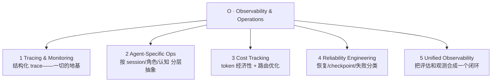

# Observability 层：可观测性与运维（Observability & Operations）

> ETCLOVG 七层中的第五层。一句话定位：**agent 在生产里跑起来后，怎么看清它在干什么、花了多少钱、为什么会崩、崩了怎么自动恢复。** 它和 [[07-G-治理与安全|Governance 层]] 是综述特意从"lifecycle hook 的副产物"提拔为**一等层**的两层之一。回到 [[00-Survey总览-ETCLOVG七层框架]] 看七层全景。

---

## 1. 为什么 Observability 要独立成层

很容易把"可观测性"当成"在 agent loop 里顺手加几个 log hook"的小事。综述反对这个看法，理由有三条，都说明它已经长成了一个独立学科：

- **有独立的工具栈**——Langfuse、Arize Phoenix、OpenLLMetry、AgentOps SDK，这些是专门为 agent 观测做的产品，不是通用日志库。
- **有独立的工程实践**——OpenTelemetry 仪表化、token 成本归因、anomaly detection，每一项都是成体系的方法。
- **在生产里由不同团队拥有**——观测这摊事往往是 SRE / 平台团队的活，和写 agent 逻辑的团队是分开的。

**结论**：把它当"observability hook 的附属品"，就会错过这一层完整的结构。它值得当成一层独立研究。

---

## 2. 五个子分层全景

Observability 层内部分五块，不是平铺并列，而是**一个地基 + 三个关注点 + 一个闭环**：结构化 trace（M1）是一切的地基；建在它之上的 agent 专用运维（M2）、成本（M3）、可靠性（M4）是三个不同维度的观测关注点；统一可观测性（M5）再把观测和评估收成一个闭环。

下面逐块讲。

---

## 3. Tracing & Monitoring Platforms（追踪与监控平台）

### 3.1 地基：什么是结构化 trace（span 树）

一切观测的地基，是把 agent 的每一个动作都记录成可检视、可过滤、可回放的 **span 树**。

**先讲清 span 是什么**：一个 span 就是"一段有起止时间的操作记录"——比如"这次 LLM 调用，从 12:00:01 到 12:00:03，用了 1500 token"。agent 干一件事会嵌套很多操作（一个任务里调了几次模型、每次模型又触发几个工具调用），这些操作有父子关系，串起来就是一棵 **span 树**：根是整个任务，往下是每次 LLM call，再往下是每次 tool call、retrieval、context 组装。

记成树的好处：能**看清谁触发了谁、每段花了多久**，而不是一堆扁平、互不关联的日志行。

**应用层平台**——Langfuse、Opik（Comet ML）、Arize Phoenix、MLflow——在这棵树之上提供：latency flame chart（火焰图，一眼看出哪段慢）、token 用量拆分、cost attribution（成本归因到具体哪步）、prompt 版本化。它们通常用一个很轻的 SDK wrapper 接入（比如给函数加个 `@traceable` 装饰器），agent 代码几乎不用改。

### 3.2 OpenTelemetry：事实标准

**问题**：每个观测平台各记各的格式，数据就被锁死在某一家工具里，没法流进公司已有的监控系统。

**解法**：OpenTelemetry（OTel）社区为生成式 AI 发布了一套 **semantic convention**——就是约定好"model name、temperature、token count、latency 这些字段，统一叫什么、怎么记"。大家都按这套约定记，数据就通用了。

两个开源项目把这套约定落地：

| 项目                          | 它干的事                                                                                                                        |
| --------------------------- | --------------------------------------------------------------------------------------------------------------------------- |
| **OpenLLMetry**（Traceloop）  | 给各家 LLM provider（OpenAI / Anthropic / Cohere）和向量库（Pinecone / Chroma / Weaviate）做**自动埋点**，吐出标准 OTel span / metric——接入方不用手写埋点 |
| **OpenInference**（Arize AI） | 一套对齐 OTel 的 semantic convention 和自动埋点，是 Phoenix 的配套规范                                                                       |

**工程价值**：按 OTel 记，agent 的 trace 就能直接流进团队**已经在用的** Prometheus / Jaeger / Grafana / Datadog 后端——不必为了 agent 单独引入一套观测工具，省下运维 overhead。

### 3.3 学术工作：跳出"应用层 decorator"

应用层的 `@traceable` 装饰器有个根本局限——**它在 agent 进程内部埋点，如果 agent 本身被攻陷了，它可以绕过或篡改这些埋点**。学术界在探索更底层、更可信的观测方式：

**AgentSight——在进程外部监控，agent 绕不过去**

它不在 agent 代码里埋点，而是用 **eBPF**（一种在操作系统内核里安全运行监控程序的技术）从**进程外部**盯着 agent。具体分三路抓信号：

- **抓"agent 想干嘛"**：LLM 流量虽然是 TLS 加密的，但在 SSL 加解密的边界处截获，就能看到模型的输入输出。
- **抓"agent 实际干了嘛"**：在内核层捕获 process creation（起了什么进程）、file I/O（读写了什么文件）、network call（发了什么网络请求）。
- **把两者关联**：一个 real-time correlation engine 把"模型说要做 X"和"系统里真的发生了 Y"对上号；再加一个**辅助的 "observer" LLM** 做语义分析，识别风险。

它的杀手锏：**framework-agnostic（不挑框架）、零代码改动、CPU overhead < 3%**，而且**因为在 agent 外部，被攻陷的 agent 绕不过它**——这对 safety-critical 部署特别重要。

**AgentTrace——按三个"面"做结构化日志**

它强调一条 trace 要跨**三个 surface（面）**捕获，少一个面就拼不出完整因果：

- **cognitive（认知面）**：reasoning step、plan、reflection——agent "想了什么"。
- **operational（操作面）**：tool call、API 交互——agent "做了什么"。
- **contextual（语境面）**：环境状态、user input——agent "在什么处境下做的"。

三个面用统一的 envelope 封装并和 OTel 集成。**cognitive 面尤其特别**：它专门捕获 reasoning artifact、plan、self-correction——这些是 debug **reasoning 错误**（模型想错了）而非 **system 错误**（管道坏了）的唯一原始材料。这两类错要用不同手段去抓，正是 §6.6 分层检测的依据。

---

## 4. Agent-Specific Operations Platforms（agent 专用运维平台）

> §3 的通用 trace 平台，抽象建在 "LLM call / tool call / retrieval step" 这种**单点操作**上。但 agent 有它**特有的关注点**：一个 multi-step session 整体怎样、某个 agent 的身份和角色、工具选择策略、跨 session 的状态交接。Agent-specific 平台就是在通用 trace 之上再加一层，专门抓这些 agent-level 的东西。

| 平台                  | 设计要点                                                                                                                     |
| ------------------- | ------------------------------------------------------------------------------------------------------------------------ |
| **AgentOps SDK**    | 用**层级化 span 模型**贴合 agent 的生命周期：session → agent → operation/task → tool call → LLM call，每一层对应 agent 真实的活动单位，而不是孤立的 API 调用 |
| **RagaAI Catalyst** | 针对 RAG 和 multi-agent 负载的质量 / 安全 dashboard，能浮出 retrieval 层和 agent 层的异常                                                    |
| **Laminar**         | OSS-first 的 agent 观测，把 trace / evaluation / prompt 管理组合在一起                                                               |

### 4.1 学术形式化

| 工作                                   | 贡献                                                                                                                                                                                                     |
| ------------------------------------ | ------------------------------------------------------------------------------------------------------------------------------------------------------------------------------------------------------ |
| **Moshkovich & Zeltyn (2025)**       | 提出一条六阶段的 AgentOps 自动化流水线：观察 → 收集指标 → 检测异常 → 定位根因 → 推荐修复 → 自动修复；并区分四类使用者：developer / tester / SRE / business user                                                                                       |
| **Moshkovich et al. (2025) 实证**      | 提出 **task-flow discovery**（自动发现 agent 实际走了哪些任务流）作为一个观测原语；用户研究发现：**79% 的从业者把"执行流不确定（同样输入每次走的路不一样）"列为 agent 系统最突出的挑战**                                                                                   |
| **NLAH framework**（Pan et al., 2026） | 把 harness 本身当**一等研究对象**：通过系统性 ablation（逐个关掉某模块看性能掉多少），量化各模块（tool registry / permission system / hook / skill / context folding）对 agent 性能的贡献。核心观点——**harness 不只是"被监控的对象"，更是"可干预的来源"**：每个模块都能被观测管线标注并调整 |

### 4.2 Cognitive Observability：从"做了什么"到"为什么这么做"

这一支把 agent 观测从"agent 做了什么"扩展到"agent **为什么**这么做"——因为很多失败是 reasoning 出了问题，光看动作日志看不出原因。

| 系统                               | 方法                                                                                                                                                                                     |
| -------------------------------- | -------------------------------------------------------------------------------------------------------------------------------------------------------------------------------------- |
| **Watson**（Rombaut et al., 2025） | 部署一个 "surrogate agent（替身）"复现主 agent 的输出，同时用 prompt attribution 反推出**逐步的 reasoning trace**。在 MMLU / SWE-bench-lite / AutoCodeRover / OpenHands 上证明：恢复出来的 reasoning 轨迹对人工 debug 和自动纠错都有用 |
| **AgentLens**（Lu et al., 2024）   | 三窗可视化（Outline / Agent / Monitor），把原始执行日志转成层级化的**行为叙事**——把"一堆 log"翻译成"一个能读懂的故事"。14 人用户研究显示，复杂分析任务上比"只能回放原始 log"显著更好用                                                                    |
| **claude-code-reverse**          | 逆向还原某个具体 coding agent 的交互链，作为理解 harness 级行为的**研究 artifact**                                                                                                                            |

---

## 5. Cost Tracking & Optimization（成本追踪与优化）

> LLM 推理按 token 计费；而 agent harness **把成本放大了**——一个用户面前的小任务，背后可能触发几十次 LLM 调用。所以成本观测有两个层次的需求：
>
> 1. **Tracking（追踪）**——搞清楚 token 到底花在哪。
> 2. **Optimization（优化）**——同样的结果，怎么用更少 token 达成。

### 5.1 Tracking 侧：搞清钱花在哪

| 工具             | 设计                                                                                    |
| -------------- | ------------------------------------------------------------------------------------- |
| **TensorZero** | 统一的 LLMOps 栈：gateway / 观测 / 实验 / 优化 做进同一个服务，支持把成本归因到 per-call（每次调用）或 per-task（每个任务）粒度 |
| **Helicone**   | 极简的 drop-in proxy（挡在中间的代理），加成本 / 延迟监控**零代码改动**——只想要个成本可见性的团队特别友好                      |

### 5.2 Optimization 侧：同样结果更省

| 工作                                                    | 策略                                                                                                                                                                            |
| ----------------------------------------------------- | ----------------------------------------------------------------------------------------------------------------------------------------------------------------------------- |
| **FrugalGPT**（Chen et al., 2023）                      | 三招：prompt adaptation、LLM approximation、**LLM cascading（级联）**——简单 query 先用便宜模型答，不行再升级到贵模型。可达到 GPT-4 的性能而**成本降 98%**                                                            |
| **GPTCache**（Bang, 2023）                              | 语义缓存：用 **embedding 相似度**判断"这个问题和之前问过的意思一样"，在请求到达 LLM 之前就用缓存答案拦截掉重复/换了说法的查询                                                                                                    |
| **QC-Opt**                                            | quality-aware 框架，在预算约束下联合优化 model / token / latency；用一个 BertScore predictor 估算输出质量，**不必真去调目标模型**就能预判                                                                          |
| **TALE**（Han et al., 2025）                            | 揭示一个反直觉的 **token elasticity（token 弹性）现象**：把 token budget 设得**过低反而会增加** token 消耗——因为预算过紧时模型为了挤进限额会反复重写、推翻重来，最终产出比合理预算下还多的 token。**省 token 不能靠一味压预算。**                          |
| **Dual-Pool Token-Budget Routing**（Liu et al., 2026b） | 从 serving（服务部署）侧省：把同一批 vLLM 实例分成 short-context / long-context 两个池，按估算的 token budget 把请求路由到对应池。用 Azure LLM trace + LMSYS-Chat-1M 实测 **GPU-hour 降 31–42%**（A100 集群投影年省 286 万美元） |

### 5.3 工程含义：成本观测必须跨三层

成本不是在单一位置能管住的，要跨三层一起看：

- **API 层**——token tracking（Helicone / TensorZero）
- **应用层**——routing 决策（FrugalGPT / QC-Opt）
- **基础设施层**——资源利用率（Dual-Pool / KV-cache 占用）

**一条重要警示**（Anthropic 关于 infrastructure noise 的研究）：**基础设施配置本身就能让 benchmark 分数偏移 6 个百分点（p < 0.01）。** 含义是——为省成本砍资源，可能在**细粒度观测发现不了**的情况下，悄悄拖垮 agent 性能。所以**成本优化和评估可信度是紧耦合的**，不能只盯账单不看质量。

---

## 6. Reliability Engineering（可靠性工程）

> 这一节讲 agent 在生产里长跑时的可靠性，分两大块：一是**怎么让长程任务跨越一次次中断接着跑**（failure recovery、checkpoint / resume、retry、session recovery），二是**怎么给"agent 会怎么坏"建立分类和检测**。前一块最尖锐的难点是：**每开一个新 session，agent 起步时没有任何上文记忆**，怎么让它接着上次进度干、而不是从头乱来。

### 6.1 Anthropic 总结的四种 long-running coding agent 失败模式

这四种是长跑 coding agent 最典型的翻车样子，很具体：

1. agent 想**一口吃成胖子**——试图 one-shot 把整个大任务一次做完，而不是拆开。
2. agent **过早宣布完工**——还没真做完就说"搞定了"。
3. agent **在 session 之间留下一个坏掉的环境**——下一个 session 接手时发现环境是脏的、跑不起来。
4. agent **没好好测试就把 feature 标成 done**。

### 6.2 双管齐下的解法

针对上面四种毛病，Anthropic 的解法是把活拆给两个角色，让四种毛病各有着落：

- **初始化 agent**：开工前把大任务**拆成结构化的 feature list**，并搭好进度追踪 artifact（git repo、progress 文件、init 脚本）。——把任务拆开，治"一口吃成胖子"（毛病 1）。
- **coding agent**：**增量地一次只做一个 feature**，每个 feature 都跑过测试才算完，收尾时留下一个干净、可直接接手的环境。——"做完必须测过"治"过早完工"（毛病 2）和"没测就标 done"（毛病 4）；"每次留干净状态"治"环境脏"（毛病 3）。

### 6.3 后续演进——这里藏着 harness 设计最重要的一条原则

| 演进                                                              | 关键点                                                                                                                                                                                                                                                                               |
| --------------------------------------------------------------- | --------------------------------------------------------------------------------------------------------------------------------------------------------------------------------------------------------------------------------------------------------------------------------- |
| **Anthropic 三 agent GAN 启发架构**（planner / generator / evaluator） | 引入 **sprint contract**（把任务约定成一个个 sprint）和**分离的 self-evaluation**——专门治"agent 过度自夸、过早说完工"的毛病                                                                                                                                                                                        |
| **从 Opus 4.5 → 4.6 的反向调整**                                      | 这个例子极有启发：新模型上，他们**直接把 sprint construct 和那套 context engineering 全部移除**，成本从 200 美元降到 125 美元，而**输出质量不变**。说明——**harness 的复杂度应该跟着模型能力走**，模型变强了，原来给它打的"拐杖"就该拆掉                                                                                                                          |
| **核心原则（务必记住）**                                                  | **每一个 harness 组件，都编码了一条"模型自己做不到某事"的假设。** 模型一旦增强，这些假设就会过时，对应的组件就成了多余的累赘                                                                                                                                                                                                            |
| **Anthropic Managed Agents**                                    | 把 "brain"（harness + LLM）和 "hands"（sandbox + tool）解耦，两边能各自独立恢复：harness 崩了 → 新实例用 `wake(sessionId)` 接续；sandbox 崩了 → harness 抓到 tool-call failure 后重新 provision 一个。credential 存在外部 vault，**绝不进 sandbox**。本质是把组件从 "pet"（不可替代、要手工照看的宠物）变成 "cattle"（可随时替换、自动重建的牲口）——这是大规模可靠运营 agent 的前提 |

### 6.4 学术界的 failure 分类——给"agent 怎么坏的"建坐标系

| 工作                                       | 关键发现                                                                                                                                                                       |
| ---------------------------------------- | -------------------------------------------------------------------------------------------------------------------------------------------------------------------------- |
| **MAST**（Cemri et al., 2025）             | 把 multi-agent 的失败分成 14 种 mode、归为三族：系统设计问题 / agent 间错位 / task 验证问题（标注一致性 κ = 0.88，说明分类很可靠）                                                                                  |
| **AgentErrorTaxonomy**（Zhu et al., 2025） | 按模块（memory / reflection / planning / action / system）拆解失败。核心发现：**error propagation（误差传播）——一个根因错误沿着后续决策一路级联放大——是 reliability 的中心瓶颈**。配套的 AgentDebug 框架专门隔离根因，把任务成功率相对提升 26% |
| **Vinay (2025)**                         | 系统编目 15 种**生产部署独有**的隐藏失败：*version drift*（模型升级悄悄改变行为）、*cost-driven performance collapse*（激进省成本导致质量崩塌）、*multi-step reasoning drift*（长序列里逐渐失去连贯）——这三个名字本身就很说明问题               |
| **QSAF**（Atta et al., 2025）              | 把 **cognitive degradation（认知退化）**形式化成一个 6 阶段生命周期。在 5 个 LLM 平台验证发现一个可怕的循环：**幻觉输出可能被存进持久化 memory，又被未来 session 当成事实复用，形成一个跨 session 边界、自我强化的退化循环。**                           |

### 6.5 Runtime 检测

| 系统                                  | 方法                                                                                                                                      |
| ----------------------------------- | --------------------------------------------------------------------------------------------------------------------------------------- |
| **SentinelAgent**（He et al., 2025）  | 把 multi-agent 交互建成一张 graph，分三层（全局 / 单点 / 多点）做异常分类；用 LLM-as-judge + human-in-the-loop 来 refine 策略                                        |
| **AgentFixer**（Mulian et al., 2026） | 在 IBM CUGA 生产系统里部署 15 个 validation tool，检出率 64–88%。一个很实际的发现：**38% 的任务失败来自 parsing error（解析错误）**——而这是完全可以用确定性 check 解决的 failure，根本不该让它发生 |

### 6.6 实践结论：分层 detection

agent 的可靠性需要**三层检测叠加**，因为不同错要用不同手段抓：

1. **轻量规则检查**——抓结构性失败：malformed tool call、schema violation（最便宜，先上）。
2. **统计监控**——抓漂移：latency / token / cost 的异常变化。
3. **LLM-based 语义分析**——抓 reasoning 失败：hallucination、plan 和 action 对不上、premature stopping（最贵，抓最难的）。

---

## 7. 走向 Unified Observability（统一可观测性）

### 7.1 Observability 和 Evaluation 之间的鸿沟

有一组很说明问题的数字（LangChain survey）：**89% 的团队在用 observability，但只有 52.4% 在跑 offline evaluation。** 这是一个**结构性脱节**——trace 收集工具和评估框架由不同社区各自发展，接口对不上。

**怎么闭合这个鸿沟**：把两边接成一个回路——

- 把生产里的 failure trace **自动转成回归测试**（线上栽的跟头，变成防止重蹈覆辙的测试）。
- 把评估里的 failure **当成一种 observability signal**（评估发现的问题，也是监控信号）。

LangChain 的 deep-agent evaluation 和 Anthropic 的 infrastructure noise 量化都主张同一件事：**evaluation 和 observability 应当是同一个反馈回路，不是两个分离的关注点。**

### 7.2 统一的 LLMOps Stack

- **TensorZero、Langfuse** 把 gateway / 观测 / 评估 / 优化打包成单一平台——降低集成 overhead。
- **NLAH** 推进这条线：让 harness 本身**模块化、可内省**，每个组件的贡献都能用 ablation 量化。
- **Anthropic Managed Agents** 从基础设施视角走：把 harness 组件 virtualize 成可互换的接口 `execute()` / `emitEvent()` / `getEvents()`——这样未来换 harness 设计时，周围系统不用跟着改。

### 7.3 Harness-as-Assumption 原则——观测系统的最高任务

> 重申 §6.3 的核心原则：**每一个 harness 组件，都编码了一条"模型独自做不到某事"的假设。**

这条原则给观测系统派了一个更高级的活：模型变强时，观测系统不仅要监测"agent 什么时候 fail"，**还要监测"哪个 harness 组件已经变成了多余的 overhead"**（因为模型已经强到不需要那根拐杖了）。

**理想的 observability** 因此要包含一层 **meta-monitoring（元监控）**：持续追踪哪些干预（context reset、evaluator feedback loop、tool restriction）仍然是 *load-bearing*（仍在承重、仍有用），哪些可以拆了。这样 harness 的"瘦身"才能和模型升级**同步推进**，而不是越堆越臃肿。

---

## 8. 本层小结

### 8.1 五个子分层

| 子层                           | 提供的能力                                                     |
| ---------------------------- | --------------------------------------------------------- |
| Tracing & Monitoring         | LLM call / tool call / retrieval 的 span 树；OTel 化让数据流进既有后端 |
| Agent-Specific Ops           | 按 session / 角色 / 认知面 的层级化抽象                               |
| Cost Tracking & Optimization | 跨 API / 应用 / 基础设施 三层的 token 经济性                           |
| Reliability Engineering      | failure 分类 + checkpoint / wake / 重置 + 分层检测                |
| Unified Observability        | 把 evaluation 和 observability 合并成单一闭环                      |

### 8.2 三个反复出现的结论

1. **harness 既是被监控的对象，也是干预的来源**——每个组件都能被独立 ablate 和调优。
2. **成本优化和质量评估必须一起测**——基础设施噪声本身就能让 benchmark 偏 6pp，省成本可能悄悄降质。
3. **harness-as-assumption 是观测系统的最高层任务**——它决定"哪些组件还有存在的必要"。

一句话收束：**Observability 层不是"事后看哪儿坏了"，而是把 agent 的"可改进性"本身变成一个系统性属性。**