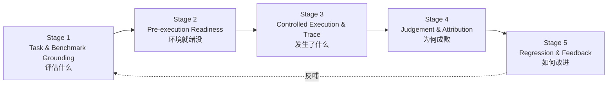
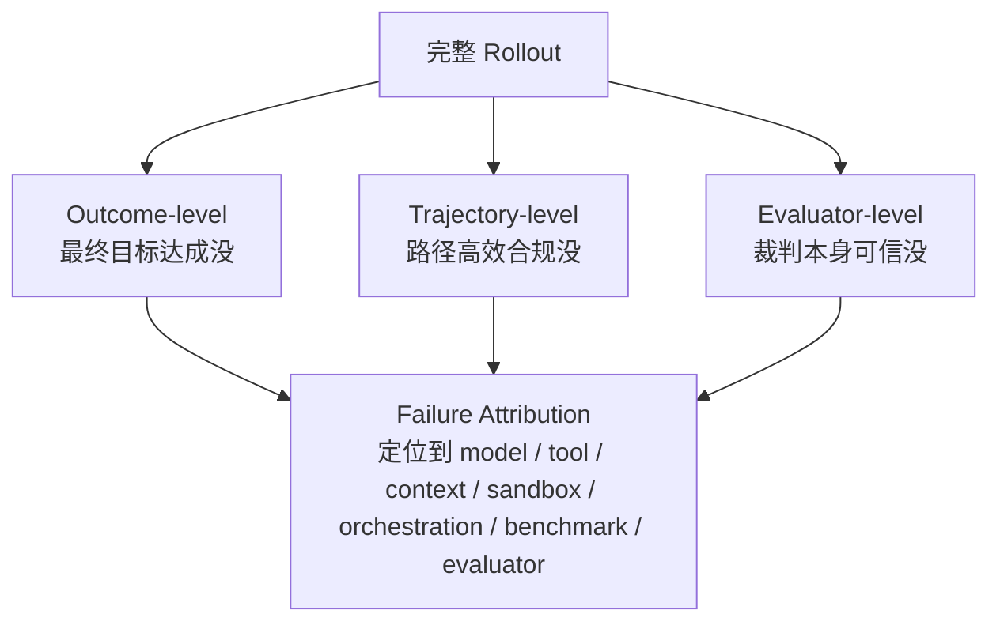

# Verification 层：验证与评估（Verification & Evaluation）

> ETCLOVG 七层中的第六层。一句话定位：**把"agent 跑了一趟"这件事，变成可以指导工程改进的证据。** 它的对象不是"模型答得好不好"，而是"这套 harness 把任务办成了没有、办砸了是哪一层的锅"。回到 [[00-Survey总览-ETCLOVG七层框架]] 看七层全景。

---

## 1. 核心立场：评估是闭环，不是排行榜

### 1.1 一个必须先扭转的认知——分数是"模型 × harness"这对组合的属性

传统 LLM 评估默认"分数 = 模型的能力"。**harness-aware evaluation 的关键论断推翻了这一点：报告出来的分数，是"模型 × harness 这一对组合"的属性，不是模型单独的属性。**

为什么？因为 [[01-E-执行环境与沙箱|Execution]]~[[07-G-治理与安全|Governance]] 各层的配置——给了哪些工具、上下文怎么管、沙箱怎么配、权限多严——都会改变同一个模型的表现。同一个模型，换一套 harness，SWE-bench 分数能差出一截。

**这条论断直接决定了评估协议怎么设计**，只有两条合法路径：

- **要么跨模型锁死 harness**（比的是模型，那 harness 就得固定当对照背景）；
- **要么把 harness 配置当成显式的实验因子来变动**（明确在比"哪套 harness 更好"）。

最忌讳的是 harness 偷偷在变，却把分数当成模型的功劳或过错。

### 1.2 Verification 层的骨架：5 阶段 task-to-feedback 闭环

Verification 层组织成一条从"要 agent 做什么"开始、到"评估结果反哺 harness 改进"结束的 5 阶段闭环：

### 1.3 和常规 LLM 评估的根本不同

| | 常规 LLM eval | harness 评估 |
|---|---|---|
| 评估对象 | 一对固定的 input → output | 一整段**执行 episode** |
| 怎么评 | 给输出打分 | 任务锚定（grounding）在环境里，agent 用工具和状态互动，trace 沿途记录，judge 同时评**最终结果**和**到达结果的路径** |

**central motivation（核心动机）一句话**：**基础设施噪声会伪装成模型的失败。** 一次 run 失败，可能怪模型，但也可能是 broken tool、stale context、没重置的 sandbox、flaky test、benchmark 本身有歧义、或 judge 不稳。所以评估的任务，是把 agent 行为转成"结构化判断 + 失败归因 + 回归反馈"，而不只是甩一个最终分。

---

## 2. Stage 1 — Task & Benchmark Grounding（评估什么）

> 第一步问"到底在评估什么"。对 LLM agent，一个 task **不是一句自然语言 prompt 那么简单**，而是一个**嵌入式问题**——它由一整套东西定义：environment state（环境处于什么状态）、可用 tool、允许的 action、constraint、termination condition（什么时候算结束）、success criteria（怎么算成功）。

**一条铁律**：**没有定义清楚的环境和成功条件，后面所有分数都没法可靠解读。** 因为"分低"分不清是 agent 不行，还是题目本身没说清。

### 2.1 软件工程 & 终端类任务

| Benchmark | 它锚定在什么上 |
|---|---|
| **SWE-bench** | 每个 task 锚定在一个真实 GitHub issue + repo 快照，跑测试来验证 agent 生成的 patch 有没有真的解决 issue |
| **Terminal-Bench** | 锚定在命令行 workflow——agent 要编辑文件、跑命令、装依赖、看懂报错 |

**关键洞见：强的结果验证器，要求强的任务锚定。** 只有当 repo 状态、依赖、成功条件都**精确指定**时，"测试通过"才是一个可靠的 evaluator。否则一个失败的测试，到底是 patch 真的不对、还是环境没配一致，根本分不清。

### 2.2 Web / 浏览器 / Computer-Use 类任务

| Benchmark | 描述 |
|---|---|
| **WebArena** | 真实 web 环境里的自主 agent 任务 |
| **VisualWebArena** | 加入需要看图理解的多模态 web 任务 |
| **BrowserGym** | 通用浏览器 agent 研究底座 |
| **WorkArena** | ServiceNow 上的知识工作任务 |
| **OSWorld** | 真实桌面环境，跨桌面应用 / 文件 / 多应用的 workflow |

这一族把 benchmark 同时变成了**评估问题和环境设计问题**——出题人必须提供逼真接口、隔离 task state、暴露合适的 observation、定义可测的成功判据。**这正是 [[01-E-执行环境与沙箱|Execution 层]] 和 Verification 层直接桥接的地方**：环境既是执行底座，也是评估仪器。

### 2.3 跨域 & 企业工作流类任务

| Benchmark | 重点 |
|---|---|
| **AgentBench** | 跨 OS / 数据库 / web 浏览 / 游戏 |
| **GAIA** | 通用助手任务：推理 + 工具使用 + 多模态信息获取 |
| **TheAgentCompany** | 模拟职场里的数字劳动 |
| **WorkArena++** | 强调**组合型**企业工作流——成功与否取决于在复杂软件里跨界面导航操作，而非孤立答一道题 |

**这一族的贡献是 coverage（覆盖度）**——测的是 harness 能不能跨多种任务类型 / 工具接口 / 状态表示 / 工作流 / 成功条件**泛化**，而不是在单一题型上刷分。

---

## 3. Stage 2 — Pre-execution Readiness Validation（环境就绪没）

> 第二步问"这次评估，能不能被公平、可复现地跑起来"。排行榜常忽略这步，但对 harness 评估极关键：environment、tool、context state、permission policy、budget、grader **必须全部被正确初始化**。否则——**run 失败了，分不清是 agent 的锅还是 setup 的锅**，失败归因从一开始就乱了。

### 3.1 三类就绪检查

**① 环境 / 沙箱就绪**：sandbox、repo、browser、terminal、VM 是否从一个**已知状态**启动。例子：SWE-bench 用可执行的 repo state + 基于测试的验证；Terminal-Bench 把终端任务连同可控环境和验证逻辑一起打包；OSWorld 用真实桌面环境 + 基于执行的评分脚本；**Repo2Run** 专门针对依赖/环境 setup 自动构出可执行的 Docker 环境；**HAL** 强调标准化、cost-aware 的评估基础设施。

**② 工具 / 上下文 / 权限就绪（这一项跨多层）**：

- **tool readiness**——API、MCP server、browser control、shell command、file op 是否可用、描述是否一致。
- **context readiness**——history、memory store、scratchpad、retrieved doc 是否被 reset 或被刻意初始化（别让上一题的残留污染这一题）。
- **permission readiness**——file access、credential、network、approval gate 是否和 benchmark 规格匹配。

> **重要含义**：这一步把评估和 [[02-T-工具接口与协议|Tool 层]]、[[03-C-上下文与记忆管理|Context 层]]、[[07-G-治理与安全|Governance 层]] 全连起来了——**这些层的配置本身就是测量仪器的一部分**。SWE-agent / SWE-ReX / OpenHands 都说明：tool exposure、shell access、browser、执行后端、运行时接口，**不能和评估设计分开**。严谨的 harness 评估应当把它们当成 **evaluation metadata（评估元数据）记录下来**——就像实验要记录仪器型号。

**③ 评估器 / 评分器就绪**：deterministic grader 要查 flakiness、缺依赖、和环境状态的兼容性；LLM-as-Judge 的 prompt / rubric / judge model 都要**版本化**；human-audit 协议要提前定好。**LLM-as-Judge 需要校准、消偏、一致性检查，不能盲目相信"找个强模型当裁判就行"。**

---

## 4. Stage 3 — Controlled Execution & Trace Capture（发生了什么）

> 第三步问"执行过程中到底发生了什么"。常规 LLM eval 的证据可能就是一对 input-output；agent eval 的证据是**一整条多步轨迹**——观察、推理、调工具、收结果、改环境、处理错误、最终终止。把执行控制住 + 把轨迹记下来，benchmark run 才**可诊断**。

### 4.1 先讲清核心单位：rollout

**rollout = agent 评估的基本单位**——就是"完整跑一趟"的全部记录。它包含：task、model config、harness config、action sequence（一步步做了什么）、中间 observation、final state、grading 结果。

**controlled rollout（受控 rollout）= 把所有变异源固定下来**：环境状态、工具可用性、timeout、budget、permission policy、evaluator 版本全锁死。为什么要锁？因为只有把这些变量控住，分数变化才能归因到真正想研究的那个因子上。

**对付剩余的不确定性，靠重复**：有些随机性消不掉（模型采样、网络抖动），那就**重复跑同一个 rollout，把 variance 暴露出来**——而不是用一个单分把波动藏起来假装确定。

几个代表系统怎么支撑受控执行：

- **SWE-agent**——把 repo navigation + 文件编辑 + 跑测试，作为 interaction loop 的一部分暴露给 agent。
- **OpenHands**——把代码编辑 / 命令行 / 浏览器 / 沙箱执行 / benchmark 集成合到一起。
- **SWE-ReX**——抽象出 local / remote 的沙箱 shell，让后端可换而不必改 agent 逻辑。
- **LangChain**——进一步把 deep-agent eval 拆成 single-step validation / full-turn / multi-turn simulation 多个粒度。

**核心结论**：可复现要求的是**回放完整的 "模型–工具–环境" 交互**，而不只是重跑一遍模型调用。

### 4.2 Trace-Native Evaluation（以 trace 为一等公民的评估）

trace capture 把"二元打分（对/错）"升级成"因果诊断（为什么对、为什么错）"。一个 trace-native 的 harness 应该记下：

- model output
- tool call + tool result
- 环境状态的改动
- context snapshot
- error / retry / recovery 动作
- token / latency / cost

**有了这些 trace，才能区分"看起来一样、实则不同"的失败**——比如：一个 agent 是**永远找不到目标文件**，另一个是**找到了但生成了无效的 patch**——最终都"失败"，但病因完全不同，修法也不同。trace 还能揪出**"有问题的成功"**——比如靠 benchmark exploitation（钻题目漏洞）蒙对、调了过多工具、或途中违反了权限。

- **HAL**——用大规模 agent log 做标准化评估，trace 是一等 artifact。
- **R2E-Gym**——用可执行的 trajectory + hybrid verifier，同时服务于测试时评估和训练时反馈。

> **一句话**：trace 不是"辅助 debug 的附属文件"，而是**主要的评估数据**。

### 4.3 Cost / Latency / Resource 追踪

评估应该报"质量 + 达成质量的代价"，两者一起看。因为 long-horizon agent 完全可能靠**多烧 token / 多调工具 / 多重试**来换取更高成功率——只看成功率会被这种"用钱砸出来的成功"误导。所以要追踪 token usage、model cost、wall-clock latency、tool-call count、retry count、resource consumption。

- **HAL** 明确把 agent eval 框成 standardized & cost-aware。
- **LangChain** 强调用可复现环境 + 多粒度评估来做 cost-quality 权衡的比较。

→ 这对**已部署的 agent 服务**尤其重要——在 budget / latency 约束下反复跑的 workload，优化的单位就是"每次任务花多少"。

---

## 5. Stage 4 — Multi-level Judgement & Failure Attribution（为何成败）

> 第四步问"这次运行该怎么评判，失败的话怎么定位"。拆成两件事：**multi-level judgement**（从三个层次判断这趟跑）+ **failure attribution**（把失败定位到 harness 的哪个组件）。

**和普通 benchmark 的区别**：目标不是给个分，而是**把执行证据转成可执行的工程诊断**（知道下一版该改哪一层）。

### 5.1 Outcome-Level（结果层）——目标达成没

衡量最终目标到底有没有达成：

- 软件工程：unit test、regression test、issue 专属验证（SWE-bench）。
- 终端：看最终文件 / 命令输出 / 任务专属 checker。
- 浏览器 / 企业工作流：看最终环境状态（表单提交了吗、ticket 更新了吗、配置改了吗）。
- 通用助手：看 answer string 或结构化响应。

**优点**：可规模化、可解释、排行榜可比。
**致命限制——压缩**：它把一整段 episode 压成一个值，**掩盖了 agent 到底健不健壮 / 安不安全 / 高不高效**。所以它**必要但不充分**。

### 5.2 Trajectory-Level（轨迹层）——路径质量好不好

衡量 agent 走的**路径**质量：选的工具合适吗？action 顺序合理吗？有没有避免冗余调用？尊重权限边界了吗？从错误里恢复了吗？跨步骤维持了 context 一致性吗？

**这是 agent 评估区别于传统输出评估最显著的地方**：**最终答案可能是对的，但轨迹仍然不可接受**——比如 agent 浪费了过多 token、反复调无关工具、违反权限、或依赖某种脆弱的 benchmark 专属取巧行为。结果对了不代表过程对了。

- **ReAct** 提供了"推理/行动/观察交错"这种 trajectory 级分析的概念基础。
- **WebArena / WorkArena / OSWorld / Terminal-Bench** 都产出 trajectory——其中间 action 是**有意义的评估对象**，不是该藏起来的实现细节。
- **LangChain** 的 single-step + full-turn 模式，让开发者在整趟跑出成败之前**就能审查决策质量**。

> **轨迹判断给 harness engineering 提供了"从失败到修复"的路径**：选错工具 → 改 tool interface；忘了之前的约束 → 调 context layer；空转不恢复 → 给 orchestration layer 加生命周期控制。**它把 benchmark 结果翻译成了"具体改哪一层"的工程反馈。**

### 5.3 Evaluator-Level（评估器层）——裁判本身可信吗

| 裁判类型 | 特点 |
|---|---|
| **deterministic verifier**（unit test / 状态检查器） | 可复现、便宜、跨系统好比，但**窄**，对开放式任务难设计 |
| **LLM-as-Judge** | 灵活，但带 bias、不确定、有额外成本 |
| **Human audit** | 对歧义 / 安全攸关的 case 重要，但**没法规模化**到持续评估 |

- **G-Eval** 表明 LLM 裁判在 NLG 评估上更贴合人类判断，但也**偏袒 LLM 生成的文本**（自己人帮自己人）。
- **MT-Bench / Chatbot Arena** 系统研究了 LLM-as-Judge 的位置偏差、冗长偏差、self-enhancement bias 和推理局限。
- **现代综述**：可靠的 LLM-as-Judge 需要标准化 / 消偏 / 一致性检查 / meta-evaluation。

**对 agent harness 的含义**：评估器层的评估**不是可选项**。如果 grader 不稳、test 不确定、LLM 裁判有偏，**评估噪声会被错误地归因到 agent 或模型头上**。鲁棒的 harness 应优先用**分层裁判**——deterministic check 测客观状态变化，LLM judge 测语义 / 轨迹，human audit 测歧义 / 高风险。**记住：评估器本身是个被测组件，不是系统之外那个绝对正确的 oracle。**

### 5.4 跨 harness 层的失败归因

一次失败的 rollout，根因可能在：模型推理、误导性的 tool schema、沙箱配置错、stale context、flaky test、benchmark 歧义、judge 不稳、orchestration loop……

三层信号各指一个方向：

- outcome-level 信号 → 目标达成没
- trajectory-level 信号 → action 序列连不连贯 / 高不高效 / 合不合规
- evaluator-level 信号 → 分数本身可不可信

**实际中，归因极少是单标签分类，往往是一条因果链**：任务描述含糊 → 选错工具；上下文压缩过度 → 忘了约束；沙箱依赖出问题 → 恢复行为推高成本；裁判 flaky → 把一个本来有效的解给毙了。

→ **failure attribution 是一个覆盖整条 trace 的诊断过程，不是给最终分事后贴个标签。** Stage 4 的产出**不是一个判决，而是一份结构化诊断**，交给 Stage 5 去反哺回归测试和 harness 改进。

---

## 6. Stage 5 — Continuous Regression & Deployment Feedback（如何改进）

> 第五步问"评估结果怎么驱动下一次 harness 改版"。agent harness 是持续演化的——prompt、tool schema、MCP server、沙箱镜像、orchestration loop、治理规则、judge prompt 都在变。Continuous eval 就是把 benchmark 结果 + 生产 failure，变成 harness 自己的**回归系统**。

### 6.1 给 harness 变化做回归评估

**先界定"回归"：一次改动本想改进，却把原来好用的能力弄坏了——相比上一版倒退，这就是回归（regression）；维护一组固定用例、每次改动后重跑并与基线比对、专门抓这种倒退，就是回归测试。**

**关键认知：回归不该只由"模型变化"触发，更要由"harness 变化"触发。** 改了 tool description、改了 context-compaction 策略、换了沙箱镜像、调了权限规则、改了 judge prompt——任何一个都会改变 agent 行为或评估分。**而且这些组件互相耦合 → 一处局部改进可能引发全局回归。**

实践模式：**分层 eval suite**——给 tool schema 做 unit 式测试 + deterministic validator + 给局部决策做 single-step test + 给端到端完成做 full-rollout test + 给长程连贯性做 multi-turn simulation。LangChain 的 deep-agent eval 用的就是这个分层视角；Anthropic 把 eval 当成**自动化测试 + 显式评分逻辑**，开发期就能跑。

### 6.2 评估框架与 LLMOps 集成

通用框架提供可复用的构件：

- **Promptfoo**——prompt 与 LLM 应用的回归测试
- **DeepEval**——类似 unit-test 的抽象
- **RAGAS**——检索增强生成（RAG）的评估
- **lm-evaluation-harness**——标准化的 LM 评估

→ 这些**不是为 long-running agent 设计的**，但提供了"面向回归的 agent 评估"的构件。

**评估也该连回 observability**：把生产 trace → 回归测试，把评估 failure → observability signal。这就**闭合了"监控发生了什么"和"构造一个可复现、可诊断的受控测试"之间的环**——和 [[05-O-可观测性与运维|Observability 层]] §7 是同一个闭环的两端。

### 6.3 Verifier-Based 与训练时评估

把 evaluator 当成**训练信号 / 优化目标**，而不只是离线指标。基于 verifier 的环境和 RL 风格的 agent gym（如 R2E-Gym）把环境反馈当 reward / validation signal，直接改进 agent 的 policy 和 scaffold。

> **Meta-Harness**（Lee et al., 2026）走得最远：把 **harness 设计本身**当成自动搜索的对象——不再只问"哪个模型在固定 harness 下最好"，而是问**"哪种 harness 结构 / prompting 策略 / tool interface / control loop，产出的 agent 最可靠"**。在这个视角下，**评估不再是流水线的终点，而是 harness 改进自己的信号。**

---

## 7. 本层小结

### 7.1 5 阶段闭环映射表

| Stage | 关键问题 | 主要产出 |
|---|---|---|
| 1 Grounding | 评估什么 | task / env / 成功条件的定义 |
| 2 Readiness | setup 就绪没 | env / tool / context / permission / evaluator 的初始化记录 |
| 3 Controlled Execution | 发生了什么 | 完整 trace + cost / latency 指标 |
| 4 Judgement & Attribution | 为何成败 | outcome / trajectory / evaluator 三级判断 + 分层归因诊断 |
| 5 Regression & Feedback | 如何改进 | 回归 test suite + harness 改版信号 |

### 7.2 把评估从"排行榜"重新框成"质量控制回路"

- 最终 success rate 仍然有用，但**不再充分**。
- 长程 agent 的核心评估问题，不是"agent 成功了吗"，而是——**为什么成 / 为什么败、路径可不可接受、裁判可不可信、下一版该改哪个 harness 组件。**

Verification 层这种 reframe，把评估从"系统外的一次性检查"，变成了"harness 自身的反馈控制器"——**这正是综述把它从'benchmark 的技术细节'提拔为'七层中一等控制面'的理由。**
