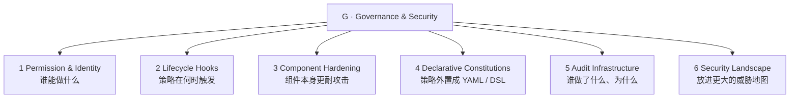

# Governance 层：治理与安全（Governance & Security）

> ETCLOVG 七层中的第七层。一句话定位：**agent 的行为受什么约束、约束失效时谁负责。** 它横切其它所有层。回到 [[00-Survey总览-ETCLOVG七层框架]] 看七层全景。

---

## 1. 这一层为什么独立

LLM agent 现在真的在执行 shell 命令、发邮件、提交代码、调第三方 API。一旦动作有真实后果，生产部署的中心问题就变成两个：**这些动作受什么约束？约束失败时谁负责？**

围绕这两个问题，已经长出了一套独立的工具生态——permission engine、policy language、audit pipeline、gateway control——它与 [[04-L-生命周期与编排|Lifecycle 层]] 的 lifecycle hook、[[05-O-可观测性与运维|Observability 层]] 的 observability 各成体系、互不重叠。正因为生态自成一体，它才值得单列为一层。

综述把 Governance 层切成 **5 大机制 + 1 张外部威胁地图**：



**一条贯穿全层的主线**：5 大机制不是平行的清单，而是一道**纵深防御**——permission 在最前面定"能不能做"，hook 在执行链上逐点拦，hardening 加固组件本身少触发拦截，constitution 把策略外置成可审可改的文件，audit 在最后记录和回溯。下面逐个讲，最后用 §7 的风险映射表把它们串起来。

---

## 2. Permission Models & Identity Management（谁能做什么）

> 治理的第一个问题永远是 access control：哪些 tool、文件、network endpoint、系统资源，agent 能碰。
>
> **它比传统 RBAC / ABAC 难在哪**：传统权限模型在部署时就知道"谁需要访问什么"。但 agent 的任务是自然语言给的——**部署时根本不知道这个 NL 任务会需要哪些工具**。权限边界要在运行时才定得下来，这是全新的难点。

权限设计沿一条"granularity（粒度）轴"演化，从粗到细：

| 粒度 | 怎么做 | 代表 |
|---|---|---|
| **静态边界**（部署时定死） | 部署时就划好 scope，超出要 escalation（申请提权） | Codex 跑在沙箱里 + 限制 filesystem / network；Gemini CLI 限定 workspace scope + 命令 allow/deny 名单 |
| **运行时上下文 policy**（每次调用现算） | 在 tool name / 参数 / 环境状态上跑 predicate（判断式），每次调用前现场决定准不准 | 见下方 Progent / Conseca |
| **跨边界**（多 agent 之间） | 多个 agent 之间需要 identity 和 delegation token | 见 §2.1 |

**Progent / Conseca 的关键设计——把"策略生成"和"策略执行"分开**，值得专门讲：

- **Progent**：一套 DSL，在工具调用前求值，按 role / user / session 动态给出 least-privilege（最小权限）。
- **Conseca**：从**可信上下文**生成针对当前任务的 policy，再交给一个**确定性 checker** 强制执行。

为什么要把"生成"和"执行"分家？因为这两件事对"灵活 vs 可信"的要求正好相反——**生成器要灵活**（能根据千变万化的任务现编策略），**执行器要可审计**（必须确定、可验证、不能自己发挥）。分开后，灵活的归生成、可靠的归执行，两全。

### 2.1 多 agent 带来的新挑战

#### Identity 与 agent 间访问控制

授权之前，必须先确立**"是谁在请求"**。多 agent 场景下这件事突然变难——一个 agent 替用户去调另一个 agent，权限链怎么追溯到最初那个人？

- **South et al. (2025)** 的 authenticated delegation：扩展 OAuth 2.0 / OIDC，新增 User ID Token、Agent ID Token、Scoped Delegation Token，把"用户的意图"绑定到"这个 agent 被授予的具体权限"上，建立一条从 human principal（最初的人）→ agent action 的**可验证问责链**。
- **SAGA**（Syros et al., 2025）：provider 居中的多 agent 架构，agent 用一次性的 cryptographic key 注册，短寿命的 access token 强制执行用户定的 contact policy。
- **IsolateGPT**：hub-and-spoke（轮毂-辐条）架构，每个第三方 app 跑在一个隔离的 spoke 里、有自己的 LLM / memory / tool，spoke 之间通信必须经过可信的 hub——**这样"跨 app 数据交换"就从"共享 context window 的副作用"变成了一个显式的治理决策**（必须经过 hub 批准，而不是自动发生）。

#### Credential 管理

agent 经常要处理 API key / session token / OTP。**把 credential 暴露进 LLM 的 context，就制造了泄露风险**（模型可能把它复述出来或被诱导泄露）。

**Skyvern 的模式**很典型：secret 存在 vault 里，**只给 LLM 看一个 placeholder（占位符）**，等到真正执行 authenticated action 时，在 automation 层把真值替换回去。模型自始至终没见过真 secret。

**未解问题**：long-horizon session 里 secret 的生命周期——token 跑到一半失效了，需要在**不进 model context 的前提下**续期，目前没有好办法。

### 2.2 Web 级权限协调

跨组织的交互（agent 去访问第三方 web 或服务）需要协调，而**单一 harness 自己强制不了**——因为对面是别人的网站。

**Marro et al. (2025)** 提出 `agent-permissions.json`——一个类比 `robots.txt` 的轻量 manifest 文件：网站主在自己站点声明"agent 可以用哪些 UI 元素、rate limit 多少、并发约束、哪些 action 需要人确认"。它不解决 authentication，但标志着治理开始**跨组织边界**延伸。

### 2.3 开放挑战

- **表达力和可用性兼顾**的 permission model 还没解决：太严，agent 没法用；太宽，治理就形同虚设。
- 社区**没有跨 harness 可移植的标准 permission 规范语言**。
- agent 的某个 action，到底该归责到 human operator、agent instance、还是某个临时 task identity——还在争论。

---

## 3. Lifecycle Hooks（策略在何时触发）

> Permission model 定义"什么被允许"，是**静态的规则**。Lifecycle hooks 定义"这些 policy check 在什么时刻开火"，是**动态的触发点**。许多 harness 在 agent loop 的各阶段都暴露 hook：plan 之前、tool invoke 之前、tool 执行之后、response 交付之前。

一个 tool-use cycle 上有四个 hook 点，各守一道关：

```
Input  ─►  H1: Input Guardrail  ─►  LLM
                                       │
                                       ▼
                              H2: Action Guardrail  ─►  Tool
                                                          │
                                                          ▼
                                            H3: Post-exec IFC  ─►  Response
                                                          │
                                                          ▼
                                  H4: Human-in-the-Loop  (需用户批准时)
```

### 3.1 H1 · Input Guardrail（输入到达 LLM 之前）

在数据进入 LLM **之前**就先 validate，挡住投毒输入：

- **PromptShield**、**DataSentinel**——训练专门的 classifier 来检测 prompt injection payload。
- **规则检测器 vs 模型检测器的权衡**：规则的严格但脆（稍微变形就绕过）；模型的泛化好，但更慢、且更容易被 adaptive attack（专门针对它设计的攻击）骗过。

### 3.2 H2 · Action Guardrail（LLM 提议 action 之后、真正执行之前）

在执行 tool call 之前，检查 LLM 提议的这个 action 该不该放行：

- **ShieldAgent**——把 safety constraint 形式化成可验证的 predicate，对每个 action 逐一 check。
- **ControlValve**——多 agent 场景下约束 agent 间的 control-flow graph，专门**防 control-flow hijacking（控制流劫持）**——即一个 agent 把执行流偷偷重路由到另一个 agent。

### 3.3 H3 · Post-execution IFC（工具返回的数据重新进 LLM 之前）

tool 执行完，返回的数据**重新进 LLM context 之前**也必须检查——因为工具返回的内容（比如抓回来的网页）可能带毒。

- **CaMeL**——capability-based 的 information flow control（信息流控制）。核心机制要拆开讲：**每个 data value 都带一个 metadata tag（标签），追踪它的 provenance（来源）**——区分"可信的用户输入"和"不可信的 web 抓取内容"。再用一个自定义解释器强制一条规则：**不可信的数据不能影响 control-flow 决策**（不可信内容可以被读、被处理，但不能左右 agent 接下来做什么）。这相当于把"在可信上下文上做规划"和"在不可信内容上做处理"彻底隔开——用一点灵活性，换更硬的 control/data-flow 边界。在 AgentDojo 上验证有效。

### 3.4 H4 · Human-in-the-Loop（把人放进回路）

对 destructive / 越界的 action，要用户显式批准。多个主流 coding agent（Codex、Gemini CLI、Cursor、OpenHands）都用这个上闸。设计有三个维度：

- **validation scope**——哪些 action 要审批。
- **alert richness**——给用户看多少上下文（信息太少看不懂，太多没人看）。
- **recurrence policy**——allow-once（这次允许）vs allow-always（永久允许）。

**一条值得警惕的经验证据**（Felt et al., 2012）：Android 装应用时，**只有 17% 的用户会看权限对话框，只有 3% 答对理解题**。含义直接——agent 的审批弹框很可能面临同样的 habituation（习惯性麻木）和理解力问题：**问得太频繁 → 用户反射性地同意危险动作；问得太少 → 又有覆盖盲区。** 这和 [[01-E-执行环境与沙箱|Execution 层]] liveness 里"弹框疲劳"是同一个问题。

### 3.5 可编程的强制执行底座

| 系统 | 立场 |
|---|---|
| **AgentSpec** | 用 trigger / predicate / enforcement action 三件套，在 plan / tool-call / response 各阶段定规则 |
| **AgentDoG** | 从"单个 action 分类"转向"trajectory 级诊断"，按 source / failure mode / consequence 来组织风险 |

### 3.6 开放挑战

- hook API 各家异构——**没有被广泛采纳的标准来定义"第三方治理模块通用的 hook 接口"**。
- hook 会引入 latency。
- **叠加 hook 的交互效应几乎没人研究**：上游一个 sanitizer 改了输出，可能让下游 detector 依赖的信号失真——**叠起来的管线，可能比单个组件还弱**。这是个反直觉的坑。

---

## 4. Component Hardening（组件加固）

> Lifecycle hook 是在 harness 层强制治理（外部设卡）。Component hardening 是加固各个组件本身——LLM 和它调的 tool——让它们对各自的漏洞更有抵抗力。**组件越硬，能触发治理 hook 的恶意输入就越少**（治理负载越轻）。

### 4.1 Model Hardening（加固模型本身）

**prompt injection 的根因之一**：LLM 对所有输入文本**一视同仁、同等优先级**对待，天生分不清哪句是"系统指令"、哪句是"不可信数据"。于是藏在网页里的一句"忽略之前的指令"，模型可能照单全收。

| 工作 | 方法 |
|---|---|
| **Wallace et al. (2024)** | **Instruction Hierarchy（指令层级）**——训练模型把高权限指令（system prompt）置于低权限（user message、tool output）之上。冲突时，学会服从高层、忽略/拒绝低层 |
| **SecAlign**（Chen et al., 2025a） | 把同样的防御目标，表述成"被注入的输入 / 期望响应 / 不期望响应"三者之间的 preference optimization |

**model-level 防御是 harness-level guardrail 的补充**：让模型在 inference 时自己就拒掉更多注入，降低下游 guardrail 的负担。**但它不充分**——它只解决了 Kim et al. 分类里的"错误地服从指令"这一类，**防不了 unconstrained data flow（不受控的数据流）或 unauthorized action（越权动作）**——那些必须靠系统级强制。

### 4.2 基于 Classifier 的运行时加固

互补的另一条路：**不动 agent 的 LLM**，而是在旁边部署一个小的辅助 classifier，运行时筛 input / output：

- **Llama Guard**——fine-tune 一个独立模型，给 user prompt 和 assistant response 分类（safety taxonomy 可配置），返回 per-category 标签，harness 据此 route / allow / block / escalate。

它相比"训练时加固"的两个实操优势：

1. **taxonomy 可以改，而不必重训 agent 模型**（安全策略变了，改 classifier 就行）。
2. 同一个 detector 能跨**异构 LLM 后端**复用（换底层模型，安全层不用换）。

代价：每多一个 classifier，就给 tool-use cycle 多加一次 forward pass（这就是 §3.6 说的 latency 预算）。

### 4.3 Tool Hardening 与 MCP 安全

MCP 是 agent ↔ tool 的通用接口，但**最初的规范缺少原生安全原语**，于是攻防都来了：

- **Radasevich & Halloran (2025)**——证明常见商业 LLM 可被诱导用 MCP tool 执行恶意代码、建立远程访问、偷 credential。配套的 McpSafetyScanner 用三 agent 架构（hacker / auditor / supervisor）系统性发现这类漏洞。
- **Trail of Bits (2025)**——揭示一种阴险攻击：MCP server 可以在用户调用 tool **之前**就攻击 client——通过**有毒的 tool 描述**，在 registration（注册）阶段就影响 LLM 行为。工具还没被调，描述本身已经是攻击载体。

防御侧：

- **ETDI**（Bhatt et al., 2025）扩展 MCP，**给 tool 定义加密签名 + 版本号**——tool 的代码、schema、permission 任何改动都要重新签发新版本。这防的是 **"rug-pull"**：一个曾经审核通过的 tool，被静默更新成执行恶意 action 的版本。

### 4.4 协议级加固

**SAFEFLOW**（Li et al., 2025）——多 agent 系统的协议级强制：细粒度信息流控制 + **transactional execution semantics（事务式执行语义）**——一个违规的 tool call 或 agent 间消息，可以被 **rollback（回滚）**，而不是沿着共享状态扩散出去。借了数据库事务的思路。

### 4.5 供应链风险

agent 还依赖 package manager 和 retrieval source，这是常被忽略的攻击面：

- **Spracklen et al. (2025)**——跨 16 个 LLM 分析了 57.6 万个代码样本，发现开源模型**虚构出不存在的 package 名的比例高达 21.7%**。攻击者可以抢注这些虚构名、塞进恶意代码——这种攻击叫 **"slopsquatting"**（模型胡诌一个包名，攻击者真去把它注册了）。
- ETDI 的签名只管住了 MCP tool 这一边；**package manager 和 retrieval source 这一边，多数 agent 治理栈根本没管。**

### 4.6 开放挑战

- model hardening 和 tool hardening 覆盖的是互补的面，**没有统一框架把它们组合起来**。
- 加固过的模型仍可能去调一个被攻陷的 tool；签名过的 tool 也防不住一个被 jailbreak 的模型滥用它。
- 怎么组合、怎么量化残余风险，仍是开放问题。

---

## 5. Declarative Constitutions（声明式宪章）

> **问题**：把治理逻辑直接写进应用代码里 → 策略不透明、难审计、难修改。
> **新兴方案**：把它**外置成声明式配置文件**（最常见 YAML），当作 agent 的一部**机器可读宪章**。

### 5.1 训练时宪章：Anthropic Constitutional AI

Anthropic 发布的 **constitution** 是一个 4 层优先级层级（高的压过低的）：

1. **safety**（保住人类的监督能力）
2. **ethics**（诚实、避免伤害）
3. **compliance**（遵守 Anthropic 准则）
4. **helpfulness**（满足用户请求）

它区分 **hard constraint**（如 CBRN 武器相关，绝对禁止）和 **soft-coded default**（operator 可在边界内调整）。在 agentic 场景下，这暗示了一条 principal 层级：**Anthropic 策略 > operator 配置 > end-user 偏好。**

**训练时宪章的特点**：它通过 alignment / post-training **塑造模型的行为倾向**——所以部署后难改、harness 也没法独立审计它（它在模型权重里，不在配置文件里）。

### 5.2 部署时宪章：YAML 治理

**AutoHarness** 用 YAML 编码治理规则：pipeline mode（core / standard / enhanced）、风险分类 pattern、allowed / denied tool pattern、token budget 上限、audit log 目的地。

| 优势 | 限制 |
|---|---|
| 把治理意图**从执行逻辑里分离**出来 | 模式化的 YAML 只能处理"字面化的 trigger"，但**真实部署常需要基于运行时状态的条件逻辑** |
| 非开发的 stakeholder（安全团队 / 合规官）能 review / 改 policy **而不碰 agent 代码** | 当前 YAML schema **没标准化** predicate（提权 / 主机出站 / session 级限流 / 未来动作等都没统一写法） |
| 可版本化、可 diff、可用标准工具更新 | 在"自由 YAML"和"硬编码规则"之间，其实还有第三选项：结构化 policy DSL |
| 不需要重训 / 重发模型 | |

### 5.3 训练时 vs 部署时——一张关键对比

| 维度 | Training-time | Deployment-time |
|---|---|---|
| 修改成本 | 高（要重训） | 低（编辑 YAML） |
| 行为机制 | RLHF 概率塑形——**可能被 adversarial prompt 推翻**（只是倾向，不是铁律） | harness check 强制执行（是硬拦截） |
| 可审计性 | 要靠 behavioral probe 去推断它学到了什么 | 直接读文件 + diff review |

**一句话抓住区别**：训练时宪章是"教模型养成习惯"（软、难改、可能被骗），部署时宪章是"在外面架一道闸"（硬、易改、可审计）。两者互补。

### 5.4 可编程的 policy 语言

| 系统 | 表达力 |
|---|---|
| **Progent** policy language | 布尔 predicate、quantifier、环境引用——既有形式化表达力，又仍可读 |
| **Formal-LLM**（Li et al., 2024） | 把 plan 约束编成**下推自动机（pushdown automata）**——能表达"动作的先后顺序、禁止的工具组合、某步必须有审批 gate"这类时序约束 |
| **VeriSafeAgent**（Lee et al., 2025） | 用一套 DSL 描述 UI 状态转移，形式化用户意图，验证 GUI 上的 action 和用户任务对齐 |

**权衡**：YAML 宪章容许 ambiguity（写起来容易但不精确）；formal spec 精确但要求专业知识。

### 5.5 开放挑战

- **没有被广泛采纳的标准 schema** 来写 agent 宪章——每个 harness 自己一套。
- 验证宪章"内部一致"（没有自相矛盾的 allow/deny）和"完整"（没有漏掉的 tool 类别）的工具有限。
- **训练时宪章和部署时宪章怎么交互，几乎没研究**——一条 YAML deny 规则，能不能可靠地 override 掉 RLHF 训出来的行为倾向？仍是开放问题（见 §9 第 6 点）。

---

## 6. Audit Infrastructure（审计基础设施）

> 治理要 accountability（可问责）。Audit 记录"agent 做了什么、为什么做、有没有守 policy"，支撑事后调查、合规、策略打磨。

### 6.1 结构化审计轨迹

| 系统 | 设计 |
|---|---|
| **AutoHarness** | 给每次 tool call 发一条 JSONL record：tool name、参数、风险分类、permission 决策、执行结果、token 成本、wall-clock 延迟——既支持实时 dashboard，也支持离线取证 |
| **SAGA** | 扩到多 agent 交互，记录 agent 之间交换的 cryptographic token——做跨信任边界的 provenance 追踪 |

**跨系统的共识**：一条可回放的 audit record 至少要含——trace identifier、principal identity（是谁）、tool invocation、policy decision + 版本、执行结果、resource cost、相关 input/output 的 **integrity hash（完整性哈希）**。

**现实差距**：**多数现行系统只记其中一部分字段，极少做签名或哈希**——这意味着 audit trail 本身**可能被一个已被攻陷的 agent 进程篡改日志**。守门人的记录被守的对象改了，问责就垮了。

### 6.2 异常检测：Per-Action vs Trajectory 两个层次

```mermaid
flowchart LR
    P[Per-action 检测器<br/>每个 tool call 对照风险<br/>便宜、易审，但抓不到"分散在 N 个看似无害动作里的攻击"]
    T[Trajectory 级检测器<br/>评估整段动作序列<br/>能抓 multi-step 攻击，但延迟高、定位难]
    P -. inline 部署 .-> ENF[强制执行管线]
    T -. 异步跑在 audit log 上 .-> ENF
```

| 系统 | 类型 |
|---|---|
| **AgentMonitor**（Naihin et al., 2023） | 轻量的 log-and-flag 实现（per-action） |
| **AgentAuditor**（Luo et al., 2025） | 在完整 trace 上做行为模式匹配 + LLM 推理（trajectory） |
| **SentinelAgent** | 把多 agent 通信建成 temporal graph，标记异常交互（trajectory） |

**两者为什么都需要**：per-action 检测器抓不到"慢速 exfiltration"这类攻击——比如每分钟只读一个文件，每个动作单看都人畜无害，但**累加起来就是一次数据盗取**。这种"分散在多个独立看似 benign 的动作里"的攻击，只有 trajectory 级才看得出。但 trajectory 级延迟更高、攻击定位也更难。所以生产里常**两者并用**：per-action inline 实时拦，trajectory 异步跑在 audit log 上兜底。

### 6.3 成本与资源审计

一个 runaway（失控）的 agent loop，能在 loop-heavy 的负载里**迅速烧光 API budget**。**2025 OWASP Top 10 for LLMs** 已经把 resource drain 列为独立风险类别。AutoHarness 通过宪章追踪 per-call token 消耗 + session 级 budget。在多 agent 里尤其要紧——因为 fan-out pattern 会把 API call **指数级放大**。

### 6.4 分层治理管线

新兴模式：把前面所有机制（permission / hook / constitution / audit）集成进**一条可配置的管线**。AutoHarness 举了三个 tier 的例子：parse → risk → permission → execute → audit；以及 context enrichment → output validation → anomaly scoring → human escalation → formal constraint verification。tier 由 YAML 宪章声明式地选择——**让治理 overhead 随部署风险缩放**（低风险任务走精简 tier，高风险走全套）。另一些工作（Shavit et al., 2023）把同样的职责暴露成 feature-level 控制，但不叫 tier。哪种抽象更好用，是开放的经验问题。

### 6.5 开放挑战

- audit log 在 long-running agent 里**迅速膨胀**——存储、隐私、信噪比都成问题。
- log 可能含敏感 user data / API key / 对话内容——**审计完整性和数据保护互相拉扯**（记全了才好查，但记全了又泄露隐私）。
- **没有标准化的 audit schema**——跨系统分析和监管报告都难。

---

## 7. 把 Governance 放进 Agent Security Landscape

### 7.1 威胁不止 prompt injection / 单 agent jailbreak

agent-to-agent 平台出现后，威胁面扩大到：social engineering、coordinated agent cluster（协同的 agent 集群作恶）、credential leakage、platform-level engagement amplification。

- **Kim et al. (2026)** survey 了 128 篇论文，编目 51 种攻击方法 + 60 种防御方法。
- **Chen et al. (2026)** 综合 50 篇论文，提出 6 维 taxonomy 和 "secure-by-construction agent platform"（从构造上就安全）的参考准则。

### 7.2 一条贯穿全层的核心规律：灵活性 ↔ 攻击面

Kim et al. 标识出 7 个设计维度——input trust、access sensitivity、workflow、action、memory、tool、user interface——每一个都是一道 **"灵活性 vs 攻击面"的权衡**。

> **核心规律：更大的灵活性 → 更大的攻击面。而治理，就是在运行时约束这种灵活性。**

5 大机制各自约束一个侧面：permission model 限 tool/action；lifecycle hook 在 workflow 里注入 checkpoint；constitution 外置约束；audit 提供反馈回路、揭示"约束是太松还是太紧"。

#### 治理机制 ↔ 风险类别（R1–R7）映射

| 治理机制 | 缓解 / 检测的风险 |
|---|---|
| Permission model & identity | R1 untrusted interface、R5 data leakage、R6 unauthorized action |
| Input guardrail | R1、R2 wrong instruction following |
| Output guardrail | R2、R4 hallucination、R5、R6 |
| Information flow control | R3 unconstrained data flow、R5、R6 |
| Component hardening | R1、R2、R4 |
| Monitoring & audit | R5、R6、R7 resource drain |
| Human-in-the-loop | R2、R6 |
| Privilege separation | R2、R3 |
| Formal verification | R2、R6 |
| Declarative constitution | 横切：配置以上所有 |

### 7.3 真实 agent 的防御缺口

Kim et al. 对六个真实 agent 系统（Codex、Gemini CLI、OpenHands、Browser Use、Nanobrowser、Skyvern）做 case study，结论很触目：**没有一个完整实现了所有防御类别。** information flow control、identity management、formal verification 在六个系统里**全部缺席**；monitoring 全部只是 partial——agent 会 log tool call，但缺自动化的 anomaly detection。

**AutoGPT case study**：下游打补丁只治个别症状，**留下 input validation、information flow control、policy composition 全都不充分**——活生生展示了缺乏纵深防御的后果。

### 7.4 Defense-in-Depth（纵深防御）的局限

Kim et al. 主张 agent 安全要**多层防御互补**：input guardrail 当一线，output guardrail 当终线，information flow control + monitoring 持续跑在运行时，access control 管认证授权，human-in-the-loop 管关键决策。

**但分层不是免费的**——如 §3.6 所说，协调不好的层会互相干扰，而独立治理 hook 的可组合性几乎没被测过。**所以治理本身可以充当"组织层"，让各防御机制配合而非打架。**

### 7.5 Contextual Security：一个被提议的"第四安全目标"

Kim et al. (2026) 提议把 **contextual security** 作为 agentic 系统在经典 CIA（Confidentiality 机密性 / Integrity 完整性 / Availability 可用性）之外的**候选第四安全目标**。

这个提议**新且具体**——尚未被 NIST 或主流安全教科书采纳。Conseca 和 CaMeL 已经展示了工程方向：**context 必须当成"被治理的状态"来处理，而不是"被动的 prompt 材料"。** 它该不该被提升为独立安全目标，仍未定论。

---

## 8. Governance Feature Coverage（综述表）

> ● 全支持　◐ 部分　○ 缺席

| System | Perm. | Hooks | Harden. | Constit. | Audit | Multi-Ag. |
|---|---|---|---|---|---|---|
| Codex | ● | ◐ | ○ | ○ | ◐ | ○ |
| Gemini CLI | ● | ◐ | ○ | ○ | ◐ | ○ |
| OpenHands | ◐ | ● | ○ | ○ | ◐ | ◐ |
| AutoHarness | ● | ● | ◐ | ● | ● | ◐ |
| Progent | ● | ● | ○ | ◐ | ○ | ○ |
| CaMeL | ◐ | ● | ○ | ○ | ○ | ○ |
| SAGA | ● | ○ | ○ | ○ | ● | ● |
| IsolateGPT | ● | ◐ | ○ | ○ | ○ | ● |
| AgentSpec | ◐ | ● | ○ | ● | ○ | ○ |
| SAFEFLOW | ◐ | ● | ◐ | ○ | ● | ● |

→ **这张表很稀疏**——说明治理基础设施常常是"安全部署的实际瓶颈"，和模型能力的限制并列。换句话说：很多时候 agent 不安全，不是因为模型不行，而是因为治理没建起来。

---

## 9. 8 大研究方向（综述 §9.7）

1. **标准化的 policy & audit 语言**——类比 MCP 之于 tool interface，做到跨 harness 可移植、可互操作。
2. **形式化的治理保证**——能证明宪章内部一致、且覆盖所有 tool 类别。
3. **自适应治理**——静态 policy 无法预知所有 task context；LLM 生成的 policy 也许能补，但**这些生成器自己又该被谁治理**？（套娃问题）
4. **long-horizon agent 的治理**——跨多小时/多天的任务会引入 context drift、跨 session 状态、演化的 trust 假设；而当前管线多为 single-turn / short-session 设计。
5. **可用的治理界面**——HCI 研究 permission UI / audit dashboard / 宪章编辑器，让非专家也能用（呼应 §3.4 的"3% 答对理解题"）。
6. **跨层治理一致性**——训练时 alignment + 部署时 YAML + 运行时 hook，三个 fidelity 不同的层怎么组合，**runtime 治理能否可靠 override 训练时养成的倾向**。
7. **端到端供应链治理**——ETDI 解了 MCP tool 一侧；package、dataset、retrieval source 的 provenance 仍难验证。
8. **统一的对抗性 benchmark**——现有 benchmark 各打一个窄威胁类，需要统一报告 defense 有效性、误报率、overhead。

---

## 10. 本层小结

### 10.1 五大机制定位回顾

| 机制 | 角色 |
|---|---|
| Permission Models | **谁 / 在什么条件下能用什么 tool / 资源**——RBAC → 上下文 policy → 多 agent identity |
| Lifecycle Hooks | **policy 在何时被检查**——input / action / post-exec / human-in-loop 四个点 |
| Component Hardening | **组件本体更耐攻击**——指令层级 / classifier 哨兵 / 签名 tool / 协议级 IFC |
| Declarative Constitutions | **策略从代码外置**——训练时 vs 部署时 YAML / DSL |
| Audit Infrastructure | **谁做了什么、为什么、合不合规**——结构化轨迹 + per-action / trajectory 异常检测 |

### 10.2 三个跨机制共识

1. **没有统一标准**——permission 语言、hook API、宪章 schema、audit 格式全是分裂的。
2. **没有任何单层能独立给出完整防御**——必须组合，而层间互动几乎没被测过。
3. **治理 overhead 必须随部署风险缩放**——tiered pipeline 和 feature-level control 是两种实现，谁更好还在经验阶段。

**一句话收束**：Governance 层不是一张"安全清单"，而是**让 agent 行为可被约束、可被解释、可被追责的工程层**。它横切其它所有层：从 [[01-E-执行环境与沙箱|Execution]] 的 sandbox 边界、[[02-T-工具接口与协议|Tool]] 的 tool 授权、[[03-C-上下文与记忆管理|Context]] 的信息流、[[04-L-生命周期与编排|Lifecycle]] 的 hook 时机、[[05-O-可观测性与运维|Observability]] 的 audit 管线，到 [[06-V-验证与评估|Verification]] 的 policy-aware 判断。
