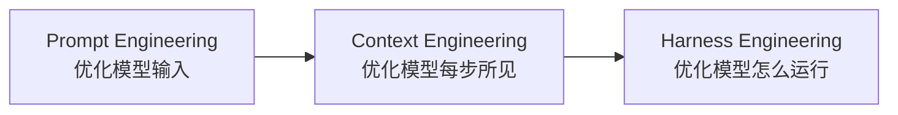
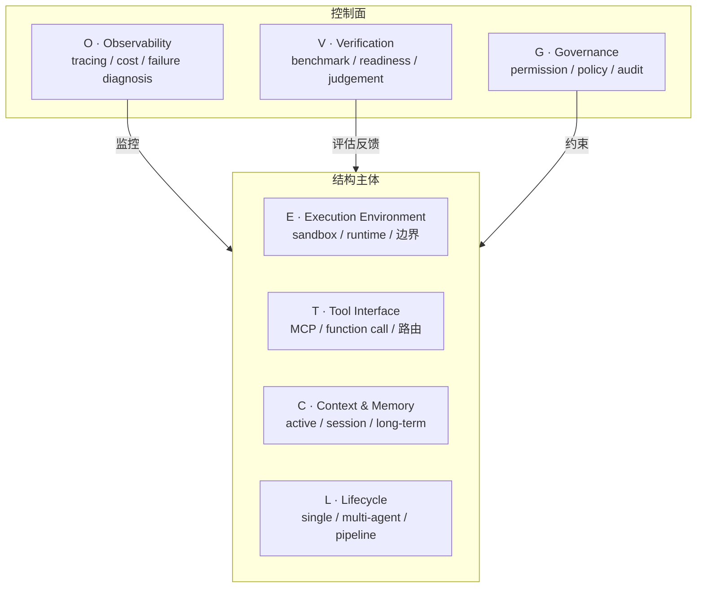
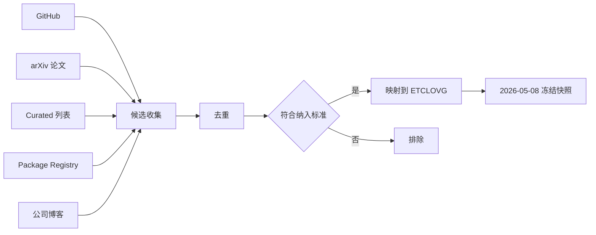
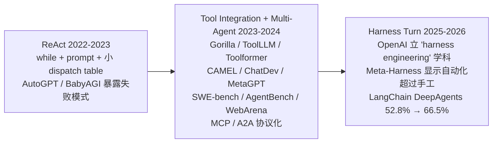

# Agent Harness Engineering 综述：ETCLOVG 七层框架总览

> 这篇综述系统性地把"agent harness"作为独立工程层面提出，给出 ETCLOVG 七层分类法，并把 170+ 开源项目映射进去。本笔记是整套笔记的入口，覆盖前两章的核心论点和分类骨架。

相关已有笔记：
- 工程化视角入门：[[00-Agent-Harness-知识全景图]]
- Claude Code 的 harness 实现：[[Claude_Code-Harness_Engineering]]
- 概念辨析：[[三个-Scaling-维度的统一框架-学习笔记]]

---

## 1. 核心命题：Harness over Model（约束在 harness，不在模型）

### 1.1 什么叫 Agent Harness（专有名词，保留原文）

Agent harness 不是"模型本身"，也不是"模型周围的所有软件"，而是把模型调用包装成"有边界、有状态、用工具完成任务"的工程层，覆盖六件事：

1. 执行底座（execution substrate）
2. 工具接口（tool interfaces）
3. 上下文控制（context control）
4. 编排（orchestration）
5. 可观测与评估反馈（observability/evaluation feedback）
6. 治理约束（governance constraints）

边界划法是**功能性的**——不是"叫什么名字"，而是"是否暴露 agent 可复用的机制"。一个 agent framework 暴露了状态编排、工具路由、运行时策略钩子、trace 捕获就在范围内；一个只是包了模型 API 的薄客户端、提示词库、静态数据集、通用容器、向量库、APM 仪表盘不算 harness——除非它们专门为 agent 执行、状态、评估或工具治理做过适配。

### 1.2 Binding-Constraint Thesis（约束绑定假说）

这是整篇综述的理论起点：**长程任务的 benchmark 表现差异，由 harness 驱动的比例可能不亚于模型本身**。

支撑证据是三组 2026 年初的实测：

| 来源 | 改动范围 | 收益 | 关键点 |
|---|---|---|---|
| Bölük (2026a) | 只改 edit-tool 格式和周围 tool harness，模型不动 | 15 个 coding benchmark 上涨幅最高 10× | 工具描述格式本身就是杠杆 |
| Trivedy (2026) | 固定 GPT-5.2-Codex，改 system prompt、中段 context injection、self-verification hooks | Terminal-Bench 2.0 从 52.8% 升到 66.5%（+13.7pp） | 单纯基础设施改造 |
| Meta-Harness (Lee et al., 2026) | 通过自动化 harness 优化 | Terminal-Bench-2 达到 76.4%，超过所有手工 harness | harness 设计可被搜索 |

把这三件事并排：模型不变，仅改 harness 就把 benchmark 涨幅推到 2–4 个百分点（即业内通常视为"重大模型进步"的幅度）的 10 倍。**模型不是天花板，harness 才是**。

### 1.3 实践-研究鸿沟（Practitioner–Research Gap）

工业界已经用了"harness engineering"这套术语在做事：

- OpenAI 在 2026-02 公开把它列为一门工程学科，5 人小组 5 个月做了百万行规模的内部产品而**几乎不手写产品代码**
- Anthropic 主张 agent 架构要"simple and inspectable"，工具要为 agent 设计而不是复用人类 API
- Martin Fowler 把它形容成 "cybernetic governors for AI agents"——给 LLM 套上前馈引导（feedforward guides）和反馈传感器（feedback sensors）

研究界则停留在分别研究 memory、tool use、planning、safety 的精细化，**没有系统研究"把这些组件粘合成可靠系统的那一层"**。综述要补的就是这条鸿沟。

---

## 2. 三段演化：Prompt → Context → Harness Engineering

> 原理：每一阶段对应一个**优化对象**的扩张，而不是替换。后一阶段把前一阶段包进去。

### 2.1 Prompt Engineering（2022–2024）

- **优化对象**：单次模型调用的输入文本
- **杠杆**：写好 instruction、few-shot example、reasoning template
- **范围**：单 input → 单 model call

### 2.2 Context Engineering（2025）

- **驱动**：agent 开始跨多步执行，问题从"输入是什么"变成"每一步模型应该看到什么"
- **优化对象**：每个推理步骤进入 context window 的完整信息状态
- **关心**：每轮注入什么、怎样检索和压缩 memory、tool 结果如何排序、context window 饱和如何处理
- **范围**：多个信息流共同灌入 context window

### 2.3 Harness Engineering（2026）

- **驱动**：模型已足够强能跑长任务，可靠性瓶颈转移到"包裹模型的那层基础设施"
- **优化对象**：governance、constraints、feedback loop、execution control 围绕模型形成的整体控制面
- **范围**：ETCLOVG 七层作为整体

三阶段不是替换关系，而是后者把前者**完全包住**。prompt engineering 仍然天天在做，只是边际工程投入正在向 harness 这一层迁移。

---

## 3. ETCLOVG 七层分类法

> 这是综述的核心贡献。把 agent harness 拆成七个独立层，每一层有自己的工程问题、工具生态、负责团队。

### 3.1 七层的角色分工

| 缩写 | 全称 | 这一层管什么 |
|---|---|---|
| **E** | Execution Environment & Sandbox | agent 的动作物理上在哪里运行；安全边界、可重置性、liveness |
| **T** | Tool Interface & Protocol | agent 能力如何被描述、发现、调用 |
| **C** | Context & Memory Management | 模型在短期 / 会话 / 长期三个时间尺度上能看到什么 |
| **L** | Lifecycle & Orchestration | 控制流如何读写状态：单 agent 内循环、多 agent 协作、issue→PR 完整任务流 |
| **O** | Observability & Operations | trace 捕获、成本、失败诊断、可靠性信号 |
| **V** | Verification & Evaluation | 把执行和 trace 转成评估、失败归因、回归反馈 |
| **G** | Governance & Security | 通过权限、身份、策略、加固、审计、人工监督来约束行为 |

前四层（E/T/C/L）是结构主体；后三层（O/V/G）是**控制面**，环绕主体进行监控、评估与约束。

### 3.2 与既往六层框架的两个不同

综述刻意把两件事提为一等公民，而不是当作 lifecycle hook 的副产物：

1. **把 Observability 提为独立层**。理由：生产里 O 有自己的工具栈（Langfuse、Arize Phoenix、OpenLLMetry）和工程实践（OpenTelemetry 仪表化、成本归因、异常检测），值得独立处理。
2. **把 Governance 引入为一等层**。它覆盖三个子层：
   - 模型层（guardrail、内容过滤）
   - 系统层（gateway、proxy、permission engine）
   - 组织层（audit、合规、human-in-the-loop）

state management 安放在 L 层而不是 G 层——因为状态服务于"被读写的执行流"，紧贴 L 的语义；lifecycle hooks 和 policy enforcement 才安放在 G 层，紧贴其他约束机制。

### 3.3 七层结构图

---

## 4. 项目语料库（148+ / 170+ 开源项目映射）

### 4.1 收集方法

构建协议（systematic mapping review 的规则）见 §2.5：

- **候选来源**：GitHub、arXiv、curated 列表、package registry、公司工程博客
- **搜索关键词**：`agent harness`、`coding agent`、`LLM agent sandbox`、`MCP server`、`agent observability`、`agent memory`、`agent evaluation`、`agent governance`
- **记录字段**：项目名、URL、artifact 类型、source 类型、可用状态、发布年份、GitHub metadata、用于编码的公开证据
- **快照时间**：2026-05-08 冻结

### 4.2 纳入与排除标准（关键判别）

纳入需同时满足三条：
1. 公开有文档
2. 实现或定义了**具体的 harness-level 机制**
3. 公开证据足以归到至少一个 ETCLOVG 层

排除：纯聊天机器人 demo、prompt pack、薄模型客户端、静态 leaderboard、未做 agent 适配的通用基础设施。

边界判断的口径："**按机制判断，不按标签判断**"——一个 README 自称 "agent" 的仓库不足以纳入；一个名义上是 evaluation 或 sandbox 的项目，只要提供了可复用的 harness 机制，就纳入。

### 4.3 语料库的局限

- 偏向英文、GitHub 可见的开源项目
- 商业生产系统在没有公开博客 / 文档 / SDK 的情况下系统性低估
- coding-agent 基础设施过度代表，因为它们 trace 最丰富
- 层的归属反映的是**公开证据**，不是真实架构——所以"在 X 层缺席"应读作"没有公开证据"，不是"没实现"

### 4.4 总体观察（§2.9）

170+ 项目映射出的生态不均匀：

- **覆盖密的层**：E（执行）、T（工具接口）、L（编排）、V（评估）——因为 coding / web / terminal / computer-use agent 必须有可运行环境、工具契约、控制循环、可重复评估
- **覆盖稀但存在的层**：C（context / memory，常嵌在更大框架里没单独发布）
- **更稀的层**：O（observability）、G（governance）——多数出现在商业平台、SDK 特性、工程博客里，**说明运行控制比运行时和 benchmark 基础设施成熟得晚**
- **跨层项目越来越常见**：sandboxing + tool protocol + orchestration + tracing + evaluation + permission 经常被打包在一起——支持"harness engineering 是集成系统问题"的核心论点

---

## 5. 三大主张（贯穿全篇）

### 5.1 Claim 1（概念性）

**harness，不是模型，是真实世界 agent 可靠性的约束绑定项。**

证据：三组 harness-only gain 都达到甚至超过同期"重大模型进步"在同 benchmark 上的幅度（参见 §1.2）。

### 5.2 Claim 2（分类性）

**ETCLOVG 七层把 Observability 和 Governance 当一等层，不是 lifecycle hook 的副产物。**

证据：O 有 Langfuse / OpenTelemetry 这套独立工具栈；G 有 permission engine / gateway / audit pipeline 这套独立工具栈；生产部署中两者由不同团队拥有。

### 5.3 Claim 3（实证性）

**170+ 开源项目映射到 ETCLOVG，暴露出生态在哪密集、哪稀疏、之前的综述缺了哪些类别。**

- **新出现的一等类别**（早期综述缺）：task runner、multi-agent orchestrator、spec-driven 开发工具

---

## 6. 历史时间线速览

三段对应"什么被工程化"的迁移：

- **ReAct 时代**（2022–2023）：observe-think-act 基础原语，infrastructure 极简（while loop + prompt template + tool dispatch table）。AutoGPT / BabyAGI 把 task queue / memory / tool dispatch 包到模型周围，但暴露的失败模式（execution runaway、context blowout、state loss、unmonitored side effect）开始被视为基础设施问题。
- **工具与多 agent 协调**（2023–2024）：Gorilla / ToolLLM / Toolformer 确立工具用法可学；CAMEL / ChatDev / MetaGPT / Mixture-of-Agents 引入多 agent 协调模式；SWE-bench / AgentBench / WebArena / GAIA 让评估基础设施成熟；MCP / A2A 协议化开始。
- **Harness Turn**（2025–2026）：累积部署证据足以证明 binding constraint 在基础设施而非模型，三件标志性事件（OpenAI 立学科、Meta-Harness 实证、LangChain DeepAgents 实测涨幅）确立了这次转向。

---

## 7. 后续笔记导航

按 ETCLOVG 顺序展开：

| 层 | 笔记 | 主要问题 |
|---|---|---|
| E | [[01-E-执行环境与沙箱]] | agent 的代码物理上在哪儿跑、用哪种 isolation |
| T | [[02-T-工具接口与协议]] | MCP / A2A / function-calling 的边界与选型 |
| C | [[03-C-上下文与记忆管理]] | active / session / long-term 三层记忆、context drift |
| L | [[04-L-生命周期与编排]] | single-agent inner loop、multi-agent pattern、issue→PR pipeline |
| O | [[05-O-可观测性与运维]] | tracing、cost optimization、reliability engineering |
| V | [[06-V-验证与评估]] | task→feedback 五阶段闭环 |
| G | [[07-G-治理与安全]] | permission、constitution、audit、攻防面 |
| 综合 | [[08-跨层综合与开放问题]] | cost-quality-speed 三难、capability-control 权衡、五大开放问题 |

---

## 8. 一句话总结

**这本综述的真正贡献不是"哪些工具属于哪一层"，而是确立了"harness 是一个独立、可衡量、可优化的工程层"——以及它的可优化幅度在 2026 年已经超过同期的模型升级幅度**。
