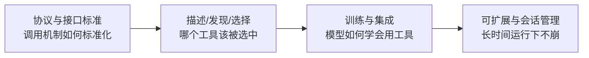

---

## title: T 层 - 工具接口与协议
tags: [agent, harness-engineering, tools, mcp, protocol, function-calling]
created: 2026-06-02
updated: 2026-06-04
source: Agent Harness Engineering - A Survey §4

# T 层：工具接口与协议（Tool Interface & Protocol）

> ETCLOVG 七层中的第二层。定义 agent 如何**发现、描述、调用**自身能力。回到 [[00-Survey总览-ETCLOVG七层框架]] 查七层全景。

相关已有笔记：

- MCP 协议入门：[[MCP_学习笔记]]
- Pi 的 tool 用法实践：[[09-Skills-按需技能]]

---

## 1. 这一层为什么难——一个根本性的张力

### 1.1 核心矛盾

工具层不是"接口设计问题"，而是一个**决策质量问题**伪装成接口设计问题。原因在于 LLM 的工作方式：模型在每一步都要看到所有可用工具的描述（schema、用途、参数），然后选一个。

由此产生一个无法回避的二元张力：


| 目标         | 工程动机        | 副作用             |
| ---------- | ----------- | --------------- |
| **扩大能力覆盖** | agent 能做更多事 | tool menu 变长    |
| **保护决策质量** | 选对工具、参数对    | tool menu 必须保持小 |


**为什么 menu 大会伤害决策？** 三个机制叠加：

1. **Prompt entropy 上升**——每个工具的 description 都进了上下文。100 个工具 × 平均 200 token = 20K token 用在"还没开始干活"上
2. **Planning branching 爆炸**——在每个决策点 LLM 都要评估"这 100 个里哪个对"，错选率随 menu 大小近似线性上升
3. **Token overhead 推高成本和延迟**——每轮对话都要重复加载这堆 schema

生产部署的工程经验反复证实：**过大的 tool menu 会降低可靠性、增加 token 开销、放大 planning error**。这不是优化问题，是结构性约束。

### 1.2 这一层切成四个子方向

综述把 T 层的研究空间分成四块。它们不是平行罗列，而是**沿一条因果链**展开——前一块定义"调用怎么发生"，后一块解决"调用规模化后崩在哪"：




---

## 2. Protocol & Interface Standards（协议与接口标准）

### 2.1 关键 reframe：按"集成边界"分类，而不是按厂商

#### 传统分类法的失效

工程师初看这块经常困惑：MCP、A2A、function calling、OpenAPI、AGENTS.md……它们到底是竞争关系还是互补关系？是不是新的取代旧的？

按厂商或时间线分类（"OpenAI 的 function calling 出现在 X 年，Anthropic 的 MCP 出现在 Y 年"）会得出"它们在争夺同一块地"的错误结论。

#### 原理：每个标准跨越一条不同的"集成边界"

正确的分类轴是**这个标准在系统的哪两个组件之间架桥**——这就是 *integration boundary*。

四种边界：


| 边界                              | 含义                     | 类比               |
| ------------------------------- | ---------------------- | ---------------- |
| **Model ↔ Function**            | 把模型自然语言输出结构化成可执行函数调用   | 编译器前端：自然语言 → AST |
| **Agent ↔ External Capability** | agent 运行时与工具/资源解耦，按需发现 | 操作系统的系统调用接口      |
| **Agent ↔ Agent**               | 跨进程的 agent 委派与协作       | 微服务之间的 RPC       |
| **Agent ↔ Repo / Environment**  | 把工具用法和约束写进版本控制         | README 之于人类开发者   |


#### 推论：常被对立的标准其实职责不重叠

按这个轴看，MCP vs A2A、function calling vs OpenAPI 这些"看似在打架"的对比都站不住——**它们各占一条边界**，互补而非竞争。

#### 可视化：协议的拓扑位置

```
┌─────────── agent ───────────┐
│                             │
│   LLM  ──function calling──── runtime
│                             │
└──────────────┬──────────────┘
               │
       ┌───────┼───────┬──────────┐
       │       │       │          │
      MCP   OpenAPI   A2A    AGENTS.md
       │       │       │          │
       ▼       ▼       ▼          ▼
     工具    REST    其他      项目
            服务    agent      仓库
```

这张图揭示一个容易被忽视的事实：**function calling 在 agent 框框内部，其他四个协议都从 agent 框框跨出去到外部实体**。

- **横线（agent 内部协议）**：function calling 连接的是同一个 agent 里的两个组件——LLM 负责生成决策，runtime 负责执行
- **竖线（agent 跨边界协议）**：MCP/OpenAPI 接外部工具、A2A 接其他 agent、AGENTS.md 接项目仓库

所以"agent 系统的协议标准"既包含**内部组件协议**（function calling），也包含**跨边界协议**（其他四个）。综述用 *integration boundary* 而不是 "agent interface" 这种以 agent 为中心的措辞，正是因为 agent 在某些边界上不是端点，而是**横跨两端**。

### 2.2 标准对照表

> ● 一等支持　◐ 部分或惯例支持　○ 不在范围


| 边界                 | 标准                   | Wire 格式  | Typed | Runtime discovery | Long-running |
| ------------------ | -------------------- | -------- | ----- | ----------------- | ------------ |
| Model ↔ Function   | Function calling     | JSON     | ●     | ○                 | ○            |
| Agent ↔ Capability | **MCP**              | JSON-RPC | ●     | ●                 | ◐            |
| Agent ↔ Capability | OpenAPI              | HTTP     | ●     | ◐                 | ○            |
| Agent ↔ Agent      | **A2A**              | JSON-RPC | ●     | ●                 | ●            |
| Agent ↔ Agent      | ACP / ANP            | HTTP     | ●     | ●                 | ●            |
| Agent ↔ Repo/Env   | AGENTS.md / AGENT.md | Markdown | ○     | ◐                 | ○            |


读表的关键：四个维度反映的是不同边界的需求差异。比如 **Long-running** 列里只有 Agent↔Agent 类标准一等支持——因为 agent 之间委派的任务可能跑几分钟到几小时，而 Model↔Function 单次调用通常是毫秒级，根本不需要这个能力。

### 2.3 各标准的定位详解

#### Function calling（Model ↔ Function 边界）

**解决的问题**：LLM 输出的是自然语言文本，但运行时需要的是"调用 `send_email(to=..., subject=...)`"这种结构化指令。Function calling 把这个翻译过程**operationalize**——固定为 JSON schema 描述工具 + 模型输出 JSON 形式的 call + 运行时返回 JSON 形式的 result。

**为什么需要它**：没有 schema，模型可能输出 `给张三发邮件标题是问候`，运行时无法可靠解析出参数。有了 schema 约束，模型的输出被强制成机器可读格式。

**局限**：不管 discovery——所有工具都得在 prompt 里预先列出，不能"运行时去问还有什么工具可用"。

#### MCP（Agent ↔ External Capability 边界）

**Model Context Protocol** 已成为 coding/enterprise agent 最可见的工具集成基础。

**核心架构**：host-client-server 三方

- **host**：agent 进程
- **client**：host 内的连接管理器
- **server**：独立进程，暴露 tools / resources / prompts 三类能力

**为什么这套架构有价值**：

1. **Schema 层互操作**——server 用 JSON-RPC 暴露类型化接口，任何 MCP 兼容的 host 都能用
2. **生态流动性**——agent builder 可以复用别人写好的 server catalog（GitHub、文件系统、数据库……），不必为每次部署写自定义连接器。这是比"标准化数据格式"更深层的价值

**边界**：Agent ↔ External Capability。MCP 不管 agent 之间怎么通信（那是 A2A 的事），也不管模型输出怎么变 JSON（那是 function calling 的事）。

详见 [[MCP_学习笔记]]。

#### A2A（Agent ↔ Agent 边界）

**A2A 的目标和 MCP 完全不同**：不是把工具暴露给一个 agent process，而是**让多个不透明的 agent process 互通**。

**关键能力**：

- **Discovery**：通过 Agent Card 找到对方提供什么服务
- **同步与流式交互**：短任务直接 request/response，长任务通过 streaming
- **Long-running task 协作**：A 委托 B 一个跑 30 分钟的任务，期间 B 可以汇报进度、A 可以查询状态

**为什么必须长任务一等支持**：agent 委派的工作往往是"调研 X 后产出报告""完成代码 review"这种数分钟到数小时级别的任务。如果协议假设"调用必须在几秒内返回"，整个协作模式都无法成立。

#### MCP vs A2A：互补而非竞争

按边界看清楚就一目了然：

- MCP 走 **tool/context access**——agent 拿能力
- A2A 走 **inter-agent delegation/collaboration**——agent 拿另一个 agent

一个真实 agent 系统通常同时用两者：通过 MCP 访问 GitHub/数据库，通过 A2A 委托另一个专业 agent 做代码 review。

#### OpenAPI（Agent ↔ External Capability 的另一选择）

**和 MCP 占同一边界，但风格不同**：

- 走 HTTP（不是 JSON-RPC over stdio/SSE）
- 提供语言无关的机器可读 API 契约
- 许多 agent framework 当作 tool generation 和 validation 的来源——读 OpenAPI spec 自动生成 function calling schema

**典型用法**：已有 REST API 的系统不必单独写 MCP server，直接把 OpenAPI spec 喂给 agent framework 即可。

#### AGENTS.md / AGENT.md（Agent ↔ Repo/Env 边界）

**完全不同维度的标准**：不是 wire protocol，而是 repo 根目录的 Markdown 文件，把工具用法和工作流约束**直接编码到版本控制里**。

**解决的问题**：coding agent 进入一个陌生 repo，怎么知道"这个项目的测试命令是 `pnpm test` 不是 `npm test`"、"提交前必须跑 lint"？没有这种文件，每次都要 agent 自己探索；有了，setup 摩擦消失。

**为什么是"轻量"选择**：不需要任何运行时机制，纯文本约定。代价是不能动态发现新工具，但适合稳定的项目级约束。

---

## 3. Tool Description / Discovery / Selection（描述、发现、选择）

### 3.1 协议解决了"怎么调用"，但没解决"调用哪个"

协议层规定了 wire format 和发现机制。下一个瓶颈是：**当 menu 有 100 个工具时，每一步该浮现哪几个工具供模型选择？**

这是检索问题（retrieval）伪装成 agent 问题。

### 3.2 主要研究方向


| 系统 / 工作                               | 关注点                                         | 解决的具体问题                                      |
| ------------------------------------- | ------------------------------------------- | -------------------------------------------- |
| **EASYTOOL**                          | 从大型工具清单里选合适工具                               | 简化 tool description、压缩 selection prompt      |
| **AnyTool / CRAFT**                   | 自动构造或精化 tool-use pipeline                   | 降低人工指定每个工具用法的负担                              |
| **MetaTool**                          | benchmark 评估 tool retrieval 与 invocation 质量 | 揭示不同 domain 与 query 形式间差异极大                  |
| **MCP-Zero / ToolRet / ToolRegistry** | retrieval-aware orchestration、registry 质量   | 把 tool 发现做成一阶能力，而不是塞 prompt                  |
| **SkillRouter / SkillRet**            | 把"工具选择"扩展到**可复用 skill 选择**                  | agent 要找的不只是 API schema，还有 procedural module |


最后一个值得展开：**skill 是比 tool 高一层的抽象**。一个 skill 可能是"如何处理客户退款"这样的多步流程，封装了"调用哪些 tool、按什么顺序、出错怎么办"。Skill 选择问题和 tool 选择问题同构，但粒度不同。参考 [[09-Skills-按需技能]]。

### 3.3 从系统层证据归纳的两条设计原则

#### 原则 1：工具少而精胜过暴力多

**为什么**：直接对应 §1.1 的三个机制——减小 prompt entropy、planner branching、token 成本。

**怎么应用**：宁可写 5 个高质量、覆盖核心场景的工具，也不要堆 50 个细粒度工具让模型每步都纠结。

#### 原则 2：Discovery 管线必须自适应

**为什么**：静态/全局工具列表无法跨快速演化的 repo 或多租户企业部署。一个企业 agent 可能服务多个客户，每个客户有自己的 CRM、自己的内部工具——硬编码的 menu 必然过时。

**怎么应用**：把 tool registry 设计成可查询的服务（"现在这个 context 下，相关工具是哪些？"），而不是部署时固定的列表。

---

## 4. Tool-Augmented Training & Integration（工具增强训练与集成）

### 4.1 模型侧：教模型学会调用工具


| 工作                                | 贡献                                                            |
| --------------------------------- | ------------------------------------------------------------- |
| **Toolformer**                    | 用 self-supervision 学习"什么时候/在哪儿插入 API call"                    |
| **Gorilla / ToolLLM / ToolBench** | 更大工具语料 + instruction tuning + execution-centric supervision   |
| **ToolkenGPT / CREATOR**          | token-level 或 controller-style 集成，提高 call 格式保真度和 planning 稳定性 |


**关键差异**：

- Toolformer 解决的是**时机问题**——模型本来不知道"算这个数应该调计算器而不是自己算"
- Gorilla 系列解决的是**规模问题**——工具多了以后调用对的工具
- ToolkenGPT 解决的是**格式问题**——把"调用工具"做成 token 级的一等操作，而不是事后解析

### 4.2 生产 harness 侧：运行时栈

模型侧进展通常与运行时栈搭配出现：

**LangChain、Semantic Kernel、smolagents** 提供：

- **memory abstraction**：把对话历史、工具调用结果组织起来
- **routing middleware**：决定一次 query 走哪条 chain
- **tool adapter**：把已有 API 包装成模型能调用的 tool

**为什么模型侧 + 运行时侧必须配套**：再强的模型也需要运行时把它的输出接到真实系统上；再好的运行时框架，模型不会用工具也白搭。

### 4.3 Coding Agent 暴露的第二类工具——agentic code reasoning

#### 不只是"执行型工具"

传统理解的 tool 是有副作用的：执行命令、读写文件、调 API。

但 coding agent 还需要另一类工具：**静态分析、type checker、solver-backed verifier、proof assistant、patch equivalence / fault localization checker**。这些工具**不执行代码**，但提供"代码会怎么行为"的判断。

#### Agentic code reasoning 框架

**Ugare & Chandra (2026)** 把这种模式框架化为 *agentic code reasoning*：agent 探索 repo、就代码行为推理，**不必执行**。

**为什么这是新东西**：它落在两个极端之间——

- 一端是无结构的 chain-of-thought（agent 自己脑补代码会怎么跑）
- 另一端是完全 formal verification（用定理证明器严格证明）

semi-formal reasoning 强制 agent **陈述前提、跟踪程序路径、推导显式结论**。在 patch 等价验证、fault localization、代码问答上比纯 CoT 准、比 formal 便宜。

#### 对 T 层的工程含义

自动化推理工具应当返回**承载证据的产物**（trace、proof obligation、counterexample、structured certificate），**而不只是 black-box yes/no**。

**为什么**：agent 拿到 "true/false" 没法继续推理；拿到 counterexample 可以理解"为什么 fail"并调整。工具输出的信息密度直接决定下游推理能不能链上。

### 4.4 三方耦合结论

证据综合：**tool competence 由三个东西共同决定**——

```
tool competence = pretraining/fine-tuning signal  
                × interface schema 质量  
                × runtime selection policy
```

**改一个，收益有限**：

- 只优化 schema 但模型没学过工具调用 → 模型乱用
- 模型很强但 schema 写得烂 → 调用格式错误
- 前两者都好但 selection policy 把工具淹没在 menu 里 → 模型根本看不到该用的工具

工程实践含义：**评估 agent 的工具能力时，必须把这三层看成一个系统**。单测某一层意义有限。

---

## 5. Scalability & Session Management（可扩展性与会话管理）

### 5.1 Stateful tool session 的两难

工具调用如果是 stateless 的（每次独立），简单但失去连续性——比如 SQL session 里的临时表会丢、shell session 里的 cwd 不保留。

工具调用如果是 stateful 的（保持 session），continuity 好，但**增加 bookkeeping 复杂度**——特别是 call 被并行化或跨多个 agent 委派时。

### 5.2 三种常见失败模式


| 失败模式                                                  | 表现               | 触发场景                     |
| ----------------------------------------------------- | ---------------- | ------------------------ |
| **Stale handle**                                      | session 持有的引用已失效 | 服务端重启、超时回收，但 agent 仍持旧句柄 |
| **Inconsistent tool state across retry**              | 重试时工具状态不一致       | 第一次调用部分成功，重试时已不是初始状态     |
| **Context-window saturation from verbose tool trace** | 冗长的工具痕迹把上下文窗口撑爆  | 长 session 累积的工具输出无人清理    |


**第三个最阴险**：不是直接报错，而是慢慢吃掉上下文额度，导致 agent 在某一步"忘了"早期决策。

### 5.3 有效 harness 设计需要的三件事

1. **Tool session 的显式生命周期控制**——明确何时创建、何时销毁、何时主动失效。不能让 session 默默累积或默默消亡
2. **有界的 tool context injection**——往 prompt 里塞的工具结果必须有上限，超出要总结或丢弃
3. **Observability hook 区分 planner 逻辑错误 vs 接口/协议失败**——不能让"模型选错工具"和"工具调用失败"混在同一类错误里

第三点是 T 层与 [[05-O-可观测性与运维|O 层]] 的接口：**协议设计要从一开始就考虑可观测性**，事后加监控成本很高。

---

## 6. 本层小结

### 6.1 核心约束总览


| 约束            | 表现                                                                  | 工程对策              |
| ------------- | ------------------------------------------------------------------- | ----------------- |
| **菜单越大决策越糟**  | tool count 推高 prompt entropy、planning error、token 成本                | 少而精；自适应 discovery |
| **协议生态层级不重叠** | MCP / A2A / function calling / OpenAPI 占的是不同 *integration boundary* | 按边界选标准，不按时髦选标准    |
| **能力的三方耦合**   | 训练信号 × schema 质量 × runtime selection policy 共同决定 tool competence    | 评估时三层一起看          |
| **会话长跑要可观测**  | bookkeeping、stale handle、context bloat 必须由 [[05-O-可观测性与运维           | O 层]] 配合诊断        |


### 6.2 T 层与 E 层的关系——capability/control 张力

T 层和 [[01-E-执行环境与沙箱|E 层]] 是**互补面**：

- **E 层**管"执行后的爆炸半径"——一旦工具被调用，怎么限制它能造成的伤害
- **T 层**定义"哪些动作根本不准发生"——通过控制 tool menu 决定能力边界

**只有两者结合才构成完整的 capability-control 权衡**：

- 光有 E 没有 T：menu 暴露 `rm -rf /`，沙箱也救不了误删
- 光有 T 没有 E：menu 控得很严，但允许的命令一旦写错参数还是出事

这条 capability-control 张力会在 [[08-跨层综合与开放问题]] 作为系统级现象重现——它不只是 T 和 E 的局部问题，是整个 agent 设计的元约束。