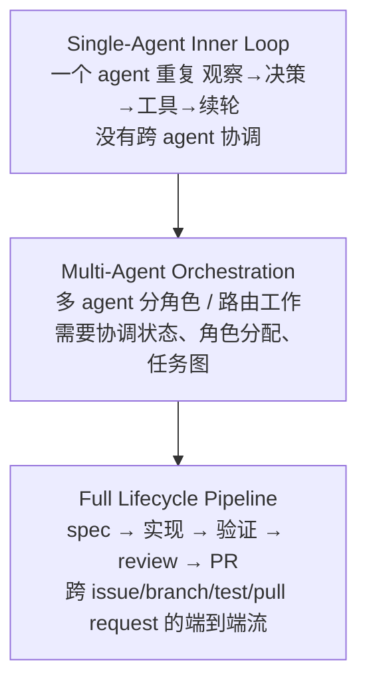
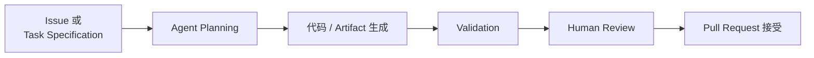
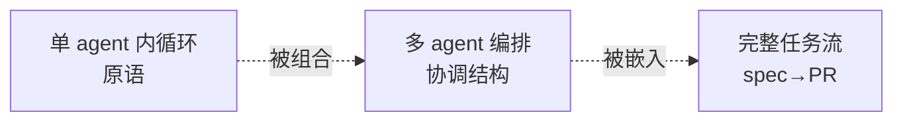

# L 层：生命周期与编排（Lifecycle & Orchestration）

> ETCLOVG 七层中的第四层。回答"控制流如何读写状态"——单 agent 内循环、多 agent 协作、issue→PR 完整任务流。回到 [[00-Survey总览-ETCLOVG七层框架]] 看七层全景。

相关已有笔记：
- agent loop 心跳骨架的工程化展开：[[00-Agent-Harness-知识全景图]]
- 单 agent 模块交互图解：[[01-Agent-Loop-模块交互]]
- 实战实现：[[22-从零到一搭建-Agent-完整技术文档]]

---

## 1. L 层的核心定位

L 层把过去在不同 framework 里分别讨论的两件事**合并**为一层：

1. **agent 的执行流**（execution flow）——control flow 怎么走
2. **流读写的运营状态**（operational state）——state 怎么持久

长程任务的可靠性不只取决于"模型能否产出好的下一个 action"，还取决于 harness 能否：

- 记住已经发生过什么
- 决定接下来该发生什么
- 从错误中恢复
- 协调 subtask
- 在任务完成时停下来

L 层与其它层的边界：

| 层 | 关心什么 |
|---|---|
| **L** | harness 自己用来 continue / coordinate 的**运营状态**（pending subtask、checkpoint、retry、共享 artifact、execution status） |
| **[[03-C-上下文与记忆管理\|C]]** | 给模型 reason 用的信息（retrieved doc、memory、conversation history） |
| **[[05-O-可观测性与运维\|O]]** | logging / tracing / monitoring system behavior |

---

## 2. 三个组织层级

每层把前一层当**执行原语**：multi-agent 用多个 single-agent loop 做基本单位，full pipeline 把 multi-agent 编排放进 issue-to-PR 的更大流程里。

---

## 3. Lifecycle State Management（状态管理）

> 跨 turn / session / failure / handoff 继续 agent 运行所需的运营状态。包含 pending subtask、tool 结果、中间 artifact、repo 改动、coordination metadata、session persistence、checkpoint resume 机制。

### 3.1 核心权衡：Stateless 还是 Stateful

| 设计 | 优点 | 缺点 |
|---|---|---|
| **Stateless replay** | reproducibility、auditability 好 | trajectory 增长后**回放成本飙升** |
| **Stateful execution** | 状态外置到文件 / repo / DB / task graph / 服务，**continuity / recovery 好** | 一致性问题、调试更难 |
| **Hybrid**（多数生产系统） | 保留可回放历史的同时依赖持久 artifact | — |

### 3.2 与 C 层 / O 层 的区分

- 与 C 层不同：C 是模型读，L 是 harness 读
- 与 O 层不同：O 是看现象，L 是用状态决定接下来做什么

---

## 4. Single-Agent Inner Loop（单 agent 内循环）

> agent 系统的基本执行单元。**一个 agent 反复跟环境通过工具和反馈交互，无显式跨 agent 协调**。

### 4.1 概念骨架

沿用 **ReAct 范式**（Yao et al., 2023）：交错 reasoning、action、observation。如 OpenAI 在 Codex agent loop 分析里强调——这种系统的行为**不仅由模型决定，还由 harness 决定**：harness 构造 prompt、调工具、管控制流、把工具输出喂回后续步骤。

### 4.2 执行模型的关键分裂

| 模型 | 描述 | 代表 |
|---|---|---|
| **Stateless replay** | 从记录的 interaction history 重建运行 | Codex CLI |
| **Hybrid** | 可回放历史 + 持久化 artifact（file / repo / session state） | OpenCode、Claude Code、Gemini CLI、Aider、SWE-agent |

### 4.3 主流系统对照

| System | GitHub Stars (k) | Pattern | Execution Model |
|---|---|---|---|
| OpenCode | 159 | Single loop | Hybrid |
| Claude Code | 123 | Single loop | Hybrid |
| Gemini CLI | 104 | Single loop | Hybrid |
| Codex CLI | 82 | Single loop | Stateless replay |
| Aider | 45 | Single loop | Hybrid |
| SWE-agent | 19 | Single loop | Hybrid |

### 4.4 单循环的局限

灵活度高，但**长程执行容易出现**：

- context fragmentation
- accumulated error
- weak decomposition structure

这些恰是多 agent 编排试图弥补的。

---

## 5. Multi-Agent Orchestration（多 agent 编排）

> 单 agent 循环的延伸：用多个**有专门角色**的 agent 组合，替代一个 agent 独自 plan / execute / check / revise。

### 5.1 五种主要 pattern

| 模式 | 描述 |
|---|---|
| **Hierarchical orchestration** | 上层 controller 把工作分给 agent / subagent 并整合输出 |
| **Team orchestration** | 一组专门 agent 互相协调，通常用 named role |
| **Workflow orchestration** | agent + tool 组织进显式阶段或控制逻辑 |
| **Fan-out** | 多 agent 并行探索多样化解 |
| **Graph composition** | agent / tool / state 作为 interaction graph 的 node，多种 coordination 模式可共存 |

### 5.2 代表系统对照

| System | GitHub Stars (k) | Primary Pattern | Execution Model |
|---|---|---|---|
| DeerFlow | 67 | Hierarchical | Stateful |
| AutoGen | 58 | Hierarchical | Stateful |
| oh-my-claudecode | 34 | Team | Stateful |
| LangGraph | 32 | Graph composition | Stateful |
| Semantic Kernel | 28 | Workflow | Stateful |
| OpenAI Agents SDK | 26 | Hierarchical | Hybrid |
| DeepAgents | 23 | Hierarchical | Stateful |
| Hive | 10 | Graph composition | Stateful |
| Emdash | 4 | Fan-out | Hybrid |

### 5.3 状态特征

multi-agent 系统通常**Stateful 或 Hybrid**——必须维持 coordination state、role assignment、task graph、共享 artifact 或中间结果。

Anthropic 的 **planner–generator–evaluator** 架构是更广原则的实例：把 planning / execution / verification **分到显式角色**——提高分解和鲁棒性，**代价是 coordination overhead 增加**。

---

## 6. Full Lifecycle Pipeline（完整任务流：issue → PR）

> 把端到端 task workflow 从 spec 一路管到 validated output。焦点不只是 agent 怎么互动，而是 harness 怎么支撑 long-horizon 跨 planning / implementation / validation / review / delivery 的执行。

### 6.1 核心抽象：Task Runner

Task runner = 管控**完整任务生命周期** 的 scheduling、state persistence、retry、validation、iterative refinement 的 harness。

执行**接地在持久 artifact**：repository、issue、branch、file、test、pull request。典型 workflow：

### 6.2 代表系统

| System | GitHub Stars (k) | Execution Model |
|---|---|---|
| Vibe Kanban | 26 | Stateful |
| Symphony | 24 | Stateful |
| GitHub Agentic Workflows | 5 | Hybrid |

### 6.3 概念组合

这些系统是前两层抽象的**组合**：

- single-agent loop 提供**执行原语**
- multi-agent pattern 提供**协调能力**
- task runner 把两者集成进 end-to-end workflow——**人定方向，agent 执行**

---

## 7. 本层小结

### 7.1 三层组织级别 + 状态特征

| 层级 | 单元 | 典型状态特征 |
|---|---|---|
| **Single-Agent Inner Loop** | 一个 ReAct 循环 | Stateless replay 或 Hybrid |
| **Multi-Agent Orchestration** | 多 agent 角色 + 协调结构 | Stateful 居多 |
| **Full Lifecycle Pipeline** | 跨 spec / impl / review / PR 的 task runner | Stateful 居多 |

### 7.2 三个层级的关系

### 7.3 L 层向下游的影响

- 与 [[03-C-上下文与记忆管理|C 层]] 联动：sub-agent isolation 与 cross-run injection 这类技术既是 C 的也是 L 的——**它们是 orchestration 决策驱动的 context 操作**
- 与 [[05-O-可观测性与运维|O 层]] 联动：task runner 的 trace 是 O 层的主要数据源
- 与 [[06-V-验证与评估|V 层]] 联动：full pipeline 是评估的天然单位——结果 = 一个 PR 是否通过 test 并被接受

L 层把"agent 怎么继续做下去"作为独立工程问题处理，把 reliability 从**模型的偶发能力**转成**harness 的可设计属性**。
