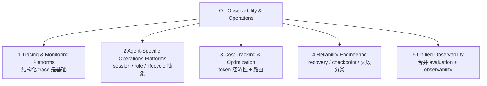

# O 层：可观测性与运维（Observability & Operations）

> ETCLOVG 七层中的第五层，也是综述把"lifecycle hook 副产物"提升为**一等层**的两层之一（另一是 [[07-G-治理与安全|G 层]]）。回到 [[00-Survey总览-ETCLOVG七层框架]] 看七层全景。

---

## 1. 为什么独立成层

理由：

- 有**独立工具栈**——Langfuse、Arize Phoenix、OpenLLMetry、AgentOps SDK
- 有**独立工程实践**——OpenTelemetry 仪表化、token 成本归因、anomaly detection
- 生产部署中**由不同团队拥有**

把它当作"observability hook 的附属"会错过这一层的完整结构。

---

## 2. 子分层全景

---

## 3. Tracing & Monitoring Platforms

### 3.1 基础：结构化 trace 收集

> 记录每次 LLM call、tool invocation、retrieval step、context-assembly 操作作为可检视、可过滤、可回放的**span 树**。

**应用层平台**——Langfuse、Opik（Comet ML）、Arize Phoenix、MLflow——提供 latency flame chart、token-usage 拆分、cost attribution、prompt 版本化。它们通常通过轻量 SDK wrapper（如 `@traceable` decorator）ingest trace，agent 函数调用代码改动极小。

### 3.2 OpenTelemetry 作为事实标准

OTel 社区发布了生成式 AI 的 **semantic convention**——定义 model name、temperature、token count、latency 的 span attribute。两个开源项目把这套约定 operationalize：

| 项目 | 关键功能 |
|---|---|
| **OpenLLMetry**（Traceloop） | 为 LLM provider（OpenAI / Anthropic / Cohere）和向量库（Pinecone / Chroma / Weaviate）做 auto-instrumentation，发标准 OTel span / metric |
| **OpenInference**（Arize AI） | OTel 对齐的 semantic convention 和 auto-instrumentation，作为 Phoenix 的伴侣规范 |

**工程价值**：让 agent trace 流入团队已有的 Prometheus / Jaeger / Grafana / Datadog 后端——**降低引入 agent-specific 工具的运维 overhead**。

### 3.3 学术工作（超越应用层 decorator）

| 系统 | 创新点 |
|---|---|
| **AgentSight** | 用 **eBPF 在应用进程外部**监控 agent；TLS 加密的 LLM 流量在 SSL 边界截获；kernel 事件（process creation、file I/O、network call）捕获 action；real-time correlation engine 把 LLM 响应与触发的系统行为关联；secondary "observer" LLM 做语义分析识别风险；framework-agnostic、零代码改动、CPU overhead < 3% |
| **AgentTrace** | schema-based logging：跨**三个 surface**捕获结构化日志：cognitive（reasoning step、plan、reflection）、operational（tool call、API interaction）、contextual（环境状态、user input）。统一 envelope 与 OTel 集成 |

> **AgentSight 的结构优势**：system-level 监控**不可被被 compromise 的 agent 绕过**——这对 safety-critical 部署特别重要
>
> **cognitive surface 的特别用途**：捕获 reasoning artifact、plan、reflection、self-correction——为 reasoning 错误（而非 system 错误）的 debug 提供原始材料

---

## 4. Agent-Specific Operations Platforms

> 通用 trace 平台把抽象建在 LLM call / tool call / retrieval step 上。Agent-specific 平台加一层抽象，捕获 **agent-level** 关注：multi-step session tracking、agent identity / role management、tool selection policy、cross-session state handoff。

| 平台 | 设计要点 |
|---|---|
| **AgentOps SDK** | hierarchical span model：session / agent / operation 或 task / tool call / LLM call，每层贴着 agent lifecycle 而非孤立 API call |
| **RagaAI Catalyst** | 针对 RAG 和 multi-agent workload 的质量 / safety dashboard，浮出 retrieval-level 和 agent-level 异常 |
| **Laminar** | OSS-first agent observability，组合 trace / evaluation / prompt management |

### 4.1 学术形式化

| 工作 | 贡献 |
|---|---|
| **Moshkovich & Zeltyn (2025)** | 六阶段 AgentOps automation pipeline：observe → collect metric → detect anomaly → root-cause → recommend fix → automate remediation；四种 stakeholder：developer / tester / SRE / business user |
| **Moshkovich et al. (2025) 实证** | 引入 **task-flow discovery** 作为 observability 原语；用户研究：79% 从业者把**非确定性执行流**列为 agent 系统最显著挑战 |
| **NLAH framework**（Pan et al., 2026） | 把 harness 本身当**一等研究对象**；通过系统 ablation 量化各模块（tool registry / permission system / hook / skill / context folding）对 agent 性能的贡献——**harness 不只是被监控的对象，更是干预的来源**：每个模块都可被 observability pipeline 标注并调整 |

### 4.2 Cognitive Observability

把 agent-level 监控从"agent 做了什么"扩到"agent 为什么这么做"：

| 系统 | 方法 |
|---|---|
| **Watson**（Rombaut et al., 2025） | 部署"surrogate agent"复现主 agent 输出，同时通过 prompt attribution 生成逐 step reasoning trace；MMLU / SWE-bench-lite / AutoCodeRover / OpenHands 上证明恢复出的 reasoning trace 对 manual debugging 和 automated correction 都有用 |
| **AgentLens**（Lu et al., 2024） | 三窗可视化：Outline / Agent / Monitor——把原始 execution log 转成层级化的 behavioral narrative；14 人用户研究显示对复杂 analytical task 比 replay-only baseline 改善显著 |
| **claude-code-reverse** | reverse-engineer 特定 coding agent 的 interaction chain，作为理解 harness-level 行为的**研究 artifact** |

---

## 5. Cost Tracking & Optimization

> LLM 推理按 token 计价；agent harness 把成本暴露放大——一个 user-facing task 可能触发数十次 LLM call。可观测性需求是双重的：
>
> 1. **Tracking**——知道 token 花在哪
> 2. **Optimization**——同样结果用更少 token

### 5.1 Tracking 侧

| 工具 | 设计 |
|---|---|
| **TensorZero** | 统一 LLMOps stack：gateway / observability / experimentation / optimization 单一服务，支持 per-call / per-task cost attribution |
| **Helicone** | 极简的 drop-in proxy，加成本 / 延迟监控**零代码改动**——给只要 cost visibility 的团队特别友好 |

### 5.2 Optimization 侧

| 工作 | 策略 |
|---|---|
| **FrugalGPT**（Chen et al., 2023） | 三策略：prompt adaptation、LLM approximation、LLM cascading；自适应 output 用便宜模型路由简单 query，可达 GPT-4 性能但**成本降 98%** |
| **GPTCache**（Bang, 2023） | 语义缓存层，**embedding 相似度**拦截 repeated / paraphrased query 在到达 LLM 前 |
| **QC-Opt** | quality-aware 框架，在预算约束下联合优化 model / token / latency，用 BertScore predictor 估输出质量而**不必调 target model** |
| **TALE**（Han et al., 2025） | 揭示 **token elasticity 现象**：把 token budget 设得过低反而**增加** token 消耗——因为模型在 budget 内 overflow，产出比合理 budget 还多的 token |
| **Dual-Pool Token-Budget Routing**（Liu et al., 2026b） | 从 serving 侧解决：把同质 vLLM fleet 分成 short-context / long-context pool，按估算 token budget 路由请求；Azure LLM Inference trace + LMSYS-Chat-1M 实测 GPU-hour 降 31–42 %（A100 fleet 投影年省 286 万美元） |

### 5.3 工程含义

成本可观测性必须**跨多层**：

- **API 层** token tracking（Helicone / TensorZero）
- **应用层** routing 决策（FrugalGPT / QC-Opt）
- **基础设施层** resource utilization（Dual-Pool / KV-cache occupancy）

**Anthropic 关于 infrastructure noise 的研究**给出警示：infrastructure 配置本身就能让 benchmark score 偏移 6 个百分点（p < 0.01）——**cost 优化与 evaluation fidelity 紧密耦合**。砍资源省成本可能在不被细粒度可观测性发现的情况下静默退化 agent 性能。

---

## 6. Reliability Engineering

> Failure recovery、checkpoint / resume、retry 策略、session recovery 在 agent 跨多 context window 时变得尖锐——每个新 session 起始时**没有任何上文记忆**。

### 6.1 Anthropic 识别的四种 long-running coding agent 失败模式

1. agent 试图**一次性 one-shot** 整个 task
2. agent **过早宣称项目完成**
3. agent 在 session 间**留下损坏环境**
4. agent **没做合适测试就标 feature done**

### 6.2 双部分解决方案

**初始化 agent**：把任务分解成结构化 feature list + 设置进度追踪 artifact（git repo、progress file、init script）；**coding agent** 增量做单 feature，每次留干净 handoff state。

### 6.3 后续演进

| 演进 | 关键点 |
|---|---|
| **Anthropic 三 agent GAN 启发架构**（planner / generator / evaluator） | 引入 **sprint contract** 与分离的 self-evaluation，治"agent 过度自夸"的倾向 |
| **从 Opus 4.5 → 4.6 的反向调整** | 完全**移除** sprint construct 和 context engineering，成本从 200 美元 → 125 美元而**输出质量不变**——说明 harness 复杂度应跟随模型能力 |
| **核心原则** | **每个 harness 组件编码一条"模型自己做不到"的假设**；模型增强后这些假设会过时 |
| **Anthropic Managed Agents** | "brain"（harness + LLM）与 "hands"（sandbox + tool）解耦，每边可独立恢复。harness 崩溃 → 新实例 `wake(sessionId)` 接续；sandbox 崩溃 → harness 抓 tool-call failure 并 provision 新的。Credential 存外部 vault，**不进 sandbox**。把组件从 "pet"（不可替代、手工照看）转成 "cattle"（可替换、自动重新置备）——大规模可靠运营 agent 的前置条件 |

### 6.4 学术 failure 分类

| 工作 | 关键发现 |
|---|---|
| **MAST**（Cemri et al., 2025） | 把 multi-agent failure 分 14 mode 三族：系统设计问题 / agent 间错位 / task verification 问题（κ = 0.88） |
| **AgentErrorTaxonomy**（Zhu et al., 2025） | 按模块（memory / reflection / planning / action / system）分解，**error propagation——单一 root-cause 沿后续决策级联——是中心 reliability 瓶颈**；AgentDebug 框架隔离 root cause 提升 26% 相对 task success |
| **Vinay (2025)** | 15 种生产 LLM 部署独有的 hidden failure mode 系统级分类：*version drift*（模型升级静默改变行为）、*cost-driven performance collapse*（激进优化降质）、*multi-step reasoning drift*（长 sequence 渐失 coherence） |
| **QSAF**（Atta et al., 2025） | 形式化 **cognitive degradation** 为 6 阶段 lifecycle，5 个 LLM 平台验证：hallucinated output 可能存进**持久化 memory** 并被未来 session 复用，形成**自我强化的退化循环跨 session 边界** |

### 6.5 Runtime 检测

| 系统 | 方法 |
|---|---|
| **SentinelAgent**（He et al., 2025） | 把 multi-agent 交互建模成 graph，三层（global / single-point / multi-point）异常分类；LLM-as-judge + human-in-the-loop 策略 refine |
| **AgentFixer**（Mulian et al., 2026） | IBM CUGA 生产系统部署 15 个 validation tool：检出率 64–88%；**38% 任务失败来自 parsing error**——这是完全可被确定性 check 解决的 failure mode |

### 6.6 分层 detection 策略（实务结论）

agent 的 reliability 需要：

1. **轻量规则检查**——malformed tool call、schema violation 等结构失败
2. **统计监控**——latency / token / cost 漂移
3. **LLM-based 语义分析**——reasoning failure（hallucination、plan-action 错位、premature stopping）

---

## 7. 走向 Unified Observability

### 7.1 Observability-Evaluation 鸿沟

LangChain survey 数字：**89% 团队用 observability，但只有 52.4% 跑 offline evaluation**——结构性脱节，trace 收集工具与评估框架由不同社区独立发展，接口不一。

闭合方式：把生产 failure trace **自动转成回归测试**、评估 failure **当作 observability signal**。LangChain 的 deep-agent evaluation 和 Anthropic 的 infrastructure noise 量化都主张：**evaluation 与 observability 应作为同一反馈回路处理**，不是分离关注。

### 7.2 Unified LLMOps Stack

TensorZero、Langfuse 把 gateway / observability / evaluation / optimization 打成单一平台——降低集成 overhead。NLAH 框架推进这条线：让 harness 本身**模块化、可内省、每个组件贡献可通过 ablation 量化**。**Anthropic Managed Agents** 走 infrastructure 视角，把 harness 组件 virtualize 成可互换接口 `execute()`、`emitEvent()`、`getEvents()`——能容纳未来 harness 设计而不必改周围系统。

### 7.3 Harness-as-Assumption 原则

> 每一个 harness 组件编码一条"**模型独自做不到的事**"的假设。

模型变强时，observability 系统不仅要监测**何时 agent fail**，还要监测**何时 harness 组件已成为不必要 overhead**。

**理想 observability**：包含一层 meta-monitoring，追踪哪些干预（context reset、evaluator feedback loop、tool restriction）仍 *load-bearing*——让 harness 简化能与模型升级**同步推进**。

---

## 8. 本层小结

### 8.1 五个子分层

| 子层 | 提供的能力 |
|---|---|
| Tracing & Monitoring | LLM call / tool call / retrieval 的 span 树，OTel 化让数据流入既有后端 |
| Agent-Specific Ops | session / role / cognitive surface 的层级化抽象 |
| Cost Tracking & Optimization | 跨 API / 应用 / 基础设施三层的 token 经济性 |
| Reliability Engineering | failure mode 分类 + checkpoint / wake / 重置 + 分层 detection |
| Unified Observability | 把 evaluation 与 observability 合并成单一闭环 |

### 8.2 三个反复出现的结论

1. **harness 是被监控的对象，也是干预的来源**——每个组件可独立 ablate 与调优
2. **cost 优化与 quality 评估必须共测**——基础设施噪声本身能改 benchmark 6pp
3. **harness-as-assumption** 是观测系统的最高层——决定哪些组件还需要存在

O 层不是"事后看哪里坏了"，而是把 agent 的**可改进性**变成系统性属性。
