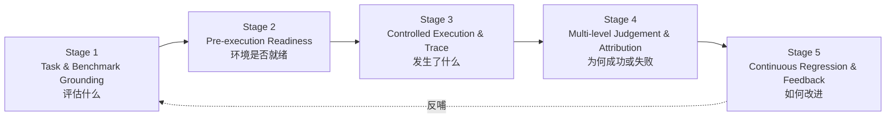
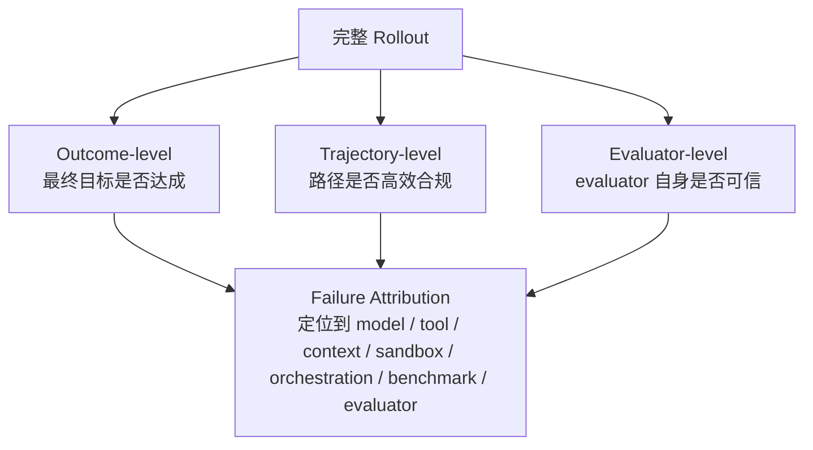

# V 层：验证与评估（Verification & Evaluation）

> ETCLOVG 七层中的第六层。把 agent 行为转成工程证据。回到 [[00-Survey总览-ETCLOVG七层框架]] 看七层全景。

---

## 1. 核心立场：评估 = task-to-feedback 闭环，不是 leaderboard

> **harness-aware evaluation** 的关键论断：**报告的分数是"模型 × harness 对"的属性，不是模型单独的属性**。

所以评估协议要么**跨模型锁定 harness**，要么把 harness 配置当**显式实验因子**变动。

V 层组织成 **5 stage task-to-feedback lifecycle**——从"agent 被要求做什么"开始，到"评估结果反哺 harness 改进"结束。

**与常规 LLM 评估的根本不同**：常规 LLM eval 给固定输入打 output 分；harness 评估测的是**一段执行 episode**——任务接地在环境、agent 用 tool 和 state 互动、trace 沿途捕获、judge 评最终结果**和到达的路径**。

**central motivation**：infrastructure 噪声会伪装成模型 failure——run 失败可能因模型，但也可能因 broken tool、stale context、non-reset sandbox、flaky test、benchmark 歧义、unstable judge。所以评估要把 agent 行为转成**结构化 judgement + failure attribution + regression feedback**，而不只是报一个最终分。

---

## 2. Stage 1 — Task & Benchmark Grounding

> 问"评估什么"。对 LLM agent，task 不是简单 NL prompt，而是**嵌入式问题**：由 environment state、可用 tool、允许 action、constraint、termination condition、success criteria 定义。

**没有 well-specified environment 和 success condition，后续分数无法可靠解读**。

### 2.1 Software Engineering & Terminal Tasks

| Benchmark | 接地方式 |
|---|---|
| **SWE-bench** | 每个 task 接地在真实 GitHub issue + repo snapshot，跑测试验证生成的 patch 是否解决 issue |
| **Terminal-Bench** | command-line workflow——agent 编辑文件、跑命令、装依赖、解读 failure |

关键洞见：strong outcome verifier **要求 strong task grounding**——只有 repo state / dependency / 成功条件**精确指定**时，test 才是可靠 evaluator；否则失败 test 可能反映 invalid patch、也可能反映环境不一致。

### 2.2 Web / Browser / Computer-Use Tasks

| Benchmark | 描述 |
|---|---|
| **WebArena** | 真实 web 环境的自主 agent task |
| **VisualWebArena** | 加多模态 web task |
| **BrowserGym** | 通用 browser-agent 研究底座 |
| **WorkArena** | ServiceNow knowledge work |
| **OSWorld** | 真实 computer 环境，跨桌面应用 / 文件 / 多应用 workflow |

这些把 benchmark 同时变成**评估问题和 environment-design 问题**——必须提供逼真接口、隔离 task state、暴露合适 observation、定义可测 success predicate。**直接桥接 [[01-E-执行环境与沙箱|E 层]] 与 V 层**。

### 2.3 Cross-Domain & Enterprise Workflow Tasks

| Benchmark | 重点 |
|---|---|
| **AgentBench** | 跨 OS / DB / web browsing / 游戏 |
| **GAIA** | 通用助手任务：reasoning + tool use + multimodal info access |
| **TheAgentCompany** | 模拟职场数字劳动 |
| **WorkArena++** | 强调 compositional enterprise workflow——success 取决于复杂软件 navigation 而非孤立答题 |

**这一族的贡献**：coverage——测 harness 是否能跨多种 task 类型 / tool interface / state representation / workflow / success condition 泛化。

---

## 3. Stage 2 — Pre-execution Readiness Validation

> 问"评估能否被公平、可复现地跑"。常被 leaderboard 忽视，但对 harness 评估关键：environment、tool、context state、permission policy、budget、grader 必须都被正确初始化。**否则失败归因不清**——run failed 可能是 agent，也可能是 setup。

### 3.1 三类 readiness check

#### Environment / Sandbox Readiness

sandbox、repo、browser、terminal、VM 是否从已知状态启动。SWE-bench 用可执行 repo state + test-based verification；Terminal-Bench 打包 terminal task 配可控环境和 verification logic；OSWorld 用真实 computer 环境 + execution-based eval script；**Repo2Run** 针对 dependency / 环境 setup 自动构 executable Docker 环境；**HAL** 强调标准化、cost-aware evaluation 基础设施。

#### Tool / Context / Permission Readiness（跨层）

- **tool readiness**——API、MCP server、browser control、shell command、file op 是否可用且描述一致
- **context readiness**——history、memory store、scratchpad、retrieved doc 是否 reset 或 intentionally initialized
- **permission readiness**——file access、credential、network、approval gate 是否与 benchmark spec 匹配

> 实际效果：**这一阶段把评估与 [[02-T-工具接口与协议|T 层]]、[[03-C-上下文与记忆管理|C 层]]、[[07-G-治理与安全|G 层]] 连起来**——这些 layer 的配置**就是测量仪器的一部分**。SWE-agent / SWE-ReX / OpenHands 都说明：tool exposure、shell access、browser、execution backend、runtime interface 不可与 evaluation design 分开。严谨的 harness eval 应把它们当 **evaluation metadata** 记录。

#### Evaluator / Grader Readiness

deterministic grader 检 flakiness、missing dependency、与环境 state 的兼容；LLM-as-Judge prompt / rubric / judge model 需要版本化；human-audit 协议要提前定义。

LLM-as-Judge 要 **calibration、bias mitigation、consistency check**，不是盲信强模型当 grader。

---

## 4. Stage 3 — Controlled Execution & Trace Capture

> 问"执行中发生了什么"。常规 LLM eval 的 evidence 可能就是一对 input-output；agent eval 的 evidence 是**多步轨迹**——观察、推理、调工具、收 output、改环境、处理 error、最终终止。controlled execution + trace capture 把 benchmark run 变成**可诊断**。

### 4.1 Controlled Rollout & Reproducible Execution

**rollout** = agent eval 的基本单位，含：task、model config、harness config、action sequence、中间 observation、final state、grading 结果。controlled rollout 把变异源固定下来：environmental state、tool 可用性、timeout、budget、permission policy、evaluator version。

不确定性残留 → 重复 rollout 暴露 variance，不是把它藏在单分背后。

- **SWE-agent** 把 agent 暴露给 repo navigation + file editing + test execution 作为 interaction loop 一部分
- **OpenHands** 合 code editing / command-line / browser / sandboxed execution / benchmark integration
- **SWE-ReX** 抽象 local / remote sandboxed shell，让 backend 可换而不必改 agent 逻辑
- **LangChain** 进一步把 deep-agent eval 分成 single-step validation / full-turn / multi-turn simulation

**核心结论**：reproducibility 要求**回放完整 model–tool–environment 交互**，不只是重跑模型调用。

### 4.2 Trace-Native Evaluation

trace capture 把"二元打分"转成"因果诊断"。一个 trace-native harness 应记录：

- model output
- tool call + tool result
- environment state 改动
- context snapshot
- error / retry / recovery action
- token / latency / cost

这些 trace 能**区分表面相似的失败**——一个 agent 永远找不到目标文件，另一个找到了但生成了 invalid patch。也能暴露**有问题的"成功"**——benchmark exploitation、过多 tool call、permission violation。

- **HAL** 用 large-scale agent log 做标准化 evaluation——trace 是一等 artifact
- **R2E-Gym** 用可执行 trajectory + hybrid verifier 做 test-time eval 和 training-time feedback

→ **trace 不是辅助 debug 文件，而是主要评估数据**。

### 4.3 Cost / Latency / Resource Tracking

应报**质量 + 达成成本**。Long-horizon agent 可能用更多 token / tool call / retry 提升成功率。harness eval 应追踪 token usage、model cost、wall-clock latency、tool-call count、retry count、resource consumption。

- **HAL** 显式把 agent eval 框成 standardized & cost-aware
- **LangChain** 强调 reproducible env + multi-granularity eval 用于 cost-quality tradeoff 比较

→ 对**部署的 agent service** 特别重要——budget / latency 约束下的 recurring workload 是优化单位。

---

## 5. Stage 4 — Multi-level Judgement & Failure Attribution

> 问"该如何评判这次运行，如果失败如何定位"。分两件：**multi-level judgement**（三个层次判 run）+ **failure attribution**（定位失败在 harness 哪个组件）。

**区别于普通 benchmark**：目标不是给分，而是把 execution evidence 转成可执行的工程诊断。

### 5.1 Outcome-Level

衡量最终目标是否达成。

- 软件工程：unit test、regression test、issue-specific verification（SWE-bench）
- terminal：最终文件 / 命令输出 / task-specific checker
- browser / enterprise workflow：最终 environment state（form 提交了吗、ticket 更新了吗、配置改了吗）
- 通用助手：answer string 或 structured response

**优势**：scalability、interpretability、leaderboard 可比。
**限制**：compression——把整段 episode 缩成一个值，掩盖了 agent 是否健壮 / 安全 / 高效。**必要不充分**。

### 5.2 Trajectory-Level

衡量 agent 走的**路径质量**——选了合适 tool 吗？按合理顺序排 action 吗？避免冗余调用了吗？尊重 permission 边界吗？从 error 恢复了吗？跨时间维持 context consistency 了吗？

**最显著区别 agent eval 与传统 output eval 的地方**：最终答案可能对，但 trajectory 仍不可接受——比如 agent 浪费过多 token、反复调 irrelevant tool、违反 permission、依赖 brittle benchmark-specific 行为。

- **ReAct** 提供 interleaved reasoning / acting / observing step 的 trajectory-level 分析概念基础
- **WebArena / WorkArena / OSWorld / Terminal-Bench** 都生产 trajectory——其中间 action 是**有意义的 evaluation 对象**，而非隐藏 impl detail
- **LangChain** 的 single-step + full-turn pattern 让开发者在整 run 成败前**就能审决策质量**

> trajectory judgement 给 harness engineering 提供**从 failure 到 repair 的路径**：选错工具 → tool interface 要改；忘了 prior constraint → context layer 要调；空转无 recovery → orchestration layer 要 lifecycle control。**让 benchmark 结果转成 layer-specific 工程反馈**。

### 5.3 Evaluator-Level

evaluator 自身可信吗？

| 类型 | 特点 |
|---|---|
| deterministic verifier（unit test / state-based checker） | 可复现、便宜、易跨系统比，但窄，对 open-ended task 难设计 |
| LLM-as-Judge | 灵活，但带 bias、非确定性、额外成本 |
| Human audit | 对 ambiguous / safety-critical case 重要，但不可 scale 到持续 eval |

- **G-Eval** 表明 LLM-based evaluator 在 NLG eval 上更对齐 human judgement，但也偏向 LLM-generated text
- **MT-Bench / Chatbot Arena** 系统研究 LLM-as-Judge 与人评的位置偏差、冗长偏差、self-enhancement bias、推理局限
- **现代综述**：reliable LLM-as-Judge 需要 standardization / bias mitigation / consistency check / meta-evaluation

**对 agent harness**：evaluator-level eval 不可选。grader 不稳定、test 非确定、LLM judge 有 bias → 评估噪声可能被错误归因到 agent 或模型。**鲁棒 harness 应优先 layered grader**——deterministic check 测 objective state change，LLM judge 测语义 / trajectory，human audit 测 ambiguous / 高风险。**evaluator 是被测组件，不是系统外的 oracle**。

### 5.4 Failure Attribution Across Harness Layers

failed rollout 可能来自：

- 模型 reasoning
- 误导性 tool schema
- sandbox 配置错
- stale context
- flaky test
- benchmark 歧义
- judge 不稳
- orchestration loop

- outcome-level signal 指 objective 是否达
- trajectory-level signal 指 action sequence 是否 coherent / efficient / policy-compliant
- evaluator-level signal 指分数本身是否可信

**实务里 attribution 极少是单标签分类**：vague task spec → 选错 tool；过度压缩 context → 忘约束；sandbox dependency 问题 → recovery 行为推成本；flaky judge → 掩盖 valid solution。

→ **failure attribution 是诊断过程**，覆盖整条 trace，而不是给最终分贴个事后标签。Stage 4 的输出**不是 judgement，而是结构化诊断**，交给 Stage 5 反哺 regression test 和 harness 改进。

---

## 6. Stage 5 — Continuous Regression & Deployment Feedback

> 问"evaluation 结果如何驱动下一次 harness 改版"。agent harness 持续演化——prompt、tool schema、MCP server、sandbox 镜像、orchestration loop、governance rule、judge prompt 都会变。Continuous eval 把 benchmark 结果 + 生产 failure 变成 harness 自身的**回归系统**。

### 6.1 Regression Eval for Harness Changes

regression 该被 harness 变化触发，**不仅是模型变化**。tool description、context-compaction policy、sandbox 镜像、permission rule、judge prompt 改了都会改 agent 行为或评估分。**组件互相耦合 → 局部改进可能造全局回归**。

实践模式：**分层 eval suite**——unit-like test for tool schema + deterministic validator + single-step test for local decision + full-rollout test for end-to-end completion + multi-turn simulation for long-horizon coherence。LangChain deep-agent eval 用这个分层视角；Anthropic 把 eval 当**自动化 test + 显式 grading logic**，可在开发期跑。

### 6.2 Eval Frameworks 与 LLMOps 集成

通用 framework 提供可复用基础设施：

- **Promptfoo** ——prompt 与 LLM-app regression test
- **DeepEval** ——unit-test-like abstraction
- **RAGAS** ——retrieval-augmented generation eval
- **lm-evaluation-harness** ——标准化 LM eval

→ 这些不为 long-running agent 设计，但提供**面向回归的 agent eval 的构件**。

**eval 也该连 observability**：production trace → regression test；evaluation failure → observability signal。**闭合"监控发生了什么"与"构造可复现并诊断它的可控测试"的环**。

### 6.3 Verifier-Based & Training-Time Evaluation

把 evaluator 当**training signal / optimization target** 而不只是 offline metric。Verifier-based environment 与 RL-style agent gym（R2E-Gym 等）把环境反馈当 reward / validation signal 改进 agent policy 和 scaffold。

> **Meta-Harness**（Lee et al., 2026）走最远：把**harness design 本身**当 automated search 的对象——不再只评"哪种模型在 fixed harness 下最好"，而是问**哪种 harness 结构 / prompting 策略 / tool interface / control loop 产出最可靠 agent**。Eval 不是 pipeline 终点，而是 harness 改进自身的 signal。

---

## 7. 本层小结

### 7.1 5 Stage 闭环映射表

| Stage | 关键问题 | 主输出 |
|---|---|---|
| 1 Grounding | 评估什么 | task / env / success criteria 定义 |
| 2 Readiness | setup 是否就绪 | env / tool / context / permission / evaluator 初始化记录 |
| 3 Controlled Execution | 发生了什么 | 完整 trace + cost / latency 指标 |
| 4 Judgement & Attribution | 为何成败 | outcome / trajectory / evaluator 三级判断 + layer-attribution 诊断 |
| 5 Regression & Feedback | 如何改进 | 回归 test suite + harness 改版 signal |

### 7.2 把 evaluation 从 leaderboard 重新框成 quality-control loop

- 最终 success rate 仍有用，但**不再充分**
- 长程 agent 的核心评估问题不是"agent 是否成功"，而是**为什么成或败、路径是否可接受、evaluator 是否可信、哪个 harness 组件该被改下一版**

V 层的这种 reframe，把 evaluation 从外部检查转成 harness 自身的**反馈控制器**——这正是综述把它从"benchmark mechanic"提升为**七层中的一等控制面**的理由。
