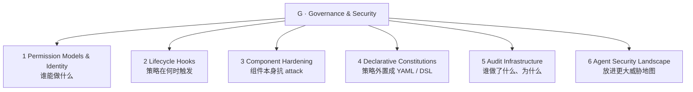

# G 层：治理与安全（Governance & Security）

> ETCLOVG 七层中的第七层。覆盖 agent 行为在什么约束下、谁为失败负责的全部机制。回到 [[00-Survey总览-ETCLOVG七层框架]] 看七层全景。

---

## 1. 这一层为什么独立

LLM agent 现在执行 shell 命令、发邮件、提交代码、调用第三方 API。生产部署里中心问题是：**这些动作受什么约束，约束失败时谁负责**。

生产里 governance 有自己的工具生态：

- permission engine、policy language、audit pipeline、gateway control
- 与 [[04-L-生命周期与编排|L 层]] 的 lifecycle hook、[[05-O-可观测性与运维|O 层]] 的 observability infrastructure 都**生态独立**

综述把 G 层切成 **5 大机制 + 1 个外部 landscape**：



---

## 2. Permission Models & Identity Management

> 第一个问题永远是 access control：哪些 tool、文件、network endpoint、system resource agent 能碰。**比传统 RBAC / ABAC 难**——因为部署时不知 NL task 需要的 tool set。

设计沿"granularity 轴"演化：

| 粒度 | 表现 | 代表 |
|---|---|---|
| **静态边界**（deployment-fixed） | 部署时定 scope；超 scope 需 escalation | Codex 跑 sandbox + 限 filesystem / network access；Gemini CLI workspace-scoped + 命令 allow / deny |
| **运行时上下文 policy**（per-call） | predicate 跑在 tool name / argument / env state 上 | Progent：DSL，预 invocation 求值，least-privilege 因 role / user / session 而异。Conseca：从 trusted context 生成 task-specific policy 用 deterministic checker 强制。把 *策略生成* 与 *策略执行* 分开——generator 可适应 task，enforcer 仍可审计 |
| **跨边界**（multi-agent） | 多 agent 间需 identity、delegation token | 见 2.2 |

### 2.1 Multi-Agent 引入的新挑战

#### Identity 与 Inter-Agent Access Control

授权前必须确立**谁在请求**：

- **South et al. (2025)**：authenticated delegation——扩展 OAuth 2.0 / OIDC，加 User ID Token、Agent ID Token、Scoped Delegation Token 绑 user intent 到 agent-specific permission，建立 human principal → agent action 的可验证 accountability trail
- **SAGA**（Syros et al., 2025）：multi-agent provider-mediated 架构，agent 用 cryptographic one-time key 注册，短寿 access token 强制用户定的 contact policy
- **IsolateGPT**：hub-and-spoke 架构，每个第三方 app 在隔离 spoke 里跑自己 LLM / memory / tool，spoke 间通信经 trusted hub——**跨 app 数据交换变成显式 governance 决策**，不再是共享 context window 的副作用

#### Credential Management

agent 常处理 API key / session token / OTP。把 credential 暴露给 LLM context 制造 exfiltration 风险。

**Skyvern** 模式：secret 存 vault，**只给 LLM 看 placeholder**，在执行 authenticated action 的 automation 层把真值代回。
未解：long-horizon session 的 secret lifecycle——token 中途失效需要在不进 model context 的前提下 renew。

### 2.2 Web-Level Permission Coordination

跨组织交互（agent 访问第三方 web 或服务）需要协调，**单一 harness 无法独自强制**。

**Marro et al. (2025)** 提 `agent-permissions.json`——类比 `robots.txt` 的轻量 manifest 文件：网站主声明 agent 可用哪些 UI 元素、rate limit、并发约束、需要人确认的 action。不解决 authentication，但显示 governance 开始**跨组织边界**。

### 2.3 开放挑战

- 表达力与可用性都好的 permission model 是未解问题——太严 agent 没用；太宽就反掉 governance 目的
- 社区**没有 portable 跨 harness 的 standard permission specification language**
- agent action 该归到 human operator、agent instance、还是 transient task identity——开放争论

---

## 3. Lifecycle Hooks（策略何时触发）

> Permission model 定义"什么允许"。Lifecycle hooks 定义"policy check 何时开火"。许多 harness 在 agent loop 各阶段暴露 hook：plan 之前、tool invoke 之前、tool exec 之后、response 交付之前。

四个 hook 点对应一个 tool-use cycle：

```
Input  ─►  H1: Input Guardrail  ─►  LLM
                                       │
                                       ▼
                              H2: Action Guardrail  ─►  Tool
                                                          │
                                                          ▼
                                            H3: Post-exec IFC  ─►  Response
                                                          │
                                                          ▼
                                  H4: Human-in-the-Loop  (on user approval)
```

### 3.1 Pre-execution Hooks: Input Guardrails

input guardrail validate 数据**到达 LLM 之前**：

- **PromptShield**、**DataSentinel**——训练 dedicated classifier 检 prompt injection payload
- 规则 detector 严格但脆；模型 detector 泛化好但更慢、易受 adaptive attack 影响

下一个 enforcement point 在 LLM 提出 action 到 harness 执行 tool 之间。

### 3.2 Pre-invocation Hooks: Output Guardrails & Action Validation

执行 tool call 前 output guardrail 检 LLM 提出的 action：

- **ShieldAgent**——formalize safety constraint 为可验证 predicate，对每个 action check
- **ControlValve**——多 agent 场景约束 agent 间 control-flow graph，**防 control-flow hijacking attack**（一个 agent 把执行重路由到另一个）

tool 执行后，返回数据**重新进 LLM context 前**也必须 inspect。

### 3.3 Post-execution Hooks: Information Flow Control & Taint Tracking

- **CaMeL** ——capability-based information flow control。**每个 data value 带 metadata tag** 追踪 provenance，区分 trusted user input 与 untrusted web retrieval。custom interpreter 强制 untrusted data **不能影响 control-flow 决策**。把 trusted context 上的 planning 与 untrusted content 上的 processing 分开——用一些灵活性换取**更强的 control/data-flow 边界**。AgentDojo 上验证

### 3.4 Human-in-the-Loop Hooks

把 user 放进回路的补充机制。多个广用 coding agent（Codex、Gemini CLI、Cursor、OpenHands）用 explicit user approval 给 destructive / out-of-scope action 上闸。三维设计：

- **validation scope**——哪些 action 要审批
- **alert richness**——给 user 看多少 context
- **recurrence policy**——allow-once vs allow-always

**Felt et al. (2012)**：仅 17% Android 用户在 install 时关注 permission dialog，仅 3% 答对 comprehension 题——agent approval dialog 可能面临同类的 habituation 和 comprehension 风险。频繁请求 → 反射性同意危险动作；不频繁请求 → coverage 缺口。

### 3.5 Programmable Enforcement Substrate

| 系统 | 立场 |
|---|---|
| **AgentSpec** | 用 trigger / predicate / enforcement action 在 plan / tool-call / response stage 定规则 |
| **AgentDoG** | 从 single-action classification 转 trajectory-level diagnosis，按 source / failure mode / consequence 组织风险 |

### 3.6 开放挑战

- hook API 异构——**没有 widely-adopted 标准定义第三方 governance module 的通用 hook interface**
- hook 引入 latency
- **stacked hook 的交互效应** 几乎没人研究——上游 sanitizer 改输出，可能让下游 detector 依赖的信号失真，叠加管线比单组件更弱

---

## 4. Component Hardening（组件加固）

> Lifecycle hook 在 harness 层强制 governance。Component hardening 加固各个 agent 组件——LLM 和它调的 tool——对各自漏洞。组件越硬，**触发 governance hook 的恶意输入越少**。

### 4.1 Model Hardening

prompt injection 的根因之一：LLM 对所有输入 text **同优先级**对待，无法区分 system instruction 和 untrusted data。

| 工作 | 方法 |
|---|---|
| **Wallace et al. (2024)** | **Instruction Hierarchy**——训模型把 privileged instruction（system prompt）优先于 lower-privileged（user message、tool output）。冲突时学会与高层一致，忽略 / 拒绝低层 |
| **SecAlign**（Chen et al., 2025a） | 把同样防御目标表述成 prompt-injected input、desirable response、undesirable response 之间的 preference optimization |

**Model-level 防御补充 harness-level guardrail**：加固模型在 inference time 拒绝更多 injection，降下游 guardrail 负载。**但不充分**——只 address Kim et al. taxonomy 里的"wrong instruction following"，**不能防 unconstrained data flow 或 unauthorized action**——这些要 system-level enforcement。

### 4.2 Classifier-Based Runtime Hardening

互补线：**不改 agent LLM**，部署小型辅助 classifier 在 runtime 筛 input / output：

- **Llama Guard** —— fine-tune 一个独立模型给 user prompt 和 assistant response 分类（可配 safety taxonomy），返回 per-category label，harness 据此 route / allow / block / escalate

两个对比 training-time hardening 的实操优势：

1. **taxonomy 可改而无需重训 agent 模型**
2. 同一 detector 可跨**异构 LLM backend** 复用

成本：每多一个 classifier 给 tool-use cycle 增一次 forward pass（这是 §3.6 提的 latency 预算）。

### 4.3 Tool Hardening 与 MCP Security

MCP 是 agent ↔ tool 通用接口，但**初始规范缺 native security primitive**，引来攻防：

- **Radasevich & Halloran (2025)**——证明常用商业 LLM 可被诱导用 MCP tool 执行恶意代码、建立 remote access、偷 credential。McpSafetyScanner 用三 agent 架构（hacker / auditor / supervisor）系统发现这类漏洞
- **Trail of Bits (2025)**：MCP server 可在 user 调 tool 前就攻击 client——通过**有毒的 tool 描述**在 registration time 影响 LLM 行为

防御侧：

- **ETDI**（Bhatt et al., 2025）扩展 MCP，**加 cryptographically signed & versioned tool 定义**——tool 代码、schema、permission 任何修改都需新签版，防"曾经审核过的 tool 被静默更新执行恶意 action"的 rug-pull

### 4.4 Protocol-Level Hardening

**SAFEFLOW**（Li et al., 2025）——multi-agent 系统 protocol-level enforcement：fine-grained information flow control + **transactional execution semantics**——违规的 tool call 或 inter-agent message 可被 rollback 而非沿共享 state 传播。

### 4.5 Supply Chain Risks

agent 还依赖 package manager 和 retrieval source：

- **Spracklen et al. (2025)** 跨 16 LLM 分析 576,000 代码样本，发现开源模型**虚构不存在的 package 名比例 21.7%**。攻击者可在公开 registry 注册这些虚构名插入恶意代码——称为 "**slopsquatting**"
- ETDI 的签名解决 MCP tool 一边；**package manager 与 retrieval source 多数 agent governance stack 不管**

### 4.6 开放挑战

- model hardening 与 tool hardening 覆盖互补 surface，**没有 unified framework 把它们组合**
- 加固的 model 仍可能调被攻陷的 tool；signed tool 不防被 jailbreak 的 model 滥用
- 组合 + 量化残余风险还是开放

---

## 5. Declarative Constitutions（声明式宪章）

> 把 governance 逻辑直接埋在应用代码里 → 策略不透明、难审、难改。新兴方案：**外置为声明式配置文件**（最常见 YAML）。这些文件作为 agent 的**机器可读宪章**。

### 5.1 Training-time Constitution：Anthropic Constitutional AI

Anthropic 发布的 **constitution** 是 4 层 priority hierarchy：

1. **safety**（保 human oversight）
2. **ethics**（诚实、避害）
3. **compliance**（遵 Anthropic guideline）
4. **helpfulness**（user request）

区分**hard constraint**（CBRN 等绝对禁止）与 **soft-coded default**（operator 可在边界内调整）。在 agentic setting 暗示一种 principal hierarchy：Anthropic 策略压过 operator 配置，operator 压过 end-user 偏好。

**training-time constitution** 通过 alignment / post-training 塑造模型行为——部署后难改、harness 不能独立审计。

### 5.2 Deployment-time Constitution：YAML-based Governance

**AutoHarness** 用 YAML 编码 governance rule：pipeline mode（core / standard / enhanced）、risk classification pattern、allowed / denied tool pattern、token budget limit、audit log destination。

| 优势 | 限制 |
|---|---|
| 把 governance intent **从 execution logic 分离** | 模式化 YAML 处理 trigger 字面化，**真实部署常需 conditional logic over runtime state** |
| 非 dev stakeholder（security team / compliance officer）可 review / 修改 policy **而不动 agent 代码** | 当前 YAML schema **没标准化** predicate（privilege escalation / host-based egress / session-level rate limit / future action）|
| 可版本化、diff、用标准工具更新 | 比 free-form YAML 与 hardcoded rule 还有第三选项：structured policy DSL |
| 不需重训 / 重发模型 | |

### 5.3 Training-time vs Deployment-time 区别

| 维度 | Training-time | Deployment-time |
|---|---|---|
| 修改成本 | 高（重训） | 低（编辑 YAML） |
| 行为机制 | RLHF 概率塑形——可被 adversarial prompt 推翻 | harness check 强制执行 |
| 可审计性 | 需 behavioral probe 推断 | 直接读 + diff review |

### 5.4 Programmable Policy Languages

| 系统 | 表达力 |
|---|---|
| **Progent** policy language | 布尔 predicate、quantifier、env reference——给出 formal expressiveness 但仍可读 |
| **Formal-LLM**（Li et al., 2024） | 把 plan constraint 编为 pushdown automata——可表达 sequential ordering、prohibited tool combination、required approval gate at specific step |
| **VeriSafeAgent**（Lee et al., 2025） | 用 DSL over UI state transition 形式化 user intent，验证 GUI action 与 user task 对齐 |

YAML constitution 容许 ambiguity；formal spec 要求 expertise。

### 5.5 开放挑战

- **没有 widely-adopted standard schema** for agent constitution——每 harness 自己一套
- validate constitution 内部一致（无矛盾 allow / deny）和完整（无未处理 tool 类别）的工具有限
- training-time 与 deployment-time constitution 的**交互**几乎没研究——YAML deny rule 是否能可靠 override RLHF 训出的行为，仍是开放问题

---

## 6. Audit Infrastructure（审计基础设施）

> Governance 要 accountability。Audit 记录 agent 做了什么、为什么做、是否遵守 policy。支持事后调查、合规、policy refinement。

### 6.1 Structured Audit Trails

| 系统 | 设计 |
|---|---|
| **AutoHarness** | 发 per-tool-call JSONL record：tool name、argument、risk classification、permission decision、execution result、token cost、wall-clock latency——支持实时 dashboard 和 offline forensic |
| **SAGA** | 扩到 multi-agent 交互，记录 agent 间交换的 cryptographic token——跨 trust boundary 的 provenance tracking |

跨系统共识：可回放 audit record 至少要 **trace identifier、principal identity、tool invocation、policy decision + version、execution result、resource cost、相关 input/output 的 integrity hash**。

**多数现行系统只记字段子集，少数签名或哈希**——audit trail 仍易被攻陷的 agent process **log tamper**。

### 6.2 Anomaly Detection：Per-Action vs Trajectory Level

```mermaid
flowchart LR
    P[Per-action detector<br/>每个 tool call 与 risk 对照<br/>便宜易审，但抓不到"分散到 N 个 benign action 的攻击"]
    T[Trajectory-level detector<br/>评估 action 序列联合<br/>抓 multi-step 攻击，latency 高、定位难]
    P -. inline 部署 .-> ENF[Enforcement Pipeline]
    T -. async over audit log .-> ENF
```

| 系统 | 类型 |
|---|---|
| **AgentMonitor**（Naihin et al., 2023） | 轻量 log-and-flag impl（per-action） |
| **AgentAuditor**（Luo et al., 2025） | behavioral pattern matching + LLM 推理 over 完整 trace（trajectory） |
| **SentinelAgent** | 把 multi-agent 通信建成 temporal graph，flag anomalous 交互（trajectory） |

per-action 抓不到"慢速 exfiltration（如每分钟读一个文件）"这类**分散在多个独立看似 benign 的 action 的攻击**。trajectory-level 抓 multi-step，但**延迟更高、attack 定位不准**。生产中 per-action 常 inline，trajectory async over audit log。

### 6.3 Cost & Resource Auditing

runaway agent loop 可在 loop-heavy workload 中迅速耗 API budget。**2025 OWASP Top 10 for LLMs** 把 resource drain 列为独立 risk category。AutoHarness 通过 constitution 跟 per-call token consumption + session-level budget。fan-out pattern 把 API call 指数化，cost-aware governance 在 multi-agent 尤其重要。

### 6.4 Tiered Governance Pipelines

将前面 mechanism（permission / hook / constitution / audit）集成进**单一可配置 pipeline** 的新兴模式。AutoHarness 示例三 tier：parse → risk → permission → execute → audit；context enrichment → output validation → anomaly scoring → human escalation → formal constraint verification。tier 由 YAML constitution 声明式选择——**governance overhead 跟部署 risk 缩放**。其他实务（Shavit et al., 2023）暴露同样责任为 feature-level control 而不命名 tier。哪种抽象更可用是开放经验问题。

### 6.5 开放挑战

- audit log 在 long-running agent 里**迅速膨胀**——存储、隐私、信噪比都成问题
- log 可能含敏感 user data / API key / 对话内容——audit completeness 与 data protection 紧张
- **没有 standardized audit schema**——跨系统分析和 regulatory 报告难

---

## 7. 把 Governance 放进 Agent Security Landscape

### 7.1 不止 prompt injection / single-agent jailbreak

agent-to-agent platform 出现后，威胁覆盖：**social engineering、coordinated agent cluster、credential leakage、platform-level engagement amplification**。

- **Kim et al. (2026)** survey 128 paper，编目 51 种 attack method 和 60 种 defense method
- **Chen et al. (2026)** 综合 50 篇 paper，提 6 维 taxonomy 和 "secure-by-construction agent platform" 的 reference doctrine

### 7.2 设计维度到 governance 机制映射

Kim et al. 标识 7 个设计维度——每条**灵活性 vs 攻击面**：input trust、access sensitivity、workflow、action、memory、tool、user interface。

> **更大灵活性 → 更大攻击面**；governance 在 runtime 约束这种灵活性。

Permission model 限 tool / action；lifecycle hook 在 workflow 注 checkpoint；constitution 外置约束；audit infrastructure 提供反馈回路揭露**约束过松或过紧**。

#### Governance 机制 ↔ 风险类别（R1-R7）映射

| Governance Mechanism | Risks Mitigated / Detected |
|---|---|
| Permission model & identity mgmt | R1 untrusted interface、R5 data leakage、R6 unauthorized action |
| Input guardrail | R1、R2 wrong instruction following |
| Output guardrail | R2、R4 hallucination、R5、R6 |
| Information flow control | R3 unconstrained data flow、R5、R6 |
| Component hardening | R1、R2、R4 |
| Monitoring & audit | R5、R6、R7 resource drain |
| Human-in-the-loop | R2、R6 |
| Privilege separation | R2、R3 |
| Formal verification | R2、R6 |
| Declarative constitution | cross-cutting：configures all of the above |

### 7.3 真实 agent 的 defense 缺口

Kim et al. 对六个 agent 系统（Codex、Gemini CLI、OpenHands、Browser Use、Nanobrowser、Skyvern）做 case study：**没有一个 fully 实现所有 defense 类别**。information flow control、identity management、formal verification 在六个系统**全部缺席**。monitoring 全部 partial：agent log tool call 但缺 automated anomaly detection。

**AutoGPT case study**：downstream patch 治个别症状，**留下 input validation、information flow control、policy composition 都不充分**——展示 defense-in-depth 缺失的后果。

### 7.4 Defense-in-Depth 的局限

Kim et al. 主张 agent security 要**多层 defense 互补**：

- **input guardrail** 一线
- **output guardrail** 终线
- **information flow control + monitoring** 持续 runtime
- **access control** for auth/authorization
- **human-in-the-loop** for critical decision

但**layering 不免费**——如 §3 提，coordination 差的 layer 会互相干扰，独立 governance hook 的可组合性几无被测。governance **可以是组织层** 让 defense mechanism 合作而非冲突。

### 7.5 Contextual Security：拟议第四目标

Kim et al. (2026) 提 **contextual security** 作为 agentic 系统在经典 CIA（Confidentiality / Integrity / Availability）之外的**候选第四 security 目标**。

提议**新近且具体**——尚未被 NIST 或主流 security 教科书采纳。Conseca 和 CaMeL 展示工程方向：**context 必须当 governed state 处理，不是 passive prompt material**。是否值得提升为独立 security 目标，仍未定。

---

## 8. Governance Feature Coverage（综述表）

> ● 全支持　◐ 部分　○ 缺席

| System | Perm. | Hooks | Harden. | Constit. | Audit | Multi-Ag. |
|---|---|---|---|---|---|---|
| Codex | ● | ◐ | ○ | ○ | ◐ | ○ |
| Gemini CLI | ● | ◐ | ○ | ○ | ◐ | ○ |
| OpenHands | ◐ | ● | ○ | ○ | ◐ | ◐ |
| AutoHarness | ● | ● | ◐ | ● | ● | ◐ |
| Progent | ● | ● | ○ | ◐ | ○ | ○ |
| CaMeL | ◐ | ● | ○ | ○ | ○ | ○ |
| SAGA | ● | ○ | ○ | ○ | ● | ● |
| IsolateGPT | ● | ◐ | ○ | ○ | ○ | ● |
| AgentSpec | ◐ | ● | ○ | ● | ○ | ○ |
| SAFEFLOW | ◐ | ● | ◐ | ○ | ● | ● |

→ 表稀疏，说明 governance 基础设施常是**安全部署的 practical 瓶颈**，与模型限制并列。

---

## 9. 8 大研究方向（综述 §9.7）

1. **Standardized policy & audit language**——类比 MCP 之于 tool interface，跨 harness 的 portable policy / audit interoperability
2. **Formal governance guarantee**——证明 constitution 内部一致并覆盖所有 tool 类别
3. **Adaptive governance**——静态 policy 无法预知所有 task context；LLM-generated policy 可能补，但**这些生成器自己又该如何被治理**
4. **Long-horizon agent 的 governance**——multi-hour / day task 引入 context drift、跨 session state、演化 trust assumption；当前管线多为 single-turn / short-session 设计
5. **Usable governance interface**——HCI 研究 permission UI / audit dashboard / constitution editor 让非专家可用
6. **Cross-layer governance coherence**——training-time alignment + deployment-time YAML + runtime hook 三 fidelity 不同的层如何组合，**runtime governance 能否可靠 override training-time disposition**
7. **End-to-end supply chain governance**——ETDI 解 MCP tool 一侧；package、dataset、retrieval source 的 provenance 仍难验
8. **统一对 governance stack 的 adversarial benchmark**——现有 benchmark 各打窄 threat class，需要统一报告 defense effectiveness、false-positive rate、overhead

---

## 10. 本层小结

### 10.1 五大机制定位回顾

| 机制 | 角色 |
|---|---|
| Permission Models | **谁 / 何条件下能用什么 tool / 资源**——RBAC → contextual policy → multi-agent identity |
| Lifecycle Hooks | **policy 何时被检查**——input / action / post-exec / human-in-loop |
| Component Hardening | **组件本体抗 attack**——model hierarchy / classifier guard / signed tool / protocol IFC |
| Declarative Constitutions | **策略从代码外置**——training-time vs deployment-time YAML / DSL |
| Audit Infrastructure | **谁做了什么、为什么、是否合规**——structured trail + per-action / trajectory anomaly |

### 10.2 三个跨机制共识

1. **没有 unified standard**——permission language、hook API、constitution schema、audit format 全分裂
2. **没有 layer 能独立给完整 defense**——必须组合，且 layer 间互动几无被测
3. **Governance overhead 必须随部署 risk 缩放**——tiered pipeline / feature-level control 是两种实现，对比还在经验阶段

G 层不是"安全清单"，而是**让 agent 行为可被约束、可被解释、可被追责的工程层**。它对其它六层都横切：从 [[01-E-执行环境与沙箱|E]] 的 sandbox boundary，到 [[02-T-工具接口与协议|T]] 的 tool authorization，到 [[03-C-上下文与记忆管理|C]] 的 information flow，到 [[04-L-生命周期与编排|L]] 的 hook 时机，到 [[05-O-可观测性与运维|O]] 的 audit pipeline，到 [[06-V-验证与评估|V]] 的 policy-aware judgement。
