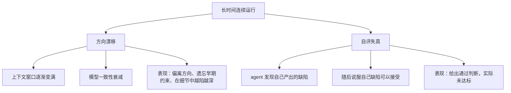
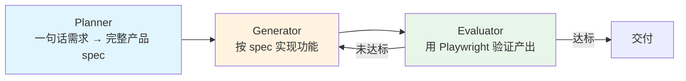
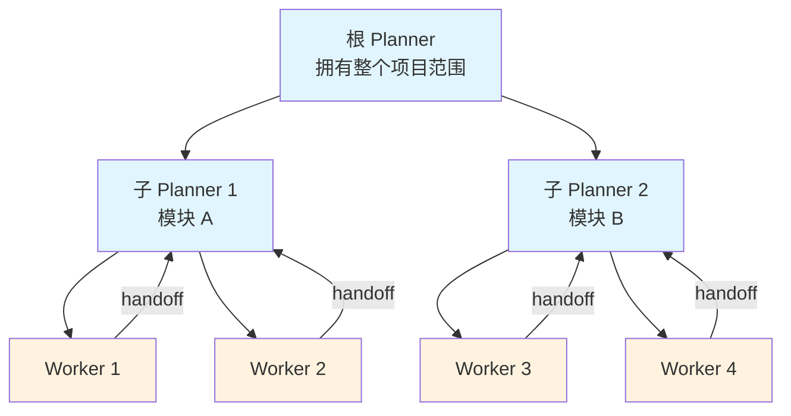
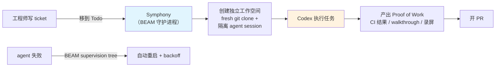
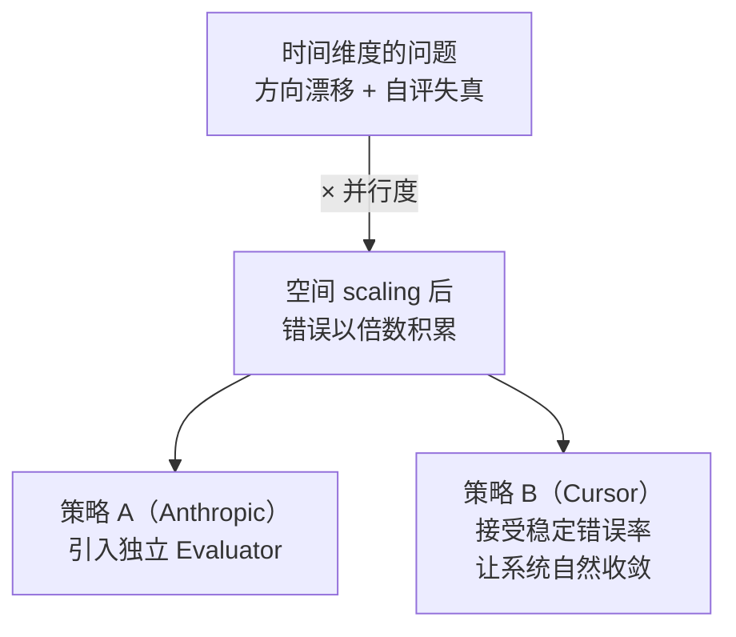

# Harness Engineering 学习笔记：三个 Scaling 维度的统一框架

> 来源：grapeot,《Harness Engineering 在讨论什么：三个 Scaling 维度的统一框架》, 2026-03-30
> 原文：yage.ai/share/harness-engineering-scalability-20260330.html

---

## 导读：这篇文章在解决什么问题

2026 年 Q1，OpenAI、Cursor、Anthropic 先后发布了各自在 agent-first 软件开发上的实践报告，三篇都被归入"harness engineering"这个术语。但它们回答的是三个截然不同的工程问题。这篇文章提出了一个统一框架——**Scalability 的三个独立维度**——来理清混乱。

### 为什么需要这个框架

一个词被三家头部公司用来描述三件不同的事，结果是：

1. **读者困惑**：同一术语，不同语境，二手解读进一步发散
2. **讨论错位**：人们以为在聊同一件事，实则各说各话
3. **概念退化**：大量二手文章仍停留在两年前的 multi-agent 虚拟团队概念，离原文实际内容越来越远

框架的价值在于提供**分类工具**：当有人说"harness engineering"时，先问——它在解决哪个维度的 scaling？

---

## 1. 地基：三家收敛到的四条共识

在展开三个维度之前，文章先梳理了三家在哪些判断上达成了一致。这些共识是 harness engineering 的地基，三个 scaling 维度是在这个地基之上的分化。

### 1.1 人类的核心工作从写代码转向设计 agent 的工作环境

**场景**：假设你管理一个 10 人团队。以前你的杠杆是代码审查、技术方案和结对编程。现在 agent 能写代码了，你的杠杆点变成了——**创造让 agent 能可靠工作的条件**。

三家从不同方向得出了同一结论：

| 来源 | 表述 | 侧重点 |
|------|------|--------|
| OpenAI | "设计环境、指定意图、构建反馈循环" | 环境基础设施 |
| Cursor | "架构和指令比 harness 本身更重要" | 架构约束 |
| Anthropic | planner 和 evaluator 的设计比 prompt 措辞影响更大 | 角色设计 |

> **核心转变**：人类从"代码的直接生产者"变成"agent 工作条件的设计者"。代码本身由 agent 产出，人类的价值在于设计让 agent 可靠运转的环境。

### 1.2 知识必须版本化、可发现、存在于 repo 中

**场景**：团队的架构决策记录在 Google Docs 里，命名规范在 Slack 讨论中达成，某个模块的隐含约束只有两个老员工知道。对人类团队来说这勉强运转，但对 agent 来说——**看不到的等于不存在**。

OpenAI 直白地指出了这个问题（Codex 看不到的等于不存在），Cursor 从另一个角度验证：指令中的模糊措辞会被**数百个 agent 同时放大**，后果远比人类团队的沟通模糊更严重。

**解法趋同**：把知识推入 repo，用 markdown 和结构化文档取代口头沟通。这与 [[book1-claude-code-c1-c2-学习笔记|Claude Code 中 CLAUDE.md 的定位]] 高度一致——让约束和知识成为代码仓库的一等公民。

### 1.3 约束比指令有效

**场景**：你写了一句 prompt："remember to finish implementations"。agent 偶尔会忽略。换一种方式：你设置了一条 lint 规则"no TODOs, no partial implementations"，CI 不通过就无法合并。后者的执行率接近 100%。

| 方式 | 性质 | 对 agent 的效果 |
|------|------|----------------|
| 指令（"请记得完成实现"） | 可解释的、模糊的 | 概率性遵守 |
| 约束（lint 规则 + CI 阻断） | 可执行的、确定性的 | 强制遵守 |

OpenAI 用自定义 linter 强制执行分层架构，并把 lint 错误信息本身写成给 agent 的修复指引——错误消息既告诉 agent "哪里错了"，也告诉它"怎么改"。

> **关键洞察**：在 agent 的工作方式里，"约束优于指令"这个区别比在人类团队里更关键。人可以理解隐含意图，agent 只能执行显式规则。

### 1.4 完美主义是吞吐量的敌人

**场景**：一个 agent 提交了一个 PR，有一个小 bug。你可以选择：（A）阻塞合并，等它修好；（B）先合并，后续修复。当 agent 产出速度远超人类审查速度时，选 A 意味着系统停滞。

| 策略 | 代价 |
|------|------|
| 要求每次 100% 正确再合并 | 系统停滞——一个小错误让整个流程进入修复循环 |
| 最小阻塞合并，接受纠错成本 | 少量错误进入主分支，但吞吐量大幅提升 |

OpenAI 和 Cursor 都采用了后者："**纠错比等待便宜**"。这在人类工程团队里可能引发争议，但在 agent 产出速度远超人类注意力的场景下，它是合理的工程权衡。

**为什么这行得通？** 传统流程的隐含假设是代码产出速度 ≈ 人类审查速度，"阻塞到完美再合并"的等待成本很低。但在 agent 场景下这个假设失效了——几百个 agent 同时在产出，速度远超人类审查能力。此时强制完美会导致两个问题：

1. **修复循环陷阱**：agent 发现一个小问题 → 尝试修复 → 修复引入新问题 → 再修复 → 整个 agent 陷入死循环，什么都交付不了。Cursor 在实践中观察到了这个现象。
2. **系统级停滞**：几百个 agent 都在等各自的 PR 通过，互相阻塞，整体吞吐量崩塌。

这里的"允许错误"不是逻辑 bug 随便放行，而是指：CI 通过、lint 通过、核心功能正常，但可能存在非关键性的小瑕疵（命名不够理想、边缘 case 未覆盖等）。与其让 agent 原地反复打磨，不如先合并，让后续 agent 在碰到时自然修复。本质上是两种质量策略的对比：

| 策略 | 类比 | 适用场景 |
|------|------|---------|
| 门控式（合并前必须完美） | 强一致性 | 人类速度的产出、安全关键系统 |
| 流式（先合并后纠错） | 最终一致性 | agent 大规模并行产出 |

**前提条件**：这个策略能运转，依赖于前面 [[#1.3 约束比指令有效]] 中提到的硬约束——架构不变量由 linter 强制执行、关键路径有测试覆盖。硬约束不放松，放松的是对非关键细节的完美主义要求。

### 四条共识的判断标准

> 这四条共识是 harness engineering 最没有争议的部分。任何一篇讨论 harness engineering 的文章，如果连这四条都没有涉及，大概率还在讨论别的东西——例如传统的 multi-agent 协作协议或两年前流行的 AI 虚拟团队概念。

---

## 2. 时间 Scalability：让一个 Agent 连续跑几小时（Anthropic）

### 2.1 问题定义

**场景**：你精心设计了 agent 的工作环境——完善的文档、清晰的架构约束、充分的测试覆盖。agent 开始运行，前 20 分钟一切顺利。但到了第 2 小时，它开始偏离最初的方向；到了第 3 小时，它对自己产出中的缺陷视而不见。

这就是时间 scalability 要解决的问题：**一个 agent 在被精心设计的环境里开始工作之后，怎么在几个小时的连续运行中保持方向和质量。**

### 2.2 为什么环境设计无法覆盖这个问题

长时间运行会引发两类环境设计本身无法预防的失败模式：



- **方向漂移**：随着 context window 逐渐被填满，模型的一致性开始衰减。它会偏离原定方向、遗忘早期约束、在细节中越走越深。这不是 prompt 能解决的——它是模型在长上下文中的固有特性。
- **自评失真**：agent 在工作过程中能发现自己产出里的缺陷，但随后会**说服自己这些缺陷可以接受**，最终给出通过判断。这是一种"自我合理化"倾向，类似于人类在疲劳时降低标准。

这两类问题需要的是**运行时的独立纠偏机制**，超出了 prompt 和文档能覆盖的范围。

### 2.3 Anthropic 的解法：三角色架构



| 角色 | 职责 | 关键约束 |
|------|------|----------|
| **Planner** | 把一句话需求扩展成完整的产品 spec | 只做产品层面和高层技术方向设计，**不进入实现细节** |
| **Generator** | 按 spec 实现功能 | 执行层，负责代码产出 |
| **Evaluator** | 拿着事先协商好的 sprint contract，用 Playwright 操作**真实运行的应用**来验证 | 与 Generator **不共享内部状态**——独立性是它能纠偏的前提 |

> **核心设计决策**：Evaluator 和 Generator 之间没有共享的内部状态。Evaluator 通过操作真实应用来验证，而不是读 Generator 的日志或中间产物。这种独立性确保了 Evaluator 不会被 Generator 的自我合理化污染。

### 2.4 最有方法论价值的部分：harness 组件的生命周期

这个架构最深刻的洞察不在三角色本身，而在于它对 **harness 组件生命周期** 的处理。

**什么是"生命周期"？** harness 的每个组件都是一个**临时补丁**，专门补偿当前模型的某个短板。模型变强了，这个补丁就该拆掉。"生命周期"指的就是每个 harness 组件从诞生到过期的完整过程——它不是永久性的架构，而是对"当前模型能力边界"的一个假设。

用日常类比：你教一个新人做饭——刚开始他不会控火，你给他一个定时器；分不清调料份量，你给他量勺；会忘记关火，你给他巡检清单。半年后他厨艺进步，控火凭直觉就行（定时器撤掉），份量有感觉了（量勺撤掉），但偶尔还是忘关火（巡检清单保留）。Anthropic 的三个 harness 组件经历的正是这个过程：

| Harness 组件 | 补偿的模型短板 | 过期速度 |
|-------------|------|----------|
| Context reset（定期重置上下文） | 模型无法在长上下文中保持一致性 | 快——Opus 4.5 时模型已能处理长上下文 → **拆掉** |
| Sprint 分解（将大任务切成小迭代） | 模型无法在连续长 session 中保持方向感 | 中——Opus 4.6 时方向感够强 → **拆掉** |
| Evaluator（独立验证） | 模型会对自己的工作过度宽容 | 慢——至 Opus 4.6 仍存在此问题 → **保留** |

从 Sonnet 4.5 → Opus 4.5 → Opus 4.6 三代模型，作者的做法是：**逐一移除旧组件、测试质量是否真的下降**，而不是继续叠加新组件。

> **方法论启示**：新模型发布后，正确的做法是逐一拆组件看质量会不会下降，而不是继续往上叠新组件。harness 不是只增不减的——过度约束和约束不足一样有害：前者浪费算力和复杂度，后者导致质量失控。

### 2.5 实际产出对比

| 配置 | 运行时间 | 成本 | 结果 |
|------|---------|------|------|
| 单 agent，无 harness | 20 分钟 | $9 | 核心功能无法正常使用 |
| 三角色 harness | ≈4 小时 | $124 | 完整的数字音频工作站（DAW） |

其中 Generator 第一轮连续运行了 **2 小时 7 分钟**。成本提升约 14 倍，但产出从"不可用"变成"可用的完整产品"。

---

## 3. 空间 Scalability：让几百个 Agent 并行工作（Cursor）

### 3.1 问题定义

**场景**：你有一个 agent 能在 4 小时内完成一个功能。如果投入 100 个 agent 并行，能否在同样时间内完成 100 个功能？

Cursor 要回答的问题是：**能否通过投入 N 倍的计算来获得 N 倍的有意义吞吐量**——即线性扩展。

他们选择了一个极端的基准任务：从零构建一个 web 浏览器引擎（Rust），数百个 agent 并行运行一周，生成超过 **一百万行代码**。

### 3.2 四次架构迭代的失败记录

文章最有价值的部分是 Cursor 坦诚记录的四次架构迭代。每次失败都揭示了 agent 协调的一个根本性问题。

#### 第 1 次：扁平对等 + 共享状态

```
所有 agent 地位平等，通过共享状态文件协调
```

**失败原因**：
- **表面问题**：agent 持锁太久、忘记释放，20 个 agent 的吞吐量退化到 1-3 个的水平
- **深层问题**：没有层级时，agent 表现出**回避风险**行为——只做安全的小改动，困难问题无人负责

> 这在分布式系统中是经典方案（对等节点 + 共享状态），但 agent 不是确定性进程。它们有"行为倾向"，会在缺乏明确职责时选择最小阻力路径。

#### 第 2 次：四角色分工

```
Planner → Executor → Worker → Judge
```

**改善**：明确分工带来了显著提升。
**瓶颈**：最慢的 Worker 成为整个系统的瓶颈，其他角色空等。

#### 第 3 次：合并角色以消除瓶颈

```
把 Planner 合并进 Executor，减少角色数量
```

**失败原因**：角色过载导致**病理行为**——
- 随机休眠
- 停止生成任务
- 自己动手写代码（越权）

> **教训**：agent 在角色过载时不会像人一样"忙但继续工作"，而是会出现不可预测的退化行为。角色边界对 agent 来说不是建议，是认知框架的边界。

#### 第 4 次（最终方案）：递归 Planner-Worker 架构



**核心机制**：
- **根 Planner** 拥有整个项目范围，范围过大时生成**子 Planner**，递归进行
- **Worker** 从 Planner 接收任务，在**自己的 repo 副本**上独立工作
- Worker 完成后写一份 **handoff**（做了什么、发现了什么、有什么担忧）提交给请求任务的 Planner
- **Worker 之间互不感知**，也不与其他 Planner 通信
- **信息严格向上流动**

### 3.3 线性扩展的三个关键

| 层面     | 机制                           | 解决的问题             |
| ------ | ---------------------------- | ----------------- |
| **规划** | 递归 Planner——规划工作本身可以并行展开     | 避免单一 Planner 成为瓶颈 |
| **执行** | Worker 完全隔离，各自在独立 repo 副本上工作 | 消除锁竞争             |
| **质量** | 移除集中式 Integrator，接受稳定的小错误率   | 避免中央质量门成为瓶颈       |

关于质量层面的决策值得展开。最初设计中有一个 **Integrator** 角色负责中央质量控制，类似于团队里的"合并审查员"——所有 Worker 写完代码后，都要提交给 Integrator 审核通过才能合并进主分支。在人类团队里这很常见（相当于 tech lead 做 code review）。但当 Worker 扩展到几百个时：

```
Worker 1 ──┐
Worker 2 ──┤
Worker 3 ──┼──→ Integrator（一个）──→ 主分支
...        │
Worker N ──┘
```

几百个 Worker 全部排队等一个 Integrator 审核，这个角色立刻变成了整个系统的瓶颈——就像高速公路 8 车道汇成 1 个收费口，前面跑得再快也堵在出口。Cursor 的选择是**直接砍掉 Integrator**，不设中央质量门。Worker 的产出直接进入 repo，如果有小错误，后续其他 Worker 在工作中碰到时自然修复。

这与 [[#1.4 完美主义是吞吐量的敌人]] 是同一个逻辑：在 agent 大规模并行的场景下，"中央审核"这个在人类团队里天经地义的环节，反而成了系统无法扩展的根源。

### 3.4 一个意外发现：项目架构影响 agent 效率

当团队把 repo 从 monolith 重构为**多个独立 crate** 后：
- 编译等待时间大幅缩短
- 吞吐量成倍提升

> **启示**：为 agent 优化的 repo 结构和为人类优化的 repo 结构可能有不同的设计考量。人类习惯的 monorepo 对 agent 并行来说可能是瓶颈——独立编译单元让每个 agent 的反馈循环更短，互不阻塞。

**峰值吞吐量**：约 **1000 commits/hour**。

---

## 4. 交互 Scalability：让人用最少的介入 steer 大量 Agent 工作（OpenAI）

### 4.1 问题定义

**场景**：你的 agent 系统已经可以长时间可靠运行（时间维度解决），也可以并行跑几百个实例（空间维度解决）。但人还是要逐个写 prompt、逐个触发任务、逐个审查 PR。当 agent 产出速度远超人类注意力时——**人通过什么界面来 steer 整个系统？**

### 4.2 基础交互模式（Harness Engineering 文章）

OpenAI 的 harness engineering 文章描述的基础交互模式：

```
人写 prompt → agent 运行（常超 6 小时，通常在工程师睡觉时执行）
→ agent 产出 PR → agent-to-agent review 循环迭代
→ 人选择性参与 review
```

**实际产出**：三人团队、五个月、合并约 1500 个 PR，平均**每人每天 3.5 个 PR**。

**瓶颈**：人还是要逐个写 prompt、逐个触发任务。交互成本随 agent 数量线性增长。

### 4.3 Symphony：从"写 prompt"到"移 ticket"

[Symphony](https://github.com/openai/symphony)（2026 年 3 月开源）解决的正是这个瓶颈。它是一个用 **Elixir/BEAM** 构建的持久化守护进程，把项目管理工具（默认 Linear）变成了 agent 的 job scheduler。



**关键设计**：
- **Ticket 驱动**：工程师把需求写成 ticket，ticket 移到 Todo 状态时自动触发
- **隔离执行**：每个任务获得独立工作空间（fresh git clone + 隔离 agent session）
- **容错**：如果 agent 中途失败，BEAM 的 supervision tree 处理重启和 backoff，其他 agent 继续运行
- **配置即代码**：通过 repo 内的 `WORKFLOW.md` 文件完成配置（YAML frontmatter + Liquid 模板化的 prompt），agent 策略跟代码一起版本控制
- **并发能力**：系统可以管理**数百个并发** implementation run

> **交互界面的本质变化**：从"写 prompt 并触发"简化成"写 ticket 并移动状态"。人类的交互变得极其 sparse——上游是写 ticket 和维护 harness，下游是 review Proof of Work 和 PR，中间的执行过程完全自主。

### 4.4 三层注意力 scaling 解法

核心矛盾是：agent 一晚上能产出几十个 PR，人第二天醒来根本看不过来。解法不是让人变快，而是让**需要人看的东西逐层减少**。OpenAI 用三层递进的方式实现这一点：

**第一层：让 agent 自己盯 dashboard**

以前人盯监控面板，发现"这个页面加载超过 2 秒了"再告诉 agent 去修。现在 agent 自己接入了可观测性工具——通过 Chrome DevTools Protocol 接入、每个 worktree 独立的可观测性栈（Victoria Logs/Metrics/Traces）。"确保关键路径无超 2 秒 span"这种高层目标 agent 自己就能检查和执行。**人不用盯 dashboard 了。**

**第二层：让 linter 代替人做 code review**

以前人逐行审查 PR，确保架构规范没被破坏（比如"UI 层不能直接调数据库"）。现在把这些规范写成自定义 lint 规则，CI 自动拦截违规代码。关键细节：lint 错误信息直接写成 agent 能理解的修复指引——agent 看到报错就知道怎么改，不用等人告诉它。**人不用逐行 review 架构问题了。**

**第三层：让后台 agent 自动修复代码库的"熵增"**

代码库随时间推移会慢慢偏离规范（命名风格漂移、废弃 API 未清理等），以前需要人定期发起清理。现在把"黄金原则"编码成规则，定期跑后台 agent 扫描偏离、自动开修复 PR。大多数修复 PR 很小，一分钟内就能审阅合并。**人只需要偶尔扫一眼。**

**三层叠加后的效果**：人的工作重心从"逐个审查 agent 的具体产出"变成了"改进 harness 本身"——写更好的测试、更好的文档、更好的 lint 规则。这些改进对所有未来的 agent run 都生效，形成**复利**。

---

## 5. 三个维度之间的依赖关系

三个维度看起来独立，实际上有明确的依赖关系。**理解这些依赖，比理解每个维度本身更重要。**

### 5.1 空间 scaling 放大时间 scaling 的问题



当只有一个 agent 在跑时，方向漂移和自评失真的后果局限在一个 PR 里。当几百个 agent 同时跑，每个都在漂移、每个都在自我合理化，**错误以并行度的倍数积累**。

Cursor 在实践中确实遇到了这个问题——agent 在长时间运行中丧失焦点，需要定期 **scratchpad 重写**和 **context summarization**。这两个是对抗长时间运行信息熵增的具体手段：

- **Scratchpad 重写**：scratchpad 是 agent 的工作草稿区（临时文件或内存区域），agent 把当前计划、进展、待办写在里面来维持方向感。跑久了以后，草稿区积累大量过时信息（早期尝试、已完成步骤、废弃计划），有用信息被噪声淹没。重写就是定期让 agent 暂停，把草稿区从头整理——丢掉过时内容，只保留当前有效的目标和待办。相当于"停下来理清思路"。
- **Context summarization**：针对对话历史本身。将冗长的历史消息压缩为摘要，释放 context window 空间，让模型能重新聚焦当前任务。

两者思路一致（定期清理压缩），但作用对象不同：前者清理 agent 自己维护的工作笔记，后者清理对话历史。

两家对这个问题的应对策略不同：

- **Anthropic**：引入独立 Evaluator，主动纠偏
- **Cursor**：接受稳定错误率，让系统自然收敛

哪种策略更优，目前没有定论。

### 5.2 交互 scaling 依赖于时间和空间的成熟度

Symphony 之所以能让人通过写 ticket 来 steer agent，前提是：
1. **单个 agent run 足够可靠**（时间维度）
2. **系统能同时管理大量 run**（空间维度）

如果每个 run 都需要人中途干预，ticket 驱动的模式就退化成了手动触发的批处理——形式上是自动化，实质上还是人在逐个盯。

### 5.3 跨维度的共同发现：模型选择比预期更重要

三家都在实践中发现，**模型选择对角色的适配比预期更重要**：

| 发现 | 来源 |
|------|------|
| GPT-5.2 在长时间自主运行中表现优于 Opus 4.5（后者倾向于提前停止和走捷径） | Cursor |
| 从 Sonnet 4.5 到 Opus 4.6，harness 组件经历了三代演化 | Anthropic |

> **启示**：harness engineering 的一部分工作是为**不同角色匹配不同模型**，这个匹配会随着模型迭代持续变化。这也意味着 harness 设计不是一次性工程，而是需要随模型能力边界的移动持续演化的。

---

## 6. 框架的应用与边界

### 6.1 这个框架能帮你做什么

**分类**：当有人说"harness engineering"时，用这个框架做第一步判断——

| 问题 | 对应维度 | 代表方案 |
|------|---------|----------|
| 让 agent 跑更久 | 时间 scaling | Anthropic 三角色架构 |
| 让更多 agent 一起跑 | 空间 scaling | Cursor 递归 Planner-Worker |
| 让人更省力地 steer | 交互 scaling | OpenAI Symphony |

**筛选**：如果一篇文章在讨论"harness engineering"但连这三个维度中任何一个都未触及，它大概率在讨论更基础的东西——传统 multi-agent 协作协议、AI 虚拟团队概念，或者只是用时髦的词包装已有实践。

### 6.2 被忽略的维度：Context Infrastructure

三家讨论的 scaling 都在优化 **agent 怎么工作**（工作更久、同时更多、人更省力）。但 agent 工作的**质量上限**，很大程度上取决于它**拿到了什么样的 context**。

> 同样的模型、同样的工具、同样的 prompt，接入一套经过一年积累和分层精炼的认知框架后，产出的性质会从"正确的废话"变成"有判断力的分析"。

Harness 解决的是 agent 的**工作方式和协调**，context infrastructure 解决的是 agent 的**认知密度**。两者互补。

### 6.3 适用边界

这三个维度的 scaling 解决的都是**偏头部的需求**：极复杂的系统、大型基础设施、AI 能力边界的实验性探索。

对更广大的普通开发者和企业来说，AI 对软件更深远的影响可能在另一个方向。这涉及两种对未来软件形态的不同判断：

| | 方向一：agent 造复杂成品 | 方向二：Generative Kernel |
|---|---|---|
| **交付物** | 功能完备的复杂软件（浏览器引擎、DAW、大型 SaaS） | 一个最小内核，由 AI 根据用户需求实时生成个性化应用 |
| **举例** | 造一个功能完备的 Excel，几百万行代码 | 用户说"我要一个追踪猫粮库存的表格工具"，AI 当场生成一个刚好够用的小应用，用完即弃 |
| **系统复杂度** | 高——需要几百个 agent 并行跑一周 | 低——小型应用不需要大规模协调 |
| **Harness 重要性** | 核心——本文讨论的场景 | 下降——需要被 harness 的复杂度本身在降低 |

**这不是非此即彼。** 大型基础设施（操作系统、浏览器引擎、云平台）仍然需要方向一；但大量日常应用可能走向方向二。Harness engineering 服务的是前者，读者应该知道它的适用边界在哪里。

---

## 附录：参考来源

| # | 标题 | 作者/团队 | 日期 |
|---|------|----------|------|
| 1 | [Harness engineering: leveraging Codex in an agent-first world](https://openai.com/index/harness-engineering/) | Ryan Lopopolo, OpenAI | 2026-02-11 |
| 2 | [Towards self-driving codebases](https://cursor.com/blog/self-driving-codebases) | Wilson Lin, Cursor | 2026-02-05 |
| 3 | [Scaling long-running autonomous coding](https://cursor.com/blog/scaling-agents) | Wilson Lin, Cursor | 2026-01-14 |
| 4 | [Harness design for long-running application development](https://www.anthropic.com/engineering/harness-design-long-running-apps) | Prithvi Rajasekaran, Anthropic | 2026-03-24 |
| 5 | [Symphony](https://github.com/openai/symphony) | OpenAI | 2026-03-05 |
