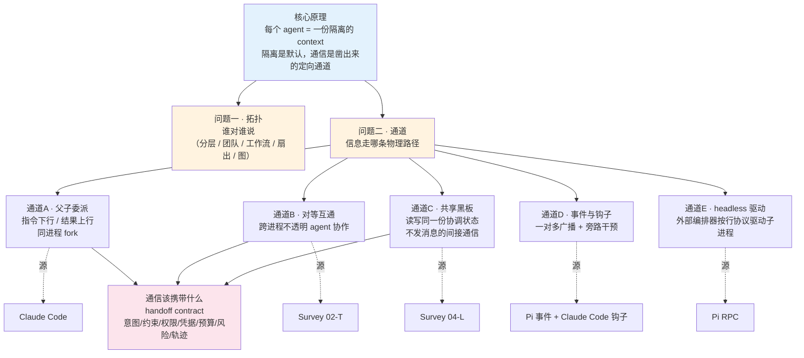
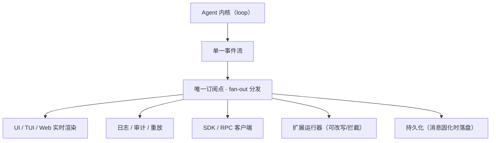

# 多 Agent 通信：交互协议与信息流

> **定位：综述。** 把三套来源里关于"多个 agent 之间怎么传递信息"的内容拢到一条线上——Claude Code 的父子委派模型、ETCLOVG Survey 的协议边界与编排模式、Pi 的事件订阅与 headless RPC。每条通道标出**共识**（多家都这么做 = 强信号）与**各家所长**（差异）。
>
> 相关已有笔记：[[Claude_Code-Harness_Engineering]]（父子 fork 与协调者模式）· [[04-L-生命周期与编排]]（编排模式与共享状态）· [[02-T-工具接口与协议]]（A2A/MCP 协议边界）· [[08-跨层综合与开放问题]]（handoff 开放问题）· [[24-AgentEvent-订阅模型与-Compaction-子系统]]（事件总线）· [[17-RPC-模式]]（headless 驱动）

---

## 全局地图



---

## 1. 核心原理：隔离是默认，通信是凿出来的定向通道

理解多 agent 通信，要先承认一个反直觉的前提：**多个 agent 之间默认是不通的**。每个 agent 跑在自己的一份 context window 里，看不见别人的对话历史、别人的工具结果、别人的中间推理。Claude Code 的子代理在 fork 时，凡是 mutable state 一律隔离——文件读取缓存克隆一份独立副本、abort controller 独立、memory 集合重新建空、状态回写默认关成空函数，子代理做的任何改动都不写回父代理（详见 [[Claude_Code-Harness_Engineering]] 第 7.3 节）。

**为什么默认隔离，而不是默认共享？** 因为隔离正是多 agent 存在的理由。单个 agent 把规划、执行、探索、各种工具输出全堆进同一个 context，任务一长就暴露三个毛病（[[04-L-生命周期与编排]] §4.4）：

- **上下文碎片化**：早期目标被后期的文件 dump 淹没；
- **误差累积**：前一步的小错被后面每步当既成事实推下去，没人回头纠正；
- **分解结构薄弱**：一边想大方向一边抠细节，揉成一锅。

多 agent 的全部手段就是**把揉在一起的活拆给隔离的角色**——各持独立 context 治碎片化、换个角色回头查治误差累积。隔离是收益的来源，不是要消除的障碍。

由此推出本篇的两条主线：

1. **隔离一旦成立，信息就不会自动流动**，必须显式凿一条通道把一个 agent 的输出送进另一个 agent 的输入。
2. **通道长什么样，完全由它跨哪条边界决定**——父子之间、对等进程之间、还是经由一份共享状态，机制截然不同。

---

## 2. 把"通信"拆成两个正交问题：拓扑与通道

"多 agent 怎么通信"其实纠缠着两个独立的问题，先拆开才不混：

- **拓扑（谁对谁说）**：信息流的组织形态——是一个中枢指挥一群下属，还是一组平级角色互相对话？
- **通道（信息走哪条物理路径）**：同一条"A 把结果给 B"的逻辑流，落到实处可以是一条 result 消息、一次 A2A 网络调用、或一份被双方读写的共享文件。

两者正交：**同一个拓扑可以配不同的通道**。分层编排既可以用父子 fork（同进程）实现，也可以用 A2A（跨进程）实现。所以下面 §3–§7 讲的是五条**通道**，而拓扑只是这一节先交代清楚的背景。

ETCLOVG Survey 把拓扑归纳为五种主要编排模式（[[04-L-生命周期与编排]] §5.1）：

| 拓扑模式 | 组织方式 | 典型场景 |
| --- | --- | --- |
| **分层（Hierarchical）** | 上层 controller 拆活给下层，再整合回来 | controller 接到"重构模块"，拆给 A 改数据层、B 改接口层，自己合并 |
| **团队（Team）** | 一组**命名角色**平级协调 | 产品 + 工程 + 测试 agent 像小团队互相推进 |
| **工作流（Workflow）** | agent 与 tool 编进**写死的阶段** | 写代码 → 固定调 lint → 修 → 流程固定 |
| **扇出（Fan-out）** | 多 agent **并行**探索多样解 | 同一 bug，5 个 agent 各试一种修法，挑最好的 |
| **图组合（Graph）** | agent/tool/state 都当图节点，多模式共存 | 用 LangGraph 把分层、团队、扇出混搭进一张图 |

> [!NOTE] 拓扑不是本篇重点
> 拓扑回答"组织成什么形状"，本篇的焦点是它下面那层——形状定了之后，节点之间靠什么把信息真正搬过去。后文五条通道，才是"协议/如何通信"这个问题的正面回答。

---

## 3. 通道 A · 父子委派：指令下行、结果上行（同进程）

**原理**：最常见的多 agent 形态是一个协调者 fork 出若干 worker。父子同在一个进程，但 context 隔离，所以通信被压成两条单向通道——**指令下行**（父给子一段自包含的任务）、**结果上行**（子把最终产出回传父）。这条通道是 Claude Code 协调者模式的核心（[[Claude_Code-Harness_Engineering]] 第 7 章）。

### 3.1 下行：自包含的 prompt 就是"协议报文"

worker 看不见协调者的对话。**每一条下发的 prompt 必须自包含**——这是这条通道的硬约束，也是它最容易退化的地方。协调者 prompt 里把规则写死：

```text
Workers can't see your conversation. Every prompt must be self-contained.

Never write "based on your findings" or "based on the research."
These phrases delegate understanding to the worker instead of doing it yourself.
```

```ts
// 反模式 —— 偷懒委派
Agent({ prompt: "Based on your findings, fix the auth bug" })

// 正解 —— 综合后的 spec：带文件路径、行号、确切改法
Agent({ prompt: "Fix the null pointer in src/auth/validate.ts:42. The user field
  on Session (src/auth/types.ts:15) is undefined when sessions expire but the
  token remains cached. Add a null check before user.id access — if null, return
  401 with 'Session expired'. Commit and report the hash." })
```

**这是多 agent 系统的命门**：真正稀缺的能力不是发任务，而是把 worker 带回的零散发现重新整理成清晰、可执行、可验证的下一步。缺了这层综合，多 agent 就退化成披着礼貌外壳的任务转发机——"研究可以委派，综合理解不能委派"。

### 3.2 上行：结构化的 result 报文

worker 结果以 **user-role message** 回到协调者，包在固定的 XML 标签里——这就是上行通道的报文格式：

```xml
<task-notification>
  <task-id>{agentId}</task-id>
  <status>completed|failed|killed</status>
  <summary>{human-readable status summary}</summary>
  <result>{agent's final text response}</result>
  <usage><total_tokens>N</total_tokens><tool_uses>N</tool_uses><duration_ms>N</duration_ms></usage>
</task-notification>
```

`<task-id>` 的值就是 agent ID，凭它可以 `SendMessage({ to: agentId })` **续轮**——把同一个 worker 唤醒，接着上一段上下文往下做。于是父子通道有三个动作：**新建**（`Agent`）、**续轮**（`SendMessage`）、**叫停**（`TaskStop`）。

### 3.3 续轮 vs 新建：通信也是上下文决策

要不要复用一个 worker，取决于上下文重叠度：

- 研究过的文件恰好要改 → **续轮**（带着研究上下文直接动手）；
- 研究范围广、实现范围窄 → **新建**（轻装上阵）；
- 验证别人写的代码 → **必须新建**——续用实现 worker 会携带实现假设，验证就退化成自我确认。

最后一条把"验证独立性"做进了通信拓扑：实现 worker 先自证一遍（第一层 QA），独立的验证 worker 作为第二层 QA。**"我改了代码"和"代码因此正确"之间隔着一条很宽的河。**

### 3.4 通道本身受工程约束：什么必须共享、什么必须隔离

父子虽然 context 隔离，但有一类东西**必须父子一致**——cache-safe params（system prompt、user/system context、工具定义等）。原因是 API 按前缀缓存：子代理若这些字段和父代理一字不差，就能命中缓存、价格降到 1/10；只要差一行，从差异点往后的缓存全失效，子代理付全价重算整个前缀。

| 维度 | 必须共享 | 必须隔离 |
| --- | --- | --- |
| 目的 | 命中 prompt cache | 防止互相污染 |
| 内容 | cache-safe params、内容替换决策 | 文件读取缓存、abort、memory、skill 列表、状态回写 |
| 例外 | —— | 后台 Bash 任务的清理回调**始终穿透到父**，否则变僵尸进程 |

这说明一件事：**父子通信通道不是随便建的，它被缓存经济学和状态安全双重约束**——该同步的同步（省钱），该隔离的隔离（防污染）。

---

## 4. 通道 B · 对等互通：A2A 协议（跨进程）

**原理**：父子模型里 worker 是父亲 fork 出来的、不透明但同源。当要协作的是**另一个独立部署、互相不透明的 agent 进程**时，父子那套继承机制用不上，需要一个跨进程的标准协议——这就是 A2A（[[02-T-工具接口与协议]] §2.3）。

A2A 跨越的是 **Agent ↔ Agent** 边界，类比微服务之间的 RPC。它的关键能力正好对应"跨进程对等"带来的新问题：

- **Discovery（发现）**：通过 Agent Card 找到对方提供什么服务——父子模型里子是父造的、无需发现，对等模型里必须先发现；
- **同步与流式交互**：短任务直接 request/response，长任务用 streaming 汇报进度；
- **Long-running task 一等支持**：A 委托 B 一个跑 30 分钟的任务，期间 B 报进度、A 查状态。

**为什么长任务必须一等支持**：agent 之间委派的活往往是"调研 X 产出报告""做完代码 review"这种数分钟到数小时级别的任务。协议若假设"调用必须几秒内返回"，整个协作模式根本不成立。这也是 A2A 与 function calling 的根本区别——后者单次调用是毫秒级，不需要这个能力。

A2A 之外，ACP / ANP 占同一条 Agent↔Agent 边界，走 HTTP 而非 JSON-RPC。

> [!WARNING] 易错点：MCP 不是 agent 间通信
> MCP 和 A2A 经常被放在一起比较，但它们各占一条边界、互补而非竞争：
> - **MCP** 走 Agent ↔ External Capability——agent **拿能力**（访问 GitHub、数据库、文件系统）；
> - **A2A** 走 Agent ↔ Agent——agent **拿另一个 agent**（委托一个专业 agent 做 review）。
>
> 一个真实系统通常同时用两者：通过 MCP 访问数据库，通过 A2A 委托另一个 agent。把 MCP 当成多 agent 通信协议是典型误解。

**父子 vs 对等，一句话区分**：父子是**同进程、同源继承、不透明下属**；A2A 是**跨进程、独立部署、不透明对等**。前者靠 fork 共享缓存省成本，后者靠 wire protocol 跨越部署边界。

---

## 5. 通道 C · 共享黑板：读写同一份协调状态（间接通信）

**原理**：前两条通道都是"A 主动把消息发给 B"。还有一种通信根本不发消息——**多个 agent 读写同一份外置状态，靠这份共享状态间接对齐**。这是黑板（blackboard）模型，也是多 agent 编排在状态层的必然结果（[[04-L-生命周期与编排]] §5.3）。

多 agent 比单 agent 多出一样东西——**一份要被多方读写的共享协调状态**，至少包含：

- **角色分配**：谁负责哪一块；
- **任务图**：任务被拆成什么样、子任务间什么依赖顺序；
- **共享 artifact**：各 agent 交出的中间结果；
- **协调状态**：整体推进到哪一步了。

要害在"多方共享"四个字：这份状态不归任何单独一个 agent，**没法靠"每个 agent 各自回放自己那条历史"拼出来**——A 的历史里压根没有 B 干过什么。所以它只能外置成大家都够得着的一份状态。这就是为什么多 agent 编排几乎清一色 Stateful：共享是因，stateful 是果。

到了完整任务流（issue → PR）这一级，这份共享状态干脆**直接落在 repo、branch、issue、PR 上**——OpenAI 的 Symphony 把 issue tracker + repository 当成 agent 工作的 control plane。代码库里真实发生的改动，本身就是天然可持久、可恢复、可验证的共享黑板。

> [!NOTE] 别把"共享"和"stateful"划等号
> 这里有两个独立维度：**stateless ↔ stateful**（继续时是重放历史还是读存好的状态）和**私有 ↔ 共享**（状态给一个 agent 用还是多个 agent 共用）。单 agent 存个只给自己 resume 的 checkpoint，没人共享，照样是 stateful。多 agent 的逻辑是：**"多方共享"这个需求倒逼出"必须 stateful"**——要让多个 agent 读到同一份状态，它就必须外置在大家够得着的地方。

---

## 6. 通道 D · 事件与钩子：一对多广播 + 旁路干预

**原理**：前三条通道是 agent 之间点对点传任务结果。但一个多 agent 系统还需要让**外围组件感知内部正在发生什么**（UI 渲染、日志审计、上层编排器追踪子 agent 进度），并在关键节点**旁路插一脚**（验证、注入反馈）。这靠事件总线 + 钩子，是**一对多广播**而非点对点委派。两套来源各有所长，但骨架是共识的。

### 6.1 Pi 的事件订阅：单一订阅点 + fan-out

Pi 的 Agent 内核**只暴露一个事件流 `AgentEvent`**，所有下游消费者通过订阅这一个流获取信号（[[24-AgentEvent-订阅模型与-Compaction-子系统]]）。物理结构上只有一个真正的订阅点，再由会话容器层做 fan-out 分发：



三条不变量决定了它是"观测通道"而非"控制通道"：

- **事件是只读投影**：订阅方不能改写事件本身，要改写动作必须走扩展的 before/after hook；
- **消息是事实来源**：订阅方不能假设事件携带完整状态，需要时从消息数组取；
- **失败收敛、不抛异常**：单个订阅方处理失败不阻塞其它订阅方。

一个反直觉但优雅的推论：**Compaction 也是订阅者**——它读最近一条 assistant 消息的 usage 决定要不要压缩，写压缩结果，再反向广播 `compaction_start/end` 让别人感知。它既消费事件、又产生事件。这说明事件总线不只是"往外报告"，也是系统内反应式动作的统一神经。

### 6.2 Claude Code 的钩子：把广播变成可干预的闸门

Claude Code 同样在子 agent 启停时发事件（`SubagentStart` / `SubagentStop` hook），但它多走一步——**把观测通道改造成可旁路干预的闸门**。`SubagentStop` 的 exit code 2 开辟了一条反馈通道：

```text
SubagentStop hook 脚本执行
 ├─ exit 0 → 放行，子 agent 正常结束
 ├─ exit 2 → stderr 内容经三层变换，作为一条 user 消息注入回子 agent
 │           → 子 agent 带着反馈继续下一轮（父全程阻塞，不知道子被打回过）
 └─ 其他非 0 → 记录但不阻止结束
```

关键点：**exit code 2 的 stderr 就是反馈通道**——hook 脚本往 stderr 写什么，子 agent 下一轮就看到什么。团队可以写一个验证脚本（跑测试、查规范），不通过就 `exit 2` 把失败原因写进 stderr，子 agent 收到反馈自行修复，整个过程在子 agent 内部闭环。

**两家对照**：

| | Pi 事件订阅 | Claude Code 钩子 |
| --- | --- | --- |
| 共识 | 事件驱动观测：内部动作通过事件流外溢，UI/日志/上层天然能感知 | 同 |
| 方向 | 纯只读投影，改写走扩展 hook | 观测之外，exit 2 可**反向注入消息**把子 agent 打回重做 |
| 定位 | 一对多广播的神经总线 | 广播 + 生命周期闸门（可中止、可注入、可清理） |

---

## 7. 通道 E · headless 驱动：外部编排器按行协议驱动子进程

**原理**：当多个 agent 需要**进程隔离**或**跨语言**（上层编排器是 Python，agent 是 Node），父子 fork 和事件订阅都用不上——需要一个语言无关的 wire protocol，让外部编排器把每个 agent 当子进程驱动。Pi 的 RPC 模式就是这条通道（[[17-RPC-模式]]）。

`pi --mode rpc` 让 agent 以 headless 方式跑起来，通过 stdin/stdout 上的 JSON 通信。协议是严格的 JSONL（只用 `\n` 分隔），三个方向：

| 方向 | 内容 | 关联方式 |
| --- | --- | --- |
| **stdin → agent**：Commands | 每行一个 JSON 对象（`prompt` / `steer` / `abort` / `new_session`…） | 带 `id` |
| **agent → stdout**：Responses | `type: "response"`，含 `success` | 用 `id` 关联请求 |
| **agent → stdout**：Events | 流式 JSON 行（`message_update` / `turn_end`…） | **无 `id`** |

这条通道的精妙在于**队列语义**——streaming 期间再发 prompt，必须声明何时送达：

- `steer`：排队，当前 turn 的工具调用全跑完、下次 LLM 调用前送达（中途纠偏）；
- `followUp`：排队，等 agent 完全停下来才送达（排在后面）。

这给了外部编排器在子 agent 跑到一半时插话的能力，而不必打断它。

> [!NOTE] RPC 的定位：不是 agent↔agent，是 orchestrator↔agent
> 严格说 RPC 跨的是"外部程序 ↔ 一个 agent"边界，不是对等 agent 之间。但在多 agent 系统里它极有用：一个自定义上层编排器可以 spawn 多个 `pi --mode rpc` 子进程，用 JSONL 分别驱动、用队列语义分别纠偏——这正是"需要进程隔离或跨语言时"的多 agent 通信底座。文档明确：Node/TypeScript 用户若不需要进程隔离，直接用 SDK 的 `AgentSession` 即可，无需 spawn 子进程走 RPC。

---

## 8. 通信该携带什么：handoff contract（开放问题）

**原理**：前面五条通道解决的是"信息走哪条路径"。还有一个被普遍忽视、且至今没有标准答案的问题——**一次交接到底该带上什么信息**（[[08-跨层综合与开放问题]] §3.4）。

把工作分布到 planner / subagent / tool / sandbox / evaluator / human 之间的那些接口，目前仍然**特别 ad hoc**。已有的局部标准只覆盖了"怎么传"：MCP（tool 访问）、A2A（agent 间通信）、OpenTelemetry（trace 底座）。缺的是一个**跨层交接契约（cross-layer handoff contract）**——规定一次 handoff 应当转移的不只是一段文字摘要，还要带上：

| 应携带 | 缺了会怎样 |
| --- | --- |
| **intent（意图）** | 接手方不知道为什么做这件事 |
| **constraint（约束）** | 接手方可能违反隐含限制 |
| **permission（权限）** | 不知道自己被允许做什么 |
| **artifact（产物）/ provenance（凭据）** | 拿不到中间结果，不知道证据来源 |
| **budget state（预算）** | 不知道还剩多少 token / 时间 |
| **risk level（风险）** | 无法判断该多谨慎 |
| **trace history（轨迹）** | 丢失"怎么走到这一步"的复现能力 |
| **unresolved decision（未决事项）** | 把已定的当未定、把未定的当已定 |

**只传摘要，接手方就丢了一半上下文。** 这一点正是 §3.1 那条"综合才是命门"在系统层的放大——协调者给 worker 的 spec 之所以要带文件路径、行号、确切改法，本质就是在手工拼一份 handoff contract。

> [!WARNING] 这个问题一半是技术、一半是制度
> 代用户跨系统行动，还需要 agent identity、delegation、permission manifest、auditability。开放问题是：设计一个 handoff protocol，**既丰富到足以保住 safety / recovery，又简单到能被广泛采用**——它要讲清：谁授权了这个 action、转移了哪些 state、什么证据支撑当前 plan、接手方被允许做什么、什么时候必须把控制权交回去。

---

## 9. 收尾：五条通道一图对照

| 通道 | 跨什么边界 | 信息怎么走 | 锚定来源 | 适用 |
| --- | --- | --- | --- | --- |
| **A 父子委派** | 同进程父 ↔ 子 | 指令下行（自包含 spec）/ 结果上行（result 报文）/ SendMessage 续轮 | Claude Code | 协调者拆活给隔离 worker |
| **B 对等互通** | 跨进程 agent ↔ agent | A2A：Agent Card 发现 + 同步/流式 + 长任务 | Survey 02-T | 跨部署、互不透明的专业 agent 协作 |
| **C 共享黑板** | 多方 ↔ 一份外置状态 | 读写共享协调状态 / repo 当 control plane | Survey 04-L | 角色分配、任务图、跨 run 持久协作 |
| **D 事件与钩子** | 内核 ↔ 外围 + 闸门 | 单一事件流 fan-out 广播；exit 2 反向注入 | Pi + Claude Code | 观测、审计、验证、旁路干预 |
| **E headless 驱动** | 外部编排器 ↔ agent 子进程 | JSONL command/response/event + steer/followUp 队列 | Pi RPC | 进程隔离、跨语言的上层编排 |

三条贯穿全篇的判断：

1. **隔离是默认，通信是成本**——每凿一条通道都要付代价（cache 失效、协调开销、状态一致性），所以简单任务硬拆多 agent 往往得不偿失。
2. **综合不能委派**——无论哪条通道，把信息搬过去之后，"读懂并整理成可执行下一步"这件事必须由发起方自己做，否则多 agent 退化成任务转发机。
3. **传路径易、传内容难**——MCP/A2A/RPC 解决了"怎么传"，但"一次交接该带哪些 state"仍是开放问题，决定了多 agent 系统的 safety 与可恢复性上限。
