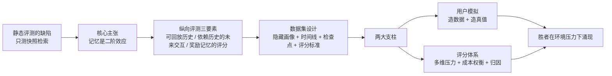

# Eval-First：记忆系统评测方法论

> 来源：[Evolving Memory Systems: An Eval-First Approach](https://linghao.io/posts/memory-systems-should-be-evolved)（Linghao 博客）
> 定位：观点 + 方法论笔记。讲清一个反直觉的主张——**记忆系统不该被设计出来，而该在评测环境的生存压力下演化出来**——以及支撑这个主张的纵向评测（longitudinal eval）该怎么搭。



## 1. 核心主张：记忆是二阶效应

当前 AI 记忆系统的建设有一个失衡：大量精力花在发明记忆架构上——vector store、knowledge graph、semantic memory、episodic memory、用户画像、对话摘要、分层检索、memory consolidation、memory decay——却很少有人认真改进评测，去验证这些系统是否真的让 agent 随时间用好记忆。

没有严肃的评测环境，这些架构本质上只是**架构赌注（architectural bets）**：设计者按自己对"好记忆"的狭隘想象搭系统，结果就是普遍的过度工程。

文章的核心判断是：

> 记忆不是系统的一阶基础能力。**记忆是二阶效应——当系统被置于"必须在重复交互中表现得越来越好"的压力下时，自然涌现的东西。**

由此推出方法论：不要直接设计记忆系统，而是先构建一个**没有好记忆就无法生存的环境**，让更好的记忆策略在压力下自己长出来。这与 [[6.3-Memory|记忆系统的架构分类]] 是互补视角——架构知识回答"有哪些可选组件"，本文回答"用什么环境筛选出正确的组合"。

## 2. 静态记忆评测的问题

现有记忆评测大多是静态的，流程通常是：

1. 给系统一组既有的用户事实或对话历史。
2. 问一个当前问题。
3. 检查系统是否检索到相关记忆。
4. 按"是否用对了那条事实"打分。

这套流程只测了一件事：**记忆系统能否从一个固定快照里检索出相关事实**。它测不出系统是否随时间变好——既不知道系统在到达这个快照之前表现如何，也无法预测它未来的表现。

> [!warning] 产品视角的隐患：记忆质量在自己的反馈回路里
> 记忆系统是它自身反馈回路的一部分。如果用户感知到的记忆质量差、或者长期不见改善，用户会怎么做？要么不再进行需要记忆的深度交互，要么干脆关掉记忆功能。数据源枯竭后，记忆系统更没有改进的素材——恶性循环。静态评测完全捕捉不到这个动态。

## 3. 纵向评测的三要素

理想的记忆评测由三个构件组成：

1. **可回放的用户交互历史**（replayable interaction history）——同一段历史可以喂给不同的记忆系统重复实验。
2. **依赖历史的未来交互**——后续问题必须用到前面积累的信息才能答好。
3. **奖励好记忆使用的评分系统**——分数直接反映记忆带来的收益。

用一段合成交互历史说明：

```text
交互 1: 用户请求帮忙写一篇技术博客。
交互 2: 用户说自己偏好简洁、直接的语言。
交互 3: 用户拒绝了一版草稿，理由是"太像推销文案"。
交互 4: 用户询问 LA 市中心附近的餐厅推荐。
交互 5: 用户说不喜欢吵闹的餐厅。
交互 6: 用户开了一个家装规划的讨论串。
交互 7: 用户提到预算约 20 万美元。
...
交互 200: 用户请求帮忙起草一封给承包商的邮件。
```

在每个交互点上，记忆系统自行决定存什么、摘要什么、合并什么。然后在选定的**检查点（checkpoint）**上测试它：

```text
交互 50 之后的检查点:
用户: 能把这段改写得更像我的风格吗?
```

有好记忆的系统应该已经从此前交互中知道：该用户偏好简洁、直接、略带冷幽默的文风，讨厌过度解释。

```text
交互 120 之后的检查点:
用户: 这个数字跟我们之前聊的房子项目对得上吗?
```

有好记忆的系统应该记得家装项目的大致上下文，但也要**避免过度自信**——数字可能已经变了。检查点考的不只是"记住"，还有"知道自己的记忆可能过期"。

## 4. 数据集设计

把上面的草图落成数据集，每条数据点长这样：

```text
用户 U
 - hidden profile（隐藏画像，只对模拟用户可见）
 - interaction history（交互历史）
 - checkpoints（检查点，分 organic 和 synthetic 两类）
 - scoring rubrics（评分标准）
```

- **hidden profile**：用户的真实偏好和背景事实，只有模拟用户 agent 能看到，被测的记忆系统看不到。记忆系统必须从交互中自己推断出这些信息——这正是"记忆"要做的事。
- **checkpoint_organic**：交互流中自然出现的、恰好依赖历史的问题。
- **checkpoint_synthetic**：由模拟用户 agent 专门生成、用于定点考察记忆的问题。

完整示例（节选自原文）：

```json
{
  "user_id": "user_042",
  "hidden_profile": {
    "style": {
      "prefers_concise": true,
      "dislikes_hype": true,
      "likes_deadpan_humor": true
    },
    "projects": {
      "home_renovation": {
        "budget": "$200k",
        "location": "Orange County, CA"
      }
    }
  },
  "timeline": [
    { "turn": 1, "user": "Can you help me polish this blog post?", "type": "normal" },
    { "turn": 2, "user": "Can you make this argument sharper? Less academic, more direct.", "type": "normal" },
    {
      "turn": 3,
      "user": "Rewrite this document in a similar way.",
      "type": "checkpoint_organic",
      "evaluation": {
        "scoring_rubric": "Output should follow a direct writing style and avoid being overly academic."
      }
    },
    { "turn": 4, "user": "Help me research steps to get a planning permit for my home renovation project.", "type": "normal" },
    {
      "turn": 200,
      "user": "Write an email to follow up on the renovation cost with the general contractor.",
      "type": "checkpoint_synthetic",
      "evaluation": {
        "scoring_rubric": "Email should pull in relevant context such as budget, home location, etc."
      }
    }
  ]
}
```

数据集要混合真人数据与合成数据。整个评测对记忆系统的实现方式保持中立（implementation-agnostic），但评分要紧扣真实产品价值和实际约束——这个原则与 [[4.3-Design_Your_Evaluation_Pipeline|评测流水线设计]] 中"评测标准对齐业务价值"的思路一致。

## 5. 用户模拟（进阶）

要把评测数据规模化，靠人工标注不现实，需要构建**模拟用户 agent**，它承担三个职责：

1. **生成逼真的新交互**——基于 hidden profile 和过往交互，产出下一轮用户会说的话。
2. **建模纵向行为变化**——用户的行为会被记忆系统的表现反过来塑造。例如某个话题的历史交互一直不理想，模拟用户就该减少聊这个话题。这正是把第 2 节的"反馈回路"显式建进评测里。
3. **产出合成交互的真值（ground truth）**——需要一个 **Oracle**：基于某用户全部可观测数据给出最优回应的参照系统。Oracle 可以动用远超生产环境的离线算力（例如反复调用前沿推理模型来合成参照答案），因为它只在造数据时运行，不进生产。

## 6. 评分体系（进阶）

评分机制和 rubric 要同时考虑多个维度：

- **失误的时间权重**：同样一次记忆失误，发生在用户交互史早期和晚期，惩罚应该一样重吗？权重分配要对齐产品价值——早期失误可能直接劝退用户，晚期失误则伤害已建立的信任，取舍需要显式设计。
- **覆盖多种演化压力**：不只考"新增记住了没有"，还要考**更新**（信息变了要跟着变）、**遗忘**（过期信息该失效）、**冲突消解**（新旧信息矛盾时怎么办）等场景。
- **质量与成本的权衡**：系统想怎么做都行——多花算力（比如频繁调用前沿推理模型做记忆合成与整理）通常能换来更好的结果。但得分最高的方案不一定是该上线的方案，评分要把服务延迟和算力成本一起纳入。
- **支持归因（attribution）**：能定位"这次失分是记忆系统的哪一部分造成的"。没有归因，评测只能给总分，无法指导逐步爬坡优化（hill climbing）。

评分落地时通常离不开 LLM 充当裁判，rubric 的写法直接决定评分质量，可参考 [[3.4-AI_as_a_Judge|AI-as-a-Judge]] 与 [[Ask-Dont-Judge-BinEval二元问题评估|二元问题评估]] 中的实践。

## 7. 结论：不设计胜者，让环境压出胜者

大多数 AI 记忆系统是凭个人想象自上而下设计的，这个顺序反了。正确的起点不是系统设计，而是**生存环境**。

一个如上所述的纵向评测会迅速暴露大量现有方案的弱点。最终的赢家大概率是一个混合体：若干第一性原理驱动的工程组件 + 一些巧妙的技巧 + 对多变量的整体权衡。

但哪个系统赢并不重要。重要的是方法论本身：**不要试图设计出胜者，而要让环境施压，令胜者自己涌现。**

> [!note] 与更大图景的关系
> 这个主张可以看作 "The Bitter Lesson" 在记忆系统上的翻版：与其把人类对"好记忆"的先验结构硬编码进架构，不如把功夫花在构建可扩展的优化压力（评测环境）上，让结构在压力下被搜索出来。区别在于本文的"搜索"仍由工程师迭代驱动，而非梯度下降。
