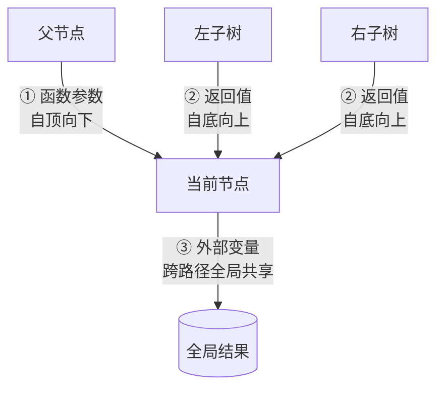
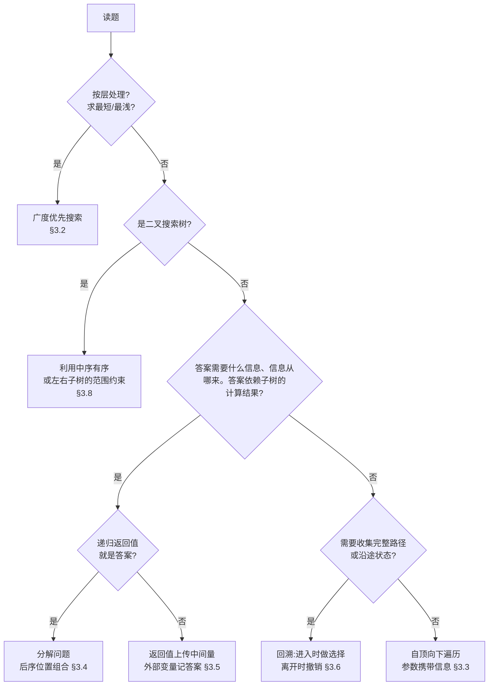

# LeetCode 树题完整解题攻略

> [!info] 关于本攻略
> 适用范围:二叉树、二叉搜索树(BST)、N 叉树、一般树(图表示)。
> 核心来源:[labuladong 二叉树心法](https://labuladong.online/algo/essential-technique/binary-tree-summary/)、[灵茶山艾府二叉树题单](https://leetcode.cn/circle/discuss/K0n2gO/),并按第一性原理重新组织。

---

## 1. 第一性原理:所有树题的共同本质

### 1.1 树是递归定义的结构

一棵树 = **根节点 + 若干棵(更小的)子树**。这个定义本身就是递归的,所以树天然适合递归算法——递归函数处理"根 + 子树"这一层,剩下的交给递归自己。

先把两个易混概念分开:**递归**的思想是"用子问题定义问题"(怎么分解),**DFS** 的思想是"一条路走到底再回头"(访问次序),范畴不同、互不隶属——DFS 可以用显式栈实现,递归也可以服务于排序等非遍历目的。但有一条单向定律把它们在树上焊在一起:**递归代码的执行轨迹必然是深度优先的**(调用栈压到底才返回,这是调用栈的物理性质)。树又是递归定义的结构,"按定义处理树"自然写成递归,跑起来自然是 DFS。所以本章基于递归的全部工具(时机、通道、模式)都属于 DFS 家族。

由此推出全部树题的统一框架:

> [!abstract] 全攻略的统一框架
> **任何递归树算法 = 遍历每个节点 + 回答三个问题:**
>
> 1. **每个节点要做什么事?**(单点逻辑)
> 2. **这件事在什么时机做?**(前序 / 中序 / 后序位置,§1.2)
> 3. **信息怎么进出这个节点?**(参数下传 / 返回值上汇 / 外部变量,§1.3)

第三问不能由第二问推出:时机只决定信息何时就绪,不决定答案从哪条路出去——直径(543)的逻辑在后序时机,但答案走的是外部变量而非返回值。三问分工:做什么、何时做、信息怎么流。

剩下的"访问所有节点"由递归框架保证,不需要操心。能把一道树题拆成这三个问题,题目就解了一半。唯一不走这个框架的家族是 BFS 层序遍历——它用队列替换了递归本身,时机和返回值上汇这些概念在队列循环里都不存在,见 §3.2。

### 1.2 前中后序是三个"时机",不是三种"顺序"

初学时容易把前中后序理解成"三种输出列表"。更本质的理解是:递归遍历走的路线只有一条、固定不变,但控制流在"路过"每个节点时恰好经过它三次——**这三次就是前序、中序、后序三个时间点,每个节点各自恰好拥有一次**。所谓前/中/后序遍历,只是选择在哪一次路过时"做事",行走路线一模一样:

```python
def traverse(root):
    """遍历框架:三个注释位置就是三个时机。"""
    if root is None:
        return
    # 前序位置:刚进入这个节点,左右子树都还没碰
    traverse(root.left)
    # 中序位置:左子树处理完毕,即将进入右子树
    traverse(root.right)
    # 后序位置:左右子树全部处理完,即将离开这个节点
```

用三节点的树(根 1,左孩子 2,右孩子 3)跟踪一遍,控制流的完整时间线:

```text
进入 1           ← 1 的前序位置(左右子树都还没碰)
│ 进入 2         ← 2 的前序位置
│ │ 左孩子为空,返回
│ │              ← 2 的中序位置
│ │ 右孩子为空,返回
│ 离开 2 前       ← 2 的后序位置
│ 回到 1          ← 1 的中序位置(左子树整棵完成,右子树未开始)
│ 进入 3          ← 3 的前序位置(中序、后序同 2,略)
离开 1 前         ← 1 的后序位置(整棵树处理完毕)
```

直观图像:沿树的外轮廓逆时针描一圈,每个节点被笔尖擦过三次——从上方第一次碰到(前序)、从左下方绕回来(中序)、从右下方绕回来即将离开(后序)。在前序位置打印就得到前序遍历,在后序位置打印就得到后序遍历——输出不同纯粹因为打印时机不同。

- **前序位置**:只能拿到从父节点通过**函数参数**传下来的信息(自顶向下)。
- **中序位置**:左子树的递归刚返回、右子树还没开始,所以手里比前序多一份"左子树的处理结果"。这个时刻只有二叉树才有:中序位置本质是两次子树调用之间的缝隙,节点有 k 棵子树时缝隙有 k−1 个——二叉树缝隙恰好唯一,N 叉树(k≥3)有多个"中间",哪个都没资格叫中序,所以"N 叉树中序遍历"这个概念不存在。它的主要用武之地是 BST:定义保证"左子树全部 < 根 < 右子树全部",而中序恰好按"左→根→右"输出,两相对应,输出必然严格升序(详见 §3.8)。
- **后序位置**:能拿到左右**两棵子树的返回值**,信息最全,能力最强。

三个位置的能力依次增强。一个经典对比:


| 任务           | 需要的信息      | 时机          |
| ------------ | ---------- | ----------- |
| 打印每个节点所在的层数  | 父节点传下来的深度  | 前序位置(参数传递)  |
| 打印每个节点的子树节点数 | 左右子树各有多少节点 | 后序位置(返回值汇总) |


由此得到一条高频判断规则:**题目一旦和"子树"有关(子树高度、子树和、子树是否平衡……),答案就依赖子树的计算结果,逻辑必须写在后序位置,并通过返回值上传。**

### 1.3 信息只有三条流动通道

递归过程中,信息的流向只有三种,每种对应一个语法载体:




| 通道   | 载体                      | 典型用途                   |
| ---- | ----------------------- | ---------------------- |
| 自顶向下 | 函数参数                    | 当前深度、路径剩余目标值、祖先的最大值    |
| 自底向上 | 函数返回值                   | 子树高度、子树和、子树是否合法        |
| 全局共享 | 外部变量(`nonlocal` / 成员变量) | 直径、最大路径和这类"答案不在返回值里"的题 |


很多难题的"难",仅仅是因为同时用到两条以上通道(比如直径:返回值上传高度 + 外部变量记录答案)。把通道拆开看,难题就退化为通道的组合。

通道和 §1.2 的时机是两套坐标:通道说信息往哪流,时机说代码何时执行,把它们连起来的是"就绪时间"——下传的参数在整个函数体内都可见,三个时刻都能用;子树的返回值则有先后,左子树的结果中序才有,右子树的结果后序才有。所以习惯说法"自顶向下 = 前序、自底向上 = 后序"的准确含义是:只依赖下传信息的逻辑**最早**在前序位置就能执行,依赖左右子树结果的逻辑**最早**也得等到后序位置。中序夹在中间(只有左子树结果),两类套路都排不上它,这正是它几乎只为 BST 服务的另一面。

### 1.4 两种思维模式:遍历 vs 分解问题

这是 labuladong 体系的核心。先澄清它和 §1.1 统一框架的关系,两者不在同一层、不冲突:统一框架是**执行层**的事实——任何解法跑起来都是递归走遍每个节点,逻辑挂在某个时机上,分解模式的代码也不例外;两种思维模式是**设计层**的选择——写代码时信息怎么组织,是"人走树"(参数下传 + 外部变量收结果)还是"定义子问题"(返回值逐层上汇)。两种模式是到达同一个执行框架的两条设计路径,写完任何一种,回头都能在代码里指出哪行处于前序位置、哪行处于后序位置。

拿到任何树题,先依次问自己两个问题:

**模式一:遍历(traverse)。** "能否遍历一遍树,边走边做事,得到答案?"

> **无**返回值,答案放外部变量

- 函数**无返回值**,结果记在外部变量里。
- 关注的是"走过每个节点/每条树枝"这个过程本身。
- 进化方向是**回溯算法**:在进入/离开节点(或树枝)时做选择、撤销选择。

**模式二:分解问题(divide & conquer)。** "能否定义一个递归函数,用**子树的答案**推导出**整棵树的答案**?"

> **有**返回值,写清函数定义然后信任它

- 函数**有返回值**,且必须先用一句话写清函数定义(它接收什么、返回什么),然后**完全信任这个定义**去组合子问题,不要跳进递归里逐层验证。
- 进化方向是**动态规划**:子问题分解 + 最优子结构。

两种模式和 §1.3 三条信息通道的关系,一句话说清:**模式没有引入任何新机制,它只是给常用的通道组合起了名字**。遍历模式用 ①参数(携带过程状态)加 ③外部变量(没有返回值,结果只能从这里出去);分解模式以 ②返回值为骨干。所以分析一道题,最终落点都是"用了哪几条通道",常见组合一共四种:


| 组合      | 用到的通道         | 典型题                                            |
| ------- | ------------- | ---------------------------------------------- |
| 遍历模式    | ① 参数 + ③ 外部变量 | 112 路径总和、1448 好节点、113 回溯收集路径                   |
| 分解模式(纯) | ② 返回值         | 104 最大深度、100 相同的树、110 平衡                       |
| 分解 + 全局 | ② + ③         | 543 直径、124 最大路径和(返回值上传单边,外部变量记拐点答案,§3.5)       |
| 下传 + 上汇 | ① + ②         | 98 验证 BST(参数带区间、返回合法性)、1080 不足节点(参数带限额、返回是否删除) |


后两行正好解开进阶题常见的困惑:直径类解法有返回值、像模式二,又用外部变量、像模式一,到底算哪种?按通道看就清楚了——它是"分解为主,借通道③把不在返回值里的答案带出来"。灵茶山艾府题单的"有递有归"分类,说的正是 ①+② 组合:递的时候带状态下去,归的时候带结果上来。

两种模式经常都能解同一道题,以最大深度(LC 104)为例:

```python
def max_depth_traverse(root):
    """遍历模式:带着当前深度走遍全树,在叶子处更新最大值。"""
    ans = 0
    def traverse(node, depth):
        nonlocal ans
        if node is None:
            return
        ans = max(ans, depth)
        traverse(node.left, depth + 1)
        traverse(node.right, depth + 1)
    traverse(root, 1)
    return ans

def max_depth_divide(root):
    """分解模式:函数定义——返回以 root 为根的子树的最大深度。
    整树深度 = 1 + max(左子树深度, 右子树深度),组合逻辑天然落在后序位置。"""
    if root is None:
        return 0
    return 1 + max(max_depth_divide(root.left), max_depth_divide(root.right))
```

两种解法贴上时机标签:遍历版的更新动作在**前序位置**(刚进节点,"当前深度"在来路上已攒齐);分解版的组合动作在**后序位置**(必须等子树返回)。所以"用前序还是后序"是**解法的属性,不是题目的属性**——104 两条路都通,根本原因是"深度"这个量双向都可计算:既能从根往下数步数,也能从叶往上数层数。不是所有题都双向通:1448 好节点依赖"根到当前节点的来路",只能下传(前序);110 平衡判断依赖"脚下子树的高度",自顶向下的参数里不可能装着还没走过的子树信息,只能上汇(后序)。

选择标准,首先思考:**"算出答案需要什么信息,信息从哪来?"**

- 依赖**从根走来的路**(收集路径、统计沿途经过)→ 参数下传(通道①)→ 逻辑落在前序 → 遍历模式。
- 依赖**脚下的子树**(高度、节点数、是否平衡、是否对称)→ 返回值上汇(通道②)→ 逻辑落在后序 → 分解模式。
- 两个方向都能算(如 104 的深度)→ 两种都行,分解模式通常代码更短。

### 1.5 一个危险信号:递归套递归

如果写出了"在遍历函数里,对每个节点再调用另一个递归函数"的代码(例如最直接地解二叉树直径:遍历每个节点,对每个节点算一次最大深度),复杂度会从 O(n) 恶化到 O(n²)。

这种结构出现时,几乎总能用**后序位置**优化:外层想要的信息,内层递归在后序位置"顺便"算出来了,把外层逻辑搬进内层的后序位置即可(详见 §3.5 直径与路径型)。

---

## 2. 解题决策流程

拿到一道树题,按下面的流程定位题型:




补充两条不在流程图里的识别信号:

- 题目给的是**遍历序列**要求**还原/构造**树 → §3.9 构造与序列化。
- 每个节点有**多种状态可选**(偷/不偷、装/不装摄像头),求全局最优 → §3.10 树形 DP。

### 2.1 实操顺序:两道闸 + 三个问题

> **根入队 → 锁层数 → 逐个出队、顺手挂娃**。

模式(§1.4)、通道(§1.3)、时机(§1.2)是同一个决定的三种说法:信息依赖方向定了,三者同时确定,不存在"先选模式还是先选时机"的问题。实战中真正的思考顺序:

先过两道闸(流程图头两问,特例捷径):按层处理 → BFS;是 BST → 中序有序或区间约束。

两道闸都是单向捷径,不是硬性分界。第一道:树上 BFS 的全部价值只有"层"——层语义(逐层输出/每层统计)和按深度提前终止(111 第一个叶子必在最浅层),题目没有层的概念就没有 BFS 的出场理由,直接进递归框架。

闸没拦住,连问三个问题:

1. **答案是什么?**(一个数、一个布尔、一棵改造后的树、一组路径)
2. **在某个节点处,"答案需要什么信息、信息从哪来"：**(来路 → 参数下传;子树 → 返回值上汇;要收集完整路径 → 回溯)
3. **直接写函数签名**:要不要返回值?返回什么?参数带什么?返回值装不下答案就加外部变量。签名写出,模式/通道/时机全部尘埃落定,剩下的是填空。(写出的签名和题目给的签名对不上时,加辅助函数,见 §2.2)

以 543 直径为例走一遍:答案是一个数(最长路径边数);算它需要左右子树深度——只能上汇;但函数该返回的是深度(给父节点用),答案直径装不进返回值——加外部变量。签名 `def depth(node) -> int` 加 `nonlocal ans`,组合逻辑自然落在后序位置,整体即"分解为主 + 全局变量"。全程没有一步是"选模式"——模式只是写完签名后回头描述代码长相的词。

### 2.2 辅助函数:修正签名的工具

§2.1 第 3 步落点是"写出递归真正需要的签名"。写完往往发现:**题目给的函数签名,不够递归用**。辅助函数就是用来补这个差的——它不是高级技巧,只是"修正签名"。

判断标准一句话:**『题目给的签名』和『递归需要的签名』对不上,就开辅助函数。** 四类信号:

| 信号 | 典型题 | 题目签名 | 递归需要 | 辅助函数 |
| ------------- | --------- | ------------------- | --------- | ----------------------- |
| 递归参数比题目多 | 101 对称 | `isSymmetric(root)` | 两个节点对比 | `is_mirror(p, q)` |
| 参数带下传状态 | 98 验证 BST | `isValidBST(root)` | 还要带区间 | `check(node, low, high)` |
| 返回值 ≠ 题目返回值 | 110 平衡 | 要 bool | 递归要返回高度 | `height(node)` |
| 用到外部变量(通道③) | 543 直径 | `diameter(root)` | 内层更新全局答案 | `depth(node)` + `nonlocal` |

> [!warning] 第 3、4 行都在说"返回值",分界是"能否身兼两职"
> 两行典型题都满足"题目答案 ≠ 递归返回值",真正的分界在于**那一个返回值能不能同时装下两样东西**(既当给父节点的中间量,又把题目答案带出去):
> - **能 → 第 3 行,仅加辅助函数**:110 平衡的返回值身兼两职——既是高度(给父节点),又用 `-1` 哨兵编码"已失衡"(题目答案)。一个返回值搞定,通道②够用,**不需要外部变量**(§3.4)。
> - **不能 → 第 4 行,辅助函数 + 外部变量**:543 直径的返回值必须是干净的深度(给父节点继续算,塞了别的递归就崩),而答案"拐点直径 = 左深 + 右深"是另一个数,和深度抢同一个出口,只能被挤到通道③外部变量带出去(§3.5 双轨制)。
>
> 所以 §2.1 例子里"答案直径**装不进**返回值"指的是第 4 行(名额被中间量占死),不是第 3 行的"返回值**类型** ≠ 题目返回值"(换个返回类型即可)。

反过来,题目签名本身就够递归用时**不要**加辅助函数:100 相同 `isSameTree(p, q)`(天生两参)、104 最大深度、226 翻转,直接在原函数上递归。

> [!tip] 速记
> 100 不用辅助函数、101 必须用,差别只在题目签名:100 的题目签名 = 它需要的递归签名;101 的 `isSymmetric(root)` 只有一个参数,喂不进"两棵子树对比"所需的两个指针,只能另开 `is_mirror(p, q)`。

凡是用到通道③(§1.3)的题,几乎必然配辅助函数:外层负责初始化外部变量、最后返回它;内层辅助函数负责递归、沿途更新它。两者职责不同,所以分开写(见 §3.5 直径)。

---

## 3. 题型分类详解

每个题型按统一结构展开:**本质 → 识别信号 → 模板 → 代表题 → 易错点**。

另标**高频度**(2026-06 数据):★★★ 面试必备 / ★★ 常见 / ★ 低频。主要依据 [CodeTop](https://codetop.cc) 国内大厂面经频度统计(括号里的数字即其频度值,等于近年面经出现次数),辅以 LeetCode 热题 100、Top Interview 150、Blind 75 / NeetCode 150(外企)交叉印证。

### 3.1 遍历基础:递归、迭代与 Morris

> [!info]- 高频度 ★★★
> 94(144)高频、144(84)中频、145(42)中频;递归版是热身题,"不用递归再写一遍"是高频追问。94 在热题 100。

**本质**:所有后续题型的地基。递归和迭代是实现"重复"的两种语言层方式:递归靠函数自调用,未完成的活记在**调用栈**里(语言自动管理);迭代靠 while 循环,未完成的活记在**自己维护的容器**里(本节"迭代"特指显式栈的 DFS;§3.2 BFS 的队列循环同样是迭代)。DFS 遍历必须记住"回头路",三种实现只是回头路的存放位置不同,访问顺序完全相同:


| 实现      | 回头路存在哪                        | 额外空间 | 何时用                                                                                  |
| ------- | ----------------------------- | ---- | ------------------------------------------------------------------------------------ |
| 递归      | 函数调用栈(语言自动管理)                 | O(h) | **默认**,绝大多数题                                                                         |
| 迭代(显式栈) | 自己 push/pop 的 stack           | O(h) | 需要可暂停的遍历(173 的 `next()` 走一步停一步,递归做不到);爆栈风险(Python 调用栈默认约 1000 层,链状树会 RecursionError) |
| Morris  | 借叶子的空闲右指针临时指回中序后继(线索二叉树),走完拆除 | O(1) | 题目明确要求 O(1) 空间(99 的进阶要求);平时了解思想即可(深入)                                                |


"何时用"那列就是实战优先级:默认递归,右边两种是约束触发的备用件,信号没出现就不要写。迭代版里只有**中序模板**("压到底再弹出")值得单独掌握——一个骨架覆盖 94 和 173,也是面试"不用递归再写一遍"的标准答案:

```python
def preorder_iterative(root):
    """迭代前序:栈模拟递归。先压右子再压左子,保证左子先出栈。"""
    res, stack = [], [root] if root else []
    while stack:
        node = stack.pop()
        res.append(node.val)
        if node.right:
            stack.append(node.right)
        if node.left:
            stack.append(node.left)
    return res

def inorder_iterative(root):
    """迭代中序:一路向左压栈到底,弹出时访问,再转向右子树。"""
    res, stack, node = [], [], root
    while stack or node:
        while node:
            stack.append(node)
            node = node.left
        node = stack.pop()
        res.append(node.val)
        node = node.right
    return res
```

> [!example] 代表题
> 144 前序、94 中序、145 后序、589/590(N 叉树前后序)。

> [!warning] 易错点
> 迭代后序最麻烦,不值得单独背模板——按"根右左"写一次前序变体,结果整体反转即得后序。

### 3.2 BFS 层序遍历

> **根入队 → 锁层数 → 逐个出队、顺手挂娃**。

> [!info]- 高频度 ★★★,全攻略最高
> 102(328)是树类第一、CodeTop 全站第 11;103(266)树类第二;199(161)树类第五;662(83)、958(47)也常见。国内面试问到树,大概率从这节出题。

**本质**:用队列把"递归的深度优先"换成"逐层的广度优先"。树的 BFS 是图 BFS 的特例,也是"无权图最短路径"思想的来源——**第一次到达即是最短**。

> [!tip] 速记
>
> - 遇到层序题 → 直接写队列+循环,不要纠结"能不能递归"。
> - 遇到"最浅 / 最近 / 第一个出现"且想提前终止 → 必须真 BFS;"递归 + depth"的假层序在这种题上会退化成走全树(111 是分界例题)。

BFS 为什么写成队列加循环,而不是递归?

1. **BFS 写成队列 + 循环**,原因:递归在这里零收益——FIFO 队列递归给不了,还得自己造,那递归就没有存在的理由。(你的总结对应这句的前半。)
2. 有一种写法(递归 + depth 参数)输出也按层分组,长得像层序遍历,但它不是 BFS——它的访问顺序还是深度优先,没有"第一次碰到即最浅"的能力。

**识别信号**:题目出现"每一层""自上而下/自下而上按层""最浅/最近""右视图""锯齿形"等字眼。

```python
from collections import deque

def level_order(root):
    if root is None:               # ① 空树:没有任何层,直接返回空列表
        return []
    res, q = [], deque([root])     # ② res 是最终答案;q 是队列,初始只有根节点在排队
    while q:                       # ③ 只要还有节点在排队,就继续处理
        size = len(q)              # ④ 拍快照:现在队列里有几个节点,这几个就是"当前这一层"
        level = []                 # ⑤ 准备一个空列表,收集这一层的值
        for _ in range(size):      # ⑥ 精确地循环 size 次——只处理这一层
            node = q.popleft()     # ⑦ 队头节点出列
            level.append(node.val) # ⑧ 把它的值记入这一层
            if node.left:          # ⑨ 它的左孩子(属于下一层)排到队尾
                q.append(node.left)
            if node.right:         # ⑩ 右孩子同样排到队尾
                q.append(node.right)
        res.append(level)          # ⑪ 这一层收集完毕,整体放进答案
    return res                     # ⑫ 队列空了 = 所有节点处理完了
```

三个变量各司其职:`q` 装待处理节点,`level` 收集当前层的值,`res` 每完成一层追加一次。模板成立靠一条循环不变量:**每轮 while 开始时,队列里恰好是"某一层的全部节点",从左到右排列**。归纳证明:初始时队列只有根(第 0 层全部);内层 for 恰好弹出 `size` 个节点——本层全部,每弹一个就把它的孩子追加到队尾,父节点左到右弹出,孩子也就左到右入队;for 结束时本层弹空,队列剩下的恰好是下一层全部——不变量在下一轮继续成立。队列的 FIFO(先进先出)性质是地基:上一层先入队必然先出队,层与层不会穿插。

关键设计就一处:**④ 为什么要先把** `len(q)` **存进** `size`**?**

因为 ⑥–⑩ 的循环过程中,一边在弹出本层节点,一边在往队尾塞下一层的孩子,队列长度一直在变。但"这一层有几个节点"等于**进入这一轮时**队列的长度。先拍快照存住,for 就能精确地只弹本层那几个,不会把刚塞进来的下一层也误当本层处理。

> [!example] 代表题
> 102 层序遍历、103 锯齿形、199 右视图(每层最后一个)、111 最小深度(第一个叶子所在层)、513 左下角的值、515 每行最大值、662 最大宽度、958 完全性检验。

> [!warning] 易错点
>
> - 199 右视图也可用 DFS:先递归右子树,每层第一次到达的节点就是右视图,体会两种范式的互换。
> - 求最小深度时 BFS 优于 DFS:碰到第一个叶子即可返回,不必走完全树。

### 3.3 自顶向下 DFS:在"递"的过程中维护信息

> [!info]- 高频度 ★★
> 112(72)中高频,129 在 Top Interview 150;这节的题多作热身,或与回溯(§3.6)连环追问。

**本质**:答案由**根到当前节点的路径**上的信息决定,与子树内部无关。信息走"函数参数"通道,逻辑写在前序位置。

**识别信号**:"根到叶子的路径""路径数字""祖先中的最大值""好节点"——所有只跟"一路走下来发生了什么"有关的题。

```python
def has_path_sum(root, target):
    """LC 112 路径总和:递的过程中扣减目标值,叶子处验收。

    函数定义:root 子树中是否存在和为 target 的根到叶路径。
    """
    if root is None:
        return False
    if root.left is None and root.right is None:
        return target == root.val          # 叶子:检查剩余额度恰好用完
    rest = target - root.val
    return has_path_sum(root.left, rest) or has_path_sum(root.right, rest)
```

> [!example] 代表题
> 112 路径总和、129 根到叶数字之和、1448 好节点数(参数带"路径最大值")、104 最大深度(遍历解法)。

> [!warning] 易错点
>
> - 叶子的判定是 `left is None and right is None`,不是 `node is None`——后者会把"只有单边子树的节点"也当成叶子,112 在 `[1,2]` 这种用例上就会出错。
> - 这类题中参数是"只读"地往下传,每个分支天然拥有独立副本(数值不可变),不需要撤销;一旦参数换成共享的可变容器(list),就进入回溯的领域(§3.6)。

### 3.4 自底向上 DFS:在"归"的过程中计算子树性质

> [!info]- 高频度 ★★★
> 101(96)、104(91)、110(87)、226(68)全是热身常客;单题不难,胜在出现量大,考察基本功。热题 100 收录 101/104/226。

**本质**:答案是**子树的某种性质**(相等、对称、平衡、高度),必须先算完子树才能下结论。信息走"返回值"通道,逻辑写在后序位置。这是分解问题模式的主战场。

**识别信号**:题目主语是"子树"或"整棵树的形状":相同、对称、平衡、翻转、合并、是否为另一棵树的子树。

两个代表性模板:

```python
def is_same_tree(p, q):
    """LC 100 相同的树:双树同步递归——比较根,再分别比较左右子树。"""
    if p is None or q is None:
        return p is q                       # 同为 None 才相同
    return (p.val == q.val
            and is_same_tree(p.left, q.left)
            and is_same_tree(p.right, q.right))

def is_balanced(root):
    """LC 110 平衡二叉树:返回值身兼两职——高度,以及用 -1 编码"已失衡"。

    一旦某棵子树失衡,-1 一路上传短路,避免重复计算。
    """
    def height(node):
        if node is None:
            return 0
        lh = height(node.left)
        if lh == -1:
            return -1
        rh = height(node.right)
        if rh == -1:
            return -1
        if abs(lh - rh) > 1:
            return -1
        return 1 + max(lh, rh)
    return height(root) != -1
```

`is_same_tree` 这种**双指针同步递归**是一个可复用的子模式:101 对称二叉树(p 的左对 q 的右)、572 子树判断(对每个节点调用相同判断)、617 合并二叉树都是它的变体。

> [!example] 代表题
> 100 相同、101 对称、110 平衡、226 翻转、617 合并、572 另一棵树的子树;删点系列 814 剪枝、1325 删叶子、1110 删点成林(在后序位置决定"当前节点是否还保留",把决定权交还给父节点)。

> [!warning] 易错点
>
> - 110 的直接写法(每个节点调一次求高度函数)是 O(n²)"递归套递归",上面的 -1 编码法才是 O(n)。
> - 删点类题目的关键:**父节点通过接收返回值来更新孩子指针**(`root.left = prune(root.left)`),删除动作发生在父层,而不是节点自己删自己。

### 3.5 直径与路径型:答案在"拐点"处(进阶)

> [!info]- 高频度 ★★★
> 124(183)树类第四,hard 里的区分度题(热题 100、Blind 75);543(81)中高频(热题 100)。这一节是"易题熟练度"和"难题天花板"的分水岭。

**本质**:这是 §3.4 的进阶形态,也是树题里最容易卡住的套路。特征是**递归函数的返回值 ≠ 题目要的答案**:

- 题目要的"路径"可以在任意节点**拐弯**(左子树上来 → 经过节点 → 下到右子树);
- 但返回给父节点的只能是**单边链**——路径已经拐过弯,就不能再向上延伸了。

所以固定写法是双轨制:**返回值上传单边最优,外部变量在每个节点(作为拐点)处更新全局答案**。

```python
def diameter_of_binary_tree(root):
    """LC 543 直径:返回值=单边深度(给父用),答案=左右深度之和(拐点处更新)。"""
    ans = 0
    def depth(node):
        nonlocal ans
        if node is None:
            return 0
        l = depth(node.left)
        r = depth(node.right)
        ans = max(ans, l + r)       # 以当前节点为拐点的最长路径
        return 1 + max(l, r)        # 只能选一边向上延伸
    depth(root)
    return ans

def max_path_sum(root):
    """LC 124 最大路径和:同一骨架,多了"负贡献直接舍弃"——和 0 取 max。"""
    ans = float('-inf')
    def gain(node):
        nonlocal ans
        if node is None:
            return 0
        l = max(gain(node.left), 0)   # 子树贡献为负,不如不要
        r = max(gain(node.right), 0)
        ans = max(ans, node.val + l + r)   # 拐点:左 + 自己 + 右
        return node.val + max(l, r)        # 上传:自己 + 较优的一边
    gain(root)
    return ans
```

> [!example] 代表题
> 543 直径、124 最大路径和、687 最长同值路径(上传前先检查孩子值是否等于自己)、2246 相邻字符不同的最长路径(一般树版)。

> [!warning] 易错点
>
> - 把 `l + r` 当返回值传给父节点——拐过弯的路径不能继续向上接,这是本题型的全部精髓。
> - 124 忘记"负贡献取 0",或者把全局答案初始化为 0(节点值可能全负,答案应初始化为负无穷)。

### 3.6 回溯:收集路径与沿途状态

> [!info]- 高频度 ★★
> 113(77)中高频(剑指 Offer 34 同题);257 入门级;437(13)直接考少,但在热题 100 里,是前缀和进阶考点。

**本质**:遍历模式的进化形态。需要**完整记录根到当前节点的路径**(或路径上的累计状态)时,用一个共享的可变容器沿途记录;由于容器是所有递归分支共享的,**进入节点时做的修改,离开时必须撤销**,否则会污染兄弟分支。

**识别信号**:"所有路径""打印路径本身""路径上满足某条件的统计"。

```python
def path_sum_ii(root, target):
    """LC 113 路径总和 II:收集所有和为 target 的根到叶路径。"""
    res, path = [], []
    def backtrack(node, rest):
        if node is None:
            return
        path.append(node.val)                 # 做选择
        rest -= node.val
        if node.left is None and node.right is None and rest == 0:
            res.append(path[:])               # 必须拷贝!path 之后还会变
        backtrack(node.left, rest)
        backtrack(node.right, rest)
        path.pop()                            # 撤销选择,对称于 append
    backtrack(root, target)
    return res
```

进阶变体——LC 437 路径总和 III(路径可以从任意节点开始、任意节点结束,只要向下):暴力做法对每个节点跑一次自顶向下统计,O(n²);最优解把"数组的前缀和 + 哈希表"搬到树上,哈希表记录**当前递归路径上**每个前缀和出现的次数,离开节点时撤销自己的计数——本质仍是回溯:

```python
from collections import defaultdict

def path_sum_iii(root, target):
    """LC 437:树上前缀和。cnt 记录当前根到此路径上各前缀和的出现次数。"""
    cnt = defaultdict(int)
    cnt[0] = 1                       # 空前缀,保证从根开始的路径能被数到
    ans = 0
    def dfs(node, cur):
        nonlocal ans
        if node is None:
            return
        cur += node.val
        ans += cnt[cur - target]     # 以当前节点结尾、和为 target 的路径数
        cnt[cur] += 1                # 做选择
        dfs(node.left, cur)
        dfs(node.right, cur)
        cnt[cur] -= 1                # 撤销,防止污染另一分支
    dfs(root, 0)
    return ans
```

> [!example] 代表题
> 257 所有路径、113 路径总和 II、437 路径总和 III、988 从叶结点开始的最小字符串。

> [!warning] 易错点
>
> - 收集结果时忘记拷贝(`path[:]` 或 `list(path)`),最后 `res` 里全是同一个被掏空的引用。
> - "做选择"和"撤销选择"必须严格对称,中间任何 `return` 提前退出都会跳过撤销——叶子判断后不要直接 `return`,或确保 return 前先 pop。

### 3.7 最近公共祖先(LCA)

> [!info]- 高频度 ★★★
> 236(265)树类第三、CodeTop 全站前二十,必备题;235(16)反而低频(BST 版太容易,出题没区分度)。

**本质**:后序位置威力的教科书展示。函数定义:**在当前子树中寻找目标节点,把"找到了什么"上报给父节点**;父节点在后序位置汇总左右两边的报告——两边各找到一个,自己就是分叉点。

```python
def lowest_common_ancestor(root, p, q):
    """LC 236 二叉树的 LCA。

    函数定义:在 root 子树中——
      - 若 p、q 都在,返回它们的 LCA;
      - 若只含其一,返回那个节点;
      - 都不在,返回 None。
    """
    if root is None or root is p or root is q:
        return root
    left = lowest_common_ancestor(root.left, p, q)
    right = lowest_common_ancestor(root.right, p, q)
    if left and right:
        return root          # p、q 分居两侧,当前节点就是分叉点
    return left or right     # 都在同一侧(或都不在),把结果原样上传
```

`root is p or root is q` 直接返回,隐含了"一个节点是另一个的祖先"的情况:既然题目保证两个节点都存在,碰到其中一个就不必再往下找了。

**BST 版(LC 235)** 不需要后序汇总:利用有序性,从根出发,p、q 都小于当前值就往左走,都大于就往右走,第一次"分叉"(一左一右或等于当前节点)即是答案,O(h) 完成。

> [!example] 代表题
> 236 二叉树 LCA、235 BST LCA、1123/865 最深叶节点的 LCA(双值返回:每个节点上传"子树最大深度 + 该深度对应的 LCA")、1676 多节点 LCA。

> [!warning] 易错点
> 236 的解法依赖"p、q 必定存在于树中"这一前提;若题目改成节点可能不存在(LC 1644),必须改成真正遍历完再判断,不能提前返回。

### 3.8 二叉搜索树(BST):有序性就是一切

> [!info]- 高频度 ★★,内部分层明显
> 98 验证(84)是必会★★★;450 删除(39)、230 第 K 小(33)中频;其余增删查改(701/700/530/173/538)频度都是个位数,掌握"中序 + 区间"两个角度即可,不必逐题硬背。另:剑指 Offer 36"BST 转双向链表"(47)在国内面经常见,本质就是中序遍历。

**本质**:BST 的定义——左子树**所有**节点 < 根 < 右子树**所有**节点——等价于一条黄金性质:**中序遍历结果严格升序**。所有 BST 题都从两个角度之一下手:

1. **中序角度**:把题目转化成"在升序序列上做事"。
2. **范围角度**:每个节点的取值被祖先们框定在一个开区间 `(low, high)` 内,递归下传并收紧区间。

```python
def kth_smallest(root, k):
    """LC 230 第 K 小:中序遍历即升序,数到第 k 个提前停。"""
    stack, node = [], root
    while stack or node:
        while node:
            stack.append(node)
            node = node.left
        node = stack.pop()
        k -= 1
        if k == 0:
            return node.val
        node = node.right

def is_valid_bst(root):
    """LC 98 验证 BST:范围角度——自顶向下收紧开区间 (low, high)。"""
    def check(node, low, high):
        if node is None:
            return True
        if not (low < node.val < high):
            return False
        return (check(node.left, low, node.val)
                and check(node.right, node.val, high))
    return check(root, float('-inf'), float('inf'))
```

**增删改查**(均利用有序性走单条路径,O(h)):

```python
def insert_into_bst(root, val):
    """LC 701 插入:一路比较走到空位,新节点必然作为叶子挂上。
    注意写法:用返回值重新接回孩子指针,和删点类题目同一个套路。"""
    if root is None:
        return TreeNode(val)
    if val < root.val:
        root.left = insert_into_bst(root.left, val)
    else:
        root.right = insert_into_bst(root.right, val)
    return root

def delete_node(root, key):
    """LC 450 删除:找到后分三种情况,最难的是左右子树都在——
    用右子树的最小节点(中序后继)顶替自己,再去右子树删掉那个后继。"""
    if root is None:
        return None
    if key < root.val:
        root.left = delete_node(root.left, key)
    elif key > root.val:
        root.right = delete_node(root.right, key)
    else:
        if root.left is None:
            return root.right       # 含"左右都空"的退化情况
        if root.right is None:
            return root.left
        succ = root.right
        while succ.left:
            succ = succ.left        # 右子树最左 = 中序后继
        root.val = succ.val
        root.right = delete_node(root.right, succ.val)
    return root
```

> [!example] 代表题
>
> - 中序角度:230 第 K 小、530 最小绝对差(中序相邻差)、98 验证(中序也可:检查严格递增)、99 恢复(中序找两个逆序对)、538 累加树(**反**中序:右→根→左,降序累加)、173 BST 迭代器。
> - 范围角度:98 验证、669 修剪、700 搜索、701 插入、450 删除。

> [!warning] 易错点
>
> - 98 最经典的错:只比较节点和它的直接孩子。BST 的约束是**整棵**左子树都小于根——必须用区间下传或中序验证。
> - 区间初始值用无穷,且是**开区间**(题目通常要求严格小于/大于,等于也不合法)。
> - 538 累加树方向反了:求"大于等于自己的总和"要先遍历右子树。

### 3.9 构造与序列化

> [!info]- 高频度 ★★,105 单独★★★
> 105(114)高频(剑指 Offer 07"重建二叉树"同题);297(59)中频,外企更爱考(Blind 75);106(34)中低频;654/889/652/108 低频。

**本质**:遍历是"树 → 序列"的投影,构造是反向工程"序列 → 树"。可行性的第一性原理:**必须能从序列中先确定根,再无歧义地切分出左右子树的范围**,然后递归。

- 前序的第一个元素是根;后序的最后一个元素是根 → 提供"定根"能力。
- 中序中根的位置把序列切成左右两半 → 提供"切分"能力。
- 所以 **前序+中序(LC 105)、后序+中序(LC 106)能唯一确定**一棵树;**前序+后序(LC 889)不能唯一确定**(只有单孩子时分不清左右,任选其一即可)。前提:节点值无重复。

```python
def build_tree(preorder, inorder):
    """LC 105 前序+中序构造。

    入参: preorder/inorder —— 两个遍历序列(值互异)
    返回: 重建出的树根
    """
    index = {v: i for i, v in enumerate(inorder)}   # 值 -> 中序下标,O(1) 定位根

    def build(pre_l, pre_r, in_l, in_r):
        if pre_l > pre_r:
            return None
        root_val = preorder[pre_l]                  # 前序首元素定根
        mid = index[root_val]                       # 中序中根的位置
        left_size = mid - in_l                      # 左子树节点数,用它切前序
        root = TreeNode(root_val)
        root.left = build(pre_l + 1, pre_l + left_size, in_l, mid - 1)
        root.right = build(pre_l + left_size + 1, pre_r, mid + 1, in_r)
        return root

    return build(0, len(preorder) - 1, 0, len(inorder) - 1)
```

**序列化(LC 297)** 是构造的特例:既然单独的前序序列定不了树,那就在序列里**补上空节点占位符**,让结构信息完整,单一前序即可唯一还原:

```python
class Codec:
    """LC 297:前序 + '#' 占位空节点,序列与树一一对应。"""

    def serialize(self, root):
        """前序遍历拼接,空节点记为 '#'。"""
        parts = []
        def dfs(node):
            if node is None:
                parts.append('#')
                return
            parts.append(str(node.val))
            dfs(node.left)
            dfs(node.right)
        dfs(root)
        return ','.join(parts)

    def deserialize(self, data):
        """按前序顺序消费序列:先建根,再依次建左、右子树。"""
        vals = iter(data.split(','))
        def build():
            v = next(vals)
            if v == '#':
                return None
            node = TreeNode(int(v))
            node.left = build()
            node.right = build()
            return node
        return build()
```

> [!example] 代表题
> 105、106、889 构造,108 有序数组转 BST(取中点为根保平衡)、109 有序链表版、654 最大二叉树、297 序列化、652 寻找重复子树(给每棵子树算序列化串作为指纹,哈希表计数)、1008 前序构造 BST(BST 特殊:前序 + 有序性 = 唯一确定,不需要中序)。

> [!warning] 易错点
>
> - 105/106 每层递归用 `list.index()` 找根是 O(n²),先建"值→下标"哈希表。
> - 652 的子树指纹必须包含空节点占位,否则不同结构会撞指纹。

### 3.10 树形 DP:每个节点返回多状态(进阶)

> [!info]- 高频度 ★
> 337/968 直接考的频度低;但思想不低频:124(§3.5)就是双状态上汇的近亲,hard 树题和竞赛题常以它为底。学有余力再啃。

**本质**:分解问题模式的最终形态。当节点的最优决策**依赖自己处于哪种状态**(偷/不偷、覆盖/不覆盖)时,单一返回值不够——**让递归函数一次返回所有状态下的最优值**(一个 tuple),父节点拿到孩子的全部状态后做组合决策。这就是动态规划"状态定义 + 转移方程"在树上的形态,后序位置就是转移发生的地方。

```python
def rob(root):
    """LC 337 打家劫舍 III:相邻节点不能同时偷。

    函数定义:返回 (偷当前节点的最大收益, 不偷当前节点的最大收益)。
    """
    def dfs(node):
        if node is None:
            return 0, 0
        l_rob, l_skip = dfs(node.left)
        r_rob, r_skip = dfs(node.right)
        rob_this = node.val + l_skip + r_skip                  # 偷自己,孩子必须不偷
        skip_this = max(l_rob, l_skip) + max(r_rob, r_skip)    # 不偷自己,孩子各自取优
        return rob_this, skip_this
    return max(dfs(root))
```

> [!example] 代表题
> 337 打家劫舍 III(两状态)、968 监控二叉树(三状态:装了摄像头/被覆盖/未覆盖,贪心地让叶子的父节点装)、2246 相邻字符不同的最长路径、834 树中距离之和(换根 DP,深入:两次 DFS,第一次算根的答案,第二次把答案沿树"换根"推给每个节点)。

> [!warning] 易错点
> 状态定义不完备。判断标准:父节点做决策时需要区分孩子的哪几种情况,孩子就必须上报几种状态。

### 3.11 N 叉树与一般树

> [!info]- 高频度 ★
> N 叉树题(589/590/559/429)几乎不单独考;一般树 DFS 的真正价值是作为图论题的入口(200 岛屿数量在 CodeTop 全站第 12,用的就是同款"带防回头的 DFS")。

**本质**:二叉树框架的两点推广,核心思想零变化。

**N 叉树**(有 `children` 列表):把"递归左右孩子"换成"循环递归所有孩子";中序位置消失,前序/后序位置依然存在。

```python
def n_ary_max_depth(root):
    """LC 559 N 叉树最大深度:把 max(左,右) 推广为 max(所有孩子)。"""
    if root is None:
        return 0
    return 1 + max((n_ary_max_depth(c) for c in root.children), default=0)
```

**一般树**(题目给 n 个节点 + 边列表,如"树形图"类题):先建邻接表,DFS 时**带上 parent 参数防止走回头路**——树是无环连通图,记住来路即可,不需要 visited 集合。

```python
def dfs_general_tree(n, edges):
    """一般树框架:边列表 -> 邻接表 -> 带 parent 的 DFS。"""
    g = [[] for _ in range(n)]
    for a, b in edges:
        g[a].append(b)
        g[b].append(a)

    def dfs(node, parent):
        for nxt in g[node]:
            if nxt != parent:        # 唯一需要的"防环"措施
                dfs(nxt, node)
    dfs(0, -1)
```

> [!example] 代表题
> 589/590 N 叉树前后序、559 最大深度、429 层序、2385 感染二叉树需要的时间(二叉树转一般图再 BFS)、1376 通知所有员工、2246 最长路径(一般树 + 直径套路组合)。

> [!warning] 易错点
> Python 里对空 `children` 取 `max` 会抛异常,记得 `default=0`;一般树递归深度可达 10⁵,LeetCode 的 Python 环境可能需要 `sys.setrecursionlimit` 或改写成显式栈。

### 3.12 杂题集:特殊性质的针对性利用(深入)

> [!info]- 高频度 ★~★★,分题差异大
> 114 展开为链表(46,热题 100)和 116/117 中频;222、987 低频;662(83)、958(47)频度更高但已归入 §3.2 的 BFS 模板。

这些题不归属某个统一套路,共同点是**利用树的某个特殊结构性质**换复杂度:

- **222 完全二叉树的节点个数**:满二叉树节点数有公式 2^h − 1。沿最左、最右链测高,相等即是满树直接套公式,否则递归两个孩子——每层必有一侧是满树,O(log²n):

```python
def count_nodes(root):
    """LC 222:利用完全二叉树性质,O(log^2 n) 而非 O(n)。"""
    if root is None:
        return 0
    lh = rh = 0
    l = r = root
    while l:
        lh += 1
        l = l.left
    while r:
        rh += 1
        r = r.right
    if lh == rh:                      # 左右边界等高 => 满二叉树
        return 2 ** lh - 1
    return 1 + count_nodes(root.left) + count_nodes(root.right)
```

- **662 最大宽度**:给节点按堆式编号(根 1,左子 2i,右子 2i+1),每层宽度 = 末编号 − 首编号 + 1,BFS/DFS 皆可。
- **987 垂序遍历**:给每个节点记录 (列号, 行号, 值) 三元组,遍历后排序分组——树题转排序题。
- **116/117 填充右侧指针**:层与层之间架"横向链表";116 完美二叉树可用"三叉遍历"技巧(把"两棵子树之间的缝隙"也当作递归对象)做到 O(1) 空间。
- **114 展开为链表**:后序位置把左子树插到右边,典型的"分解问题 + 指针缝合"。

---

## 4. 复杂度分析通法

树题复杂度有一条统一公式:

> [!abstract] 复杂度统一公式
> **总时间 = 节点数 × 每个节点上的额外工作量**

- 每个节点 O(1) 工作(绝大多数遍历/分解题)→ O(n)。
- 每个节点又跑一次 O(n) 子递归("递归套递归")→ O(n²),优化方向是后序位置合并(§1.5)。
- BST 上走单条路径 → O(h),h 在平衡时为 log n,最坏(链状)为 n。
- 构造类每层切分 O(1)(用哈希表定位)→ O(n);用 `index()` 线性查找 → O(n²)。

空间:递归栈深度 = 树高 O(h),最坏 O(n);BFS 队列最宽一层 O(n);Morris O(1)。

---

## 5. 渐进刷题路线

按依赖顺序练,每个阶段吃透再进下一个(题号均为 LeetCode):


| 阶段         | 目标                | 题目                                         |
| ---------- | ----------------- | ------------------------------------------ |
| 1. 遍历地基    | 三个时机 + 两种模式形成肌肉记忆 | 144, 94, 145, 102, 104(两种写法各写一遍), 226      |
| 2. 两条信息通道  | 分清参数下传与返回值上传      | 112, 129, 1448(下传);100, 101, 110, 572(上传)  |
| 3. BFS 变体  | 层边界控制             | 103, 199, 111, 513, 515                    |
| 4. 拐点套路    | 返回值 ≠ 答案的双轨制      | 543, 687, 124                              |
| 5. 回溯      | 选择/撤销对称           | 257, 113, 437                              |
| 6. LCA     | 后序汇总报告            | 235, 236, 1123                             |
| 7. BST     | 中序有序 + 区间下传       | 98, 230, 530, 538, 700, 701, 450, 669, 108 |
| 8. 构造/序列化  | 定根 + 切分           | 105, 106, 654, 297, 652                    |
| 9. 树形 DP   | 多状态返回             | 337, 968, 2246                             |
| 10. 一般树/杂题 | 框架迁移              | 559, 429, 1376, 222, 662, 987              |


---

## 6. 参考来源

- [labuladong:东哥带你刷二叉树(纲领篇)](https://labuladong.online/algo/essential-technique/binary-tree-summary/) —— "遍历 vs 分解"两种思维模式、前中后序三时机、后序位置优化。
- [灵茶山艾府:链表、二叉树与回溯题单](https://leetcode.cn/circle/discuss/K0n2gO/) —— 本文 §3 题型划分与代表题主要参照其 §2.1–§2.16 分类("递中维护 / 归中计算 / 有递有归"的提法即来自此)。
- [灵茶山艾府题解索引(GitHub)](https://github.com/EndlessCheng/codeforces-go/blob/master/leetcode/SOLUTIONS.md) —— 进一步的树上倍增、换根 DP、基环树等延伸方向。

