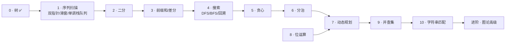

---
tags:
  - algorithm
  - index
---

# 算法范式分类与学习顺序

> [!info] 这份文档怎么用
> 一张**速查表**看懂"有哪些套路、各自对付什么题、按什么顺序学";下面分组给每个套路配"识别信号 + 一句话解法 + 招牌题"。
> 它只是地图,不展开解法细节。每个套路的详细攻略后续用 [[algorithm-playbook]] 逐篇生成。已完成的样板:[[0-tree]]。

## 速查表

按推荐学习顺序排列。**"看到这种题"是识别信号**——做题时先对照这一列认出套路。

| # | 套路 | 看到这种题 → 就是它 | 一句话解法 | 招牌题 |
|---|---|---|---|---|
| 0 | 树 ✅ | 输入是二叉树/BST,问深度、路径、子树性质 | 递归处理"根+子树",想清在前/后序做事 | 104 最大深度 |
| 1a | 双指针 ✅ | 数组/字符串里找"一对位置",暴力要两层 for | 两个指针一头一尾(或快慢)对着走,跳过不可能的解 | 11 盛水最多的容器 |
| 1b | 滑动窗口 | 求满足条件的**连续**子数组/子串的最长/最短/个数 | 右指针扩、违规时左指针缩,维护一个合法窗口 | 3 无重复字符最长子串 |
| 1c | 单调栈 | 对每个元素问"右边/左边第一个比它大(小)的是谁" | 扫一遍,新元素入栈时弹掉被它"压制"的栈顶 | 739 每日温度 |
| 1d | 单调队列 | 滑动窗口里要实时取**最大/最小值** | 队列里只留"还可能当最值"的,队尾弹劣、队首弹过期 | 239 滑动窗口最大值 |
| 2 | 二分 | 数组有序找数;或"答案越大越容易满足"求临界值 | 每次砍掉一半候选;求最优时"二分答案+验证可行" | 875 爱吃香蕉的珂珂 |
| 3 | 前缀和/差分 | 反复查"第 i~j 段的和";或反复"把第 i~j 段都加 k" | 预处理一遍,把区间操作变成两个端点的加减 | 560 和为K的子数组 |
| 4a | DFS/BFS | 网格数岛屿、迷宫求最短步数、图找连通块 | 从起点把能到的地方走遍:DFS 一条道走到黑,BFS 一圈圈扩 | 200 岛屿数量 |
| 4b | 回溯 | 让你列出**所有**组合/排列/方案 | DFS 暴力试每种选择,进一步做选择、退回时撤销 | 46 全排列 |
| 5 | 贪心 | 每步选当前最优,不用回头 | 找到"每步怎么选不会亏"的依据(常配排序) | 55 跳跃游戏 |
| 6 | 分治 | 能把数组从中间劈开、分别解决再合并 | 拆成同型子问题,递归解完再合并结果 | 剑指51 逆序对 |
| 7 | 动态规划 | 求方案数/最值,且当前选择影响后面 | 定义状态 dp[i],找它由哪些更小状态推出 | 70 爬楼梯 / 416 背包 |
| 8 | 位运算/状压 | 用一个整数记一组开关;或找"只出现一次的数" | 把集合压进二进制位,用异或/与或/移位操作 | 136 只出现一次的数字 |
| 9 | 并查集 | 动态合并、反复问"这两点连通了吗" | 每个集合记一个"老大",合并就认同一个老大 | 547 省份数量 |
| 10 | 字符串匹配 | 长文本里找模式串;求最长回文 | KMP/Z/Manacher:预处理出"失配后跳哪",避免回头重扫 | 28 找匹配项 |
| 进阶 | 图论高级 | 课程表能不能修完、城市间最短路、最省的连通方案 | 拓扑排序 / Dijkstra / 最小生成树,各有固定模板 | 207 课程表 |

> [!tip] 速查表就够日常用了
> 卡题时回到这张表,从"看到这种题"一列认套路。下面的分组详解是想深入某一类时再读;每个套路真正的展开在它各自的 [[algorithm-playbook]] 攻略里。

## 学习路线图

箭头表示"建议先掌握"。同一阶段内的子项(如 1a→1d)有递进关系。

排序理由(只记三条关键的):

- **序列扫描排第一**:性价比最高,直接收编现在散落在数组/字符串目录里的题,且和已完成的 [[0-tree]] 结构对称。
- **位运算插在 DP 前**:它既独立,又是"状态压缩 DP"的前置,所以要先于 DP 的状压子型。
- **图论高级垫底**:综合性最强,建立在搜索 + 贪心 + 并查集之上。

## 分组详解

把这些套路按"底层思想"归成 7 组。**分组顺序与上面的学习顺序一致**——序列扫描打头,后面按各组最早学到的阶段往下排。每组先用大白话说清这组共享的思路,再给组内每个套路的识别信号、招牌题、以及做题时该问自己的那一个关键问题。

### A. 序列扫描类:让下标只往前走

> 这组都在数组/字符串上**移动下标**。暴力要两层循环 O(n²),但只要利用"有序"或"单调"证明跳过的部分不可能更优,下标就只进不退,降到 O(n)。

- **双指针**——两个下标对着走(一头一尾)或一前一后(快慢)。
  - 招牌题:11 盛水最多的容器、15 三数之和、142 环形链表入口。
  - 做题时问:移动一个指针,能不能一次性排除一整片解?
- **滑动窗口**——维护一段连续区间,右边扩、违规时左边缩。
  - 招牌题:3 无重复字符最长子串、76 最小覆盖子串、209 最短子数组。
  - 做题时问:窗口什么时候该扩、什么时候该缩?
- **单调栈**——求"下一个更大/更小元素"的专用工具。
  - 招牌题:739 每日温度、84 柱状图最大矩形、42 接雨水。
  - 做题时问:新元素进来,会让栈里哪些元素的答案就此确定?
- **单调队列**——求"滑动窗口内最值"的专用工具。
  - 招牌题:239 滑动窗口最大值、1438 绝对差不超过限制的最长子数组。
  - 做题时问:新元素进来,队尾哪些"又旧又差"的可以直接扔?

> [!tip] 四个是一家人
> 都是"一个指针扫过去,顺手维护点东西"。所以单调栈/单调队列归在这里,而不是归到"栈""队列"这两个数据结构——重点是那套扫描思想,栈和队列只是顺手用的容器。

### B. 分治与二分类:把规模对半砍

> 这组每次把问题砍掉一半。**二分**靠"答案有单调性"砍掉一半候选;**分治**把数组劈成两半分别解决再合并。

- **二分**——有序数组找数,或"答案越大越容易满足"求临界值。
  - 招牌题:34 查找区间、875 爱吃香蕉的珂珂、410 分割数组最大值。
  - 做题时问:能写出一个"对答案单调"的判定函数吗?
- **分治**——能从中间劈开、分别解决再合并。
  - 招牌题:剑指51 逆序对、23 合并 K 个链表、归并排序。
  - 做题时问:合并两半时,要额外统计哪些跨边界的贡献?

> [!note] 二分先学、分治后学
> 两者同属"对半砍"思想,放一组讲;但二分在学习顺序里排第 2(概念小、回报大),分治排第 6(综合性更强)。同组不代表同时学。

### C. 预处理类:先算一遍,后面查得飞快

> 这组的套路是"花一次 O(n) 预处理,把后面每次的区间操作降到 O(1)"。前缀和管查询,差分管更新,两者互为逆运算。

- **前缀和**——反复查"某段区间的和"时用。
  - 招牌题:303 区域和检索、560 和为 K 的子数组、304 二维前缀和。
  - 做题时问:是不是反复查区间和,而原数组不变?
- **差分**——反复"给某段区间整体加减"时用。
  - 招牌题:1109 航班预订统计、1094 拼车。
  - 做题时问:是不是反复对区间整体增减?

### D. 搜索类:把能走的地方走一遍

> 这组题都是"从起点出发,系统地访问所有能到达的状态"。区别只在**走的顺序**(一条道走到黑还是一圈圈扩)和**要不要在路上做记录/撤销**。

- **DFS(深度优先)**——一条路走到底再回头。网格题里常用"走过就涂掉"防止重复走。
  - 招牌题:200 岛屿数量、695 岛屿最大面积。
  - 做题时问:关注的是节点本身,还是节点之间的走法?怎么标记已访问?
- **BFS(广度优先)**——从起点一圈圈往外扩,**第一次到达就是最短**。
  - 招牌题:102 层序遍历、994 腐烂的橘子、127 单词接龙。
  - 做题时问:是不是求最短步数/最少操作?
- **回溯**——"带撤销的 DFS 暴力穷举",专门用来列出所有方案。
  - 招牌题:46 全排列、78 子集、51 N 皇后。
  - 做题时问:每一步能做哪些选择?选了之后怎么撤销?

> [!note] 树是这组的特例
> [[0-tree]] 是搜索类在"无环结构"上的专章——树不会绕回来,所以不用标记已访问。回溯的"做选择/撤销"和树的路径收集是同一套。

### E. 最优化类:求最值或方案数

> 这组求"最大/最小/有多少种"。**动态规划**把所有子问题的最优解都记下来慢慢拼;**贪心**赌"每步局部最优就是全局最优",省掉记录。贪心快但需要证明,DP 稳但费空间。

- **贪心**——每步拿当前最优、不回头。
  - 招牌题:55 跳跃游戏、53 最大子数组和、134 加油站。
  - 做题时问:能证明"这步这么选不会亏"吗?
- **动态规划**——当前选择会影响后面,且能"用小问题的答案拼出大问题"。
  - 内部还分八个小类:线性(300)、背包(416/494)、状态机(122/188)、划分(410)、区间(516)、树形(337)、数位(233)、数据结构优化。
  - 招牌题:70 爬楼梯、198 打家劫舍、416 分割等和子集。
  - 做题时问:状态怎么定义,才能让它只依赖更小的状态?

> [!note] DP 是最大的一块
> 仓库里 DP 题最多(42 道)但缺统一框架。它的攻略主体工作就是把这些题按上面八个子类归位。其中**状态压缩 DP** 需要先掌握 §F 的位运算。

### F. 编码技巧类:换种表示消掉一层循环

> 这组靠"换一种数据表示",把原本要循环才能做的事变成几步操作。

- **位运算/状态压缩**——用整数的二进制位表示一组开关或一个小集合。
  - 招牌题:136 只出现一次的数字、78 子集、1239 串联字符串最大长度。
  - 做题时问:信息能不能压进一个整数的二进制位?
- **字符串匹配(KMP/Z/Manacher)**——长文本里线性找模式串、求最长回文。
  - 招牌题:28 找匹配项、459 重复子串、5 最长回文子串。
  - 做题时问:失配后能跳到哪,从而不用回头重扫?

### G. 集合与连通性:并查集

> 维护一组集合,支持"把两个集合合并"和"问两个元素是不是一组"。

- **并查集**——动态合并 + 反复查连通。
  - 招牌题:547 省份数量、684 冗余连接、990 等式方程可满足性。
  - 做题时问:问题能不能归结为"合并集合 + 查两点是否同组"?

> [!warning] 一个诚实的归类说明
> 单调栈、并查集底层都是数据结构(栈、森林),但本文按**解题套路**而非数据结构来分。区别:单调栈的价值在那套"维护单调性"的**思想**,栈只是容器,所以它真算一个套路;并查集的价值其实在结构本身,只是它的适用场景("动态连通性")太好认,才收进这张地图当一个题型记。

## 现有仓库覆盖度

练习仓库 `dev/algorithm/src/algorithm` 各目录映射到套路后的状态。✅成熟 / 🟡中等 / 🟠散落未独立 / ❌缺。

| 套路 | 仓库目录 | 题数 | 状态 |
|---|---|---|---|
| 树 | `05.tree` | 17 | ✅ 已成攻略 [[0-tree]] |
| 动态规划 | `08.dynamic-programming` | 42 | ✅ 缺八子类归位 |
| DFS/BFS | `gragh` | 13 | 🟡 |
| 贪心 | `07.greedy` | 8 | 🟡 |
| 回溯 | `07.backtracking` | 7 | 🟡 |
| 分治/排序 | `06.Recursion`、`sort` | 4 | 🟡 |
| 字符串匹配 | `01.string`(含 KMP) | — | 🟡 |
| 双指针 | 散落 `02.array`(27,977,142) | — | ✅ 已成攻略 [[1a-two-pointers]] |
| 滑动窗口 | 散落 `02.array`(3,209) | — | 🟠 |
| 二分 | `search` | 1 | 🟠 |
| 单调栈 | 无(42 接雨水误放 `03.linked-list`) | — | ❌ |
| 单调队列 / 前缀和差分 / 位运算 / 并查集 | 无 | — | ❌ |

> [!warning] 待归位
> `03.linked-list/42. Trapping Rain Water` 不是链表题:它是单调栈/双指针/DP 的典型题,生成 [[1c-monotonic-stack]] 攻略时应迁出。

## 逐篇生成时

对某个套路调用 [[algorithm-playbook]] 生成详细攻略,文件名**带速查表序列编号**(即学习优先级),生成后本页对应链接即连通:

| 套路 | 文件名 |
|---|---|
| 双指针 ✅ | `1a-two-pointers` |
| 滑动窗口 | `1b-sliding-window` |
| 单调栈 | `1c-monotonic-stack` |
| 单调队列 | `1d-monotonic-queue` |
| 二分 | `2-binary-search` |
| 前缀和/差分 | `3-prefix-sum` |
| DFS/BFS | `4a-dfs-bfs` |
| 回溯 | `4b-backtracking` |
| 贪心 | `5-greedy` |
| 分治 | `6-divide-conquer` |
| 动态规划 | `7-dynamic-programming` |
| 位运算 | `8-bit-manipulation` |
| 并查集 | `9-union-find` |
| 字符串匹配 | `10-string-matching` |
| 图论高级 | `11-graph-advanced` |

> [!note] 命名约定
> 编号取自上方速查表的 `#` 列(`0` 树、`1a` 双指针……),前缀即学习优先级,文件按名排序就是推荐学习顺序。已生成:`0-tree`、`1a-two-pointers`。

## 参考来源

- [labuladong 算法笔记](https://labuladong.online/algo/)
- [灵茶山艾府题单合集](https://leetcode.cn/circle/discuss/K0n2gO/)
- [OI-Wiki](https://oi-wiki.org/)、[Hello 算法](https://www.hello-algo.com/)
