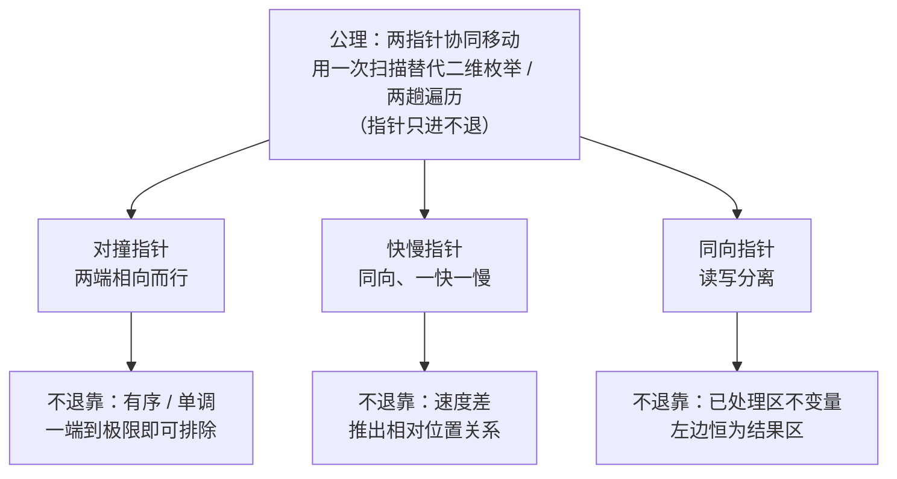
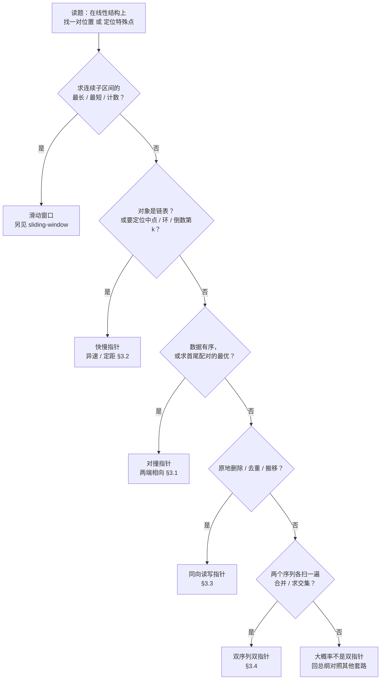

# 双指针完整解题攻略

> [!info] 关于本攻略
> 适用范围：数组、字符串、链表上的“双指针”题——对撞指针、快慢指针、同向（读写）指针，以及双序列归并型。
> 核心来源：[labuladong 双指针技巧汇总](https://labuladong.online/algo/essential-technique/array-two-pointers-summary/)、[labuladong 链表双指针](https://labuladong.online/algo/essential-technique/linked-list-skills-summary/)、[灵茶山艾府题单](https://leetcode.cn/circle/discuss/0viNMK/)，并按第一性原理重新组织。
> 配套地图见 [[00-算法范式分类总纲]] 速查表第 1a 行。滑动窗口虽是双指针的近亲，但自成体系，归 [[1b-sliding-window]] 攻略，本篇只划边界。

---

## 1. 第一性原理：所有双指针题的共同本质

### 1.1 公理：用一次扫描替代二维枚举

很多数组/字符串/链表题，最直接的解法都是两层循环：外层定一个位置，内层找配对的另一个位置，O(n²)。双指针的全部价值是把这件事压进**一次线性扫描**：

> [!abstract] 双指针公理
> 用**两个协同移动、且只进不退**的下标，把“原本要靠两层循环枚举位置对、或两趟遍历才能拿到的关系”，压进一趟扫描里——时间 O(n)，额外空间 O(1)。

关键词是“只进不退”。指针能一路向前、不必回退，O(n) 才成立；而“凭什么能不回退”，正是三类双指针最本质的区别——它们各自依赖一种不同的结构保证(§1.2)。

### 1.2 三类双指针：同一公理的三种落地

指针不回退，意味着“被它跨过去的位置从此不必再看”。能做到这点，只可能因为下面三件事之一成立——三类双指针正是据此划分的：



- **有序 / 单调 → 对撞指针**：序列有序，或某个量随位置单调变化。两端各放一个指针，每次只比较当前这一对。比较结果会告诉我们：其中一端已经到了极限，它再跟剩下的任何一个配对都不会更好。既然如此，就把这一端和它的所有组合一起排除掉，指针向里收一格。一次比较，省掉一整批尝试。
  - 举例：升序数组 `[2,4,7,11,15]` 里找两数之和等于 13。左右指针先看两端，`2+15=17>13`；`15` 即便配上最小的 `2` 都已经超了，配更大的数只会更大，所以 `15` 和谁都凑不出 13——这一次比较就排除掉“`15` 配其余各数”这一整列组合，右指针直接左移。暴力逐对尝试是 O(n²)，这样成批排除则是 O(n)。数组无序时这套推理不成立，所以乱序数组要先排序。
- **速度差 → 快慢指针**：两个指针在同一条链 / 数组上以不同速度跑，相对位置满足一个确定的数学关系（快指针到头时慢指针恰在中点；两指针在环里必然相遇……），一趟跑完就定位到目标。
- **已处理区不变量 → 同向（读写）指针**：维护一段“已经处理好的前缀区间”，慢指针守住它的右边界，快指针向前探路，边界只增不减。

三类共享同一条公理，只是把“不回退”建立在三种不同的地基上。（此外还有“双序列双指针”：两个指针各扫一个序列、都向前，靠有序性收尾，见 §3.4。）

> [!note] 关于分类口径
> labuladong 体系把“数组原地修改”和“滑动窗口”都并入快慢指针。本攻略采用更细的三分法：**链表上的异速指针**（用速度差推位置）与**数组上的读写指针**（用边界不变量原地构建答案）机制不同，拆成“快慢”与“同向”两类分别给模板，理解成本更低。滑动窗口则单独成篇。

### 1.3 枢纽问题：一问定题型

上面的分类不必死记。拿到一道看着像双指针的题，只需问一句话：

> **“两个指针从哪出发、朝哪走，靠什么保证不回退？”**

答案里的三个要素，正好对号入座到 §1.2 的三类：**出发点**（两端相向 → 对撞；同向 → 快慢或读写）、**是否异速**（异速 → 快慢；同速读写 → 同向）、**是不是两个序列各派一个指针**（→ 双序列）。把这一句答出来，题型即定，该套哪套模板、循环条件怎么写也随之确定。完整分叉（含与滑动窗口的岔路）见 §2 决策流程，各类模板见 §3。

### 1.4 一个边界：同向读写 vs 滑动窗口

两者都是“两个指针同向、且都只往前走”，所以最容易混。区别**不在指针怎么动**（都只进不退），而在**两指针之间那段区间代表什么**：

- **同向读写指针**（如 L27 移除元素）：左指针 slow 的左边是已经写好的**成品区**，两指针之间是**待丢弃的废料**。右指针每步读一个元素，遇到该保留的就写到 slow 处、slow 进一格。本质是把答案原地重写一遍，至于 `[slow, fast)` 里剩了什么，无需在意。
- **滑动窗口**（如 L3 无重复字符最长子串）：两指针框住的 `[left, right]` **本身就是候选答案**——一段连续子区间。右指针每步纳入一个新元素；一旦窗口违规（出现重复、和超标），左指针**向右移动**、把左端元素逐个移出窗口，直到重新合法。关心的是这段区间的整体性质（长度、和、字符种类）。

> [!warning] “缩小窗口”不等于指针往回退
> 滑动窗口的左指针也**只增不减**——所谓“缩小”，是靠它向右移、把元素移出窗口来实现的，不是把指针往回拨。“只进不退”对同向读写和滑动窗口同样成立（§1.1 公理），这正是它俩是亲戚的根本原因。真正把它俩分开的，是上面那条：**区间是“废料”还是“答案本身”**。

> [!tip] 怎么分
> 题目问的是“**改造数组本身**（删除/去重/搬移）”→ 同向读写；问的是“满足条件的**连续子区间**的最长/最短/个数”→ 滑动窗口，转 [[1b-sliding-window]]。L209 最小子数组、L3 无重复字符最长子串都是滑动窗口，不在本篇。

---

## 2. 解题决策流程



> [!warning] 一个前置动作：无序就先排序
> 对撞指针的地基是“有序”（但不一定都要排序）。题面给的是无序数组、却要找“配对求和 / 三元组 / 最优面积”时，标准前奏是**先排序再用对撞指针**（三数之和、四数之和）。排序代价 O(n log n) 会成为这类题的复杂度主项。唯一例外：盛水容器 / 接雨水靠的是“高度的木桶效应”单调性，不需要排序。

> [!warning] 看着像双指针、其实不是——三类易混题
> 这几类会命中“线性扫描 + 两个下标”的表象，但骨子里不是双指针，套模板会跑偏：
> - **L209 最小子数组（中）、L3 无重复字符最长子串（中）** → 滑动窗口。左指针会“回缩”收窗，求的是连续子区间的最长 / 最短，归 [[1b-sliding-window]]。判据见 §1.4。
> - **L334 递增的三元组子序列（中）** → “打擂台”贪心，不是双指针。维护两个最小值 `first` / `second`，来一个数就更新，能放进第三层就成立——靠的是两个标量擂主，不是两个移动的下标。
> - **L605 种花问题（易）** → 单指针贪心扫描。只有一个游标顺序判断每个空位能否种花，没有“第二个指针”。

---

## 3. 题型分类详解

每个题型按统一结构展开，先给最常查的三件——**看到这种题→就是它**（识别信号）、**一句话解法**、**招牌题**——再给本质、模板与代表题；每道题特有的坑，就近放在它的代码块下面。

高频度标注（★★★ 必备 / ★★ 常见 / ★ 低频）依据大厂面经的大致频度，仅供排优先级。题号后以 （易 / 中 / 难） 括注 LeetCode 官方难度。

### 3.1 对撞指针（左右指针，两端相向）

> [!tip] 看到这种题 → 就是它
> **数组 / 字符串有序**（或可排序），要找“一对位置”满足某条件：两数之和、三数之和、首尾配对求最优（最大面积、最远距离）、回文判断、原地反转。题面常含“有序数组”“两个数”“一对”“回文”“容器/面积”。

- **一句话解法**：两个指针一头一尾，比较当前这一对后，移动“已到极限、再配谁都不会更好”的那一端，一次把它的所有配对排除。
- **招牌题**：L11 盛水最多的容器（中）。
- **高频度**：★★★（L11、L15、L167、L42 都是面试常客）。

> [!abstract] 本质 · 公理（对所有对撞题都成立）
> 循环不变量是“最优解一定还在 `[left, right]` 闭区间里尚未排除的位置对中”。每比较一次，就能认定其中一端“再配谁都不会更优”，把它排除、指针内移——区间单调收缩，O(n) 扫完。

> [!danger] 公理就这一句，下面是“换题就变”的变量
> 区间收缩、每次排除一端是不变的；但**比较什么量、据此移哪一端**每题不同——这才是你要为这道题现定的内容。

**变量① · 移动判据**（核心，每题不同）——定每轮比较什么、把哪端内移：

| 题 | 比较什么 | 移哪端 |
|---|---|---|
| L167 两数之和 | `nums[l]+nums[r]` vs `target` | 偏小移左、偏大移右 |
| L11 容器 / L42 接雨水 | `height[l]` vs `height[r]` | 移**较矮**的一端（木桶效应，与目标值无关） |
| L15 三数之和 | `nums[i]+nums[l]+nums[r]` vs `0` | 偏小移左、偏大移右 |
| L125 回文 | `s[l]` vs `s[r]` | 相等则两端同时内移，不等即判否 |

**变量② · 两个前置开关**：① 数组无序且求配对/最优 → **先排序**（L15/L18 要，L11/L42 不要）；② 循环条件——找配对不可重用同元素用 `l < r`，可指同格才用 `l <= r`。

#### 例题

> [!example] 例 1 · L167 两数之和 II（中）｜母题
> 有序数组找一对和为 target 的下标。最干净的对撞模板：和偏小就左端右移、偏大就右端左移，相等即解。

```python
def two_sum_sorted(nums, target):
    """有序数组中找两数之和等于 target 的下标对(对撞指针)。

    入参: nums —— 升序数组; target —— 目标和
    出参: 一对 1-indexed 下标 [i, j];找不到返回 []
    """
    left, right = 0, len(nums) - 1
    while left < right:
        s = nums[left] + nums[right]
        if s == target:
            return [left + 1, right + 1]
        elif s < target:
            left += 1          # 和太小 → 只能把左端换成更大的数
        else:
            right -= 1         # 和太大 → 只能把右端换成更小的数
    return []
```

> [!warning] L167 易错：循环条件用 `left < right`
> 找配对时同一个元素不能用两次，故用严格小于；只有“两端可指向同一格”的场景（某些原地遍历，见 §3.3）才用 `left <= right`。

> [!example] 例 2 · L11 盛水最多的容器（中）｜招牌题
> 移动规则是本类型最精妙的一处：面积由矮板决定，所以每次只移走较矮的那端——移高的只会让面积更小。

```python
def max_area(height):
    """盛水最多的容器:两端向内收,每次移动较矮的一端。

    入参: height —— 每根柱子的高度
    出参: 能盛的最大水量
    """
    left, right = 0, len(height) - 1
    ans = 0
    while left < right:
        ans = max(ans, min(height[left], height[right]) * (right - left))
        if height[left] < height[right]:
            left += 1          # 面积由矮板决定;只有移走矮的才可能变大
        else:
            right -= 1
    return ans
```

> [!warning] L11 易错：必须移矮的那根
> 若移走高的那根，宽度变窄，而水量由矮板决定、矮板没动，面积只会变小、不会变大——等于白白浪费一次移动。本题的精髓全在这一点上。

> [!example] 例 3 · L15 三数之和（中）｜进阶·面试最高频
> “排序 + 固定一个数 + 内层对撞”的标准组合：外层固定第一个数，内层在剩余区间跑对撞，固定数与左右值都要跳重。

```python
def three_sum(nums):
    """所有和为 0 且不重复的三元组:排序后固定一个数,内层对撞。

    入参: nums —— 整数数组
    出参: 所有不重复的三元组列表
    """
    nums.sort()
    n, res = len(nums), []
    for i in range(n - 2):
        if nums[i] > 0:
            break                                  # 最小数已 > 0,不可能凑出 0
        if i > 0 and nums[i] == nums[i - 1]:
            continue                               # 跳过重复的固定数,避免重复三元组
        left, right = i + 1, n - 1
        while left < right:
            s = nums[i] + nums[left] + nums[right]
            if s < 0:
                left += 1
            elif s > 0:
                right -= 1
            else:
                res.append([nums[i], nums[left], nums[right]])
                left += 1
                right -= 1
                while left < right and nums[left] == nums[left - 1]:
                    left += 1                      # 跳过重复的左值
                while left < right and nums[right] == nums[right + 1]:
                    right -= 1                     # 跳过重复的右值
    return res
```

> [!warning] L15 易错：漏去重
> 固定数、以及找到解后的左右值，都要跳过重复，否则结果集出现重复三元组。

> [!example] 代表题
> L167 两数之和 II（中）、L11 盛水最多的容器（中）、L15 三数之和（中）、L16 最接近的三数之和（中）、L18 四数之和（中）、L42 接雨水（难·高度木桶单调性）、L344 反转字符串（易）、L125 验证回文串（易）、L977 有序数组的平方（易·两端比平方，大的填到结果末尾）、L5 最长回文子串（中·变体：从中心向两端**扩展**，别套相向收缩的模板）。

### 3.2 快慢指针（链表前后，异速 / 定距）

> [!tip] 看到这种题 → 就是它
> 操作对象是**链表**，要定位某个“特殊位置”：中点、环、环入口、倒数第 k 个；或单趟判断有没有环。题面常含“链表”“中间节点”“环”“倒数第 k”“相交”。

- **一句话解法**：两个指针都从链头出发，慢的每次走一步、快的每次走两步。等快指针冲到链尾，慢指针恰好停在中点——一趟遍历就找到目标（判环则让两者在环里相遇，找倒数第 k 个则让快指针先走 k 步、再两者同步）。
- **招牌题**：L142 环形链表 II（中·找环入口）。
- **高频度**：★★★（L141/L142、L19、L876、L160 都是链表必备）。

> [!abstract] 本质 · 公理（对所有快慢链表题都成立）
> 不靠排序、不靠边界区，靠**速度差导出的数学关系**。快指针走两步、慢指针走一步，快到链尾时慢指针恰在中点；两指针在环里必然相遇；相遇后把一个指针拨回链头、两者同速前进，会在环入口再次相遇（推导见下方 callout）。

> [!danger] 公理就这一句，下面是“换题就变”的变量
> “靠速度差/定距定位”是不变的；但**怎么跑、从哪起步、相遇后做什么**每题不同。

**变量① · 跑法**：异速（快 2 慢 1——中点 / 判环 / 找环入口）｜定距（快先走 k 步再与慢同步——倒数第 k）。

**变量② · 起步点**（决定边界归宿）：`slow=fast=head`（偶数返回**靠后**中点）｜`fast=head.next`（返回**靠前**中点，需切两半时用）｜`slow=fast=dummy`（删除类，待删可能是头节点）。

**变量③ · 相遇后做什么**：找中点 → 直接返回 slow；判环 → 第二阶段拨一指针回链头、**同速**找入口；倒数第 k → slow 即答案。

> [!warning] 不变的护栏：循环条件恒为 `while fast and fast.next`
> 先确认 `fast` 非空再访问 `fast.next.next`，否则奇偶链尾空指针崩溃。这条对所有异速题都成立，是公理护栏、不是变量。

#### 例题

> [!example] 例 1 · L876 链表中点（易）｜母题
> 一切快慢链表题的母版：慢走一步、快走两步，快到尾时慢恰在中点。偶数节点默认返回靠后的中点。

```python
def middle_node(head):
    """返回链表中点;节点数为偶时返回靠后的那个中点。

    入参: head —— 链表头
    出参: 中间节点
    """
    slow = fast = head
    while fast and fast.next:
        slow = slow.next               # 慢指针走一步
        fast = fast.next.next          # 快指针走两步;快到头时慢恰在中点
    return slow
```

> [!warning] L876 易错：奇偶中点的归宿
> `slow = fast = head` 起步时，偶数个节点返回**靠后**的那个中点；若想返回靠前的中点（重排、回文要把链表切两半时），让 `fast = head.next` 起步。

> [!example] 例 2 · L141 / L142 环形链表（易 / 中）｜招牌题·Floyd 判圈
> 分两阶段：① 快慢同跑，相遇即有环；② 一指针拨回链头、两者**同速**前进，再次相遇处即环入口（数学推导见下方 callout）。

```python
def detect_cycle(head):
    """找链表环的入口;无环返回 None(Floyd 判圈算法)。

    入参: head —— 链表头
    出参: 环入口节点,或 None
    """
    slow = fast = head
    while fast and fast.next:           # 快指针正常到头 → 无环
        slow = slow.next
        fast = fast.next.next
        if slow is fast:                # 相遇 → 有环
            p = head
            while p is not slow:        # 一个从头、一个从相遇点,同速前进
                p = p.next
                slow = slow.next
            return p                    # 再次相遇之处即环入口
    return None
```

> [!warning] L141 / L142 易错
> - 循环条件 `while fast and fast.next` 顺序不能反：先确认 `fast` 非空，才能安全访问 `fast.next.next`，否则在奇偶链尾空指针崩溃。
> - 找入口的第二阶段是**同速**（两指针都走一步），别还按 2 倍速跑。

> [!note] 为什么“拨回头同速走”就能撞在环入口
> 设头到入口距离 `a`，入口到相遇点距离 `b`，环长 `C`。相遇时慢指针走了 `a+b`，快指针走了它的两倍 `2(a+b)`；快比慢多走的恰好是若干整圈 `n·C`，于是 `a+b = n·C`，化简得 `a = n·C − b`。而从相遇点继续往前走 `n·C − b` 步正好回到入口（绕完剩下的环再补 n−1 整圈）。既然 `a = n·C − b`，那么一个指针从链头走 `a` 步、另一个从相遇点走 `a` 步，两者必在入口相遇。

> [!example] 例 3 · L19 删除倒数第 N 个（中）｜定距变体
> 不靠异速、靠**固定间距**：快指针先走 n+1 步拉开距离，再两者同步，快到尾时慢恰停在待删点的前一个。配 dummy 虚拟头兜底删头节点的情形。

```python
def remove_nth_from_end(head, n):
    """删除链表倒数第 n 个节点,返回新头。

    入参: head —— 链表头; n —— 倒数位置(1-indexed)
    出参: 删除后的链表头
    """
    dummy = ListNode(0, head)           # 虚拟头:待删的恰是真头节点时也不出错
    slow = fast = dummy
    for _ in range(n + 1):              # 快指针先走 n+1 步,使 slow 停在待删点的前一个
        fast = fast.next
    while fast:
        fast = fast.next
        slow = slow.next
    slow.next = slow.next.next          # 跨过待删节点
    return dummy.next
```

> [!warning] L19 易错：必用 dummy 虚拟头
> 否则删的恰是头节点时无前驱可接（`slow` 要停在待删点的前一个，而真头节点没有前一个）。

> [!example] 代表题
> L876 链表中点（易）、L141 环形链表（易·判有无）、L142 环形链表 II（中·找入口）、L19 删除倒数第 N 个（中）、L160 相交链表（易·两指针走完各自再换轨，走 `a+b+c` 步必相遇）、L234 回文链表（易·快慢找中点 + 反转后半比较）、L143 重排链表（中·找中点 + 反转 + 合并）。

### 3.3 同向指针（数组读写，原地构建）

> [!tip] 看到这种题 → 就是它
> 要**原地改造数组**：删除某值、去重、把某类元素搬到一端；要求 O(1) 额外空间、不开新数组。题面常含“原地”“移除”“去重”“移动”“返回新长度”。

- **一句话解法**：慢指针守住“成品区”的边界，快指针向前逐个探；遇到该保留的元素就把它并入成品区、边界前进一格，该丢弃的边界不动；快指针扫完，成品区即答案。
- **招牌题**：L27 移除元素（易）。
- **高频度**：★★（L26、L27、L283 是高频热身，常作更难题的子步骤）。

> [!abstract] 本质 · 公理（对所有同向读写题都成立）
> 循环不变量是——slow 划出的那段是“已处理好的成品区”，区外还没碰。fast 每步只决定当前元素要不要并入成品区：要则并入、边界进一格；不要则边界不动。边界只进不退 → O(n)、O(1)。

> [!danger] 公理就这一句，下面全是“换题就变”的变量，别当铁律
> 一道题你只需定**两件事**，其余（成品区开闭、指针初值、写入顺序、返回值）全被推导出来。

**变量① · slow 语义**（二选一，贯穿全题）——选定它，下面四项**一并锁死**；注意 fast 起点也在其中，它不是独立变量：

| slow 语义 | 成品区 | slow / fast 初值 | 写入顺序 | 返回 |
|---|---|---|---|---|
| 下一个空位 | `[0, slow)` | `slow=0, fast=0` | 先写 `nums[slow]=nums[fast]`，再 `slow+=1` | `slow` |
| 最后一个成品 | `[0, slow]` | `slow=0, fast=1`（首元素天然算成品） | 先 `slow+=1`，再写 | `slow+1` |

> [!warning] 写入顺序由语义逼出，反了就覆盖答案
> “最后一个成品”语义下新元素在 slow 的下一格，**必先 `slow+=1` 再写**；先写会盖掉最后一个保留元素——本类最高频 bug。

**变量② · 并入判据**（每题不同，是这道题的真正内容）：L27 `!=val`／L283 `!=0`／L26 `!=nums[slow]`／L80 `!=nums[slow-2]`。

> [!tip] 新题就两步：一句定 slow 语义（锁死其余四项），一句定判据。代码随即成形，不用背。

#### 例题

> [!example] 例 1 · L27 移除元素（易）｜招牌题
> slow 取“下一个空位”语义（变量①第一行）——最干净的同向读写模板。fast 逐个读，遇到 `!= val` 的就写到 slow 处、边界前进；扫完返回 slow 即新长度。

```python
def remove_element(nums, val):
    """原地移除所有等于 val 的元素,返回新长度(同向读写指针)。

    入参: nums —— 数组(原地修改); val —— 要移除的值
    出参: 新长度;nums 的前这么多位是保留结果
    """
    slow = 0                           # slow:下一个写入位置;[0, slow) 是结果区
    for fast in range(len(nums)):      # fast:探针,逐个读
        if nums[fast] != val:          # 该保留 → 写到 slow 并推进边界
            nums[slow] = nums[fast]
            slow += 1
    return slow
```

> [!example] 例 2 · L26 删除有序数组重复项（易）
> slow 换成“最后一个有效元素”语义（变量①第二行）。三处随之全变：fast 从 1 起、写入“先进后写”、返回 `slow+1`。和例 1 对照，正好看清“换语义 → 四项联动”。

```python
def remove_duplicates(nums):
    """有序数组原地去重,返回去重后长度。

    入参: nums —— 升序数组(原地修改)
    出参: 去重后长度
    """
    if not nums:
        return 0
    slow = 0                           # [0, slow] 已去重,slow 指向最后一个保留元素
    for fast in range(1, len(nums)):
        if nums[fast] != nums[slow]:   # 出现新值才写入
            slow += 1
            nums[slow] = nums[fast]
    return slow + 1
```

> [!warning] 这两段恰是变量①两行语义的实例
> `remove_element` 走“下一个空位”那行（先写后进、返回 `slow`）；`remove_duplicates` 走“最后一个成品”那行（先进后写、返回 `slow+1`）。把任一行的写入顺序套到另一行上，代码就错——L26 尤其致命：先写会盖掉最后一个保留元素。

> [!example] 例 3 · L283 移动零（易）
> 变体：不止“保留非零”，还要把 0 堆到末尾。把“写入”换成“交换”——非零元素和 slow 处对调，既前移了非零、又顺手把 0 甩到后面。

```python
def move_zeroes(nums):
    """把所有 0 移到末尾,保持非零元素的相对顺序(原地)。

    入参: nums —— 数组(原地修改)
    出参: 无(原地)
    """
    slow = 0
    for fast in range(len(nums)):
        if nums[fast] != 0:
            nums[slow], nums[fast] = nums[fast], nums[slow]   # 非零元素换到前面
            slow += 1
```

> [!warning] L283 易错：别只前移不补零
> 只把非零写到前面，会在尾部留下脏数据；要么写完后补零，要么直接用上面的交换法。

> [!example] 例 4 · L206 反转链表（易）｜链表版同向读写
> 把成品区思想搬到链表：`pre`/`cur` 一对同向指针，边走边把每个节点的指针掉头。成品区在这里是“已反转好的前缀链”。

```python
def reverse_list(head):
    """反转单链表(pre / cur 一对同向指针,逐节点掉头)。

    入参: head —— 链表头
    出参: 反转后的新头
    """
    pre, cur = None, head
    while cur:
        nxt = cur.next                 # 暂存下一个,防断链
        cur.next = pre                 # 当前节点掉头指向前驱
        pre, cur = cur, nxt            # 两指针同步右移
    return pre
```

> [!warning] L206 易错：改指针前先存 `next`
> 一旦先改了 `cur.next`，原后继就丢了，务必先 `nxt = cur.next`。链表的反转、删除通用。

> [!example] 代表题
> L27 移除元素（易）、L26 删除有序数组重复项（易）、L80 删除有序数组重复项 II（中·保留两个）、L283 移动零（易）、L203 移除链表元素（易·L283/L27 的链表版）、L206 反转链表（易）、L24 两两交换（中·多指针穿针引线）、L443 压缩字符串（中）。

### 3.4 双序列双指针（归并型）

> [!tip] 看到这种题 → 就是它
> 有**两个序列**（两个有序数组、两条链表），要合并、求交集、判断包含关系。每个序列派一个指针，都只往前走。

- **一句话解法**：两个指针各扫一个序列，比较当前两个元素决定谁前进、谁并入结果，直到任一指针走完。
- **招牌题**：L88 合并两个有序数组（易）。
- **高频度**：★★（L21、L88、L349、L392 常见，也是归并排序的核心步骤）。

> [!abstract] 本质 · 公理（对所有双序列归并题都成立）
> 它和对撞同样依赖“有序”，但两个指针落在**两个不同序列**上、且**同向**。不回退的依据是“两序列都有序，较小者一旦并入结果就再不会有更小的来抢它的位置”。

> [!danger] 公理就这一句，下面是“换题就变”的变量
> “两序列有序、同向、较小者先并入”是不变的；但**比较后做什么、往哪填、要不要收尾**每题不同。

**变量① · 比较后的动作**（题型由它定）：合并 → 两者最终都并入（L21/L88）；求交集 → 相等才并入、否则较小者指针跳过（L349）；判子序列 → 匹配才推进子串指针（L392）。

**变量② · 填充方向与收尾**：一般**从前往后**填，且一方走完后要把另一方剩余的有序尾巴整体接上；**L88 例外**——为原地复用 nums1 改**从后往前**填，nums1 自身剩余本就在位、无需接尾。

#### 例题

> [!example] 例 1 · L88 合并两个有序数组（易）｜招牌题
> nums1 尾部留了 n 个空位，要把 nums2 并进来。技巧是**从后往前填**：两序列各拿一个尾指针，较大者填进 nums1 的尾部空位——倒序填天然不会覆盖 nums1 里还没处理的元素。

```python
def merge(nums1, m, nums2, n):
    """把有序 nums2 并入有序 nums1(nums1 尾部有 n 个空位),原地从后往前填。

    入参: nums1 —— 长 m+n,前 m 个有效;m; nums2 —— 长 n;n
    出参: 无(结果写在 nums1)
    """
    i, j, k = m - 1, n - 1, m + n - 1   # 从后往前填,避免覆盖 nums1 未处理的元素
    while j >= 0:                        # nums2 没填完才需继续(nums1 剩的本就在位)
        if i >= 0 and nums1[i] > nums2[j]:
            nums1[k] = nums1[i]
            i -= 1
        else:
            nums1[k] = nums2[j]
            j -= 1
        k -= 1
```

> [!warning] L88 易错：从后往前填
> 从前往后填会覆盖 nums1 里还没处理的元素；倒序填进尾部空位则天然安全。一般归并在一方走完后，要把另一方剩下的有序尾巴整体接到结果上；而 L88 从后往前填，nums1 自己剩下的部分本就停在正确位置，所以不必额外拼接——这是它特殊的地方。

> [!example] 例 2 · L392 判断子序列（易）｜轻量变体
> 双序列同向的最简形态：一个指针扫母串 t，另一个扫子串 s，字符匹配上才推进 s 的指针；s 走完即说明它是 t 的子序列。

```python
def is_subsequence(s, t):
    """判断 s 是否为 t 的子序列(双序列同向指针)。

    入参: s —— 待判子序列; t —— 母串
    出参: bool
    """
    i = 0                                # 指向 s 的待匹配字符
    for ch in t:                         # 指针扫过母串 t
        if i < len(s) and s[i] == ch:
            i += 1                        # 匹配成功才推进 s 的指针
    return i == len(s)
```

> [!example] 代表题
> L88 合并有序数组（易）、L21 合并两个有序链表（易）、L349 两数组交集（易）/L350 交集 II（易）、L392 判断子序列（易）、L986 区间列表交集（中）、面试题 16.06 最小差（中）。

---

## 4. 复杂度分析通法

> [!abstract] 复杂度统一公式
> **总时间 = 指针移动总步数 × 每步工作量**

- 每个指针最多把序列走一遍、每步 O(1) → 时间 **O(n)**，额外空间 **O(1)**（原地）。这是双指针相对暴力 O(n²) 的全部收益。
- 对撞指针若需先排序（三数之和、四数之和）→ 排序主导，**O(n log n)**。
- 快慢链表题用 O(1) 空间替代了“哈希表存已访问节点”的 O(n) 空间——这正是 Floyd 判圈胜过哈希解法之处。
- 双序列归并：两指针各扫一遍 → O(m + n)。

判断一道题适不适合双指针，反过来用这条公式：**能否设计一种指针移动规则，让每个位置只被访问 O(1) 次**。能，就降到 O(n)；不能（移动后还要回头），八成不是双指针题。

---

## 5. 渐进刷题路线

按依赖顺序练，每阶段吃透再进下一个（题号均为 LeetCode）：

| 阶段 | 目标 | 题目 |
| --- | --- | --- |
| 1. 同向读写地基 | “成品区边界”不变量，分清 slow 两种语义 | L27易， L26易， L283易， L80中 |
| 2. 对撞基础 | 相向收缩 + “移到极限的那端”直觉 | L344易， L125易， L167中， L977易 |
| 3. 对撞进阶 | 排序 + 固定 + 对撞，处理去重 | L15中， L16中， L18中， L11中， L42难 |
| 4. 快慢链表 | 速度差 / 定距，Floyd 判圈 | L876易， L141易， L142中， L19中， L160易， L234易 |
| 5. 双序列归并 | 两序列同向，有序性收尾 | L88易， L21易， L392易， L349易 |
| 6. 衔接滑动窗口 | 左指针从“只进”到“会缩” | 转 [[1b-sliding-window]]，练 L3中、L209中、L76难 |

> [!tip] 入门母题先过
> 每类都有一道“最干净的母题”，先把它写到不看模板：对撞看 L167，快慢看 L876，同向读写看 L27，双序列看 L88。母题通了，同类的进阶题（L15、L142、L26、L392）只是在母题上叠条件。

---

## 6. 参考来源

- [labuladong：双指针技巧汇总（数组）](https://labuladong.online/algo/essential-technique/array-two-pointers-summary/) —— “快慢 / 左右”两分法、原地修改与对撞的模板。本文把其“快慢”再拆为链表异速(§3.2)与数组读写(§3.3)。
- [labuladong：链表双指针技巧](https://labuladong.online/algo/essential-technique/linked-list-skills-summary/) —— 找中点 / 判环 / 找入口 / 倒数第 k / 相交 / 合并七大技巧，Floyd 判圈数学推导，dummy 虚拟头的作用。
- [灵茶山艾府：滑动窗口与双指针题单](https://leetcode.cn/circle/discuss/0viNMK/) —— §3 题型划分与代表题主要参照其相向 / 同向 / 双序列分类。
- 上层地图与学习顺序见 [[00-算法范式分类总纲]]；搜索类近亲见 [[0-tree]]，连续区间的近亲见 [[1b-sliding-window]]。
