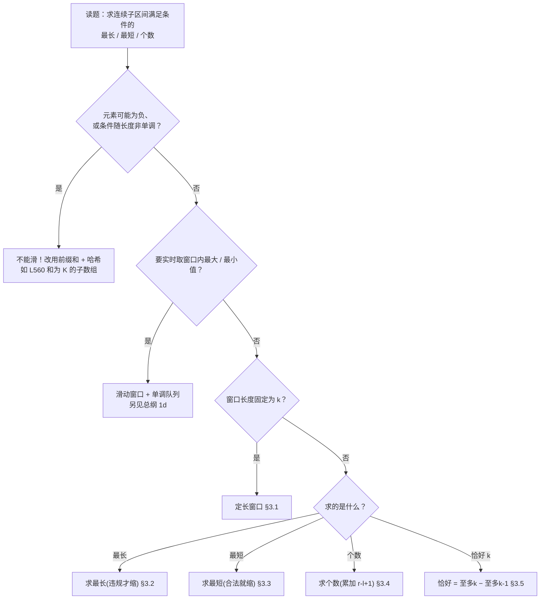

# 滑动窗口完整解题攻略

> [!info] 关于本攻略
> 适用范围：在数组 / 字符串上，求“满足某条件的**连续**子区间”的最长 / 最短 / 个数。涵盖定长窗口、不定长窗口（求最长、求最短、求个数）、恰好型窗口四大题型。
> 核心来源：[灵茶山艾府：滑动窗口与双指针题单](https://leetcode.cn/discuss/post/3578981/ti-dan-hua-dong-chuang-kou-ding-chang-bu-rzz7/)（定长 / 不定长三分 / 恰好型分类）、[labuladong 滑动窗口框架](https://labuladong.online/algo/essential-technique/sliding-window-framework/)（统一模板 + 四问），并按第一性原理重新组织。
> 配套地图见 [[00-算法范式分类总纲]] 速查表第 1b 行。本篇是 [[1a-two-pointers]] 的近亲——滑动窗口本质是“左指针会收缩的同向双指针”，两篇在 §1.3 划清边界。窗口内要实时取最值另属单调队列，见 [[00-算法范式分类总纲]] 第 1d 行。

---

## 1. 第一性原理：所有滑动窗口题的共同本质

### 1.1 本质：靠“合法性随长度单调”把二维枚举压成一趟扫描

求“满足条件的连续子区间”，最直接的解法是枚举所有 `[i, j]` 子区间逐一检查，O(n²) 甚至 O(n³)。滑动窗口能降到 O(n)，全靠一条结构性质：

> [!abstract] 滑动窗口的本质
> 答案是一段**连续子区间**，且窗口的合法性**随长度单调**——窗口越长越容易违规（或越长越容易合法）。正因单调，右端扩到违规后、收缩左端必能恢复；于是左右指针都**只进不退**，每个元素进窗一次、出窗一次，时间 O(n)。

> [!danger] 单调性不成立，滑动窗口就失效
> 一旦“窗口变长，合法性可能反复横跳”，左指针就无法只进不退，滑动窗口直接报废。最典型的陷阱是**数组含负数、求和为定值的子数组**：加一个负数会让和变小，窗口拉长反而可能重新合法，合法性不单调。L560 和为 K 的子数组就是这种——它**不是**滑动窗口题，要用前缀和 + 哈希表（见 §2 易混表）。用“元素是否恒为正 / 条件是否随长度单调”来判定能不能滑，是第一道关。

### 1.2 维度：一张表锁定模板骨架

滑动窗口的题型，由两个问题的取值组合而成。第一个问题定大类，第二个问题（仅不定长需要）定收缩与更新的写法（完整决策流程含「不能滑」的排查，见 §2 的流程图）：

**维度① · 窗口长度**：固定为 k（定长）／不固定（不定长）。这是第一刀，定长无需收缩逻辑，进一个就吐一个，最简单。

**维度② · 合法性的单调方向**（仅不定长）：这是全篇最该吃透的一点，它决定收缩触发条件与更新答案的时机，而求最长与求最短在这两件事上**正好相反**：

| 题型 | 收缩触发 | 更新答案的时机 | 维护的量典型 |
|---|---|---|---|
| 定长（§3.1） | 长度到 k 就吐一个 | 每次窗口满 k 时 | 和 / 计数表 |
| 求最长 越短越合法（§3.2） | **违规**才缩 | 收缩之后（窗口已合法） | 计数表 / distinct 数 |
| 求最短 越长越合法（§3.3） | **合法**就缩 | 收缩之中（每步仍合法时） | 和 / 已覆盖字符数 |
| 求个数 越短越合法（§3.4） | **违规**才缩 | 收缩后累加 `right-left+1` | 乘积 / distinct 数 |
| 恰好 k（§3.5） | 转化为两个“至多”（§3.4 计数） | 两次计数相减 | 同 §3.4 |

上表的**收缩触发、更新时机、维护什么**全是“换题就变”的变量，随两个维度的取值而定；对每一道滑动窗口题恒成立的只有 §1.1 那条公理（连续子区间 + 单调 + 只进不退）。其中最致命的错配是把“求最长”的“缩完更新”套到“求最短”上，两者的镜像关系见 §3.3。

**维度③ · 窗口内维护什么**：和 / 计数哈希表 / distinct 不同元素个数 / 乘积（具体取值见上表「维护的量」列）。它与前两维**正交**——同一种窗口可配不同维护量（定长可维护和、也可维护计数表；求最长可维护 distinct、也可维护计数表）。选定维护什么，扩张 / 收缩时的 O(1) 更新动作随之确定。

> [!tip] 枢纽问题：一问定模板（维度表不必死记）
> 拿到一道“求连续子区间”的题，只问一句：**“窗口长度固定吗？不固定的话，把窗口拉长一格，是更容易违规、还是更容易合法？”**
> 长度固定 → 定长（§3.1）；越长越易违规 → 求最长 / 求个数（违规才缩，§3.2 / §3.4）；越长越易合法 → 求最短（合法就缩，§3.3）；问恰好 k → 拆两个“至多”相减（§3.5）。答出这一句，收缩条件与更新时机就定了。

### 1.3 边界：滑动窗口 vs 同向读写指针

滑动窗口和 [[1a-two-pointers]] 的同向读写指针（如 L27 移除元素）长得像——都是两个指针同向、都只进不退。区别**不在指针怎么动**，而在**两指针之间那段区间代表什么**：

- **同向读写指针**：`[0, slow)` 是已写好的**成品区**，`[slow, fast)` 是待丢弃的废料。关心的是“原地把数组改造成什么样”，区间内剩什么无所谓。
- **滑动窗口**：`[left, right]` **本身就是候选答案**——一段连续子区间。关心的是这段区间的**整体性质**（长度、和、字符种类、乘积），并据此扩张或收缩。

> [!tip] 怎么分
> 题目问“**改造数组本身**（删除 / 去重 / 搬移、返回新长度）”→ 同向读写，归 [[1a-two-pointers]] §3.3；问“满足条件的**连续子区间**的最长 / 最短 / 个数”→ 滑动窗口，本篇。另外，窗口内要**实时取最大 / 最小值**（如 L239 滑动窗口最大值、L1438）是滑动窗口套**单调队列**，属另一题型，见 [[00-算法范式分类总纲]] 第 1d 行。

> [!warning] “收缩窗口”不等于左指针往回退
> 滑动窗口的左指针也**只增不减**——所谓“收缩”，是靠它向右移、把左端元素逐个移出窗口实现的，不是把指针往回拨。“只进不退”对滑动窗口照样成立（§1.1 本质），这正是它和同向读写指针同源的根本原因。

---

## 2. 解题决策流程



> [!warning] 看着像滑动窗口、其实不是——两类易混题
> - **L560 和为 K 的子数组（中）** → **前缀和 + 哈希表**。数组含负数，加元素后和可能变小，合法性不随长度单调（§1.1 danger），左指针无法只进不退。改为边扫边记前缀和出现次数，查 `presum - k` 出现过几次。求“和恰好等于定值”的子数组个数，只要数组可能含负数，一律不是滑动窗口。
> - **L239 滑动窗口最大值（难）** → 定长窗口的**外壳**没错，但“窗口内最大值”不能随进出 O(1) 更新（出窗的若恰是最大值，得重新找次大值）。要套**单调队列**维护候选最值，归总纲 1d，不在本篇模板内。

---

## 3. 题型分类详解

每个题型按统一结构展开：先用 **「看到这种题→就是它」**（识别信号，母题与高频度并在其中）认出题型，再用一段正文讲透**本质**（原理与通用解法合并），随后给一副**可直接套用的通用写法**和代表题。**每类的例 1 就是这副通用写法**：循环结构（循环头、`left`、收缩 `while`、更新位置）固定不动，换别的同类题只改三处——维护什么量、判据是什么、初值取什么。每道题特有的坑，就近放在它的代码块下面。

高频度标注（★★★ 必备 / ★★ 常见 / ★ 低频）依据大厂面经的大致频度，仅供排优先级。题号后以（易 / 中 / 难）括注 LeetCode 官方难度。

### 3.1 定长窗口

> [!tip] 看到这种题 → 就是它
> 窗口长度**固定为给定的 k**。题面常含“长度为 k 的子数组 / 子串”“每 k 个连续”“大小为 k 的窗口”，或要在所有定长子串里找异位词 / 排列。母题 L643 子数组最大平均数 I（易），面试 ★★（定长是不定长窗口的热身）。

长度恒定，所以**没有收缩逻辑**——不需要 §3.2 / §3.3 的内层 while。窗口先扩到 k 个元素，之后每步“进一个新的、出一个最左的”，长度恒为 k，全程维护一个能 O(1) 增删的量（和 / 字符计数）。唯一要拿捏的是“窗口恰好满 k”这一时刻：此刻才更新答案，并在更新后移出最左元素、为下一轮腾位。这套写法（进一出一、满 k 更新）对所有定长题都一样，**只换维护什么量**：求最大和取窗口和，找异位词取“计数表是否与目标相等”。

> [!tip] 定长也能省成单变量（知道即可，本篇统一用两指针）
> 定长窗口左右两端永远差 k，左端完全由右端决定（`left = right-k+1`），所以另一种常见写法会省掉 `left`、直接用 `nums[right-k+1]` 取左端——正确，但把「两指针」藏成一个减法，还容易把下标算错。本篇五类**统一显式写 `left` + `right`**：定长与不定长共用同一副「左右指针只进不退」骨架，少记一套、少错一处。两者唯一的区别——定长**只平移不伸缩**，左端每步必跟右端走一格（满 k 就 `if` 出一个）；不定长左端按条件**独立收缩**（内层 `while`，§3.2 起）。

**标准三步骤**（入 → 更新 → 出），三步配齐才不漏不重：

| 步骤 | 动作 | 触发条件 |
|---|---|---|
| ① 入 | `right` 右移，`nums[right]` 进窗，更新维护量 | 每个 `right` |
| ② 更新 | 拿当前窗口算答案 | 窗口满 k（`right-left+1 == k`） |
| ③ 出 | `nums[left]` 移出，`left` 右移 | 窗口满 k 之后 |

#### 例题

> [!example] 例 1 · L643 子数组最大平均数 I（易）｜定长母题
> 所有定长题都套这副写法，L643 是最干净的一例：维护窗口和，每次窗口满 k 就用它更新最大值。换别的定长题只改三处——维护什么量、答案初值、窗口满 k 时拿它算什么。

```python
def find_max_average(nums, k):
    """长度为 k 的连续子数组的最大平均值(定长滑动窗口)。

    入参: nums —— 整数数组; k —— 固定窗口长度
    出参: 最大平均值(浮点数)
    """
    cur = 0                          # 维护量初值：和→0；计数→Counter()
    best = float("-inf")            # 答案初值：求最大→-inf；求最小→+inf
    left = 0                         # 左指针：窗口左端
    for right, x in enumerate(nums): # 右指针 right = enumerate 下标
        cur += x                     # ① 入：right 扩，x 进窗
        if right - left + 1 < k:    # 窗口还没满 k，继续攒
            continue
        best = max(best, cur)       # ② 更新：窗口正好满 k，用它算/比答案
        cur -= nums[left]           # ③ 出：左端 nums[left] 移出
        left += 1                   #        left 右移，窗口缩回 k-1，下轮再满
    return best / k                 # 643 特有：最大平均 = 最大窗口和 / k
```

> [!warning] L643 易错：② 更新必须在 ③ 出之前，且 `cur -= nums[left]` 与 `left += 1` 成对
> 顺序错（先出再更新）会拿 k-1 的窗口算答案；漏掉 `left += 1` 会反复移出同一个左端、窗口塌掉。显式两指针的好处正是把「左端在哪」摆明，不必再算 `i-k+1` 那种下标。

> [!example] 例 2 · L567 字符串排列（中）｜维护计数表的定长窗口
> 这道题把维护的量从「和」换成「字符计数表」：窗口长度固定为模式串长度，维护窗口内字符计数，每次窗口满就比对计数表是否与模式串相等。和例 1 对照，看清“定长写法不变，只换维护的量”。

```python
def check_inclusion(s1, s2):
    """s2 是否包含 s1 的某个排列(定长窗口 + 字符计数比对)。

    入参: s1 —— 模式串; s2 —— 主串
    出参: bool —— s2 是否含 s1 的排列
    """
    from collections import Counter
    k = len(s1)
    if k > len(s2):
        return False
    need = Counter(s1)                   # 目标字符计数
    win = Counter()
    left = 0
    for right, c in enumerate(s2):
        win[c] += 1                      # ① 入：right 扩
        if right - left + 1 < k:
            continue
        if win == need:                  # ② 更新：窗口计数与目标一致即命中
            return True
        c_left = s2[left]                # ③ 出：左端字符
        win[c_left] -= 1
        if win[c_left] == 0:
            del win[c_left]              #    计数归零要删键，否则 == 比较不相等
        left += 1
    return False
```

> [!warning] L567 易错：计数归零必须删键
> `Counter` 里值为 0 的键仍存在，会让 `win == need` 永远不等。移出元素后计数变 0 要 `del`，或改用固定长度数组比对。

> [!example] 代表题
> L643 子数组最大平均数 I（易）、L1456 定长子串中元音的最大数目（中）、L567 字符串的排列（中）、L438 找到字符串中所有字母异位词（中）、L2090 半径为 k 的子数组平均值（中）、L1343 大小为 k 且平均值 ≥ 阈值的子数组数目（中）。

### 3.2 不定长窗口 · 求最长（越短越合法）

> [!tip] 看到这种题 → 就是它
> 求“满足某约束的**最长**连续子区间”，约束是“窗口内不能超标”——越短越不会超标。题面常含“最长”“无重复”“至多 K 个不同 / 不超过 K”“最多翻转 K 个”。母题 L3 无重复字符的最长子串（中），面试高频 ★★★。

右指针扩窗纳入新元素，一旦违规就右移左指针收缩，直到重新合法；**收缩之后**窗口才保证合法，此刻 `right-left+1` 是一个合法窗口的长度，拿它更新最大值。
更新必须放在收缩之后——窗口还违规时长度偏大，提前更新会算大（这与 §3.3 求最短的“收缩之中更新”正好相反）。
这套写法（违规才缩、缩完更新最大）对所有“求最长”题都一样，**只换“何为违规”**：L3 是“某字符计数 > 1”，L1004 是“窗口内 0 的个数 > K”，L424 是“窗口长 − 最多字符数 > K”。

#### 例题

> [!example] 例 1 · L3 无重复字符的最长子串（中）｜求最长母题｜HOT 100
> 这道题维护字符计数表，违规：某字符计数 > 1（窗口里出现了重复字符）。固定结构（`left=0`、`for right`、`while 违规: 收缩`、`while 之后更新最长`）所有求最长题都一样，换题只改「何为违规」。

```python
def length_of_longest_substring(s):
    """无重复字符的最长子串长度(不定长窗口 · 求最长)。

    入参: s —— 字符串
    出参: 最长无重复子串的长度
    """
    from collections import defaultdict
    cnt = defaultdict(int)                 # 维护量 + 初值：字符计数表
    left = 0                              # 左指针起点
    ans = 0                              # 求最长 → 答案初值 0
    for right, c in enumerate(s):
        cnt[c] += 1                      # 扩：右端纳入（把新元素并进维护量）
        while cnt[c] > 1:               # 违规判据：某字符计数 > 1
            cnt[s[left]] -= 1           #   收缩：移出左端
            left += 1
        ans = max(ans, right - left + 1)  # 更新最长（位置固定：while 收缩之后，窗口已合法）
    return ans
```

> [!example] 例 2 · L1004 最大连续 1 的个数 III（中）｜“至多 K 个”范例
> “至多 K 个 0”是“越短越合法”的典型：维护窗口内 0 的个数，超过 K 就缩。许多“至多 K 个某元素 / 最多改 K 次”的题都套这个模板。

```python
def longest_ones(nums, k):
    """最多把 k 个 0 翻成 1,求最长连续 1 的长度(不定长 · 求最长)。

    入参: nums —— 0/1 数组; k —— 最多可翻转的 0 的个数
    出参: 最长连续 1 的长度
    """
    left = 0
    zeros = 0                                # 窗口内 0 的个数
    ans = 0
    for right, x in enumerate(nums):
        if x == 0:
            zeros += 1                       # 右端扩
        while zeros > k:                     # 0 超过 k 个(违规)→ 收缩
            if nums[left] == 0:
                zeros -= 1
            left += 1
        ans = max(ans, right - left + 1)     # 合法,更新最长
    return ans
```

> [!example] 代表题
> L3 无重复字符的最长子串（中）、L1004 最大连续 1 的个数 III（中）、L424 替换后的最长重复字符（中）、L904 水果成篮（中·至多两种）、L340 至多包含 K 个不同字符的最长子串（中）、L1493 删掉一个元素以后全为 1 的最长子数组（中）、L2024 考试的最大困扰度（中·424 的变体）。

### 3.3 不定长窗口 · 求最短（越长越合法）

> [!tip] 看到这种题 → 就是它
> 求“满足某约束的**最短**连续子区间”，约束是“窗口要足够大才达标”——越长越容易达标。题面常含“最短”“最小长度”“和 ≥ target”“覆盖 / 包含全部……”。母题 L209 长度最小的子数组（中），面试高频 ★★★（L76 出现频率极高）。

窗口一旦合法就该尽量缩短去逼近最短解，所以右指针先扩到窗口合法，然后左指针**合法就缩**：收缩的每一步只要窗口仍合法，就用 `right-left+1` 更新最小值、再移出左端，直到再缩就不合法、停手等右端继续扩。更新必须放在收缩之中——移出左端后窗口可能立刻不合法（和跌破 target），那一刻的长度已无效，放到收缩之后就错过了最短解（这与 §3.2 求最长的“收缩之后更新”正好相反）。
这套写法对所有“求最短”题都一样，各题之间唯一变的是**“何为合法”**：L209 是“窗口和 ≥ target”，L76 是“窗口已覆盖目标串的全部字符”。

> [!warning] 与求最长的镜像关系（最高频混淆点）
> 求最长是“**违规**才缩、缩**完**更新”；求最短是“**合法**就缩、缩**中**更新”——两套收缩触发与更新时机全反，根源是单调方向相反（§1.2）。

#### 例题

> [!example] 例 1 · L209 长度最小的子数组（中）｜求最短母题
> 与求最长**镜像**：收缩条件变「合法就缩」，更新挪进 `while` **内部**（移出左端之前）。这道题维护窗口和，这里的「合法」就是「窗口和 ≥ target」。求最短靠 `min` 一步步收小答案，所以答案初值要设成一个不可能的大数（比整个数组还长，如 `len(nums)+1`）：第一个合法窗口就能把它替换掉；若跑到最后它没被换过，说明无解，返回 0。

```python
def min_subarray_len(target, nums):
    """和 ≥ target 的最短连续子数组长度;不存在返回 0(不定长 · 求最短)。

    入参: target —— 目标和; nums —— 正整数数组
    出参: 最短长度,不存在返回 0
    """
    left = 0
    s = 0                                    # 维护量 + 初值：窗口和 = 0
    ans = len(nums) + 1                      # 答案初值取不可能的大数，否则 min 永远更新不进去
    for right, x in enumerate(nums):
        s += x                               # 扩：右端纳入
        while s >= target:                   # 合法判据：和 ≥ target
            ans = min(ans, right - left + 1) # 更新最短（while 之内、移出之前，此刻仍合法）
            s -= nums[left]                  #   收缩：移出左端
            left += 1
    return ans if ans <= len(nums) else 0
```

> [!example] 例 2 · L76 最小覆盖子串（难）｜“覆盖全部”型｜HOT 100
> “合法”从“和达标”换成“窗口已包含目标串的所有字符（按出现次数）”。用一个 `need` 计数表 + 变量 `missing` 记录还差几个字符，`missing == 0` 即合法。这是求最短里最经典的难题。

```python
def min_window(s, t):
    """s 中覆盖 t 全部字符(含重复)的最短子串;不存在返回 ""(不定长 · 求最短)。

    入参: s —— 主串; t —— 目标字符集(含重复次数)
    出参: 最短覆盖子串,不存在返回空串
    """
    from collections import Counter
    need = Counter(t)
    missing = len(t)                         # 还差多少个字符未覆盖
    left = 0
    best = ""
    for right, c in enumerate(s):
        if need[c] > 0:                      # 右端扩:c 是目标需要的,缺口减一
            missing -= 1
        need[c] -= 1
        while missing == 0:                  # 合法(已覆盖全部)→ 尽量收缩
            if best == "" or right - left + 1 < len(best):
                best = s[left:right + 1]     # 缩之前仍合法,更新最短
            need[s[left]] += 1
            if need[s[left]] > 0:            # 左端移出后产生缺口,窗口将不合法
                missing += 1
            left += 1
    return best
```

> [!warning] L76 易错：`need` 计数允许变负
> 窗口里某字符比 `t` 需要的多时，`need[c]` 会变负，这是对的——它记录“富余量”。只有移出某字符使 `need` 从 0 变正（`> 0`）时，才说明真的产生了缺口、要 `missing += 1`。

> [!example] 代表题
> L209 长度最小的子数组（中）、L76 最小覆盖子串（难）、L1234 替换子串得到平衡字符串（中）、L1658 将 x 减到 0 的最小操作数（中·转化为“求最长和为 sum−x 的子数组”）、L632 最小区间（难·多指针扩展）。

### 3.4 不定长窗口 · 求个数（越短越合法）

> [!tip] 看到这种题 → 就是它
> 求“满足约束的连续子区间**个数**”，且约束“越短越合法”（同 §3.2 的单调方向）。题面常含“子数组的数目 / 个数”“多少个连续子数组满足……”“乘积小于 K”。母题 L713 乘积小于 K 的子数组（中），面试 ★★。

照 §3.2 维护窗口（违规就缩），只把末尾的“更新最长”换成累加：当右端点固定为 `right`、窗口 `[left, right]` 合法时，因为“越短越合法”，`[left, right]`、`[left+1, right]`、…、`[right, right]` **全都合法**——以 `right` 结尾的合法子数组恰好 `right-left+1` 个，一次性累加它，就把“逐个数子数组”变成“每个右端点累加一个区间大小”，整体仍是 O(n)。这一招**只对“越短越合法”成立**：若是“越长越合法”，以 `right` 结尾的合法子数组是 `left` 个（左端点取 `0..left-1`），该累加的是 `left` 而非 `right-left+1`。先判单调方向，再决定累加什么。

#### 例题

> [!example] 例 1 · L713 乘积小于 K 的子数组（中）｜求个数母题
> 收缩逻辑同求最长（违规才缩），只把末尾的「更新最长」换成「**累加** `right-left+1`」。这道题维护窗口乘积，违规：乘积 ≥ k。

```python
def num_subarray_product_less_than_k(nums, k):
    """乘积严格小于 k 的连续子数组个数(不定长 · 求个数)。

    入参: nums —— 正整数数组; k —— 乘积上界
    出参: 满足乘积 < k 的子数组个数
    """
    if k <= 1:
        return 0                             # 边界：任何正整数乘积 ≥ 1，不可能 < 1
    left = 0
    prod = 1                                 # 维护量 + 初值：窗口乘积 = 1
    ans = 0
    for right, x in enumerate(nums):
        prod *= x                            # 扩：右端纳入
        while prod >= k:                     # 违规判据：乘积 ≥ k
            prod //= nums[left]              #   收缩：移出左端
            left += 1
        ans += right - left + 1              # 求个数特有：累加以 right 结尾的合法子数组个数（不是 max）
    return ans
```

> [!example] 代表题
> L713 乘积小于 K 的子数组（中）、L1358 包含所有三种字符的子字符串数目（中·变体：求“至少含全部”的个数，可用总数减“缺某种”）、L2762 不间断子数组（中）、L3258 统计满足 K 约束的子字符串数量 I（易）。

### 3.5 恰好型窗口（差分两个“至多”）

> [!tip] 看到这种题 → 就是它
> 求“**恰好**满足某数值的连续子区间个数”。题面含“恰好 K 个不同”“和正好等于 goal”“恰好 K 个奇数”。母题 L992 K 个不同整数的子数组（难），面试 ★（吃透 §3.4 后即送分）。

“恰好等于 K”本身**不单调**（窗口拉长，不同数可能从 K 变 K+1 再回 K），无法直接滑；但“**至多** K”单调（越短越合法，可用 §3.4 整段累加计数）。于是转化：**恰好 K = 至多 K − 至多 (K−1)**——前者比后者多算的那部分，正好是“至多 K−1 个”的全部，一减即得；所以只需写一个“至多 K”的求个数滑窗（§3.4），调用两次相减。这层差分外壳对所有恰好型不变，**只换 `atMost` 内维护什么**：L992 维护 distinct 不同整数个数，L930 维护窗口和，L1248 把奇数看作 1、维护“1 的个数”。

#### 例题

> [!example] 例 1 · L992 K 个不同整数的子数组（难）｜恰好型母题
> 两层结构：外壳固定为 `atMost(k) - atMost(k-1)`，内核就是一副 §3.4 的求个数滑窗。每题只改内核——维护什么、违规判据怎么写；这道题内核维护 distinct 不同整数个数。

```python
def subarrays_with_k_distinct(nums, k):
    """恰好含 k 个不同整数的子数组个数(恰好 = 至多k − 至多k-1)。

    入参: nums —— 正整数数组; k —— 要求的不同整数个数
    出参: 恰好含 k 个不同整数的子数组个数
    """
    from collections import defaultdict

    def at_most(m):                          # 内核：一副 §3.4 的「求个数」滑窗
        """至多含 m 个不同整数的子数组个数。"""
        cnt = defaultdict(int)               # 维护量：不同整数计数表
        left = 0
        ans = 0
        for right, x in enumerate(nums):
            cnt[x] += 1
            if cnt[x] == 1:                  # 扩：x 是新出现的一种
                m -= 1
            while m < 0:                     # 违规判据：不同数超过上限 m
                cnt[nums[left]] -= 1
                if cnt[nums[left]] == 0:
                    m += 1                   #   收缩：移出后少一种
                left += 1
            ans += right - left + 1          # 累加以 right 结尾的合法子数组
        return ans

    return at_most(k) - at_most(k - 1)       # 外壳固定：恰好 k = 至多 k − 至多 (k-1)
```

> [!warning] L992 易错：是减 `atMost(k-1)`，不是 `atLeast`
> “恰好 K”=“至多 K”−“至多 K−1”。别写成“至少 K”相关的式子，也别试图直接对“恰好”做单层滑窗——它不单调，单层必错。

> [!example] 代表题
> L992 K 个不同整数的子数组（难）、L930 和相同的二元子数组（中·和恰好 goal，atMost 维护窗口和）、L1248 统计「优美子数组」（中·恰好 K 个奇数，把奇数当 1）、L1234 同思路的变体。

---

## 4. 复杂度分析通法

> [!abstract] 复杂度统一公式
> **总时间 = 右指针走的步数 + 左指针走的步数 × 每步工作量**

- 左右指针各把序列至多走一遍，每个元素进窗一次、出窗一次 → 指针移动总步数 O(n)。每步维护量更新 O(1)（和、计数表增删）→ 总时间 **O(n)**。这是滑动窗口相对暴力 O(n²) 的全部收益。
- 空间取决于“维护什么”：维护和 / 计数标量 → O(1)；维护字符计数表 → O(字符集大小)，常视作 O(1) 或 O(k)。
- 恰好型调用两次 `atMost` → 仍是 O(n)，常数翻倍而已。
- 定长窗口 L567 / L438 每次比对计数表，若用固定长度数组（26 / 128）比对，单次 O(常数)，总体仍 O(n)。

反过来，这条公式也是「能不能滑」的判据：**能否让每个元素只进窗、出窗各一次**——能（合法性随长度单调、左指针只进不退）则 O(n)；不能（含负数、要回退左指针、要重算最值）则换别的武器，转哪种见 §2。

---

## 5. 渐进刷题路线

按依赖顺序练，每阶段吃透再进下一个（题号均为 LeetCode）：

| 阶段 | 目标 | 题目 |
| --- | --- | --- |
| 1. 定长地基 | “进一出一、满 k 更新”三步骤 | L643易、L1456中、L567中、L438中 |
| 2. 求最长 | “越短越合法 → 违规才缩、缩完更新最大” | L3中、L1004中、L424中、L904中 |
| 3. 求最短 | “越长越合法 → 合法就缩、缩中更新最小”，吃透与求最长的镜像 | L209中、L76难、L1234中 |
| 4. 求个数 | `right-left+1` 整段累加，理解“越短越合法 → 左端点成段” | L713中、L1358中 |
| 5. 恰好型 | 恰好 = 至多K − 至多(K−1) 的差分转化 | L992难、L930中、L1248中 |
| 6. 划清边界 | 认出“不能滑”的题，转对应武器 | L560中（前缀和+哈希）、L239难（单调队列，转总纲 1d） |

> [!tip] 入门母题先过
> 每类都有一道“最干净的母题”，先把它写到不看模板：定长看 L643，求最长看 L3，求最短看 L209，求个数看 L713，恰好看 L992。母题通了，同类进阶题只是在母题上换“维护什么 / 判据是什么”。求最长（L3）和求最短（L209）务必对照着写一遍，亲手体会收缩触发与更新时机的镜像。

---

## 6. 参考来源

- [灵茶山艾府：滑动窗口与双指针题单（定长 / 不定长 / 单序列 / 双序列 / 三指针 / 分组循环）](https://leetcode.cn/discuss/post/3578981/ti-dan-hua-dong-chuang-kou-ding-chang-bu-rzz7/) —— 本篇题型分类（定长 / 不定长三分 / 恰好型）与代表题主要参照其划分；“求个数 `right-left+1`”“恰好 = 至多K − 至多K-1”两大技巧出自此。
- [labuladong：滑动窗口算法框架](https://labuladong.online/algo/essential-technique/sliding-window-framework/) —— 统一模板（右扩 + 内层 while 左缩）与“窗口里维护什么 / 何时扩 / 何时缩 / 何时更新答案”四个问题，是 §1.2 维度表的来源。
- 上层地图与学习顺序见 [[00-算法范式分类总纲]]（滑动窗口 1b、单调队列 1d）；同源的指针技巧见 [[1a-two-pointers]]，§1.3 划清“同向读写 vs 滑动窗口”的边界。
