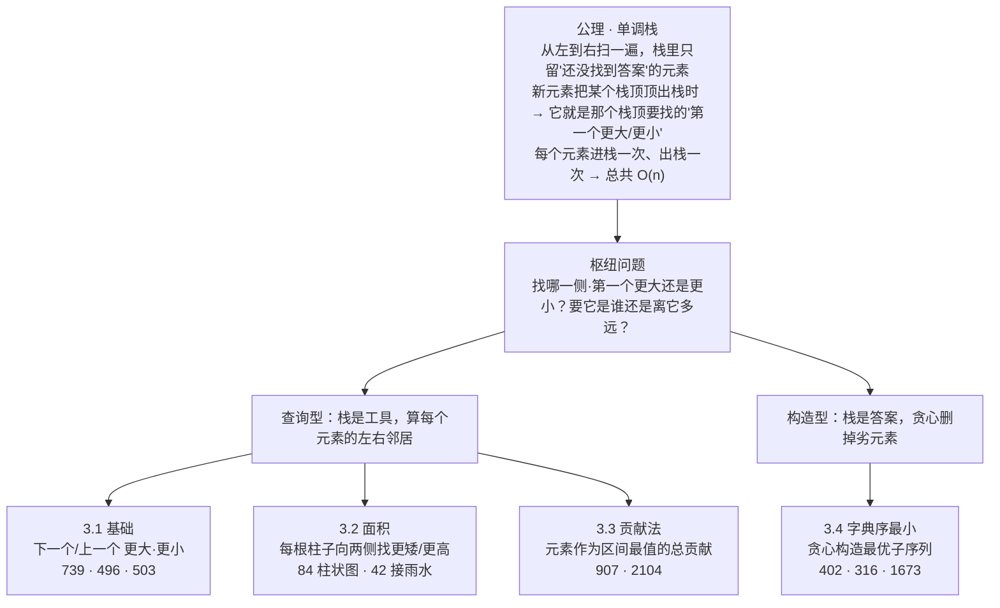
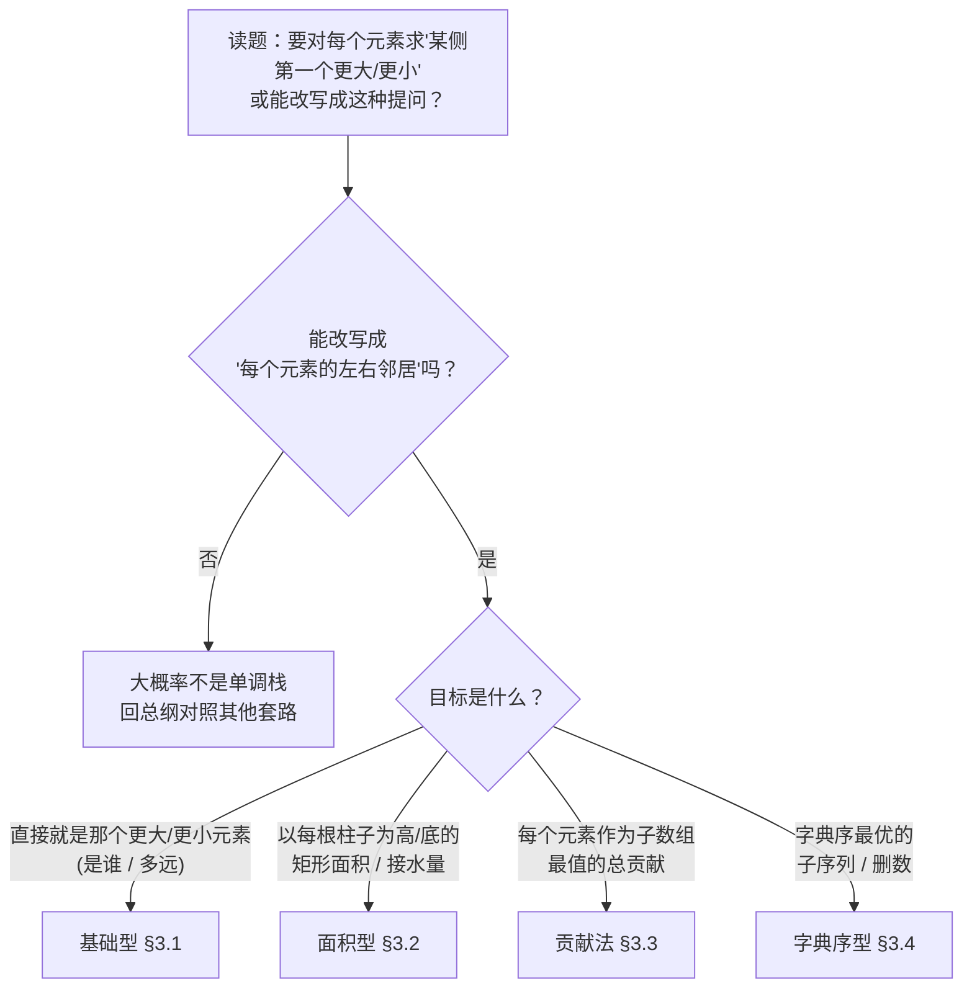

# 单调栈完整解题攻略

> [!info] 关于本攻略
> 适用范围：数组 / 字符串上"对每个元素，求它某侧第一个比它更大（或更小）的元素"，以及由此派生的矩形面积、贡献统计、字典序构造类题。
> 核心来源：[labuladong 单调栈结构](https://labuladong.online/algo/data-structure/monotonic-stack/)、[灵茶山艾府 单调栈题单](https://leetcode.cn/circle/discuss/9oZFK9/)，并按第一性原理重新组织。
> 配套地图见 [[00-算法范式分类总纲]] 速查表第 1c 行。同属"序列扫描"一族的近亲：双指针 [[1a-two-pointers]]、滑动窗口 [[1b-sliding-window]]；求"滑动窗口内最值"用单调队列 [[1d-monotonic-queue]]，与本篇划清边界（见 §2）。

---

## 开篇：单调栈解决什么问题

先看一道具体题，L739 每日温度。给一串每天的温度，比如 `[73, 74, 75, 71, 69, 72, 76, 73]`，要对**每一天**回答一个问题：再过几天才会遇到更暖的一天？往后再没有更暖的，就记 0。

最老实的做法：站在每一天，往后一天天数过去，直到撞见一个更高的温度。每天最多要往后看 n 天，n 天加起来就是 O(n²)，数据一大就超时。

单调栈只扫一遍数组，就能答完所有天，做到 O(n)。它的做法是这样的：

准备一个栈，按天数先后顺序，往里放那些"还没遇到更暖一天"的日子。每来新的一天，做下面几步：

- 拿今天的温度，和栈顶那天比。
- 如果今天更暖，那今天就是栈顶那天一直在等的"更暖一天"——记下两天相隔几天，把栈顶弹出去。
- 再拿今天和新露出的栈顶比，重复上一步，直到栈顶那天比今天还暖、或者栈空了为止。
- 最后把今天压进栈，让它也开始等自己往后的更暖一天。

扫到结尾时还留在栈里的日子，说明它们后面再没有更暖的，答案记 0。

为什么这样既不会漏、也不会重，§1 会一步步推。开篇只要先记住一句：**单调栈 = 用一个栈兜住"还没找到答案"的元素，让每个元素只扫一遍就找到它要找的那个邻居。** 后面所有花样（找更大还是更小、求是谁还是求距离、矩形面积、字典序）都是这一句的变体。

> [!tip] 下面这张图先扫一眼就好
> 这是全篇的地图，**第一次读看个大致轮廓即可，看不懂是正常的**——它是把整篇浓缩到一起的"目录"，本就该等读完 §1 再回头看才通。每个分支的展开在 §3。

### 全局记忆图



---

## 1. 第一性原理：所有单调栈题的共同本质

> [!note] 这一章是层层递进的一条链

### 1.1 公理：弹出的瞬间，锁定一对邻居关系

把开篇那道每日温度讲的事正式写下来，就是这条贯穿全篇的公理：

> [!abstract] 单调栈公理
> 维护一个**从栈底到栈顶保持单调**的栈，从左到右扫一遍序列。新元素入栈前，先把栈顶那些"被它比下去、再也派不上用场"的元素逐个弹出。弹出不是单纯丢掉：一个元素被挤出栈，恰好说明它等到了答案——把它挤出栈的这个新元素，就是它要找的"某侧第一个更大（或更小）的元素"。每个元素进出栈各一次，总计 O(n)。

### 1.2 一次正序扫描，同时拿到左右两个邻居

开篇那道每日温度只用到了"右边第一个"。单调栈更深的一点是：**正序扫描 + 弹栈，一趟同时给出两侧邻居**——这正是面积型、贡献法成立的根基。

弹出栈顶元素 `j` 的那一刻，看两个方向：

- **它的右邻**（右边第一个更大 / 更小）＝ 触发这次弹出的新元素 `i`。
- **它的左邻**（左边第一个更大 / 更小）＝ 把 `j` 弹掉之后，留在栈顶的那个元素。

第二条要想清楚：`j` 能一直留在栈里没被弹掉，是因为它紧贴的下层元素始终"压得住"它（找更大时下层比它更大，找更小时下层比它更小）。中间但凡冒出一个能压制 `j` 的元素，早就把上面的清空、贴到 `j` 身边了。所以 `j` 一弹出，露出来的新栈顶，正好是它那一侧第一个压得住它的元素——也就是它的左邻。基础型只需要其中一侧，面积型和贡献法两侧都要。

### 1.3 正交维度：三个旋钮拼出所有查询型题

先交代一个贯穿后文的区分：单调栈题按"栈拿来干嘛"分成两支。

- **查询型**——栈是工具，用它求每个元素"左右第一个更大 / 更小的邻居"。基础（§3.1）、面积（§3.2）、贡献法（§3.3）都属此类，§1.1 那套"弹出即锁定邻居"就是为它服务的。
- **构造型**——栈本身就是要构造的答案，靠贪心删元素拼出最优序列。只有字典序（§3.4）一类，机制不同，详见 §3.4（建议把查询型三类吃透再看它）。

本节讲**查询型**。每一道查询型题，都要给下面三个旋钮各拨定一个值——三个值定下来，模板的空缺就填满了。

- **维度①·找更大还是更小** → 决定栈的单调方向。
  - 找**更大** → 维护**单调递减栈**（栈底大、栈顶小），新元素更大时把小的弹出。
  - 找**更小** → 维护**单调递增栈**（栈底小、栈顶大），新元素更小时把大的弹出。
  - 一句话：栈的单调方向，和要找的方向**相反**。找更大就让栈递减，这样更大的新元素一来才挤得掉栈顶。
- **维度②·存值还是存下标** → 决定栈里放什么。
  - 只问"那个更大 / 更小的元素**是谁**" → 存值即可（496）。
  - 要算"离我**多远**"（739 的天数）、"中间**多宽**"（84 的矩形宽、907 的子数组个数） → 必须存**下标**，靠下标相减得距离。
  - 拿不准就存下标——下标能反查值，值反查不了位置。本攻略的模板除 496（只问"是谁"）外都存下标。
- **维度③·用右邻、左邻、还是两侧都用** → 决定弹出时结算什么。
  - 只要右邻 → 基础型"下一个更大 / 更小"（739、496）。
  - 两侧都要 → 面积型（84 要一根柱子向左右各延伸到第一根更矮的）、贡献法（907 要左右边界圈定管辖区间）。

三个旋钮正交：改"找更大 / 更小"不影响"存值 / 下标"，也不影响"用哪侧邻居"。任取两道查询型题，差异都能落到这三个旋钮的不同取值上。

### 1.4 枢纽问题：一问定题型

拿到一道像单调栈的题，先问这一句：

> [!tip] 枢纽问题
> **"对每个元素，要找它哪一侧、第一个比它更大还是更小的元素？"**

答案里的两个要素直接对号入座：

- **更大 / 更小** → 维度①，定栈的单调方向（找更大→递减栈，找更小→递增栈）。
- **要它是谁 / 离多远 / 中间多宽** → 维度②，定存值还是存下标。

如果一道题表面不问"第一个更大 / 更小"，但能**改写**成这种提问，它就还是单调栈。面积型、贡献法的核心难点正是这一步改写：把"最大矩形""子数组最小值之和"翻译成"对每个元素求左右第一个更矮 / 更小"。改写成功，套同一副骨架即可。

---

## 2. 解题决策流程



> [!warning] 看着像单调栈、其实不是——两类易混
> - **L239 滑动窗口最大值（难）** → 单调**队列**，不是单调栈。区别在"过期"：单调栈求"第一个更大 / 更小"，元素被弹出后永不回头；单调队列求"固定宽度窗口内的最值"，要从**队首**移除滑出窗口的过期元素，所以用双端队列而非栈。归 [[1d-monotonic-queue]]。
> - **求"全局第 K 大 / 动态中位数"** → 堆（优先队列）。单调栈只擅长"紧挨着的第一个更大 / 更小"，跨越式的"第 K 个"它给不出。

> [!tip] 改写训练是这类题的真正门槛
> 基础型一眼可辨（题面直接出现"下一个更大""更暖的一天"）。面积型、贡献法、字典序型都需要先把问题**翻译**成"每个元素的左右第一个更大 / 更小"，才看得出是单调栈。§3 每型的"识别信号"就是给这步翻译用的——记住那几个触发词。

---

## 3. 题型分类详解

**§3.1–3.3 同属查询型**，共享同一副"从左到右扫 + 弹栈"的骨架，差别只在三个旋钮（§1.3）的取值，以及面积/贡献型要不要末尾哨兵。先把这副查询型骨架立起来，后面每型只说"它把旋钮拨到哪、弹出时算什么"。**§3.4 是另一套范式（构造型）：栈不再是工具、而就是答案本身，骨架也不同，到那节再单独立——读到 3.4 时要换一套思路。**

```python
stack = []                       # 栈里存下标还是值：旋钮②（求距离/面积→下标，只问"是谁"→值）
for i in range(n):               # 固定：从左到右，逐个元素扫过去
    while stack and <nums[i] 与栈顶破坏单调>:   # 旋钮①：找更大→ >（配递减栈），找更小→ <（配递增栈）
        j = stack.pop()          # 弹出 j：触发者 i 是 j 的右邻，弹出后的新栈顶是 j 的左邻
        <结算 j 的答案>            # 旋钮③：基础型只用右邻 i；面积/贡献还要用左邻
    stack.append(i)              # 固定：当前元素进栈，继续等它自己的邻居
```

> [!note] 怎么读这副骨架
> **固定不动**的是这套"从左到右扫 + 新元素弹栈 + 自己入栈"的结构（`for` / `while` / `append`），每道题都一样。换题只调 §1.3 的三个旋钮：① `while` 里用 `>` 还是 `<`（找更大配递减栈、找更小配递增栈）；② 栈里存下标还是值；③ 弹出时用哪侧邻居来结算（只用右邻 `i`，还是连左邻一起用）。此外，面积型和贡献法常在末尾补一个哨兵把栈逼空（见 §3.2），那是个技巧、不算旋钮。后面每个例题的注释，直接写"这道题这几处填了什么"。

> [!note] labuladong 的倒序写法
> 另有一种**倒序**遍历（从右往左）+ 弹栈的写法，对"求下一个更大元素的值"很直接。本攻略统一用**正序**，因为只有正序弹栈能在一趟里同时交出左右两侧邻居（§1.2），面积型和贡献法离不开它。背一副正序骨架走遍四型，比每型记一套微差写法划算。

高频度标注（★★★ 必备 / ★★ 常见 / ★ 低频）依据大厂面经的大致频度，仅供排优先级。题号后以（易 / 中 / 难）括注 LeetCode 官方难度。

### 3.1 基础型：下一个 / 上一个更大 · 更小

> [!tip] 看到这种题 → 就是它
> 题面直接问"对每个元素，右边（或左边）第一个比它**更大 / 更小**的是谁、离多远"。常见词：下一个更大元素、更暖的一天、跨度、第一个更高 / 更矮。母题 L739 每日温度（中），面试高频 ★★★。

**本质**：基础型是单调栈最直接的用法——题目摆明了要"每个元素右边（或左边）第一个更大 / 更小的元素"，正好就是公理做的事，不用任何改写。三个旋钮（§1.3）这样拨：① 找"更大"就维护递减栈；② 问"是谁"就存值、问"隔多远"就存下标；③ 只看一侧的邻居——某个元素被弹出时，把它顶出栈的新元素就是它的答案，另一侧不用算。

循环数组（如 503）是个小变体：数组首尾相连，最后一个元素能绕回开头继续找更大的。做法是把它当成连扫两圈、下标取模回到原位，不必真复制一份数组。

#### 例题

> [!example] 例 1 · L739 每日温度（中）｜母题｜HOT 100
> 求每天往后第一个更暖的日子隔几天。找**更大** → 递减栈；求**距离** → 存下标。弹出 `j` 时，触发弹出的 `i` 就是 `j` 的下一个更暖日，距离 `i - j`。扫完仍在栈里的没有更暖日，答案保持 0。

```python
def daily_temperatures(temperatures):
    """每个位置往后第一个更高温度的间隔天数;没有则为 0(单调栈)。

    入参: temperatures —— 每日温度数组
    出参: 与输入等长的数组,第 i 位是等到更暖那天的间隔天数
    """
    n = len(temperatures)
    ans = [0] * n                       # 默认 0:扫完仍没等到更暖的
    stack = []                          # 存下标,对应温度单调递减
    for i in range(n):
        # 旋钮①:找更大 → 新温度 > 栈顶温度就弹(严格大于)
        while stack and temperatures[i] > temperatures[stack[-1]]:
            j = stack.pop()
            ans[j] = i - j              # 旋钮③:只用右邻 i,距离 = i - j
        stack.append(i)
    return ans
```

> [!warning] L739 易错：存下标、用严格 `>`
> - 求的是"几天后"，必须存**下标**才能相减得天数；存温度值就丢了位置。
> - "更暖"是严格更高，弹出条件用 `>`。若题目要"大于等于"才算，改成 `>=`。

> [!example] 例 2 · L496 下一个更大元素 I（易）
> nums1 是 nums2 的子集，求 nums1 每个元素在 nums2 中的下一个更大元素。和例 1 比只改两处：求"是谁"故**存值**入答案表，再让 nums1 查表。先对 nums2 跑一遍单调栈，把"值 → 下一个更大值"存进哈希表。

```python
def next_greater_element(nums1, nums2):
    """nums1 中每个元素在 nums2 里的下一个更大元素;没有则 -1。

    入参: nums1 —— 查询数组(nums2 的子集); nums2 —— 全集数组
    出参: 与 nums1 等长,第 i 位是 nums1[i] 在 nums2 中的下一个更大元素
    """
    nxt = {}                            # 值 → 它在 nums2 中的下一个更大值
    stack = []                          # 存值,单调递减
    for x in nums2:
        while stack and x > stack[-1]:
            nxt[stack.pop()] = x        # 被弹元素的下一个更大值就是 x
        stack.append(x)
    return [nxt.get(x, -1) for x in nums1]   # 没记录到的,右边没有更大元素
```

> [!example] 例 3 · L503 下一个更大元素 II（中）｜循环数组变体
> 数组首尾相连，最后一个元素的"下一个更大"可绕回开头找。和例 1 比只改一处：扫描跑 `2n` 圈、下标统一取 `i % n`，相当于把数组接成两圈，无须真复制。

```python
def next_greater_elements(nums):
    """循环数组中每个元素的下一个更大元素;没有则 -1。

    入参: nums —— 循环数组(首尾相连)
    出参: 与 nums 等长,第 i 位是 nums[i] 的下一个更大元素
    """
    n = len(nums)
    ans = [-1] * n
    stack = []                          # 存下标,对应值单调递减
    for i in range(2 * n):              # 跑两圈模拟环形
        cur = nums[i % n]
        while stack and cur > nums[stack[-1]]:
            ans[stack.pop()] = cur      # 求"是谁",直接记值
        if i < n:                       # 只在第一圈入栈,避免重复
            stack.append(i)
    return ans
```

> [!warning] L503 易错：第二圈只补答案、不再入栈
> 跑两圈，是为了让"第一圈结束时还卡在栈里、没找到更大元素"的那些下标，有机会绕回数组开头再找一次。所以第二圈（`i` 从 `n` 到 `2n−1`）只拿 `nums[i % n]` 当触发者去弹栈、给它们补答案，**不能再 `append`**。每个真实位置只该进栈一次；第二圈若再入栈，同一位置会被重复压入，多出来的那份要么算出错误答案、要么永远弹不掉。

> [!example] 代表题
> L739 每日温度（中）、L496 下一个更大元素 I（易）、L503 下一个更大元素 II（中·循环数组）、L901 股票价格跨度（中·求左边连续 ≤ 当前的天数，即到左边第一个更大的距离）、L1019 链表中的下一个更大节点（中·链表先转数组）、L456 132 模式（中·从右往左维护，找夹在中间的 132 结构）。

### 3.2 面积型：每根柱子向两侧找更矮 / 更高

> [!tip] 看到这种题 → 就是它
> 在柱状图 / 0-1 矩阵里求"最大矩形面积""能接多少雨水""最大正方形"。题面常含：柱状图、矩形、面积、接雨水、最大正方形。母题 L84 柱状图中最大的矩形（难），与 L42 接雨水（难）并列招牌题，面试高频 ★★★。

**本质**：把面积问题**改写**成"对每个元素求左右第一个邻居"，正是这类题的门槛。以 L84 为例：枚举每根柱子 `j` 当矩形的高，它能往左右各延伸到哪？——延伸到**左边第一根更矮**和**右边第一根更矮**的柱子为止（再矮就压不到这个高度了）。于是宽 = 右边界 − 左边界 − 1，面积 = `高 × 宽`。这要求**两侧邻居都用**（维度③）。找"更矮"→ 维护**递增栈**：弹出 `j` 时，触发者 `i` 是右边第一根更矮的，弹出后的新栈顶是左边第一根更矮的。

L42 接雨水方向相反：水积在"凹槽"里，要找每个低点**两侧第一根更高**的柱子当左右墙，所以维护**递减栈**、找"更高"。两道招牌题恰好凑成一对照：**找更矮用递增栈（凸，求矩形）、找更高用递减栈（凹，求积水）**。

> [!note] 末尾哨兵：逼着栈清空
> 面积型常在数组末尾补一个"最矮 / 最高"的哨兵元素，强迫栈里残留的所有柱子都被弹出、都结算一次面积，省掉"循环后再单独清栈"那段重复代码。下面 L84 用末尾补 `0` 实现。

#### 例题

> [!example] 例 1 · L84 柱状图中最大的矩形（难）｜招牌题｜HOT 100
> 每根柱子当高，向左右延伸到第一根更矮的。找**更矮** → 递增栈；**两侧都用** → 右边界是触发者 `i`、左边界是弹出后的新栈顶。末尾补 `0` 哨兵逼出残留柱子。

```python
def largest_rectangle_area(heights):
    """柱状图中能勾勒出的最大矩形面积(单调栈)。

    入参: heights —— 每根柱子的高度
    出参: 最大矩形面积
    """
    stack = []                          # 存下标,对应高度单调递增
    heights = heights + [0]             # 末尾哨兵:0 比任何柱子矮,逼出栈中所有元素
    ans = 0
    for i in range(len(heights)):
        # 旋钮①:找更矮 → 新柱子比栈顶矮就弹
        while stack and heights[i] < heights[stack[-1]]:
            h = heights[stack.pop()]    # 以这根柱子的高为矩形高
            left = stack[-1] if stack else -1   # 左边第一根更矮(栈空则越过左边界 -1)
            width = i - left - 1        # 右边界 i 与左边界 left 之间的宽度
            ans = max(ans, h * width)
        stack.append(i)
    return ans
```

> [!warning] L84 易错：左边界取弹出后的新栈顶，不是固定值
> 宽度的左边界是"弹出当前柱子**之后**露出来的新栈顶"，每次弹出都不同；栈空时说明左边再没有更矮的，左边界记 `-1`（宽度从 0 号位算起）。务必先 `pop` 再读新栈顶。

> [!example] 例 2 · L42 接雨水（难）｜招牌题·与 L84 反向｜HOT 100
> 横向一层层接水。找每个凹槽两侧第一根**更高**的当墙 → 递减栈。弹出"槽底" `bottom` 时，左墙是新栈顶、右墙是 `i`，这一层水量 = `(min(左墙, 右墙高) − 槽底高) × 中间宽`。

```python
def trap(height):
    """能接多少雨水(单调栈横向逐层累加)。

    入参: height —— 每个位置的挡板高度
    出参: 总接水量
    """
    stack = []                          # 存下标,对应高度单调递减
    ans = 0
    for i in range(len(height)):
        # 旋钮①:找更高 → 新挡板比栈顶高,栈顶成为可积水的槽底
        while stack and height[i] > height[stack[-1]]:
            bottom = stack.pop()        # 被夹在中间的槽底
            if not stack:               # 左边没有墙,这层接不住
                break
            left = stack[-1]            # 左墙 = 弹出槽底后的新栈顶
            width = i - left - 1        # 左右墙之间的宽
            depth = min(height[left], height[i]) - height[bottom]
            ans += depth * width
        stack.append(i)
    return ans
```

> [!warning] L42 易错：弹出槽底后必须确认左墙存在
> 弹出槽底后若栈空，说明左侧没有挡板，这一层兜不住水，要 `break`（或跳过），不能硬取左墙。这是和 L84 的关键差异：L84 栈空时左边界记 `-1` 照算面积，L42 栈空时直接放弃这层。

> [!example] 代表题
> L84 柱状图中最大的矩形（难）、L42 接雨水（难·与 84 反向，找更高）、L85 最大矩形（难·逐行压成柱状图，对每行跑 84）、L221 最大正方形（中·更常用 DP，单调栈是另一解）、L1504 统计全 1 子矩形（中·逐行高度 + 单调栈）。

> [!warning] 仓库待归位
> 练习仓库里 L42 接雨水误放在 `03.linked-list` 目录——它是单调栈 / 双指针 / DP 的典型题，与链表无关，应迁到单调栈目录下。见 [[00-算法范式分类总纲]] 覆盖度表。

### 3.3 贡献法：元素作为区间最值的总贡献

> [!tip] 看到这种题 → 就是它
> 求"**所有子数组**的某个最值的总和 / 总贡献"：所有子数组最小值之和、子数组范围和、子数组最小乘积……。题面特征是"对每个子数组取最小 / 最大，再求和"。母题 L907 子数组的最小值之和（中），面试 ★★。

**本质**：先看题意——L907 要把**每个连续子数组**各自的最小值求出来，再全部加起来。子数组共有 O(n²) 个，逐个去求最小值太慢。

窍门是**换一个角度来数**：不去问"每个子数组的最小值是多少"，而是反过来盯住每个元素，问"以**它**为最小值的子数组有几个"。把每个元素的"值 × 这样的子数组个数"累加起来，就是答案。

怎么数"以位置 `m` 的元素为最小值的子数组个数"？一个子数组以 `A[m]` 为最小值，必须满足两点：包含 `m`；向左、向右扩张时都不跨过比 `A[m]` 更小的元素（一跨过，最小值就不再是它了）。所以只要找两个边界——左边第一个比它小的位置记 `L`，右边第一个比它小的位置记 `R`。于是左端点能落在 `L` 与 `m` 之间，有 `m − L` 种选法；右端点能落在 `m` 与 `R` 之间，有 `R − m` 种选法。两者相乘就是个数，这个元素的贡献便是 `A[m] × (m − L) × (R − m)`。

举个数：`[3, 1, 2, 4]` 里的 `1`（下标 1）。它左右都没有更小的元素，所以左端点可选下标 `{0, 1}`、右端点可选 `{1, 2, 3}`，共 `2 × 3 = 6` 个子数组以它为最小值（`[1]`、`[3,1]`、`[1,2]`、`[3,1,2]`、`[1,2,4]`、`[3,1,2,4]`），贡献 `1 × 6 = 6`。

"找左右第一个更小"正是 §1.2 的两侧邻居查询：找"更小"用**递增栈**。代码里弹出的 `mid` 就是这个 `m`，触发它弹出的 `i` 是右边界 `R`，弹出后露出的新栈顶是左边界 `L`。

> [!warning] 去重：相等元素一侧严格、一侧非严格
> 若左右都用严格"更小"界定，两个相等的最小值会把同一个子数组算两遍。破解：一侧用严格小于、另一侧用小于等于，让每个子数组的最小值"归属"于唯一一个位置（如最左的那个）。下面 L907 的弹出条件用 `<`，相等元素不弹出、得以保留，等价于"右边界取下一个严格更小、左边界取上一个小于等于"，刚好不重不漏。

#### 例题

> [!example] 例 1 · L907 子数组的最小值之和（中）｜母题
> 枚举每个元素当最小值，左右第一个更小圈定它的管辖区间。找**更小** → 递增栈；弹出 `mid` 时左边界是新栈顶、右边界是 `i`，贡献 = `值 × 左可选 × 右可选`。末尾用 `-inf` 哨兵清栈。

```python
def sum_subarray_mins(arr):
    """所有子数组的最小值之和,结果对 1e9+7 取模(单调栈贡献法)。

    入参: arr —— 整数数组
    出参: 每个子数组取最小值后的总和(取模)
    """
    MOD = 10**9 + 7
    stack = []                          # 存下标,对应值单调递增
    arr = arr + [float('-inf')]         # 末尾哨兵:比任何数小,逼出栈中所有元素
    ans = 0
    for i in range(len(arr)):
        # 旋钮①:找更小 → 严格小于才弹(相等保留,用于去重)
        while stack and arr[i] < arr[stack[-1]]:
            mid = stack.pop()
            left = stack[-1] if stack else -1     # 左边第一个更小(栈空记 -1)
            # 以 arr[mid] 为最小值的子数组数 = 左端可选 (mid-left) 个 × 右端可选 (i-mid) 个
            ans = (ans + arr[mid] * (mid - left) * (i - mid)) % MOD
        stack.append(i)
    return ans % MOD
```

> [!warning] L907 易错：去重靠"一边严格一边非严格"
> 弹出条件若写成 `<=`，相等的最小值会被重复统计。统一用 `<`（相等不弹、留在栈里），等价于左闭右开地分配归属，是这类题去重的标准手法。换成"子数组最大值之和"只需把递增栈改递减栈、`<` 改 `>`。

> [!example] 代表题
> L907 子数组的最小值之和（中）、L2104 子数组范围和（中·最大值之和 − 最小值之和，跑两遍贡献法）、L1856 子数组最小乘积的最大值（中·贡献法定区间 + 前缀和）、L2281 巫师的总力量和（难·贡献法 + 两重前缀和，进阶）。

### 3.4 字典序最小：贪心构造最优子序列

> [!abstract] 心智模型切换：从这里进入「构造型」
> 前三型（§3.1–3.3）是**查询型**：栈是**工具**，用来算每个元素左右第一个更大 / 更小的邻居，某元素被弹出即代表它找到了答案。
> 这一型是**构造型**：**栈本身就是要输出的答案**，做法是从左扫一遍、贪心地删掉劣元素，让最优序列直接攒在栈里。

> [!tip] 看到这种题 → 就是它
> 从一个序列里删 / 选元素，使**剩下的子序列字典序最小（或最大）**，常带"删 K 个""每个字母只保留一次""最具竞争力"等约束。题面特征：结果要"最小 / 最大""字典序"。母题 L402 移掉 K 位数字（中），面试 ★★。

**本质**：构造型怎么落地，看母题 L402 最直观。L402 要的是：给一个数字串，例如 `"1432"`，删掉 k 位（设 k=1），让剩下的数最小。删 1 位共四种结果——`432`、`132`、`142`、`143`，最小的是 `132`，也就是删掉了那个 `4`。

为什么是 `4`？因为高位对大小影响最大，要让数变小就得优先压低高位。从左扫到 `4` 时，第一次出现"前一位比后一位大"（`4 > 3`），删掉它，高位立刻从 `4` 降到 `3`，数值掉得最狠。**核心贪心：从左扫，前面的数字比当前大就删掉前面那个，只要还有删除名额。**

> [!note] 为什么问"数值最小"的题归进"字典序最小型"
> 字典序就是从左往右逐位比，遇到第一个不同的位，谁的字符小整个串就小。对**等长**的数字串，逐位比字典序和直接比数值大小完全一致（`132` < `142`，因为第二位 `3 < 4`）；只有长度不等时两者才分家（数值 `9 < 10`，字典序却是 `"10" < "9"`）。L402 删 k 位后结果恒为 n−k 位、所有候选等长，所以这里"数值最小"就等于"字典序最小"。

落到代码上：栈里存"暂定保留的结果前缀"，新数字进来时只要栈顶比它大、且还删得动，就弹掉栈顶，直到栈顶不再更大，再把新数字压入——相当于维护一个尽量递增的栈，扫完一遍，栈里从底到顶就是答案。其中"还删得动"是各题特有的**额外约束**，弹栈前必须连它一起判断（L402 看删除名额有没有用尽，L316 看被删字符后面还会不会出现），细节见下面两道例题。

#### 例题

> [!example] 例 1 · L402 移掉 K 位数字（中）｜母题
> 删 k 位使剩下的数最小。维护递增栈：新数字比栈顶小且还有删除额度，就弹掉栈顶（删大的）。扫完若额度没用尽，从尾部删（尾部是最大的剩余）。最后去前导零。

```python
def remove_kdigits(num, k):
    """从数字串 num 中删 k 位,使剩下的数最小(单调栈贪心)。

    入参: num —— 数字字符串; k —— 要删除的位数
    出参: 删后最小数的字符串(去前导零,空则 "0")
    """
    stack = []
    for d in num:
        # 新数字更小且还删得起 → 弹掉前面更大的(删了字典序更小)
        while stack and k > 0 and stack[-1] > d:
            stack.pop()
            k -= 1
        stack.append(d)
    stack = stack[:len(stack) - k] if k else stack   # 额度没用完,从尾部补删
    return ''.join(stack).lstrip('0') or '0'         # 去前导零;全删空则为 "0"
```

> [!warning] L402 易错：三个收尾细节
> - 扫完 `k` 还有剩（如 `num` 本身递增，没机会弹），要从**尾部**删够 `k` 个。
> - 结果要去**前导零**（`lstrip('0')`）。
> - 全部删空时返回 `"0"`，别返回空串。

> [!example] 例 2 · L316 去除重复字母（中）
> 每个字母只留一个，使结果字典序最小。比 L402 多两道关卡：① 已在栈里的字母不重复入栈；② 弹栈前先确认"栈顶字母后面还会再出现"，否则删了就补不回来、不能删。靠 `last` 记每个字母最后出现的位置。

```python
def remove_duplicate_letters(s):
    """保留每个字母各一个,使结果字典序最小(单调栈贪心)。

    入参: s —— 小写字母字符串
    出参: 去重后字典序最小的字符串
    """
    last = {c: i for i, c in enumerate(s)}   # 每个字母最后一次出现的下标
    stack = []
    in_stack = set()                          # 栈中已有哪些字母,避免重复
    for i, c in enumerate(s):
        if c in in_stack:                     # 已保留过,跳过
            continue
        # 栈顶更大、且它后面还会再出现(删了能补回来) → 弹掉换更小的在前
        while stack and stack[-1] > c and last[stack[-1]] > i:
            in_stack.discard(stack.pop())
        stack.append(c)
        in_stack.add(c)
    return ''.join(stack)
```

> [!warning] L316 易错：弹栈前必须确认后面还有
> 只有"栈顶字母在 `i` 之后还会出现"（`last[栈顶] > i`）才能弹——否则这是它最后一次露面，删了结果就缺这个字母。漏掉这个判断是本题最常见的 bug。

> [!example] 代表题
> L402 移掉 K 位数字（中）、L316 去除重复字母（中）/ L1081 不同字符的最小子序列（中·与 316 同题）、L1673 找出最具竞争力的子序列（中·删到长度 k，类比 402）、L321 拼接最大数（难·分配 + 单调栈选最大子序列 + 归并，进阶）。

---

## 4. 复杂度分析通法

> [!abstract] 复杂度统一公式
> **总时间 = 每个元素的进出栈次数 × 单次操作量**

- 每个元素**最多入栈一次、出栈一次**，单次操作 O(1) → 时间 **O(n)**。这是单调栈相对暴力双重循环 O(n²) 的全部收益。别被嵌套的 `while` 吓到：`while` 弹出的总次数受"入栈总数 n"封顶，摊销下来仍是 O(n)。
- 空间 **O(n)**：最坏情况（严格单调序列，谁也弹不掉谁）整个序列都压在栈里。
- 循环数组（503）扫两圈 → 2n，仍是 O(n)。面积型（85）逐行跑一遍单调栈 → O(行 × 列)。

反过来用这条公式判断一道题适不适合单调栈：**能否设计一种"新元素一来就永久弹掉某些旧元素"的规则，让每个元素只进出栈各一次**。能，就降到 O(n)；若元素弹出后还可能要找回来，那就不是单调栈（多半是单调队列或别的结构）。

---

## 5. 渐进刷题路线

按依赖顺序练，每阶段吃透再进下一个（题号均为 LeetCode）：

| 阶段 | 目标 | 题目 |
| --- | --- | --- |
| 1. 基础·只用右邻 | "弹出即锁定右邻"的核心直觉，存值 vs 存下标 | L496易、L739中、L503中 |
| 2. 基础·进阶 | 左邻 / 跨度 / 反向维护 | L901中、L456中、L1019中 |
| 3. 面积·两侧邻居 | 把面积改写成"左右第一个更矮 / 更高"，哨兵清栈 | L84难、L42难、L85难 |
| 4. 贡献法 | 换枚举主体（枚举最值元素），相等去重 | L907中、L2104中、L1856中 |
| 5. 字典序构造 | 栈即答案的贪心，额外约束（额度 / 能否补回） | L402中、L1673中、L316中、L321难 |

> [!tip] 入门母题先过
> 每型都有一道"最干净的母题"，先把它写到不看模板：基础看 L739，面积看 L84，贡献法看 L907，字典序看 L402。母题通了，同型进阶题（L503、L42、L2104、L316）只是在母题上叠条件或换方向。

---

## 6. 参考来源

- [labuladong：单调栈结构](https://labuladong.online/algo/data-structure/monotonic-stack/) —— "矮个起开"的核心比喻、基础模板、存值 vs 存下标、循环数组取模技巧。本文把其倒序写法统一改为正序，以便一趟同时拿到左右邻居。
- [灵茶山艾府：单调栈题单（矩形面积 / 贡献法 / 最小字典序）](https://leetcode.cn/circle/discuss/9oZFK9/) —— §3 的题型谱系（基础 / 面积 / 贡献法 / 字典序 / 其他）与各型代表题主要参照此题单。
- 上层地图与学习顺序见 [[00-算法范式分类总纲]]；同族近亲：双指针 [[1a-two-pointers]]、滑动窗口 [[1b-sliding-window]]、单调队列 [[1d-monotonic-queue]]。
