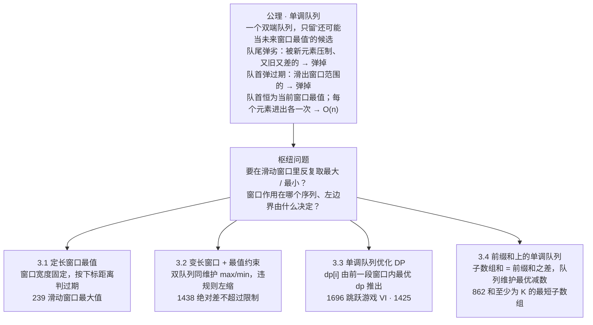
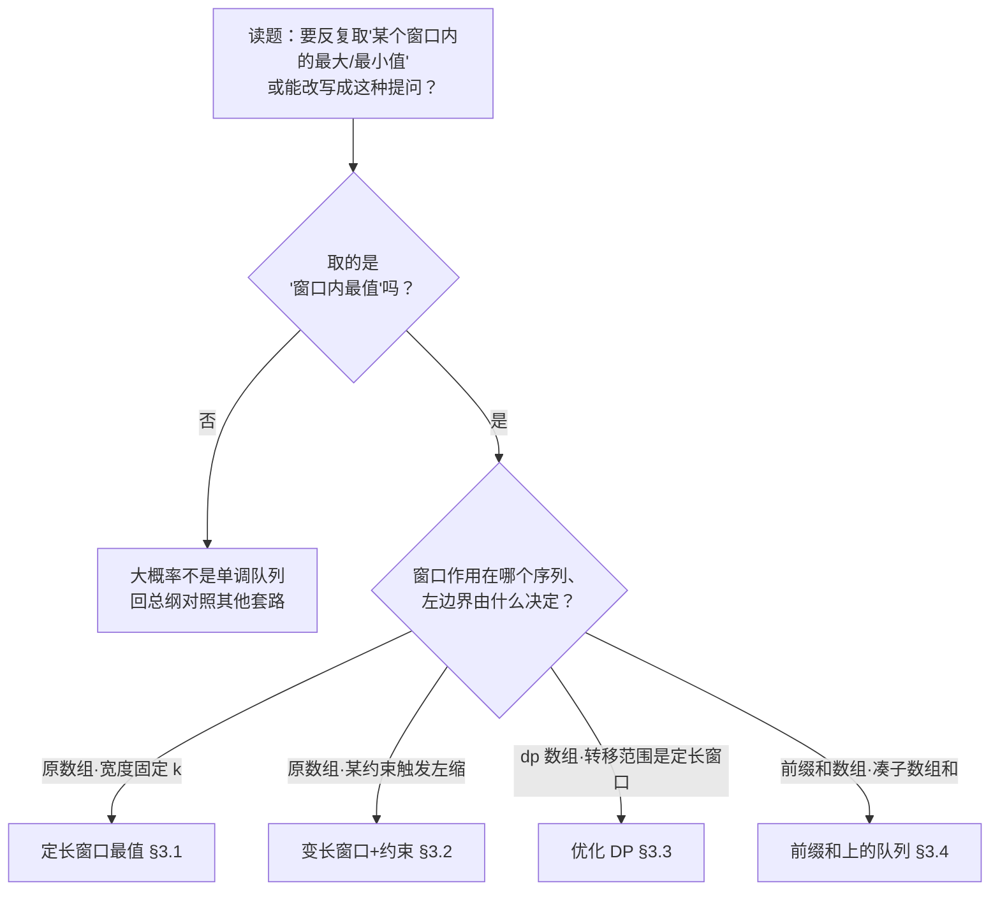

# 单调队列完整解题攻略

> [!info] 关于本攻略
> 适用范围：在一个**滑动的窗口**里反复取最大 / 最小值，以及由此派生的变长窗口极差约束、单调队列优化 DP、前缀和上的最优减数四类题。
> 核心来源：[labuladong 单调队列结构](https://labuladong.online/algo/data-structure/monotonic-queue/)、[灵茶山艾府 数据结构题单 §4.4 单调队列](https://leetcode.cn/circle/discuss/mOr1u6/)、[OI-Wiki 单调队列](https://oi-wiki.org/ds/monotonous-queue/)，并按第一性原理重新组织。
> 配套地图见 [[00-算法范式分类总纲]] 速查表第 1d 行。一句话定位它在家族里的位置：**单调队列 = 滑动窗口 [[1b-sliding-window]] + 单调栈 [[1c-monotonic-stack]]**——窗口的外壳来自前者，队尾"弹劣"的手法来自后者。与单调栈划清边界见 §1.2，与滑动窗口、堆的边界见 §2。

---

## 开篇：单调队列解决什么问题

先看招牌题 L239 滑动窗口最大值。给一个数组 `[1, 3, -1, -3, 5, 3, 6, 7]` 和窗口宽度 `k = 3`，窗口从左往右每次滑动一格，要报出**每个窗口里的最大值**：`[3, 3, 5, 5, 6, 7]`。

最老实的做法：每滑到一个窗口，就把里面 `k` 个数扫一遍找最大。一共约 `n` 个窗口、每个扫 `k` 个，合计 O(n·k)，窗口一宽就慢。

为什么不能像求和那样 O(1) 滑过去？求窗口和时，进一个新数就加上、出一个旧数就减掉，增删都是 O(1)。但求最大值时，**出窗的那个数如果恰好是当前最大值，剩下的最大值得重新扫一遍才知道**——这一步退化成 O(k)，是暴力慢的根源。

那换个能 O(1) 取最值的工具，比如大顶堆？堆能秒取最大值，可它出队的顺序由**大小**决定，没法精准地把"刚滑出窗口的那个特定元素"删掉——而窗口滑动恰恰要按**时间顺序**淘汰最旧的那个。堆管不了"按时间出队"。

单调队列正好同时满足这两件事：**既能 O(1) 取最值，又能按时间顺序从队首淘汰过期元素**。它的做法是只往队列里留"还可能成为未来某个窗口最大值"的候选：

- 新数从**队尾**进来前，先把队尾那些比它小的候选全部弹掉——它们又比新数小、又比新数旧，往后任何一个窗口里都轮不到它们当最大值了，留着没用。
- 每滑一格，检查**队首**那个候选的下标是不是已经滑出了窗口左边界，过期了就从队首弹掉。
- 经过这两步，队列从队首到队尾对应的值始终单调递减，**队首永远是当前窗口的最大值**，直接取。

为什么这样既不漏、也不重、还能做到 O(n)，§1 会一步步推。开篇先记住一句：**单调队列 = 一个双端队列，只兜住"还可能当未来窗口最值"的候选；队尾弹掉被新元素压制的、队首弹掉滑出窗口的，队首即最值。** 后面所有花样（变长窗口、优化 DP、前缀和）都是这一句换个序列来用。

> [!tip] 下面这张图先扫一眼就好
> 这是全篇的地图，**第一次读看个大致轮廓即可**——它把整篇浓缩成一张"目录"，本就该读完 §1 再回头看才通。每个分支的展开在 §3。


### 全局记忆图




---


## 1. 第一性原理：所有单调队列题的共同本质


### 1.1 公理：队尾弹劣、队首弹过期，队首即最值

把开篇那道滑动窗口最大值讲的事正式写下来，就是这条贯穿全篇的公理：

> [!abstract] 单调队列公理
> 维护一个**双端队列**，里面只保留"还可能成为未来某个窗口最值"的候选，从队首到队尾对应的值保持单调。从左到右扫一遍序列，每个新元素做两件事：**队尾弹劣**——把队尾那些既被新元素压制、又比它早进窗（往后翻不了身）的候选逐个弹出，再把新元素接到队尾；**队首弹过期**——把队首那些下标已滑出窗口左边界的候选弹出。两步做完，队首恒为当前窗口的最值。每个元素进队一次、出队一次，总计 O(n)。


### 1.2 单调队列 = 单调栈多了一个"过期"概念

单调队列的"队尾弹劣"和单调栈的"弹栈"是同一招：新元素进来时，把那些被它压制、再也派不上用场的旧元素清掉，维持容器内单调。差别只在一处——**单调队列多了"过期"**：

- **单调栈**（[[1c-monotonic-stack]]）求"某侧第一个更大 / 更小的邻居"。元素一旦被弹出就永不回头，整个过程只在**栈顶**一端增删，用栈即可。
- **单调队列**求"一个滑动窗口内的最值"。窗口有左边界，最旧的元素会随窗口右移而**滑出、过期**，必须从**队首**这另一端把它移除。两端都要操作，所以底层用双端队列（deque）而非栈。

一句话记牢边界：**单调栈管"邻居"（永久关系，单端），单调队列管"窗口"（有时效，双端）。** 正因为多了"过期"这个时间维度，单调队列天然是滑动窗口的搭档——这也是 §3 四个题型全都套着一层窗口的原因。

> [!note] 为什么不用堆
> 堆（优先队列）也能取最值，但它**按值出队、不按时间出队**：想删掉"刚滑出窗口的那个特定元素"，堆做不到 O(1)（得用懒删除等额外手段绕）。单调队列保留了元素的时间先后，所以能从队首精准淘汰最旧的过期元素——这正是它在滑动窗口场景胜过堆的关键。需要"全局第 K 大""动态中位数"这类与窗口无关的最值时，才该用堆。


### 1.3 三个旋钮：方向、过期判据、作用序列

单调队列的核心机制（§1.1 那两步弹出）对四个题型完全一样，**变的只是三个旋钮的取值**。拿到一道题，把这三个旋钮各拨定一个值，模板的空缺就填满了。

- **旋钮①·求最大还是最小** → 决定队列的单调方向。
  - 求**最大** → 维护**单调递减队列**（队首大、队尾小），队尾弹劣时弹掉 `≤ 新值` 的。
  - 求**最小** → 维护**单调递增队列**（队首小、队尾大），队尾弹劣时弹掉 `≥ 新值` 的。
  - 队首永远是要求的那个最值。
- **旋钮②·过期判据** → 决定队首什么时候弹（即窗口左边界由什么定）。
  - **定长窗口** → 下标距离超过 `k` 就过期（队首下标 `≤ i − k`），§3.1。
  - **变长窗口** → 窗口违反某约束时，主动右移左边界、把队首中下标小于新左边界的弹掉，§3.2。
  - **DP 转移窗口** → 队首下标超出 `[i−k, i−1]` 就过期，§3.3。
- **旋钮③·队列作用在哪个序列、队首拿来干嘛** → 这是题型分类的主轴。
  - 作用在**原数组**，队首最值**直接是答案**（239）。
  - 作用在**原数组**，队首最值**当作窗口是否合法的判据**（1438 拿极差和 limit 比）。
  - 作用在 **dp 数组**，队首最大 dp **当作转移来源**（1696 的 `dp[i] = nums[i] + 队首 dp`）。
  - 作用在**前缀和数组**，队首最优前缀和**当作减数**去凑子数组和（862）。

三个旋钮正交：改"求最大 / 最小"不影响"窗口怎么过期"，也不影响"作用在哪个序列"。任取两道单调队列题，差异都能落到这三个旋钮的不同取值上。其中旋钮③（作用序列）跨度最大，是 §3 分四型的依据；旋钮①只是个方向开关，每型内部一拨即可。

### 1.4 枢纽问题：一问定题型

拿到一道可能用单调队列的题，先问这一串：

> [!tip] 枢纽问题
> **"要在一个滑动的窗口里反复取最大 / 最小值吗？这个窗口作用在哪个序列上、它的左边界由什么决定？"**

答案里的要素直接对号入座：

- **取最大还是最小** → 旋钮①，定队列单调方向。
- **窗口左边界由什么定**（固定宽度 / 某约束触发收缩 / DP 转移范围） → 旋钮②，定队首怎么弹过期。
- **窗口作用在哪个序列、队首最值拿来做什么**（原数组直接当答案 / 当约束 / 当 DP 来源 / 当前缀和减数） → 旋钮③，定 §3 落到哪一型。

难点常在第三问：题面未必直接出现"滑动窗口最值"。**单调队列优化 DP**（§3.3）和**前缀和上的单调队列**（§3.4）的门槛，正是先把题目**改写**成"在某个序列的滑动窗口里取最值"——改写成功，套同一副骨架即可。

---


## 2. 解题决策流程




> [!warning] 看着像单调队列、其实不是——三类易混
>
> - **求"某侧第一个更大 / 更小的元素"** → 单调**栈**，不是队列。区别在"过期"：单调栈的关系是永久的（A 右边第一个更大的就是它，不会过期），元素弹出后不回头、单端操作即可；单调队列求"有时效的窗口最值"，最旧元素会滑出窗口，要从队首弹过期。归 [[1c-monotonic-stack]]。
> - **窗口内求"和 / 计数 / 种类数"而非最值** → 普通**滑动窗口**（[[1b-sliding-window]]）。这些量进出窗口都能 O(1) 更新，不需要单调队列。只有"最值"这种"删掉极值后要重找次大"的量才请单调队列出场。
> - **"全局第 K 大 / 动态中位数"等与窗口无关的最值** → **堆**（优先队列）。单调队列只擅长"一个连续窗口内的最值"，跨越式的"第 K 个"它给不出（见 §1.2）。

> [!tip] 改写训练是后两型的真正门槛
> §3.1、§3.2 一眼可辨（题面直接出现"滑动窗口最大值""最长连续子数组"）。§3.3 优化 DP、§3.4 前缀和都要先把问题**翻译**成"在 dp / 前缀和序列的滑动窗口里取最值"，才看得出是单调队列。§3 每型的"识别信号"就是给这步翻译用的——记住那几个触发词（DP 转移只依赖前 k 项、含负数求子数组和……）。

---


## 3. 题型分类详解

四个题型**共享同一副骨架**——都是"从左扫一遍，每个新元素先队尾弹劣、再入队、再队首弹过期、最后取队首最值"。差别只在三个旋钮（§1.3）的取值，以及队列作用在哪个序列上。先把这副统一骨架立起来，后面每型只说"它把旋钮拨到哪、队首最值拿去干嘛"。

```python
from collections import deque

q = deque()                          # 队列存"下标"(便于判过期); 对应值的单调方向由旋钮①定
for i in range(n):
    # ① 队尾弹劣: 旋钮① 求最大→弹掉 <= 新值的(配递减队列), 求最小→弹掉 >= 新值的(配递增队列)
    while q and <seq[q[-1]] 与 seq[i] 破坏单调>:
        q.pop()
    q.append(i)                      # 新下标进队尾
    # ② 队首弹过期: 旋钮② 队首下标滑出窗口左边界就弹(定长按距离, 变长按收缩后的 left)
    while q and <q[0] 已过期>:
        q.popleft()
    # ③ 取队首最值: 旋钮③ 直接当答案 / 当约束判据 / 当 DP 来源 / 当前缀和减数
    if <窗口已形成>:
        <用 seq[q[0]] 这个最值做事>
```

> [!note] 怎么读这副骨架
> **固定不动**的是"队尾弹劣 → 入队 → 队首弹过期 → 取队首"这套结构，每道题都一样。换题只调 §1.3 的三个旋钮：① 队尾弹劣用 `<=` 还是 `>=`（求最大配递减队列、求最小配递增队列）；② 队首过期的判据（下标距离 / 收缩后的左边界 / DP 窗口边界）；③ 队首最值拿去做什么（当答案 / 当约束 / 当 DP 来源 / 当减数）。后面每个例题的注释，直接写"这道题这几处填了什么"。

> [!note] 三步的先后顺序
> "队尾弹劣"必在"入队"之前（否则新元素自己会被误判）；"队首弹过期"与"取值"的相对位置可调，但**取值前队首必须已经清过期**。本攻略统一写成"弹劣 → 入队 → 弹过期 → 取值"。一个细节：若取值要用到当前元素自己（如 §3.3 的 `dp[i]` 依赖窗口里的旧 dp），则把"取值"提到"入队"之前，避免当前元素混进自己的转移来源——§3.3 例题会标出这处调整。

高频度标注（★★★ 必备 / ★★ 常见 / ★ 低频）依据大厂面经的大致频度，仅供排优先级。题号后以（易 / 中 / 难）括注 LeetCode 官方难度。

### 3.1 定长滑动窗口最值

> [!tip] 看到这种题 → 就是它
> 窗口宽度**固定为 k**，要报出每个窗口（或满足条件后）的最大 / 最小值。题面常含"大小为 k 的窗口""每 k 个连续""窗口内的最大值"。母题 L239 滑动窗口最大值（难），面试高频 ★★★。

**本质**：这是单调队列最直接的用法，三个旋钮（§1.3）这样拨：① 求最大就维护递减队列、队首即最大；② 窗口宽度固定，所以队首下标只要 `≤ i − k` 就过期、从队首弹掉；③ 队首最值**直接是答案**，无需再加工。队列里存**下标**而非值，因为判过期要靠下标和窗口右端 `i` 比距离——存了值就丢了位置。

#### 例题

> [!example] 例 1 · L239 滑动窗口最大值（难）｜母题｜HOT 100 ✅
> 报出每个定长窗口的最大值。求**最大** → 递减队列；**定长过期** → 队首下标 `≤ i − k` 就弹；队首**直接是答案**。窗口要等扫满 k 个元素（`i ≥ k − 1`）才开始记录。

```python
from collections import deque

def max_sliding_window(nums, k):
    """每个宽度为 k 的滑动窗口内的最大值(单调队列)。

    入参: nums —— 整数数组; k —— 固定窗口宽度
    出参: 长度为 len(nums)-k+1 的数组,第 i 位是第 i 个窗口的最大值
    """
    q = deque()                          # 存下标,对应 nums 值单调递减,队首是窗口最大值
    ans = []
    for i, x in enumerate(nums):
        # ① 队尾弹劣:旋钮①求最大→弹掉队尾 <= x 的(又小又旧,再无翻身机会)
        while q and nums[q[-1]] <= x:
            q.pop()
        q.append(i)
        # ② 队首弹过期:旋钮②定长→队首下标滑出窗口左界 i-k+1
        if q[0] <= i - k:
            q.popleft()
        # ③ 取值:旋钮③队首直接是答案;窗口扫满 k 个才开始记
        if i >= k - 1:
            ans.append(nums[q[0]])
    return ans
```

> [!warning] L239 易错：存下标、弹过期只弹队首一个
>
> - 判过期要比下标距离，必须存**下标**；存值就没法知道队首那个是不是该滑出去了。
> - 每滑一格只可能有一个元素过期，队首弹过期用 `if` 即可（不是 `while`）；而队尾弹劣是 `while`（一个新元素可能压掉一串）。
> - 弹劣条件 `<=` 把相等的也弹掉，队列更短且不影响正确性；写 `<` 也对，只是会多留相等元素。

> [!example] 例 2 · LCR 184 设计自助结算系统（中）｜把单调队列封装成"最大值队列"
> 设计一个支持 `max_value`、`push_back`、`pop_front` 的队列，三个操作均摊 O(1)。本质是把例 1 的逻辑封进一个数据结构：用一条普通队列存全部元素、一条单调递减队列存候选最大值；`push_back` 时对候选队列做队尾弹劣，`pop_front` 出队时若弹出的恰是候选队首就同步弹掉。和例 1 比，"过期"不再按下标距离、而是显式调用 `pop_front` 触发。

```python
from collections import deque

class Checkout:
    """支持均摊 O(1) 查询最大值的队列(单调队列封装)。"""

    def __init__(self):
        self.data = deque()              # 存全部元素,维持真实先进先出
        self.maxq = deque()              # 单调递减,队首恒为当前最大值

    def max_value(self):
        """当前队列最大值;空则 -1。"""
        return self.maxq[0] if self.maxq else -1

    def push_back(self, value):
        """入队一个元素。"""
        self.data.append(value)
        while self.maxq and self.maxq[-1] < value:   # 队尾弹劣
            self.maxq.pop()
        self.maxq.append(value)

    def pop_front(self):
        """出队最早元素并返回;空则 -1。"""
        if not self.data:
            return -1
        v = self.data.popleft()
        if self.maxq and v == self.maxq[0]:          # 出队的恰是候选队首,同步弹掉
            self.maxq.popleft()
        return v
```

> [!warning] LCR 184 易错：出队时才判是否同步弹候选
> 候选队列里存的是值，`pop_front` 出队时要判"出队的这个值是不是正好等于候选队首"，相等才 `popleft`；不等说明它早在某次 `push_back` 弹劣时就被压掉了，无须再动。这与例 1"队首过期才弹"是同一回事，只是触发时机从"下标滑出"换成"显式出队"。

> [!example] 代表题
> L239 滑动窗口最大值（难·母题）、LCR 184 设计自助结算系统（中·封装成最大值队列）、L2398 预算内的最多机器人数目（中·定长窗口最值 + 二分或双指针）、L3589 计数质数间隔平衡子数组（中·窗口内同时取最大与最小）。


### 3.2 变长窗口 + 最值约束（双队列）

> [!tip] 看到这种题 → 就是它
> 求"满足某个**极值约束**的最长 / 最短连续子数组"，约束里同时牵涉窗口的最大值和最小值。题面常含"绝对差不超过 limit""最大值与最小值之差""极差 ≤ ……"。母题 L1438 绝对差不超过限制的最长连续子数组（中），面试 ★★。

**本质**：这一型是**滑动窗口求最长**（[[1b-sliding-window]] §3.2）套上单调队列。窗口宽度不固定：右指针扩窗，一旦窗口违规（极差 > limit）就右移左指针收缩，直到重新合法，全程用 `right − left + 1` 更新最长。难点在"违规判据"要用到窗口的**最大值和最小值**——单个单调队列只给一头，所以**同时维护两条队列**：一条递减（队首是窗口最大值）、一条递增（队首是窗口最小值）。三个旋钮里，旋钮②的过期不再按定长距离，而是"收缩后队首下标若小于新的 `left` 就弹"；旋钮③把两条队首相减得极差，当作窗口是否合法的判据。

#### 例题

> [!example] 例 1 · L1438 绝对差不超过限制的最长连续子数组（中）｜母题
> 求最长子数组使窗口内极差 ≤ limit。维护**两条队列**：`max_q` 递减取最大、`min_q` 递增取最小。违规（`max − min > limit`）就右移 `left` 收缩，并把两条队列里下标已过期（`< left`）的队首弹掉；收缩到合法后用窗口长度更新答案。

```python
from collections import deque

def longest_subarray(nums, limit):
    """极差(最大-最小)不超过 limit 的最长连续子数组长度(单调队列 + 滑动窗口)。

    入参: nums —— 整数数组; limit —— 允许的最大极差
    出参: 满足条件的最长子数组长度
    """
    max_q = deque()                      # 存下标,nums 值单调递减,队首是窗口最大值
    min_q = deque()                      # 存下标,nums 值单调递增,队首是窗口最小值
    left = 0
    ans = 0
    for right, x in enumerate(nums):
        # ① 两条队列各自队尾弹劣后入队
        while max_q and nums[max_q[-1]] <= x:
            max_q.pop()
        max_q.append(right)
        while min_q and nums[min_q[-1]] >= x:
            min_q.pop()
        min_q.append(right)
        # ② 违规(极差 > limit)→ 右移 left 收缩;队首下标滑出 left 就弹过期
        while nums[max_q[0]] - nums[min_q[0]] > limit:
            left += 1
            if max_q[0] < left:
                max_q.popleft()
            if min_q[0] < left:
                min_q.popleft()
        # ③ 收缩后窗口已合法,用长度更新最长
        ans = max(ans, right - left + 1)
    return ans
```

> [!warning] L1438 易错：两条队列都要判过期；用值约束收缩而非定长
>
> - 收缩时**两条队列**的队首都要检查是否过期（下标 `< left`），漏掉任一条都会拿到窗口外的极值、判据出错。
> - 这里窗口是**变长**的，`left` 由"极差是否超 limit"驱动，不是定长的 `i − k`。把 §3.1 的定长过期套过来会错。

> [!example] 代表题
> L1438 绝对差不超过限制的最长连续子数组（中·母题）、L2762 不间断子数组（中·变长窗口 + 极差 ≤ 2，同款双队列）、L1499 满足不等式的最大值（难·见 §3.4，是前缀和变形而非纯极差，注意区分）。


### 3.3 单调队列优化 DP

> [!abstract] 心智切换：队列从"维护原数组"转为"维护 dp 数组"
> §3.1、§3.2 里队列作用在**原数组**上，队首最值要么是答案、要么是约束判据。这一型队列作用在 **dp 数组**上：dp 的转移来源是前一段定长窗口里的最优 dp 值，用单调队列把"每次扫一遍窗口找最优 dp"从 O(nk) 压到 O(n)。骨架不变（仍是队尾弹劣 + 队首弹过期），变的只是旋钮③——队首最值当作**转移来源**喂给 `dp[i]`。

> [!tip] 看到这种题 → 就是它
> DP 的转移方程形如 `dp[i] = 最优(dp[j] | i−k ≤ j < i) + 某项`——**当前状态只依赖前面一段定长窗口内的状态**，且要取那段里的最大 / 最小。题面常含"每次最多跳 k 步""相邻选取间隔不超过 k"。母题 L1696 跳跃游戏 VI（中），面试 ★★。

**本质**：朴素 DP 求 `dp[i]` 要把窗口 `[i−k, i−1]` 里的 dp 全扫一遍取最优，O(nk)。但 `i` 每加一，这个转移来源窗口就整体右移一格——正是个滑动窗口取最值的场景。于是用单调队列维护**下标在窗口内、dp 值单调**的候选：队首即窗口内最优 dp，`dp[i]` 直接取它。三个旋钮：① 求最大 dp 用递减队列；② 队首下标 `< i − k` 就过期；③ 队首最优 dp 当转移来源。关键调整：因为 `dp[i]` 要用窗口里**别人的** dp，所以顺序是"先队首弹过期、再取队首算 `dp[i]`、最后才把 `i` 自己入队"——避免当前元素混进自己的来源。

#### 例题

> [!example] 例 1 · L1696 跳跃游戏 VI（中）｜母题
> 从下标 0 出发，每步最多前跳 k 格，落点得分累加，求到末尾的最大总分。转移 `dp[i] = nums[i] + max(dp[i−k..i−1])`。维护递减队列存下标、对应 dp 递减：取 `dp[i]` 前先弹过期、取队首当来源，算完再把 `i` 队尾弹劣后入队。

```python
from collections import deque

def max_result(nums, k):
    """每步最多前跳 k 格,落点得分累加,求到末尾的最大总分(单调队列优化 DP)。

    入参: nums —— 每个下标的得分; k —— 单步最大跳跃格数
    出参: 从下标 0 跳到末尾的最大累计得分
    """
    n = len(nums)
    dp = [0] * n
    dp[0] = nums[0]
    q = deque([0])                       # 存下标,对应 dp 值单调递减,队首是窗口内最大 dp
    for i in range(1, n):
        # ② 队首弹过期:转移窗口是 [i-k, i-1],队首下标 < i-k 就出局
        if q[0] < i - k:
            q.popleft()
        # ③ 取队首最优 dp 当转移来源(取值在入队之前,不让 i 混进自己的来源)
        dp[i] = nums[i] + dp[q[0]]
        # ① 队尾弹劣后入队:dp[i] 比队尾大,队尾那些 dp 又小又旧,弹掉
        while q and dp[q[-1]] <= dp[i]:
            q.pop()
        q.append(i)
    return dp[-1]
```

> [!warning] L1696 易错：三步顺序要"弹过期 → 取值 → 入队"
> 与 §3.1 不同，这里取队首是为了算**当前** `dp[i]`，所以必须先弹过期、再取值，且把 `i` 入队放到**最后**——若先入队，`dp[i]` 可能取到自己，逻辑就错了。这正是 §3 骨架里"取值要用当前元素时，把取值提到入队前"那条说明的落地。

> [!example] 代表题
> L1696 跳跃游戏 VI（中·母题）、L1425 带限制的子序列和（难·`dp[i] = nums[i] + max(0, max(dp[i−k..i−1]))`，同款窗口取最大 dp）、L862 和至少为 K 的最短子数组（难·见 §3.4，可视作前缀和上的优化）。


### 3.4 前缀和上的单调队列

> [!abstract] 心智切换：队列从"维护原数组"转为"维护前缀和数组"
> 子数组和 = 两个前缀和之差 `presum[i] − presum[j]`。把问题改写成"在前缀和数组上，为每个右端点 `i` 找一个最优的左端点 `j`"，就又回到"滑动 / 移动的窗口里取最值"——队列这次作用在**前缀和数组**上，队首是当前最优的减数 `presum[j]`。骨架仍是队尾弹劣 + 队首弹出，旋钮③把队首当**减数**去凑子数组和。

> [!tip] 看到这种题 → 就是它
> 求"子数组和满足某条件"的最长 / 最短 / 最值，且**数组含负数**（普通滑动窗口因此失效）。题面常含"和至少为 K 的最短子数组""含负数的子数组和"。母题 L862 和至少为 K 的最短子数组（难），面试 ★。

**本质**：先看为什么不能用普通滑动窗口——数组含负数时，窗口拉长，和可能变小再变大，合法性不随长度单调（[[1b-sliding-window]] §1.1），左指针无法只进不退。改走前缀和：求"和 ≥ K 的最短子数组"，即对每个右端点 `presum[i]`，找最靠右的左端点 `j` 使 `presum[i] − presum[j] ≥ K`。在前缀和上维护一条**单调递增**队列（存下标），它要做两件事：① **队首结算**——若 `presum[i] − presum[队首] ≥ K`，说明找到一个合法子数组，记下长度，并把队首弹掉（它配更靠右的 `i` 只会更长，再无用）；② **队尾弹劣**——若 `presum[队尾] ≥ presum[i]`，队尾那个 `j` 既是更大的减数、又更靠左（更长），全面劣于 `i`，弹掉。两步都在前缀和上做。

#### 例题

> [!example] 例 1 · L862 和至少为 K 的最短子数组（难）｜母题
> 含负数，求和 ≥ K 的最短子数组长度。在前缀和上维护递增队列：队首满足 `presum[i] − presum[队首] ≥ K` 就结算长度并弹队首；队尾 `presum` ≥ 当前就弹劣。两个 `while` 都是弹出，别漏。

```python
from collections import deque

def shortest_subarray(nums, k):
    """和至少为 k 的最短非空连续子数组长度;不存在返回 -1(前缀和 + 单调队列)。

    入参: nums —— 可含负数的整数数组; k —— 子数组和的下界
    出参: 满足和 ≥ k 的最短子数组长度,不存在返回 -1
    """
    n = len(nums)
    presum = [0] * (n + 1)               # presum[i] = nums[:i] 之和
    for i, x in enumerate(nums):
        presum[i + 1] = presum[i] + x
    q = deque()                          # 存前缀和下标,presum 值单调递增
    ans = n + 1
    for i, s in enumerate(presum):
        # ② 队首结算:满足 s - presum[队首] >= k 就记长度并弹队首(它配更右的 i 只会更长)
        while q and s - presum[q[0]] >= k:
            ans = min(ans, i - q.popleft())
        # ① 队尾弹劣:presum[队尾] >= s,该 j 是更大减数又更靠左,全面劣于 i
        while q and presum[q[-1]] >= s:
            q.pop()
        q.append(i)
    return ans if ans <= n else -1
```

> [!warning] L862 易错：在前缀和数组上跑、两端都是弹出
>
> - 队列存的是**前缀和下标**（`0 .. n`），不是原数组下标；长度是两个前缀和下标之差。
> - 与 §3.1 不同，这里队首不是"按距离过期"，而是"**已结算就主动弹**"（求最短的特性：满足条件的左端点一旦用过，对后面更右的 `i` 不可能给出更短解）。队首和队尾**都是** `while` **弹出**，缺一不可。
> - 答案初值取不可能的大数（`n + 1`），最后没被更新过说明无解，返回 -1。

> [!example] 代表题
> L862 和至少为 K 的最短子数组（难·母题）、L1499 满足不等式的最大值（难·把 `y_i + y_j + |x_i − x_j|` 在 `x_i − x_j ≤ k` 约束下改写成"窗口里求 `y_j − x_j` 的最大值"）、L918 环形子数组的最大和（中·破环成倍长数组 + 定长窗口前缀和最小减数）。

---


## 4. 复杂度分析通法

> [!abstract] 复杂度统一公式
> **总时间 = 每个元素的进出队次数 × 单次操作量**

- 每个元素（或下标）**最多入队一次、出队一次**，单次操作 O(1) → 时间 **O(n)**。这是单调队列相对暴力"每个窗口扫一遍"O(n·k) 的全部收益。别被嵌套的 `while` 吓到：队尾弹劣 + 队首弹出的总次数受"入队总数 n"封顶，摊销下来仍是 O(n)。
- 空间 **O(k)**（定长窗口）或 **O(n)**（变长 / 前缀和）：最坏情况整个窗口的候选都压在队列里（如严格单调序列，谁也弹不掉谁）。
- 变长双队列（1438）维护两条队列 → 常数翻倍，仍 O(n)。优化 DP（1696）队列作用在 dp 上 → O(n)，把朴素 O(nk) 降一个量级。前缀和（862）多一趟前缀和预处理 → O(n)。

反过来用这条公式判断一道题适不适合单调队列：**待求的是不是"一个滑动 / 移动窗口内的最值"，且能设计出"新元素一来就永久弹掉某些旧候选"的规则**。能，就降到 O(n)；若求的是窗口内的和 / 计数（普通滑窗就够）或与窗口无关的第 K 大（该用堆），那就不是单调队列。

---


## 5. 渐进刷题路线

按依赖顺序练，每阶段吃透再进下一个（题号均为 LeetCode）。**前置**：先掌握滑动窗口 [[1b-sliding-window]] 与单调栈 [[1c-monotonic-stack]]，单调队列是这两者的合体。


| 阶段           | 目标                                 | 题目                 |
| ------------ | ---------------------------------- | ------------------ |
| 1. 定长窗口最值    | "队尾弹劣 + 队首弹过期 + 队首即最值"的核心直觉，存下标    | L239难、LCR184中      |
| 2. 变长窗口 + 约束 | 套滑动窗口求最长，双队列同维护 max/min，按 left 弹过期 | L1438中、L2762中      |
| 3. 优化 DP     | 把转移来源窗口改写成"dp 数组上取最值"，调三步顺序        | L1696中、L1425难      |
| 4. 前缀和上的队列   | 含负数失效 → 改前缀和，队列维护最优减数，求最短的"结算即弹"   | L862难、L1499难、L918中 |


> [!tip] 入门母题先过
> 每型都有一道"最干净的母题"，先把它写到不看模板：定长看 L239，变长看 L1438，优化 DP 看 L1696，前缀和看 L862。母题通了，同型进阶题只是换队列作用的序列、或叠一层窗口收缩条件。L239 与 L862 务必对照着写——前者队首"按距离过期"、后者队首"结算即弹"，两种弹队首的时机最能体现旋钮②的差别。

---


## 6. 参考来源

- [labuladong：单调队列结构](https://labuladong.online/algo/data-structure/monotonic-queue/) —— "加数易、删最值难"的痛点剖析、与堆的对比、239 的 push/max/pop 三件套模板。本文把其"pop 需传参"的设计在 LCR 184 例题里收敛成标准队列 API。
- [灵茶山艾府：数据结构题单 §4.4 单调队列](https://leetcode.cn/circle/discuss/mOr1u6/) —— "单调队列 = 滑动窗口 + 单调栈"的定位、入队 / 出队 / 更新答案的先后顺序、§3 各型代表题（239 / 1438 / 2762 / 862 / 1499）主要参照此题单；单调队列优化 DP 另见其动态规划题单 §11.3。
- [OI-Wiki：单调队列](https://oi-wiki.org/ds/monotonous-queue/) —— 优化 DP（1696 / 1425）与前缀和（862）两类应用的交叉印证。
- 上层地图与学习顺序见 [[00-算法范式分类总纲]]；同族近亲：滑动窗口 [[1b-sliding-window]]（提供变长窗口外壳）、单调栈 [[1c-monotonic-stack]]（提供队尾弹劣手法）、双指针 [[1a-two-pointers]]。

