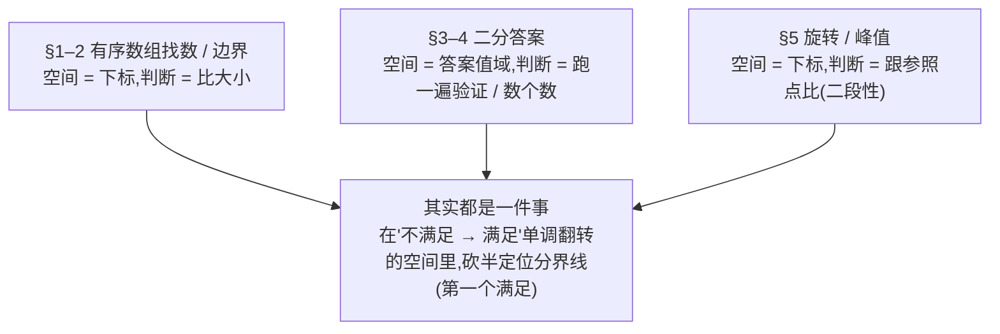

 # 二分查找完整解题攻略

> [!info] 关于本攻略
> 从最简单的"有序数组找一个数"讲起，一题一题往上加，直到没有数组也能二分"答案"，最后收束成一句话：所有二分题都是在一段"不满足→满足"单调翻转的空间里，找那条分界线。涵盖基础查找、边界查找、二分答案（求最小 / 求最大 / 最小化最大值 / 第 K 小）、旋转与峰值数组。
> 核心来源：[labuladong 二分查找详解](https://github.com/labuladong/fucking-algorithm/blob/master/%E7%AE%97%E6%B3%95%E6%80%9D%E7%BB%B4%E7%B3%BB%E5%88%97/%E4%BA%8C%E5%88%86%E6%9F%A5%E6%89%BE%E8%AF%A6%E8%A7%A3.md)（边界细节）、[灵茶山艾府 二分算法题单](https://leetcode.cn/circle/discuss/SqopEo/)（题型分类与代表题）。
> 上层地图见 [[00-算法范式分类总纲]] 速查表第 2 行。

> [!tip] 怎么读这篇
> 顺着 §1 → §5 一路读，每节只比上一节多一点点，全是具体题、不绕抽象。真正把它们串成一套的"统一模型"和全局图放在最后的 §6 收束——读到那里回头看会豁然，开头不必先背它。

---

## 1. 最简单的二分：有序数组找一个数

母题 **L704 二分查找（易）**：升序数组里找 `target` 的下标，没有返回 -1。

暴力是从头扫到尾，O(n)。但数组**有序**，藏着能砍一半的信息：取正中间那个数 `nums[mid]`，和 `target` 比一下，只有两种有用的结论——

- `nums[mid] >= target`：中间数**够大**，`target` 若存在只会在 `mid` 或它**左边**（`mid` 自己可能就是，得留住）。
- `nums[mid] < target`：中间数**偏小**，`target` 只可能在 `mid` **右边**。

每比一次就排掉一半，O(log n)。区间越夹越小，夹到只剩一点自动停——停的那点是**第一个 `≥ target` 的位置**：`target` 在数组里，它第一次出现就在这；不在，这里站着的是第一个比它大的数（或越过了末尾）。所以循环里不需要"相等就返回"的分支，最后验证一眼就行。

```python
def search(nums, target):
    """升序数组中查找 target 的下标;不存在返回 -1(二分)。

    入参: nums —— 升序数组; target —— 目标值
    出参: target 的下标,不存在则 -1
    """
    lo, hi = 0, len(nums)            # 候选是下标 0..n-1;hi 取 n(右开),n 这格表示"落在末尾之后"
    while lo < hi:                   # 区间 [lo, hi) 非空就继续;lo == hi 即空,自动停
        mid = (lo + hi) // 2         # 取中点,整除偏左,永远 < hi,不会越界
        if nums[mid] >= target:      # 中间数够大 → 答案在 mid 或更左,留住 mid
            hi = mid
        else:                        # 中间数偏小 → 答案只能在 mid 右边,跳过 mid
            lo = mid + 1
    # lo 停在第一个 >= target 的下标(全都偏小时 lo == n)
    # and 短路:lo < len(nums) 为假时右边不执行,nums[n] 不会被访问,两个条件顺序不能换
    return lo if lo < len(nums) and nums[lo] == target else -1
```

> [!warning] 这套模板全篇只此一副，四条规矩钉死
> - **`hi` 初值 = 最大候选 + 1**（数组就是 `len(nums)`）：区间左闭右开 `[lo, hi)`、含 `lo` 不含 `hi`。`mid` 永远小于 `hi`，不会真去访问 `nums[n]`；`n` 这一格专门表示"全都不够大、落在末尾之后"。
> - **`while` 永远写 `<`**：`lo == hi` 时区间已空、自动退出，循环体里没有任何 `return`。
> - **满足收 `hi = mid`（不减一）、不满足跳 `lo = mid + 1`**：够大的 `mid` 自己可能就是答案，必须留在区间里；偏小的 `mid` 确定出局，跳过。这一搭配让区间每轮严格缩小，绝不死循环。（其他语言防溢出写 `mid = lo + (hi - lo) // 2`；Python 整数无上限，不用管。）
> - **不加"`nums[mid] == target` 就 `return mid`"的分支**：对 L704 加了也对（题目保证元素互不相同），平均还省一两轮，但模板的返回值就不再保证是"第一个满足"——§2 原样复用去找"第一次出现"立刻错（`[5, 7, 7, 7, 9]` 找 7 会停在撞上的下标 2，而第一次出现在下标 1）。省的是常数（复杂度仍 O(log n)），破的是"一套走全篇"，不换。

> [!note]- 教科书还有另一套写法，本篇不用
> 经典教材写闭区间：`lo, hi = 0, len(nums) - 1`、`while lo <= hi`、三分支"相等就 `return mid`、偏小 `lo = mid + 1`、偏大 `hi = mid - 1`"。它也对，但初值、循环条件、边界更新三件配件与本篇这套**全部不同**，两套混搭是二分差一错误的头号来源：闭区间配 `<` 会漏查最后一个数（`[5]` 找 5 返回 -1）；右开配 `<=` 会在 `lo == hi` 时原地打转死循环。而且闭区间写 §2 的"找第一次出现"时，满足分支被迫 `hi = mid - 1`、把可能的答案踢出区间，最后靠退出时 `lo == hi + 1` 从区间外兜回来，多一层"差一"心算。本篇从头到尾只用右开这一套，一副骨架走完全部题型。

> [!tip] 这节带走的通用思路
> 有序数组里找一个**具体值** → 套统一模板找"**第一个 `≥ target` 的位置**"，结尾验证 `nums[lo] == target`。下面的代表题只是把"比较的对象"换一换（平方值、猜数反馈、拉平的矩阵）。

> [!example] 代表题
> L704 二分查找（易·母题）、L74 搜索二维矩阵（中·HOT 100·每行首元素大于上一行末元素，整个矩阵拉平就是一条升序数组，下标用 `// 列数`、`% 列数` 映射回行列）、L69 x 的平方根（易·找最大的 `k` 使 `k² ≤ x`）、L374 猜数字大小（易·把"猜大了 / 猜小了"当成大小比较）。

---

## 2. 稍变一下：找第一次 / 最后一次出现

母题 **L34 在排序数组中查找元素的第一个和最后一个位置（中·HOT 100）**：`target` 可能重复出现，要它**第一次**和**最后一次**出现的下标。

重复元素正好显出 §1 那句"停在**第一个** `≥ target` 的位置"的威力。`[5, 7, 7, 7, 9]` 找 7：满足"`≥ 7`"的是下标 1 到 4 一整段，模板返回的是这段的**最左端**——恰好就是 7 第一次出现的位置。为什么必然最左？因为满足分支从不提前返回：摸到一个满足的 `mid` 只说明答案在 `mid` 或更左（像一排灯左边灭、右边亮，要找第一盏亮的——摸到亮的不能停，它左边可能还有亮的），`hi = mid` 留住它继续往左试，直到夹死在满足段的最左端。记住这条，后面每节都在用：**满足 ≠ 就是答案，答案是满足段的最左端，所以满足分支永远 `hi = mid`、绝不提前 `return`。**

把 §1 的循环原样提炼成积木（这名字是 C++ / Python 标准库的同款叫法）——**找第一个 `≥ target` 的位置**：

```python
def lower_bound(nums, target):
    """找第一个 >= target 的下标;全都比 target 小则返回 len(nums)。左闭右开 [lo, hi)。

    入参: nums —— 升序数组; target —— 目标值
    出参: 第一个 >= target 的下标
    """
    lo, hi = 0, len(nums)            # 右开:hi = n,表示"没找到就落在末尾之后"
    while lo < hi:
        mid = (lo + hi) // 2
        if nums[mid] >= target:      # 够大了,mid 可能就是第一个 → 收右边界,但留住 mid
            hi = mid
        else:                        # 偏小,第一个 >= target 只会更靠右
            lo = mid + 1
    return lo                        # 第一个 >= target 的下标;全都 < target 时 lo 被推到 n(哨兵:不存在)
```

有了这块积木，L34 直接拼出来：

- **第一次出现** = 第一个 `≥ target` 的位置。
- **最后一次出现** = 第一个 `≥ target + 1` 的位置，再减 1（即第一个比 `target` 大的前一格）。

```python
def search_range(nums, target):
    """升序数组中 target 的首末下标;不存在返回 [-1, -1]。

    入参: nums —— 升序数组; target —— 目标值
    出参: [首次出现下标, 末次出现下标],不存在为 [-1, -1]
    """
    left = lower_bound(nums, target)
    if left == len(nums) or nums[left] != target:    # target 根本不在数组里
        return [-1, -1]
    right = lower_bound(nums, target + 1) - 1         # 第一个 > target 的前一格
    return [left, right]
```

> [!warning] 为什么找第一次用 `>= target`，而不是 `<= target`
> 要让"满足条件"的数落在**右边**，这样"第一个满足"才正好是第一个 `target`。以 `[1, 3, 5, 7, 9]` 找 5 为例：
> - `nums[i] >= 5` → `否 否 是 是 是`，第一个"是"在下标 2（就是 5），对。
> - `nums[i] <= 5` → `是 是 是 否 否`，第一个"是"在下标 0，毫无意义。
>
> 所以比较符要挑得**让"满足"落在右边**，第一个满足恰好是想要的边界。这条在 §3 二分答案里还会反复用到。它和 `while` 里的 `<` 是**两个不相干的开关**：`<` 是模板的固定配件、永不变；这里的比较符是"要找什么"的表达、随题变。

> [!warning] L34 收尾两个坑
> - 先判 `left` 是否真的命中（`nums[left] == target`），没命中直接返回 `[-1, -1]`，否则 `right` 减一会得到无意义的下标。"没命中"有两种长相，守卫的两半各防一种：**全都比 target 小** → `left == n`（哨兵、越界，前半拦）；**target 落在缝隙里或全都比 target 大** → `left` 是第一个更大的数的下标（合法下标、只是值不对，后半 `nums[left] != target` 拦；全都大时 `left = 0`）。
> - `lower_bound` 返回 `len(nums)` 表示"全都比 target 小"，那是个越界位置，别拿去索引。代码里 `left == len(nums) or nums[left] != target` 靠 `or` 的短路求值护住 `nums[left]`（左边为真，右边不再执行），两个判断的先后顺序不能换。

> [!tip] 这节带走的通用思路
> 凡"有序数组里找**第一个 / 最后一个**满足某条件的位置"（第一次出现、插入位、第一个比 x 大的……）→ 别重写循环：① 把条件写成判断，并让"满足"落在**右边**；② 套 `lower_bound` 得第一个满足；③ 要"最后一个满足"就转成"第一个不满足的前一格"（结果减一，如 L34 右边界用 `target + 1`）。下面的代表题只是换判断条件。

> [!example] 代表题
> L34 查找区间（中·母题·HOT 100）、L35 搜索插入位置（易·HOT 100·答案就是 `lower_bound` 本身，无需命中判定）、L744 寻找比目标字母大的最小字母（易·`lower_bound(target + 1)`，环形取模）、L2529 正整数和负整数的最大计数（易·两次 `lower_bound` 数个数）、L658 找到 K 个最接近的元素（中·`lower_bound` 定左端再收缩）。

---

## 3. 换个战场：没有数组，也能二分"答案"

母题 **L875 爱吃香蕉的珂珂（中）**：一堆香蕉 `piles`，限时 `h` 小时，每小时挑一堆、最多吃 `speed` 根（吃不完留到下一小时），求能吃完的**最小** `speed`。

这题没有任何有序数组可查。但二分照样能用——**把二分的对象换成"答案本身的取值范围"**。速度最小 1、最大不超过最大那堆，答案一定在 `[1, max(piles)]` 里。

关键一步：给定一个速度，能不能一眼算出它"行不行"（`h` 小时吃不吃得完）？能——扫一遍 `piles`，累加每堆需要的小时数即可。而且**速度越大越吃得完**，把"行不行"从小速度到大速度排开，正是 `不行 不行 … 行 行 行`，单调！于是又回到 §2 那块积木：**找第一个"行"的速度**，就是答案。

和 §2 相比，砍半的循环一模一样，只是判断条件从"`nums[mid]` 够不够大"换成了"这个速度吃不吃得完"：

```python
def min_eating_speed(piles, h):
    """能在 h 小时内吃完所有香蕉的最小速度(二分答案)。

    入参: piles —— 每堆香蕉数; h —— 限定小时数
    出参: 满足 h 小时内吃完的最小每小时速度
    """
    def can_finish(speed):                        # 判断:这个速度 h 小时够不够吃完
        # 每堆需 ceil(p / speed) 小时,向上取整写成 (p + speed - 1) // speed
        hours = sum((p + speed - 1) // speed for p in piles)
        return hours <= h

    lo, hi = 1, max(piles) + 1                    # 速度范围 [1, max];右开,上界写 max + 1
    while lo < hi:
        mid = (lo + hi) // 2
        if can_finish(mid):                       # 这个速度行 → 也许更慢也行,收右往左找
            hi = mid
        else:                                     # 太慢吃不完 → 得更快
            lo = mid + 1
    return lo                                     # 第一个"行"的速度,即最小
```

> [!warning] 二分答案的两条通则
> - **判断条件（这里 `can_finish`）要对答案单调**：答案越大越行、或越小越行，二者必居其一，否则不能二分。判断能不能二分答案，就问一句："假设答案定死是 `x`，验证它行不行，是不是比直接求答案容易？且这个'行不行'随 `x` 单调？"两条都成立才行。
> - **右端 `hi` 用"右开"，写成'最大候选 + 1'**：和 §2 `lower_bound` 的 `hi = n` 是一回事。这里写 `max(piles) + 1`，否则最大那个速度会被漏在区间外测不到。

> [!tip] 这节带走的通用思路
> 求"**最小**的满足要求的值"（最小速度 / 容量 / 天数……），且按上面通则验证容易、越大越行 → 三步：① 圈答案范围 `[最小可能, 最大可能 + 1)`；② 写一个扫一遍数据的验证函数；③ 套 §2 的"找第一个满足"。

> [!example] 代表题
> L875 爱吃香蕉的珂珂（中·母题）、L1011 在 D 天内送达包裹的能力（中·运载力当速度，与 875 同构）、L1283 使结果不超过阈值的最小除数（中）、L2187 完成旅途的最少时间（中·总时间当"能不能达标"）。

---

## 4. 二分答案的几副面孔

§3 是二分答案最标准的样子：越大越行，找第一个行的。换几道题，判断条件和方向会变，但砍半的循环始终不变。

### 4.1 最小化最大值（把"最大值"设成要二分的答案）

母题 **L410 分割数组的最大值（难）**：把数组分成 k 个连续子数组，让"最大那段的和"尽量小。

听着像求最大，其实是**求最小**：先固定一个上限 `limit`，问"限制每段和都 `≤ limit`，能不能分成 `≤ k` 段"。`limit` 越大越好分（越"行"），所以又是 `不行 … 行 行`——**找第一个能分成 ≤ k 段的 `limit`，就是最小的可能最大段和**。和珂珂一个模子，只换了判断条件。

```python
def split_array(nums, k):
    """把 nums 分成 k 个连续子数组,最小化最大子数组和(二分答案)。

    入参: nums —— 非负整数数组; k —— 分段数
    出参: 所有分法中"最大子数组和"的最小值
    """
    def can_split(limit):                # 判断:每段和 <= limit,能否分成 <= k 段
        segments, cur = 1, 0             # 至少 1 段
        for x in nums:
            if cur + x > limit:          # 当前段放不下 x,另起一段
                segments += 1
                cur = x
            else:
                cur += x
        return segments <= k

    lo, hi = max(nums), sum(nums) + 1    # 最大段和 ≥ 单个最大元素、≤ 全部之和;右开 +1
    while lo < hi:
        mid = (lo + hi) // 2
        if can_split(mid):               # limit 够大,分得开 → 收右往左找更小的
            hi = mid
        else:
            lo = mid + 1
    return lo
```

> [!warning] L410 值域下界要从 `max(nums)` 起
> 任何一段至少得装下它内部最大的那个元素，所以"最大段和"不可能小于 `max(nums)`。`lo` 从 0 起会在不可能的小值上空跑（虽不出错但浪费），下界取"单个元素硬约束的最小值"是这类题的通用起点。

> [!tip] 这节带走的通用思路
> 看到"**最小化最大值**"（分段最大和最小、每袋最大球数最小、路径最大高差最小……）→ 把那个"最大值"本身设成要二分的答案 `x`，判断写成"以 `x` 为上限，行不行"，就还原成 §3 的求最小。对偶的"最大化最小值"归 §4.2。

> [!example] 代表题
> L410 分割数组的最大值（难·母题）、L1760 袋子里最少数目的球（中·最小化最大袋数）、L2439 最小化数组中的最大值（中）、L1631 最小体力消耗路径（中·最小化路径最大高差，判断用 BFS / 并查集）。

### 4.2 求最大：方向反过来（糖果、甜蜜度）

母题 **L2226 每个小孩最多能分到多少糖果（中）**：把若干堆糖果分给 k 个小孩，每人拿到的颗数必须相同（同堆可拆、不同堆不能拼），求每人**最多**能分多少。

这次是**越小越行**：每人分得越少，越能凑够 k 份。"行不行"排开是 `行 行 … 不行 不行`——满足的挪到了**左边**，要的是**最后一个"行"**。

统一模板只会"找第一个满足"，怎么办？**把判断取反**：找"第一个**不行**"的位置，它的**前一格**就是最后一个行的。所以两处改动：判断条件加 `not`、返回时 `lo - 1`。

```python
def maximum_candies(candies, k):
    """把糖果堆分给 k 个小孩,每人同数,求每人最多分多少(二分答案·求最大)。

    入参: candies —— 每堆糖果数; k —— 小孩数
    出参: 每个小孩最多能分到的糖果数;无法满足返回 0
    """
    def can_share(x):                    # 判断:每人分 x 颗,总份数够不够 k
        return sum(c // x for c in candies) >= k

    lo, hi = 1, max(candies) + 1         # 每人糖数范围 [1, max];右开 +1
    while lo < hi:
        mid = (lo + hi) // 2
        if not can_share(mid):           # 找"第一个不行"(取反),分不出 k 份就往小找
            hi = mid
        else:
            lo = mid + 1
    return lo - 1                        # 第一个不行的前一格 = 最后一个行;全不行时 lo-1 = 0
```

> [!warning] 求最大最容易犯的错：方向搞反 + 忘了减一
> 若连每人分 1 颗都凑不齐 k 份，`can_share(1)` 就为 False，`lo` 停在 1、`lo - 1 = 0`，正好表示无解，无需特判。
> "满足在左边还是右边"由判断条件本身决定，不用另选，但**一定要先想清楚朝向**——方向反了是二分答案最高发的 bug。

**L2517 礼盒的最大甜蜜度（中）** 是同款：从 `price` 里挑 k 个，让"任意两数之差的最小值"最大。先排序，判断"最小间距 `≥ gap` 能不能选满 k 个"——`gap` 越小越好选满，仍是求最大，取反 + 减一。

```python
def maximum_tastiness(price, k):
    """从 price 选 k 个,最大化两两价差的最小值(二分答案·求最大)。

    入参: price —— 价格数组; k —— 要选的个数
    出参: 所选 k 个里"任意两数之差的最小值"的最大可能值
    """
    price.sort()                         # 贪心选点前必须先排序

    def can_pick(gap):                   # 判断:相邻所选间距 >= gap,能否选满 k 个
        count, last = 1, price[0]        # 第一个必选
        for p in price[1:]:
            if p - last >= gap:          # 距上一个所选 >= gap,可选
                count += 1
                last = p
        return count >= k

    lo, hi = 0, price[-1] - price[0] + 1  # 最小间距范围 [0, 极差];右开 +1
    while lo < hi:
        mid = (lo + hi) // 2
        if not can_pick(mid):
            hi = mid
        else:
            lo = mid + 1
    return lo - 1
```

> [!tip] 这节带走的通用思路
> 求"**最大**的满足要求的值"或"**最大化最小值**"（越小越行的题）→ 记死一套：**判断条件加 `not`（改找"第一个不行"）+ 返回 `lo - 1`**，其余和 §3 完全同型。

> [!example] 代表题
> L2226 每个小孩最多能分到多少糖果（中·母题）、L2517 礼盒的最大甜蜜度（中·最大化最小值）、L1552 两球之间的磁力（中·与 2517 同构）、L275 H 指数 II（中·有序数组上求最大定义式）、L2528 最大化城市的最小电量（难·判断用差分）。

### 4.3 第 K 小：判断条件换成"数个数"

母题 **L378 有序矩阵中第 K 小的元素（中）**：矩阵每行每列都升序，求第 K 小。元素多到没法全列出来排序。

换个角度：在**值域**（最小元素到最大元素）上二分一个候选值 `x`，判断条件换成**数个数**——"矩阵里 `≤ x` 的元素有几个，够不够 k 个"。`x` 越大、`≤ x` 的越多，"够 k 个"仍是 `不够 … 够`，**找第一个使'`≤ x` 的个数 `≥ k`'的 `x`**，它就是第 K 小。

数"`≤ x` 的个数"可以从矩阵左下角走阶梯，O(n)：

```python
def kth_smallest(matrix, k):
    """行列均升序的矩阵中第 k 小的元素(值域二分 + 阶梯计数)。

    入参: matrix —— n×n,每行每列升序; k —— 第几小(1-based)
    出参: 第 k 小的元素值
    """
    n = len(matrix)

    def count_le(x):                     # 数矩阵中 <= x 的元素个数(左下角走阶梯)
        cnt, row, col = 0, n - 1, 0      # 从左下角出发
        while row >= 0 and col < n:
            if matrix[row][col] <= x:    # 该列 row 及以上都 <= x
                cnt += row + 1
                col += 1                 # 右移看下一列
            else:
                row -= 1                 # 上移,缩小当前值
        return cnt

    lo, hi = matrix[0][0], matrix[-1][-1] + 1   # 值域 [最小, 最大];右开 +1
    while lo < hi:
        mid = (lo + hi) // 2
        if count_le(mid) >= k:           # <= mid 的够 k 个 → 收右往左找更小的
            hi = mid
        else:
            lo = mid + 1
    return lo                            # 第一个使个数 >= k 的值,即第 k 小
```

> [!warning] L378 两个要点
> - **数"`≥ k` 个"，不是"`== k` 个"**：二分的候选 `x` 未必是矩阵里真实存在的数，用 `== k` 会在 `x` 落在两个真实值之间时永远凑不齐而错过。用"第一个使个数 `≥ k` 的 `x`"，收敛出的临界值一定恰好是排第 K 的那个真实元素。
> - **二分的是"值"不是"下标"**：`mid` 是候选数值，靠计数收敛，最终 `lo` 自动落在矩阵里真实存在的第 K 小，不用也不该再去矩阵里找 `mid` 的下标。

> [!tip] 这节带走的通用思路
> 求"**第 K 小 / 第 K 大**"、候选多到没法全列出来排序 → 在**值域**上二分候选值 `x`，判断换成**数个数**："`≤ x` 的够不够 k 个"。第 K 大转成第 (n−k+1) 小。计数必须比直接求解快（阶梯走法 / 双指针 / 容斥）。

> [!example] 代表题
> L378 有序矩阵中第 K 小的元素（中·母题）、L668 乘法表中第 K 小的数（难·`count_le(x) = Σ min(x // i, n)`）、L719 找出第 K 小的数对距离（难·计数用双指针）、L878 第 N 个神奇数字（难·容斥计数）、L1201 丑数 III（中·容斥计数）。

---

## 5. 特例：旋转数组、峰值

前面要么数组整体有序、要么答案值域整体单调。旋转排序数组 `[4, 5, 6, 7, 0, 1, 2]` 整体不再有序，但它由两段各自递增的部分拼成——这种"分两段、段内单调"叫**二段性**，照样能二分。诀窍是：不直接找元素，而是**拿中点跟某个固定参照点比，比出一个单调的判断条件**。

母题 **L153 寻找旋转排序数组中的最小值（中·HOT 100）**：最小值就是两段的断点。判断条件用 `nums[mid] <= nums[-1]`（跟**末元素**比）——落在右段（含最小值那段）的都 `≤` 末元素、成立，落在左段的都 `>` 末元素、不成立，恰好 `不成立 … 成立`，找第一个成立即断点。

```python
def find_min(nums):
    """升序数组旋转后的最小值(二分·二段性)。

    入参: nums —— 由升序数组旋转得到,元素互不相同
    出参: 数组中的最小值
    """
    lo, hi = 0, len(nums)                # 统一右开;末元素必然满足,第一个满足必落在数组内
    while lo < hi:
        mid = (lo + hi) // 2
        if nums[mid] <= nums[-1]:        # 落在右段(含最小值),断点在左半(或就是 mid)
            hi = mid
        else:                            # 落在左段,最小值在右半
            lo = mid + 1
    return nums[lo]
```

> [!warning] L153 跟"末元素"比，别跟首元素比
> 必须拿 `nums[mid]` 跟**末元素**比才得到单调的判断条件；跟首元素比会在数组没被旋转（整体有序）时失效。区间照旧右开 `hi = len(nums)`：末元素和自己比必然满足，第一个满足的位置一定落在数组内，`nums[lo]` 不会越界。

**L33 搜索旋转排序数组（中·HOT 100）** 用两步拆开：先按 L153 找到旋转点，它把数组切成两段各自有序；再判断 `target` 落在哪段，在该段上跑 §2 的 `lower_bound`。每步都是已经吃透的标准二分，比"一步到位判断往哪半走"稳得多。

```python
def search_rotated(nums, target):
    """旋转排序数组中查找 target 的下标;不存在返回 -1(二分两步)。

    入参: nums —— 旋转后的升序数组,元素互不相同; target —— 目标值
    出参: target 的下标,不存在则 -1
    """
    n = len(nums)
    lo, hi = 0, n                        # 第一步:复用 L153 找旋转点(最小值下标)
    while lo < hi:
        mid = (lo + hi) // 2
        if nums[mid] <= nums[-1]:
            hi = mid
        else:
            lo = mid + 1
    pivot = lo
    # 第二步:判断 target 在哪段,在该有序段上做 §2 的 lower_bound
    lo, hi = (pivot, n) if target <= nums[-1] else (0, pivot)
    while lo < hi:
        mid = (lo + hi) // 2
        if nums[mid] >= target:
            hi = mid
        else:
            lo = mid + 1
    return lo if lo < n and nums[lo] == target else -1
```

> [!tip] 这节带走的通用思路
> 数组整体无序、但**分两段各自单调**（被旋转过、有峰）→ 找一个**固定参照点**（末元素、右邻），拿 `nums[mid]` 跟它比，构造出"前段不成立、后段成立"的单调判断，回到"找第一个成立"。组合题（L33）拆成"先定位分段点 + 段内标准查找"两步，每步都是已吃透的标准二分。

> [!example] 代表题
> L153 寻找旋转排序数组中的最小值（中·母题·HOT 100）、L33 搜索旋转排序数组（中·HOT 100·找旋转点 + 段内查找）、L162 寻找峰值（中·`nums[mid] > nums[mid+1]` 构造二段性，找第一个成立即峰顶）、L540 有序数组中的单一元素（中·按下标奇偶构造二段性）、L4 寻找两个正序数组的中位数（难·HOT 100·二分分割线，进阶）。

---

## 6. 收束：原来都是"找那条分界线"

回头看 §1–§5，看似五类题，其实是**同一件事**：

> [!abstract] 一句话统一
> 把每个候选按从小到大排开，"满足条件"这件事必然是 `不满足 不满足 … 满足 满足`（单调翻转）；二分做的，就是每次砍一半、**定位那条从"不满足"翻到"满足"的分界线**——第一个满足的位置。

五类题只在三处填得不一样，其余循环骨架完全相同：



- **填法一·空间是什么** → 决定 `lo`、`hi`。现成有序数组就是下标 `[0, n)`（§1、§2、§5）；没有数组就自己圈答案值域 `[最小可能, 最大可能 + 1)`（§3、§4）。
- **填法二·判断条件是什么** → 决定题型，也是唯一要动脑的地方。比大小（§1、§2）／跑一遍验证行不行（§3、§4.1、§4.2）／数个数够不够（§4.3）／跟末元素、相邻元素比（§5）。
- **填法三·方向（不用另选，从判断条件读出来）** → 满足在大值侧（越大越行，求最小）就直接找第一个满足；满足在小值侧（越小越行，求最大）就把判断取反、返回减一。方向由判断条件本身决定，但**务必先读一下朝向**——搞反是最高发的 bug。

把"判断条件"抽象成一个函数 `check`，前面每道题的循环就是下面这一个模板，只是 `lo`、`hi`、`check` 换了内容：

```python
def lower_bound(lo, hi, check):
    """在左闭右开区间 [lo, hi) 上找第一个满足 check 的位置(通用二分)。

    约定: check 单调,即 不满足…不满足 满足…满足。
    入参: lo, hi —— 空间的左闭右开边界; check —— 判断函数,返回布尔
    出参: 第一个满足 check(x) 的 x; 全不满足则返回 hi
    """
    while lo < hi:
        mid = (lo + hi) // 2
        if check(mid):               # 满足 → mid 可能是第一个,收右留住它,继续往左
            hi = mid
        else:                        # 不满足 → 第一个满足只会更靠右
            lo = mid + 1
    return lo
```

> [!tip] 拿到一道新题，按这个顺序问自己
> 1. 有现成的有序数组吗？在数组里找元素 / 边界 → §1、§2；数组被旋转过 / 找峰值 → §5。
> 2. 没有数组、要求某个最优值？先想"假设答案是 `x`，验证它行不行是不是更容易、且随 `x` 单调"——是就二分答案（§3、§4）。
> 3. 判断条件怎么写、满足在哪侧？定下这两点，套上面模板即可。

> [!warning] 什么时候**不能**用二分
> - **无序数组里找元素**：没有单调性，用哈希表或先排序。二分的前提是**单调**，不是"有数组"。
> - **"行不行"不单调**：如"和至少为 K 的最短子数组"含负数时，和不随长度单调，二分答案失效，改用前缀和 + 单调队列（[[1d-monotonic-queue]] §3.4）。

---

## 7. 复杂度

> [!abstract] 统一公式
> **总时间 = 二分次数 O(log W) × 单次判断的代价**，W 是空间大小（数组长度或值域宽度）。

- **基础查找 / 旋转峰值**（§1、§2、§5）：判断是 O(1) 比大小 → 总 **O(log n)**。这是二分相对线性扫描 O(n) 的全部收益。
- **二分答案**（§3、§4.1、§4.2）：判断要扫一遍数据 O(n)，二分值域 O(log W) → 总 **O(n log W)**。注意是 `log W`（值域宽度）不是 `log n`，值域可能远大于数组长度，但 `log` 压得住。
- **第 K 小**（§4.3）：判断计数若 O(n)（阶梯）→ 总 **O(n log W)**。
- 空间普遍 **O(1)**（只用几个边界变量），判断函数内若另开结构再单算。

反过来判断一道题适不适合二分：**能否设计一个"对答案单调"的判断，且单次判断比直接求解便宜。** 能，就用 O(log W) 次判断换掉对答案的线性枚举。

---

## 8. 渐进刷题路线

按依赖顺序练，每阶段吃透再进下一个（题号均为 LeetCode）：

| 阶段 | 目标 | 题目 |
| --- | --- | --- |
| 1. 找一个数 | 统一模板上手：右开 + `while <` + 满足收 `hi = mid`，结尾验证 | L704 易、L69 易 |
| 2. 找边界 | `lower_bound`：满足也不提前返回、`>=` 让满足落右边 | L34 中、L35 易、L744 易 |
| 3. 二分答案·求最小 | 把"求最优值"改写成"值域上找第一个行的"，写 O(n) 判断 | L875 中、L1011 中、L410 难 |
| 4. 二分答案·求最大 | 方向反：判断取反 + 返回减一 | L2226 中、L2517 中、L1552 中 |
| 5. 第 K 小 | 判断换成计数 `≥ k`，理解临界值必是真实元素 | L378 中、L668 难、L719 难 |
| 6. 旋转 / 峰值 | 二段性：跟参照点比构造单调判断，旋转点 + 段内查找 | L153 中、L162 中、L33 中 |

> [!tip] 每型先过母题
> 先把母题写到不看模板：找数 L704、找边界 L34、求最小 L875、求最大 L2226、第 K 小 L378、旋转 L153。母题通了，同型进阶题只是换判断条件或叠一层组合。L875 与 L2226 务必对照着写——一个直接找第一个满足、一个取反减一，最能体现"方向"那一处的差别。

---

## 9. 参考来源

- [labuladong：二分查找详解](https://github.com/labuladong/fucking-algorithm/blob/master/%E7%AE%97%E6%B3%95%E6%80%9D%E7%BB%B4%E7%B3%BB%E5%88%97/%E4%BA%8C%E5%88%86%E6%9F%A5%E6%89%BE%E8%AF%A6%E8%A7%A3.md) —— 边界细节（区间开闭、`mid` 加一、左右边界返回值）。本文把其"找一个数 / 左边界 / 右边界"三套写法，拆成"先用最直白的三分支讲通 704，再自然演化出一套 `lower_bound`"。
- [灵茶山艾府：二分算法题单](https://leetcode.cn/circle/discuss/SqopEo/) —— §3、§4 的题型谱系（求最小 / 求最大 / 最小化最大值 / 最大化最小值 / 第 K 小）与各型代表题主要参照此题单。
- 上层地图与学习顺序见 [[00-算法范式分类总纲]]；同组（对半砍思想）近亲：分治 [[6-divide-conquer]]。
