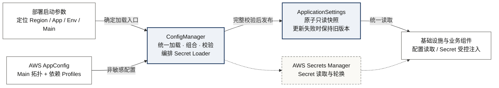

---
tags:
  - 技术架构
  - AWS-AppConfig
  - 配置管理
aliases:
  - AppConfig 统一配置架构
---

# AWS AppConfig 多 Profile 统一配置加载架构

> [!abstract] 一句话方案
> 部署环境只提供配置入口；Main Profile 声明依赖拓扑；`ConfigManager` 统一编排 Profile 与 Secret 的加载生命周期；业务模块只读取完整校验后原子发布的配置快照。




> [!tip] 全局心智模型
> AWS AppConfig 保存非敏感的期望状态；AWS Secrets Manager 保存凭证原文；`ConfigManager` 是进程内配置控制器；`ApplicationSettings` 是业务唯一可见的已发布状态。


## 1. 这个范式解决什么问题

多 Profile 的难点不在于“读取多个文件”，而在于保证业务始终看到一份完整、有效且版本一致的运行时配置。

如果各业务模块分别加载和缓存配置，会产生四类风险：

- 启动时只加载了部分依赖，进程却已经开始接收流量；
- 某个 Profile 更新后，业务读到新旧版本混合的中间状态；
- 每个模块各自维护 Session、轮询线程和失败策略；
- Secret 混入普通配置、日志或配置快照，扩大泄露面。

因此，系统需要在业务组件之外建立一层**进程内配置控制面**。它负责把多个外部来源收敛成一个只读快照，再向所有消费者提供统一读取边界。

## 2. 整体架构

整个架构分为四层：


| 层次    | 回答的问题       | 核心内容                                        |
| ----- | ----------- | ------------------------------------------- |
| 启动定位层 | 去哪里加载       | Region、Application、Environment、Main Profile |
| 外部来源层 | 配置与凭证存在哪里   | AWS AppConfig、AWS Secrets Manager、本地文件      |
| 配置控制层 | 如何形成有效运行时状态 | `ConfigManager`、Secret Loader、候选构建与原子发布     |
| 业务消费层 | 业务能读取什么     | `ApplicationSettings` 与统一读取入口               |


主链路只有一条：

```text
启动定位
  → 解析依赖拓扑
  → 加载 Profile 与注入 Secret
  → 构建完整候选
  → 解析、派生并校验
  → 原子发布只读快照
  → 业务统一读取
```

Secret 不与普通配置走同一条存储链路。Main Profile 只保存 Secret 引用，Secret Loader 根据引用从 AWS Secrets Manager 读取原文，再注入环境变量或受控临时文件。

`ConfigManager` 是这里的**统一加载器与生命周期编排器**。它管理 Profile 的加载、组合、轮询和快照发布，也负责启动和停止 Secret Loader。它不保存、不解释，也不对业务发布 Secret 值。

## 3. 组件职责与边界


| 组件                       | 职责                                       | 明确不负责                            |
| ------------------------ | ---------------------------------------- | -------------------------------- |
| 部署环境                     | 提供最小启动定位参数                               | 承载业务配置或 Secret                   |
| Main Profile             | 声明 Profile 引用与 Secret 引用，形成依赖拓扑          | 保存 Secret 原文                     |
| AWS AppConfig            | 保存和发布非敏感配置                               | 保证多个 Profile 同时生效                |
| AWS Secrets Manager      | 保存、授权访问并版本化 Secret                       | 组织普通业务配置                         |
| `ConfigManager`          | 加载 Profile、编排 Secret 注入、构建候选、校验、发布、轮询和关闭 | 向业务暴露 AWS Client 或 Secret 值      |
| Secret Loader / Watchdog | 读取并轮换 Secret，写入环境变量或临时文件                 | 组合或发布配置快照                        |
| `ApplicationSettings`    | 保存当前完整、有效、只读的配置快照                        | 访问 AWS、持有 Session 或执行轮询          |
| 统一读取入口                   | 向业务返回当前快照                                | 保存第二份配置状态                        |
| 业务模块                     | 定义领域 schema、约束和使用方式                      | 自行加载 AppConfig 或 Secrets Manager |


进程内只有一个 `ConfigManager`，但有两类更新机制：

```text
ConfigManager
  ├─ 多个 AppConfig Session：每个 Profile 一个
  ├─ 一条 Profile 轮询线程：依次检查所有 Profile
  ├─ 一个当前有效的 ApplicationSettings 快照
  └─ Secret Loader / Watchdog：独立轮换 Secret，由 Manager 编排生命周期
```

每个 Profile 必须使用独立 Session，因为 AppConfig Session 与具体 Profile 绑定。多个 Session 可以由同一条线程轮询，不需要为每个 Profile 创建线程。

> [!important]
> “只有一个配置管理器”不等于“整个进程只有一条后台线程”。Profile 轮询与 Secret 轮换解决不同问题，可以使用不同线程，但必须由同一个生命周期入口启动和停止。


## 4. 依赖拓扑如何形成

Main Profile 是配置依赖清单。它先被加载，再由 `ConfigManager` 解析出本进程需要的其他 Profile 和 Secret 引用。

```yaml
profiles:
  routing: routing.yaml
  feature_flags: feature-flags.yaml

secrets:
  - id: prod/service/api-key
    kind: env
  - id: prod/service/account
    kind: file
    env_var: SERVICE_ACCOUNT_FILE
```

依赖分为两类：


| 依赖                         | 生命周期  | 变更方式       |
| -------------------------- | ----- | ---------- |
| Profile 名、Secret 引用、Region | 启动拓扑  | 修改后滚动重启    |
| Profile 内容、Secret 版本       | 运行时状态 | 允许受控热更新或轮换 |


启动拓扑固定后，`ConfigManager` 才能稳定维护 Session、校验关系和资源生命周期。运行中如果 Main Profile 改变依赖集合，当前进程拒绝这次更新，并继续使用 last-known-good；新拓扑由滚动重启后的新进程加载。

### Profile 的拆分原则

只有一个判断标准：**配置能否独立发布、验证和回滚。**


| 配置关系            | 处理方式                               |
| --------------- | ---------------------------------- |
| 必须一起修改、验证和回滚    | 放在同一个 Profile                      |
| 具有独立发布节奏和权限边界   | 拆成不同 Profile                       |
| 只服务于可选能力        | 单独建 Profile，由 Main Profile 显式引用    |
| 密码、Token、服务账号凭证 | 存入 Secrets Manager，AppConfig 只保存引用 |


> [!important]
> 文件大小不是拆分依据。若 Profile A 发布后必须等待 Profile B 才能恢复可用，二者就没有形成真正独立的发布单元。


## 5. 配置生命周期


### 5.1 首次启动

```text
1. 校验启动定位参数
2. 创建 ConfigManager
3. 加载 Main Profile 并解析固定依赖拓扑
4. 根据 Secret 引用读取并注入凭证
5. 为每个依赖 Profile 创建独立 Session 并加载内容
6. 解析配置，构建索引、映射或 SDK typed config 等派生对象
7. 校验完整候选
8. 原子发布 ApplicationSettings
9. 启动 Profile 轮询和 Secret 轮换
10. Pod 进入 Ready
```

首次启动没有 last-known-good。任意必需 Profile 无法获取，或完整候选无法通过校验，进程都必须在接收流量前退出。

### 5.2 Profile 热更新

假设当前有效组合是：

```text
main v5 + routing v10 + feature v20
```

当 `routing v11` 到达时，`ConfigManager` 不直接覆盖当前字段，而是在内存中构建候选：

```text
main v5 + routing v11 + feature v20
```

随后只有两个结果：

```text
完整校验通过 → 一次替换当前 ApplicationSettings 引用
完整校验失败 → 丢弃候选，继续使用上一份有效快照
```

原子发布是进程内语义：读取者看到完整旧快照或完整新快照，不会看到逐字段修改的中间状态。它不表示 AWS AppConfig 能同时发布多个 Profile。

### 5.3 Secret 轮换

Secret Watchdog 按版本检查 AWS Secrets Manager。版本变化后，它只更新对应环境变量或临时文件，不把 Secret 写入 `ApplicationSettings`。

Secret 更新是否能立即被客户端使用，取决于下游对象是否缓存凭证。读取文件型凭证的客户端通常可以复用稳定路径；在构造时缓存 Token 的客户端需要重建或滚动重启。这个切换策略属于客户端生命周期，不能由配置快照替换自动保证。

### 5.4 进程关闭

统一关闭入口依次通知 Profile 轮询线程和 Secret Watchdog 停止，等待线程退出，并清理 Secret 临时文件。业务入口不自行管理这些后台资源。

## 6. 正确性约束与失败语义

这套架构成立依赖七条不变量：

1. 同一进程只有一个 `ConfigManager`。
2. 每个 Profile 拥有独立 AppConfig Session。
3. 依赖拓扑在启动时确定，运行中不局部改写。
4. 候选必须包含所有必需配置和派生对象。
5. 候选完整校验后才能原子发布。
6. 热更新失败时保留 last-known-good。
7. Secret 值不进入普通配置、快照和日志。


| 场景                     | 行为                                   |
| ---------------------- | ------------------------------------ |
| 启动定位参数缺失               | 创建 AWS Client 前退出                    |
| 必需 Profile 首次加载失败      | 启动失败，Pod 不进入 Ready                   |
| Secret 不可用且没有有效的受控回退   | 候选构建失败，阻止启动或更新                       |
| 配置解析、派生或校验失败           | 启动时退出；热更新时保留 last-known-good         |
| Profile 名或 Secret 引用变化 | 拒绝热更新，要求滚动重启                         |
| 合法内容更新                 | 构建完整候选后一次替换当前快照                      |
| 进程退出                   | 停止 Profile 轮询和 Secret Watchdog，并等待退出 |


日志只记录 Profile 名、版本、Secret ID 和错误类型。日志不得记录配置全文、Secret 原文或注入后的环境变量值。

## 7. 业务接入规范

业务模块只承担三个职责：

- 定义需要的配置字段与领域 schema；
- 定义跨字段、跨 Profile 的有效性约束；
- 通过统一入口读取解析后的配置快照。

业务模块不得自行创建 `AppConfigSessionClient`、Secrets Manager Client、轮询线程或第二份配置缓存。兼容旧接口时，旧 getter 也只能作为当前快照的薄 Adapter。

当前项目中的具象命名如下：


| 架构角色          | 项目实现                                         |
| ------------- | -------------------------------------------- |
| 启动定位模型        | `BootstrapSettings`                          |
| 统一加载器与生命周期编排器 | `ConfigManager`                              |
| 原子只读快照        | `ApplicationSettings`                        |
| 业务统一读取入口      | `get_settings()`                             |
| Secret 读取与轮换  | `hub_secrets.py` 中的 Secret Loader / Watchdog |


### 验收清单

- [ ] 同一进程只有一个 `ConfigManager`；
- [ ] Main Profile 能完整描述 Profile 与 Secret 引用；
- [ ] 每个 Profile 有独立 Session；
- [ ] 所有 Profile Session 共用一条配置轮询线程；
- [ ] Secret Manager 已作为独立来源接入，并由 Manager 编排生命周期；
- [ ] 所有必需配置通过完整校验后 Pod 才进入 Ready；
- [ ] 配置热更新失败时继续使用 last-known-good；
- [ ] Profile 名或 Secret 引用变化只能通过滚动重启生效；
- [ ] 业务模块只通过统一入口读取配置；
- [ ] Secret 值不进入 AppConfig、`ApplicationSettings` 和日志；
- [ ] 进程退出时 Profile 轮询线程与 Secret Watchdog 都能正常停止。
